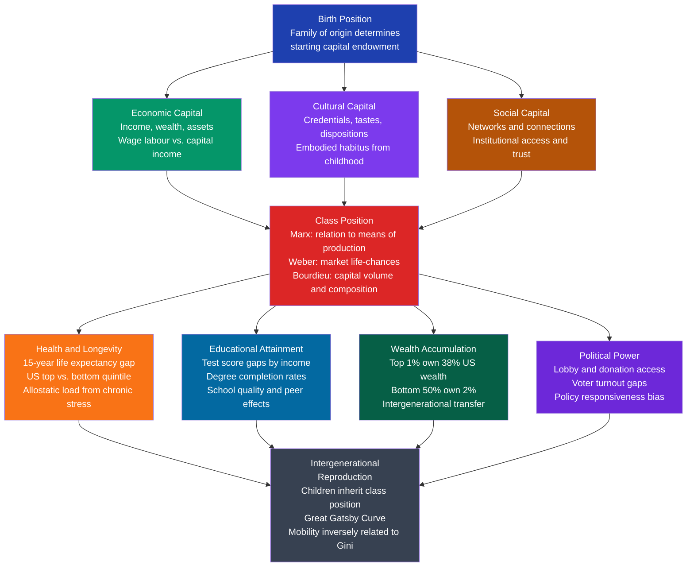

# Social Class and Stratification

> [!abstract] TL;DR
> Social stratification is the systematic, durable arrangement of society into hierarchical layers that differ in their access to resources, power, and prestige — and that reproduce themselves across generations. Three competing frameworks explain how it works: Marx reduces it to a binary defined by ownership of the means of production; Weber expands it to three independent dimensions (class, status, party); and Bourdieu shows that economic, cultural, and social capital combine with embodied dispositions (habitus) to reproduce advantage invisibly. Measuring inequality via the Gini coefficient and Lorenz curve reveals that wealth concentration — not just income — is the dominant force shaping life chances in the 21st century.

---

## Intuition

**Analogy:** Imagine a large hotel. Every guest uses the lobby, but some are assigned penthouses, some mid-floor standard rooms, and some basement windowless rooms. Your floor assignment isn't only about how much cash you brought today — it reflects which floor your parents stayed on (inherited capital), whether the staff recognized your dress and manner as belonging to the higher floors (cultural capital), and whether someone called ahead to upgrade you (social capital). Once assigned, you eat at different restaurants, meet different people, and develop different tastes — and those tastes make it more likely your children will be assigned the same floor. The hotel management insists the upgrade desk is open to all based on merit; the data on who actually gets upgraded tells a different story.

Social stratification is this dynamic operating at the scale of an entire society: a stable, self-reproducing hierarchy of unequal life chances that persists not primarily through overt coercion, but through institutions, culture, and the internalization of one's own position as natural.

---

## How It Works

### Core Mechanics

Stratification systems vary along two axes: (1) whether position is **ascribed** (fixed by birth — caste, feudal estate) or **achieved** (earned through individual effort — class); and (2) whether boundaries are **rigid** (endogamy, legal barriers) or **permeable** (mobility is at least formally possible).

Three historical types dominate the comparative record:

**Caste systems** (India, pre-modern Japan) assign individuals at birth to ritual-ranked, endogamous occupational groups. Mobility is structurally impossible and cosmologically sanctioned. India's varnas (Brahmin, Kshatriya, Vaishya, Shudra) and the "untouchable" Dalits outside them persisted for millennia — and substantial occupational and social residue remains despite legal abolition. The mechanism of reproduction is marriage rules, ritual pollution taboos, and economic segregation of occupations.

**Estate systems** (medieval Europe) allocated hereditary legal privileges. The three estates — clergy, nobility, and commoners — had formally different rights, tax obligations, and courts. Mobility was possible but narrow: exceptional individuals could enter the Church (which required celibacy and therefore left estates open at the margins), or buy land and claim noble status over generations. The French Revolution dismantled estates as a legal category without eliminating the economic hierarchy underneath.

**Class systems** (modern capitalism) define position primarily through economic relations — ownership, employment, income. They are formally open: no law bars a working-class child from attending university or becoming a CEO. The sociological question is why, despite formal openness, intergenerational class reproduction is so strong. The answer involves market mechanisms, differential access to education, cultural and social capital, and what Bourdieu calls the *unconscious complicity* of agents in their own reproduction.

### Flow / Architecture



---

## Key Concepts

### Secondary Level

**What is stratification, and why does it matter?**

Every known complex society divides people into groups that differ systematically in their access to three desiderata: **wealth** (economic resources), **prestige** (social honour and recognition), and **power** (the capacity to impose one's will). Stratification is not merely that some people have more than others — random inequality would be less consequential. It is that these differences are *systematic* (correlated with birth, race, gender), *durable* (stable over time), and *consequential* (they predict health, education, political participation, and longevity with remarkable precision).

The fundamental distinction is between **ascription** and **achievement** as the basis for ranking. In ascriptive systems (caste, nobility, racial apartheid), your rank is fixed at birth and cannot be changed through individual effort. In achievement-based systems (modern class societies), your position is formally tied to effort, skill, and merit. The sociological finding that disturbs meritocratic ideology is that in practice, all modern class societies show substantial ascriptive inheritance: family of origin is the single strongest predictor of educational attainment, occupational status, and income in every country studied.

**Four classical stratification systems:**

| System | Basis of rank | Mobility | Historical examples |
|--------|--------------|----------|---------------------|
| Slavery | Legal ownership of persons | Rare: manumission | Ancient Rome, antebellum US South |
| Caste | Birth, ritual purity | Structurally impossible | India, feudal Japan (eta/hinin) |
| Estate | Hereditary legal privilege | Limited: Church, purchased titles | Medieval Europe |
| Class | Economic position | Formally open; constrained in practice | Modern capitalist societies |

**Contemporary class categories (layperson's map):**

Even without a formal theory, most people use a rough map:
- **Upper class**: the wealthy — inherited fortunes, major asset holders, executives of major corporations. Constitutes perhaps 1–2% of the population but owns a disproportionate share of national wealth.
- **Upper-middle class**: professionals, managers, academics — with advanced degrees, significant income, and comfortable asset positions. The "professional-managerial class" of about 15–20%.
- **Middle class**: skilled and semi-skilled workers, small business owners — with modest income and limited assets. Aspirational, homeowning, squeezed.
- **Working class**: manual labourers, service workers — dependent on wages, no degree, precarious employment, renting not owning.
- **Underclass / poor**: those marginally or not attached to labour markets — long-term unemployed, welfare-dependent, homeless. Charles Murray's contested concept; William Julius Wilson's more empirically grounded "truly disadvantaged."

This folk classification is intuitive but theoretically weak — it conflates income, occupation, education, and wealth without explaining their relationship or dynamics. The theories below supply that framework.

---

### Undergraduate Level

**Marx's Two-Class Model**

Karl Marx's starting point is the question of who controls the means of production — the factories, land, and machinery through which a society produces its material needs. In capitalist society he identifies two fundamental classes:

- **Bourgeoisie** (capitalists): those who own the means of production. They do not need to sell their labour; they purchase the labour power of others and appropriate the surplus value those workers generate above their wages.
- **Proletariat** (workers): those who own nothing but their labour power and must sell it to survive. The wage they receive is the value required to reproduce their labour power (food, shelter, enough for basic needs) — less than the value they produce.

The gap between value produced and wage paid is **surplus value**, which the capitalist appropriates as profit. This is not fraud or theft in the legal sense — it operates through the normal exchange of the labour market. But it is the structural source of class antagonism: the interests of bourgeoisie and proletariat are fundamentally opposed. Marx predicted this antagonism would sharpen over time, immiserate the working class, and ultimately produce revolutionary class consciousness and the overthrow of capitalism.

The model is powerful in its simplicity and in its identification of the ownership relationship as foundational. Its limitation is binary rigidity: it struggles to explain the expanding middle class of managers, professionals, and small proprietors who are neither pure owners nor pure workers.

**Weber's Multidimensional Model**

Max Weber accepted Marx's insight that economic position matters but argued that stratification operates along three *independent* dimensions, each with its own logic:

1. **Class** (economic): market position and life chances — how one's position in the labour, commodity, and credit markets determines material outcomes. Weber agrees with Marx that ownership/non-ownership is central, but adds credit-worthiness, skills, and credentials as independent class-determining assets.

2. **Status** (social honour): the distribution of prestige and social esteem, expressed in lifestyle, consumption patterns, dress, neighbourhood, and social circles. Status groups share a common lifestyle and typically regulate membership through marriage conventions and exclusionary practices. Crucially, status is *not* reducible to class: a wealthy parvenu can have money but lack prestige; an impoverished aristocrat can have prestige without money. In the US South under Jim Crow, a poor white shared higher status with rich whites than with middle-class Black citizens.

3. **Party** (political power): organised collective action to achieve power within the political sphere. Parties, unions, lobbying groups, and social movements compete for the capacity to influence rules. Party power is partially derived from class and status but has its own logic.

Weber's model is more analytically flexible than Marx's and explains phenomena the binary class model cannot: why the Black middle class in the US faces racial status penalties that override class position; why aristocratic values persisted long after aristocratic wealth declined; why professional associations command deference beyond their economic weight.

**Davis-Moore Functionalist Thesis**

Kingsley Davis and Wilbert Moore's 1945 essay "Some Principles of Stratification" makes the controversial claim that inequality is *functionally necessary* for society. The argument:

1. Different positions in society are of different functional importance.
2. Some positions require scarce talents or long training.
3. To motivate talented people to endure long training and accept important but demanding positions, society must offer unequal rewards (income, prestige).
4. Therefore, a system of unequal rewards is a functionally necessary feature of any complex society.

The Davis-Moore thesis was instantly controversial and remains so. Melvin Tumin's critique (1953) identified the key weaknesses: functional importance is not objectively measurable (who decides that executives are more important than nurses?); the thesis ignores inheritance (if position is heritable, talent is not the mechanism at work); and it confuses what *is* with what *must be* (inequality may persist for reasons of power rather than function). The thesis also conflates unequal reward with the *degree* of inequality observed — even granting some differential is necessary, it provides no basis for current levels of extreme concentration.

**Bourdieu's Capital Framework**

Pierre Bourdieu's sociology of class, developed primarily in *Distinction* (1979) and *The Logic of Practice* (1980), is the most sophisticated account of how class reproduces itself in modern societies. Its core concepts:

**Capital** comes in three main forms:
- **Economic capital**: money, wealth, financial assets — convertible directly into other resources.
- **Cultural capital**: in three states: (a) *embodied* — durable dispositions of mind and body, tastes, and skills acquired through upbringing; (b) *objectified* — books, instruments, artworks that embody cultural knowledge; (c) *institutionalised* — educational credentials, degrees, and certificates that formally acknowledge cultural competence.
- **Social capital**: the network of durable social obligations, connections, and group memberships that can be mobilised for advantage.

These three forms are convertible into each other (money buys education; education opens social networks; networks enable business opportunities) but not perfectly and not instantly. The conversion takes time and strategy.

**Habitus** is the central explanatory mechanism. It is the system of durable, transposable dispositions — ways of perceiving, thinking, feeling, and acting — that agents acquire through early socialisation in a given class position. Habitus is not a rule system or a conscious strategy. It is the body and mind's accumulated adjustment to the conditions of existence, generating practices that are "objectively" appropriate to one's class situation without being consciously calculated. The child raised in a professional family develops, through thousands of small daily interactions, a relationship to language (elaborated code), to time (deferring gratification, planning), to the body (posture, accent, fitness regimes), and to culture (museum visits, classical music) that is immediately legible to interviewers, teachers, and employers as markers of class competence. The child raised in poverty develops different but equally coherent dispositions that close certain doors while opening others.

**The field** is the structured social arena — education system, labour market, cultural sphere, political field — within which agents compete using their capital. Each field has its own rules of the game; capital valuable in one field may be worth less in another.

**Symbolic capital** is any form of capital (economic, cultural, social) that is *misrecognised* as something else — as natural talent, merit, or intrinsic worth rather than as accumulated advantage. This misrecognition is not accidental — it is what makes inequality feel legitimate rather than arbitrary. Symbolic violence is the imposition of this misrecognition: the dominated collaborate in their own domination by accepting the rules of the game that disadvantage them.

**Wright's Neo-Marxist Class Map**

Erik Olin Wright (1985, 1997) preserved Marx's emphasis on exploitation while acknowledging that the binary model misses the complex middle ground. His solution was to identify *multiple exploitation mechanisms*:

- **Asset exploitation**: owning productive assets (Marxian class).
- **Organisation exploitation**: controlling scarce organisational assets (managers who coordinate complex labour processes appropriate part of the surplus this coordination generates).
- **Skill exploitation**: possessing scarce certified skills (credentialed professionals can extract a "skill rent" from employers competing for their competence).

This produces a 12-category class map anchored by three pure positions — capitalists (all three assets), workers (none), and petite bourgeoisie (own means of production, no employees, no credential rents) — with nine "contradictory class locations" combining different mixes. Expert managers are simultaneously exploiters (of organisation and skill) and exploited (by capitalists). This explains their ambiguous political affiliations: they have interests in both the preservation of market mechanisms and in welfare-state protections that stabilise the labour market they depend on.

**The Precariat (Standing)**

Guy Standing's *The Precariat: The New Dangerous Class* (2011) identifies a new class formation shaped by post-1980s labour market deregulation. The precariat is distinguished not just by low income but by the *character of its relation to labour and the state*:

- **No occupational identity**: work is contractual, temporary, stripped of narrative — the precariat cannot answer "what do you do?" with a stable occupational self-description.
- **No social contract**: lacking the entitlements (unemployment insurance, pensions, sick pay, employer-sponsored training) that the post-war industrial working class secured through union contracts and welfare state legislation.
- **Denizens, not citizens**: in the fullest sense, they lack full civil, cultural, social, political, and economic rights — particularly visible for migrants and gig workers.

Standing identifies three internal fractions: former working-class members who have fallen from stable industrial employment; educated youth burdened by debt and underemployed relative to their credentials; and migrants forced into precarious conditions by visa restrictions and labour market segmentation. The precariat is politically dangerous because its resentments can be captured by both left and right: the left speaks to its economic insecurity; the far right redirects its anxiety toward immigrants and cosmopolites.

**Measuring Inequality: Gini Coefficient and the Great Gatsby Curve**

The **Gini coefficient** is the most widely used scalar measure of income (or wealth) inequality. It equals twice the area between the Lorenz curve and the 45-degree line of perfect equality. Formally, if incomes are sorted from lowest to highest as $x_1 \le x_2 \le \ldots \le x_n$:

$$G = \frac{2 \sum_{i=1}^{n} i \cdot x_i}{n \sum_{i=1}^{n} x_i} - \frac{n+1}{n}$$

A Gini of 0 means perfect equality (all incomes identical); a Gini of 1 means total concentration (one person holds everything). Current OECD Gini values for disposable income range from approximately 0.25 (Denmark, Slovenia) to 0.49 (Mexico, Chile), with the US at ~0.39 — the most unequal among comparable rich democracies.

**Wealth inequality** is far more severe than income inequality, and this distinction matters enormously. Income is a flow (what you earn per year); wealth is a stock (what you own — financial assets, real estate, pension savings, minus debts). In the US, the top 1% of households by wealth own approximately 38% of total wealth, while the bottom 50% own less than 2%. The Federal Reserve's Distributional Financial Accounts show that the Gini for wealth (~0.85) is roughly twice that for income. Because wealth generates investment returns even without labour, wealth inequality compounds automatically — which is Piketty's r > g argument.

**The Great Gatsby Curve** (economist Miles Corak, 2013; named by Alan Krueger) shows an empirical regularity across countries: those with higher income inequality (higher Gini) tend to have *lower* intergenerational economic mobility (higher intergenerational earnings elasticity, IGE — the fraction of parental income advantage transmitted to the next generation). The Nordic countries show both low Gini (~0.25–0.28) and low IGE (~0.15–0.20, meaning about 15–20% of parental income advantage is inherited). The US shows high Gini (~0.39) and high IGE (~0.45–0.47). The mechanism: in high-inequality societies, the payoff to investing in children's education and connections is very high, parents at the top invest much more, and public education quality diverges dramatically by neighbourhood income — concentrating advantage and limiting upward mobility.

---

### Graduate Level

**Bourdieu's Distinction: Class Culture as Symbolic Domination**

*Distinction* (1979) is the empirical core of Bourdieu's sociology. Based on large-scale survey data in France, Bourdieu mapped cultural tastes — in music (Bach vs. popular dance), art (abstract vs. figurative), food, sports, home furnishing, and clothing — onto a two-dimensional space defined by total capital volume (vertical axis) and composition (horizontal axis: economic vs. cultural capital dominance). The key finding: tastes are not individual preferences but class-structured. Working-class aesthetics favour the functional, the immediate, the "realistic"; upper-class aesthetics favour the formal, the distanced, the "aesthetic" in the Kantian sense. These are not different points on a scale of sophistication — they are products of different conditions of existence.

Crucially, *distinction* is the social function of taste: marking and maintaining social distance. When a professional-class parent describes working-class taste as "vulgar" or "tasteless," they are not making an aesthetic observation but a social one — asserting their own position by negating another. The educational system institutionalises this: legitimate knowledge (classical literature, standard language, academic mathematics) is the cultural capital of the dominant class presented as universal and neutral, producing school failure that "blames the victim" (the student lacks ability) rather than recognising the class mechanism (the student lacks the specific cultural capital the school rewards).

**Lareau's Concerted Cultivation and Natural Growth**

Annette Lareau's *Unequal Childhoods* (2003) provides the most detailed ethnographic documentation of how class differences in parenting practices reproduce advantage. She observed middle-class and working-class families closely and identified two contrasting logics:

- **Concerted cultivation** (middle-class): children's development is an active project. Parents schedule multiple organised activities (music lessons, team sports, tutoring), engage children in extended verbal negotiation and reasoning rather than directives, and explicitly train children to interact confidently with authority figures (doctors, teachers). This produces children comfortable in institutional settings who can advocate for themselves.
- **Accomplishment of natural growth** (working-class and poor): parents provide safety and basic needs but allow children to organise their own leisure. Language use is more directive, less elaborative. Children develop rich social lives with peers and extended kin but lack practice interacting with institutional authority on equal terms.

The institutional payoff is asymmetric: schools, universities, employers, and medical offices all reward the interactional style produced by concerted cultivation. The child who negotiates with the paediatrician is better served medically; the child who asks the professor for an extension gets more educational support. Working-class children's "natural growth" is not inferior parenting — it is an adaptation to different conditions — but it transmits class disadvantage.

**Intersectionality and Class**

Patricia Hill Collins and Kimberlé Crenshaw's intersectionality framework argues that class, race, and gender are not additive but multiplicative axes of oppression that cannot be understood in isolation. A Black working-class woman faces disadvantages that cannot be decomposed into "Black disadvantage" + "working-class disadvantage" + "woman disadvantage" — they interact to produce specific forms of exclusion (e.g., from both white professional networks and Black male solidarity networks simultaneously).

For stratification theory, this matters because pure class analysis can miss race-based wealth gaps that persist even after controlling for income: the Black-white wealth gap in the US ($171,000 median white household wealth vs. $17,150 median Black household, 2019 Survey of Consumer Finances) reflects historical mechanisms — redlining, exclusion from the GI Bill, racialised labour market segmentation — that are not reducible to contemporaneous income differences. The Gini coefficient as conventionally computed conceals these within-income-category disparities.

**Piketty's Wealth Inequality Thesis**

Thomas Piketty's *Capital in the Twenty-First Century* (2014) provides the most comprehensive historical data on wealth inequality, covering 20+ countries over 200 years. His central finding: the 20th century's relative equality (Gini for wealth ~0.6 in postwar decades) was an anomaly produced by two World Wars, the Great Depression, and the redistributive institutions of the postwar welfare state. The underlying dynamics of market capitalism push toward increasing wealth concentration, summarised in the inequality $r > g$: when the net return on capital (r, typically 4–5%) exceeds the economy's growth rate (g, typically 1–2% in mature economies), capital shares of income rise over time and wealth concentrates at the top. Piketty projects that without policy intervention — specifically a progressive global wealth tax — the 21st century will see wealth concentration return to levels last observed in the Gilded Age or Belle Époque.

The sociological implications extend beyond economics: concentrated wealth translates into concentrated political influence (campaign finance, media ownership, revolving-door lobbying), which shapes policy in directions that further entrench wealth concentration — a feedback loop that requires political mobilisation, not merely economic reform, to interrupt.

**Class and the Social Determinants of Health (Marmot Studies)**

Michael Marmot's Whitehall studies of British civil servants (1967–1988, and follow-ups) produced one of sociology's most important empirical findings: health follows a continuous social gradient, not a threshold. Even among people who are all employed (civil servants, so no absolute deprivation), those one level lower in the occupational hierarchy die earlier and suffer more illness than those one level above them — at every level of the hierarchy. The gradient cannot be explained by absolute poverty (all are employed), lifestyle differences (these partially explain but do not fully account for the gradient), or healthcare access (NHS is universal). The key mechanism appears to be **psychosocial** — chronic stress from low control over one's work and life, social subordination, and blocked aspirations elevates cortisol, impairs immune function, accelerates cardiovascular disease, and shortens life.

The allostatic load concept (McEwen) formalises this: chronic activation of the stress response system from social adversity accumulates biological "wear and tear" across organ systems — cardiovascular, metabolic, immune, neurological — producing accelerated ageing. The life expectancy gap between the richest and poorest Americans is approximately 14–15 years for men and 10–11 years for women — a gap that has widened since the 1980s.

---

## Python Demo

```python
# Lorenz curves and Gini coefficients for five synthetic income distributions.
# Calibrated to approximate real-world country/era inequality levels.
# Shows how rising inequality in the US and the Nordic-US divergence are measured.
# Requires: numpy, matplotlib only.

import numpy as np
import matplotlib.pyplot as plt

rng = np.random.default_rng(seed=42)
N = 10_000

# Lognormal (mu, sigma) parameters calibrated to approximate real Gini values:
#   Nordic ~0.27, US 1970 ~0.35, US 2020 ~0.45, Brazil ~0.55
scenarios = {
    "Nordic 2020":  (10.6, 0.50),
    "Nordic 1980":  (10.5, 0.43),
    "US 1970":      (10.8, 0.64),
    "US 2020":      (11.0, 0.88),
    "Brazil 2020":  (9.8,  1.15),
}
colors = ["#0369a1", "#93c5fd", "#b45309", "#dc2626", "#7c3aed"]


def lorenz_xy(incomes: np.ndarray):
    """Compute (x, y) points for the Lorenz curve."""
    s = np.sort(incomes)
    cum = np.cumsum(s)
    x = np.arange(1, len(s) + 1) / len(s)
    y = cum / cum[-1]
    return x, y


def gini(incomes: np.ndarray) -> float:
    """Gini coefficient via the sorted-rank formula (exact for finite samples)."""
    s = np.sort(incomes)
    n = len(s)
    ranks = np.arange(1, n + 1)
    return float((2.0 * np.dot(ranks, s) - (n + 1) * s.sum()) / (n * s.sum()))


fig, axes = plt.subplots(1, 2, figsize=(14, 6))
ax1, ax2 = axes

# --- Panel 1: Lorenz curves ---
gini_vals = {}
for i, (label, (mu, sigma)) in enumerate(scenarios.items()):
    inc = rng.lognormal(mu, sigma, N)
    x, y = lorenz_xy(inc)
    g = gini(inc)
    gini_vals[label] = g
    ax1.plot(x, y, color=colors[i], lw=2.2, label=f"{label}  (G = {g:.3f})")

ax1.plot([0, 1], [0, 1], "k--", lw=1.3, label="Perfect equality (G = 0)")
ax1.fill_between([0, 1], [0, 0], [0, 1], alpha=0.04, color="gray")
ax1.set_xlabel("Cumulative share of population (poorest to richest)")
ax1.set_ylabel("Cumulative share of income")
ax1.set_title("Lorenz Curves: Income Inequality")
ax1.legend(fontsize=9, loc="upper left")
ax1.grid(alpha=0.3)

# Area between curve and equality line = Gini / 2
# Shade the area under the US 2020 curve to visualise the Gini area
us2020_inc = rng.lognormal(11.0, 0.88, N)
x_us, y_us = lorenz_xy(us2020_inc)
ax1.fill_between(x_us, y_us, x_us, alpha=0.12, color="#dc2626",
                 label="Gini area (US 2020)")

# --- Panel 2: Gini bar chart ---
labels_sorted = sorted(gini_vals, key=gini_vals.get)
vals_sorted = [gini_vals[lbl] for lbl in labels_sorted]
bar_cols = [colors[list(scenarios.keys()).index(lbl)] for lbl in labels_sorted]
bars = ax2.barh(labels_sorted, vals_sorted, color=bar_cols, zorder=3, height=0.55)
for bar, v in zip(bars, vals_sorted):
    ax2.text(v + 0.006, bar.get_y() + bar.get_height() / 2,
             f"{v:.3f}", va="center", fontsize=10, fontweight="bold")
ax2.set_xlabel("Gini coefficient  (0 = perfect equality  |  1 = total concentration)")
ax2.set_title("Gini Coefficients by Country/Era")
ax2.set_xlim(0, 0.75)
ax2.grid(axis="x", alpha=0.3)

fig.suptitle(
    "Income Inequality: Lorenz Curves and Gini Coefficients",
    fontsize=13, fontweight="bold"
)
plt.tight_layout()
plt.savefig("lorenz_gini.png", dpi=150, bbox_inches="tight")
plt.show()

# --- Income quintile shares and P90/P10 ratio ---
print(f"\n{'Scenario':<18} {'Q1 (%)':>8} {'Q2':>6} {'Q3':>6} {'Q4':>6} {'Q5':>6} {'P90/P10':>9}")
print("-" * 63)
for label, (mu, sigma) in scenarios.items():
    inc = np.sort(rng.lognormal(mu, sigma, N))
    total = inc.sum()
    q = N // 5
    shares = [inc[i * q:(i + 1) * q].sum() / total * 100 for i in range(5)]
    p10 = np.percentile(inc, 10)
    p90 = np.percentile(inc, 90)
    row = f"{label:<18} " + "".join(f"{s:>6.1f}" for s in shares) + f" {p90 / p10:>9.1f}x"
    print(row)
```

**Reading the output.** The Lorenz curve bows further below the equality line as inequality rises — the more bowed, the higher the Gini. The US 2020 curve shows that the bottom 50% of the income distribution receives roughly 10–12% of total income, while the top 20% receives about 50%. The Q5/Q1 quintile ratio and P90/P10 ratio capture what the Gini smooths over: how extreme is the gap between the very top and very bottom. Note that even the "Nordic 2020" synthetic scenario shows non-trivial inequality — no real society achieves a Gini below about 0.22. The model uses *income* distributions; real-world wealth distributions are substantially more concentrated, and would produce Lorenz curves with even deeper bows.

---

## Real-World Applications

> **Example 1 — US Wealth Concentration:** Federal Reserve Distributional Financial Accounts (2023) show the top 1% of US households own approximately 30–38% of total national wealth, while the bottom 50% own less than 2%. More striking is the racial wealth gap: median white household wealth is approximately $188,000 vs. $24,000 for Black households and $36,000 for Hispanic households. This gap persists even after controlling for income: a Black household earning the same income as a comparable white household accumulates significantly less wealth due to differential homeownership rates, access to employer pensions, and inherited capital.

> **Example 2 — The Great British Class Survey (2013):** Mike Savage and colleagues at the BBC used latent class analysis on a survey of ~160,000 respondents measuring economic, social, and cultural capital separately — explicitly applying Bourdieu's framework. Instead of three classes, they identified seven: Elite, Established Middle Class, Technical Middle Class, New Affluent Workers, Traditional Working Class, Emergent Service Workers, and Precariat. This seven-category scheme accounts for heterogeneity within traditional "working" and "middle" categories and identifies the Elite as a qualitatively distinct formation (very high on all three capital forms) and the Precariat (very low on all three). The study vindicated Bourdieu's multidimensional approach empirically.

> **Example 3 — Intergenerational Mobility in Nordic vs. Liberal States:** According to Miles Corak's cross-national data, a child born to a father in the bottom income quintile in Denmark has roughly a 12% chance of reaching the top quintile. The equivalent probability in the US is approximately 8%. More telling is the intergenerational earnings elasticity: about 0.15 in Denmark (15% of father's income advantage passed to son) vs. 0.45 in the US (45% passed on). The Nordic advantage reflects not genetic or cultural superiority but institutional design: universal early childhood education, compressed wage structures, high-quality universal public schooling, and universal healthcare eliminate the mechanisms through which US-style high inequality entrenches advantage.

> **Example 4 — India's Caste System after Legal Abolition:** India abolished the formal caste system and untouchability in its 1950 Constitution (Articles 15, 17) and introduced affirmative reservation for Scheduled Castes and Scheduled Tribes. Yet survey data consistently shows that: Dalits (Scheduled Castes) earn approximately 25–40% less than upper-caste Hindus after controlling for education; occupational segregation remains substantial (Dalits are disproportionately in sanitation, manual scavenging, agricultural labour); intermarriage rates across caste remain below 10% nationally; and Dalit children face documented discrimination in public schools. This demonstrates that formal legal abolition of ascriptive stratification does not eliminate its material consequences — the economic, social, and cultural capital disparities produced over centuries persist long after legal protections are enacted.

---

## Common Pitfalls

- **Conflating income with wealth.** Income is the annual flow of earnings; wealth is the accumulated stock of assets. A high-income physician who spends every dollar she earns is far less economically secure than a median-income heir who holds $2 million in diversified assets. Class analysis that relies only on income misses the fundamental importance of wealth as the basis for security, political power, and intergenerational transmission.

- **Treating class as purely economic.** Reducing class to income brackets misses Bourdieu's central point: habitus and cultural capital reproduce class position through mechanisms that are invisible to purely economic analysis. A working-class student who earns a scholarship to an elite university may have economic access but lacks the cultural capital (ease with networking, academic discourse, professional self-presentation) that their classmates accumulated since childhood — and may experience the institution as alien despite formal inclusion. Class analysis must include the cultural dimension.

- **The meritocracy illusion.** The sociological finding most resistant to intuition is that high-inequality societies with formally open class systems show *less* actual mobility than low-inequality societies with flatter wage structures. The belief that the US offers exceptional upward mobility ("American Dream") is empirically falsified: by intergenerational earnings elasticity, the US offers less mobility than Canada, Denmark, Sweden, Norway, Finland, Germany, or Australia. Meritocracy as ideology performs a legitimating function — it renders the outcomes of stratification as fair and deserved, inhibiting collective challenge.

- **Ignoring intersectionality.** Treating class as the only relevant axis of stratification produces distorted analysis. In the US, race and class are correlated but not identical — there is a substantial Black middle class, and there are poor whites. Analysing race as simply a proxy for class misses the independent effects of racial discrimination (hiring audits show resume-name discrimination controlling for qualifications), the racial wealth gap that persists after income-controlling, and the specific vulnerabilities of working-class Black, Latinx, and Indigenous communities that compound class disadvantage.

- **Assuming the precariat is just the old working class.** Guy Standing's point is that the precariat is structurally novel, not simply poor workers with a new name. Its defining feature is the *absence of a social contract* — not just low wages, but the stripping away of the entitlements (stable contracts, employer pensions, sick pay, union membership, occupational identity) that defined the industrial working class for a century. A 28-year-old with a postgraduate degree working on rolling six-month contracts, paying down student debt, unable to save for a deposit, and not building pension credits is in the precariat — their poverty is structural, not merely temporary.

- **The Davis-Moore tautology.** The functionalist argument that existing inequality reflects functional necessity proves too much: it justifies any observed distribution as the one required by social function, with no mechanism for distinguishing necessary from excessive inequality, or for explaining why "functionally equivalent" positions are rewarded so differently across societies with similar levels of development.

---

## Related Concepts

- [[Socialism_Marxism_and_Communism]] — provides the full theoretical context for Marx's class analysis: historical materialism, modes of production, surplus value, alienation, and Gramsci's extension of class domination into cultural hegemony; the present note applies the Marxist class model alongside Weber and Bourdieu.
- [[Welfare_States_and_Social_Policy]] — welfare states are the primary institutional mechanism through which market-generated class inequality is modified; Esping-Andersen's regime types determine whether welfare spending reproduces or reduces class stratification; decommodification directly affects class power in labour markets.
- [[Political_Economy_and_Market_State_Relations]] — varieties of capitalism (LMEs vs CMEs) produce systematically different levels of wage compression, union power, and income inequality; the institutional foundations of class structure are political-economic, not merely market outcomes.
- [[Globalization_and_Its_Discontents]] — globalisation's distributional effects include the "elephant curve" (Milanovic): rising incomes for global middle classes in China and India, stagnation for the developed-country working and lower-middle class, and rising incomes for the global top 1%; this remaps class stratification at the transnational scale.
- [[Development_Economics]] — poverty traps, institutional quality, and the developmental state literature address why class-like hierarchies between nations (core vs. periphery) persist; Piketty's wealth inequality thesis connects to development trajectories.
- [[Human_Capital_and_Education]] — the social investment approach to welfare treats education as the key mechanism for class mobility; the empirical evidence shows that educational attainment is itself class-determined (social reproduction), so education policy alone cannot break class stratification without addressing its economic and cultural roots.
- [[Tax_Policy]] — progressive income and wealth taxation are the primary fiscal instruments for compressing post-market class distributions; the politics of tax policy is inseparable from the politics of stratification — upper-class political power translates directly into tax policy favourable to capital income over labour income.
- [[Prejudice_and_Discrimination]] — class prejudice operates through many of the same social-psychological mechanisms as racial and gender prejudice: stereotyping, in-group favouritism, status attribution errors; class-based stigma ("chavs," "white trash," "welfare queens") performs the symbolic violence function Bourdieu identified.
- [[Stress_and_Coping]] — the Whitehall studies connect class position to allostatic load and chronic stress; lower control, lower status, and greater economic insecurity produce measurably higher cortisol, inflammatory markers, and cardiovascular disease; class is a primary social determinant of health.
- [[Maslows_Hierarchy]] — working-class and poor individuals spending most of their cognitive and financial resources meeting physiological and safety needs have less bandwidth for self-actualisation; Maslow's hierarchy maps onto class position, but his framework underestimates how class structures access to the safety and belonging needs it treats as universal.
- [[Happiness_and_Wellbeing]] — income predicts wellbeing strongly up to a threshold (approximately $75–$100k in 2010 US, recently revised upward by Killingsworth); beyond this, relative income (how you compare to your reference group) and autonomy at work are stronger predictors; class affects wellbeing not just through absolute resources but through status anxiety and sense of control.
- [[_MOC_Social_Stratification_and_Inequality|↑ Social Stratification MOC]] — section map linking all six notes on stratification, inequality, race, gender, and global development

---

## Review Questions

### Secondary

1. Your school says everyone has an equal chance of succeeding based on their effort and ability. A sociologist would say this is partly true but misses something important. What is it — and what concept (ascription, cultural capital, or intergenerational mobility data) best captures what is missing from the meritocracy story?
2. What is the difference between income inequality and wealth inequality? Why might a country have relatively low income inequality (moderate Gini) but still have extreme wealth concentration? Give a real-world example of a social class whose income appears modest but whose accumulated wealth substantially exceeds it.
3. What is the Gini coefficient? Sketch a Lorenz curve for a country with very high inequality and for one with very low inequality. What does the area between the curves and the equality line represent?

### Undergraduate

1. Marx and Weber both analyse class inequality but reach different conclusions about its structure and reproduction. Compare their frameworks on three dimensions: (a) the basis of class position, (b) whether class is one-dimensional or multidimensional, and (c) the mechanisms through which class differences reproduce over time. Which framework is more useful for understanding contemporary class dynamics — and why?
2. The Davis-Moore thesis claims that inequality is functionally necessary. State the argument clearly, then evaluate Tumin's three main objections. Does the thesis work as an explanation for why some inequality exists, or only for why it *persists*? What would a Bourdieusian say is missing from the functionalist account?
3. The Great Gatsby curve shows that countries with higher income inequality tend to have lower intergenerational mobility — a finding that challenges the popular idea that competitive market societies offer the most opportunity. Explain the mechanisms through which high inequality reduces mobility (at least three distinct pathways). What would the curve look like for wealth inequality rather than income inequality, and why?

### Graduate

1. Bourdieu argues that cultural capital and habitus reproduce class position through a process of symbolic violence in which the dominated participate in their own domination. Drawing on Lareau's concerted cultivation findings and Bernstein's linguistic codes, trace the specific mechanisms from early childhood socialisation through to educational credentials and labour market outcomes. At what points could policy interventions interrupt this chain — and why does Bourdieu suggest that purely redistributive policies (increasing poor families' income) are insufficient?
2. Standing's precariat is described as a "new dangerous class." Assess whether the precariat constitutes a genuinely novel class formation by Marxist, Weberian, and Bourdieusian criteria. In particular: does it have a distinct relationship to the means of production (Marx), distinct market life-chances (Weber), and a distinct habitus and capital composition (Bourdieu)? Or is it better understood as an old class — the proletariat — in new labour-market conditions?
3. Piketty's $r > g$ analysis and Wright's neo-Marxist class map both treat contemporary capitalism as producing systematic wealth concentration and class reproduction. Where do their analyses converge and where do they diverge? Piketty proposes a global progressive wealth tax as the remedy; a Wrightian Marxist might argue this is inadequate because it addresses distribution without addressing the underlying ownership structure. Evaluate both proposals: what political economy obstacles would each face, and is either achievable within existing democratic institutions?

---

## Sources

- [Pierre Bourdieu, *Distinction: A Social Critique of the Judgement of Taste* (1984, trans. Richard Nice), Harvard University Press](https://www.hup.harvard.edu/books/9780674212770)
- [Pierre Bourdieu, "The Forms of Capital" in *Handbook of Theory and Research for the Sociology of Education* (1986), ed. J. Richardson](https://www.marxists.org/reference/subject/philosophy/works/fr/bourdieu-forms-capital.htm)
- [Max Weber, *Economy and Society* (1922/1978), University of California Press — esp. "Class, Status, Party"](https://www.ucpress.edu/book/9780520035003/economy-and-society)
- [Erik Olin Wright, *Classes* (1985), Verso](https://www.versobooks.com/en-gb/products/1489-classes)
- [Guy Standing, *The Precariat: The New Dangerous Class* (2011), Bloomsbury](https://www.bloomsbury.com/uk/the-precariat-9781849664554/)
- [Thomas Piketty, *Capital in the Twenty-First Century* (2014), Harvard University Press](https://www.hup.harvard.edu/books/9780674430006)
- [Kingsley Davis and Wilbert E. Moore, "Some Principles of Stratification," *American Sociological Review* 10(2), 1945](https://www.jstor.org/stable/2085643)
- [Miles Corak, "Income Inequality, Equality of Opportunity, and Intergenerational Mobility," *Journal of Economic Perspectives* 27(3), 2013](https://www.aeaweb.org/articles?id=10.1257/jep.27.3.79)
- [Michael Marmot, *The Status Syndrome: How Social Standing Affects Our Health and Longevity* (2004), Times Books](https://www.bloomsbury.com/us/status-syndrome-9780805078541/)
- [Annette Lareau, *Unequal Childhoods: Class, Race, and Family Life* (2003), University of California Press](https://www.ucpress.edu/book/9780520239951/unequal-childhoods)
- [Mike Savage et al., "A New Model of Social Class?" *Sociology* 47(2), 2013 — BBC Great British Class Survey](https://journals.sagepub.com/doi/10.1177/0038038513481128)
- [Board of Governors of the Federal Reserve, *Distributional Financial Accounts* (2023)](https://www.federalreserve.gov/releases/z1/dataviz/dfa/distribute/chart/)

---

#Sociology #Stratification #SocialClass #Inequality #Bourdieu #Marx #Weber
