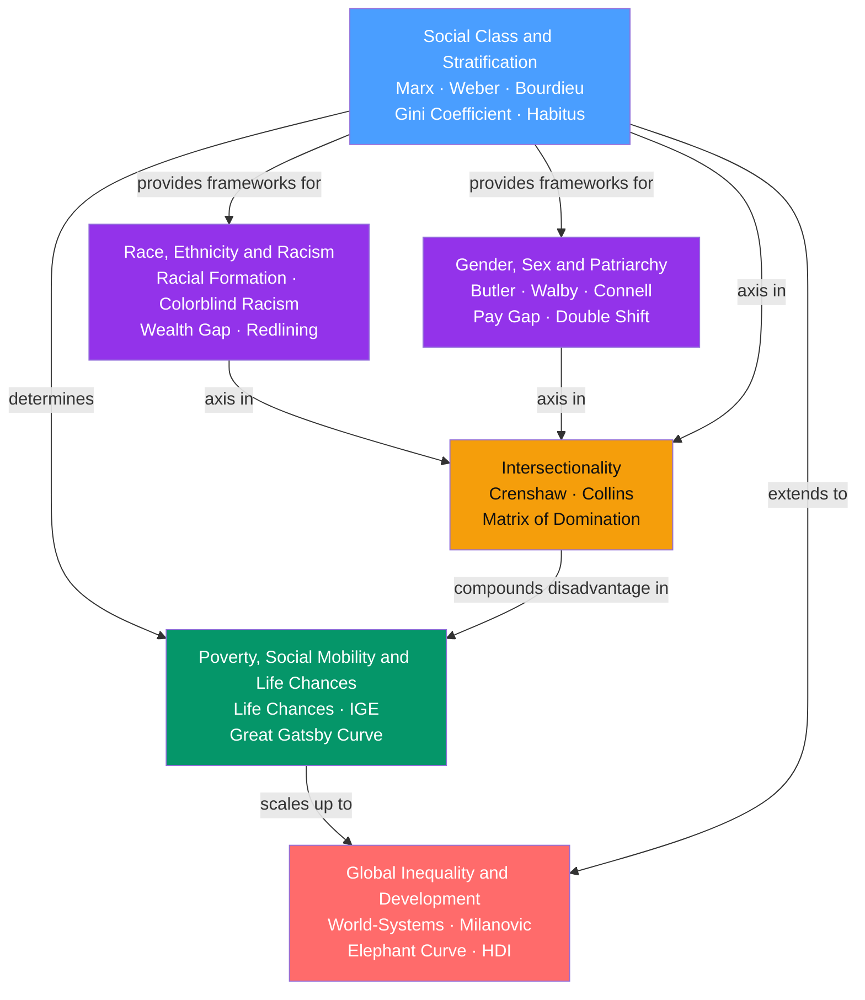

# Social Stratification and Inequality

> [!abstract] Section Overview
> This section examines how societies sort people into unequal hierarchies and why those hierarchies persist, reproduce, and compound across generations. It moves from foundational theories of class — Marx, Weber, and Bourdieu — through race and gender as structurally distinct axes of advantage and disadvantage, to intersectionality as the synthesis showing that those axes multiply rather than add. The final two notes zoom out: one to the concrete life outcomes stratification produces, and the other to the transnational scale where colonial history, world-systems, and global value chains determine which nations and classes capture growth.

---

## Concept Map

*(Blue = foundational entry point, Purple = primary axes of stratification, Amber = synthesis node, Green = life-outcome consequences, Red = advanced global scale; arrows = "leads to" or "requires")*

---

## Notes in This Section

| Note | Core Idea | Difficulty |
|------|-----------|------------|
| [[Social_Class_and_Stratification]] | Society is arranged in durable hierarchical layers shaped by economic, cultural, and social capital; Bourdieu's habitus and the Great Gatsby Curve explain why advantage reproduces invisibly across generations | Beginner–Advanced |
| [[Race_Ethnicity_and_Racism]] | Race is a social construction with entirely real material consequences; racism operates at individual, institutional, and cultural levels; colorblind racism is the dominant contemporary form | Beginner–Advanced |
| [[Gender_Sex_and_Patriarchy]] | Gender is a socially constructed performance built on top of biological sex; patriarchy sustains male dominance through ideology, the gendered division of labor, and institutional power | Beginner–Advanced |
| [[Intersectionality]] | Race, gender, and class are not additive but interlocking axes of power that produce qualitatively distinct forms of oppression at their intersections, invisible to single-axis analysis | Beginner–Advanced |
| [[Poverty_Social_Mobility_and_Life_Chances]] | Poverty is both absolute deprivation and relative social exclusion; Weber's life chances and the Great Gatsby Curve show how high inequality structurally forecloses intergenerational mobility | Intermediate |
| [[Global_Inequality_and_Development]] | Global inequality is structured and historically produced; dependency theory, world-systems theory, and Milanovic's elephant curve explain who wins and loses from globalization — and why | Intermediate–Advanced |

---

## Recommended Learning Path

1. [[Social_Class_and_Stratification]] — Start here. Marx, Weber, and Bourdieu provide the conceptual vocabulary that every subsequent note builds on. The Gini coefficient, life chances, and the Great Gatsby Curve all appear first here.
2. [[Race_Ethnicity_and_Racism]] — Extend the class framework to race as a structurally distinct axis. Learn how colorblind ideology perpetuates racial hierarchy without naming it, and how redlining created a wealth gap that compounds to this day.
3. [[Gender_Sex_and_Patriarchy]] — Add gender as a third independent axis. Butler's performativity and Walby's six structures of patriarchy complete the picture of how inequality is institutionally reproduced and individually internalized.
4. [[Intersectionality]] — Synthesize all three axes. Crenshaw and Collins show why single-axis analysis systematically fails to capture the harm at the intersection of race, gender, and class. This note requires comfort with the prior three.
5. [[Poverty_Social_Mobility_and_Life_Chances]] — See the concrete life-outcome consequences: poverty traps, blocked mobility, bandwidth scarcity. The Moving to Opportunity experiment and Nordic comparisons provide causal evidence for structural over cultural explanations.
6. [[Global_Inequality_and_Development]] — Zoom out to the world scale. Dependency theory, world-systems theory, and the elephant curve show how domestic stratification connects to colonial history, structural adjustment, and global value chain insertion.

---

## Key Themes

**Structure over individual agency**
Every note challenges the individual-failure explanation of inequality. Stratification is systematic, durable, and reproduced through institutions — school funding formulas, housing appraisal maps, hiring algorithms, global value chains — not primarily through individual choices or character deficiencies. The meritocracy narrative is itself a mechanism of reproduction.

**Social construction with real consequences**
Race, gender, and class are socially constructed categories that nonetheless produce entirely real outcomes in wealth, health, longevity, political power, and life chances. "Socially constructed" does not mean "unreal." Money is also a social construction; its consequences are not.

**Intergenerational reproduction**
The section's central puzzle: in societies that formally prohibit discrimination and endorse meritocracy, why do inequality patterns reproduce so robustly? Bourdieu's habitus, the Great Gatsby Curve, redlining's compounding interest, and colonial institutional persistence all answer the same question at different scales.

**Additive vs. multiplicative disadvantage**
Intersectionality's core methodological insight — that race, gender, and class disadvantages multiply rather than add — has implications across every note in the section. Single-axis analyses systematically underestimate harm at intersections and misidentify its mechanisms.

**History as structural present**
Contemporary inequality is not a natural equilibrium but the accumulated product of slavery, colonialism, redlining, structural adjustment, and unequal exchange. Acemoglu and Robinson's settler-mortality instrument shows that colonial institutional choices in the 18th century explain roughly 60 percent of cross-country income variation today.

---

## Key Questions This Section Answers

- Why do class positions reproduce across generations in societies that formally guarantee equal opportunity?
- What is the difference between race, ethnicity, and nationality — and why does collapsing these categories produce misleading social analysis?
- How does patriarchy sustain gender inequality without requiring individual men to consciously oppress women?
- Why does analyzing race or gender alone systematically miss the specific harm experienced by Black women and other multiply marginalized groups?
- What is the relationship between income inequality and intergenerational mobility — and what does the Nordic institutional model reveal about the causal mechanisms?
- Why do formerly colonized nations remain poor despite formal independence, and who actually captures the gains from economic globalization?

---

## Cross-Section Links

- [[_MOC_Sociology_Master]] — master entry to the full Sociology vault; this section provides the analytic core of stratification theory that recurs across social institutions, movements, and culture
- [[Prejudice_and_Discrimination]] — the psychological mechanisms of stereotyping, implicit bias, and aversive racism that operate at the individual level of all three primary axes; referenced by every note in this section
- [[Welfare_States_and_Social_Policy]] — the primary institutional mechanism for modifying market-generated class inequality; Esping-Andersen's regime typology explains the Nordic high-mobility model vs. the liberal low-mobility model
- [[Socialism_Marxism_and_Communism]] — the full political theory underlying Marx's class analysis; historical materialism and surplus value provide the intellectual foundation for Social Class and Global Inequality alike
- [[Development_Economics]] — the macroeconomic treatment of poverty traps, the Solow model, and the Washington Consensus that complements the sociological framing in Global Inequality and Development
- [[Globalization_and_Its_Discontents]] — the political economy of trade, distributional backlash, and Rodrik's trilemma; the Stolper-Samuelson theorem connects to Milanovic's elephant curve

---

#Sociology #MOC
