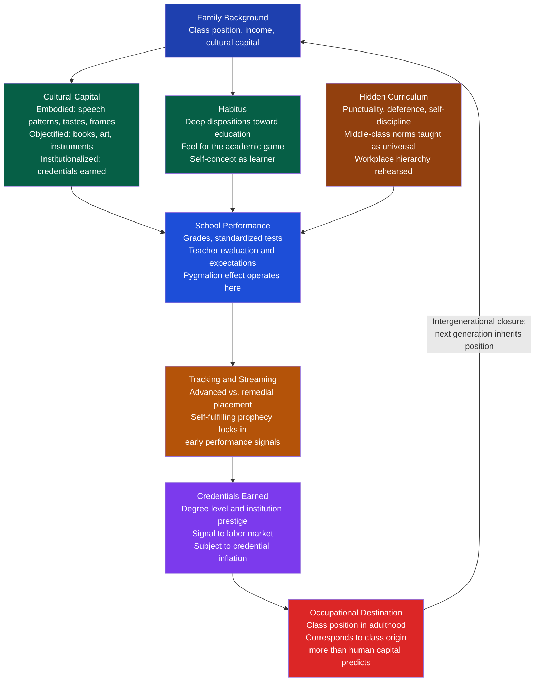

# Education and Social Reproduction

> [!abstract] TL;DR
> Education is simultaneously the primary institution for meritocratic mobility and the most efficient mechanism for reproducing class inequality across generations. Functionalists see schools as morally socializing and sorting students by ability; conflict theorists see schools as laundering inherited privilege as individual merit. Bourdieu's cultural capital theory, Bowles and Gintis's correspondence principle, and Collins's credentialism thesis together explain why, despite massive educational expansion, the correlation between social origins and educational outcomes remains stubbornly strong in virtually every society studied.

---

## Intuition

**Analogy:** Imagine a language contest where the rules, tasks, and scoring rubric are all written in French. Students who grew up speaking French at home arrive already fluent; students from other linguistic backgrounds must first decode the language of the contest before they can compete in it. The contest then ranks participants by performance and declares the winners "the most talented." No explicit discrimination occurred — and yet the outcome systematically favors those whose home culture matched the contest's hidden language.

This is Pierre Bourdieu's cultural capital argument in miniature. Schools do not merely transmit knowledge; they operate in a specific cultural register — middle-class speech norms, abstract reasoning styles, long-term orientation, familiarity with institutional rules — that children of professional families absorb through childhood socialization. When schools reward this register as "academic ability," they convert a social inheritance into an apparent natural gift. The reproduction of class inequality is thereby accomplished under the legitimate cover of meritocracy.

---

## How It Works

### Core Mechanics

Education's dual role emerges from competing accounts of what schools actually do:

1. **Socialization**: Schools transmit the shared values, norms, and cognitive frameworks that bind society together. For Durkheim, this is moral education — cultivating solidarity and a sense of duty to the collective. For Parsons, schools socialize children out of the particular norms of their family into the universalistic standards of adult society (achievement, specificity, neutrality).

2. **Selection and allocation**: Schools identify and sort individuals by ability and channel them into occupational roles appropriate to their capacities. Davis and Moore's functionalist stratification theory holds that this sorting is meritocratic — high-status positions go to the most talented, and education is the sorting mechanism.

3. **Cultural reproduction**: Schools operate within a cultural field dominated by the values and dispositions of the dominant class. Children who arrive with the right cultural capital — the right embodied dispositions, speech styles, and knowledge forms — are rewarded as if their advantage were innate. This converts class position from one generation into class position in the next, with education serving as the conversion mechanism.

4. **Credentialing**: Regardless of what education actually teaches, credentials function as positional goods in the labor market. As more people obtain a given credential, employers raise the minimum requirement — a process of credential inflation that benefits those with higher and more exclusive qualifications.

### Flow / Architecture



---

## Key Concepts

### Secondary Level

**What does education do? The functionalist answer.** Emile Durkheim argued that modern societies need schools to perform a task families cannot: instilling a common set of values, norms, and cognitive habits that make collective life possible. Without moral education — a shared sense of obligation to others, a commitment to social rules — society dissolves into anomie. For Durkheim, schools are not primarily about individual advancement but about producing citizens who feel bound to something larger than themselves.

Talcott Parsons extended this: schools are the *bridge institution* between the family (where rules are particular and ascriptive — your parents love you simply because you are their child) and adult society (where rewards are universalistic and achievement-based). Schools teach children to accept being judged by performance rather than kinship, and to apply impersonal standards to others and themselves. This socialization function is, for functionalists, as important as any academic content.

**The hidden curriculum.** Beyond the formal curriculum (algebra, grammar, history), schools teach a second curriculum through routine organization: show up on time, sit still, defer to authority, complete assigned tasks before preferred ones, do not question why the task matters. Philip Jackson's *Life in Classrooms* (1968) coined the term: the hidden curriculum prepares students — especially working-class students — for the rhythms and authority structures of industrial work. It is not the content of lessons but the form of schooling that transmits crucial class norms.

**Tracking and streaming.** Most large school systems divide students into ability-differentiated tracks — advanced, standard, and remedial in the US; grammar schools vs. secondary moderns in the UK; academic vs. vocational streams in Germany. The rationale is pedagogical efficiency: teach each student at the appropriate level. The sociological finding is more troubling: track placement is predicted by social class, race, and teacher expectation at least as strongly as by measured ability; once placed in a track, students rarely move up; and the content, quality, and expectations embedded in lower tracks systematically narrow future opportunities. The track functions as an early organizational seal on life chances.

### Undergraduate Level

**Bowles and Gintis: the correspondence principle.** Samuel Bowles and Herbert Gintis's *Schooling in Capitalist America* (1976) argued that the social relations of schooling *correspond* to the social relations of production. Working-class schools reward obedience, punctuality, and rule-following — exactly the traits required on the factory floor. Upper-class schools reward creativity, initiative, and the ability to navigate rules flexibly — exactly the traits required in managerial and professional roles. Schools do not accidentally reproduce class hierarchy; they are structurally organized to produce the right dispositions for each rung of the occupational hierarchy. The mechanism is not content but *organization*: who has authority, how decisions are made, what is rewarded and punished.

**Bourdieu and Passeron: capital, habitus, and field.** Pierre Bourdieu and Jean-Claude Passeron's *Reproduction in Education, Society and Culture* (1977) is the most sophisticated theoretical account of educational inequality. Three linked concepts:

- **Cultural capital** takes three forms. *Embodied* capital is internalized dispositions — the way one speaks, the cultural references one draws on, the body language and aesthetic sensibilities that signal class membership. *Objectified* capital is cultural goods — books, instruments, artworks. *Institutionalized* capital is academic credentials that formally certify cultural competence.

- **Habitus** is the system of durable, transposable dispositions produced by one's social conditions of existence. It is not a conscious strategy but a *feel for the game* — an internalized sense of what is possible, appropriate, and desirable for people like oneself. The working-class child who self-selects out of university application ("that's not for people like me") is expressing habitus, not calculating odds.

- **Field** is the structured social space in which competition for valued resources occurs. The educational field has its own logic and stakes; it is not neutral terrain but reflects and reinforces the cultural values of dominant groups.

The key claim: *misrecognition*. The educational system presents the evaluation of cultural capital as the evaluation of intellectual ability. Symbolic violence — the imposition of categories of thought and perception that legitimate existing hierarchies — operates when students from dominated classes accept their own failure as evidence of personal inadequacy rather than structural disadvantage. The system is violent not through coercion but through the imposition of a worldview that makes inequality appear natural.

**The Coleman Report.** James Coleman's 1966 *Equality of Educational Opportunity* study remains the most influential piece of empirical educational sociology ever conducted. Its central finding reversed what policymakers expected: school resources (per-pupil spending, teacher credentials, physical facilities) explained remarkably little of the variation in student achievement. What predicted achievement most powerfully was family background and, crucially, the socioeconomic composition of the student body. Students from poor families who attended schools with predominantly middle-class peers outperformed similar students in all-poor schools. This finding — both politically explosive and methodologically contested for decades — suggested that *social capital* (peer effects, aspirational norms, network connections) matters as much as or more than instructional resources.

**The Pygmalion effect.** Robert Rosenthal and Lenore Jacobson's *Pygmalion in the Classroom* (1968) experimentally demonstrated teacher expectation effects. They told teachers that specific students (selected randomly) had tested as "intellectual bloomers" likely to show dramatic academic gains. Those students did in fact show greater gains in IQ and achievement over the following year. The mechanism: teachers gave "bloomers" more attention, more challenging material, more feedback, and warmer emotional support. Teacher expectations become self-fulfilling prophecies. When tracking is combined with teacher expectations calibrated to track placement, a structural amplifier of small initial differences is created.

**Credentialism.** Randall Collins's *The Credential Society* (1979) offered a Weberian challenge to both human capital theory and meritocracy ideology. His empirical finding: educational credentials required for jobs in the US increased dramatically across the 20th century *without* corresponding increases in the actual skill requirements of those jobs. High-tech organizations in the 1960s had *lower* credential requirements than low-status organizations — contradicting the technological theory of education. Collins's explanation: credentials are weapons in status competition between occupational groups. Requiring degrees excludes competitors and raises the status and income of incumbents. Credential inflation results as groups try to maintain positional advantage by escalating their own credential requirements, driving up the minimum entry price for participation in desirable labor markets.

### Graduate Level

**Comparative education: Finland versus the United States.** Finland's PISA results — consistently among the world's highest since 2000 — offer a natural experiment in educational system design. Key contrasts with the US system are structural and sociological, not simply pedagogical:

| Dimension | Finland | United States |
|---|---|---|
| Teacher recruitment | Top 10% of graduates; highly selective | No consistent selectivity threshold |
| Tracking | Abolished at age 16; comprehensive until then | Begins in elementary school |
| Standardized testing | Minimal until university entrance | NCLB/high-stakes tests from early grades |
| School funding | Nationally equalized | Property-tax based; highly unequal |
| Early childhood | Universal public pre-K; high quality | Patchwork; quality highly unequal |
| Special needs | Integrated, not segregated | Separately tracked in many districts |
| Teacher autonomy | High; curriculum guidelines, not scripts | Low in high-accountability regimes |

The Finnish model reflects a sociological principle: when you reduce the variance in school quality (by funding schools equally and eliminating low-quality options), the correlation between social origins and educational outcomes weakens. You cannot reproduce inequality through differential school quality if schools do not differ dramatically in quality. This is the structural design insight that human-capital-only framings miss.

**Social mobility and the reproduction paradox.** The persistent empirical finding is that educational expansion does not, by itself, reduce the association between social origins and educational destinations. Raftery and Hout's *maximally maintained inequality* (MMI) hypothesis predicts that when near-universal access to a level of education is achieved by higher social classes, they move on to the *next* level, maintaining relative advantage. Effectively equalizing access to high school has not equalized outcomes, because the competition has shifted to college; equalizing college access shifts competition to elite institutions; equalizing elite access shifts it to graduate and professional degrees. The escalator of credential inflation means that absolute mobility (more people getting more education) can coexist with stable or even increasing relative immobility (the correlation between origin and destination).

Lucas's *effectively maintained inequality* (EMI) hypothesis extends this: even *within* credential levels, qualitative differentiation maintains inequality. A degree from a research university and a degree from a for-profit college are formally the same credential but systematically different assets. The dominant class maintains advantage not just by getting more education but by getting *better* education within each level.

**Intersectionality and the limits of class-only analysis.** Bourdieu's framework is powerful but was developed primarily with class and gender in mind, with race treated as secondary. Feminist scholars (Diane Reay, Pat Thane) have shown that the forms of capital that matter in educational fields are also gendered: emotional labor, social connections, and care work are not included in Bourdieu's schema even though they substantially shape women's educational trajectories. Critical race theorists argue that racialized cultural capital operates separately from class capital: middle-class Black students still encounter racial stereotyping and structural disadvantage that middle-class white students do not. Any complete sociology of educational inequality must integrate race, class, gender, and their interactions.

**Post-credentialism and alternative pathways.** The 2020s have seen the first serious institutional challenge to credential inflation in decades: major US corporations (including Google, Apple, IBM, and most of the Fortune 500 by 2023) dropped four-year degree requirements for many roles, citing the poor signal-to-noise ratio of credentials. This reflects the Spence signaling model's prediction: when a signal becomes very cheap (widespread) and noisy (poor predictor of actual competence), employers search for alternative signals — portfolio work, bootcamp certificates, skills assessments, and on-the-job track records. Whether this represents a genuine decredentialization or merely a new tier of positional competition (elite credentials versus generic ones) remains an open empirical question.

---

## Python Demo

```python
# Model credential inflation over time.
# As a credential becomes widespread, its wage premium erodes via supply-demand dynamics.
# Demand growth (SBTC - skill-biased technological change) partially offsets supply growth
# but cannot reverse the structural decline when credential becomes near-universal.
# Shows decreasing marginal returns to education as a positional good.
# Data are stylized (US-calibrated) — illustrate mechanism, not precise empirical claims.

import numpy as np
import matplotlib.pyplot as plt

rng = np.random.default_rng(seed=42)

years = np.arange(1970, 2025, 1)

# Credential attainment rates (share of adult population, US-stylized)
# High school: ~75% in 1970 → ~92% in 2024
hs_rate = 0.75 + (0.92 - 0.75) * (1 - np.exp(-0.045 * (years - 1970)))
# College degree (BA+): ~11% in 1970 → ~38% in 2024
college_rate = 0.11 + (0.38 - 0.11) * (1 - np.exp(-0.038 * (years - 1970)))
# Graduate degree: ~4% in 1970 → ~14% in 2024
grad_rate = 0.04 + (0.14 - 0.04) * (1 - np.exp(-0.032 * (years - 1970)))

# Demand growth factor: skill-biased technological change raises demand for credentials
# 0.7% annually — partially offsets supply expansion but cannot prevent premium erosion
demand_growth = 1.0 + 0.007 * (years - 1970)

# Wage premium model:
#   premium(t) = base_premium * demand_growth(t) / (1 + k * supply_rate(t))
# When supply_rate → 0: premium → base_premium * demand_growth (theoretical max)
# As supply_rate rises, denominator grows, premium falls
# k parameter: how sensitive the premium is to supply (higher k = faster erosion)

hs_base = 1.50       # 50% premium over no-degree when HS is rare
college_base = 1.80  # 80% premium over HS when college is rare
grad_base = 1.60     # 60% premium over BA when graduate degree is rare

k_hs = 5.5
k_college = 3.8
k_grad = 3.0

hs_premium = hs_base * demand_growth / (1 + k_hs * hs_rate)
college_premium = college_base * demand_growth / (1 + k_college * college_rate)
grad_premium = grad_base * demand_growth / (1 + k_grad * grad_rate)

# Normalize to 1970 = 1.0 to show relative trajectory clearly
hs_prem_norm = hs_premium / hs_premium[0]
college_prem_norm = college_premium / college_premium[0]
grad_prem_norm = grad_premium / grad_premium[0]

fig, axes = plt.subplots(1, 3, figsize=(16, 5))

# Panel 1: Attainment rates — the credential expansion
ax1 = axes[0]
ax1.plot(years, hs_rate * 100, color="#b45309", linewidth=2, label="High School")
ax1.plot(years, college_rate * 100, color="#2563eb", linewidth=2, label="College (BA+)")
ax1.plot(years, grad_rate * 100, color="#7c3aed", linewidth=2, label="Graduate Degree")
ax1.fill_between(years, 0, hs_rate * 100, alpha=0.06, color="#b45309")
ax1.fill_between(years, 0, college_rate * 100, alpha=0.06, color="#2563eb")
ax1.fill_between(years, 0, grad_rate * 100, alpha=0.06, color="#7c3aed")
ax1.set_xlabel("Year")
ax1.set_ylabel("Adult Population Share (%)")
ax1.set_title("Credential Expansion Over Time\n(US-Stylized, 1970–2024)")
ax1.legend(fontsize=9)
ax1.grid(alpha=0.3)
ax1.set_ylim(0, 100)

# Panel 2: Normalized wage premiums — the erosion
ax2 = axes[1]
ax2.plot(years, hs_prem_norm, color="#b45309", linewidth=2, label="HS premium (vs. no degree)")
ax2.plot(years, college_prem_norm, color="#2563eb", linewidth=2, label="College premium (vs. HS)")
ax2.plot(years, grad_prem_norm, color="#7c3aed", linewidth=2, label="Grad premium (vs. BA)")
ax2.axhline(1.0, color="gray", linestyle="--", linewidth=1, alpha=0.7, label="1970 baseline")
ax2.set_xlabel("Year")
ax2.set_ylabel("Wage Premium (1970 = 1.0)")
ax2.set_title("Declining Marginal Returns\nto Each Credential Level")
ax2.legend(fontsize=8)
ax2.grid(alpha=0.3)

# Panel 3: Supply vs. premium — the inflation curve
ax3 = axes[2]
sc = ax3.scatter(
    college_rate * 100, college_premium,
    c=years, cmap="plasma", s=28, zorder=3
)
cbar = plt.colorbar(sc, ax=ax3)
cbar.set_label("Year", fontsize=9)
# Annotate key years
for yr, label in [(1970, "1970"), (1990, "1990"), (2010, "2010"), (2024, "2024")]:
    idx = yr - 1970
    ax3.annotate(
        label,
        xy=(college_rate[idx] * 100, college_premium[idx]),
        xytext=(college_rate[idx] * 100 + 0.5, college_premium[idx] + 0.02),
        fontsize=8, color="#1e293b"
    )
ax3.set_xlabel("Adults with College Degree (%)")
ax3.set_ylabel("College Wage Premium (ratio)")
ax3.set_title("Credential Inflation Curve:\nSupply Rises → Premium Falls")
ax3.grid(alpha=0.3)

fig.suptitle(
    "Credential Inflation: As Education Spreads, Each Credential Buys Less\n"
    "(Collins: degrees become minimum requirements; relative advantage shifts to higher tiers)",
    fontsize=11, fontweight="bold", y=1.03
)
plt.tight_layout()
plt.savefig("credential_inflation.png", dpi=150, bbox_inches="tight")
plt.show()

# Print summary statistics
print(f"\n{'Credential':<12} {'1970 premium':>14} {'2024 premium':>14} {'Change':>10}")
print("-" * 52)
for name, series in [("HS", hs_premium), ("College", college_premium), ("Graduate", grad_premium)]:
    pct_change = (series[-1] / series[0] - 1) * 100
    print(f"{name:<12} {series[0]:>14.3f} {series[-1]:>14.3f} {pct_change:>9.1f}%")

print("\nKey finding: HS premium collapses fastest (near-universal attainment).")
print("College premium falls as BA becomes a baseline requirement, not a distinction.")
print("Graduate premium is most durable — but erodes as grad enrollment expands.")
```

**Reading the output.** All three credential levels show declining premiums relative to their 1970 level, despite demand growth from technological change. High school's premium collapses fastest because attainment approaches universality, making the credential nearly worthless as a differentiator. The college premium declines as a BA becomes the expected baseline for any white-collar role. The inflation curve (Panel 3) traces the downward path: as the share of degree-holders rises, the premium it commands falls. This is credential inflation as a positional competition: everyone tries to stay ahead by getting more education, and the collective result is that the floor rises without anyone gaining ground relative to their peers — exactly Collins's thesis.

---

## Real-World Applications

**1. The SAT as a cultural capital test.** The Scholastic Aptitude Test was designed to identify intellectual talent independent of social background — the meritocratic ideal in instrument form. Decades of data show that SAT scores correlate strongly with family income, with each $20,000 increment in family income associated with roughly 12 additional points on average. The test does not measure "raw" aptitude in any culture-neutral sense; it measures familiarity with the specific vocabulary, reasoning styles, and cultural frames that middle- and upper-class families transmit through childhood socialization, private tutoring, and test-prep courses. This is Bourdieu's cultural capital made quantitative. The consequence: elite universities that rely on SAT scores reproduce the class structure under the language of cognitive meritocracy.

**2. Finland's comprehensive school reform.** Finland abolished ability-tracked streaming and the parallel academic/vocational elementary systems in the 1970s, converting to a fully comprehensive nine-year basic school. It simultaneously equalized school funding, raised teacher training to an all-master's-degree profession, and introduced national curricula with local flexibility. The result across two decades was a dramatic compression of the variance in educational outcomes — both between schools and between social-class groups — while average performance rose. Finland's PISA 2000 results shocked international observers; the shock was not that Finnish students scored high but that the gap between the lowest and highest performers was the narrowest in the OECD. This demonstrates that structural design — not merely individual effort or natural ability — determines educational outcomes at the systemic level.

**3. US school funding and resource disparities.** American public schools are primarily funded through local property taxes — a design that ensures schools in wealthy areas receive dramatically more per-pupil funding than schools in poor areas. The Fordham Foundation estimated that per-pupil spending differentials of 3:1 or greater between wealthy and poor districts were common. This structural mechanism directly converts residential segregation by income (itself a product of housing market dynamics and historical discrimination) into educational inequality. Coleman's finding that school resources matter less than peer composition does not refute this: if family socioeconomic status is the primary driver, a funding system that concentrates wealthy peers in well-funded schools and poor peers in under-resourced schools doubly disadvantages low-income students.

**4. The UK grammar school system.** England's tripartite secondary education system (1944–1970s) sent students to grammar schools (academic), secondary moderns (vocational), or technical schools based on the eleven-plus exam at age 11. The sociological evidence on the eleven-plus was damning: its results tracked socioeconomic background almost as closely as they tracked measured ability. Children of professional families were dramatically over-represented in grammar schools; working-class children of equivalent tested ability were streamed into secondary moderns. The system was formally meritocratic — a competitive exam — and substantively reproductive. Most of England abolished selection at 11 in the comprehensive school reforms of the 1960s–70s; a minority of local authorities retained grammar schools. Subsequent research consistently finds grammar school areas have greater educational inequality overall, despite (or because of) the cream-skimming of high-ability students.

---

## Common Pitfalls

- **Conflating human capital theory and credentialism** — these are competing, not complementary, theories. Human capital theory (Becker, Mincer) holds that education raises productivity and wages reflect this genuine skill acquisition. Credentialism (Collins) holds that education raises credentials that function as positional goods regardless of skill acquisition. Much policy debate assumes the former while empirical evidence is consistent with a significant role for the latter. Spence's signaling model offers a third position: education signals pre-existing ability without necessarily creating it.

- **Treating cultural capital as fixed** — Bourdieu's concept is often misread as a static trait that determines outcomes mechanically. Habitus is not destiny: it can be partially transformed through sustained engagement with a different field, through conscious reflexivity, and through structural changes in what forms of capital are institutionally valued. First-generation college students who succeed demonstrate that habituses are not prison sentences, though the evidence also shows they face substantially more friction than students whose family habitus already matches university culture.

- **Assuming tracking is educationally neutral** — tracking's pedagogical rationale (teach each student at the right level) is plausible in principle. The empirical problem is that track placement is substantially predicted by race, class, and teacher expectations rather than ability alone; that lower tracks consistently offer inferior instructional quality; and that the self-fulfilling prophecy mechanisms documented by Rosenthal and others mean that track placement shapes the trajectory it was meant only to reflect. Tracking creates the inequality it claims to be responding to.

- **Confusing reproduction with determinism** — conflict theories of education are sometimes read as claiming that class origins fully determine educational outcomes, making any mobility impossible. This misreads the argument. Reproduction theories claim that the *correlation* between origins and destinations is stronger than meritocratic ideology implies — not that it is perfect. Substantial mobility occurs in every society; the sociological finding is that the correlation is much higher than chance, much higher than human capital theory predicts, and much more structurally produced than ideology acknowledges.

- **Ignoring peer effects** — Coleman's most actionable finding (that peer composition matters enormously) tends to be underutilized in educational policy because its implications (compulsory integration, busing, zoning reform) are politically difficult. Focusing on teacher quality or school resources while leaving residential segregation intact addresses a secondary cause while leaving the primary structural mechanism untouched.

- **Applying Bourdieu in cultural universalist terms** — Bourdieu developed his theory in 1960s–70s France, a specific national educational field. The forms of cultural capital that dominate educational fields differ across societies: Confucian educational capital in East Asian contexts; religious capital in contexts where denominational schools are central; racial capital in societies where whiteness itself functions as a form of inherited advantage. Applying the framework requires translating its core logic, not its specific empirical content.

---

## Related Concepts

- [[_MOC_Social_Institutions|↑ Social Institutions MOC]] — Section map for all Social Institutions notes
- [[Human_Capital_and_Education]] — the Mincer/Becker framework treats education as genuine productivity investment; Bourdieu and Collins challenge this, arguing credentials are partly positional goods whose returns reflect status competition as much as skill acquisition. The two frameworks are in ongoing empirical tension.
- [[Signaling]] — Spence's job market signaling model provides the microeconomic formalization of credentialism: degrees may raise wages by signaling pre-existing ability (via the single-crossing condition) without improving productivity, which is exactly Collins's sociological claim rendered in game theory.
- [[Welfare_States_and_Social_Policy]] — social investment welfare states (Nordic model) reframe education as productive investment rather than passive redistribution; the social democratic case for universal early childhood education and lifelong learning draws on both human capital theory and the structural equality argument of comparative education research.
- [[Development_Economics_and_Political_Development]] — development economics debates the returns to education spending in low-income countries and the relationship between educational access, human capital accumulation, and institutional quality; the social reproduction lens adds the caution that expanding access without addressing cultural capital inequality may reproduce stratification at higher credential levels.
- [[Prejudice_and_Discrimination]] — stereotype threat (Steele and Aronson) operates in educational settings when stigmatized-group members fear confirming negative stereotypes, impairing performance independently of ability; this psychological mechanism runs parallel to Bourdieu's habitus in explaining why structural disadvantage manifests as individual performance gaps.
- [[Piagets_Cognitive_Development]] — Piaget's constructivist theory of cognitive development underpins progressive pedagogy; Vygotsky's competing emphasis on social transmission and the Zone of Proximal Development is more consistent with social reproduction theory's claim that learning is always socially and culturally mediated.
- [[Theories_of_Motivation]] — self-determination theory's distinction between intrinsic and extrinsic motivation intersects with hidden curriculum analysis: schooling organized around external reward structures (grades, rankings, credentials) may crowd out intrinsic motivation for learning, particularly in lower tracks where the curriculum offers little autonomy or interest.
- [[Public_Opinion_and_Political_Socialization]] — schools are a primary site of political socialization, transmitting civic values, national identity narratives, and political norms; the hidden curriculum's transmission of deference to authority is a specifically political as well as economic socialization outcome.
- [[Development_Economics]] — the Mankiw-Romer-Weil finding that human capital explains ~80% of cross-country income variance is the macroeconomic counterpart to educational sociology; the social reproduction critique asks whether measured schooling quantity captures genuine skill or merely credential attainment, and whether returns to education reflect productivity or market power.

---

## Review Questions

### Secondary

1. A friend argues that education is a level playing field — everyone can succeed if they work hard enough. Using the concepts of cultural capital and the hidden curriculum, explain two ways that schools may systematically advantage students from middle-class backgrounds before they even open a textbook.
2. What is tracking, and why do sociologists argue it can become a self-fulfilling prophecy? Use the Pygmalion effect in your answer.
3. Durkheim and Bowles/Gintis both say schools prepare students for adult society — but they evaluate this very differently. What is each side's claim, and what would each theorist say about a school that heavily emphasizes obedience and punctuality?

### Undergraduate

1. Distinguish between Bourdieu's concepts of embodied, objectified, and institutionalized cultural capital. For each form, give one concrete mechanism through which it advantages children of professional-class families in school. How does the concept of misrecognition explain why this advantage is not widely perceived as structural?
2. Bowles and Gintis's correspondence principle predicts that working-class schools emphasize obedience and middle-class schools emphasize autonomy. What empirical evidence would you need to test this claim? What alternative explanations would a human capital theorist offer for the same pattern of school differences?
3. The Coleman Report found that school resources (funding, teacher credentials) explained less student achievement variance than family background and peer composition. Evaluate the policy implications: does this mean funding equality is pointless, or does it point toward different kinds of structural interventions? What additional evidence since 1966 complicates or confirms Coleman's finding?

### Graduate

1. Raftery and Hout's maximally maintained inequality hypothesis and Lucas's effectively maintained inequality hypothesis both predict that educational expansion does not reduce relative class inequality in educational destinations — but through different mechanisms. Explain the difference between the two mechanisms and design an empirical test that would distinguish them using data from a country that has recently expanded access to higher education (e.g., China post-1999 or Chile post-2006).
2. Bourdieu's theory of cultural capital has been criticized on three grounds: (a) it is circular (cultural capital is defined by what schools reward, which is defined by what dominant groups possess); (b) it is empirically hard to operationalize and measure independently of outcomes; (c) it ignores the role of race as a distinct dimension of capital. Evaluate each criticism. Does the framework survive these critiques, need revision, or require replacement?
3. Finland achieves PISA scores near the top of the OECD with near-zero tracking, equalized funding, and high-status teaching as a profession. The United States achieves mediocre average PISA scores with extreme tracking, unequal funding, and mixed-status teaching. How would a functionalist, a Bourdieusian conflict theorist, and a human capital economist each explain this difference — and what policy interventions would each prescribe? Which explanation and prescription do you find most empirically defensible, and why?

---

## Sources

- [Pierre Bourdieu & Jean-Claude Passeron, *Reproduction in Education, Society and Culture* (1977)](https://uk.sagepub.com/en-gb/eur/reproduction-in-education-society-and-culture/book202397)
- [Samuel Bowles & Herbert Gintis, *Schooling in Capitalist America* (1976)](https://www.basicbooks.com/titles/samuel-bowles/schooling-in-capitalist-america/9780465097647/)
- [Randall Collins, *The Credential Society* (1979; reissued 2019, Columbia University Press)](https://cup.columbia.edu/book/the-credential-society/9780231192354/)
- [James S. Coleman et al., *Equality of Educational Opportunity* (Coleman Report, 1966, US Dept. of Education)](https://eric.ed.gov/?id=ED012275)
- [Robert Rosenthal & Lenore Jacobson, *Pygmalion in the Classroom* (1968)](https://www.taylorandfrancis.com/books/mono/10.4324/9780203754481/pygmalion-classroom-robert-rosenthal-lenore-jacobson)
- [Aaron Pallas, "Social Reproduction", in *The Sociology of Education: A Critical Reader*, ed. Alan Sadovnik (2011)](https://www.routledge.com/The-Sociology-of-Education-A-Critical-Reader/Sadovnik/p/book/9780415880794)
- [Arum, R. & Shavit, Y., "The educational stratification of occupational attainments," *European Sociological Review*, 11(1), 1995](https://academic.oup.com/esr/article-abstract/11/1/21/2410219)
- [Adrian Raftery & Michael Hout, "Maximally Maintained Inequality," *Sociology of Education*, 66(1), 1993](https://www.jstor.org/stable/2112784)
- [Philip Jackson, *Life in Classrooms* (1968, Teachers College Press)](https://www.tcpress.com/life-in-classrooms-9780807728208)
- [Pasi Sahlberg, *Finnish Lessons: What Can the World Learn from Educational Change in Finland?* (3rd ed., 2021)](https://www.tcpress.com/finnish-lessons-3-0-9780807763940)

---

#Sociology #SocialInstitutions #Education #SocialReproduction #CulturalCapital #Bourdieu #ConflictTheory #Functionalism
