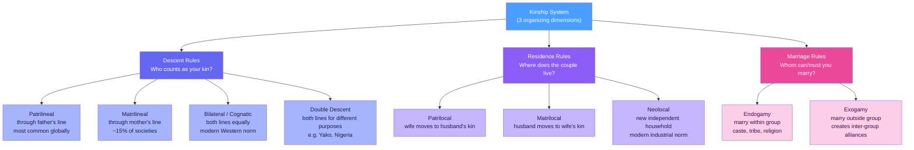

# Family, Marriage, and Kinship

> [!abstract] TL;DR
> Family and kinship are the universal raw materials of human social organization — every known society institutionalizes ways of defining relatedness, regulating sexual partnership, and transmitting identity and resources across generations. Three lenses are required: anthropological (how descent and residence rules structure entire societies), sociological (how the family institution functions and changes), and critical (whose interests family arrangements serve and who they marginalize). The modern Western nuclear family is one configuration among dozens, a historically recent product of industrialization, not a timeless default.

---

## Intuition

**Analogy:** Think of kinship as a filing system, and marriage as the rule that determines how new folders are created and linked.

Every society answers the same three organizing questions: *Who counts as your relatives?* (descent rules), *Where do you set up your new household?* (residence rules), and *Whom are you allowed or required to marry?* (alliance rules). The answers define a society's kinship architecture — and that architecture shapes inheritance of land and cattle, care of children, political alliances between clans, and the social identity of every individual from birth. Change the filing rules and you change who owns what, who has authority over children, and which groups are allied or opposed.

The nuclear family of two parents and their children in an independent household feels natural to most people in industrialized societies — but it accounts for barely a fraction of the kinship configurations that human societies have used. Most humans throughout history have embedded individuals in lineages, clans, and extended households that the isolated nuclear family replaced only with urban wage labour.

---

## How It Works



---

## Key Concepts

### Secondary Level

**What is a family?**

Sociologists distinguish two related but different concepts:
- **Household**: people who share a dwelling and resources (the census unit).
- **Family**: people connected by ties of marriage, descent, or adoption who feel mutual obligations — including non-co-resident relatives.

The same person can be part of a household that is not their family, and part of a family spread across multiple households. Modern transnational families (e.g. migrant workers with children in another country) are an extreme but common case.

**Family forms:**

| Form | Description |
|------|-------------|
| Nuclear | Two parents + dependent children in one household |
| Extended | Multi-generational; includes grandparents, uncles, aunts, cousins |
| Reconstituted / blended | Children from previous relationships in a new household |
| Single-parent | One carer (mother in ~80% of Western cases) |
| Chosen family | Non-biological network fulfilling family functions (common in LGBTQ+ communities) |
| Consanguineal | Built around blood ties; the conjugal (husband-wife) bond is secondary |

**Marriage forms:**

| Form | Definition | Notes |
|------|-----------|-------|
| Monogamy | One spouse at a time | Universal legal norm today |
| Serial monogamy | Sequential exclusive partnerships after divorce | De facto dominant pattern in high-divorce societies |
| Polygyny | One man, multiple wives | ~80% of known human societies *permit* it; actual prevalence limited by economics |
| Polyandry | One woman, multiple husbands | Very rare; classic case: fraternal polyandry in Tibet |
| Group marriage | Multiple men + women | Extremely rare; mainly ideological communes |

**The functionalist view:**

George Peter Murdock (1949) argued the nuclear family is universal because it performs four irreplaceable functions:
1. **Sexual regulation** — institutionalizing access to reduce conflict
2. **Reproduction** — biological and social context for childbearing
3. **Economic cooperation** — division of labour enabling specialization
4. **Socialization** — transmitting culture, norms, and identity to children

Talcott Parsons refined this for modern industrial society: the family sheds economic and educational functions to firms and schools, but retains two unique roles — **primary socialization of children** and **stabilization of adult personalities** (emotional support absorbing workplace stress).

---

### Undergraduate Level

**Descent theory vs alliance theory**

These are the two dominant anthropological frameworks for explaining why kinship takes the forms it does.

*Descent theory* (A.R. Radcliffe-Brown, Meyer Fortes): kinship is primarily about **continuity** — tracing group membership, inheritance, and identity through genealogical lines. Lineages are corporate groups that own land, resolve disputes, and regulate marriage. The key question is *who belongs to which group?*

*Alliance theory* (Claude Lévi-Strauss): kinship is primarily about **exchange**. The incest taboo is not merely a prohibition but a positive rule: it forces men to give their sisters and daughters to other groups, and in exchange receive wives. This exchange creates social bonds — reciprocity is the foundation of society itself. **Cross-cousin marriage** (marrying the mother's brother's daughter in a patrilineal system) institutionalizes repeating alliances across generations between two lineages. The key question is *which groups are allied through marriage?*

The debate is unresolved. Alliance theory better explains prescriptive marriage rules and the creation of inter-group solidarity; descent theory better explains rights over children and property transmission in lineage-based societies.

**Descent rules in detail:**

- **Patrilineal descent**: kin group membership transmitted through males only. A child belongs to the father's clan; the mother's clan is a separate group. Common across sub-Saharan Africa, the Middle East, and East Asia. Land, clan membership, and ancestor veneration flow through the male line.
- **Matrilineal descent**: kin group membership transmitted through females. A child belongs to the mother's lineage. Crucially, authority over children and property is typically held by the **mother's brother** (maternal uncle), not the biological father — a consequence of the separation between the conjugal bond (husband-wife) and the descent bond (mother's brother-sister's son). Classic cases: Minangkabau (West Sumatra, ~6 million people, the world's largest matrilineal society), Khasi (Northeast India), Ashanti (Ghana). **Matrilineal ≠ matriarchal** — men still typically hold political authority, but through their maternal line.
- **Bilateral / cognatic descent**: both parents' lines count equally; children belong to both kin groups. The dominant pattern in Western industrialized societies and among most hunter-gatherer bands (who need flexible foraging networks). Inheritance can flow through either parent.
- **Double descent**: rare but theoretically important. Both patrilineal and matrilineal principles apply simultaneously for *different purposes*. Among the Yako of Nigeria, land and cattle pass through the patrilineal lineage; moveable goods and spiritual protection flow through the matrilineal lineage.

**Residence rules:**

Where a couple lives after marriage determines which kin network they are embedded in, who their daily companions are, and who has practical authority over them:

- **Patrilocal (virilocal)**: couple lives with or near the husband's family. Most common globally, especially in patrilineal societies. Women leave their birth kin group and enter their husband's — creating potential solidarity among brothers and tension between wives.
- **Matrilocal (uxorilocal)**: couple lives with the wife's family. Found in many matrilineal societies; husbands are outsiders in the household.
- **Neolocal**: couple establishes an independent new household. Dominant in modern Western societies; correlates with bilateral descent, wage labour, nuclear family norms, and the weakening of extended family obligation.
- **Avunculocal**: couple lives with the husband's maternal uncle. Found in some matrilineal societies where the uncle, not the father, is the key authority figure.

**Endogamy and exogamy:**

- **Endogamy**: the rule to marry *within* a defined group. Caste endogamy in India is the most far-reaching contemporary example. Religious endogamy (Jewish law; Hindu jati rules) and tribal endogamy also persist widely. Endogamy preserves property, identity, and group boundaries.
- **Exogamy**: the rule to marry *outside* a defined group — typically the lineage or clan. Nearly universal for lineage-based societies. Creates inter-group alliances through marriage; prevents concentration of resources within a single lineage.

**The feminist critique:**

Friedrich Engels (*The Origin of the Family, Private Property and the State*, 1884), drawing on Lewis Henry Morgan's ethnography, argued that the bourgeois nuclear family is not natural but historical. Before private property, he claimed, kinship was organized around communal motherhood with no paternity certainty needed. The "world historic defeat of the female sex" came when men required monogamous wives to ensure paternity — to produce legitimate heirs for the transmission of private property. The family is therefore an institution that serves capital and patriarchy simultaneously.

Contemporary feminist sociology extended this critique through the 1970s–1980s:
- **Christine Delphy**: marriage is best understood as a labour contract in which women exchange domestic services for economic support — the household mode of production exploits women as a class regardless of which man they live with.
- **Shulamith Firestone**: women's oppression is rooted in biological reproduction itself; women's liberation requires technological liberation from childbearing.
- **Michele Barrett**: the family is a key site for the reproduction of capitalist ideology — gender roles naturalize women's domestic labour and the male breadwinner norm.

**Hochschild and the second shift:**

Arlie Hochschild (*The Second Shift*, 1989) documented that even in dual-earner American couples, women worked on average an extra *month* of 24-hour days per year compared to their male partners — a "second shift" of domestic labour added on top of paid work. Three decades later, this gap has narrowed in most OECD countries but has not closed, including in societies with strong gender-equality norms.

Hochschild also introduced **emotion work**: the management of feelings to produce desired emotional states in family members (comforting children, defusing conflict, maintaining household mood) — disproportionately performed by women and largely invisible in economic accounts.

---

### Graduate Level

**Giddens and the transformation of intimacy**

Anthony Giddens (*The Transformation of Intimacy*, 1992) argued that late modernity has produced a fundamentally new form of intimate relationship — the **pure relationship**: a relationship entered into solely for its own rewards (emotional satisfaction, mutual disclosure, personal growth) rather than for external reasons (economic need, kinship obligation, social reproduction). Characteristics:
- **Reflexive**: continuously scrutinized and renegotiated by both partners ("Are we still getting what we need from this?")
- **Contingent**: sustained only as long as it delivers satisfaction to both parties; exit is always possible
- **Confluent love**: active, egalitarian, mutual love that replaces the asymmetric, passive "romantic love" of traditional marriage

This democratization of intimacy is, for Giddens, potentially emancipatory — but also structurally destabilizing, since pure relationships are inherently fragile and produce high divorce rates and serial monogamy as their statistical signature.

*Critique* (Lynn Jamieson, *Intimacy: Personal Relationships in Modern Societies*, 1998): Giddens overstates the transformation. "Pure relationships" require economic independence, leisure time, and emotional literacy that are unequally distributed by class, gender, and ethnicity. Working-class and migrant couples remain embedded in practical interdependencies — sharing economic burdens, caring for elderly parents, managing precarious housing — that profoundly shape intimacy in ways Giddens' post-scarcity model ignores. Jamieson's concept of **"disclosing intimacy"** is more empirically grounded: intimacy is achieved through practices of sharing, mutual knowledge, and material care, not purely through reflexive self-disclosure.

**Structural changes in family forms since 1960:**

All Western societies have experienced a cluster of demographic changes that sociologists call the *Second Demographic Transition* (van de Kaa, Lesthaeghe):

| Trend | UK/US Pattern |
|-------|--------------|
| Marriage rates | First marriage rate fell ~50% in UK 1970–2020 |
| Divorce rates | Rose sharply 1960–1985; stabilized since (UK total divorce rate ~42%) |
| Cohabitation | From ~1% of couples in 1960s to ~30%+ today in UK; majority of first partnerships |
| Age at first marriage | Risen by ~5–7 years since 1970 |
| Single-person households | Now the most common household type in many Western cities |
| Non-marital births | From ~5% in 1960 to ~50% in UK, ~40% in US |
| Same-sex partnerships | Legally recognized in 30+ countries; demographically significant in Nordic and Anglo-American societies |

These trends are interpreted differently: as *family decline* (right-conservative view), as *pluralization and democratization* (Giddens, Beck), or as *restructuring of gender and economic relations* (feminist sociology).

**David Morgan's family practices:**

Rather than defining "the family" as a fixed structure and measuring deviation from it, Morgan (*Family Connections*, 1996) proposes studying **family practices**: the mundane activities through which people *do* family — feeding, caring, celebrating, remembering, arguing, transmitting. This moves analysis from structure to agency, from noun to verb, and captures the lived experience of people in diverse household arrangements without privileging any particular form.

**Comparative family systems:**

| Region / System | Characteristic Features |
|-----------------|------------------------|
| Nordic/Scandinavian | High cohabitation; state actively supports dual-earner model; paid parental leave gender-balanced; family embedded in welfare state |
| East Asian (Japan, Korea, China) | Strong persistence of filial piety and multi-generational obligation; multigenerational co-residence declining but normatively significant; low external childcare acceptance |
| Indian joint family | Extended patrilineal household (*joint family*) as ideal; urban migration fragmenting but not eliminating it; strong endogamy (caste, subcaste) |
| Sub-Saharan African | High diversity; lineage-based systems persist alongside conjugal family; polygyny legally or customarily permitted in many countries; bridewealth (*lobola*) negotiates cross-lineage obligations |
| Latin American | *Familismo*: dense, morally obligatory kin networks; high extended co-residence; migration creates transnational family structures; Catholic influence on divorce rates |

**Kin selection and evolutionary underpinnings:**

W.D. Hamilton's *inclusive fitness* theory predicts that individuals will invest in relatives in proportion to their genetic relatedness (*r*). This explains why grandparental investment is concentrated in maternal grandmothers (highest certainty of relatedness) and why paternal investment co-varies with paternity certainty — a pattern consistently supported by cross-cultural data. Sociobiology and evolutionary psychology provide proximate explanations for kinship practices that complement (but cannot replace) structural and critical sociological accounts.

---

## Python Demo

This simulation tracks a cohort of 2,000 adults through five household states over a 50-year life course. Three era scenarios (1960s stable marriage, 1980s divorce peak, 2010s cohabitation era) demonstrate how different transition rates produce markedly different household type distributions.

```python
import numpy as np
import matplotlib.pyplot as plt

np.random.seed(42)

# States: 0=Single, 1=Cohabiting, 2=Married, 3=Divorced/Sep, 4=Widowed

def simulate_cohort(n=2000, years=50,
                    marriage_rate=0.08,
                    divorce_rate=0.02,
                    cohabit_rate=0.05,
                    remarriage_rate=0.06):
    """
    Annual Markov-like state-transition model for household composition.
    All rates are annual probabilities. Cohort starts as single adults at age 20.
    """
    states = np.zeros(n, dtype=int)   # everyone starts single
    history = np.zeros((years, 5))

    for t in range(years):
        r = np.random.random(n)
        new = states.copy()

        # Single --> Married or Cohabiting
        single = (states == 0)
        new[single & (r < marriage_rate)] = 2
        new[single & (r >= marriage_rate) & (r < marriage_rate + cohabit_rate)] = 1

        # Cohabiting --> Married (formalize) or Dissolved
        cohab = (states == 1)
        new[cohab & (r < 0.09)] = 2
        new[cohab & (r >= 0.09) & (r < 0.09 + divorce_rate * 1.5)] = 3

        # Married --> Divorced or Widowed (widowing rises with age)
        married = (states == 2)
        new[married & (r < divorce_rate)] = 3
        widowing_rate = 0.001 * (t / years) ** 2
        new[married & (r >= divorce_rate) & (r < divorce_rate + widowing_rate)] = 4

        # Divorced --> Remarried
        divorced = (states == 3)
        new[divorced & (r < remarriage_rate)] = 2

        states = new
        for s in range(5):
            history[t, s] = (states == s).sum() / n

    return history


scenarios = {
    "1960s  (stable marriage)":  dict(marriage_rate=0.10, divorce_rate=0.01,
                                      cohabit_rate=0.01, remarriage_rate=0.03),
    "1980s  (divorce peak)":     dict(marriage_rate=0.09, divorce_rate=0.04,
                                      cohabit_rate=0.04, remarriage_rate=0.07),
    "2010s  (cohabitation era)": dict(marriage_rate=0.06, divorce_rate=0.03,
                                      cohabit_rate=0.12, remarriage_rate=0.05),
}

state_labels = ["Single", "Cohabiting", "Married", "Divorced/Sep.", "Widowed"]
colors       = ["#4a9eff", "#f59e0b", "#10b981", "#ef4444", "#8b5cf6"]

fig, axes = plt.subplots(1, 3, figsize=(15, 5), sharey=True)
fig.suptitle(
    "Household Composition Over a 50-Year Adult Life Course\n"
    "(Cohort of 2,000 adults; three era scenarios)",
    fontsize=12, fontweight="bold"
)

for ax, (title, params) in zip(axes, scenarios.items()):
    hist = simulate_cohort(**params)
    xs   = np.arange(1, 51)
    ax.stackplot(xs, hist.T, labels=state_labels, colors=colors, alpha=0.85)
    ax.set_title(title, fontweight="bold", fontsize=10)
    ax.set_xlabel("Years since age 20")
    ax.set_xlim(1, 50)
    ax.set_ylim(0, 1)
    ax.grid(axis="y", alpha=0.3, linestyle="--")

axes[0].set_ylabel("Proportion of cohort")
axes[2].legend(loc="upper right", fontsize=8, framealpha=0.8)
plt.tight_layout()
plt.savefig("household_dynamics.png", dpi=120, bbox_inches="tight")
plt.show()

# Year-50 snapshot
print("\n--- Year-50 household proportions ---")
for title, params in scenarios.items():
    hist = simulate_cohort(**params)
    print(f"\n{title}:")
    for i, sl in enumerate(state_labels):
        print(f"  {sl:20s} {hist[-1, i]:.1%}")
```

**What to observe:** The 1960s scenario produces a large married band that persists across the life course. The 1980s divorce peak shrinks the married proportion and inflates the divorced/separated band, with remarriage partially absorbing it. The 2010s cohabitation era shows a much earlier and larger cohabiting band, a smaller married band, and a persistent single proportion — reflecting delayed and declining marriage, not a collapse of partnership itself.

---

## Real-World Applications

**1. Sweden's dual-earner/dual-carer family model**
Sweden explicitly dismantled the male breadwinner model through policy: individual (not household) taxation from 1971 eliminates the "marriage penalty," generous publicly funded childcare enables continuous employment for both parents, and paid parental leave since 1974 (now 480 days, with 90 days reserved for each parent) is designed to equalize domestic labour. The result: one of the highest female labour-force participation rates globally (~80%), with fertility above the European average — disproving the assumption that women's employment necessarily suppresses fertility.

**2. Matrilineal Minangkabau**
The Minangkabau of West Sumatra (~6 million people) are the world's largest matrilineal society and also predominantly Muslim. Property (ancestral land, the *rumah gadang* longhouse) descends through the female line; men spend their lives as guests in their wives' households and are the primary authority in their sisters' households. This coexists with Islamic inheritance rules applying to individually acquired property — a dual system that illustrates how formal religious law and customary kinship practice can operate simultaneously without fully displacing each other.

**3. The Moynihan Report controversy (US, 1965)**
Daniel Patrick Moynihan's government report *The Negro Family: The Case for National Action* argued that the high proportion of African American single-parent households was a "tangle of pathology" threatening Black advancement. Critics (including sociologist Herbert Gans and later scholars) argued the report blamed victims, ignored structural causes (slavery's destruction of family ties, employment discrimination, mass incarceration), and ethnocentrically applied the nuclear family norm. The debate crystallized the methodological problem of treating one family form as the baseline against which all others are measured as "deficits."

**4. The transnational family**
Globalization has generated tens of millions of households in which parents (typically mothers) work abroad and maintain family ties across national borders through remittances, phone calls, and periodic return visits. Filipino domestic workers in the Gulf states, Polish migrant workers in the UK, and Mexican farmworkers in the US represent cases where the family functions relationally across distance. These families cannot be captured by household census data but are sociologically real — and the "care drain" they create is a major inequality mechanism between Global North and Global South.

---

## Common Pitfalls

- **Assuming the nuclear family is natural and universal** — it is historically specific to post-industrial Western societies and is statistically uncommon when the full range of human societies is considered. Treating it as the default produces ethnocentric analysis and misreads family change as "breakdown."

- **Conflating household with family** — census definitions count co-resident units; sociological analysis must also account for non-co-resident obligations, transnational families, and the relational networks that function as family without sharing a roof.

- **Treating family change as decline** — rising cohabitation, later marriage, and higher divorce rates are often described in normative terms as "breakdown of the family." This embeds a value judgment. The same data can be read as pluralization, democratization, or restructuring of gender relations depending on the theoretical framework applied.

- **Matrilineal = matriarchal** — a persistent confusion. Matrilineal descent traces group membership through women; it does not mean women hold political authority. In most matrilineal societies, men exercise authority — through their *maternal* kin line, not their paternal one.

- **Ignoring care work in economic accounts** — GDP and labour market data systematically exclude unpaid domestic and care work. This makes women's economic contribution invisible, understates the real cost of raising children, and distorts policy analysis of welfare and pensions.

- **Applying Western kinship terminology cross-culturally** — English has one word for "uncle" (both mother's brother and father's brother); many languages distinguish them with completely different terms because they represent different social roles and obligations. Translating kinship systems through English vocabulary destroys exactly the distinctions that matter analytically.

---

## Related Concepts

- [[_MOC_Social_Institutions|↑ Social Institutions MOC]] — Section map for all Social Institutions notes
- [[Attachment_Theory]] — Bowlby's theory of infant-caregiver bonding is the psychological mechanism through which family structure shapes personality development; secure attachment requires sensitive caregiving, which family forms either support or undermine
- [[Lifespan_Development]] — Erikson's stages of psychosocial development map the family life cycle (intimacy vs. isolation in young adulthood; generativity vs. stagnation in midlife); family transitions are the context for most developmental crises
- [[Group_Dynamics]] — the family is the primary group par excellence; norms of conformity, in-group loyalty, role differentiation, and social influence all operate at maximum intensity within family units
- [[Moral_Development]] — Kohlberg's pre-conventional and conventional morality both develop primarily within the family context; parental discipline styles shape moral reasoning trajectories
- [[Socialism_Marxism_and_Communism]] — Engels' materialist critique of the bourgeois family is a foundational text; the Marxist analysis of the family as a site of property transmission and ideological reproduction remains influential in feminist sociology
- [[Welfare_States_and_Social_Policy]] — different welfare regimes (Esping-Andersen's liberal, conservative-corporatist, and social-democratic types) embed different assumptions about the male breadwinner model, women's employment, and the public/private division of care work
- [[Social_Influence_and_Conformity]] — socialization within the family is the primary mechanism through which conformity to social norms is produced; the family is the first and most powerful agent of social control
- [[Prosocial_Behavior]] — kin selection theory predicts prosocial behaviour toward relatives is calibrated by genetic relatedness; most everyday altruism occurs within and between family networks

---

## Review Questions

### Secondary

1. Murdock argued the nuclear family is universal because it performs four essential functions. Name them. Does the existence of societies where children are raised communally (Israeli kibbutzim, for example) challenge this claim, or can it be accommodated within Murdock's framework?
2. What is the difference between a matrilineal society and a matriarchal society? Use a specific ethnographic example to illustrate why the two are not the same.
3. How does the concept of the "second shift" challenge the claim that women's entry into paid employment has produced equality within the family?

### Undergraduate

1. Compare descent theory (Radcliffe-Brown) and alliance theory (Lévi-Strauss). Which framework better explains why the incest taboo is universal across human societies? What does each framework say about the relationship between kinship and social solidarity?
2. Parsons argued that the nuclear family in modern industrial societies performs the functions of primary socialization and adult personality stabilization. What does this claim predict about what happens when divorce rates rise? Does the empirical evidence from high-divorce societies support or undermine Parsons' prediction?
3. Hochschild's concept of the "second shift" was developed from US data in the late 1980s. To what extent does it still apply in (a) Nordic countries with gender-equal parental leave policies, and (b) dual-earner households in South Asia or sub-Saharan Africa? What methodological challenges arise in making such comparisons?

### Graduate

1. Giddens claims that the "pure relationship" — entered into for its own sake and sustained only by mutual satisfaction — represents a democratization of intimacy in late modernity. Jamieson responds that this model is empirically thin and class-biased. Evaluate both positions: what evidence would you need to determine which account better captures contemporary relationship formation and dissolution patterns?
2. The Second Demographic Transition (rising cohabitation, delayed marriage, declining fertility, pluralization of household forms) is typically described as originating in Northwestern Europe and spreading globally. To what extent can a single framework explain family change in societies as different as Sweden, Brazil, Japan, and Nigeria? What limitations does a universalist account face?
3. Engels argued in 1884 that the monogamous nuclear family arose to ensure paternity certainty for property inheritance. Evolutionary psychologists make a structurally similar argument in terms of inclusive fitness and parental investment theory. Compare the two accounts: where do they converge, where do they diverge, and what does each leave unexplained?

---

## Sources

- Murdock, G.P. (1949). *Social Structure*. Macmillan. — Foundational cross-cultural study; source of the "four functions" typology
- Lévi-Strauss, C. (1949/1969). *The Elementary Structures of Kinship*. Beacon Press. — Alliance theory and the exchange of women
- Engels, F. (1884/1972). *The Origin of the Family, Private Property and the State*. International Publishers. — Materialist critique; historical origin of the nuclear family
- Parsons, T. & Bales, R.F. (1955). *Family, Socialization and Interaction Process*. Free Press. — Functionalist account of the family's role in industrial society
- Hochschild, A. (1989). *The Second Shift*. Viking. — Empirical documentation of the domestic labour gap in dual-earner couples
- Giddens, A. (1992). *The Transformation of Intimacy*. Polity. — Pure relationships, confluent love, and the democratization of personal life
- Jamieson, L. (1998). *Intimacy: Personal Relationships in Modern Societies*. Polity. — Empirical critique of Giddens
- Morgan, D. (1996). *Family Connections: An Introduction to Family Studies*. Polity. — Family practices framework
- Goody, J. (1976). *Production and Reproduction*. Cambridge University Press. — Comparative analysis of kinship, property, and descent across Eurasia and Africa
- van de Kaa, D.J. (1987). "Europe's second demographic transition." *Population Bulletin*, 42(1). — The demographic framework behind pluralization of family forms

---

#Sociology #SocialInstitutions #Family #Marriage #Kinship
