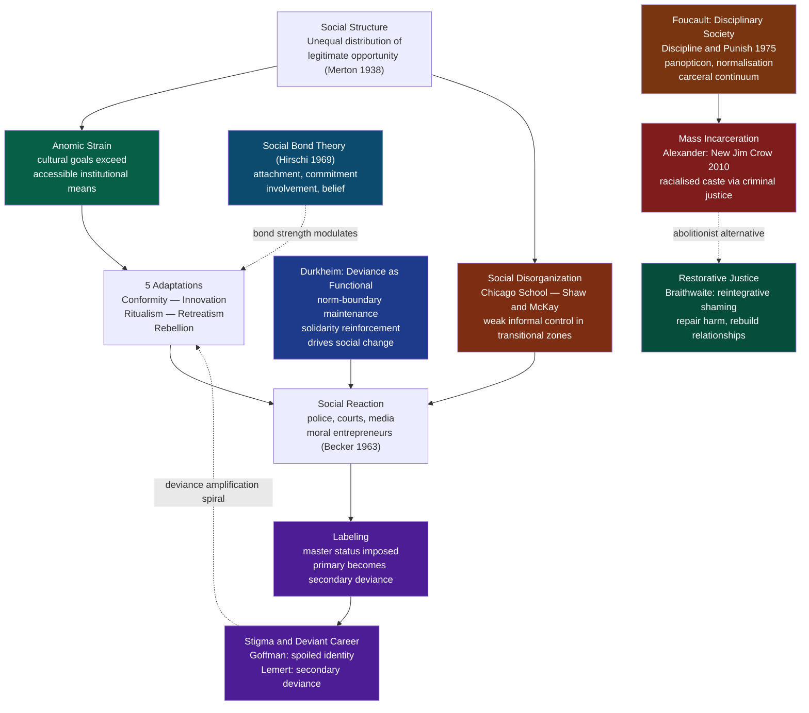

# Law, Deviance, and Social Control

> [!abstract] TL;DR
> Deviance is not a property of an act but a label society attaches to acts that violate shared norms — and the processes by which that label is applied, contested, and enforced constitute the sociology of social control. From Durkheim's claim that deviance is functional (it draws moral boundaries and reinforces solidarity) through Merton's structural explanation of crime as blocked opportunity, to Foucault's diagnosis of the modern prison as one node in a pervasive disciplinary apparatus — the field asks: who decides what counts as deviant, who gets caught, and what does punishment actually accomplish?

---

## Intuition

**Analogy:** Imagine a small town where everyone knows everyone else. When a teenager spray-paints the town square, the community's reaction is more revealing than the act itself. Some residents argue about whether graffiti is vandalism or art; a town meeting is called; the teenagers are labelled troublemakers; rules are debated and clarified. The graffiti, in Durkheim's terms, *did sociological work* — it forced the community to articulate and reaffirm its values. Whether the teenager becomes a "good kid who made a mistake" or a "deviant on the path to worse crimes" depends far less on the paint than on the reactions of police, school officials, parents, and neighbours — and crucially, on the race and class of the teenager involved.

Scale that process to a society, and you have the core puzzle of the sociology of deviance: acts do not cause reactions; social structures, institutions of power, and cultural frameworks decide which acts are reactions-worthy, which actors are punishable, and what those punishments mean.

---

## How It Works



---

## Key Concepts

### Secondary Level

**What is deviance?** In everyday language, deviance means unusual or immoral behaviour. Sociologically it means something more precise: *any behaviour, belief, or characteristic that violates the norms of a group and provokes negative social reactions*. This definition has three important implications:

| Implication | Meaning |
|---|---|
| Deviance is relative | What counts as deviant varies across societies, subcultures, and historical periods. Homosexuality was classified as a psychiatric disorder by the DSM until 1973. |
| Deviance is contested | The same act can be deviance to one group and heroism to another — the civil rights activist who breaks segregation laws, the whistleblower who leaks classified information. |
| Deviance requires audience | An act becomes deviant when an audience successfully labels it so. Acts that go unobserved or unresponded to do not generate the social machinery of deviance. |

**Durkheim: deviance is normal and functional.** In *The Rules of Sociological Method* (1895) and *The Division of Labour in Society* (1893), Émile Durkheim made the counterintuitive argument that deviance is not a pathology of society — it is a normal feature of healthy societies. He identified three functions:

1. **Boundary maintenance.** Every community has a moral boundary separating acceptable from unacceptable. Deviant acts and the reactions to them *draw that boundary in public*. When a community punishes a thief, it publicly affirms that theft is wrong — a ceremony that renews the collective moral code.

2. **Solidarity reinforcement.** Collective outrage at deviance unites the conforming majority. The public condemnation of crime generates *mechanical solidarity* — a collective "we-feeling" among those who share the violated norm.

3. **Social change driver.** Every act of social reform began as deviance. Martin Luther King Jr was arrested. Suffragettes were jailed. Without individuals who deviate from unjust norms, moral progress would be impossible. Durkheim noted that "crime" prefigures the moral sensibility of the next generation.

**Too much deviance, however, signals *anomie* — a breakdown of social norms so thoroughgoing that behaviour becomes unpredictable and social cohesion dissolves.** Durkheim's analysis of anomic suicide (one of four types in *Suicide*, 1897) showed that deregulation — a sudden loosening of norms during periods of rapid social change — correlated with elevated suicide rates, even when material conditions improved.

**Formal vs. informal social control:**

| Type | Definition | Agents | Examples |
|---|---|---|---|
| Informal | Unofficial sanctions applied by primary groups | Family, peers, community, employers | Disapproval, ostracism, gossip, shaming |
| Formal | Official sanctions applied by specialised institutions | Police, courts, prisons, regulatory bodies | Fines, arrest, imprisonment, licence revocation |

Sociologists emphasise that informal control is far more powerful than formal control for maintaining everyday conformity. Most people do not steal not because they fear prison but because theft would horrify their family and friends. Formal control is the residual response when informal control has failed.

**Types of crime (criminological taxonomy):**

| Category | Examples | Sociological issue |
|---|---|---|
| Violent crime | Homicide, assault, sexual violence | Concentration in socially disorganised neighbourhoods; gender asymmetry (men as perpetrators and victims) |
| Property crime | Theft, burglary, fraud | Most common; strongly correlated with economic inequality (Merton) |
| White-collar crime | Corporate fraud, embezzlement, price-fixing | Sutherland 1949: causes more economic harm than street crime but is less policed and less punished |
| Victimless crime | Drug use, consensual adult prostitution | Contested category: does the state have the right to criminalise behaviour that harms only the actor? |
| State crime | Genocide, torture, illegal surveillance | States both make criminal law and violate it — a structural contradiction in formal control |

**The "dark figure" of crime:** Official crime statistics record only reported and detected crime. Victimisation surveys (e.g., the British Crime Survey / Crime Survey for England and Wales; the US National Crime Victimization Survey) consistently find that 50–75% of crimes go unreported. This means official statistics are shaped as much by policing patterns — where police deploy, whom they stop and search — as by actual criminal behaviour. Any analysis relying solely on arrest data systematically over-represents policed populations (young, male, low-income, non-white).

---

### Undergraduate Level

**Merton's Strain Theory (1938): Anomie and the American Dream**

Robert Merton's essay "Social Structure and Anomie" (*American Sociological Review*, 1938) is one of the most cited papers in sociology. Merton took Durkheim's concept of anomie and gave it a structural explanation specific to modern capitalist societies.

The argument in two steps:

1. **American culture universally propagates the goal of material success** (the "American Dream"). Every American, regardless of class background, is socialised to aspire to wealth, status, and comfort.

2. **The institutional means to achieve that goal are not universally available.** Quality education, stable employment, professional networks, and capital are distributed unequally — heavily concentrated in higher classes.

The *strain* arises from the gap between the cultural imperative ("succeed!") and the structural reality ("the legitimate paths to success are blocked for you"). When that gap is large and persistent, it creates pressure toward illegitimate means.

Merton identified five **adaptations to strain** — ways individuals respond to the culture–structure disjuncture:

| Adaptation | Cultural Goals | Institutional Means | Description |
|---|---|---|---|
| **Conformity** | + Accept | + Accept | Most common; accepts goals and uses legitimate means. No deviance. |
| **Innovation** | + Accept | - Reject | Accepts success goals but replaces legitimate means with illegitimate ones (crime). The adaptation most associated with working-class crime. |
| **Ritualism** | - Reject | + Accept | Abandons aspirations but goes through the motions — the rule-following bureaucrat who no longer believes in the mission. |
| **Retreatism** | - Reject | - Reject | Withdraws from society; neither goals nor means are engaged. Associated with chronic drug addiction, homelessness, social dropout. |
| **Rebellion** | ~ Replace | ~ Replace | Rejects prevailing goals and means and substitutes new ones. Associated with revolutionary movements and radical subcultures. |

**Critical insight:** Merton's framework explains why poverty alone does not predict crime rates. It is the *combination* of high aspirational pressure and blocked legitimate opportunity that produces strain. Countries with lower inequality (and therefore less goal–means disjuncture) show lower crime rates even at equivalent absolute poverty levels. The US, with high cultural emphasis on success and high income inequality, is a structurally criminogenic society.

**Labeling Theory: Who Gets Called Deviant?**

Labeling theory — associated with Howard Becker (*Outsiders*, 1963), Edwin Lemert (*Social Pathology*, 1951), and Erving Goffman (*Stigma*, 1963) — shifts attention from *why people commit deviant acts* to *why some acts and actors get labeled deviant while others do not*.

**Becker's core move:** "Deviance is not a quality of the act the person commits, but rather a consequence of the application by others of rules and sanctions to an 'offender.'" Deviance is not discovered; it is *constructed*.

**Moral entrepreneurs** are individuals or groups who campaign for the creation or enforcement of a norm. Becker's paradigm case was the Federal Bureau of Narcotics' Harry Anslinger, who in the 1930s launched a campaign to criminalise marijuana — not because of evidence of harm, but through a combination of racial politics, bureaucratic self-interest, and media sensationalism. The "drug problem" was not pre-existing; it was socially manufactured.

**Primary vs. secondary deviance (Lemert):**

- **Primary deviance** is the initial norm violation — the first drug use, the first theft. At this stage, the actor does not think of themselves as a deviant person. The act is isolated and does not organise the person's identity around deviance.
- **Secondary deviance** occurs when the social reaction (arrest, prosecution, labeling, ostracism) forces the person to reorganise their identity around the deviant role. Once labeled a criminal, ex-offenders find legitimate employment blocked, social networks disrupted, and access to conforming roles closed. The label *creates* the deviant career it was meant to punish. The prophecy fulfils itself.

**Goffman's stigma:** In *Stigma: Notes on the Management of Spoiled Identity* (1963), Goffman analysed how stigmatised persons manage discrediting information. A **stigma** is an attribute that reduces the bearer "from a whole and usual person to a tainted, discounted one." Goffman distinguished:

| Stigma Type | Visibility | Examples |
|---|---|---|
| Tribal stigma | Visible or known | Race, ethnicity, national origin |
| Abominations of the body | Visible | Physical disability, disfigurement |
| Blemishes of individual character | Potentially concealable | Criminal record, mental illness, addiction, homosexuality (at the time) |

For concealable stigmas, a person may "pass" — manage information to avoid disclosure. The social energy devoted to concealment, the constant fear of exposure, and the inauthenticity of passing all produce significant psychological costs. The criminal record — permanently visible to employers, landlords, and licensing boards via background checks — functions as a permanent stigma that makes reintegration structurally difficult.

**Hirschi's Social Bond Theory (1969):**

Travis Hirschi's *Causes of Delinquency* (1969) asked not "why do people commit crime?" but "why do most people conform?" His answer: conformity is maintained by four bonds to conventional society that constrain the temptation to deviate.

| Bond | Definition | Empirical indicator |
|---|---|---|
| **Attachment** | Emotional investment in others whose opinions matter | Closeness to parents, teachers, peers |
| **Commitment** | Investment in legitimate goals that would be jeopardised by arrest | Educational aspirations, employment |
| **Involvement** | Time occupied by conventional activities leaves less time for deviance | Hours per week in school, work, organised activities |
| **Belief** | Acceptance of the legitimacy of conventional norms and laws | Belief that laws are morally valid |

When bonds are strong, the cost of deviance (risking one's reputation, relationships, and future prospects) is high. When bonds are weak — through family breakdown, school failure, unemployment, or community disorganisation — the restraining mechanism fails.

Hirschi's theory is important because it redirects attention from the deviant to the *social ties that prevent deviance*. The policy implication is not primarily punitive: it is to invest in the institutions (families, schools, communities, labour markets) that create and sustain social bonds.

**Social Disorganisation Theory (Chicago School):**

The Chicago School of Sociology in the 1920s–1940s pioneered ecological analysis of urban crime. Robert Park and Ernest Burgess developed the **concentric zone model** of city growth: cities expand outward in rings, with a central business district surrounded by a zone of transition (cheap housing, high turnover, immigrant populations), then working-class residential zones, then middle-class suburbs.

Clifford Shaw and Henry McKay (*Juvenile Delinquency and Urban Areas*, 1942) mapped juvenile delinquency across Chicago over decades and found that high-crime areas were not defined by the characteristics of the *people* who lived there — populations turned over as immigrants moved to better neighbourhoods and were replaced by new arrivals — but by the characteristics of the *places* themselves. The zone of transition had consistently high crime rates regardless of who occupied it.

Their explanation: **social disorganisation** — the inability of a community to realise common goals and maintain social controls. High-turnover neighbourhoods had:
- Weak informal networks (people don't know their neighbours)
- Unstable or absent community institutions (schools, churches, voluntary associations)
- Competing and conflicting cultural norms (heterogeneous immigrant populations)
- Limited political representation (and therefore fewer resources)

The mechanism is disrupted **informal social control** — the embedded network of observation, intervention, and social pressure that in stable communities deters deviance without recourse to police. Robert Sampson's revival of social disorganisation theory in the 1990s introduced the concept of **collective efficacy** — the combination of social cohesion and willingness to intervene for the common good. Neighbourhoods with high collective efficacy have significantly lower violent crime rates even controlling for poverty.

---

### Graduate Level

**Foucault: Discipline and Punish (1975)**

Michel Foucault's *Surveiller et punir: Naissance de la prison* (1975; English translation *Discipline and Punish*, 1977) is arguably the most influential work in the sociology of punishment since Durkheim. Foucault does not ask whether punishment is effective or just — he asks what kind of power it exemplifies and what role it plays in the production of the modern subject.

**The historical argument — from spectacle to discipline:**

Foucault opens with a visceral description of the public torture and execution of Damiens the regicide in Paris in 1757 — a prolonged, theatrical ordeal of flesh-tearing and burning designed to display the absolute power of the sovereign over the condemned body. Within eighty years, this spectacle had been replaced by the timetable, the cell, the silent march of prisoners — the modern prison.

Foucault argues this is not a story of humanitarian progress but of a *different technology of power*:

| Regime of Punishment | Object of Power | Technique | Goal |
|---|---|---|---|
| Sovereign spectacle | The body — inflicted upon in public | Torture, execution, display | Demonstrate sovereign power; deter through fear |
| Disciplinary regime | The soul — formed through routine | Surveillance, timetable, examination, normalisation | Produce useful, governable individuals |

**The Panopticon:**

Jeremy Bentham's architectural design of a circular prison (the Panopticon) in which a central tower allows constant observation of all cells — without prisoners knowing whether they are being watched at any given moment — becomes Foucault's central metaphor. The effect of possible constant surveillance is that inmates *police themselves*. Power operates not through force but through the *internalization of the gaze*.

Foucault extends the panoptic principle beyond the prison: the school classroom (rows of desks, the teacher's survey, the constant examination), the factory (time-and-motion study, the foreman's walk), the hospital ward, the military barracks — all deploy the same techniques of:

1. **Hierarchical observation** — continuous surveillance by superiors
2. **Normalising judgement** — measuring individual behaviour against a norm, and correcting deviations
3. **The examination** — the combination of observation and normalising judgement that creates a permanent, individualised documentary record of each subject

**The carceral continuum:** Foucault argues that prison is not an anomaly in modern society — it is one end of a continuous spectrum of disciplinary institutions. The "failure" of the prison to rehabilitate is, on this reading, not a failure at all. The prison produces the delinquent it claims to be correcting — a clearly identified, surveilled, and manageable criminal class — which justifies the continued expansion of the disciplinary apparatus. **Power/knowledge**: the human sciences (criminology, psychology, psychiatry) that emerged in the 19th century to "study" deviants simultaneously create the categories of deviance they claim merely to observe.

**Critical assessment:** Foucault's analysis has been charged with determinism (there is no exit from discipline), with historicism (his genealogy is selective), and with neglect of agency (prisoners, as shown by Scott and Abu-Jamal, actively resist). But his core insight — that punishment has political functions extending far beyond crime control, and that apparently humane reforms can constitute new forms of domination — remains analytically indispensable.

---

**Mass Incarceration and the "New Jim Crow"**

The United States has the highest incarceration rate of any country in the world: approximately 2 million people are incarcerated on any given day (2024), representing roughly 630 per 100,000 population. The UK rate is 130 per 100,000. Norway's is 62. This is not a historical constant: the US incarceration rate quadrupled between 1975 and 2000.

Michelle Alexander's *The New Jim Crow: Mass Incarceration in the Age of Colorblindness* (2010) argues that the US criminal justice system functions as a racial caste system. Her argument:

1. **The War on Drugs (declared by Nixon, escalated under Reagan)** dramatically expanded criminal justice reach into predominantly Black and Latino urban communities, even though drug use rates are roughly similar across racial groups.
2. **Racially disparate enforcement** produces racially disparate arrest and incarceration rates: Black Americans are imprisoned for drug offences at rates 10–15 times those of white Americans for equivalent behaviour.
3. **The criminal label triggers collateral consequences** that strip ex-offenders of civil and social rights permanently: in many US states, felony convictions result in loss of voting rights, eligibility for public housing, student loans, professional licences, and jury service. These are the functional equivalents of the legal disabilities imposed under Jim Crow segregation.
4. **The system is self-reproducing:** communities subjected to mass incarceration lose male breadwinners, destabilise families, destroy social bonds (Hirschi's framework), increase poverty, and thereby increase the conditions that Merton identified as producing criminal adaptations — which then feeds more incarceration.

**Key evidence and counterarguments:**

| Alexander's Claim | Supporting Evidence | Challenge |
|---|---|---|
| Drug war is racially targeted | Black arrest rates for drugs are 3-4× white rates despite similar use rates (ACLU data) | Some scholars argue violent crime incarceration is larger driver than drug offences; Alexander arguably overstates drug war's share |
| Criminal label as permanent caste | 45,000+ collateral consequences documented across US jurisdictions (National Inventory of Collateral Consequences) | Some consequences are being removed — voting rights restored in several states (Florida 2018, Iowa 2020) |
| Functions as racial social control | Incarceration rates track racial geography of policing rather than crime geography | Correlation does not prove intent; structural racism and intentional discrimination are analytically distinct |

**Intersecting frameworks:** Bruce Western (*Punishment and Inequality in America*, 2006) provides the complementary economic argument: incarceration has become a structural feature of labour market inequality — concentrated in less-educated Black men, it removes workers from the labour force, inflates measured unemployment statistics, and perpetuates the wealth gap. David Garland (*The Culture of Control*, 2001) frames mass incarceration as a response to late-modernity's social anxieties — the politics of punitiveness as a substitute for the social protection that welfare states provided but neoliberal restructuring eroded.

---

**Restorative Justice**

The dominant Western conception of criminal justice is **retributive**: the state punishes the offender proportionate to the harm caused. The offender owes a debt to *society* (abstractly), served through incarceration or fine. The victim is largely a witness, not a participant.

**Restorative justice** (associated with John Braithwaite, *Crime, Shame, and Reintegration*, 1989; Nils Christie, Howard Zehr) offers an alternative framework:

- **Crime is a violation of people and relationships**, not primarily of laws.
- **Justice requires repairing harm**, which requires the participation of the offender, the victim, and the community.
- **The goal is reintegration**, not exclusion.

Braithwaite distinguishes two types of shame:

| Shaming Type | Description | Outcome |
|---|---|---|
| **Stigmatising shaming** | Condemns the person as fundamentally deviant; excludes from the moral community | Increases secondary deviance (Lemert); strengthens deviant identity |
| **Reintegrative shaming** | Condemns the act while affirming the person's membership in the moral community; followed by forgiveness and reintegration | Supports desistance; breaks the deviance amplification spiral |

**Applications and evidence:**

- **Youth justice conferencing** (pioneered in New Zealand Maori tradition; adopted in Australia, UK, Canada): face-to-face meetings between offender, victim, and family/community members. Meta-analyses show higher victim satisfaction, comparable or lower recidivism, and lower cost than court processing.
- **Truth and Reconciliation Commissions** (South Africa post-apartheid; Rwanda post-genocide): large-scale restorative processes for mass atrocity — exchanging prosecution for truth-telling and amnesty.
- **Drug courts** in the US: divert drug offenders into treatment and supervision rather than incarceration. Rigorously evaluated studies show reduced recidivism compared to standard prosecution.

**Limitations:** Critics argue restorative justice can minimise serious harms (particularly for sexual violence survivors who may not want to face their perpetrator), place excessive burden on victims, and depoliticise what are structurally produced harms (street crime) while leaving corporate and state crime untouched.

---

**Conflict Theories and Feminist Criminology**

**Marxist criminology** (Bonger, Chambliss, Quinney) argues that criminal law is an instrument of the ruling class: it protects property rights (essential to capitalism) while neglecting or decriminalising corporate violence (wage theft, unsafe working conditions, environmental poisoning). Willem Bonger (*Criminality and Economic Conditions*, 1916) argued that capitalism fosters egoism — the pursuit of individual advantage without regard for others — which is the psychological precondition for crime.

**Feminist criminology** (Smart, Daly, Chesney-Lind) made four observations ignored by mainstream criminology:

1. Women commit far less crime than men — criminology's most robust finding — and no mainstream theory adequately explained it.
2. Women's crime is predominantly survival-based (economic crime to escape poverty) or reactive (domestic violence perpetrated against abusers).
3. Women are disproportionately *victims* of crime (particularly sexual violence and intimate partner violence) that is systematically under-recorded and under-prosecuted.
4. The criminal justice system itself produces gendered harms: the prosecution of sex workers while buyers go free; the imprisonment of women for killing abusive partners in self-defence.

Meda Chesney-Lind's **pathways theory** shows that for women, childhood trauma (abuse, neglect) creates pathways into runaway, drug use, and survival crime that are structurally different from male criminal careers — and require entirely different intervention strategies.

---

## Python Demo

```python
import numpy as np
import matplotlib.pyplot as plt

# ─────────────────────────────────────────────────────────────────────────────
# Merton's Strain Theory — Agent-Based Simulation
#
# We simulate N individuals, each characterised by:
#   goal_i  ~ Beta(8, 2): how strongly they have internalised the cultural
#             success goal. Most people in a consumer capitalist society score
#             high — the distribution is concentrated near 1.
#   means_i ~ Beta(alpha, beta): their access to legitimate institutional means
#             (education, employment, social capital). alpha is a decreasing
#             function of the inequality level — as inequality rises, access
#             concentrates at the top, shifting the bulk of the distribution
#             toward low values.
#
# Adaptation classification (Merton 1938):
#   Conformity  : high goal AND high means    (accepts goals, uses legit means)
#   Innovation  : high goal AND low  means    (accepts goals, uses illegit means)
#   Ritualism   : low  goal AND high means    (abandons goals, follows routines)
#   Retreatism  : low  goal AND low  means    (withdraws from both)
#   Rebellion   : low  goal AND low  means AND drawn rebel flag
#                  (replaces goals and means with alternatives)
#
# We sweep inequality from 0.05 (near-equal access) to 0.85 (extreme skew)
# and plot how the proportions in each adaptation type shift.
# ─────────────────────────────────────────────────────────────────────────────

np.random.seed(42)

N = 5_000
INEQUALITY_LEVELS = np.linspace(0.05, 0.85, 9)
ADAPTATIONS = ["Conformity", "Innovation", "Ritualism", "Retreatism", "Rebellion"]
COLORS = ["#2563eb", "#dc2626", "#d97706", "#6b7280", "#7c3aed"]

# Thresholds separating "high" from "low" acceptance/access
G_THRESH = 0.55   # goal internalization threshold
M_THRESH = 0.45   # means access threshold
REBELLION_RATE = 0.12  # of retreatists, 12% become rebels instead

def simulate_means(inequality_level, n):
    """
    Beta distribution for means access.
    alpha: 6.0 at low inequality -> 0.3 at high inequality (shrinks right tail)
    beta : fixed at 2.5
    """
    alpha = 6.0 - 5.7 * inequality_level   # 6.0 -> 0.3
    beta  = 2.5
    return np.random.beta(alpha, beta, n)

def classify(goals, means):
    """Vectorised classification into Merton's 5 adaptation types."""
    high_g = goals  >= G_THRESH
    high_m = means  >= M_THRESH
    rebel  = np.random.random(len(goals)) < REBELLION_RATE

    return np.where(
        high_g & high_m,  0,                          # Conformity
        np.where(
            high_g & ~high_m, 1,                      # Innovation
            np.where(
                ~high_g & high_m, 2,                  # Ritualism
                np.where(
                    ~high_g & ~high_m & rebel, 4,     # Rebellion
                    3                                  # Retreatism
                )
            )
        )
    )

# Goal internalization fixed across the simulation:
# a high-aspiration culture holds regardless of inequality level
goals = np.random.beta(8, 2, N)

# Simulate across inequality levels
proportions = np.zeros((len(INEQUALITY_LEVELS), 5))
for idx, ineq in enumerate(INEQUALITY_LEVELS):
    means   = simulate_means(ineq, N)
    adapts  = classify(goals, means)
    for j in range(5):
        proportions[idx, j] = (adapts == j).mean()

# Print summary
print(f"{'Inequality':>12}  {'Conform':>9}  {'Innovate':>9}  {'Ritual':>9}  {'Retreat':>9}  {'Rebel':>7}")
print("-" * 62)
for idx, ineq in enumerate(INEQUALITY_LEVELS):
    p = proportions[idx]
    print(f"{ineq:>12.2f}  {p[0]:>9.3f}  {p[1]:>9.3f}  {p[2]:>9.3f}  {p[3]:>9.3f}  {p[4]:>7.3f}")

# ── Plots ─────────────────────────────────────────────────────────────────────
fig, axes = plt.subplots(1, 2, figsize=(14, 6))

# Left: stacked bar
ax = axes[0]
x      = np.arange(len(INEQUALITY_LEVELS))
bottom = np.zeros(len(INEQUALITY_LEVELS))
for j in range(5):
    ax.bar(x, proportions[:, j], bottom=bottom, label=ADAPTATIONS[j],
           color=COLORS[j], alpha=0.88, edgecolor="white", linewidth=0.4)
    bottom += proportions[:, j]
ax.set_xticks(x)
ax.set_xticklabels([f"{lv:.2f}" for lv in INEQUALITY_LEVELS], fontsize=8)
ax.set_xlabel("Inequality Level\n(0 = equal access, 1 = extreme concentration at top)")
ax.set_ylabel("Proportion of Population")
ax.set_title("Adaptation Mix by Inequality Level\n(Merton Strain Theory)")
ax.legend(loc="upper right", fontsize=9)
ax.set_ylim(0, 1)
ax.grid(axis="y", alpha=0.3)

# Right: line trajectories
ax2 = axes[1]
for j in range(5):
    ax2.plot(INEQUALITY_LEVELS, proportions[:, j],
             color=COLORS[j], marker="o", linewidth=2.2,
             label=ADAPTATIONS[j], markersize=5)
ax2.axhline(0, color="black", linewidth=0.5, linestyle="--")
ax2.set_xlabel("Inequality Level")
ax2.set_ylabel("Proportion of Population")
ax2.set_title("Trajectory of Each Adaptation\nas Inequality Rises")
ax2.legend(fontsize=9)
ax2.grid(alpha=0.3)

fig.suptitle(
    "Merton's Anomie / Strain Theory — Agent-Based Simulation  (N = {:,})\n"
    "Goal internalization is fixed Beta(8,2); means access varies by inequality level".format(N),
    fontsize=10
)
plt.tight_layout()
plt.savefig("merton_strain_simulation.png", dpi=150, bbox_inches="tight")
plt.show()
```

**What the simulation shows:**

- At **low inequality**, the majority conforms — most people have sufficient means access to pursue success legitimately. Ritualism is the next largest category (people who have means but have quietly abandoned aspirations).
- As **inequality rises**, Conformity collapses and Innovation (crime) rises steeply — exactly as Merton predicted. People retain the cultural aspiration but find legitimate paths blocked.
- Retreatism grows at moderate-to-high inequality as both goals *and* means are progressively denied.
- Rebellion remains a small but rising fraction — the radical response that substitutes alternative social orders for the dominant one.
- The **cultural goal is held constant** throughout — the model makes Merton's key point explicit: it is the structure of opportunity, not the culture of aspiration, that drives the adaptation mix. Reducing aspiration would produce a more conformist society only in the ritualistic sense; the structural solution is to widen legitimate opportunity.

---

## Real-World Applications

**1. The War on Drugs and Merton's Predictions — United States (1970s–2000s)**

Merton's framework predicts that any policy that simultaneously maintains high aspirational pressure *and* reduces legitimate opportunity will increase innovation (illegitimate means). The US War on Drugs, beginning in earnest under Reagan, criminalised and incarcerated the low-wage labour force of deindustrialising cities — precisely the population facing the highest strain (blocked legitimate means in collapsing manufacturing economies) and the highest cultural pressure (the American Dream was not revised downward during deindustrialisation). The crack cocaine epidemic of the 1980s followed this pattern: crack markets provided an entrepreneurial route to income and status for young men for whom the formal labour market had contracted. Arresting and incarcerating those young men then created the secondary deviance spiral Lemert described: criminal records locked survivors out of the legal economy, deepening the strain for their children.

**2. Labeling Theory in Criminal Justice — "Ban the Box" Policies**

"Ban the Box" legislation — now enacted in 37 US states and many localities — removes the criminal history question from initial job applications, preventing employers from screening out ex-offenders before interview. The policy is a direct application of labeling theory: it disrupts the master-status mechanism by which a criminal record becomes the primary information employers use to evaluate a person. Empirical evaluations (Doleac and Hansen, 2020) found complex results — in some contexts, employers responded to Ban the Box by statistically discriminating against demographic groups *perceived* to have high incarceration rates (young Black men), substituting race-based screening for record-based screening. This finding illustrates both the power of Goffman's stigma analysis and the interaction between race, class, and labeling that feminist and critical race criminologists have long emphasised.

**3. Collective Efficacy — Chicago and the Miracle of Declining Crime Rates**

From 1991 to 2014, US violent crime fell by approximately 50% — one of the most striking and least predicted social trends of recent decades. Robert Sampson's longitudinal study of Chicago neighbourhoods (*Great American City*, 2012) found that collective efficacy — neighbourhood social cohesion combined with willingness to intervene — was the strongest predictor of violent crime reduction. Neighbourhoods that invested in social infrastructure (community organisations, religious institutions, youth programmes) and maintained dense social networks achieved crime reductions far beyond what could be explained by incarceration rates or policing intensity. This is direct empirical support for the Chicago School tradition: the spatial and social ecology of neighbourhoods, not the individual characteristics of residents, drives crime patterns.

**4. Foucault's Panopticon — Digital Surveillance Capitalism**

Foucault's panopticon metaphor has been extended by theorists of digital society (Zuboff's *The Age of Surveillance Capitalism*, 2019; Bauman and Lyon's *Liquid Surveillance*, 2013) to describe the architecture of platforms like Google, Facebook, and Amazon. The central tower is replaced by data centres; the cells are replaced by always-on devices; the normalising examination is replaced by algorithmic scoring of behaviour. Crucially, the disciplinary effect Foucault described — self-regulation under internalized surveillance — is reproduced: users moderate their behaviour because they have internalised awareness of being watched and scored. Unlike Bentham's prisoners, digital subjects often consent to the surveillance enthusiastically, in exchange for services — illustrating Foucault's point that disciplinary power operates not through force but through desire and normalisation.

**5. Restorative Justice — Rwanda's Gacaca Courts**

Following the 1994 genocide in which approximately 800,000 people were murdered in 100 days, Rwanda faced an impossible justice problem: perhaps 800,000 perpetrators and suspects, a destroyed court system, and overcrowded prisons. Between 2001 and 2012, the Rwandan government implemented *gacaca* courts — a modernised version of a traditional community tribunal. Over 12,000 community tribunals processed approximately 2 million cases. Evaluation evidence showed that communities that engaged deeply with gacaca achieved higher levels of inter-ethnic trust and cooperation than those with minimal engagement (Clark, *The Gacaca Courts*, 2010) — supporting Braithwaite's reintegrative shaming theory at a massive scale. Critics note that gacaca excluded crimes by the Rwandan Patriotic Front (the victors), illustrating the political limits of restorative justice when applied asymmetrically.

---

## Common Pitfalls

- **Conflating statistical deviance with normative deviance.** Statistical deviance (being far from the average) is not the same as normative deviance (violating shared rules). Being a genius, an Olympic athlete, or left-handed is statistically deviant but not a subject of social control. Conflating them naturalises the concept of deviance and obscures its social construction.

- **Treating official crime statistics as transparent records of criminal behaviour.** Arrest rates, conviction rates, and imprisonment rates reflect policing priorities, prosecutorial discretion, and judicial bias as much as underlying behaviour rates. Analyses that treat US Black overrepresentation in prison statistics as evidence of higher Black criminality without controlling for differential policing are methodologically invalid and reproduce the labeling process they should be analysing.

- **Reading Merton as a theory of poor people's crime only.** Strain theory is often applied only to working-class property crime. But Merton's framework applies equally to corporate crime: executives who accept success goals (profit, share price) and face blocked *legal* means (competitive markets, regulatory constraints) will innovate through fraud, price-fixing, and embezzlement. Sutherland's "white-collar crime" (1949) and Vaughan's analysis of the Challenger disaster (*The Challenger Launch Decision*, 1996) are strain theory applied upward through the class structure.

- **Misreading Foucault as saying the old punishment was worse.** Foucault explicitly rejects the Whig narrative that the prison replaced torture as a humanitarian improvement. His argument is that disciplinary power is *more* pervasive, *more* targeted at the soul, and harder to resist than sovereign power precisely because it presents itself as humane, scientific, and rehabilitative. The critique is of the concealment of power in the language of welfare, not a nostalgia for public torture.

- **Conflating restorative justice with leniency.** Restorative processes are often experienced as more confronting and more demanding by offenders than standard court processing. Facing your victim, acknowledging harm, and committing to specific reparative actions is psychologically harder than receiving a sentence from a stranger in a courtroom. Evaluations that characterise restorative justice as "soft on crime" misread the empirical literature.

- **Applying labeling theory to argue that we should stop labeling all deviance.** This is the "anti-psychiatry" error. Lemert and Becker's point was not that all social reaction amplifies deviance, but that reactions matter and secondary deviance is a real process. Some labeling (identifying dangerous drivers, predatory financial advisors, or abusive teachers) is essential for public safety. The question is which labels are applied disproportionately and with what structural consequences.

---

## Related Concepts

- [[_MOC_Social_Institutions|↑ Social Institutions MOC]] — Section map for all Social Institutions notes
- [[Social_Contract_Theory]] — Law and punishment are foundational to social contract theory; Hobbes's argument for the Leviathan rests on the need for a sovereign to define and enforce rules against the war of all against all; Rawls's veil of ignorance generates principles of justice that directly bear on what counts as legitimate punishment
- [[Socialism_Marxism_and_Communism]] — Marxist criminology derives from historical materialism: criminal law protects bourgeois property relations; crime is a product of capitalist alienation and exploitation; the criminal justice system is part of the ideological state apparatus; Bonger, Chambliss, and Quinney all develop explicitly Marxist criminologies
- [[Welfare_States_and_Social_Policy]] — Garland argues mass incarceration is the punitive response to the same social anxieties (rising inequality, social insecurity, declining community bonds) that welfare states were designed to manage through social protection; penal expansion and welfare retrenchment are correlated historically across OECD countries
- [[Global_Security_and_Terrorism]] — Securitization theory (Buzan and Wæver) applies the labeling mechanism at the state level — terrorism is constructed as an existential threat through speech acts; the moral entrepreneur in this context is the political leader who frames ordinary crime as national security emergency; mass surveillance infrastructure built for counterterrorism has been redeployed for ordinary criminal justice
- [[Moral_Development]] — Kohlberg's stages of moral development map directly onto Merton's adaptations: pre-conventional moral reasoning (avoid punishment) corresponds to instrumental conformity; Haidt's moral intuitionism explains why Hirschi's "belief" bond works — moral inhibitions against crime are emotional as much as rational
- [[Cognitive_Biases]] — The availability heuristic causes the public to dramatically overestimate violent crime rates based on media coverage, generating political pressure for punitive policies disproportionate to actual risk; confirmation bias sustains stereotypes about who is criminal; attribution error leads observers to attribute crime to individual character rather than structural strain
- [[Group_Dynamics]] — Sutherland's differential association theory (a precursor to labeling theory) holds that criminal behaviour is learned through association with others who define deviance favourably; gang formation illustrates group polarisation pushing members toward more extreme criminal action; Becker's deviant career involves adoption of in-group subcultural norms
- [[Social_Influence_and_Conformity]] — Milgram's obedience experiments show that ordinary people can be made to inflict serious harm when embedded in a legitimate authority structure — directly relevant to how police officers and prison guards engage in systematic violence; Asch's conformity findings explain compliance with criminal peer groups
- [[Prejudice_and_Discrimination]] — Racial stereotyping in criminal justice (implicit bias studies of police shoot/don't-shoot decisions; jury racial composition effects on verdicts; sentencing disparities) directly instantiates labeling theory's prediction that social characteristics of the actor, not the act alone, determine labeling outcomes; Goffman's stigma of criminal record interacts with racial stigma
- [[Prosocial_Behavior]] — Bystander intervention in crime — the willingness of community members to intervene when they observe deviance — is the behavioural mechanism underlying Sampson's collective efficacy; the bystander effect (diffusion of responsibility in crowds) explains why dense urban settings do not automatically produce high collective efficacy

---

## Review Questions

### Secondary

1. Durkheim argued that even a society of saints would generate deviance. What did he mean, and what does this imply about whether criminal justice systems can ever "eliminate" crime? Give a contemporary example of a behaviour that was previously deviant but has now been normalised — and use it to illustrate Durkheim's point about deviance defining moral boundaries.

2. Apply Merton's five adaptation types to three different people you can imagine facing the same blocked opportunity — a teenager in a deindustrialised city with poor schools, no family social capital, and high aspiration. Which adaptation does each person represent, and what structural factors (not personal failings) might push someone toward innovation rather than retreatism?

3. Howard Becker argued that "deviance is not a quality of the act but a consequence of the application of rules." Choose a real historical example of an act that was once criminal but is now legal (or vice versa) and use it to evaluate this claim. What does the example reveal about the relationship between law, power, and social construction?

### Undergraduate

1. Hirschi's social bond theory and Merton's strain theory both explain why people commit crime, but they locate the explanation in different places — within social relationships for Hirschi, within social structure for Merton. Are they genuinely competing theories, or are they complementary? Design a research study that would test a proposition derived from each theory, and explain how you would handle the methodological challenge of the "dark figure" of crime.

2. Lemert distinguished primary deviance (the initial act) from secondary deviance (the identity reorganisation produced by social reaction). Using the empirical literature on criminal records and reemployment, evaluate how strong the secondary deviance mechanism is. What policies follow from the theory, and what does the "Ban the Box" evidence tell us about the theory's limits?

3. Shaw and McKay's social disorganisation theory located crime causation in neighbourhood ecology rather than individual pathology, and Sampson's collective efficacy research supported this framework a half-century later. But critics argue the theory displaces attention from *why* some neighbourhoods are socially disorganised in the first place — and that answer is political economy, not ecology. Assess this critique. Does answering the question of neighbourhood social organisation require going beyond the ecological framework?

### Graduate

1. Foucault argues that the replacement of public torture by the prison was not a humanitarian reform but a shift to a more pervasive form of power — one that produces disciplined subjects rather than merely punishing condemned ones. Critically evaluate this thesis using at least two contemporary cases (you might consider digital surveillance, psychiatric detention, or immigration enforcement). To what extent does Foucault's analysis illuminate the carceral continuum in twenty-first century governance, and where does the framework reach its analytical limits?

2. Michelle Alexander argues that mass incarceration in the US constitutes a racial caste system functionally equivalent to Jim Crow — not because individual actors in the criminal justice system are motivated by racial animus (though some are), but because the system's *outcomes* reproduce racial hierarchy regardless of intent. Assess this structural-consequentialist argument. What evidence would confirm or disconfirm Alexander's thesis as distinct from a more modest claim about racial disparity? How does it interact with Garland's political-economy explanation of mass incarceration?

3. Merton's strain theory, labeling theory, and Foucauldian analysis each imply a different criminal justice reform agenda: (a) reduce structural inequality in means access; (b) reduce secondary deviance by limiting labeling; (c) dismantle the carceral continuum and its knowledge-power apparatus. Are these agendas compatible in practice, or does pursuing one undermine the others? Use the empirical evidence on restorative justice, drug decriminalisation (the Portuguese model), and Scandinavian penal exceptionalism to construct a synthesised reform programme, and identify the political conditions under which it could be implemented in a high-inequality, high-incarceration context such as the United States.

---

## Sources

- [Durkheim, E. (1895). *The Rules of Sociological Method*. Free Press (1982 translation)](https://www.simonandschuster.com/books/The-Rules-of-Sociological-Method/Emile-Durkheim/9780029079140)
- [Merton, R.K. (1938). "Social Structure and Anomie." *American Sociological Review* 3(5), 672-682](https://www.jstor.org/stable/2084686)
- [Becker, H.S. (1963). *Outsiders: Studies in the Sociology of Deviance*. Free Press](https://www.simonandschuster.com/books/Outsiders/Howard-S-Becker/9781476747941)
- [Lemert, E.M. (1951). *Social Pathology*. McGraw-Hill](https://archive.org/details/socialpathology00leme)
- [Goffman, E. (1963). *Stigma: Notes on the Management of Spoiled Identity*. Prentice-Hall](https://www.penguinrandomhouse.com/books/323602/stigma-by-erving-goffman/)
- [Hirschi, T. (1969). *Causes of Delinquency*. University of California Press](https://ucpress.edu/book/9780520019010/causes-of-delinquency)
- [Shaw, C.R. & McKay, H.D. (1942). *Juvenile Delinquency and Urban Areas*. University of Chicago Press](https://press.uchicago.edu/ucp/books/book/chicago/J/bo3640617.html)
- [Foucault, M. (1977). *Discipline and Punish: The Birth of the Prison*. Pantheon (Alan Sheridan, trans.)](https://www.penguinrandomhouse.com/books/46487/discipline-and-punish-by-michel-foucault/)
- [Alexander, M. (2010). *The New Jim Crow: Mass Incarceration in the Age of Colorblindness*. The New Press](https://thenewpress.com/books/new-jim-crow)
- [Braithwaite, J. (1989). *Crime, Shame, and Reintegration*. Cambridge University Press](https://www.cambridge.org/core/books/crime-shame-and-reintegration/8B0A571BEA6B49B4D86A29B3AF3ADCDB)
- [Sampson, R.J. (2012). *Great American City: Chicago and the Enduring Neighbourhood Effect*. University of Chicago Press](https://press.uchicago.edu/ucp/books/book/chicago/G/bo13172618.html)
- [Western, B. (2006). *Punishment and Inequality in America*. Russell Sage Foundation](https://www.russellsage.org/publications/punishment-and-inequality-america)
- [Garland, D. (2001). *The Culture of Control: Crime and Social Order in Contemporary Society*. University of Chicago Press](https://press.uchicago.edu/ucp/books/book/chicago/C/bo3645469.html)
- [Sutherland, E.H. (1949). *White Collar Crime*. Dryden Press](https://archive.org/details/whitecollarcrime00suth)
- [Zuboff, S. (2019). *The Age of Surveillance Capitalism*. PublicAffairs](https://www.publicaffairsbooks.com/titles/shoshana-zuboff/the-age-of-surveillance-capitalism/9781610395694/)

---

#Sociology #SocialInstitutions #Deviance #SocialControl #Criminology #MertonStrainTheory #LabelingTheory #Foucault #MassIncarceration #RestorativeJustice
