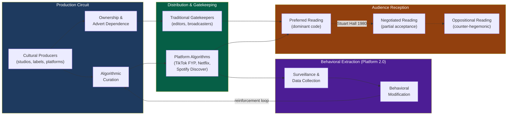

# Media, Culture, and Cultural Industries

> [!abstract] TL;DR
> Cultural industries are the institutional machinery through which societies produce, distribute, and contest meaning at scale. From Adorno's 1944 critique of mass culture as standardized commodity to Zuboff's 2019 analysis of behavioral modification via algorithmic surveillance, the sociology of media asks one persistent question: who controls the production of shared reality, and whose interests does that control serve?

---

## Intuition

**Analogy:** Imagine a city where all the mirrors — in shops, homes, public squares — are manufactured by three companies. Each company grinds their mirrors with a slight curvature: one makes people look slightly wealthier than they are, one makes threats look larger, one makes the city's skyline look a specific color. Nobody forces you to believe the mirrors. You freely choose which rooms to enter. But because every surface reflects the same subtle distortions, after enough time the distortion *becomes* your baseline of normal. You no longer notice the curvature; you simply see "the world."

This is what Adorno meant by the culture industry, what Gramsci meant by hegemony, and what Baudrillard meant by simulacra. The point is not that media brainwashes a passive audience. The point is that the systematic, institutional production of representations — operating at scale over years — shapes the taken-for-granted background of social reality. Culture does not force; it furnishes the rooms in which free people make their choices.

---

## How It Works

### Core Mechanics

Cultural production and reception move through three stages:

1. **Production circuit**: Cultural producers (studios, publishers, platforms, labels) operate under political-economic constraints — ownership, advertiser dependence, algorithmic optimization — that shape what gets made, how it gets framed, and which voices are amplified or silenced.
2. **Distribution and gatekeeping**: Content passes through institutional gatekeepers (editors, curators, recommendation algorithms, search engines) who select, rank, and frame. In the broadcast era, three networks set the national agenda; in the platform era, a handful of algorithmic systems do.
3. **Reception and decoding**: Audiences are not passive. Stuart Hall's encoding/decoding model shows that the same cultural text yields different readings depending on the reader's social position, cultural competence, and critical awareness. Meaning is not transmitted; it is produced at the point of reception.

The Frankfurt School and political economy tradition emphasize Stage 1 (production determines limits). Cultural studies (Hall, Williams, Fiske) emphasize Stage 3 (audiences negotiate and resist). Platform sociology (Zuboff, van Dijck) emphasizes a new Stage 4: *behavioral extraction* — platforms do not merely distribute meaning; they mine audience responses to optimize the content pipeline in real time.

### Flow / Architecture



---

## Key Concepts

### Secondary Level

**What is culture?** Raymond Williams (1958, 1976) identified three historical usages that are each still active:

| Usage | Definition | Example |
|---|---|---|
| Culture as excellence | The best works of art and thought — "high culture" | Shakespeare, Beethoven, the canon |
| Culture as way of life | The whole way of life of a people — habits, values, customs | Football as English culture |
| Culture as signifying practices | The systems through which meaning is produced and shared | Language, advertising, fashion |

Williams's third definition is the sociological one. It shifts attention from *objects* (great works) to *processes* (how meaning is made, by whom, for whom, with what social consequences).

**Mass media basics:** Mass media refers to technologies that enable centralized production and broad distribution of messages to large, geographically dispersed audiences — newspapers, radio, television, and their digital successors. The key sociological feature is asymmetry: a small number of senders produce content for a large number of receivers with little capacity for feedback or dialogue. This asymmetry makes mass media a structural resource for social power.

**Cultural industries:** The term (industrie culturelle, Adorno & Horkheimer, 1944) describes the commercial production of cultural goods — music, film, broadcasting, publishing, games — under the same profit-maximizing logic as any other industry. The critical force of the term is its deliberate collision: *culture* implies creativity, authenticity, and meaning; *industry* implies standardization, commodity production, and exchange value. Adorno argued the collision was not accidental — capitalism had genuinely industrialized cultural production with predictable consequences for cultural form.

---

### Undergraduate Level

**The Frankfurt School: Culture Industry (Adorno & Horkheimer, 1944)**

In *Dialectic of Enlightenment*, Adorno and Horkheimer diagnosed mass culture as the completion of the commodity form in the cultural domain. Three mechanisms characterize the culture industry:

1. **Standardization**: Cultural products converge on a limited set of formulae — the three-act film structure, the AABA pop song, the thriller with the twist in chapter twenty. The formula is disguised by the promise of individuality (the star's "unique" personality, the slight variation in plot) but the underlying structure is invariant.
2. **Pseudo-individualization**: Consumers are sold the experience of free choice and authentic self-expression while consuming identical products. The teenager who "discovers" their taste in music via algorithm-curated playlists believes they have exercised individual preference; they have consumed a pre-sorted menu. The appearance of freedom performs ideological work.
3. **The culture industry as social cement**: Mass culture serves the existing social order not through overt propaganda but through the satisfaction effect — it absorbs and neutralizes discontent by providing vicarious pleasure, diversion, and the illusion of wish-fulfillment. Audiences return to work without the energy or clarity to challenge the conditions that exhaust them.

Adorno's most controversial claim: popular music's standardization is not incidental but functionally necessary for capitalism — it provides predictable, risk-managed entertainment to a workforce that must reliably reproduce its labor power daily. This makes the culture industry qualitatively different from pre-capitalist folk culture or bourgeois high art, both of which preserved some utopian surplus that exceeded social function.

**Gramsci's Cultural Hegemony**

Antonio Gramsci, writing from a Fascist prison (1929–1935), asked why the working class had not revolted despite material exploitation. His answer: hegemony — the process by which a ruling group achieves and maintains dominance not through force alone but through the active *consent* of the dominated.

Key components:

- **Hegemony vs. domination**: Pure domination (coercion, police, army) is costly and unstable. Hegemony is the incorporation of subordinate group interests into a world-view that presents ruling-class interests as the *natural* interests of all. A worker who believes "hard work leads to success" and "the market rewards merit" has consented to arrangements that may not serve them — not because they were brainwashed, but because the dominant culture provides coherent, emotionally satisfying answers to their lived experience.
- **Organic vs. traditional intellectuals**: Every social group generates organic intellectuals — those who give it homogeneity and self-awareness (trade union organizers, parish priests, journalists). Traditional intellectuals appear to be independent of any class (professors, judges) but historically represent inherited ruling-class interests. The culture industry employs traditional intellectuals (journalists, artists, commentators) who reinforce hegemonic common sense.
- **The war of position**: Since consent is culturally produced, challenging capitalist hegemony requires a cultural war of position — gradually building counter-hegemonic institutions (alternative media, community organizations, union education) before a political rupture becomes possible. Gramsci's insight made culture politically strategic: capturing the mass media is not less important than controlling the state apparatus.

**Stuart Hall: Encoding/Decoding (1980)**

Hall's model replaced the linear sender-message-receiver communication model with a structured production/consumption circuit:

- **Encoding**: Media producers encode messages within a dominant ideological framework — the "preferred reading" — using the professional codes and conventions of their medium. This is not necessarily conscious propaganda; it is the result of working within naturalized professional assumptions about what is newsworthy, normal, and legitimate.
- **Decoding**: Audiences decode messages from their own social positions and cultural competences, producing three types of reading:

| Reading | Description | Example |
|---|---|---|
| **Preferred (dominant)** | Audience accepts the encoded meaning fully | Watching a news segment on "illegal immigration" and accepting the frame of national security threat |
| **Negotiated** | Partial acceptance; audience applies local reservations | Accepting that immigration is an issue but disputing the proposed solutions |
| **Oppositional** | Audience fully decodes the message and rejects the frame | Reading the same segment as a capitalist-state legitimation of racist border enforcement |

Hall's model was politically important: it established that audiences were not cultural dupes. But the capacity for oppositional reading is unevenly distributed — it requires cultural resources, critical education, and alternative media. Access to oppositional frameworks is itself a question of class and social position.

**Media Effects: From Hypodermic Needle to Two-Step Flow**

The history of media effects theory is a progressive revision of initial overestimates of media power:

1. **Hypodermic needle / magic bullet** (1920s–1940s): Mass media directly "injects" attitudes and behaviors into passive audiences. Rooted in WWI propaganda hysteria and Orson Welles's 1938 War of the Worlds panic (which was, the sociology later showed, far less widespread than reported).
2. **Limited effects / two-step flow** (Lazarsfeld, Katz & Lazarsfeld 1955): The *Personal Influence* study found that media effects are mediated by opinion leaders — active media consumers who interpret and relay messages through interpersonal networks. Social relations, not mass media, drive attitude change. This model was important: it showed that mass communication is re-embedded in social structure before it reaches individual cognitions.
3. **Agenda setting** (McCombs & Shaw, 1972): Media cannot tell people what to think but is "stunningly successful in telling its readers what to think about" (Cohen 1963). Issue salience in news correlates strongly with perceived public importance — not by changing minds but by structuring the attention economy of civic discourse.

**Convergence Culture and Participatory Culture (Jenkins, 2006)**

Henry Jenkins diagnosed a structural transformation in media from broadcast to convergence:

- **Media convergence**: The flow of content across multiple media platforms — a story world that lives simultaneously in a film, video game, television series, novel, theme park, and fan wiki. Not just technological convergence (all media on one device) but narrative convergence (one story world across all platforms).
- **Participatory culture**: The collapse of the distinction between media producer and consumer. Fans are no longer passive receivers but active creators — writing fan fiction, producing parody videos, building wikis, running alternate reality games. Jenkins calls these *transmedia storytelling* practices.
- **Collective intelligence** (Lévy): No individual possesses all knowledge; in convergence culture, communities pool interpretive competences. The commentariat watching a serialized television drama collectively exceeds any individual analyst's interpretive capacity.

Jenkins was broadly optimistic about participatory culture as democratizing. Critics (Andrejevic, Dean) noted that participatory labor is a source of value extracted without compensation — YouTube creators generate content that Google monetizes; Twitter users generate the engagement that Twitter sells to advertisers. Participatory culture and exploitation are compatible.

---

### Graduate Level

**Platform Capitalism: Surveillance Capitalism (Zuboff, 2019)**

Shoshana Zuboff's *The Age of Surveillance Capitalism* (2019) proposed a new economic logic operating beyond both industrial capitalism and the service economy:

- **Behavioral surplus**: Platforms like Google and Facebook discovered that the data generated by user behavior (clicks, dwell time, scroll patterns, purchase paths) was more valuable than the service itself. This "behavioral surplus" — data beyond what is needed to improve the service — is the raw material of surveillance capitalism.
- **Prediction products**: Behavioral surplus is processed by machine learning systems to produce prediction products — increasingly accurate forecasts of user future behavior — which are sold to advertisers. The customer is not the user; the customer is the entity that wants to modify user behavior.
- **Behavioral modification**: The endpoint logic extends beyond prediction to *modification* — engineering the user's behavioral context to make desired behaviors more likely (more purchases, more clicks, more emotional engagement, more platform time). Zuboff argues this crosses from surveillance into instrumentarian power — the technological capacity to shape human behavior at scale without the targets' knowledge or consent.

**Van Dijck's Platform Society (2018)**

Jose van Dijck and colleagues analyze platformization as a societal transformation, not merely a commercial development:

- **Datafication**: All social activities are rendered as data — likes, follows, check-ins, purchases, location traces — creating a perpetual quantification of social life.
- **Commodification**: Datafied social connections are monetized — the social graph becomes an advertising targeting system; the friendship network becomes a distribution channel.
- **Selection**: Algorithmic selection determines visibility — what content surfaces, which voices are amplified, which businesses are discoverable. Curation is not neutral; it embeds commercial, political, and value choices.

Van Dijck distinguishes platforms from traditional media: traditional media companies produce content; platforms host it. But this distinction obscures the degree to which platform design choices (what gets amplified, what gets downranked, what triggers notifications) are editorial choices without editorial accountability.

**Baudrillard: Simulacra and Hyperreality (1981)**

Jean Baudrillard's *Simulacra and Simulation* proposed a philosophy of media as the dissolution of the real:

The relationship between representations and reality has passed through four historical orders:

| Order | Relationship | Era | Example |
|---|---|---|---|
| **1st** | The sign is a faithful copy of reality | Pre-modern | A painted portrait of a real person |
| **2nd** | The sign masks and distorts reality | Industrial | A brand promise that exaggerates product benefits |
| **3rd** | The sign masks the absence of reality | Early media | A president's televised persona with no underlying authentic self |
| **4th** | The sign has no relation to reality — pure simulacrum | Hyperreal | A Disney theme park simulation of "American history" that becomes more real to visitors than actual history |

**Hyperreality**: The fourth-order condition in which the simulation precedes and generates the "real." Disneyland's Main Street, USA, is not a copy of an American main street; it is the model from which American urban developers now build new town centers. Baudrillard's Gulf War essays argued the media war (clean precision strikes, video-game visuals, casualty-free news) bore no relation to the material war — and that this disjunction was not a distortion but the new normal of representation.

Applied to cultural industries: streaming platforms do not reflect existing cultural taste but generate it. TikTok's For You Page does not surface what users independently prefer; it shapes the preferences it appears to satisfy. The algorithm is a simulacrum that produces the cultural reality it claims to discover.

**Political Economy of Culture: Mosco, Garnham, Miège**

The political economy of communication tradition (Mosco's *The Political Economy of Communication*, 1996; Garnham's *Capitalism and Communication*, 1990) grounds cultural production in material economic conditions:

- **Commodification of content**: Cultural goods are produced as commodities — valued for exchange, not use. The pressure to commodify pushes toward standardization (safer investments), star systems (risk-pooling through brand identity), and the annihilation of cultural forms that do not yield profitable audiences.
- **Commodification of audiences** (Smythe, 1977): Broadcasting's "product" is not programmes — it is audiences, sold to advertisers. Audience attention is the commodity. Platform advertising extends this: not just attention but behavioral data and behavioral modification services.
- **Spatialization**: Media ownership concentration enables global-scale cultural distribution, crowding out locally produced cultural forms. Garnham calls this cultural imperialism at the structural level — not a US government conspiracy but the market logic of scale economies in cultural production.

**Cultural Imperialism and Globalization**

Herbert Schiller's *Mass Communications and American Empire* (1969) argued that US media penetration into developing nations served Cold War ideological and economic interests — not through force but through the seductive appeal of high-production-value entertainment that local producers could not match. The theory has been contested:

- Active audience research (Liebes & Katz, *The Export of Meaning*, 1990) showed that audiences in different national contexts decoded the same American television programme (Dallas) in radically different ways — Israeli Moroccan Jews, Israeli Arabs, kibbutz members, and American viewers produced incommensurable readings of identical content.
- Hybridity (Appadurai's *mediascapes*, Bhabha's postcolonial theory) suggests global media flows create locally inflected cultural hybrids rather than simple American cultural replacement — K-Pop, Nollywood, and Bollywood are global phenomena produced outside the US-centric culture industry.
- Yet the political economy critique remains: production infrastructure, distribution networks, and platform architecture remain concentrated in the US and China, structuring what kinds of cultural production are globally visible regardless of local reception diversity.

---

## Python Demo

```python
# Two-Step Flow Agenda-Setting Model
# Demonstrates how media salience of issues translates to public concern
# and how ownership concentration amplifies this agenda-setting power.
# Uses numpy and matplotlib only.

import numpy as np
import matplotlib.pyplot as plt

rng = np.random.default_rng(42)

N_ISSUES = 5   # five distinct policy issues tracked simultaneously
T = 60         # time steps (each step ~ one news cycle)


def run_agenda_model(n_outlets, concentration, T=60, seed=42):
    """
    Simulate two-step agenda-setting flow.

    n_outlets     : number of independent media outlets
    concentration : 0.0 = fully independent, 1.0 = monopoly (all outlets same owner agenda)

    Returns:
        ol_history  : (T, N_ISSUES) opinion leader salience over time
        ma_history  : (T, N_ISSUES) mass audience salience over time
    """
    local_rng = np.random.default_rng(seed)

    # Each outlet starts with a randomly drawn issue agenda (Dirichlet = normalized weights)
    outlet_agendas = local_rng.dirichlet(np.ones(N_ISSUES), size=n_outlets)  # (outlets, issues)

    # Owner's master agenda (e.g. maximize conflict around issue 0, suppress issue 4)
    owner_agenda = np.array([0.45, 0.25, 0.15, 0.10, 0.05])

    # Blend outlet agendas toward owner agenda based on concentration parameter
    # concentration=0: pure diversity; concentration=1: pure owner control
    blended = (1.0 - concentration) * outlet_agendas + concentration * owner_agenda
    blended /= blended.sum(axis=1, keepdims=True)   # renormalize rows

    # Media signal each timestep: mean across outlets (equal-weight assumption)
    media_signal = blended.mean(axis=0)

    # Initial public beliefs: uniform across issues
    ol_concern = np.full(N_ISSUES, 1.0 / N_ISSUES)   # opinion leaders
    ma_concern = np.full(N_ISSUES, 1.0 / N_ISSUES)   # mass audience

    ol_history = []
    ma_history = []

    for _ in range(T):
        # Opinion leaders: high media exposure, update quickly toward media agenda
        ol_concern = 0.65 * ol_concern + 0.35 * media_signal
        ol_concern /= ol_concern.sum()

        # Mass audience: primary exposure via opinion leaders (two-step),
        # secondary exposure via direct media (much weaker)
        ma_concern = 0.82 * ma_concern + 0.15 * ol_concern + 0.03 * media_signal
        ma_concern /= ma_concern.sum()

        ol_history.append(ol_concern.copy())
        ma_history.append(ma_concern.copy())

    return np.array(ol_history), np.array(ma_history)


def gini_coefficient(arr):
    """Measure salience inequality across issues (0 = equal, 1 = monopoly of attention)."""
    arr = np.sort(np.abs(arr))
    n = len(arr)
    if arr.sum() == 0:
        return 0.0
    return (2.0 * np.dot(np.arange(1, n + 1), arr) - (n + 1) * arr.sum()) / (n * arr.sum())


# --- Three ownership scenarios ---
scenarios = [
    ("Diverse Media\n(10 outlets, conc=0.0)",  10, 0.0,  "#2a9d8f"),
    ("Consolidated Media\n(4 outlets, conc=0.6)", 4, 0.6, "#e9c46a"),
    ("Near-Monopoly\n(2 outlets, conc=0.95)",   2, 0.95, "#e63946"),
]

t_axis = np.arange(T)
issue_labels = ["Immigration", "Healthcare", "Climate", "Economy", "Education"]
issue_colors = ['#264653', '#457b9d', '#2a9d8f', '#e9c46a', '#e76f51']

fig, axes = plt.subplots(2, 3, figsize=(15, 9))
fig.suptitle(
    "Agenda-Setting Dynamics: Two-Step Flow Model\n"
    "Effect of Media Ownership Concentration on Public Issue Salience",
    fontsize=13, fontweight='bold'
)

for col, (title, n_outlets, concentration, scenario_color) in enumerate(scenarios):
    ol_hist, ma_hist = run_agenda_model(n_outlets, concentration, T)

    # Top row: opinion leader salience
    ax_ol = axes[0][col]
    for i, (color, label) in enumerate(zip(issue_colors, issue_labels)):
        ax_ol.plot(t_axis, ol_hist[:, i], color=color, linewidth=2, label=label)
    ax_ol.axhline(1.0 / N_ISSUES, linestyle='--', color='gray', alpha=0.5, linewidth=1)
    ax_ol.set_title(f"{title}\nOpinion Leaders", fontsize=10)
    ax_ol.set_ylim(0, 0.6)
    ax_ol.set_ylabel("Salience share" if col == 0 else "")
    ax_ol.set_xlabel("News cycles")
    if col == 0:
        ax_ol.legend(fontsize=8, loc='upper right')

    # Bottom row: mass audience salience
    ax_ma = axes[1][col]
    for i, (color, label) in enumerate(zip(issue_colors, issue_labels)):
        ax_ma.plot(t_axis, ma_hist[:, i], color=color, linewidth=2, label=label)
    ax_ma.axhline(1.0 / N_ISSUES, linestyle='--', color='gray', alpha=0.5, linewidth=1)
    ax_ma.set_title(f"Mass Audience", fontsize=10)
    ax_ma.set_ylim(0, 0.6)
    ax_ma.set_ylabel("Salience share" if col == 0 else "")
    ax_ma.set_xlabel("News cycles")

plt.tight_layout()
plt.show()

# --- Print summary statistics ---
print("=== Agenda-Setting Model: Final State Summary ===\n")
print(f"{'Scenario':<40} {'Dominant Issue':>20}  {'Gini (OL)':>10}  {'Gini (MA)':>10}")
print("-" * 85)

for title, n_outlets, concentration, _ in scenarios:
    label = title.replace("\n", " ")
    ol_hist, ma_hist = run_agenda_model(n_outlets, concentration, T)
    final_ol = ol_hist[-1]
    final_ma = ma_hist[-1]
    dominant = issue_labels[np.argmax(final_ma)]
    g_ol = gini_coefficient(final_ol)
    g_ma = gini_coefficient(final_ma)
    print(f"{label:<40} {dominant:>20}  {g_ol:>10.3f}  {g_ma:>10.3f}")

print()
print("Gini coefficient: 0.0 = all issues equally salient; 1.0 = all attention on one issue.")
print("Two-step flow lag: mass audience Gini < opinion leader Gini at any timestep")
print("(social network diffusion attenuates the direct media signal).")
```

**What the model demonstrates:**

- Under diverse media (10 outlets, no concentration), issue salience equilibrates toward parity — no single issue monopolizes public concern.
- As concentration rises, the owner's agenda (artificially amplifying immigration, suppressing education) propagates to opinion leaders first, then to mass audiences with a social-network lag — this is the two-step flow delay.
- The Gini coefficient across issues rises monotonically with concentration, formalizing the sociological claim that media consolidation compresses the civic agenda.
- The mass audience always shows a slightly lower Gini than opinion leaders at any given timestep, because interpersonal communication partially diversifies the signal — consistent with Katz and Lazarsfeld's original empirical finding that social ties moderate media influence.

---

## Real-World Applications

> **Example 1 — Disney's Cultural Conglomerate**: The Walt Disney Company owns Marvel, Lucasfilm (Star Wars), Pixar, 20th Century Studios, ABC, ESPN, Hulu, and Disney+. This is Adorno's culture industry thesis made structural: the same intellectual property circulates as film, streaming series, theme park experience, merchandise, video game, and branded clothing — standardized transmedia storytelling wrapped in pseudo-individualized consumer "fandoms." Disney's industrial apparatus produces cultural attachment to its properties at a scale that structurally advantages its IP against independent cultural production.

> **Example 2 — TikTok's For You Page as Baudrillardian Simulacrum**: TikTok's recommendation algorithm does not reflect pre-existing user taste; it engineers the taste it measures. Users who spend three extra seconds on a specific video type receive more of that content; the extended attention was not a preference declaration but a behavioral signal extracted without awareness. The resulting "taste profile" is a simulacrum — a model of preference with no original. Zuboff's surveillance capitalism framework precisely describes TikTok's economic logic: behavioral surplus (every scroll, pause, replay, share) is the raw material fed into prediction products sold to advertisers.

> **Example 3 — K-Pop as Convergence Culture**: South Korean K-Pop challenges cultural imperialism theory. BTS operates across YouTube, streaming services, reality television, webtoons, video games, and virtual concerts — a textbook Jenkins transmedia system. Its global fanbase (ARMY) performs the participatory culture Jenkins described: fan-produced translations, analysis, choreography tutorials, and political mobilization (flooding Dallas police app crash reports with BTS content during 2020 protests). Yet critics note the Korean entertainment industry's production model reproduces the culture industry's logic internally — extreme standardization, trainee labor exploitation, and highly managed pseudo-individualization of idol personas.

> **Example 4 — Rupert Murdoch and Hegemonic Common Sense**: News Corp's global portfolio (Fox News, The Wall Street Journal, The Sun, The Australian, The Times) represents a Gramscian hegemony project in Murdoch's own terms — deliberately shifting the Overton window of political possibility toward market conservatism, immigration restriction, and climate skepticism. The mechanism is not propaganda (overt lying) but agenda-setting, framing, and the selection of what counts as reasonable debate. Fox News's commercial success depends on producing a coherent ideological world-view that feels like reality to its audience — the definition of successful hegemonic common sense.

> **Example 5 — Spotify Discover Weekly as Recommendation and Cultural Narrowing**: Spotify's Discover Weekly algorithm offers 30 personalized tracks weekly, marketed as revealing users' "unique taste." In practice, the algorithm optimizes for streams, completion rates, and saves — proxies for engagement, not for aesthetic value or discovery of culturally marginal work. The result is filter bubbles in music: experimental, politically challenging, or culturally non-mainstream genres are systematically underweighted because they produce less reliable engagement signals. Platform recommendation is simultaneously the most personalized cultural experience in history and a mechanism for commercial homogenization — pseudo-individualization at algorithmic scale.

---

## Common Pitfalls

- **The hypodermic needle fallacy** — Treating media audiences as passive recipients of cultural injection. The weight of empirical research since Lazarsfeld (1940s) through active audience studies (1980s–2000s) to digital media research shows that audiences are active interpreters who bring existing social positions to bear on media content. Media effects are real but mediated — they operate through social networks, existing predispositions, and cultural competences, not by bypassing cognition.

- **Assuming oppositional readings are emancipatory** — Hall's model shows that audiences can produce oppositional readings of dominant cultural texts; this is true. But John Fiske's extension of this logic ("popular culture is always potentially subversive") was criticized for romanticizing consumption. Buying a T-shirt with an anti-capitalist slogan does not constitute counter-hegemonic cultural practice. The capacity for oppositional reading requires cultural resources and social networks that are themselves unequally distributed — oppositional decoding is not free.

- **Conflating media concentration with media effects** — Concentrated media ownership increases the probability that a narrow range of interests structures public discourse, but it does not guarantee any specific effect on any specific audience. The relationship between media structure and audience cognition is mediated by interpersonal networks, prior beliefs, and competitive information environments. Structural analysis and audience effects analysis are both necessary; neither is sufficient alone.

- **Treating digital participatory culture as democratization** — Jenkins's convergence culture framework emphasized the empowerment of participatory audiences. The subsequent decade showed that platform-hosted participation generates value for platform owners (not participants), that harassment and disinformation are features of participatory culture alongside creativity, and that the tools of participatory culture (viral sharing, remix, collective intelligence) serve authoritarian movements as readily as progressive ones.

- **Applying Frankfurt School critique unchanged to digital media** — Adorno's culture industry thesis was developed in response to the specific political-economic structure of 1940s American commercial broadcasting. Platform capitalism has a fundamentally different economic logic: behavioral extraction and modification rather than mass standardization for passive consumption. Applying Adorno's pseudo-individualization framework to Netflix or Spotify misses the novel mechanism — these platforms offer genuine personalization at scale, but at the cost of behavioral surveillance that Adorno did not theorize.

- **Underestimating the materiality of the internet** — The discourse of "the cloud," "virtual space," and "digital culture" obscures the material infrastructure that cultural industries now depend on: undersea cables, massive data centers consuming gigawatts of electricity, rare earth mineral supply chains for devices, and the geographic concentration of server infrastructure in specific territories that makes "global" platforms subject to US legal jurisdiction. Cultural production and distribution are material processes; their geography and resource dependencies shape who can participate.

---

## Related Concepts

- [[_MOC_Social_Institutions|↑ Social Institutions MOC]] — Section map for all Social Institutions notes
- [[Media_Propaganda_and_Political_Communication]] — This note covers the political communication dimension of media: agenda-setting theory, framing, the two-step flow model, and propaganda techniques. The present note situates those mechanisms within a broader political economy and cultural theory framework; the two are best read together.
- [[Socialism_Marxism_and_Communism]] — Gramsci's cultural hegemony and the Frankfurt School's critique of the culture industry are both developments of the Marxist tradition. The base/superstructure model is the foundation for understanding how cultural production relates to economic structure.
- [[Technology_AI_and_Politics]] — Zuboff's surveillance capitalism and van Dijck's platform society intersect directly with AI-driven political communication: recommendation algorithms as political infrastructure, computational propaganda, and the data economy's role in electoral politics.
- [[Globalization_and_Its_Discontents]] — Cultural imperialism, media conglomerate power across national markets, and the tension between US media dominance and local cultural production are dimensions of economic globalization with specifically cultural stakes.
- [[Attitudes_and_Persuasion]] — The Elaboration Likelihood Model (Petty & Cacioppo) is the psychological mechanism underlying encoding/decoding: high-elaboration audiences process cultural messages via the central route; low-elaboration audiences are more responsive to peripheral cues, emotional framing, and identity signals. Cialdini's principles map onto specific media persuasion techniques.
- [[Social_Influence_and_Conformity]] — Social proof, normative influence, and conformity explain how perceived cultural consensus (manufactured via algorithmic amplification, astroturfing, and follower counts) generates genuine shifts in cultural behavior — which music to stream, which films to watch, which opinions to express publicly.
- [[Group_Dynamics]] — Group polarization formally models how communities of like-minded media consumers become more extreme over time — the social-psychological micro-mechanism behind online echo chambers and fandom radicalization.
- [[Prejudice_and_Discrimination]] — Media framing of out-groups (racial minorities, immigrants, LGBTQ+ communities) activates intergroup hostility mechanisms. Cultural representation is not merely aesthetic; it has documented consequences for prejudice levels and discrimination rates.
- [[Recommendation_System]] — The technical architecture of collaborative filtering, content-based filtering, and neural recommendation systems is the engineering implementation of the agenda-setting and pseudo-individualization processes described here. The algorithmic system optimizes for behavioral signals that are proxies for cultural engagement.
- [[Text_Classification]] — NLP-based sentiment analysis, stance detection, and content moderation are the computational tools through which platforms govern their cultural output. Fine-tuned transformer models implement the platform curation function at scale — they are the automated gatekeepers of the algorithmic distribution layer.

---

## Review Questions

### Secondary

1. Adorno argued that pop music "standardizes" culture while appearing to offer variety. Find a contemporary streaming platform's top-ten chart and identify at least three structural similarities (tempo, song length, verse-chorus structure, lyrical themes) across different artists. Does this confirm or challenge Adorno's thesis? What would a defender of the streaming era say in response?

2. Stuart Hall says the same cultural text can produce "preferred," "negotiated," and "oppositional" readings. Pick a currently popular film or television show. What would each of these three readings look like, and what kind of audience background or social position would be associated with each?

### Undergraduate

3. Gramsci's concept of hegemony explains how the ruling class maintains dominance through *consent* rather than coercion alone. Identify a contemporary "common sense" belief about work, success, or social mobility that could be analyzed as hegemonic — that is, it serves dominant-class interests while appearing natural and universal. What counter-hegemonic narratives or cultural institutions challenge this belief, and how effectively?

4. The two-step flow model (Lazarsfeld/Katz) was developed in the 1940s–1950s broadcast era. How does social media influencer culture update or challenge the two-step flow model? Are influencers analogous to opinion leaders, or does the platform-mediated relationship between influencer and audience differ in sociologically important ways?

5. Henry Jenkins celebrates participatory culture as democratizing media production. Andrejevic and others argue that participatory platforms extract unpaid labor from their users. Evaluate both positions. Under what economic and institutional conditions might participatory culture be genuinely democratizing rather than an intensified form of cultural commodification?

### Graduate

6. Zuboff argues that surveillance capitalism constitutes a new economic logic irreducible to earlier forms of capitalism. Critique this argument from a political economy perspective: is behavioral data extraction genuinely novel, or does it represent the extension of commodification of audiences (Smythe, 1977) to the digital sphere? What are the empirical and theoretical stakes of this distinction for regulatory strategy?

7. Baudrillard's concept of hyperreality predicts that in a fully simulated media environment, the distinction between "authentic" and "manufactured" culture becomes meaningless. Apply this framework to one contemporary platform — TikTok, Instagram, or Twitch — and assess whether Baudrillard's fourth-order simulacrum is descriptively accurate or whether some empirical residue of "the real" continues to anchor cultural production and reception. Where does the framework succeed and where does it fail?

8. Cultural imperialism theory (Schiller) and active audience theory (Liebes & Katz) offer opposing predictions about the cultural consequences of US media globalization. Design a comparative research project that could adjudicate between them. What unit of analysis would you use, what would you measure, what methodological challenges arise, and how would each theory handle the specific case of K-Pop's global penetration?

---

## Sources

- [Theodor Adorno and Max Horkheimer, "The Culture Industry: Enlightenment as Mass Deception," in *Dialectic of Enlightenment* (1944; Stanford University Press trans. 2002)](https://www.sup.org/books/title/?id=9334)
- [Antonio Gramsci, *Selections from the Prison Notebooks*, ed. Quintin Hoare and Geoffrey Nowell Smith (Lawrence & Wishart, 1971)](https://www.lwbooks.co.uk/selections-from-the-prison-notebooks)
- [Stuart Hall, "Encoding/Decoding," in *Culture, Media, Language* (Hutchinson, 1980)](https://www.worldcat.org/title/culture-media-language/oclc/7105816)
- [Raymond Williams, *Keywords: A Vocabulary of Culture and Society* (Fontana, 1976; Oxford University Press, 1985)](https://global.oup.com/academic/product/keywords-9780195204698)
- [Elihu Katz and Paul Lazarsfeld, *Personal Influence: The Part Played by People in the Flow of Mass Communications* (Free Press, 1955)](https://www.worldcat.org/title/personal-influence/oclc/410814)
- [Henry Jenkins, *Convergence Culture: Where Old and New Media Collide* (NYU Press, 2006)](https://nyupress.org/9780814742952/convergence-culture/)
- [Shoshana Zuboff, *The Age of Surveillance Capitalism* (PublicAffairs, 2019)](https://www.publicaffairsbooks.com/titles/shoshana-zuboff/the-age-of-surveillance-capitalism/9781610395694/)
- [Jose van Dijck, Thomas Poell, and Martijn de Waal, *The Platform Society* (Oxford University Press, 2018)](https://doi.org/10.1093/oso/9780190889760.001.0001)
- [Jean Baudrillard, *Simulacra and Simulation* (1981; University of Michigan Press trans. 1994)](https://www.press.umich.edu/9780472065219/simulacra-and-simulation/)
- [Dallas Smythe, "Communications: Blindspot of Western Marxism," *Canadian Journal of Political and Social Theory* 1(3), 1977](https://journals.uvic.ca/index.php/ctheory/article/view/15573)
- [Tamar Liebes and Elihu Katz, *The Export of Meaning: Cross-Cultural Readings of Dallas* (Oxford University Press, 1990)](https://global.oup.com/academic/product/the-export-of-meaning-9780195068108)
- [Herbert Schiller, *Mass Communications and American Empire* (Beacon Press, 1969; 2nd ed. Westview Press, 1992)](https://www.worldcat.org/title/mass-communications-and-american-empire/oclc/1026753)
- [Vincent Mosco, *The Political Economy of Communication* (Sage, 1996; 2nd ed. 2009)](https://uk.sagepub.com/en-gb/eur/the-political-economy-of-communication/book231370)
- [Maxwell McCombs and Donald Shaw, "The Agenda-Setting Function of Mass Media," *Public Opinion Quarterly* 36(2), 1972](https://doi.org/10.1086/267990)
- [Mark Andrejevic, *iSpy: Surveillance and Power in the Interactive Era* (University Press of Kansas, 2007)](https://kansaspress.ku.edu/978-0-7006-1519-7.html)

---

#Sociology #SocialInstitutions #Media #Culture #CulturalIndustries
