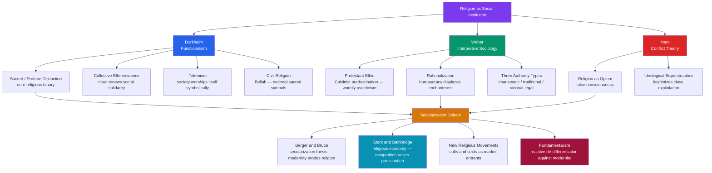

# Religion, Sacred, and Secular

> [!abstract] TL;DR
> The sociology of religion asks not whether God exists but what religion *does* — Durkheim found it creates solidarity through sacred/profane distinctions and collective effervescence; Weber traced how Calvinist theology accidentally launched capitalism through worldly asceticism; Marx called it false consciousness that legitimizes class rule; and the secularization debate remains unresolved: European decline is real, but Stark's religious economy model predicts that pluralistic competition raises participation, explaining why the hyper-pluralistic United States remains one of the most religious wealthy nations on Earth.

---

## Intuition

**Analogy:** Think of a football stadium on match day versus the same concrete shell on a quiet Tuesday morning. The building is identical. The seats, the pitch, the floodlights — all unchanged. Yet on match day something extraordinary happens. 80,000 strangers become *one thing*. They chant in unison, share agony and ecstasy with people they have never met, and leave feeling bound to one another in a way no formal contract could achieve. The stadium itself becomes sacred space; everyday objects — a scarf, a shirt — become loaded with meaning; and the experience of collective emotion does something to individuals that solitary experience cannot.

For Émile Durkheim, this is exactly the mechanism behind religion. The sacred/profane distinction, collective ritual, totemism — all are variations on the same basic social alchemy: ordinary life transformed by collective participation into something that reinforces who "we" are and why it matters. Religion is not primarily about God; it is primarily about the group worshipping itself, renewing its bonds through shared intensity.

Weber would add that the *content* of religious belief — not just its social function — shapes material history. The specific theology of Calvinist predestination, a doctrine about individual salvation, created a personality type that built capitalism. Ideas matter. Marx would counter: both are wrong to miss that religion is primarily a tool of the powerful — a beautiful story that makes the exploited feel their suffering is meaningful, temporary, or divinely ordained.

Three giants, three diagnoses of the same patient.

---

## How It Works



---

## Key Concepts

### Secondary Level

**The Sacred and the Profane (Durkheim)**
Durkheim's central claim in *The Elementary Forms of Religious Life* (1912) is that every religion divides the world into two exhaustive, mutually exclusive categories:
- **Sacred**: things set apart and forbidden — objects, places, times, and actions surrounded by taboo and ritual. They are treated with reverence, approached only through proper ceremony.
- **Profane**: the everyday, the ordinary, the instrumental — the vast bulk of human experience (eating, working, sleeping).

The sacred is not necessarily holy or morally good — a totem, a skull, a national flag can all be sacred. What defines the sacred is its *separation* from normal life and the community's response of awe and collective respect. Religion is the unified system of beliefs and practices relating to sacred things that binds believers into a moral community called a **church**.

**Collective Effervescence**
When a community gathers for religious ritual — a Hajj, a revival meeting, a mass, a funeral — participants experience heightened emotional energy that transcends individual experience. Durkheim called this *collective effervescence*: a fusion of individual consciousness into a group feeling. This shared intensity creates social solidarity and the sense that something greater-than-self exists. The "thrill" of religion is the thrill of the group experiencing itself as a unit.

**Religion as Social Glue**
Durkheim distinguished two types of social solidarity:
- **Mechanical solidarity**: premodern societies bound by sameness — shared beliefs, customs, religion. Religion is the central institution.
- **Organic solidarity**: modern industrial societies bound by functional interdependence (the division of labor). Religion loses its monopoly on social integration but remains important for community cohesion.

His worry: modern anomie (normlessness) results from weakened collective beliefs. Suicide rates are lower among Catholics than Protestants not because Catholicism is truer, but because it integrates individuals more strongly into the collective.

**Religion as Opium (Marx)**
Marx's famous line: "Religion is the sigh of the oppressed creature, the heart of a heartless world, and the soul of soulless conditions. It is the opium of the people." Religion offers compensatory spiritual rewards for material suffering, directs resentment toward heaven rather than toward capitalists, promises justice in the next life so the exploited accept injustice in this one. It is part of the ideological **superstructure** — cultural and legal institutions generated by the economic base — that legitimizes and reproduces class domination. Workers who believe earthly suffering is God's will are workers who do not revolt.

**The Protestant Work Ethic (Weber) — simplified**
Max Weber argued that modern capitalism required not just capital and technology but a *spirit* — a psychological orientation toward systematic, disciplined accumulation as a moral duty rather than mere greed. He traced this spirit to Calvinist Protestantism.

---

### Undergraduate Level

**Weber's Causal Chain: Predestination → Capitalism**

Calvin's doctrine of **predestination** held that God had already chosen — before birth — who would be saved (the elect) and who damned. No human works, sacraments, or priestly intercession could change this decree. The psychological result was a crisis of unprecedented anxiety: *Am I among the saved?* With no way to earn salvation, Calvinists sought *signs* of election in worldly success. Hard work, frugality, methodical rational conduct in one's **calling** (*Beruf*) — and the wealth they produced — became evidence of divine favor. Importantly, wealth could not be *enjoyed* (luxury was sinful), only reinvested. The structural result was systematic capital accumulation — the *spirit* of capitalism — as a by-product of religious anxiety.

Weber's claim was not that Calvinism *caused* capitalism (Babylon and ancient China had markets) but that it provided the specific **cultural software** that made modern *rational* capitalism possible in Europe and not elsewhere. This is a thesis about **elective affinity** between religious ideas and economic structures, not simple determinism.

**Weber's Rationalization and Disenchantment**
Weber saw modernity as a broad process of **rationalization** — the replacement of tradition, magic, custom, and sacred authority with systematic calculation, bureaucratic procedure, and scientific explanation. Religion itself undergoes rationalization: charismatic prophets are routinized into churches, sacred mysteries become doctrinal propositions, and priestly magic disappears into theology. The endpoint is **disenchantment** (*Entzauberung*): the world loses its magical and sacred character; nature is just nature, not inhabited by spirits; efficiency, not fate, governs outcomes. Weber was ambivalent — the "iron cage" of bureaucratic rationalism might be technically efficient but spiritually impoverishing.

**Three Types of Authority**
Weber's typology of legitimate domination:
| Type | Basis of Legitimacy | Religious Example |
|------|--------------------|--------------------|
| **Charismatic** | Personal gifts/revelation of the leader | Jesus, Muhammad, cult founders |
| **Traditional** | Sacred customs, hereditary rules | Pope, caste system priests |
| **Rational-Legal** | Rules and procedures, formal roles | Modern denominational clergy, church bureaucracy |

Charismatic authority is inherently unstable — it must be **routinized** into traditional or rational-legal forms to survive the founder's death. This explains why every new religious movement eventually becomes an institution.

**Church, Sect, Denomination, Cult (Troeltsch and Stark/Bainbridge)**
A classic typology of religious organizations:
| Type | Relationship to Society | Membership | Examples |
|------|------------------------|------------|---------|
| **Church (ecclesia)** | Dominant, monopolistic, claims whole society | Birth | Medieval Catholic Church, Church of England |
| **Denomination** | One among many; accepts pluralism | Birth + conversion | Methodists, Lutherans, US Baptists |
| **Sect** | Tension with society; separatist; high demands | Adult conversion | Jehovah's Witnesses, early Mormons |
| **New Religious Movement (cult)** | High tension; novel beliefs; deviates from mainstream | Conversion | Scientology, Heaven's Gate |

Stark and Bainbridge refine this: sects are *schismatic* (break from existing religion) while cults are *novel* (genuinely new belief systems). Both are high-tension, high-commitment groups.

**Civil Religion (Robert Bellah)**
Bellah (1967) argued that America possesses a **civil religion** — a set of beliefs, symbols, and rituals that are not officially Christian but function religiously:
- Sacred texts: the Declaration of Independence and Constitution
- Sacred sites: Gettysburg, Arlington Cemetery, Ground Zero
- Sacred rituals: the Pledge of Allegiance, Thanksgiving, Memorial Day
- Prophets: Washington, Lincoln, Martin Luther King Jr.
- Death and resurrection narrative: Lincoln's assassination redeems the Civil War's sin of slavery

Civil religion provides moral grounding for the polity without establishing an official faith — it makes the nation *sacred* and thereby gives political action transcendent meaning. It can be a force for critique (MLK invoking the American covenant against segregation) or for idolatry (nationalistic militarism).

**Secularization Thesis**
The classical secularization thesis (Weber, then Berger and Bruce in the 20th century): as societies modernize they become less religious. Mechanisms:
1. **Differentiation** — religion loses control of education, medicine, law, politics (each develops autonomous institutions)
2. **Rationalization** — science and bureaucracy replace religious explanations
3. **Privatization** — religion retreats from the public sphere to private conscience

*Evidence for*: rapid religious decline in Western Europe (UK, Germany, Scandinavia, France); secularization of law and medicine; institutional differentiation.

---

### Graduate Level

**Stark's Religious Economy Model: The Counter-Intuitive Prediction**
Rodney Stark and William Sims Bainbridge (*A Theory of Religion*, 1987; *The Churching of America*, 1992 with Roger Finke) argued that the secularization thesis mistakes European history for universal law. Their model treats religion as a **market**:

- **Demand** for religion is *stable* across societies — humans persistently seek compensators for unavoidable losses (death, suffering, injustice). No secular ideology has permanently satisfied these needs.
- **Supply** varies: churches are firms, religious leaders are entrepreneurs, doctrines are products. Different people want different religious products.
- Under **monopoly** (state-established church), the single supplier has no incentive to serve diverse needs efficiently. The population is nominally religious but weakly committed (Europe: high cultural affiliation, low attendance).
- Under **pluralism** (free religious market), competition drives denominations to serve specific segments intensely. Total participation rises because everyone can find a good fit.

**Stark's counter-intuitive prediction:** the more competition in a religious market, the higher the overall level of religious participation. The United States — with thousands of competing denominations and no established church — is empirically far more religious than Europe, despite (or because of) its pluralism. This is "American exceptionalism" explained sociologically, not theologically.

**Critiques of the religious economy model:**
- Ireland and Poland are highly religious despite near-monopoly Catholicism → monopoly doesn't always mean low commitment
- The model assumes religious demand is fixed and universal — empirically contested
- It under-theorizes social context (class, ethnicity, immigration) that shapes religious supply and demand
- Bruce's counter-argument: the US started with very low religious establishment, not an inherited monopoly that eroded — different baseline

**Global Religious Revival and Post-Secular Theory**
Berger himself recanted the secularization thesis by the 1990s. While Western Europe secularized, the rest of the world witnessed religious revival: Islamic resurgence across the Middle East, North Africa, and Southeast Asia; Pentecostal explosion in sub-Saharan Africa and Latin America; Hindu nationalism in India; charismatic Christianity in South Korea and China. Global secularization is simply false.

Jürgen Habermas' **post-secular** thesis: modern liberal democracies must learn to reason with religious voices in the public sphere rather than excluding them. Religious communities are "moral resource suppliers" — they articulate visions of the good life and critiques of market nihilism that purely procedural liberalism cannot generate.

**Fundamentalism as a Sociological Phenomenon**
Fundamentalism is not merely traditional religion — it is a *modern reactive* phenomenon. Karen Armstrong and the Fundamentalism Project (Marty and Appleby) argue that fundamentalist movements share:
- A sense of existential threat from secular modernity
- Selective retrieval of sacred texts as literal authority against critical scholarship
- Sharp boundary maintenance (us vs. them)
- Political engagement to re-differentiate — to re-merge what modernity separated (religion from state, from law, from education)

It is inherently dialectical: it cannot exist without the modernity it opposes. Christian fundamentalism arose in the 1910s–1920s as a reaction to Darwinism and biblical higher criticism. Political Islam as fundamentalism arose partly as a reaction to colonial imposed secularism (Kemalist Turkey, Nasser's Egypt).

**Durkheim's Totemism and Its Critics**
Durkheim's claim that Aboriginal Australian totemism represented "the simplest possible religion" — and therefore its study would reveal religion's essence — has been criticized:
- The ethnographic sources were unreliable (Spencer and Gillen's fieldwork)
- It imposed a Western model of "religion" onto practices not conceived that way by participants
- Critics (Evans-Pritchard, Goody) argued that totemism is not a universal stage but a specific cultural practice
- Yet the underlying insight remains influential: collective symbols function to represent and reinforce group identity regardless of their supernatural content

---

## Python Demo

```python
# Stark's Religious Economy Model — Simulation
# Core claim: religious pluralism (more denominations competing) raises overall participation
# because more groups can serve diverse preference niches efficiently.
# A monopoly church leaves large segments of the population poorly served.

import numpy as np
import matplotlib.pyplot as plt

np.random.seed(42)

N_PEOPLE = 2000

# Each person has a theological preference score in [0, 1]
# 0 = extremely conservative/authoritarian theology
# 1 = extremely liberal/individual theology
preferences = np.random.beta(2, 2, N_PEOPLE)  # bell-shaped distribution


def participation_rate(n_denominations, preference_weight=6.0):
    """
    Simulate a religious market with n_denominations.
    Each denomination is positioned uniformly across the preference spectrum.
    A person's probability of participating is a function of how well the
    nearest denomination matches their preference.

    preference_weight: how strongly mismatch penalizes participation
    (higher = people are pickier about doctrinal fit)
    """
    if n_denominations == 1:
        # Monopoly: single church at the center of the spectrum
        positions = np.array([0.5])
    else:
        # Pluralism: denominations spread across the spectrum
        positions = np.linspace(0.0, 1.0, n_denominations)

    # Distance from each person to their nearest denomination
    dist_matrix = np.abs(preferences[:, None] - positions[None, :])
    min_dist = np.min(dist_matrix, axis=1)

    # Participation probability decreases exponentially with doctrinal distance
    p_participate = np.exp(-preference_weight * min_dist)

    # Stochastic participation decision
    participated = p_participate > np.random.uniform(0, 1, N_PEOPLE)
    return np.mean(participated)


# --- Experiment 1: vary number of denominations ---
denom_range = np.arange(1, 26)
rates = [participation_rate(n) for n in denom_range]

# --- Experiment 2: visualize preference coverage for three market structures ---
x = np.linspace(0, 1, 500)
k = 6.0

# Monopoly (1 denomination at center)
monopoly_pos = np.array([0.5])
coverage_mono = np.max(np.exp(-k * np.abs(x[:, None] - monopoly_pos)), axis=1)

# Duopoly (2 denominations)
duopoly_pos = np.linspace(0, 1, 2)
coverage_duo = np.max(np.exp(-k * np.abs(x[:, None] - duopoly_pos)), axis=1)

# Pluralist market (8 denominations)
plural_pos = np.linspace(0, 1, 8)
coverage_plural = np.max(np.exp(-k * np.abs(x[:, None] - plural_pos)), axis=1)

# --- Plotting ---
fig, axes = plt.subplots(1, 2, figsize=(14, 6))
fig.suptitle("Stark's Religious Economy Model — Simulation", fontsize=13)

# Left panel: participation rate vs. number of denominations
axes[0].plot(denom_range, rates, "o-", color="#7c3aed", linewidth=2, markersize=5)
axes[0].axvline(x=1, color="#dc2626", linestyle="--", alpha=0.8, label="Monopoly church")
axes[0].axvline(x=10, color="#059669", linestyle="--", alpha=0.8, label="High pluralism")
axes[0].set_xlabel("Number of Competing Denominations", fontsize=11)
axes[0].set_ylabel("Overall Religious Participation Rate", fontsize=11)
axes[0].set_title("Pluralism Raises Participation\n(Stark's counter-intuitive prediction)")
axes[0].legend()
axes[0].grid(True, alpha=0.3)
axes[0].set_ylim(0, 1)

# Right panel: coverage curves
axes[1].fill_between(x, coverage_mono, alpha=0.35, color="#dc2626", label="Monopoly (1 denom.)")
axes[1].fill_between(x, coverage_duo, alpha=0.35, color="#d97706", label="Duopoly (2 denom.)")
axes[1].fill_between(x, coverage_plural, alpha=0.35, color="#059669", label="Pluralism (8 denom.)")
axes[1].plot(x, coverage_mono, color="#dc2626", linewidth=1.5)
axes[1].plot(x, coverage_duo, color="#d97706", linewidth=1.5)
axes[1].plot(x, coverage_plural, color="#059669", linewidth=1.5)
axes[1].set_xlabel("Theological Preference Spectrum\n(Conservative  ←——→  Liberal)", fontsize=11)
axes[1].set_ylabel("Appeal / Match Probability", fontsize=11)
axes[1].set_title("Doctrinal Coverage Across Preference Niches")
axes[1].legend()
axes[1].grid(True, alpha=0.3)

plt.tight_layout()
plt.savefig("religious_market_model.png", dpi=150, bbox_inches="tight")
plt.show()

mono_rate = participation_rate(1)
plural_rate_10 = participation_rate(10)
print(f"Monopoly church participation rate:        {mono_rate:.1%}")
print(f"10-denomination market participation rate: {plural_rate_10:.1%}")
print(
    f"\nStark's prediction: pluralism raises participation by ~{plural_rate_10 - mono_rate:.1%} "
    f"by serving diverse preference niches that a monopoly church ignores."
)
```

**What the simulation shows:** The left panel plots participation rate against the number of competing denominations — it rises steeply from a monopoly and levels off at high pluralism, matching Stark's prediction. The right panel shows *why*: a monopoly church centered at the median preference leaves both ends of the theological spectrum poorly served; 8 competing denominations provide strong coverage across the whole range.

---

## Real-World Applications

**US vs. European Religious Participation**
The US has never had a state church. The First Amendment banned religious establishment from 1791. The result is a religious marketplace with roughly 300+ denominations and thousands of independent congregations — fierce competition for members. US weekly church attendance (~40% by self-report; ~20% by observation) dwarfs that of state-church Europe (UK ~5%, Sweden ~3%). Stark's model explains this structural fact; the secularization thesis, premised on modernization, cannot — the US is the world's most technologically advanced economy and one of its most religious.

**The Pentecostal Explosion in the Global South**
Pentecostalism is the fastest-growing religious movement in world history — from near-zero in 1900 to roughly 700 million adherents by 2025. In Brazil, Chile, Nigeria, and South Korea, Pentecostal churches entered competitive religious markets and served segments (working-class urban migrants, women, the young) poorly served by the Catholic or mainline Protestant establishment. This is a textbook religious economy prediction fulfilled at continental scale.

**Weber's Thesis and East Asian Capitalism**
Weber argued that Confucian China *lacked* the Protestant-type inner-worldly asceticism and therefore would not generate capitalism organically. The postwar economic miracles of Japan, South Korea, Taiwan, Singapore, and Hong Kong challenged this: these Confucian societies produced rigorous capitalism without Calvinism. Scholars (Berger, Tu Wei-ming) proposed a "post-Confucian hypothesis" — that Confucian values (education, discipline, family solidarity, deferred gratification) functioned analogously to the Protestant ethic in generating capitalist behavior. Weber's method was vindicated even if his specific cultural analysis was parochial.

**Civil Religion and Political Conflict**
Bellah's civil religion generates both solidarity and conflict. When Martin Luther King Jr. invoked the Declaration of Independence to condemn segregation, he was wielding civil religion critically — holding America to its own sacred covenant. When "Christian nationalists" claim America is a Christian nation founded by God, they are claiming the civil religion's sacred authority for a sectarian agenda. The same symbols — Constitution, Founders, Providence — support opposite political programs. Civil religion is a contested resource.

**Fundamentalism and State Power**
The 1979 Iranian Revolution, the Taliban's two Afghan regimes (1996–2001 and 2021–), and the rise of Hindu nationalism (BJP/RSS in India) are examples of fundamentalist movements capturing or reshaping state power. All three involve deliberate *de-differentiation*: reversing modernity's separation of religion from law, education, and governance. They are modern phenomena using religious idiom to pursue modern political goals (national sovereignty, cultural purity, developmental nationalism).

---

## Common Pitfalls

- **Conflating secularization with atheism** — Secularization is a macro-structural process (religion losing public institutional power) not a micro-psychological one. A society can be highly secular in political structure (France) while retaining widespread private belief. Conversely, Poland and Ireland show institutionally powerful churches coexisting with legal secularism in other domains.

- **Treating Durkheim's sacred/profane as a content claim** — Durkheim does not say what *should* be sacred. His point is formal: every community generates a distinction and uses it for solidarity. Nazi Germany had sacred symbols; Soviet communism had sacred texts and secular saints. The sacred/profane distinction can be turned to any ideological content.

- **Misreading Weber's Protestant ethic as a simple causation** — Weber explicitly rejected economic determinism (Marx) and idealist determinism (Hegel). He argued for *elective affinity* — a structural fit between Calvinist psychology and capitalist conduct — not that one caused the other. Capital markets, Roman law, and free labor were also necessary conditions.

- **Using "cult" as a pejorative rather than a technical term** — Sociologically, a cult (or NRM) is simply a high-tension novel religious movement. Most of today's major world religions began as cults from the perspective of the established order. The pejorative usage conflates organizational type with harm potential.

- **American exceptionalism as falsifying secularization universally** — Stark's critics (Bruce) note that the US is genuinely exceptional: it was founded as a disestablished state with unusually high immigration-driven religiosity. Using it to disprove secularization in Europe requires ignoring path dependency and baseline differences.

- **Treating fundamentalism as anti-modern** — Fundamentalists use modern media, organizational techniques, and political strategies. They are products of modernity in conflict with certain aspects of modernity. The label "anti-modern" obscures this.

---

## Related Concepts

- [[_MOC_Social_Institutions|↑ Social Institutions MOC]] — Section map for all Social Institutions notes
- [[Moral_Development]] — Kohlberg and Haidt's moral psychology intersects directly with religion: post-conventional moral reasoning (Stage 5–6) and the Moral Foundations Theory both map onto religious ethics; Haidt's moral intuitionism explains why religious moral judgments feel self-evident rather than argued.
- [[Positive_Psychology]] — Religion consistently predicts wellbeing, life satisfaction, and social support in empirical studies; positive psychology's interest in meaning and transcendence (PERMA's "M") overlaps with what Durkheim called the integrative function of sacred belonging.
- [[Group_Dynamics]] — Collective effervescence is a specific instance of group identity formation and deindividuation; Durkheim's theory anticipates Tajfel's social identity theory and Turner's self-categorization theory.
- [[Social_Influence_and_Conformity]] — Religious communities exercise powerful conformity pressure; Milgram and Asch dynamics operate intensely in sectarian high-demand groups where exit is costly and dissent is heresy.
- [[Socialism_Marxism_and_Communism]] — Marx's "religion as opium" is an application of his base/superstructure model; understanding religion as ideology requires the full Marxist framework of false consciousness and class reproduction.
- [[Contemporary_Political_Ideologies]] — Religious nationalism (Hindutva, political Islam, Christian nationalism) is a primary axis of contemporary political conflict; the note's typology of right-authoritarian ideologies directly maps onto fundamentalism as a sociological category.
- [[Political_Psychology_and_Ideology]] — The psychology of religious belief — need for closure, mortality salience, terror management theory — overlaps substantially with the psychological roots of political conservatism and authoritarianism.
- [[State_Formation_and_Political_Development]] — Weber's analysis of charismatic vs. traditional vs. rational-legal authority is foundational for theories of state formation; theocratic states represent a specific regime type where religious and political authority are fused.

---

## Review Questions

### Secondary

1. Durkheim argued that religion is primarily about the relationship between people and God. Is this accurate? What did he actually argue religion was fundamentally about?
2. What did Marx mean when he called religion the "opium of the people"? Is this purely a criticism, or does his metaphor contain any sympathy?
3. Give two examples of "civil religion" in a country you know. How do they function to bind citizens together?

### Undergraduate

1. Weber's Protestant Ethic thesis proposes a causal connection between theology and economic behavior. Identify the full causal chain from Calvinist predestination to systematic capital accumulation. At which link is the argument most vulnerable to criticism?
2. The secularization thesis predicts that modernization reduces religiosity. The United States is the world's most technologically advanced major economy and one of its most religious nations. How would Stark and Bainbridge explain this? How would Steve Bruce respond?
3. Compare and contrast a sect and a denomination using Stark and Bainbridge's typology. What sociological pressures cause sects to evolve into denominations over time? Give a historical example.

### Graduate

1. Evaluate the claim that fundamentalism is a *modern* rather than *traditional* phenomenon. Draw on at least two empirical cases (one Islamic, one non-Islamic) and address the structural role of modernity in generating the conditions for fundamentalist mobilization.
2. Stark's religious economy model is elegant but has been criticized for assuming a universal and stable *demand* for religion. Construct the strongest version of this critique. What evidence would definitively falsify Stark's model?
3. Habermas argues that post-secular liberal democracies must engage with religious voices rather than excluding them from public reason. How does this position relate to Durkheim's theory of civil religion and to Rawlsian political liberalism's "public reason" standard? Is Habermas consistent with either, in conflict with both, or something else?

---

## Sources

- [Durkheim — Sacred and Profane (Sociology.Institute)](https://sociology.institute/sociology-of-religion/durkheim-sacred-profane-sociology/)
- [Collective Effervescence (Wikipedia)](https://en.wikipedia.org/wiki/Collective_effervescence)
- [Durkheim's Totemism and Religion Foundation (Sociology.Institute)](https://sociology.institute/sociology-of-religion/durkheim-theory-totemism-religion-foundation/)
- [Weber's Protestant Ethic and Spirit of Capitalism (EBSCO)](https://www.ebsco.com/research-starters/religion-and-philosophy/weber-posits-protestant-ethic)
- [The Protestant Ethic and the Spirit of Capitalism (Wikipedia)](https://en.wikipedia.org/wiki/The_Protestant_Ethic_and_the_Spirit_of_Capitalism)
- [Theory of Religious Economy (Wikipedia)](https://en.wikipedia.org/wiki/Theory_of_religious_economy)
- [Bruce and Voas — Secularization Vindicated (2023, UCL)](https://discovery.ucl.ac.uk/id/eprint/10167128/1/religions-14-00301-v2.pdf)
- [Religious Market Theory vs. Secularization (Hannover Discussion Paper)](http://diskussionspapiere.wiwi.uni-hannover.de/pdf_bib/dp-475.pdf)

---

#Sociology #SocialInstitutions #Religion #Secularization
