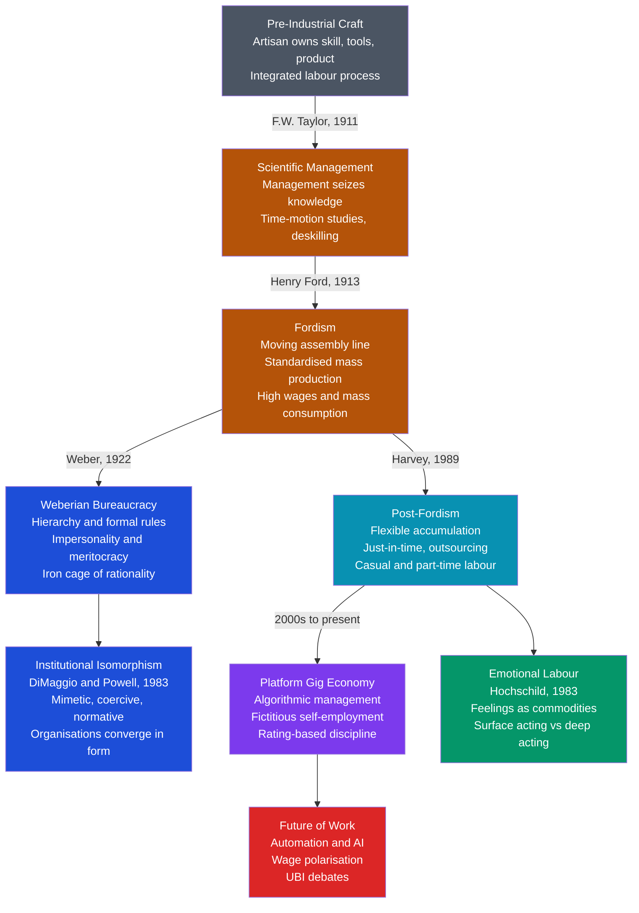

> [!abstract] TL;DR
> Work is socially organised, not just economically transacted: who controls the labour process, how value is extracted, and what rules govern the workplace shape not only economic outcomes but identity, inequality, and social life. From Weber's iron cage of bureaucratic rationality to Taylor's time-motion studies, Ford's assembly line, Hochschild's emotional labour, DiMaggio and Powell's institutional isomorphism, and Uber's algorithmic management, each era generates new modes of control over workers — and new forms of resistance.

---

## Intuition

**Analogy:** Imagine baking bread at home. You choose when to start, which recipe to follow, how long to knead, what flour to buy, and when the loaf is done. You own the entire process — the knowledge, the skill, the tools, the product. Now imagine being hired at an industrial bakery. A manager has done time-motion studies to establish the scientifically optimal kneading stroke, duration, and force. You perform that single motion thousands of times per shift. A supervisor monitors your output per hour. A system logs your breaks. You no longer need to know how bread is made — only your fragment of the process. The product is not yours, the knowledge is not yours, the pace is not yours.

That transition — from autonomous craft to fragmented, supervised wage labour — is the central story of the sociology of work. Organisations are not neutral coordination devices; they are structures of power that determine who knows what, who controls whom, and who captures the value created.

---

## How It Works



---

## Key Concepts

### Secondary Level

**The Sociology of Work: Why Work Is Social.**

Work is not simply the exchange of labour for wages — it is a social relationship embedded in power, norms, and meaning. Three questions organise the field:

1. *Who controls the labour process?* — who decides how work is done, at what pace, with what knowledge?
2. *How is value distributed?* — between owners, managers, and workers?
3. *What does work mean to workers?* — identity, purpose, alienation, or drudgery?

**Max Weber's Ideal-Type Bureaucracy (Economy and Society, 1922).**

Weber identified bureaucracy as the dominant organisational form of modernity. His "ideal type" (a pure conceptual model, not a normative prescription) has five defining characteristics:

| Feature | Description |
|---------|-------------|
| **Hierarchy** | Clear chain of command; each office supervised by the one above it |
| **Written rules** | Formal, explicit procedures govern decisions; no discretion without authorisation |
| **Impersonality** | Rules apply equally to all; personal relationships do not influence official action |
| **Specialisation** | Each official has defined, expert competence; a strict division of labour |
| **Meritocracy** | Appointment and promotion are based on qualification, not birth or patronage |

Weber saw bureaucracy as technically superior to all other forms of administration — more predictable, more efficient, less corrupt. But he was deeply ambivalent about it. The **iron cage** (*stahlhartes Gehäuse* — literally "steel-hard casing") is his metaphor for a world in which formal rationality has colonised every domain of life, displacing meaning, creativity, and substantive values. Modern people are trapped inside a perfectly efficient machine that has no purpose beyond its own perpetuation.

**Frederick Winslow Taylor and Scientific Management (1911).**

Taylor's *The Principles of Scientific Management* argued that the craft worker's control over the labour process was the primary obstacle to efficiency. Workers deliberately restricted output ("soldiering") because faster work only led to wage cuts. Taylor's remedy had three elements:

1. **Systematic study** — management should time-study every task to identify the "one best way"
2. **Separation of conception and execution** — managers do the thinking; workers execute instructions
3. **Differential piece-rate** — reward workers who meet scientifically determined targets; penalise those who do not

The sociologist Harry Braverman (*Labor and Monopoly Capital*, 1974) argued that Taylorism was not primarily about efficiency but about **control**: by removing knowledge from workers and concentrating it in management, capitalists could replace skilled, expensive workers with unskilled, cheap ones. This process — **deskilling** — is Braverman's central thesis: twentieth-century capitalism systematically degrades most jobs by fragmenting and routinising the labour process.

**Fordism (1913–1970s).**

Henry Ford combined Taylor's scientific management with the moving assembly line, creating a system in which products were **standardised** for mass production, workers performed **single repetitive tasks** at a machine-controlled pace, and **high wages** ($5/day in 1914, double the market rate) enabled workers to buy the products they made — turning workers into consumers.

Fordism names not just a production method but an entire **social formation**: the post-war Keynesian settlement in which mass industrial production, union bargaining, welfare states, and consumer demand mutually supported each other. The Fordist deal was: you surrender control of the work process; in exchange you receive a family wage, job security, and access to consumer goods.

---

### Undergraduate Level

**Post-Fordism and Flexible Accumulation (Harvey, 1989).**

David Harvey (*The Condition of Postmodernity*, 1989) argued that from the mid-1970s, Fordism entered a structural crisis — overaccumulation, stagflation, competition from Germany and Japan — and was replaced by **flexible accumulation**:

- **Flexible production**: just-in-time inventory, niche products, rapid product cycles (Toyota Production System)
- **Flexible labour**: casualisation, temporary contracts, outsourcing, part-time work, zero-hours arrangements
- **Flexible geography**: capital relocates to lower-cost regions; territories compete by offering lower wages and weaker regulation
- **Flexible finance**: deregulated capital markets fund rapid investment and disinvestment cycles

The sociological consequence: the post-war security of the Fordist worker — stable job, union contract, defined-benefit pension, predictable career trajectory — was dismantled and replaced by precarity. Richard Sennett (*The Corrosion of Character*, 1998) showed how "no long-term commitment" in flexible capitalism corrodes personal identity: workers cannot form stable life narratives when careers are episodic, loyalties are transient, and the self must be perpetually reinvented for the next short-term contract.

**Emotional Labour: Hochschild (1983).**

Arlie Hochschild's *The Managed Heart* introduced **emotional labour**: the management of feeling to create a publicly observable display — the flight attendant's smile, the debt collector's menace, the therapist's empathy. Three features make it distinctive:

- Face-to-face or voice-to-voice contact with the public
- The worker produces an emotional state in the customer (comfort, safety, deference)
- The employer controls the display rules through training, supervision, and scripts

Workers use two strategies:

- **Surface acting** — producing the required display without altering inner feeling. Associated with burnout, estrangement, and the sense of performing a false self.
- **Deep acting** — inducing the required feeling through imagination and memory. More sustainable in the short run but risks the worker losing access to genuine emotion over time.

Hochschild estimated that by the 1980s one-third of US jobs involved significant emotional labour, and the burden falls disproportionately on women and service workers. The psychic cost is real and is not compensated in wages.

**Institutional Theory: DiMaggio and Powell (1983).**

Paul DiMaggio and Walter Powell's "The Iron Cage Revisited" asked: *why do organisations within the same field come to resemble each other even when they have no efficiency reason to?* Their answer: **institutional isomorphism** — three mechanisms that pressure organisations to adopt the same structures and practices:

| Mechanism | Source of Pressure | Example |
|-----------|-------------------|---------|
| **Mimetic isomorphism** | Uncertainty — organisations copy successful peers | Firms adopting Agile development after tech giants normalised it |
| **Coercive isomorphism** | Formal pressure from regulators or dominant organisations | GDPR forcing uniform data-handling practices across all EU firms |
| **Normative isomorphism** | Professional training — practitioners share the same education | MBA programmes spreading identical management frameworks globally |

The iron cage is revisited: organisations are rationalised not because it makes them efficient, but because it makes them *legitimate*. Legitimacy — looking rational to funders, regulators, and peers — is a survival requirement independent of actual effectiveness.

**Braverman's Deskilling Thesis and Its Critics.**

Braverman's claim that capitalism systematically deskills labour has generated sustained debate:

- **Support**: Amazon warehouse pickers, call centre agents, fast-food workers — each involves management software directing every micro-task, skill requirements trainable in hours, and algorithmic monitoring of output.
- **Challenge 1 (upskilling)**: computers eliminate routine tasks, raising the skill content of remaining jobs (Autor, Levy, Murnane, 2003 — the "task model"). Growth of non-routine cognitive and interpersonal work appears to support this.
- **Challenge 2 (polarisation)**: both happen simultaneously. Routine middle-skill jobs are automated; the labour market polarises into high-skill, high-pay cognitive work and low-skill, low-pay service work — a hollowed middle. Goos and Manning (2007) called this the growth of "lousy and lovely jobs."

**Comparative Capitalisms (Hall and Soskice, 2001).**

The labour market is not the same institution in all capitalist societies. See [[Political_Economy_and_Market_State_Relations]] for the full Varieties of Capitalism framework. The key sociological implication:

| Dimension | Liberal Market Economy (USA, UK) | Coordinated Market Economy (Germany, Sweden) |
|-----------|----------------------------------|----------------------------------------------|
| **Work organisation** | Flexible, individual contracts, easy hire-and-fire | Long-term employment, codetermination, works councils |
| **Training** | General skills, portable; firms invest little | Firm-specific and industry-specific; dual apprenticeship |
| **Unions** | Weak, fragmented (US private sector: ~6% density, 2022) | Strong, sector-wide (Germany: ~50% collective bargaining coverage) |
| **Wage inequality** | High wage dispersion | Compressed wages |

Institutional complementarity explains why you cannot simply transplant German codetermination into a US firm without German apprenticeship systems, bank finance structures, and coordinated wage bargaining. Each institution works *because* the others are in place.

---

### Graduate Level

**Algorithmic Management and Platform Capitalism.**

The gig economy (Uber, Deliveroo, Amazon Mechanical Turk, Upwork) represents a qualitatively new mode of labour control — not the direct supervision of Taylor or the pacing of Ford's line, but **algorithmic management**:

- Workers are legally classified as **independent contractors**, eliminating employer obligations: social insurance contributions, sick pay, holiday pay, minimum wage floors, unfair dismissal protection
- Work allocation is determined by **algorithms** based on location, ratings, and platform-defined metrics — invisible, non-contestable, and potentially discriminatory without legal accountability
- **Rating systems** create discipline through the threat of deactivation: Uber deactivates drivers below approximately 4.6/5. Workers cannot appeal to a manager; they can only appeal to customers, internalising customer demand as the disciplinary norm
- **Surge pricing** and algorithmic reassignment transfer market risk from platform to worker — the worker bears income volatility; the platform takes a fixed commission regardless

Sociologist Alex Rosenblat (*Uberland*, 2018) shows that the ideology of "being your own boss" conceals a relationship of control that is in some respects tighter than traditional employment: the platform knows your location at all times, can change its rules unilaterally, and controls all communication with the customer. Nick Srnicek (*Platform Capitalism*, 2016) argues that platform businesses extract surplus value by externalising traditional employer costs onto workers — a structural power shift enabled by Post-Fordist deregulation and the legal reclassification of workers.

**Labour Movements, Unions, and Collective Action.**

Unions are the primary mechanism through which workers have historically counteracted the power asymmetry of employment:

- **The union as encompassing organisation** (Olson, 1982): a single union covering all workers in a sector internalises the macroeconomic effects of wage claims — it knows that excessive wages will generate unemployment, dampening demand for members. Fragmented craft unions lack this incentive and pursue sectional interests at wider cost.
- **Codetermination** (Germany's *Mitbestimmungsgesetz*, 1976): workers hold half the seats on supervisory boards of large firms; works councils (*Betriebsräte*) have codetermination rights over working conditions, redundancies, and workplace surveillance. Workers hold a formal institutional stake in corporate governance, not merely a contractual one.
- **The decline of unionism**: UK private-sector union density fell from ~50% in 1980 to ~13% in 2022; US from ~24% to ~6%. Causes are interlocking: deindustrialisation (unions concentrated in manufacturing), hostile legislation (Reagan's PATCO dismissal 1981, Thatcher's anti-union acts), the shift to fragmented service work, and the gig economy's deliberate worker-misclassification strategy.

**Automation, AI, and the Future of Work.**

Frey and Osborne (2013, Oxford): 47% of US jobs were at "high risk" of computerisation within two decades. Critics note that the task-based model underestimates human adaptability and the creation of new occupations by new technology. Acemoglu and Restrepo (2018): automation displaces workers but creates "reinstatement effects" through new tasks; the net distributional outcome depends on whether new tasks go to labour or capital.

Three competing scenarios for the future of work:

1. **Skill-biased technical change**: technology complements high-skill workers, raising their productivity and wages while displacing low-skill workers. Inequality rises but employment is maintained.
2. **Labour market polarisation** (Goos and Manning): routine middle-skill jobs are automated; wage distribution becomes bimodal — highly paid non-routine cognitive work and poorly paid non-routine manual and service work.
3. **Full automation and the end of work** (Srnicek and Williams, *Inventing the Future*, 2015): capitalist automation eliminates most waged labour; the alternative to mass unemployment is a Universal Basic Income that decouples survival from employment, enabling genuine freedom.

The Polanyian response (Karl Polanyi, *The Great Transformation*, 1944): labour is a **fictitious commodity** — it cannot be produced for sale like wheat or steel; workers are human beings with needs that exist independently of market demand. When the market for labour collapses via automation or depression, society generates a **counter-movement** — welfare states, labour laws, UBI proposals — to re-embed the fictitious commodity in social protection. Whether the EU Platform Work Directive (2024) and similar regulatory responses constitute a genuine Polanyian counter-movement or a managed accommodation to platform capitalism is a live empirical question.

---

## Python Demo

```python
# Simulates algorithmic rating-based management in the gig economy.
# Two groups of workers have statistically identical true skill, but Group B
# starts with a 0.20-star reputational disadvantage (simulating an established
# profile penalty, early rating bias, or demographic discrimination in reviews).
# The platform's dispatch algorithm routes more jobs to higher-rated workers,
# creating a feedback loop: more jobs -> more positive signals -> higher rating,
# and fewer jobs -> rating drifts down -> deactivation risk rises.
# Shows how a formally meritocratic algorithmic system can structurally
# reproduce initial disadvantages through path dependence alone.

import numpy as np
import matplotlib.pyplot as plt

rng = np.random.default_rng(42)

N = 60          # workers per group
T = 200         # time steps
FLOOR = 3.5     # deactivation rating threshold (below this -> removed)
ALPHA = 0.08    # EMA weight for each new customer rating (recency of feedback)

# Both groups have statistically identical true skill (drawn from same distribution)
true_skill_a = rng.normal(4.2, 0.35, N).clip(1.0, 5.0)
true_skill_b = rng.normal(4.2, 0.35, N).clip(1.0, 5.0)

# Initial ratings: same true quality, but Group B starts with a reputational penalty
rating_a = (true_skill_a + rng.normal(+0.10, 0.10, N)).clip(1.0, 5.0)
rating_b = (true_skill_b + rng.normal(-0.10, 0.10, N)).clip(1.0, 5.0)

active_a = np.ones(N, dtype=bool)
active_b = np.ones(N, dtype=bool)

mean_a_hist = [rating_a.mean()]
mean_b_hist = [rating_b.mean()]
count_a_hist = [N]
count_b_hist = [N]


def run_period(ratings, active, true_skill):
    for i in range(len(ratings)):
        if not active[i]:
            continue
        if ratings[i] < FLOOR:
            active[i] = False
            continue
        # Dispatch probability: algorithm favours higher-rated workers
        r = ratings[i]
        p_dispatch = 0.85 if r >= 4.5 else (0.65 if r >= 4.0 else 0.40)
        if rng.random() < p_dispatch:
            # Customer rating: noisy observation of worker's true skill
            observed = (true_skill[i] + rng.normal(0.0, 0.45)).clip(1.0, 5.0)
            ratings[i] = (1.0 - ALPHA) * ratings[i] + ALPHA * observed
        else:
            # No job this period: rating drifts slightly down (absence of positive signal)
            ratings[i] = max(ratings[i] - 0.008, 1.0)


for _ in range(T):
    run_period(rating_a, active_a, true_skill_a)
    run_period(rating_b, active_b, true_skill_b)
    mean_a_hist.append(rating_a[active_a].mean() if active_a.any() else np.nan)
    mean_b_hist.append(rating_b[active_b].mean() if active_b.any() else np.nan)
    count_a_hist.append(int(active_a.sum()))
    count_b_hist.append(int(active_b.sum()))

fig, axes = plt.subplots(1, 3, figsize=(15, 5))
fig.patch.set_facecolor("#f8fafc")
t_ax = np.arange(T + 1)

ax = axes[0]
ax.set_facecolor("#f8fafc")
ax.plot(t_ax, mean_a_hist, color="#2563eb", lw=2.2, label="Group A (start +0.10)")
ax.plot(t_ax, mean_b_hist, color="#dc2626", lw=2.2, label="Group B (start -0.10)")
ax.axhline(FLOOR, color="#9ca3af", ls="--", lw=1.2, label=f"Deactivation floor {FLOOR}")
ax.fill_between(t_ax, mean_a_hist, mean_b_hist, alpha=0.12, color="#8b5cf6")
ax.set_xlabel("Period", fontsize=9)
ax.set_ylabel("Mean rating (active workers)", fontsize=9)
ax.set_title("Rating Divergence\n(identical true skill, 0.20-star initial gap)", fontsize=10, fontweight="bold")
ax.legend(fontsize=8)
ax.grid(True, alpha=0.08)

ax2 = axes[1]
ax2.set_facecolor("#f8fafc")
ax2.plot(t_ax, count_a_hist, color="#2563eb", lw=2.2, label="Group A survivors")
ax2.plot(t_ax, count_b_hist, color="#dc2626", lw=2.2, label="Group B survivors")
ax2.set_xlabel("Period", fontsize=9)
ax2.set_ylabel(f"Active workers (of {N})", fontsize=9)
ax2.set_title("Worker Attrition\n(compounding deactivation risk)", fontsize=10, fontweight="bold")
ax2.legend(fontsize=8)
ax2.grid(True, alpha=0.08)

ax3 = axes[2]
ax3.set_facecolor("#f8fafc")
bins = np.linspace(1.5, 5.2, 28)
ax3.hist(rating_a[active_a], bins=bins, color="#2563eb", alpha=0.65,
         label=f"Group A (n={active_a.sum()})")
ax3.hist(rating_b[active_b], bins=bins, color="#dc2626", alpha=0.65,
         label=f"Group B (n={active_b.sum()})")
ax3.axvline(FLOOR, color="#9ca3af", ls="--", lw=1.5)
ax3.set_xlabel("Final rating", fontsize=9)
ax3.set_ylabel("Count", fontsize=9)
ax3.set_title(f"Final Rating Distribution\n(after {T} periods)", fontsize=10, fontweight="bold")
ax3.legend(fontsize=8)
ax3.grid(True, alpha=0.08)

fig.suptitle(
    "Algorithmic Management: Rating Path Dependence in the Gig Economy\n"
    "Identical ability — small initial gap compounds into structural divergence",
    fontsize=11, fontweight="bold",
)
plt.tight_layout()
plt.savefig("gig_economy_simulation.png", dpi=150, bbox_inches="tight")
plt.show()

print(f"Initial:  A = {mean_a_hist[0]:.3f}  B = {mean_b_hist[0]:.3f}  gap = {mean_a_hist[0] - mean_b_hist[0]:.3f}")
print(f"Final:    A = {mean_a_hist[-1]:.3f}  B = {mean_b_hist[-1]:.3f}  gap = {mean_a_hist[-1] - mean_b_hist[-1]:.3f}")
print(f"Survival: A = {count_a_hist[-1]}/{N}    B = {count_b_hist[-1]}/{N}")
```

**What the simulation shows.** Both groups start with the same underlying true skill distribution. Group A begins with a 0.20-star rating advantage (from an established profile or early-review bias). The platform's dispatch algorithm routes more jobs to Group A. More jobs means more customer feedback keeping the rating stable; fewer jobs means Group B's rating drifts down and deactivation risk rises. After 200 periods, a 0.20-star reputational gap produces a large divergence in both mean rating and in the proportion of active workers — purely through the feedback mechanism, not through any difference in actual ability. The "iron cage" of algorithmic management is formally meritocratic but structurally path-dependent.

---

## Real-World Applications

**1. Amazon Fulfilment Centres and Neo-Taylorism.**

Amazon's warehouse operations are the clearest contemporary expression of Taylorist principles. Each picker's location, movement speed, and items-per-hour rate is tracked in real-time by wristband scanner. Productivity targets are set by algorithmic calculation of optimal routes. Workers who fall below target receive automated warnings and can be automatically dismissed without manager involvement. "Time off task" alerts trigger if workers pause too long — including for toilet breaks. The "one best way" is now calculated by machine-learning systems rather than stopwatch-wielding engineers, making Braverman's deskilling thesis more rather than less applicable to twenty-first century logistics.

**2. Uber and the Political Economy of Worker Classification.**

Uber drivers are classified as independent contractors — "partners" in platform terminology — yet they cannot set their own prices, cannot choose customers after accepting a dispatch, cannot see their algorithmic rating formula, and can be deactivated at any time without appeal. California's AB5 law (2019) attempted to reclassify gig workers as employees. Uber and Lyft spent $224 million on Proposition 22 (2020) to overturn it, winning 58% of the vote. This illustrates the political economy of platform capitalism: the platforms spend more on political lobbying to preserve their business model than it would cost to provide the employment protections they are avoiding.

**3. German Codetermination versus UK Shareholder Primacy.**

Volkswagen's supervisory board has 20 members: 10 elected by shareholders, 10 elected by workers (including the IG Metall union chair). Factory closures, mass redundancies, and automation rollout require worker agreement. In contrast, UK firms have no worker representation on boards. When BMW announced Oxford MINI restructuring in 2019, shareholders decided unilaterally. When Volkswagen restructured, works councils negotiated redeployment, retraining, and voluntary redundancy packages before a single job was cut. Codetermination does not prevent restructuring, but it changes the distribution of its costs — a direct institutional expression of CME versus LME work organisation.

**4. McDonald's and Franchise Isomorphism.**

McDonald's is a case study in both coercive and normative isomorphism. The franchise contract forces every outlet — regardless of national culture — to adopt standardised production systems, portion sizes, and customer-service scripts. McDonald's corporate trains all managers through "Hamburger University" (est. 1961), transmitting the same normative frameworks globally. The result is that a McDonald's in Moscow, Mumbai, and Melbourne looks, feels, and operates almost identically — not because local conditions require it, but because the franchise contract and professional training enforce a single legitimate template. DiMaggio and Powell's three mechanisms are all present simultaneously: the contract is coercive, the Hamburger University is normative, and competitors copying McDonald's is mimetic.

---

## Common Pitfalls

- **Treating Weber's bureaucracy as inherently pathological.** Weber described bureaucracy as technically the most efficient form of administration, not as evil. Its pathologies — rigidity, goal displacement, red tape, Kafka-esque obstruction — emerge when the ideal type degrades: when rules become ends rather than means, when impersonality becomes arbitrariness, when meritocracy ossifies into credentialism.

- **Conflating Fordism with factories.** Fordism was a *social formation*, not merely a production technique. Its defining feature was the link between mass production and mass consumption — high wages enabling workers to buy what they produced. Post-Fordism is not simply "flexible factories"; it is the dissolution of the wage-security-consumption nexus that underwrote the entire post-war welfare settlement.

- **Assuming gig economy workers are freer than employees.** Legal independence does not confer practical autonomy. Algorithmic control can be more pervasive than direct supervision because it is continuous, invisible, and non-contestable through normal employment law channels. Worker classification as contractor is primarily a legal and cost-avoidance strategy, not a description of actual autonomy over work.

- **Deskilling versus upskilling as a binary choice.** Both Braverman and the skill-biased technical change school are partially right. Labour markets polarise: routine tasks are automated; the remaining jobs require either high cognitive skills (complemented by technology) or non-routine physical and social skills (personal care, construction, emotional labour). The hollow middle is the empirical outcome, not a vindication of either thesis alone.

- **Ignoring the gendered and racialised dimensions of work.** Emotional labour falls disproportionately on women and is structurally undercompensated because of who performs it. Care work — both paid and unpaid — has been systematically devalued for the same reason. Gig economy deactivation studies document racial gaps in customer ratings that reproduce labour market discrimination through seemingly objective algorithmic systems, with no formal accountability mechanism.

---

## Related Concepts

- [[_MOC_Social_Institutions|↑ Social Institutions MOC]] — Section map for all Social Institutions notes
- [[Political_Economy_and_Market_State_Relations]] — The Varieties of Capitalism framework explains why German workers have codetermination rights while US workers do not; the LME/CME distinction is the comparative political economy of work organisation; contains the full Hall and Soskice typology
- [[Regulatory_Politics_and_Administrative_Law]] — Weberian bureaucracy is the social-theory ideal; administrative law is the practice — the legal rules governing how state agencies exercise delegated power and resist capture; Weber's model is the normative benchmark against which actual administrative behaviour is assessed
- [[Socialism_Marxism_and_Communism]] — Marx's theory of surplus value extraction and alienated labour is the foundational critique of wage work that underlies Braverman's deskilling thesis and contemporary platform-capitalism analysis; the base-superstructure model predicts that changes in the relations of production reshape law, culture, and ideology
- [[Welfare_States_and_Social_Policy]] — Fordism's high wages and the welfare state were complementary institutions of the post-war settlement; the simultaneous decline of both from the 1970s is part of the same Post-Fordist structural transformation; Esping-Andersen's regime types map onto LME/CME distinctions
- [[Unemployment]] — Labour market structures determine who is unemployed, for how long, and whether unemployment is frictional, structural, or cyclical; gig economy worker misclassification distorts headline unemployment statistics by reclassifying precarious underemployment as self-employment
- [[Human_Capital_and_Education]] — The automation debate turns on whether displaced workers can acquire the skills for complementary roles; human capital investment is the standard policy response to structural unemployment from technological change; Autor's task model is the bridge between macroeconomic growth theory and labour sociology
- [[Organizational_Psychology]] — I-O psychology applies scientific methods to workplace motivation, leadership, and performance; the two fields share questions about work design but differ in level of analysis — psychology at the individual and team level, sociology at the institutional and structural level; together they explain why Taylorist job designs systematically destroy intrinsic motivation
- [[Theories_of_Motivation]] — Taylorism embodies Theory X assumptions about workers (inherently lazy, motivated only by external reward, requiring close control); self-determination theory and intrinsic motivation research directly contest this framework, showing that fragmented, controlled work destroys the autonomy, competence, and relatedness that sustain genuine engagement
- [[Group_Dynamics]] — Formal organisations structure groups through hierarchies and reporting relationships; informal group norms — including restriction of output, which Taylor observed as "soldiering" — can subvert formal structures; groupthink operates in management decision-making precisely because hierarchical pressure suppresses dissent

---

## Review Questions

### Secondary

1. Weber identified five features of an ideal-type bureaucracy. Take one real organisation you know (a school, hospital, or government department) and assess how closely it matches each feature. Where does it deviate, and why does that deviation exist?
2. Taylor argued that workers "soldier" — deliberately work slowly — because faster output leads to wage cuts. Can you identify a contemporary equivalent of soldiering in any modern workplace? What conditions produce it?
3. What was the "Fordist deal"? In what sense has that deal broken down since the 1970s, and what has replaced it for most workers in liberal market economies?

### Undergraduate

1. DiMaggio and Powell argue that organisations become similar not because it is efficient but because it is *legitimate*. Using all three mechanisms — mimetic, coercive, and normative isomorphism — explain why all large UK universities now have virtually identical research ethics committees, diversity offices, and performance management systems, even though there is limited evidence that these structures improve research quality.
2. Hochschild distinguishes between surface acting and deep acting in emotional labour. Apply this distinction to the work of nurses, call centre agents, and therapists. Which workers are most at risk of burnout from emotional labour, and what organisational conditions worsen or protect against it?
3. Braverman argued that Taylorism deskills labour as a strategy of control, not just efficiency. The task model (Autor, Levy, Murnane) argues that automation raises the average skill content of surviving jobs. Are these claims in conflict? Construct a synthesis that incorporates labour market polarisation into both arguments.

### Graduate

1. Alex Rosenblat describes Uber's algorithmic management as creating a relationship of control tighter than traditional employment while avoiding the legal obligations of employment. Using Foucault's concept of disciplinary power alongside Braverman's labour process theory, analyse how the rating system, surge pricing, and the threat of deactivation constitute a new mode of labour discipline. What forms of resistance have gig workers developed, and what structural features limit their effectiveness?
2. The Post-Fordist transition involved simultaneous changes in production (flexible accumulation), labour markets (casualisation), finance (financialisation), and politics (union weakening). Harvey treats these as aspects of a unified regime of accumulation. Polanyi would predict a counter-movement to re-embed labour in social protection. Is the gig economy regulation movement — California AB5, the EU Platform Work Directive (2024) — a genuine Polanyian counter-movement, or a managed accommodation? What structural obstacles prevent a full re-embedding of algorithmic labour in employment law?
3. Hall and Soskice predict that LMEs favour radical innovation (Silicon Valley, biotech) while CMEs favour incremental innovation (precision engineering). Given that AI and automation are primarily produced in LMEs, assess whether AI-driven displacement will intensify wage inequality in LMEs while CME institutions — codetermination, dual apprenticeship, coordinated wage bargaining — dampen its distributional effects in CMEs. What empirical evidence from the 2010s and 2020s supports or challenges this prediction?

---

## Sources

- Weber, M. (1922) — *Economy and Society*, Part II: Bureaucracy (Routledge, 1978 trans.)
- Taylor, F.W. (1911) — [*The Principles of Scientific Management*](https://archive.org/details/principlesofscie00tayluoft) (Harper and Brothers)
- Braverman, H. (1974) — *Labor and Monopoly Capital: The Degradation of Work in the Twentieth Century* (Monthly Review Press)
- Harvey, D. (1989) — *The Condition of Postmodernity*, Part II: Flexible Accumulation (Blackwell)
- Hochschild, A.R. (1983) — *The Managed Heart: Commercialization of Human Feeling* (University of California Press)
- DiMaggio, P.J. & Powell, W.W. (1983) — ["The Iron Cage Revisited: Institutional Isomorphism and Collective Rationality in Organizational Fields"](https://www.jstor.org/stable/2095101), *American Sociological Review* 48(2), 147–160
- Sennett, R. (1998) — *The Corrosion of Character: The Personal Consequences of Work in the New Capitalism* (Norton)
- Hall, P.A. & Soskice, D., eds. (2001) — *Varieties of Capitalism: The Institutional Foundations of Comparative Advantage* (Oxford University Press)
- Autor, D., Levy, F. & Murnane, R.J. (2003) — ["The Skill Content of Recent Technological Change: An Empirical Exploration"](https://doi.org/10.1162/003355303322552801), *Quarterly Journal of Economics* 118(4)
- Goos, M. & Manning, A. (2007) — ["Lousy and Lovely Jobs: The Rising Polarization of Work in Britain"](https://doi.org/10.1162/rest.89.1.118), *Review of Economics and Statistics* 89(1)
- Polanyi, K. (1944) — *The Great Transformation: The Political and Economic Origins of Our Time* (Beacon Press, 2001 ed.)
- Rosenblat, A. (2018) — *Uberland: How Algorithms Are Rewriting the Rules of Work* (University of California Press)
- Srnicek, N. (2016) — *Platform Capitalism* (Polity Press)
- Acemoglu, D. & Restrepo, P. (2018) — ["Robots and Jobs: Evidence from US Labor Markets"](https://doi.org/10.1086/705716), *Journal of Political Economy* 128(6)
- Frey, C.B. & Osborne, M.A. (2013) — ["The Future of Employment: How Susceptible Are Jobs to Computerisation?"](https://www.oxfordmartin.ox.ac.uk/publications/the-future-of-employment/), Oxford Martin School Working Paper

---

#Sociology #SocialInstitutions #Work #Organizations #Bureaucracy
