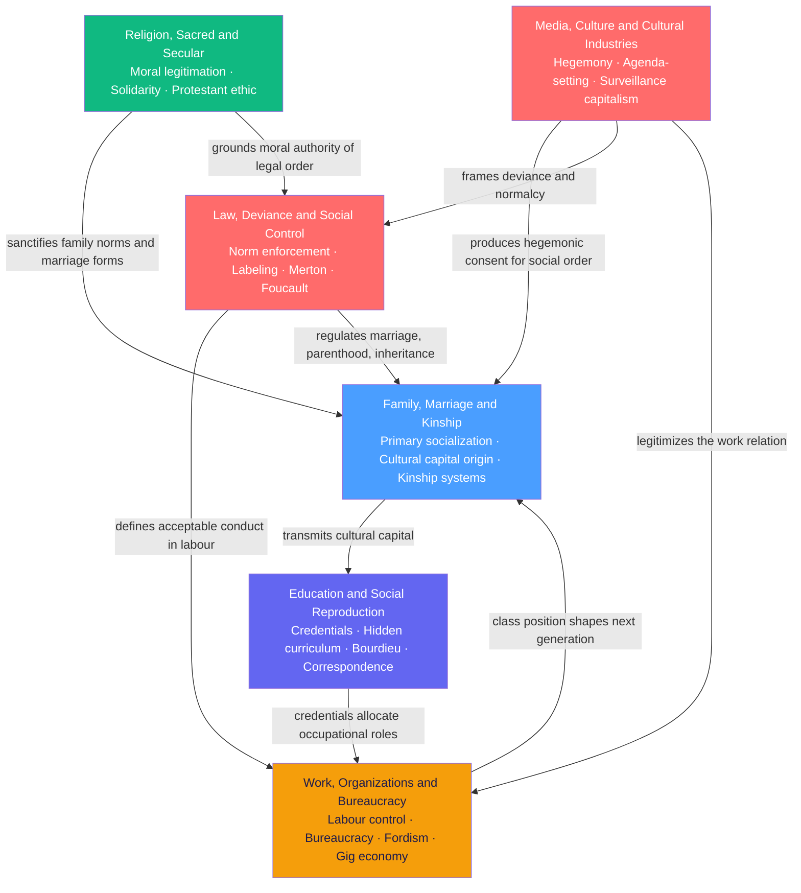

# Social Institutions

> [!abstract] Section Overview
> Social institutions are the organized, enduring structures through which societies reproduce themselves across generations — regulating intimacy and kinship, transmitting knowledge and credentials, organizing labour and authority, grounding moral order, defining deviance and enforcing norms, and manufacturing shared cultural reality. This section examines the six major institutions of modern societies: family, education, religion, work, law, and media. Together they form an interlocking system that both enables social life and systematically reproduces inequality, asking who benefits from each institution's current form and at whose cost.

---

## Concept Map

*(Blue = fundamental entry point, Red = advanced, arrows show key institutional dependencies and flows)*

---

## Learning Path

*Recommended order for a first pass through this section:*

1. [[Family_Marriage_and_Kinship]] — Every person's first institution; covers descent rules, residence rules, marriage forms, feminist critiques of the household as a labour contract, and Giddens' transformation of intimacy into pure relationships. Start here because family is the origin point of cultural capital and the site of primary socialization that all other institutions build upon.

2. [[Religion_Sacred_and_Secular]] — The second socialization agent and historically the moral cement underneath all other institutions. Durkheim on collective effervescence and solidarity, Weber on the Protestant ethic and rationalization, Marx on false consciousness, and the unresolved secularization debate between Berger/Bruce and Stark's religious economy model. Introduces the three founding theorists in their most focused sociological application.

3. [[Education_and_Social_Reproduction]] — How family-transmitted advantages are laundered as individual merit through schooling. Bourdieu's cultural capital and habitus, Bowles and Gintis's correspondence principle, Collins's credentialism thesis, and the Coleman Report together explain why decades of educational expansion have not closed the gap between social origins and educational destinations.

4. [[Work_Organizations_and_Bureaucracy]] — The destination institution where credentials are exchanged for economic position. Weber's iron cage bureaucracy, Taylor's scientific management, Fordism and its post-Fordist dissolution, and algorithmic gig economy management as successive modes of extracting and controlling labour. Closes the social reproduction loop that opened with family.

5. [[Law_Deviance_and_Social_Control]] — The enforcement architecture that defines boundaries for all other institutions and disciplines transgressors. Merton's strain theory, labeling theory, Hirschi's social bond theory, Foucault's disciplinary society, and mass incarceration as a racial caste mechanism. Requires familiarity with the other four notes to appreciate how law interacts with each.

6. [[Media_Culture_and_Cultural_Industries]] — The meaning-making infrastructure that legitimizes and naturalizes the whole institutional system. Frankfurt School culture industry, Gramsci's cultural hegemony, Hall's encoding/decoding model, and Zuboff's surveillance capitalism extend the analysis from material structures to the realm of consciousness and consent. Best read last as the capstone that reframes everything preceding it.

---

## All Notes in This Section

| Note | Core Idea | Difficulty |
|------|-----------|------------|
| [[Family_Marriage_and_Kinship]] | Kinship systems universally regulate descent, residence, and marriage alliance; the nuclear family is historically recent and one configuration among dozens; feminist sociology exposes the household as a site of unpaid labour and contested power | Intermediate |
| [[Religion_Sacred_and_Secular]] | Religion creates solidarity through the sacred/profane distinction and collective effervescence; Calvinist predestination accidentally produced the spirit of capitalism; the secularization thesis is challenged by Stark's religious economy model explaining why the US remains highly religious | Intermediate |
| [[Education_and_Social_Reproduction]] | Schools simultaneously enable mobility and reproduce class inequality; Bourdieu's cultural capital converts inherited advantage into apparent individual merit via misrecognition; credential inflation means more education does not reduce relative inequality between social classes | Intermediate |
| [[Work_Organizations_and_Bureaucracy]] | Work is organized power over the labour process, not merely economic exchange; from Weber's iron cage through Taylorist deskilling and Fordism to algorithmic rating-based discipline; emotional labour and institutional isomorphism extend control beyond the factory into service and professional work | Intermediate |
| [[Law_Deviance_and_Social_Control]] | Deviance is a label applied by those with power to define norms, not a property of the act itself; Merton shows structural strain between cultural goals and blocked legitimate means produces crime; Foucault reframes modern punishment as the production of docile subjects rather than a humanitarian advance over public torture | Advanced |
| [[Media_Culture_and_Cultural_Industries]] | Cultural industries produce and distribute shared social reality under commodity logic; Gramsci's hegemony explains how ruling-class interests become common sense without coercion; platform surveillance capitalism extracts behavioral surplus to predict and modify future behavior at population scale | Advanced |

---

## Key Themes

**Social reproduction** — How family cultural capital flows through educational credentials into occupational destinations, reproducing class position across generations despite formal equality of opportunity. Bourdieu, Bowles and Gintis, Collins, and Raftery and Hout all theorize different mechanisms within this loop; the empirical finding that origins strongly predict destinations is among the most robust in sociology.

**Legitimation and consent** — How institutions that serve particular interests present themselves as neutral or natural. Gramsci's hegemony, Bourdieu's misrecognition, Weber's formal rationality, and Durkheim's sacred/profane distinction are all theories of how power conceals itself behind institutional forms that appear universal or inevitable.

**Control without coercion** — From Hirschi's social bonds through Foucault's panopticon and normalizing examination to Hochschild's emotional labour rules and algorithmic gig management — a recurring theme across every institution is the shift from external force to internalized self-discipline as the primary mechanism of social order.

**Credential and positional competition** — Education, legal status, occupational credentials, and media reputation are all positional goods whose value depends on relative, not absolute, attainment. This drives escalatory dynamics analyzed by Collins in credentialism, Raftery and Hout in maximally maintained inequality, and Alexander in the collateral consequences of criminal labeling.

**Institutional intersectionality** — No institution operates independently. Family shapes educational outcomes; education shapes work trajectories; law regulates family, work, and religious practice; media legitimizes each. The section's central analytical skill is tracing cross-institutional dependencies rather than analyzing each institution in isolation.

---

## Key Questions This Section Answers

- How does class inequality persist across generations in societies with formally equal access to education and the law?
- Why do most people conform to social norms without direct threat of punishment, and what breaks that conformity?
- Who decides what counts as deviant, criminal, or sacred — and whose interests does that definitional power serve?
- How does the content of religious belief shape economic behaviour, and what does global religious revival tell us about secularization theory?
- What is the difference between bureaucratic rationality as an efficiency device and as an ideology of domination?
- How do media and cultural industries manufacture consent for the existing social order without overt propaganda?

---

## Cross-Section Links

- [[_MOC_Sociology_Master|↑ Sociology Master MOC]] — master entry to the full Sociology vault; this section's institutional analysis sits at the intersection of theory and stratification
- [[_MOC_Sociological_Theory_and_Foundations]] — The theoretical frameworks deployed throughout this section (functionalism, conflict theory, symbolic interactionism, Bourdieu's field theory, Foucauldian genealogy) are introduced and compared in Section 01; reading that section first provides the meta-theoretical vocabulary that makes this section's arguments precise
- [[_MOC_Social_Stratification_and_Inequality]] — Section 02 analyzes the outcomes — class, gender, race, and global inequality — that this section explains as institutionally produced; the two sections are best read in parallel or in immediate sequence since stratification and institutions are jointly produced
- Cross-vault connections: [[Attachment_Theory]] and [[Moral_Development]] in the Psychology vault ground the psychological mechanisms through which family and education produce social outcomes; [[Social_Contract_Theory]] in the Philosophy vault provides the normative framework against which law and punishment can be evaluated; [[Socialism_Marxism_and_Communism]] in the Political Science vault supplies the political economy baseline underlying Bowles and Gintis, Gramsci, and Braverman

---

#Sociology #MOC
