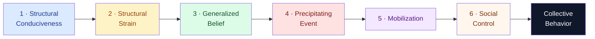

# Collective Behavior and Crowds

> [!abstract] TL;DR
> Collective behavior — crowds, panics, riots, crazes, and social movements — refers to coordinated social action that emerges outside established institutional routines. Five major frameworks explain it: LeBon's contagion theory (crowds dissolve individual rationality into a group mind), Allport's critique (no group mind; individual psychology still operates through social facilitation), Turner-Killian's emergent norm theory (crowds improvise new situational rules through keynoting), Smelser's value-added model (six structural preconditions must stack before any episode erupts), and Durkheim's collective effervescence (physical co-presence fuses individuals into a charged collective energy). Modern crowd science (Helbing's pedestrian dynamics) adds a physical layer: above critical density, "faster is slower" — urgency itself produces fatal jams.

---

## Intuition

**Analogy:** Think of a single candle flame versus a bonfire. One candle is calm, predictable, and easily extinguished. Pack thousands of candles into a confined space, each responding to the heat and light of its neighbors, and the result is not merely a very large candle — it is a qualitatively different phenomenon with its own dynamics: it roars, draws oxygen from across the room, and generates a self-feeding wind. No individual flame planned any of this.

A crowd behaves the same way. Individuals enter with their own moods, motives, and identities — but in the presence of thousands of other reactive bodies, something new emerges: a shared emotional state that amplifies through feedback, a temporary identity that can override the ordinary self, and dynamics no one individual planned or controls. The sociological question is not "what kind of people join crowds?" but "what does the crowd do to people — and why does it sometimes produce celebration, sometimes panic, and sometimes riot?"

---

## How It Works



*Smelser's value-added model: each stage is a necessary (not sufficient) precondition. Remove any one and the episode does not occur or takes a different form.*

---

## Key Concepts

### Secondary Level

**What is collective behavior?** Collective behavior refers to relatively spontaneous, relatively unstructured forms of social action in which a large number of people respond to a common stimulus in ways that depart from normal routines. It sits between ordinary regulated interaction (governed by stable norms) and formal social movements (organized, sustained, politically directed). Crowds, panics, fashions, crazes, and rumors are all forms of collective behavior.

**Three core questions:**
1. Why do individuals in crowds sometimes act in ways they would never act alone?
2. What structures the direction of collective action — toward panic, riot, celebration, or protest?
3. Is collective behavior a symptom of social breakdown, a legitimate political response, or a creative moment in social life?

**Types of crowds (Herbert Blumer's typology):**

| Type | Characteristics | Example |
|------|-----------------|---------|
| Casual | Temporary, no shared purpose | Passersby pausing at a street performer |
| Conventional | Organized around a specific purpose, following established norms | Theater audience, religious congregation |
| Expressive | Emotional release is the goal; norms are relaxed | Mardi Gras, stadium celebration, festival |
| Acting | Goal-directed, often norm-violating action | Riot, lynch mob, looting crowd |

**Collective effervescence (Durkheim):** In *The Elementary Forms of Religious Life* (1912), Durkheim observed that when people assemble in large numbers for shared rituals — religious ceremonies, tribal dances — they experience a charged, electric state in which the boundary between self and collective temporarily dissolves. Individual energy pools into a shared energy that feels larger than any one person. Durkheim called this **collective effervescence**. Modern equivalents: the shared tremor at a rock concert when a song breaks, the roar of a stadium goal, the charged silence of a mass vigil.

**Rumors and panics (Shibutani):** Tamotsu Shibutani (1966) argued that rumors are not simply misinformation — they are *improvised news*. Rumors circulate precisely when demand for information exceeds the supply from official channels. Panics occur when people collectively interpret a situation as threatening and normal response channels seem inadequate. The 1938 *War of the Worlds* broadcast, toilet-paper stockpiling in March 2020, mass school poison panics — all fit Shibutani's model of rumor filling information vacuums in the absence of trusted authoritative communication.

---

### Undergraduate Level

#### LeBon's Crowd Psychology: The Group Mind

Gustave LeBon's *The Crowd: A Study of the Popular Mind* (1895) is the founding text of crowd sociology — and one of the most influential, most cited, and most criticized books in social science.

LeBon argued that when individuals join a crowd, three mechanisms transform their psychology:

**1. Anonymity and submergence:** The individual loses her sense of personal identity and responsibility. Immersed in the mass, she becomes anonymous and feels that normal moral accountability is suspended. She "descends several rungs in the ladder of civilization."

**2. Contagion:** Emotions and behaviors spread through the crowd like a virus. Once fear, rage, or euphoria begins, it propagates with speed and intensity that normal social interaction never achieves. In LeBon's account, a crowd in the grip of contagion will do things that none of its members would individually contemplate.

**3. Suggestibility:** The crowd mind is in a quasi-hypnotic state — highly susceptible to suggestion from leaders or vivid symbols. Rational critical faculties are suppressed; the unconscious takes command.

The result is a *group mind* — a temporary collective soul that is more impulsive, irrational, credulous, and extreme than any of its individual members. LeBon's crowd is always regressive.

**Historical context and reception:** LeBon wrote in the shadow of the Paris Commune (1871) and the French Revolution — events he understood as civilizational regressions driven by mass irrationality. His framework deeply influenced fascist mobilization theory (Mussolini cited LeBon explicitly), but also liberal crowd-management policy, advertising psychology (Edward Bernays drew on LeBon for public relations theory), and military psychology. Freud took LeBon's observations seriously in *Group Psychology and the Analysis of the Ego* (1921), attributing the "group mind" to libidinal bonds between crowd members and a leader.

#### Allport's Critique: No Group Mind

Floyd Allport (1924) mounted the definitive scientific critique of LeBon. For Allport, there is no such thing as a "group mind" — groups do not have nervous systems, psychological states, or agency. Only individuals have minds.

What looks like "group contagion" is explicable through ordinary social-psychological mechanisms: **social facilitation** (the presence of others increases arousal and amplifies dominant behavioral responses), **circular reaction** (emotions expressed by others provide social evidence that those emotions are appropriate, amplifying them), and **imitation**. The crowd does not create a new mind; it intensifies existing individual tendencies through mutual stimulation.

Allport's critique was methodologically important: it grounded crowd behavior in mechanisms observable and measurable at the individual level, making collective behavior a legitimate object of experimental social psychology. It was also politically significant — LeBon's "group mind" framing supported authoritarian management of crowds by justifying the view that masses cannot be reasoned with, only manipulated or suppressed.

#### Turner and Killian: Emergent Norm Theory

Ralph Turner and Lewis Killian (1957, revised 1987) argued that neither LeBon (crowds are irrational mobs) nor Allport (crowds are just aggregated individuals) got it right. Crowds are internally heterogeneous — they contain people with different motives, levels of involvement, and interpretations of the situation. What holds a crowd together is the rapid emergence of **new norms** specific to the collective episode.

**The emergent norm process:**
1. A novel, ambiguous situation arises — normal behavioral guidelines are unclear or inapplicable.
2. "Keynotes" emerge: individuals who express an interpretation, an emotion, or an action become visible and salient to others.
3. Bystanders, uncertain how to act, look to keynotes for guidance. Silence from others is taken as consent; the keynote appears to represent the group's judgment.
4. A new situational norm crystallizes: "in this situation, this is what we do here."
5. The norm structures behavior differentially: some act on it, others comply despite private reservations, others conform to avoid sanctions, some resist.

**Application to riots:** Emergent norm theory explains why riots are neither random nor fully organized. In the 1967 Newark riots, the precipitating event (police arrest of a Black cab driver) was given meaning by a generalized belief about racial injustice and police brutality. But the specific behaviors — which stores were looted, which were spared, when violence escalated or stopped — were governed by norms that emerged situationally. Black-owned businesses were often marked and protected; police vehicles were targeted; particular blocks became symbolic focal points. This structured selectivity is inexplicable under LeBon's irrationality model.

#### Smelser's Value-Added Theory

Neil Smelser's *Theory of Collective Behavior* (1962) is the most systematic structural-functional account. Smelser borrowed "value-added" from economics: each stage in a production process adds value and constrains what the final product can be. Collective behavior works the same way — each precondition is necessary and each narrows the range of possible outcomes.

| Stage | Description | Example: 2011 London Riots |
|-------|-------------|---------------------------|
| **Structural conduciveness** | Social structure permits the episode to occur | Dense urban neighborhoods; BlackBerry Messenger for rapid coordination |
| **Structural strain** | Tensions, contradictions, or deprivations exist in the social order | Youth unemployment, racial stop-and-search, austerity cuts to youth services |
| **Generalized belief** | A shared explanatory narrative: who is to blame, what is threatened, what must be done | "Police are out of control / we can take back what's ours" — narrative spread via BBM and Twitter |
| **Precipitating factors** | Specific events that confirm and crystallize the generalized belief | Shooting of Mark Duggan (4 August 2011) and police confrontation at family vigil |
| **Mobilization for action** | Leadership (formal or informal) and communication structures the crowd | BBM broadcast chains coordinating locations; existing gang networks providing organizational capacity |
| **Operation of social control** | Countermeasures by authorities, community leaders, media — shapes scope and duration | Police surge, magistrate courts extended into night, CCTV prosecutions — progressively contained the riots |

Smelser's model is valuable because it explains why collective behavior is **rare**: all six conditions must coincide. The same precipitating event (a police shooting) produces a riot in one city and a peaceful vigil in another because the upstream structural conditions differ.

**Critique:** The model is functionalist — it implicitly frames collective behavior as social pathology (a system under strain seeking equilibrium). Conflict theorists argue this pathologizes legitimate responses to structural injustice: the structural strain stage often *is* the injustice, and the "episode" is a rational political response to state failure.

---

### Graduate Level

#### Deindividuation and the Social Identity Model (SIDE)

The social-psychological concept of **deindividuation** (Festinger, 1952; Zimbardo, 1969) initially supported LeBon: anonymity in crowds reduces self-awareness and private standards, increasing impulsive, norm-violating behavior.

But experimental evidence complicated this picture. Diener (1980) found that deindividuated subjects did not simply behave impulsively — they became more responsive to *situational* norms. In prosocial contexts, deindividuation could *increase* helping behavior. The effect depends on which norms the situation makes salient.

This generated the **Social Identity model of Deindividuation Effects (SIDE)** (Reicher, Spears, and Postmes, 1995): anonymity in groups does not eliminate norms — it shifts the basis of self-regulation from *personal* identity to *social* (group) identity. In a crowd, people become more attuned to group norms, not normless. This explains how the same riot crowd can simultaneously attack police (group norm: oppose state violence) and protect community members (group norm: defend the neighborhood).

Reicher's landmark analysis of the 1980 St. Pauls riot in Bristol confirmed this: the crowd's behavior was structured and bounded in ways that LeBon's irrationality model cannot explain. Targets were selected according to consistent symbolic logic (racist landlords, police — not community institutions). The riot had internal social order produced by social identity processes, not a breakdown of order.

**Implications for crowd policing:** SIDE has practical consequences. Aggressive, indiscriminate police tactics treat the crowd as a homogeneous irrational mass — which often *creates* the unity and hostility they aim to suppress. Targeted, communication-based tactics (the ESIM model — Elaborated Social Identity Model applied to public order) that differentiate between crowd members and engage with their self-definition produce better outcomes.

#### Collective Effervescence and Interaction Ritual Chains

Durkheim's concept of collective effervescence has been formalized and extended by Randall Collins in *Interaction Ritual Chains* (2004). Collins specifies the conditions that generate effervescence:

**Interaction ritual conditions:**
1. Physical co-presence (bodies sharing the same space and time)
2. Mutual focus of attention on a common object or activity
3. Shared mood or emotional entrainment (synchronization of emotional states)
4. Symbolic barrier marking participants from non-participants

When these conditions are met, the ritual generates:
- **Emotional energy (EE):** a sustained feeling of enthusiasm, confidence, and solidarity that persists after the encounter
- **Sacred symbols:** objects, words, gestures, or places that become charged with collective significance and generate moral obligations
- **Group morality:** strong in-group solidarity and sharp hostility toward those who violate sacred symbols

Collins' framework explains why concerts, political rallies, and religious services can generate what participants describe as transformative experiences — and why the same content experienced alone (a recording, a podcast) is emotionally flat by comparison. It also explains why political movements invest heavily in mass gatherings: they are not merely organizational logistics — they are rituals that generate the emotional energy and symbolic commitment that sustain activism over time.

**Negative effervescence:** Collective effervescence can also produce destructive episodes. When the shared emotional focus is directed toward an out-group, effervescence amplifies hostility with the same feedback mechanisms that amplify solidarity. Lynch mobs, pogroms, and genocidal mobilization all involve rituals of collective hatred that generate the same co-presence, mutual focus, and emotional entrainment as religious revivals.

#### Modern Crowd Science: Pedestrian Dynamics and "Faster is Slower"

Dirk Helbing's computational models of pedestrian dynamics (2000) treat crowds as physical systems with emergent properties, entirely independent of the intentions or motives of individual participants.

**Key findings:**
- **Critical density threshold (~6 people/m²):** Above this density, pedestrian flow becomes turbulent — individuals experience involuntary, wave-like collective motion they cannot control. Turbulence is the direct precursor to trampling deaths, because people lose footing not through panic but through physical forces generated by the crowd.
- **"Faster is slower":** Increasing desired walking speed above a threshold *reduces* actual flow rate through a bottleneck. Agents rushing simultaneously create mutual friction and arch formations at exits that block flow. At moderate urgency, agents move in cooperative streams; at high urgency, they deadlock.
- **Counterintuitive design:** Adding a pillar just in front of a bottleneck exit can *increase* throughput by breaking up symmetric arch formation and directing flow into asymmetric streams.
- **Hajj analysis:** Helbing's modeling of the 2006 Mina stampede (362 deaths) showed that the geometry of the Jamarat Bridge, combined with synchronized arrival patterns, exceeded turbulence thresholds. The redesign (three decks, staggered arrival timing, real-time density monitoring) has substantially reduced crowding incidents.

This physical-modeling tradition treats collective behavior as a hydrodynamic phenomenon — orthogonal to the sociological tradition, but generating design insights that save lives.

#### Online Collective Action: Flash Mobs to Digital Swarms

Digital platforms have created new forms of collective behavior that test the limits of classical frameworks:

**Flash mobs (2003–present):** Coordinated, brief collective performances organized via social media. Flash mobs lack Smelser's "structural strain" component — they are performative rather than grievance-driven. They reveal that mobilization infrastructure (social media) can precede and even generate the content of collective action, not merely coordinate a pre-existing grievance.

**Digitally-mediated movements (Clay Shirky):** Digital tools reduce the organizing costs of collective action dramatically — the Coasean floor (minimum viable organizational size) drops toward zero, enabling collective action among groups previously too scattered to coordinate. The Arab Spring, #MeToo, and the GameStop short squeeze (2021) all illustrate collective action bypassing traditional intermediary organizations.

**Digital contagion:** Social media platforms algorithmically amplify emotionally resonant content, operationalizing LeBon's contagion mechanism at massive scale without physical co-presence. A viral tweet from a trusted account can function as a Turner-Killian keynote for millions of people simultaneously — crystallizing a new situational norm across a dispersed crowd in hours. The absence of co-presence also means the SIDE model's group identity mechanisms operate differently: group identity is constructed through mediated symbols rather than shared physical experience, making it simultaneously easier to activate and easier to dissolve.

---

## Python Demo

```python
import numpy as np
import matplotlib.pyplot as plt
from matplotlib.colors import ListedColormap

# Seed for reproducibility
np.random.seed(42)

# ─── Grid constants ───────────────────────────────────────────────────────────
ROWS   = 20
COLS   = 32
WALL_C = 21          # column index of the wall
GAP_R  = ROWS // 2   # single-cell gap in the wall (row 10)
N_INIT = 80          # agents packed in the left chamber at t=0
N_STEPS = 500        # simulation length in time steps

WALL, EMPTY, AGENT = -1, 0, 1


def make_grid(seed=42):
    """Return a grid with wall (-1), gap (0), and randomly placed agents (1)."""
    g = np.zeros((ROWS, COLS), dtype=int)
    g[:, WALL_C] = WALL
    g[GAP_R, WALL_C] = EMPTY   # single gap
    rng = np.random.default_rng(seed)
    placed = 0
    while placed < N_INIT:
        r, c = rng.integers(0, ROWS), rng.integers(0, WALL_C)
        if g[r, c] == EMPTY:
            g[r, c] = AGENT
            placed += 1
    return g


def one_step(g, urgency, rng):
    """
    Deadlock model — reproduces the 'faster is slower' phenomenon:
      - Each agent proposes a rightward move with P = urgency.
      - Preferences: straight-right first, then diag-up-right, diag-down-right.
      - If >= 2 agents propose the SAME empty cell, NEITHER moves (deadlock).
      - Uncontested proposals execute.
      - Agents at the rightmost column exit the simulation.
    Returns (new_grid, n_exited_this_step).
    """
    proposals = {}   # target_cell -> list of source_cells
    for r in range(ROWS):
        for c in range(COLS):
            if g[r, c] != AGENT:
                continue
            if rng.random() >= urgency:
                continue
            for dr in [0, -1, 1]:
                nr, nc = r + dr, c + 1
                if 0 <= nr < ROWS and 0 <= nc < COLS and g[nr, nc] == EMPTY:
                    proposals.setdefault((nr, nc), []).append((r, c))
                    break  # each agent registers at most one preferred target

    ng = g.copy()
    for (nr, nc), sources in proposals.items():
        if len(sources) == 1:            # uncontested: execute move
            r, c = sources[0]
            if ng[r, c] == AGENT and ng[nr, nc] == EMPTY:
                ng[r, c] = EMPTY
                ng[nr, nc] = AGENT
        # len(sources) > 1: deadlock, nobody moves

    exited = int((ng[:, COLS - 1] == AGENT).sum())
    ng[:, COLS - 1] = np.where(ng[:, COLS - 1] == AGENT, EMPTY, ng[:, COLS - 1])
    return ng, exited


def simulate(urgency, seed=42, capture=None):
    """Run simulation; return (total_exited, dict of grid snapshots)."""
    g = make_grid(seed)
    rng = np.random.default_rng(seed + 100)
    total, snaps = 0, {}
    for step in range(N_STEPS):
        if capture and step in capture:
            snaps[step] = g.copy()
        g, ex = one_step(g, urgency, rng)
        total += ex
    snaps["end"] = g
    return total, snaps


# ─── Throughput sweep ─────────────────────────────────────────────────────────
urgencies   = np.linspace(0.05, 1.0, 30)
throughputs = [simulate(u)[0] for u in urgencies]
peak_u      = urgencies[int(np.argmax(throughputs))]

LOW_U, HIGH_U = 0.15, 0.95
_, snaps_low  = simulate(LOW_U,  capture=[N_STEPS // 2])
_, snaps_high = simulate(HIGH_U, capture=[N_STEPS // 2])

# ─── Plot ─────────────────────────────────────────────────────────────────────
# wall=gray, empty=off-white, agent=blue
grid_cmap = ListedColormap(["#aaaaaa", "#f5f5f5", "#2166ac"])

fig, axes = plt.subplots(1, 3, figsize=(14, 5))
fig.suptitle(
    'Crowd Bottleneck: "Faster is Slower"  (Cellular Automaton)\n'
    "Deadlock rule: two agents competing for the same gap cell — neither passes",
    fontsize=10, fontweight="bold",
)

# Panel 1: throughput vs urgency
ax = axes[0]
ax.plot(urgencies, throughputs, "o-", color="steelblue", lw=2, ms=4)
ax.fill_between(urgencies, throughputs, alpha=0.12, color="steelblue")
ax.axvline(peak_u, color="crimson",    ls="--", lw=1.7, label=f"Peak  u={peak_u:.2f}")
ax.axvline(LOW_U,  color="seagreen",   ls=":",  lw=1.5, label=f"Low   u={LOW_U}")
ax.axvline(HIGH_U, color="darkorange", ls=":",  lw=1.5, label=f"High  u={HIGH_U}")
ax.set_xlabel("Urgency  (move probability per step)", fontsize=9)
ax.set_ylabel(f"Agents exited ({N_STEPS} steps)", fontsize=9)
ax.set_title("Throughput vs Urgency", fontsize=9)
ax.legend(fontsize=8)
ax.grid(True, alpha=0.3)


def draw_grid(ax, snap, title):
    ax.imshow(snap, cmap=grid_cmap, vmin=-1, vmax=1,
              aspect="equal", interpolation="nearest")
    # Red box highlights the gap position
    ax.add_patch(
        plt.Rectangle((WALL_C - 0.5, GAP_R - 0.5), 1, 1,
                       ec="red", fc="none", lw=2)
    )
    ax.set_title(title, fontsize=8)
    ax.axis("off")


draw_grid(
    axes[1], snaps_low[N_STEPS // 2],
    f"Low urgency (u={LOW_U}) — step {N_STEPS // 2}\nSteady trickle; gap (red box) clear",
)
draw_grid(
    axes[2], snaps_high[N_STEPS // 2],
    f"High urgency (u={HIGH_U}) — step {N_STEPS // 2}\nDense jam; deadlocks freeze agents at gap",
)

plt.tight_layout()
plt.savefig("faster_is_slower.png", dpi=110, bbox_inches="tight")
plt.show()

peak_flow = throughputs[int(np.argmax(throughputs))]
high_flow = throughputs[int(np.argmin(np.abs(urgencies - HIGH_U)))]
print(f"Peak throughput : {peak_flow} agents  at urgency = {peak_u:.2f}")
print(f"High urgency    : {high_flow} agents  at urgency = {HIGH_U}")
if peak_flow > 0:
    print(f"Reduction       : {100 * (1 - high_flow / peak_flow):.1f}% below peak")
print("Faster is slower: optimal flow occurs at intermediate urgency, not maximum urgency.")
```

---

## Real-World Applications

> **Example 1 — Hajj Crowd Disaster (Mina, 2006):** Over 345 pilgrims were killed in a stampede during the stoning ritual at the Jamarat Bridge. Helbing's subsequent analysis showed that the crowd had exceeded the critical density threshold, generating spontaneous turbulence — involuntary wave-like motion that stripped individuals of postural control. The geometry of the bridge (a bottleneck forcing two streams of pilgrims into collision) combined with synchronized arrival patterns created a lethal system. Following the analysis, the bridge was redesigned with three decks, staggered arrival timing, and real-time density monitoring. This is physical crowd science directly applied to save lives — entirely orthogonal to sociological frameworks, but complementary.

> **Example 2 — Collective Effervescence at Live Events:** Research by Collins and others confirms that live music events produce measurable physiological synchronization among audience members — heart rate entrainment, galvanic skin response coupling. This is Durkheim's effervescence measured empirically: individuals temporarily entrained to a shared emotional wave. The 2021 Astroworld tragedy (10 deaths, hundreds injured) illustrates the dark side: effervescence can tip into crowd turbulence when density, stage design, crowd management failure, and performer signals combine to produce Helbing's arch-formation at exits — the social and physical dynamics interacting fatally.

> **Example 3 — GameStop Short Squeeze (January 2021):** The WallStreetBets subreddit coordinated a short squeeze that caused GameStop stock to rise approximately 1,500% in a week, forcing billions in losses from hedge funds. This is flash-mob logic applied to financial markets: emergent norm ("squeeze the shorts" / "we like the stock"), precipitating event (Andrew Left's short thesis ridiculed as elite condescension), rapid mobilization (Reddit, Discord, Robinhood), no formal leadership or organization. Smelser's structural strain was real: the 2008 financial crisis had generated deep, durable grievances among retail investors against institutional finance. The episode required digital mobilization infrastructure (low cost), a generalized belief (hedge funds exploit retail), and a precipitating event (viral moment) — all of Smelser's conditions, compressed into a week.

---

## Common Pitfalls

- **Treating LeBon as simply refuted:** LeBon's "group mind" metaphysics is scientifically untenable, but his phenomenological observations — that crowds generate shared emotional states and can temporarily override individual judgment — are empirically robust. The SIDE model rehabilitates the phenomenon without the mystical baggage. Dismissing LeBon entirely discards real findings along with the bad theory.

- **Assuming crowds are inherently dangerous:** The scholarly literature is systematically biased toward studying riots and disasters — the most visible and consequential events. Most crowd gatherings (concerts, religious assemblies, sporting events, protests) are peaceful and even life-affirming. The "crowd = danger" assumption in security planning produces designs — high fences, aggressive herding — that create the crushes they are meant to prevent (Hillsborough, 1989: 97 deaths directly caused by police herding).

- **Misapplying Smelser for prediction:** The value-added model identifies *necessary* conditions, not *sufficient* ones. Structural strain is present simultaneously in hundreds of cities; riots erupt in one or two. The model explains why an episode became possible and why it took the form it did — it does not predict which specific event will trigger action or where.

- **Ignoring organizational heterogeneity:** Classical theories treat crowds as homogeneous. Ethnographic research (McPhail, 1991; Reicher, 1996) consistently finds that crowds are internally differentiated: some people lead, some follow, many are ambivalent, some are bystanders drawn in gradually. The "crowd acts as one" is a retrospective narrative, not an accurate description of the event.

- **Confusing panic with stampede:** "Panic" implies an irrational breakdown of behavior. Forensic evidence from building fires and crowd disasters (Fahy and Proulx) consistently shows that people typically help each other, maintain orderly cues, and *delay* evacuation — the opposite of panic. Stampede deaths result from physical forces generated by crowd density, not from irrational flight. The word "panic" in news coverage is almost always inaccurate and implicitly blames victims for their own deaths.

- **Treating digital collective action as identical to physical crowds:** Online collective behavior lacks Durkheim's co-presence condition, which Collins argues is essential for strong emotional energy generation. Digital movements can mobilize rapidly and at scale but often lack the sustained emotional commitment that physical ritual generates. This partly explains why many digitally-organized movements (Arab Spring, Occupy) produced explosive initial mobilization followed by rapid demobilization — high breadth, low depth.

---

## Related Concepts

- [[_MOC_Culture_Identity_and_Socialization|↑ Culture, Identity & Socialization MOC]] — Section entry point and concept map
- [[Classical_Sociological_Theory]] — Durkheim's collective conscience, anomie, and organic solidarity are the theoretical foundations for understanding when collective behavior coheres versus disintegrates; Weber's charismatic authority explains crowd formation around prophetic or revolutionary figures
- [[Group_Dynamics]] — Deindividuation, social facilitation, and groupthink are the social-psychological micro-mechanisms that operate within collective episodes; the SIDE model bridges group dynamics and crowd sociology directly
- [[Social_Influence_and_Conformity]] — Asch and Milgram document how situational pressure overrides individual judgment in controlled conditions; the same mechanism LeBon observed in crowds, now experimentally validated; Milgram's "agentic state" is crowd deindividuation in miniature
- [[Political_Participation_and_Civil_Society]] — Social movements are the organized, sustained counterpart to spontaneous collective behavior; the distinction between a riot and a movement is largely a matter of organizational durability and political framing
- [[Political_Psychology_and_Ideology]] — Group polarization, radicalization, and the psychology of political identity connect crowd behavior to broader patterns of ideological commitment and intergroup hostility

---

## Review Questions

### Secondary

1. What did Durkheim mean by "collective effervescence"? Describe an event from your own life or popular culture where you think this concept applies, and explain which specific features of the event — co-presence, shared focus, emotional entrainment — produce the effect.
2. LeBon said that a crowd has its own "group mind" more irrational than any of its members. Give one reason this idea is intuitively appealing and one reason it is scientifically problematic.
3. What is a "precipitating event" in Smelser's theory? Identify the precipitating event in a riot or protest you know about. Then explain why the same event might *not* have triggered a riot under different upstream conditions.

### Undergraduate

1. Compare LeBon's contagion theory with Turner and Killian's emergent norm theory. On what specific empirical grounds does emergent norm theory outperform contagion theory in explaining the internal structure of riot behavior — the selective targeting, the internal differentiation of roles, the stopping and starting of violence?
2. Apply Smelser's six-stage value-added model to the 2020 George Floyd protests in the United States. Identify each stage concretely. Then evaluate: at which stage did social control operate most decisively, and with what effects on the trajectory of the movement?
3. Reicher's SIDE model argues that deindividuated crowds become *more* responsive to group norms, not less. What evidence supports this claim? What specific implications does it have for police crowd-management strategy — and what would a SIDE-informed approach look like compared to a LeBon-informed one?

### Graduate

1. Classical crowd theory (LeBon, Smelser) treated collective behavior as social pathology — a breakdown of normal order. Durkheim's collective effervescence and Collins' interaction ritual chains treat it as a source of social solidarity and meaning. Does this tension reflect a genuine empirical disagreement, a difference in which episodes each tradition studies, or a deeper normative disagreement about legitimate versus illegitimate collective action? Develop a position and defend it with reference to specific cases.
2. Helbing's pedestrian dynamics treats crowds as physical systems with fluid properties, while Turner-Killian treat them as normative systems with emergent social rules. Are these frameworks competing, complementary, or simply operating at different levels of analysis? Design a research protocol for studying a specific crowd event (a mass political gathering, for instance) that would require insights from both traditions simultaneously.
3. Digital platforms have created collective behavior without physical co-presence — removing the bodily co-presence condition that Durkheim, Collins, and Helbing all treat as foundational. Evaluate whether Smelser's six conditions still apply to digitally-mediated collective action, or whether online swarms (Reddit short squeezes, Twitter cancellations, TikTok protest mobilization) constitute a qualitatively different phenomenon requiring new theoretical frameworks. Ground your argument in at least two empirical cases from different domains.

---

## Sources

- Gustave LeBon, *The Crowd: A Study of the Popular Mind* (1895)
- Emile Durkheim, *The Elementary Forms of Religious Life* (1912)
- Floyd Allport, *Social Psychology* (1924)
- Sigmund Freud, *Group Psychology and the Analysis of the Ego* (1921)
- Neil Smelser, *Theory of Collective Behavior* (1962)
- Ralph Turner and Lewis Killian, *Collective Behavior* (1957; 3rd ed. 1987)
- Tamotsu Shibutani, *Improvised News: A Sociological Study of Rumor* (1966)
- Clark McPhail, *The Myth of the Madding Crowd* (1991), Aldine de Gruyter
- Steve Reicher, "The St Pauls riot: An explanation of the limits of crowd action in terms of a social identity model" (1984), *European Journal of Social Psychology* 14(1)
- Reicher, Spears, and Postmes, "A social identity model of deindividuation phenomena" (1995), *European Review of Social Psychology* 6(1)
- Dirk Helbing, Illes Farkas, and Tamas Vicsek, "Simulating dynamical features of escape panic" (2000), *Nature* 407
- Randall Collins, *Interaction Ritual Chains* (2004), Princeton University Press
- Clay Shirky, *Here Comes Everybody: The Power of Organizing Without Organizations* (2008)
- Norbert Elias and Eric Dunning, *Quest for Excitement: Sport and Leisure in the Civilizing Process* (1986)

---

#Sociology #Culture #CollectiveBehavior #Crowds
