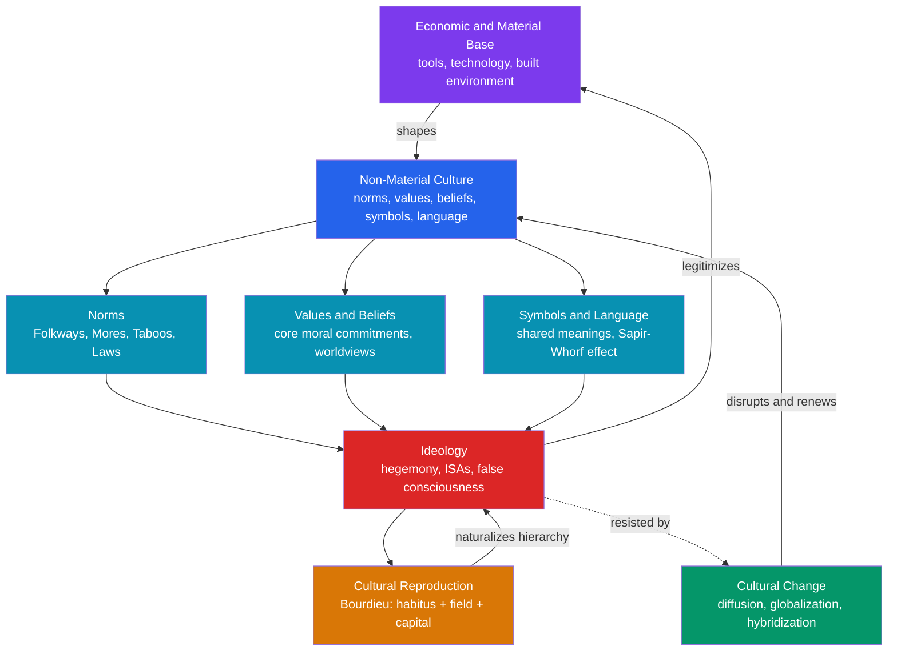

# Culture, Norms, Values, and Ideology

> [!abstract] TL;DR
> Culture is the shared web of meanings — material objects, norms, values, beliefs, symbols, and language — through which humans organize social life. Ideology is the subset of that web that naturalizes existing power arrangements; the central question of the sociology of culture is how those arrangements reproduce themselves without constant coercion. Gramsci's hegemony, Althusser's Ideological State Apparatuses, and Bourdieu's cultural reproduction each give a different answer to the same puzzle: why do the dominated so often consent to their domination?

---

## Intuition

**Analogy:** Culture is the operating system of social life. Just as iOS and Android both let you make phone calls, send messages, and take photos — but impose entirely different interface conventions, gesture vocabularies, and app ecosystems — all human societies accomplish the same basic tasks (feed people, organize kinship, manage conflict, transmit knowledge) but through radically different cultural frameworks. When you travel internationally, you are not switching hardware; you are switching operating systems. Culture shock is the experience of running on an OS whose conventions you have not yet internalized.

The OS analogy illuminates three facts that sociology keeps returning to. First, culture is largely invisible to those running on it — you do not notice the interface until the interface breaks. Second, culture powerfully constrains behavior without any explicit coercion: you do not need a law against eating with your hands at a formal dinner; the social cost is sufficient. Third, culture can change — through upgrades, deliberate forks, or forced rewrites — but change is slow and contested because the entire social architecture depends on backward compatibility.

---

## How It Works



The diagram captures the Marxist-inflected architecture of culture: the material base shapes the non-material culture sitting above it; that culture generates norms, values, and symbols; those in turn coalesce into ideology; ideology legitimizes the base; and the whole system is reproduced without conscious design through the everyday practices Bourdieu calls habitus.

---

## Key Concepts

### Secondary Level

**Material vs. Non-Material Culture**

Sociologists distinguish two layers of culture:

| Layer | Definition | Examples |
|---|---|---|
| **Material culture** | Physical artifacts produced by a society | Architecture, clothing, tools, food, smartphones |
| **Non-material culture** | Shared ideas, values, symbols, norms, beliefs, and language | Individualism, democracy, wedding customs, taboos |

The boundary is porous — material objects carry symbolic meaning (a wedding ring), and ideas are enacted through physical infrastructure (a church building shapes religious practice). Edward Tylor's foundational 1871 definition captured both layers: culture is "that complex whole which includes knowledge, belief, art, morals, law, custom and other capabilities and habits acquired by man as a member of society."

**Cultural Universals**

George Peter Murdock (1945) surveyed hundreds of societies and identified over 70 features present in every known human culture — among them: language, kinship systems, incest taboos, property rights, music, religious ritual, games, and gift-giving. These universals suggest a common human substrate, but their *content* varies enormously: every culture prohibits incest but defines incest differently; every culture has music but uses different scales.

The existence of universals does not license the conclusion that specific cultural practices are natural or inevitable — it only establishes that *some* solution to each functional problem is universal.

**Cultural Relativism vs. Ethnocentrism**

**Ethnocentrism** is the tendency to evaluate other cultures by the standards of one's own, treating them as inferior or deviant when they differ. William Graham Sumner coined the term in 1906. Ethnocentrism is cognitively default — it takes conscious effort to step outside one's own cultural framework.

**Cultural relativism** — associated with Franz Boas and Ruth Benedict — holds that cultural practices must be understood in their own context, not judged by external standards. As a methodological principle (understand before evaluating), it is sound and indispensable for anthropology. As a moral principle (no culture's practices can ever be criticized), it is contested: it struggles to accommodate judgments about practices like female genital mutilation or slavery, which almost all contemporary sociologists condemn on universalist grounds.

The productive position: apply methodological cultural relativism as a starting point for understanding, while retaining the capacity for moral evaluation once that understanding is achieved.

**Norms: Folkways, Mores, Taboos, and Laws**

Sumner (1906) introduced the most widely used typology of social norms:

| Type | Strength | Violation Consequence | Example |
|---|---|---|---|
| **Folkways** | Weak, customary | Mild social disapproval | Belching in public, not making eye contact |
| **Mores** (pl. of *mos*) | Strong, moral | Social ostracism, serious stigma | Adultery, public nudity in most Western contexts |
| **Taboos** | Absolute prohibition | Intense revulsion, severe sanction | Cannibalism, incest |
| **Laws** | Formalized | Legal punishment (fines, imprisonment) | Tax evasion, assault |

The boundaries are fluid. Mores often become codified as laws (once-informal prohibitions against domestic violence became criminal statutes). Former mores — such as racial segregation — can be delegitimized and reversed. The key insight is that most social order rests on folkways and mores, not law: there is no police officer enforcing handshake conventions, yet violations carry real social costs.

---

### Undergraduate Level

**Symbols, Language, and the Sapir-Whorf Hypothesis**

Culture operates through **symbols** — signs that stand for something other than themselves by social convention. The red octagon means "stop" not because of any inherent property of redness or eight-sidedness but because a community has agreed it does. Clifford Geertz's celebrated definition: "man is an animal suspended in webs of significance he himself has spun." Culture, on this view, is not a list of traits but a semiotic system — the task of sociology is interpretive, not merely descriptive.

Language is the master symbol system. The **Sapir-Whorf hypothesis** (linguistic relativity) proposes that the language one speaks shapes the thoughts one can think. The *strong* version (language determines thought) is empirically refuted: people can conceive of things they lack words for. The *weak* version (language influences what is cognitively salient and readily retrievable) has substantial empirical support: Russian speakers, who have separate words for light and dark blue, are faster at discriminating those shades; Hopi speakers, whose language encodes time differently, conceptualize duration differently than English speakers. Cultural categories are linguistically encoded and linguistically transmitted.

**Values, Beliefs, and the Architecture of Culture**

Milton Rokeach (1973) distinguished:
- **Terminal values**: end-states one desires (freedom, equality, salvation, happiness)
- **Instrumental values**: modes of conduct one values (honesty, ambition, self-control)

**Beliefs** are factual claims about how the world is (whether or not correct). **Values** are normative claims about how it should be. Cultural conflict often masquerades as factual disagreement when it is actually a clash of values: the abortion debate is not primarily about biology but about the relative weights of bodily autonomy and potential personhood — a values conflict.

**Ideology: Marx, Althusser, and Gramsci**

*False consciousness (Marx):* For Marx, ideology is the set of ideas produced by the ruling class to represent their particular interests as universal ones. Workers who believe that capitalist relations of production are natural, just, or inevitable are suffering from "false consciousness" — they mistake the historically specific for the eternal. The base (economic structure: who owns what) determines the superstructure (law, culture, religion, politics) — though Marx and Engels' later work acknowledged that the relationship is dialectical, not mechanical.

*Ideological State Apparatuses (Althusser, 1970):* Louis Althusser distinguished:
- **Repressive State Apparatuses (RSAs)**: operate by coercion — police, army, prisons, courts
- **Ideological State Apparatuses (ISAs)**: operate by ideology — education, family, religion, media, trade unions, culture

The educational ISA is Althusser's key example: school does not primarily teach mathematics and grammar — it primarily installs the dominant ideology into children during the years when their subjectivity is most malleable, preparing them to accept their place in the productive order. Workers are taught to be workers; managers to be managers; both are taught that their roles are natural and deserved. Crucially, ISAs do not feel like coercion to those inside them — they feel like truth.

*Hegemony (Gramsci, Prison Notebooks c.1929–1935):* Antonio Gramsci refined and complicated the Marxist account. Why do workers not simply rebel? Because **hegemony** — the process by which the ruling class achieves consent by making its values seem like common sense. Hegemony operates through civil society (schools, churches, newspapers, family) as well as the state. It is never total: Gramsci distinguished between **domination** (coercive control) and **hegemony** (ideological leadership through consent), and emphasized that hegemony must be continuously earned and is always potentially contested by **counter-hegemonic** movements.

Gramsci introduced the concept of the **organic intellectual** — thinkers who articulate the worldview of a rising class — as the key agent of hegemonic struggle.

*Dominant ideology thesis (Abercrombie, Hill & Turner, 1980):* A critical reappraisal: the thesis that a single dominant ideology secures working-class compliance may be overstated. Empirical work suggests that many workers do not actually internalize dominant values — they simply have no realistic alternative. Economic coercion (need to work) does the work that ideology is credited with doing.

**Bourdieu: Cultural Reproduction and the Hidden Curriculum**

Pierre Bourdieu provided the most analytically powerful account of how culture perpetuates social inequality across generations. Three key concepts:

| Concept | Definition | Example |
|---|---|---|
| **Habitus** | System of durable, transposable dispositions — embodied schemes of perception and action acquired through socialization | Working-class child uncomfortable in elite cultural settings; bourgeois child "at home" at the art museum |
| **Field** | A structured social space with its own rules, stakes, and forms of capital | The academic field, the artistic field, the economic field |
| **Capital** | Resources whose possession gives advantage in a field | Economic (money), social (networks), cultural (knowledge, credentials, cultural competence), symbolic (prestige) |

**Cultural capital** is the key mechanism of reproduction. Bernstein showed that middle-class families transmit an "elaborated code" (abstract, context-independent language use) while working-class families use a "restricted code" (context-dependent, concrete). Schools reward the elaborated code and call it intelligence. Middle-class children therefore appear to succeed on merit when they are actually cashing in on prior cultural investment.

Annette Lareau's ethnographic study *Unequal Childhoods* (2003) documented two parenting logics: **concerted cultivation** (middle-class: child as a project to be deliberately developed through scheduled activities and coached adult conversation) vs. **accomplishment of natural growth** (working-class: childhood as relatively autonomous within wide family/peer community constraints). Schools reward concerted cultivation and disadvantage natural growth — not because working-class children are less intelligent, but because they lack the specific cultural capital schools recognize.

---

### Graduate Level

**High Culture vs. Popular Culture and the Cultural Omnivore Thesis**

Matthew Arnold (1869, *Culture and Anarchy*) defined culture as "the best that has been thought and said in the world" — a canonical body of elite artistic and intellectual achievement. On this view, culture (high culture: opera, classical music, canonical literature, fine art) stands in opposition to "philistinism" and "anarchy."

Theodor Adorno and Max Horkheimer (*Dialectic of Enlightenment*, 1944) turned Arnold on his head: the **culture industry** — standardized, mass-produced popular entertainment — is not the absence of culture but its capitalist debasement. Pop culture appears to offer pleasure and choice but in reality imposes conformity, suppresses critical thought, and pacifies the working class. The radio hits, Hollywood films, and magazine stories are interchangeable products designed to maximize consumption and minimize resistance to the status quo. This is a Frankfurt School critique of popular culture as ideological apparatus.

**Cultural omnivore thesis (Peterson & Kern, 1996):** Empirical survey data overturned the simple high/low dichotomy. The expected finding — that high-status individuals consume only highbrow culture — was not there. High-status Americans in the 1990s exhibited *omnivore* tastes: they consumed both opera and country music, both Beethoven and blues. Low-status individuals were more *univore* — consuming popular genres exclusively. Peterson proposed that cultural distinction had shifted from *what* you consume to *how broadly* you consume — cultural breadth signals sophistication and open-mindedness more effectively than exclusive highbrow taste in a multicultural society.

| Category | Status | Cultural Behavior |
|---|---|---|
| Omnivore | High | Consumes across highbrow and popular genres |
| Univore | Lower | Consumes within a limited genre range |
| Highbrow-only (Arnold's ideal) | Historically high, declining | Exclusive classical/elite consumption |

**McDonaldization and Cultural Globalization**

George Ritzer (*The McDonaldization of Society*, 1993) argued that the organizational principles of fast food chains — derived from Weber's concept of formal rationality — are colonizing all domains of social life, from healthcare to higher education:

| Dimension | Principle | McDonald's | University Equivalent |
|---|---|---|---|
| **Efficiency** | Optimal method for task | Drive-through | Online modules, standardized curricula |
| **Calculability** | Quantifiable outcomes over quality | Big Mac calories | Citation counts, rankings |
| **Predictability** | Same experience everywhere | Identical Quarter Pounder globally | Standardized exams, accreditation |
| **Control** | Technology over human discretion | Fry timer removes cook's judgment | Learning management systems, rubrics |

The irrationality of rationality: each dimension is rational from the production side but produces collectively irrational outcomes — nutrition-poor food, low-quality education, dehumanizing healthcare encounters. Ritzer follows Weber's "iron cage" of rationalization reaching a terminal point: a world optimized for efficiency in which human meaning, creativity, and judgment are systematically expelled.

**Cultural Hybridization and Postmodern Culture**

Against the **cultural imperialism** thesis — which holds that American/Western cultural exports (Hollywood, McDonald's, Coca-Cola) simply displace local cultures — **hybridization** theorists argue that cultural flows create new forms rather than simple replacements:

- Jan Nederveen Pieterse: globalization produces "global mélange" — hybrid cultural forms (Mexican sushi, Nigerian hip-hop, Japanese baseball) that are neither pure local nor pure Western.
- Homi Bhabha: the "third space" of cultural encounter produces colonial hybridity — ambivalent cultural forms that neither simply resist nor simply assimilate.
- Arjun Appadurai: global cultural flows operate through five "scapes": *ethnoscapes* (migrant populations), *mediascapes* (media images), *technoscapes* (technology distribution), *finanscapes* (capital flows), and *ideoscapes* (ideological images). These scapes are disjunctive — they do not move in lockstep — producing unpredictable cultural formations.

**Postmodern culture:** Jean Baudrillard (*Simulacra and Simulation*, 1981) argued that late-capitalist culture has entered a phase in which representations no longer refer to an underlying reality — the map precedes and replaces the territory. **Simulacra** are copies without originals: Disneyland is not a simulation of America; it is a hyperreal "real" America that exposes the surrounding world as itself already a simulation. Fredric Jameson (*Postmodernism, or the Cultural Logic of Late Capitalism*, 1984) diagnosed postmodern culture as characterized by: **depthlessness** (surfaces over depth), **weakening of historicity** (nostalgia mode replaces genuine historical sense), **waning of affect** (pastiche replaces parody), and the **sublime of technology** replacing the natural sublime. Both theorists identify postmodern culture not as a free play of meanings but as the cultural form appropriate to late, financialized capitalism — a deepening rather than a transcendence of ideological domination.

---

## Python Demo

```python
# Cultural Diffusion on Contrasting Network Structures
#
# Demonstrates how community structure (tight clusters, few bridges)
# versus a well-mixed random network produces fundamentally different
# diffusion dynamics for a new cultural practice.
#
# Sociological mapping:
#   Clustered  -> tight ethnic/religious/geographic communities
#                 (Granovetter's "strong ties" within, few "weak ties" across)
#   Random     -> cosmopolitan, well-mixed urban environment
#                 (many "weak tie" cross-group connections)
#
# Uses: numpy, matplotlib only

import numpy as np
import matplotlib
matplotlib.use("Agg")           # non-interactive rendering
import matplotlib.pyplot as plt

rng = np.random.default_rng(42)

# ── Parameters ─────────────────────────────────────────────────────────────
N      = 200      # number of agents
K      = 5        # number of communities in the clustered network
P_IN   = 0.25     # within-community edge probability
P_OUT  = 0.02     # cross-community edge probability
BETA   = 0.12     # per-edge adoption probability per time step
T      = 70       # simulation steps
TRIALS = 20       # independent runs (averaged to reduce noise)

# ── Network constructors ────────────────────────────────────────────────────

def build_clustered(n, k, p_in, p_out):
    """
    Community-structured network: k equal communities,
    dense within-community ties, sparse cross-community ties.
    Returns adjacency matrix (n x n float32) and community labels.
    """
    comm  = np.repeat(np.arange(k), n // k)[:n]
    same  = (comm[:, None] == comm[None, :])           # (n, n) bool
    probs = np.where(same, p_in, p_out)
    upper = rng.random((n, n)) < probs
    adj   = ((upper | upper.T) & ~np.eye(n, dtype=bool)).astype(np.float32)
    return adj, comm

def build_random(n, p):
    """Erdős–Rényi G(n,p) random graph."""
    upper = rng.random((n, n)) < p
    adj   = ((upper | upper.T) & ~np.eye(n, dtype=bool)).astype(np.float32)
    return adj

adj_c, comm_c = build_clustered(N, K, P_IN, P_OUT)
mean_degree   = float(adj_c.sum()) / N                 # match degrees for fair comparison
adj_r         = build_random(N, p=mean_degree / (N - 1))

# ── SI cultural adoption model ──────────────────────────────────────────────

def diffuse(adj, beta, n_seeds=3, seed_pool=None, T=70):
    """
    SI (susceptible → adopted) contagion on adjacency matrix.
    Once a practice is adopted it is retained (no recovery).
    Seeds are placed in a single community to model cultural origin
    in one group before spreading to others.

    exposure[i] = number of already-adopting neighbors of agent i
    p_adopt[i]  = 1 - (1 - beta)^exposure[i]   (independent hazard)
    """
    n       = adj.shape[0]
    adopted = np.zeros(n, dtype=bool)
    pool    = np.arange(N // K) if seed_pool is None else seed_pool
    seeds   = rng.choice(pool, size=min(n_seeds, len(pool)), replace=False)
    adopted[seeds] = True

    curve = np.empty(T)
    for t in range(T):
        exposure = adj @ adopted.astype(np.float32)
        p_adopt  = 1.0 - (1.0 - beta) ** exposure
        adopted |= (~adopted) & (rng.random(n) < p_adopt)
        curve[t] = adopted.mean()
    return curve

# ── Run trials ─────────────────────────────────────────────────────────────
pool_c = np.where(comm_c == 0)[0]   # seed within community 0

curves_c = np.stack([diffuse(adj_c, BETA, seed_pool=pool_c, T=T) for _ in range(TRIALS)])
curves_r = np.stack([diffuse(adj_r, BETA, T=T) for _ in range(TRIALS)])

mc, sc = curves_c.mean(0), curves_c.std(0)
mr, sr = curves_r.mean(0), curves_r.std(0)

# ── Statistics ─────────────────────────────────────────────────────────────

def t_threshold(curve, thr=0.5):
    idx = np.where(curve >= thr)[0]
    return int(idx[0]) + 1 if len(idx) else None

steps = np.arange(1, T + 1)

print("=== Cultural Diffusion: Community-Structured vs. Random Network ===")
print(f"  N={N}  K={K} communities  mean_degree={mean_degree:.1f}  beta={BETA}")
print()
print(f"{'Network':<24}  {'Final Adoption':>15}  {'Steps to 50%':>14}")
print("-" * 56)
for label, mean_curve in [("Clustered (K=5)", mc), ("Random (E-R)", mr)]:
    t50 = t_threshold(mean_curve)
    t50_str = str(t50) if t50 else "never"
    print(f"{label:<24}  {mean_curve[-1]:>15.3f}  {t50_str:>14}")

print()
print("Sociological interpretation:")
print("  Clustered: rapid early spread inside origin community,")
print("  then hard plateau at community boundary. Macro-diffusion")
print("  requires Granovetter-style 'weak tie' bridges to other groups.")
print("  Random: slower start (no local critical mass) but steadier")
print("  global spread; the absence of structural holes removes the")
print("  bottleneck that culture change faces in segregated societies.")

# ── Plot ────────────────────────────────────────────────────────────────────
fig, axes = plt.subplots(1, 2, figsize=(11, 4), sharey=True)
fig.suptitle("Cultural Practice Diffusion: How Network Structure Shapes Spread",
             fontsize=11)

configs = [
    (axes[0], mc, sc, f"Clustered  (K={K} communities)", "#c0392b"),
    (axes[1], mr, sr, "Random  (Erdős–Rényi)",            "#2980b9"),
]
for ax, mean_c, std_c, title, col in configs:
    ax.fill_between(steps, mean_c - std_c, mean_c + std_c,
                    alpha=0.18, color=col)
    ax.plot(steps, mean_c, lw=2.5, color=col)
    ax.axhline(0.5, ls="--", lw=1, color="gray", alpha=0.6)
    t50 = t_threshold(mean_c)
    if t50:
        ax.axvline(t50, ls=":", lw=1.5, color="black", alpha=0.55)
        ax.text(t50 + 0.8, 0.06, f"t50={t50}", fontsize=8)
    ax.set_title(title, fontsize=10)
    ax.set_xlabel("Time Step", fontsize=10)
    if ax is axes[0]:
        ax.set_ylabel("Fraction Adopted", fontsize=10)
    ax.set_ylim(-0.02, 1.05)
    ax.set_xlim(1, T)

plt.tight_layout()
plt.savefig("cultural_diffusion.png", dpi=130, bbox_inches="tight")
print("\nFigure saved: cultural_diffusion.png")
```

**What the model demonstrates:**

- **Clustered network** (K = 5 communities, few bridges): the new cultural practice reaches near-saturation within the origin community quickly, then stalls as the practice must "cross" structural holes. Macro-diffusion depends entirely on whether any low-probability cross-community links exist — the occasional weak tie is disproportionately consequential. This maps to Granovetter's (1973) "strength of weak ties": strong intra-community ties circulate redundant information; weak cross-community ties are the conduits for genuine novelty.
- **Random network** (matched mean degree): slower initial build-up (no local critical mass) but more uniform, community-boundary-free spread. The same practice achieves similar final adoption with a smoother diffusion curve.
- **Policy implication**: cultural change campaigns that only target tight in-group networks (e.g., health behavior campaigns targeting only community leaders) achieve fast within-group uptake but low overall penetration. Interventions that deliberately create bridging ties — intergroup contact programs, mixed schools, diverse workplaces — accelerate macro-cultural diffusion.

---

## Real-World Applications

> **Example 1 — Althusser's ISAs in Education:** The 1988 UK National Curriculum debate instantiated Althusser's argument at policy level. Thatcher's insistence on teaching British history chronologically from a particular national perspective, rejecting multicultural or class-based approaches, was precisely the struggle over which ideological content the educational ISA would transmit. Pierre Bourdieu's concept of the legitimate curriculum maps directly: the selected content of any national curriculum encodes the cultural capital of whichever class controls the selection process.

> **Example 2 — Bourdieu and the Achievement Gap:** Multiple studies (Lareau 2003, Sullivan 2001) confirm that measured cultural capital — familiarity with legitimate high-culture references, comfort with academic register, participation in organized extracurriculars — predicts academic achievement above and beyond measured cognitive ability and socioeconomic status. The SAT verbal component, for decades, was more accurately described as a cultural capital test than an aptitude test. College-admissions legacy preferences compound the effect: children of alumni inherit social capital that is then converted into symbolic capital (the "elite" degree) and reconverted into economic capital.

> **Example 3 — Gramsci's Hegemony and the Media:** Gramsci argued that the newspaper is the party's primary ideological weapon. Stuart Hall's "encoding/decoding" model (1980) extended this to television: dominant ideology is encoded into media texts; audiences can decode via the dominant reading (accepting the ideology), a negotiated reading (accepting the framework but modifying applications), or an oppositional reading (seeing through the ideological framing). Hall's analysis of 1970s British news coverage of "mugging" — which racially coded crime reporting in ways that naturalized police harassment of Black communities — showed hegemony being manufactured in real time.

> **Example 4 — McDonaldization of Healthcare:** Emergency department triage protocols, electronic health records designed around billing codes rather than clinical narrative, and the 7-minute average appointment — all exhibit Ritzer's four dimensions. The electronic health record optimizes calculability (every intervention coded for reimbursement) and control (system-mandated click-through menus remove clinician discretion). The irrationality: physicians spend more time on data entry than on patients; the metric for healthcare shifts from health outcomes to billable events.

> **Example 5 — Cultural Hybridization: K-pop:** K-pop is the empirical refutation of simple cultural imperialism. South Korea absorbed American pop music, hip-hop production techniques, and synchronized dance from Japanese idol culture, passed them through Korean aesthetic sensibilities (Confucian group performance ethic, Korean beauty standards, intense training system), and produced a hybrid cultural product that now exports globally — including back to the United States. BTS's 2020 Billboard No. 1 represents not Americanization but hybridization generating reverse flows: the periphery producing culture consumed at the core.

---

## Common Pitfalls

- **Conflating culture with race or biology** — Culture is learned, not inherited. Behavioral differences between groups are cultural (historically contingent, changeable) not genetic. The conflation is the ideological work that naturalizes social inequality as natural hierarchy. This is precisely what Bourdieu meant when he said the educational system converts class advantages into "natural gifts."

- **Reifying culture** — Treating culture as a static, bounded "thing" a group possesses rather than an ongoing, contested, internally heterogeneous process. There is no monolithic "American culture" or "Islamic culture" — there are Americans and Muslims, engaged in continuous internal disagreement about what those categories mean. The reification error produces essentialism: attributing all behavior to a culture as if it were a causal force rather than an analytical construct.

- **Misapplying Sapir-Whorf** — The strong version (language determines thought) is false and its frequent popular invocation ("Eskimos have fifty words for snow, therefore...") is based on a misreading of Boas. The weak version is well-supported. Claiming that people cannot think something for which they lack a word overstates the hypothesis. The correct claim: language influences the cognitive accessibility and default categorization of experiences, not the possibility of thought.

- **Conflating ideology with explicit political belief** — Althusser and Gramsci are making a stronger claim: ideology is not primarily about conscious political opinions but about the naturalized background assumptions that do not feel like ideology at all — that private property is natural, that meritocracy explains outcomes, that women are naturally suited to domestic work. The explicit "I believe in capitalism" is far less ideologically powerful than the unreflective "of course you have to work to earn a living."

- **Using "dominant ideology" to deny all agency** — The dominant ideology thesis can become so sweeping that it removes any space for resistance, contestation, or structural contradiction. Abercrombie, Hill and Turner's empirical critique stands: many dominated groups do not internalize the dominant ideology and do not need to for the system to function. Economic compulsion does considerable work without ideological consent.

- **Treating McDonaldization as unstoppable homogenization** — Ritzer explicitly notes that McDonaldization is a tendency, not a completed state. Local resistance, craft movements, regulatory constraints, and consumer counter-reactions (artisan food, slow medicine, project-based learning) exist as genuine counter-tendencies. The iron cage is iron, but it has gates.

---

## Related Concepts

- [[_MOC_Culture_Identity_and_Socialization|↑ Culture, Identity & Socialization MOC]] — Section entry point and concept map
- [[Socialism_Marxism_and_Communism]] — The base/superstructure model is the foundation of the Marxist account of ideology; false consciousness and cultural reproduction are extensions of historical materialism; understanding Marx's architecture is prerequisite to reading Althusser and Gramsci
- [[Contemporary_Political_Ideologies]] — Political ideologies (nationalism, populism, fascism) are specific configurations of the cultural elements described here — they select particular values, symbols, and narratives and organize them into a coherent worldview mobilizing particular social groups
- [[Media_Propaganda_and_Political_Communication]] — Althusser's educational and media ISAs operate through the mechanisms agenda-setting, framing, and priming describe at the empirical level; hegemony is manufactured through the institutional logics of the media system Chomsky and Herman analyzed
- [[Political_Psychology_and_Ideology]] — The psychological substrate of ideological belief: Haidt's moral foundations, Right-Wing Authoritarianism, and System Justification theory explain why individuals find particular cultural/ideological frameworks emotionally satisfying and resistant to revision
- [[Globalization_and_Its_Discontents]] — McDonaldization and cultural hybridization are the micro-level cultural dimensions of the macro-level economic and political integration globalization describes; the distributional politics of globalization are inseparable from the distributional politics of cultural change
- [[Language_and_Thought]] — The Sapir-Whorf hypothesis sits at the intersection of linguistics, cognitive psychology, and cultural sociology; the weak linguistic relativity finding is the psychological mechanism through which cultural categories shape perception and cognition
- [[Attitudes_and_Persuasion]] — Cultural norms are internalized through processes of socialization that produce durable attitudes; the Elaboration Likelihood Model describes the psychological mechanism through which ideological messages achieve attitude change — the peripheral route is the mechanism through which ideological naturalization operates
- [[Social_Influence_and_Conformity]] — Norm enforcement through social influence (normative and informational pressure) is the micro-sociological mechanism by which cultural norms maintain themselves in everyday interaction; Milgram's obedience dynamics and Asch's conformity are the laboratory analogues of the sociological process
- [[Group_Dynamics]] — Group polarization, groupthink, and intergroup dynamics are the meso-level processes through which cultural communities maintain internal coherence and police boundaries; cultural distinctiveness is in part a product of group-level dynamics
- [[Prejudice_and_Discrimination]] — Ethnocentrism is the attitudinal form of cultural boundary-maintenance; prejudice against out-group members is systematically produced and reproduced by cultural socialization processes, not merely individual pathology

---

## Review Questions

### Secondary

1. Your school has a rule against wearing hats indoors. Using Sumner's typology, classify this norm and explain how you would determine whether it is a folkway, a more, or a law. What would the consequence of violation tell you about its type?
2. A traveler from Japan visits the United States and is uncomfortable with the degree of informality between strangers. An American finds Japanese interpersonal distance "cold." Who is right? Using the concept of cultural relativism, explain what a sociologist would say about this clash, and identify one limit of cultural relativism as a moral principle.

### Undergraduate

3. Bourdieu argues that the educational system reproduces class inequality while appearing to sort students purely by merit. Identify two specific mechanisms through which cultural capital advantages middle-class students, and explain what evidence would be needed to distinguish Bourdieu's account from the simpler claim that class differences in educational attainment just reflect differences in intelligence.
4. Althusser claims that the educational ISA is the dominant ideological apparatus in advanced capitalist societies. Using three specific examples from your own educational experience, evaluate this claim: what elements of the dominant ideology did your schooling transmit, and in what ways — if any — did it provide tools for questioning that ideology?
5. The Sapir-Whorf hypothesis and Bourdieu's concept of cultural capital both argue that language shapes social outcomes. How do their claims differ in mechanism, in domain (cognitive vs. social), and in the political implications they carry? At what point do the two accounts converge?

### Graduate

6. Gramsci's concept of hegemony was developed to explain why the Italian working class did not follow the revolutionary script Marxist theory predicted. How does hegemony as an analytical concept differ from "false consciousness," and what does that difference imply about the appropriate political strategy for counter-hegemonic movements? Use Hall's encoding/decoding model to bridge Gramsci's political theory to contemporary media analysis.
7. Peterson and Kern's cultural omnivore thesis challenged Bourdieu's account of cultural capital as a marker of class distinction. Evaluate the debate: what does the omnivorousness finding actually show, and what does it fail to show? Is it possible that cultural omnivorousness is itself a new form of distinction appropriate to a multicultural, knowledge-economy social structure rather than a refutation of Bourdieu?
8. Baudrillard argues that postmodern culture has produced a "hyperreality" in which the distinction between original and representation has collapsed. Ritzer argues that contemporary social life is characterized by excessive, dehumanizing rationalization. These diagnoses appear contradictory — one sees too much fluidity and surface, the other too much rigid systematization. Develop a synthesis that accounts for both tendencies, and identify a single empirical domain (healthcare, education, social media, or urban planning) where you can demonstrate both processes operating simultaneously.

---

## Sources

- [Tylor, E.B. (1871). *Primitive Culture*. Murray](https://archive.org/details/primitiveculture01tylouoft)
- [Sumner, W.G. (1906). *Folkways*. Ginn](https://archive.org/details/folkways00sumnuoft)
- [Murdock, G.P. (1945). "The Common Denominator of Cultures." In R. Linton (Ed.), *The Science of Man in the World Crisis*. Columbia University Press](https://www.worldcat.org/title/science-of-man-in-the-world-crisis)
- [Althusser, L. (1970). "Ideology and Ideological State Apparatuses." In *Lenin and Philosophy and Other Essays*. Monthly Review Press](https://www.marxists.org/reference/archive/althusser/1970/ideology.htm)
- [Gramsci, A. (1929–1935). *Selections from the Prison Notebooks*. Lawrence & Wishart (1971 English edition)](https://www.goodreads.com/book/show/53226.Selections_from_the_Prison_Notebooks)
- [Geertz, C. (1973). *The Interpretation of Cultures*. Basic Books](https://www.goodreads.com/book/show/53204.The_Interpretation_of_Cultures)
- [Bourdieu, P. (1986). "The Forms of Capital." In J. Richardson (Ed.), *Handbook of Theory and Research for the Sociology of Education*. Greenwood](https://www.marxists.org/reference/subject/philosophy/works/fr/bourdieu-forms-capital.htm)
- [Bourdieu, P. & Passeron, J-C. (1977). *Reproduction in Education, Society and Culture*. Sage](https://www.goodreads.com/book/show/72560.Reproduction_in_Education_Society_and_Culture)
- [Lareau, A. (2003). *Unequal Childhoods: Class, Race, and Family Life*. University of California Press](https://www.goodreads.com/book/show/80882.Unequal_Childhoods)
- [Ritzer, G. (1993). *The McDonaldization of Society*. Pine Forge Press](https://www.goodreads.com/book/show/86895.The_McDonaldization_of_Society)
- [Peterson, R.A. & Kern, R.M. (1996). "Changing Highbrow Taste: From Snob to Omnivore." *American Sociological Review* 61(5), 900–907](https://doi.org/10.2307/2096460)
- [Granovetter, M. (1973). "The Strength of Weak Ties." *American Journal of Sociology* 78(6), 1360–1380](https://doi.org/10.1086/225469)
- [Nederveen Pieterse, J. (1994). "Globalisation as Hybridisation." *International Sociology* 9(2), 161–184](https://doi.org/10.1177/026858094009002003)
- [Baudrillard, J. (1981). *Simulacra and Simulation*. Editions Galilée (Michigan trans. 1994)](https://www.goodreads.com/book/show/525227.Simulacra_and_Simulation)
- [Abercrombie, N., Hill, S. & Turner, B.S. (1980). *The Dominant Ideology Thesis*. Allen & Unwin](https://www.worldcat.org/title/dominant-ideology-thesis/oclc/6543963)
- [Hall, S. (1980). "Encoding/Decoding." In Hall et al. (Eds.), *Culture, Media, Language*. Hutchinson](https://www.worldcat.org/title/culture-media-language/oclc/7277780)

---

#Sociology #Culture #Norms #Values #Ideology #CulturalReproduction #Bourdieu #Gramsci #Althusser
