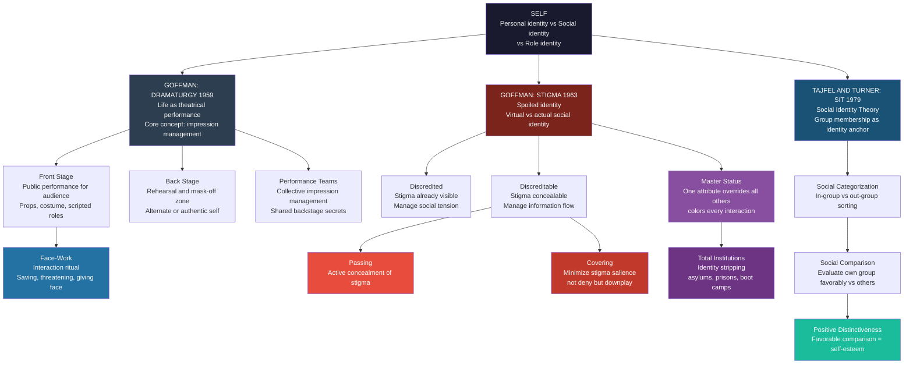

# Identity, Stigma, and Impression Management

> [!abstract] TL;DR
> Every social interaction involves a performance: Erving Goffman showed that we manage our self-presentation (front stage) while concealing a private back-stage self, and that a stigma event — the sudden exposure of discreditable information — can shatter this performance and "spoil" an identity. Tajfel and Turner's Social Identity Theory explains why group memberships become identity anchors: we derive self-esteem from favorable comparisons between our in-group and out-groups, making identity simultaneously a personal project and a group battlefield.

---

## Intuition

**Analogy:** Imagine every social interaction as an audition that never ends. You walk into a job interview wearing pressed clothes and using formal language — that is your front stage. Back home, you complain loudly about the interviewer, eat cereal in pajamas, and rehearse the lines you wish you had said — that is your back stage. Now imagine someone at the interview whispers to the panel that you once had a public breakdown on social media. Suddenly your front-stage performance collapses: the gap between what you projected and what the audience now believes about you is exposed. That gap — and the anxious labor of managing it — is what Goffman called the core of social life.

The deeper insight is that this labor is not exceptional; it is constant. Every conversation is a performance. Every choice of words, clothes, or emoji is a prop. And every one of us is simultaneously actor and audience — which is why the exposure of someone else's gap feels like a threat to our own.

---

## How It Works



---

## Key Concepts

### Secondary Level

**What is identity?** In everyday use, identity answers the question "who am I?" — but sociologists separate this into layers. *Personal identity* is the unique constellation of characteristics, experiences, and memories that make you distinctively you. *Social identity* is your sense of self derived from group memberships: I am a student, a Muslim, a Londoner. *Role identity* is the self-concept attached to the roles you occupy: teacher, parent, employee.

The sociological insight is that none of these layers is purely individual. They are built through interaction with others and constrained by social structures. Who you think you are depends heavily on who others think you are — and who they think you are depends on which categories, groups, and roles they assign you.

**Goffman's theater of everyday life.** Erving Goffman (1922–1982) argued in *The Presentation of Self in Everyday Life* (1959) that all social interaction is a kind of theater. Everyone is simultaneously actor and audience. We perform for others, manage the impressions we create, and try to control what information others receive. Key vocabulary:

- **Front stage**: the setting and performance put on for an audience — formal language, professional attire, controlled expression
- **Back stage**: the region where the performer relaxes, steps out of role, rehearses, and reveals what the front stage conceals
- **Props**: physical objects used to support the performance (a doctor's white coat, a teacher's podium)
- **Impression management**: the effort to control others' perceptions of you

**What is stigma?** Goffman's *Stigma: Notes on the Management of Spoiled Identity* (1963) defines stigma as a deeply discrediting attribute that reduces a person from "a whole and usual person to a tainted, discounted one." Stigma is not in the attribute itself but in the relationship between the attribute and the social context — the gap between *virtual social identity* (who the audience expects you to be) and *actual social identity* (who you are).

Three types of stigma: (1) **abominations of the body** — physical deformities or disabilities; (2) **blemishes of individual character** — perceived moral failures such as addiction, criminal record, or mental illness; (3) **tribal stigma** — membership in a stigmatized group defined by race, religion, or nationality.

---

### Undergraduate Level

#### Goffman's Dramaturgical Model in Depth

**Front stage vs back stage:** The distinction is not simply "public vs private." The front stage is defined by the presence of an audience and the consequent need for a consistent, coherent impression. The back stage is defined by the absence of the relevant audience: the performer can relax role requirements, rehearse, prepare props, and drop the mask. What counts as back stage is relative to the audience: a restaurant kitchen is back stage relative to the dining room, but front stage relative to a health inspector.

**Performance teams:** Impression management is often collective. A team is any set of individuals cooperating in staging a single routine. Team members share secrets — information that would disrupt the performance if the audience knew. This creates team loyalty, a shared stake in the performance's success, and vulnerability to betrayal by any member. Hospital staff maintain a unified, reassuring front for patients while venting frustrations freely back stage; their performance depends on collective coordination.

**Face-work and interaction ritual:** Goffman extended the dramaturgical framework in "On Face-Work" (1955) and *Interaction Ritual* (1967). "Face" is the positive social value a person effectively claims in an interaction — a self-image projected onto others. Everyone in an interaction has an interest in maintaining not only their own face but also others': a successful interaction requires mutual face maintenance. Face-threatening acts (criticism, contradiction, exposure) are dangerous because they disrupt the shared ritual order. Management strategies:

- **Avoidance**: steer clear of topics likely to produce face loss
- **Corrective process**: apologize, make repairs, offer remedies after a face-threatening event
- **Defensive practices**: use tact, disclaimers, or hedges to pre-emptively protect face
- **Protective practices**: help others save face after embarrassment

Randall Collins extended this into *Interaction Ritual Chains* (2004): successful interactions build emotional energy and solidarity, while face-threatening interactions drain it. Individuals are drawn to situations likely to recharge their emotional energy — which explains ritual, worship, parties, and fan culture as interaction-energy economies.

#### Stigma Management Strategies

**Discredited vs discreditable:** A *discredited* person's stigma is already known or immediately apparent — managing social tension (awkwardness, pity, avoidance) is the problem. A *discreditable* person's stigma is not yet known or not immediately visible — managing information is the problem. This asymmetry produces radically different lived experiences and self-management strategies.

| Strategy | Applicable to | Mechanism | Costs |
|---|---|---|---|
| **Passing** | Discreditable | Actively conceal stigma; avoid situations where it would be revealed | Anxiety, self-alienation, risk of catastrophic exposure |
| **Covering** | Both (mainly discredited) | Acknowledge stigma but minimize its salience; don't deny, but downplay | Loss of authenticity; others may perceive it as denial |
| **In-group affiliation** | Both | Seek community with those who share the stigma; reduce isolation | May reinforce separation from "normals" |
| **Strategic disclosure** | Discreditable | Reveal stigma on own terms to select audiences | Risk of spread; but restores agency and can be liberating |
| **Identity transformation** | Both | Reframe stigma as non-stigmatizing (disability pride, gay pride movements) | Requires collective action; not equally available to all |

**Master status:** Everett Hughes (1945) coined "master status" to describe the social attribute that overrides all others in an interaction. Race is often a master status in racialized societies — a Black professional is perceived as "Black" before "professional." Hughes connected this to role theory: if your master status is at odds with other roles you occupy (a female judge in a gendered legal culture), you are in a *status contradiction*.

**Total institutions:** In *Asylums* (1961), Goffman analyzed institutions where individuals live, sleep, work, and play in the same enclosed space under a single authority — prisons, psychiatric hospitals, military barracks, convents, ships. Total institutions are characterized by *identity stripping*: on entry, inmates are divested of personal property, civilian clothes, name, and personal freedoms. They are assigned a standardized institutional identity — number, uniform, role — that erases individuality. Goffman documented the *mortification of the self* (deference rituals, contamination, dispossession) and the coping tactics inmates use to carve out small spheres of selfhood within the structure.

#### Social Identity Theory

Henri Tajfel (1919–1982) and John Turner (1947–2011) developed Social Identity Theory (SIT) in response to a core puzzle: why do people show in-group favoritism even when group membership is trivial and inter-group conflict has no rational basis?

**The three-component model:**

1. **Social categorization**: We automatically sort people into groups (us vs them). This is cognitively economical but also ethnocentric — in-group categories are more finely differentiated than out-group ones.
2. **Social identification**: We internalize group membership as part of our self-concept. Being English, being a Manchester United supporter, being a sociologist — these become part of "who I am."
3. **Social comparison**: We evaluate our group by comparing it with relevant out-groups. Because our self-esteem is partly tied to our group's standing, we are motivated to ensure our group compares favorably.

**Positive distinctiveness** is the core mechanism: to maintain positive self-esteem, people seek to establish that their in-group is favorably distinct from relevant out-groups. If the comparison is unfavorable, three responses are available: (a) *individual mobility* — leave the group; (b) *social creativity* — find a new dimension on which the in-group compares favorably ("we may be poor but we are honest"); (c) *social competition* — collective action to improve the group's objective standing.

**The minimal group paradigm** (Tajfel, 1970): participants assigned to groups based on trivial criteria (preference for Klee vs Kandinsky paintings) showed in-group favoritism in resource allocation immediately — even when doing so was against their individual financial interest. This demonstrated that mere categorization, not realistic conflict or prior history, is sufficient to generate discrimination.

#### Role Theory and Symbolic Interactionism

**Mead's "I" and "me":** George Herbert Mead (1863–1931), the founding figure of symbolic interactionism, distinguished two components of the self. The "me" is the socialized self — the internalization of the "generalized other" (the attitudes and expectations of society as a whole). The "I" is the spontaneous, creative, unreflective response to the social situation. Identity is the ongoing conversation between these two: the "me" regulates social behavior; the "I" is the source of novelty and deviation.

**Parsons and role sets:** Talcott Parsons developed a structural role theory: individuals occupy positions in social structures, and each position carries normative expectations (a role). The person playing "teacher" faces a *role set* — distinct expectations from students, colleagues, administrators, parents, and the state. *Role conflict* occurs when these expectations are incompatible across roles. *Role strain* occurs when a single role makes mutually incompatible demands.

#### Narrative Identity and Identity Work

**Giddens' reflexive project:** Anthony Giddens (*Modernity and Self-Identity*, 1991) argued that in late modernity, identity is no longer given by tradition or fixed social location. The self becomes a "reflexive project": a narrative that the individual constructs and continuously revises — a coherent biographical account that maintains continuity across time and context. The characteristic pathology of late modernity is *ontological insecurity*: in a world of rapid change, institutional dissolution, and lifestyle pluralism, the self can become fragile and incoherent.

**Identity work:** The ongoing practices through which individuals construct, maintain, and transform their identities — including narrative self-presentation, management of identity-related emotions (pride, shame, stigma anxiety), affiliation with identity communities, and the creative reframing of social labels.

---

### Graduate Level

#### Interaction Ritual Chains and the Distribution of Emotional Energy

Collins' *Interaction Ritual Chains* (2004) extends Goffman's face-work into a microsociological theory of social stratification. Successful face-to-face rituals generate *emotional energy* (EE) — a feeling of confidence, enthusiasm, and motivation — that drives individuals toward future high-EE interactions. Repeated exclusion from high-EE interactions (through stigma, low status, or structural isolation) produces chronically low emotional energy: depression, passivity, and withdrawal. Collins argues that inequality is partly reproduced through the differential distribution of interaction ritual opportunities — powerful people occupy richer ritual networks, accumulate more EE, and this emotional capital reinforces structural advantage.

This has a direct implication for stigma theory: the stigmatized individual is not merely devalued symbolically but also excluded from the richest interaction rituals, compounding structural disadvantage with micro-level emotional deprivation. Stigma is not just a cognitive label; it is a drain on the interactional energy economy.

#### Discourse, Subjectification, and the Post-Structural Critique

Goffman's dramaturgical model has been criticized for assuming a stable, strategic actor behind the performance — a self that deliberately manipulates impressions. Post-structural theorists, following Foucault, reject this. For Foucault, the subject is not an agent who manages identities but an *effect* of discourse: identity is produced by regimes of knowledge-power (clinical medicine, psychiatry, criminology, sexuality discourse) that name, categorize, and normalize. The prisoner is not a strategic performer who happens to be in a prison; the subject "prisoner" is constituted by the disciplinary apparatus of incarceration. There is no pre-carceral self waiting backstage to be liberated.

This produces a fundamental tension in identity theory:

| Framework | Status of the self | Relation to social norms |
|---|---|---|
| **Goffman** | Strategic performer; pre-exists the performance | Norms are resources used for impression management |
| **Foucault** | Effect of discourse; no prior self | Norms are constitutive of the subject |
| **Butler's performativity** | Constituted through compulsory repetition of normative acts | No original actor behind the performance; the act creates the actor |

Butler's formulation dissolves the front-stage / back-stage distinction: if there is no "authentic self" backstage, then the back stage is not liberation from performance but simply a different performance for a different audience. What reads as authenticity is compulsory repetition in a context with looser social surveillance.

#### Identity Threat and Its Downstream Consequences

Contemporary social psychology (Steele, Baumeister, Tesser) has operationalized identity threat as a measurable variable. Threats to the self-concept activate:

- **Compensatory self-enhancement**: bolster alternative identities when a central identity is threatened (threatened academic identity → emphasize athletic identity)
- **Stereotype threat**: awareness of a negative group stereotype impairs task performance (Steele & Aronson, 1995) — a direct mechanism by which stigma translates into measurable outcome disparity, without any overt discrimination occurring
- **Terror management theory** (Greenberg, Pyszczynski, Solomon): awareness of mortality — the ultimate identity annihilation — motivates worldview defense, in-group favoritism, and derogation of those who challenge one's cultural worldview

The stereotype-threat mechanism is particularly significant for policy: it shows that stigma can reduce the performance and attainment of stigmatized groups even in the absence of prejudiced evaluators, through purely psychological mediation.

#### Digital Identity and Context Collapse

Online, individuals manage multiple simultaneous front stages (LinkedIn, Instagram, X, private Discord servers) for distinct audiences. The problem of *context collapse* (danah boyd) occurs when information designed for one audience — back stage for one group, front stage for another — is made visible to an unintended audience. Context collapse erases the audience segregation that impression management requires.

Digital trace data makes discreditable information increasingly permanent: old tweets, archived posts, and data-broker records constitute a persistent record that can be exposed at any point — making everyone, in Goffman's terms, perpetually *discreditable*. The result is heightened identity work, strategic self-censorship, and what Sherry Turkle calls "performing the self" rather than developing one. The platform architecture itself — algorithmic amplification, quantified reputation scores (followers, likes) — transforms impression management from a dyadic interaction skill into an engineered visibility optimization problem.

#### The Limits of Dramaturgical Sociology

Alvin Gouldner's critique (*The Coming Crisis of Western Sociology*, 1970) charged that Goffman's dramaturgy is ideologically conservative: it describes how people manage impressions without asking why they must, or whose interests this management serves. By treating impression management as universal and natural, Goffman depoliticizes the social order. A radical reading demands: whose social norms define what a "spoiled" identity is? Whose interests are served by the stigmatization of certain attributes?

Similarly, the "total institution" concept is insightful but analytically over-broad — it applies the same framework to a Nazi concentration camp and a boarding school, flattening crucial moral distinctions.

A more structural account integrates Goffman's micro-level insight with the macro-structural question of how access to the tools of impression management (education, accent, physical appearance, social networks) is itself distributed unequally — linking dramaturgy directly to [[Intersectionality]] and [[Gender_Sex_and_Patriarchy]].

---

## Python Demo

```python
import numpy as np
import matplotlib.pyplot as plt
import matplotlib.gridspec as gridspec

# ---------------------------------------------------------------
# Goffman: Impression Management and Stigma Propagation
# on a Social Network
#
# Goffmanian concepts modeled:
#   true_identity  -- back-stage score (private; never directly visible)
#   front_stage    -- public presentation = true + management boost + noise
#   reputation     -- weighted-average perception across social ties
#
# Stigma event at t = T_STIGMA:
#   One agent's discreditable information is suddenly revealed.
#   Their front-stage score collapses toward (and below) true identity.
#   The collapse propagates through the network via tie strength,
#   reflecting Goffman's claim: stigma is relational -- what matters
#   is not the attribute but the audience-facing discrepancy it exposes.
# ---------------------------------------------------------------

np.random.seed(42)
N = 20          # social agents
T = 80          # simulation time steps
T_STIGMA = 40   # time step at which stigma is revealed
TARGET = 3      # which agent is stigmatized

# --- Build weighted social network (tie strength in [0, 1]) ---
raw  = np.random.rand(N, N)
mask = np.random.rand(N, N) < 0.35          # ~35% tie density
A    = (raw * mask + (raw * mask).T) / 2    # symmetric tie strengths
np.fill_diagonal(A, 0)

row_sums = A.sum(axis=1, keepdims=True)
row_sums[row_sums == 0] = 1                  # guard: isolated node
A_norm = A / row_sums                        # row-normalised for weighted avg

# --- Agent properties ---
true_identity = np.random.uniform(0.35, 0.65, N)   # back-stage true score
mgmt_boost    = np.random.uniform(0.10, 0.28, N)   # impression management effort

# Front-stage: true + management boost + small observation noise
front_stage = np.clip(
    true_identity + mgmt_boost + np.random.normal(0, 0.02, N), 0, 1
)

# --- Simulation ---
hist_front = np.zeros((T, N))   # front-stage trajectory
hist_rep   = np.zeros((T, N))   # reputation trajectory

reputation = front_stage.copy()

for t in range(T):
    # STIGMA EVENT: discreditable information is revealed
    # Management boost is stripped; front-stage collapses to below true score
    if t == T_STIGMA:
        front_stage[TARGET] = max(0.0, true_identity[TARGET] - 0.12)

    # Reputation = weighted-average perception via social ties
    reputation = A_norm @ front_stage

    # Feedback loop: agents adjust front-stage toward peer reputation signal
    # (audience reactions reshape subsequent self-presentation)
    front_stage = np.clip(
        front_stage + 0.08 * (reputation - front_stage), 0, 1
    )

    hist_front[t] = front_stage
    hist_rep[t]   = reputation

# --- Visualisation ---
others    = [i for i in range(N) if i != TARGET]
pre_step  = T_STIGMA - 1
post_step = min(T_STIGMA + 15, T - 1)

fig = plt.figure(figsize=(14, 8))
fig.suptitle(
    "Goffman: Impression Management and Stigma Propagation on a Social Network\n"
    f"Stigma event (revelation of discreditable information) at t = {T_STIGMA}",
    fontsize=12, fontweight="bold"
)
gs = gridspec.GridSpec(2, 2, figure=fig, hspace=0.45, wspace=0.35)

# Panel A: Front-stage trajectories
ax1 = fig.add_subplot(gs[0, 0])
ax1.plot(hist_front[:, TARGET], color="crimson", lw=2.5,
         label=f"Agent {TARGET} (stigmatized)")
ax1.plot(hist_front[:, others].mean(axis=1), color="steelblue",
         lw=2, ls="--", label="Network mean (others)")
ax1.axvline(T_STIGMA, color="black", lw=1.2, ls=":", label="Stigma revelation")
ax1.set_xlabel("Time step")
ax1.set_ylabel("Front-stage score")
ax1.set_title("Front-Stage Presentation Over Time")
ax1.set_ylim(0, 1)
ax1.legend(fontsize=8)
ax1.grid(True, alpha=0.3)

# Panel B: Reputation propagation through the network
ax2 = fig.add_subplot(gs[0, 1])
ax2.plot(hist_rep[:, TARGET], color="crimson", lw=2.5,
         label=f"Agent {TARGET} (stigmatized)")
ax2.plot(hist_rep[:, others].mean(axis=1), color="steelblue",
         lw=2, ls="--", label="Network mean (others)")
ax2.axvline(T_STIGMA, color="black", lw=1.2, ls=":")
ax2.set_xlabel("Time step")
ax2.set_ylabel("Reputation score (neighbors' perception)")
ax2.set_title("Reputation Propagation After Stigma Event")
ax2.set_ylim(0, 1)
ax2.legend(fontsize=8)
ax2.grid(True, alpha=0.3)

# Panel C: Per-neighbor reputation change (stigma contagion by tie strength)
neighbors   = np.where(A[TARGET] > 0)[0]
pre_rep_nb  = hist_rep[pre_step, neighbors]
post_rep_nb = hist_rep[post_step, neighbors]
delta       = post_rep_nb - pre_rep_nb

ax3 = fig.add_subplot(gs[1, 0])
bar_colors = ["tomato" if d < 0 else "mediumseagreen" for d in delta]
ax3.bar(range(len(neighbors)), delta, color=bar_colors)
ax3.axhline(0, color="black", lw=0.8)
ax3.set_xticks(range(len(neighbors)))
ax3.set_xticklabels([f"Ag{n}" for n in neighbors], fontsize=8)
ax3.set_xlabel("Neighbor agent")
ax3.set_ylabel("Reputation change (post - pre)")
ax3.set_title(
    f"Reputation Change in Agent {TARGET}'s Neighborhood\n"
    "(15 steps post-stigma; red = collateral damage)"
)
ax3.grid(True, alpha=0.3, axis="y")

# Panel D: Network-wide reputation distribution, before vs after
rep_pre  = hist_rep[pre_step]
rep_post = hist_rep[-1]
x = np.arange(N)
w = 0.4

ax4 = fig.add_subplot(gs[1, 1])
ax4.bar(x - w/2, rep_pre,  w, label="Pre-stigma",  color="steelblue", alpha=0.8)
ax4.bar(x + w/2, rep_post, w, label="Post-stigma", color="tomato",    alpha=0.8)
ax4.bar(
    [TARGET - w/2, TARGET + w/2],
    [rep_pre[TARGET], rep_post[TARGET]],
    w, color="black", alpha=0.95, label=f"Agent {TARGET} (stigmatized)"
)
ax4.set_xlabel("Agent")
ax4.set_ylabel("Reputation score")
ax4.set_title("Network-Wide Reputation: Before vs After Stigma Event")
ax4.set_xlim(-0.5, N - 0.5)
ax4.legend(fontsize=8)
ax4.grid(True, alpha=0.3, axis="y")

plt.savefig("goffman_stigma_network.png", dpi=110, bbox_inches="tight")
plt.show()

print(f"Agent {TARGET} reputation: {rep_pre[TARGET]:.3f} -> {rep_post[TARGET]:.3f} "
      f"(delta = {rep_post[TARGET] - rep_pre[TARGET]:+.3f})")
print(f"Network mean (others):     {rep_pre[others].mean():.3f} -> {rep_post[others].mean():.3f}")
print(f"Neighbors with reputational damage: {sum(d < 0 for d in delta)} / {len(neighbors)}")
```

---

## Real-World Applications

> **Disclosure management in chronic illness.** Patients with HIV, epilepsy, or mental illness face the classic *discreditable* problem: when to disclose to employers, romantic partners, or social networks, and in what sequence. Research by Joachim and Acorn (2000) documented the psychological burden of "passing" — exhaustion from constantly monitoring conversations and deflecting questions. The relief of strategic disclosure, even at social cost, is a consistent finding in medical sociology. The model predicts: the longer passing continues, the greater the identity distortion, and the greater the potential devastation of eventual exposure.

> **Social media and context collapse.** Facebook's 2010 design decision to merge audience lists into a single "wall" forced context collapse at scale. Users who had maintained separate front-stage performances for professional contacts, family, and friends suddenly had these audiences merged. Documented consequences: increased self-censorship, retreat to more private platforms (Snapchat, Signal), and a sharp rise in post-publication regret — behavior that maps precisely onto Goffman's prediction that impression management fails when audience segregation fails.

> **Police body cameras and front-stage disruption.** Body-worn cameras impose a permanent observer on front-stage police-citizen interactions. Goffman's framework predicts two responses: either officers modify their front-stage to account for the camera (more restrained behavior), or they treat the camera as part of the audience and perform for it. Research (Lum et al., 2019) found exactly this ambiguity: BWCs reduce some misconduct but have minimal effect on others, and impact depends critically on whether officers believe footage is routinely reviewed.

> **Military boot camp as total institution.** Goffman's mortification-of-the-self analysis maps precisely onto military basic training: stripping of civilian identity (haircuts, uniforms, replacement of names with ranks), degradation rituals (public punishment, sleep deprivation), and gradual replacement of civilian with military identity. Winslow's (1999) research confirmed that identity transformation is both the explicit goal and the primary mechanism of unit cohesion production — identity stripping is the technology of resocialization.

---

## Common Pitfalls

- **Treating impression management as insincerity** — Goffman did not claim that all social performance is deceptive or cynical. A performance can be entirely sincere; what matters is that it is shaped by the need to manage others' perceptions. A genuinely caring doctor still adjusts bedside manner based on patient needs. The performance is real even when the sincerity behind it is also real.

- **Confusing stigma with discrimination** — Stigma (Goffman) is a relational, symbolic process: the gap between virtual and actual social identity. Discrimination is behavioral: differential treatment. The two correlate but are analytically distinct. A person can carry internalized shame (stigma) without experiencing overt discrimination; overt discrimination can occur against non-stigmatized groups in specific competitive contexts.

- **Over-extending SIT to predict intergroup behavior universally** — SIT explains in-group favoritism in many contexts, but low-status groups do not always show in-group favoritism. System justification theory (Jost & Banaji, 1994) documents *in-group derogation* among disadvantaged groups — reversing the SIT prediction. The conditions under which each pattern applies are theoretically significant.

- **Treating Goffman's back stage as the site of authentic selfhood** — Butler's critique is sharp: if performativity constitutes identity, there is no pre-social "real self" backstage. The back stage is not less performed; it is performed for a different audience (one's own self-image, intimate others). Treating backstage as "authentic" smuggles in a liberal humanist assumption that post-structural theory has substantially challenged.

- **Applying total institution analysis without moral differentiation** — Goffman's framework spans prisons, asylums, and boarding schools. The analytical insight is genuine, but conflating these morally distinct institutions misleads. Identity stripping in a prison and identity formation in a summer camp operate in fundamentally different ethical and legal contexts; the same analytical vocabulary obscures that difference.

- **Forgetting SIT's identity-centrality condition** — Not all group memberships are equally central to self-concept. SIT's prediction (in-group favoritism to protect self-esteem) is strongest when the relevant identity is central and when the comparison operates on a dimension the group values. Applying SIT predictions without specifying centrality conditions produces false negatives.

---

## Related Concepts

- [[_MOC_Culture_Identity_and_Socialization|↑ Culture, Identity & Socialization MOC]] — Section entry point and concept map
- [[Classical_Sociological_Theory]] — Symbolic interactionism (Mead, Blumer) is the micro-sociological tradition from which Goffman's dramaturgy directly descends; Weber's Verstehen underpins the interpretive method; Simmel's analysis of the stranger anticipates Goffman's work on the stigmatized outsider
- [[Gender_Sex_and_Patriarchy]] — Butler's performativity theory extends Goffman's dramaturgy: gender is not a role performed by a pre-existing self but a compulsory repetition constitutive of the self; patriarchy defines which gender performances are normalized and which are stigmatized
- [[Intersectionality]] — Crenshaw's framework explains how stigma compounds at identity intersections; master status theory requires intersectional analysis to account for mutually reinforcing stigmas of race, gender, and class simultaneously
- [[Prejudice_and_Discrimination]] — Tajfel and Turner's Social Identity Theory originated in the social psychology literature; the minimal group paradigm provides the experimental micro-foundation for understanding when identity processes produce active discrimination
- [[Group_Dynamics]] — In-group/out-group dynamics, social categorization, and group polarization are the meso-level mechanisms through which SIT's identity processes scale from dyadic interaction to collective behavior
- [[Social_Influence_and_Conformity]] — Impression management is driven by the same normative pressures Milgram and Asch documented; conformity to audience expectations is both the mechanism of front-stage performance and the enforcement mechanism of stigma

---

## Review Questions

### Secondary

1. Goffman said social life is like a theater. Give one example from school or work that shows the difference between your "front stage" and "back stage" behavior. Why do you think you behave differently in each setting?
2. What is stigma, and why does Goffman say it is not in the attribute itself but in the relationship between the attribute and society? Give an example of something that is stigmatized in one social context but not in another.
3. Why might a person with a hidden chronic illness choose to "pass" as healthy? What are the costs and benefits of this strategy?

### Undergraduate

1. Compare Goffman's concept of impression management with Tajfel and Turner's Social Identity Theory. Both explain how identity is managed socially — but they operate at different levels of analysis. Where do the two frameworks converge, and where are they fundamentally incompatible?
2. Apply the concept of "master status" to a contemporary social context of your choice (e.g., race in policing, gender in executive hiring, religion in airport security). How does master status interact with Goffman's account of front-stage performance, and what happens when master status creates a status contradiction?
3. Goffman's analysis of total institutions was based on psychiatric hospitals in the 1950s. Using the same framework, analyze a contemporary total institution. Where does the framework illuminate the dynamics and where does it fail to account for them?

### Graduate

1. Alvin Gouldner charged that Goffman's dramaturgy is ideologically conservative — it describes social performance without interrogating the power relations that make some performances compulsory. Evaluate this critique and assess whether the dramaturgical framework can be rehabilitated for critical sociology without abandoning its micro-sociological insights.
2. Butler's performativity theory claims to extend Goffman's dramaturgy but also fundamentally destabilizes it by eliminating the stable agent behind the performance. Is the Butler-Goffman tension a genuine theoretical incompatibility, or can a post-structural dramaturgy be coherently constructed?
3. Social Identity Theory predicts that group members favor their in-group to maintain positive distinctiveness. Yet decades of research on stigmatized groups shows that low-status group members sometimes display in-group derogation (Jost and Banaji's system justification). Under what theoretical conditions does each prediction apply, and what does this tell us about the relationship between identity motivation and structural position?

---

## Sources

- [Erving Goffman — Presentation of Self, Stigma and Role Theory](https://www.sociologyguide.com/thinkers/erving-goffman.php)
- [Goffman, Stigma and Spoiled Identity — How Communication Works](https://www.howcommunicationworks.com/blog/goffman-stigma-spoiled-identity-explained)
- Goffman, E. (1959). *The Presentation of Self in Everyday Life*. Doubleday
- Goffman, E. (1961). *Asylums: Essays on the Social Situation of Mental Patients and Other Inmates*. Doubleday
- Goffman, E. (1963). *Stigma: Notes on the Management of Spoiled Identity*. Prentice-Hall
- Goffman, E. (1967). *Interaction Ritual: Essays on Face-to-Face Behavior*. Aldine
- Tajfel, H. & Turner, J. C. (1979). "An integrative theory of intergroup conflict." In *The Social Psychology of Intergroup Relations*, pp. 33–47
- Turner, J. C. et al. (1987). *Rediscovering the Social Group: A Self-Categorization Theory*. Blackwell
- Mead, G. H. (1934). *Mind, Self, and Society*. University of Chicago Press
- Hughes, E. C. (1945). "Dilemmas and contradictions of status." *American Journal of Sociology*, 50(5), 353–359
- Collins, R. (2004). *Interaction Ritual Chains*. Princeton University Press
- Giddens, A. (1991). *Modernity and Self-Identity: Self and Society in the Late Modern Age*. Polity Press
- Steele, C. M. & Aronson, J. (1995). "Stereotype threat and the intellectual test performance of African Americans." *Journal of Personality and Social Psychology*, 69(5), 797–811
- Jost, J. T. & Banaji, M. R. (1994). "The role of stereotyping in system-justification and the production of false consciousness." *British Journal of Social Psychology*, 33(1), 1–27
- Boyd, d. (2014). *It's Complicated: The Social Lives of Networked Teens*. Yale University Press

---

#Sociology #Culture #Identity #Stigma #Goffman #SymbolicInteractionism #SocialIdentityTheory #ImpressionManagement
