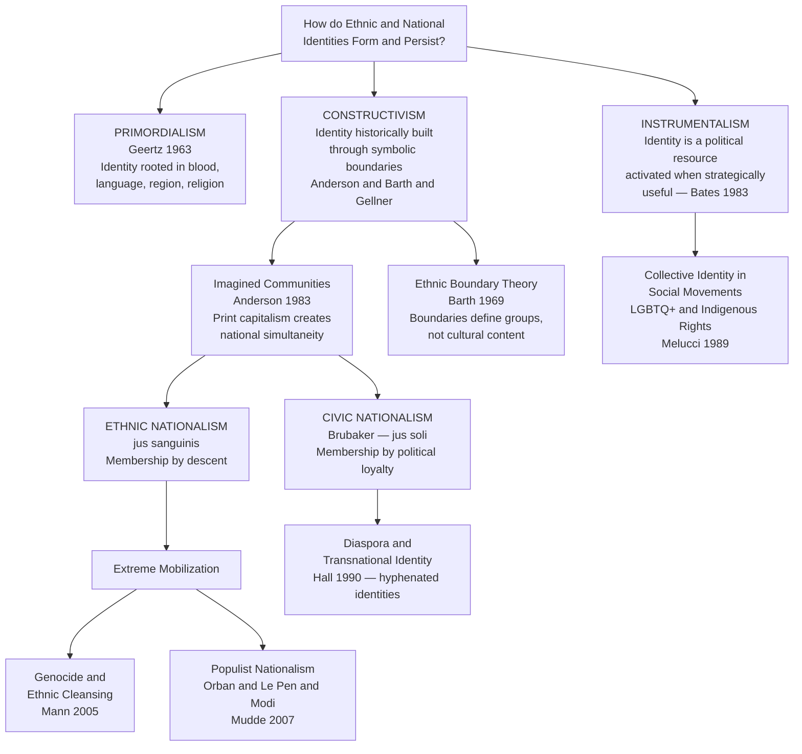

# Nationalism, Ethnicity, and Collective Identity

> [!abstract] TL;DR
> A nation is not a biological fact but an "imagined community" (Anderson 1983) — constructed through symbols, print media, and shared memory — and ethnicity is not a primordial essence but a system of socially maintained boundaries (Barth 1969); understanding how these identities are built, politically mobilized, and weaponized explains everything from immigration law to genocide to LGBTQ+ liberation.

---

## Intuition

**Analogy:** Pick up a football supporter's scarf from a charity shop. As an object it is a strip of machine-made cloth worth a few pounds. Put it on in the wrong stadium on match day and it carries the weight of decades of rivalry, shared defeats, celebrated victories, and group loyalties you never personally witnessed. It transforms you from a solitary individual into a *member* — simultaneously summoning an "us" and a "them."

Nations work exactly this way, scaled up to millions of strangers. The flag on the government building, the anthem before the match, the school curriculum, the newspaper that writes "we" when covering a sporting event you watched alone — all of these create the felt reality of a nation for people who will never meet most of their co-nationals. The nation is powerful not because it is ancient or biological, but because it is *performed daily*: its symbols feel natural precisely because they are unremarked, woven into the background of ordinary life. When political scientists want to understand why people die for flags, the sociological answer is always the same: the flag has been doing quiet, invisible work for generations before anyone is asked to die for it.

Ethnicity operates through the same mechanism, but at the level of cultural boundary-marking rather than state-formation. The key sociological insight — Barth's (1969) enduring contribution — is that ethnic groups are not defined by what is *inside* the group (its authentic customs, language, or genetics) but by the *boundary* between groups. Boundaries are maintained through signals, rituals, and markers of belonging that tell members and outsiders alike who is "us" and who is "them." Those boundaries shift, blend, and sometimes dissolve entirely — which is why ethnicity is a historical construction, not a natural kind.

---

## How It Works



---

## Key Concepts

### Secondary Level

**What is a nation?**

The commonsense assumption is that nations are ancient, natural, and bounded by shared blood or territory. Sociologists have dismantled this view systematically. Benedict Anderson (*Imagined Communities*, 1983) defined a nation as an **imagined political community** — imagined because its members will never know, meet, or even hear of most fellow-members, yet in each member's mind there lives the image of their communion.

Anderson identified three defining features of the nation as imagined:

- **Imagined as limited**: it has finite, if elastic, boundaries, beyond which lie other nations
- **Imagined as sovereign**: it claims self-determination, free from divine or dynastic hierarchy
- **Imagined as a community**: regardless of actual inequality, the nation is conceived as a deep, horizontal comradeship — brothers and sisters who share a fate

The mechanism Anderson identified is **print capitalism**: when commercial publishers began selling newspapers and novels in vernacular languages (rather than Latin), they created mass readerships who consumed the same content simultaneously. A reader in Caracas and a reader in Buenos Aires, each reading the same newspaper on the same morning, began to imagine themselves members of a single, simultaneous community — even though they never met. The novel's technique of narrating events unfolding "meanwhile" — in parallel across different locations — trained readers to imagine a shared national space. Nations, on this account, are cultural artifacts of the print era: if the printing press had never existed, the modern nation-state would not exist in its current form.

Ernest Gellner (*Nations and Nationalism*, 1983) approached the same phenomenon structurally. In agrarian societies, cultural diversity was tolerable because peasants and lords did not need to share a culture to function. Industrial societies require something different: workers must move across regions, read manuals, communicate with strangers, and be trained in standardized ways. This creates a structural demand for **homogeneous national cultures** delivered through mass education systems. Nationalism is not the awakening of ancient sleeping nations; it is the *product* of industrial modernity, manufactured to meet the coordination needs of mass society.

**What is ethnicity? The boundary-making approach.**

Ethnicity is commonly defined as a sense of group membership based on shared cultural heritage — language, religion, customs, history, and sometimes physical markers. The traditional **primordialist** view (Edward Shils 1957; Clifford Geertz 1963) holds that ethnic ties are experienced as "primordial givens": binding, non-negotiable, and attached to the most basic facts of social existence — family, language, religion, region — that precede any political identity. On this view, an ethnic group is simply what it has always been: an ancient community with shared blood, shared gods, and shared soil.

Fredrik Barth's *Ethnic Groups and Boundaries* (1969) challenged this fundamentally. Barth observed that ethnic groups can maintain distinct identities even when their cultural content changes substantially — and that where actual cultural practices are quite similar, ethnic boundaries can still be maintained sharply. His conclusion: **ethnic identity is defined by the boundary, not the content**. What matters is the distinction between "us" and "them," maintained through signals of group membership (dress, dialect, dietary rules, endogamy), regardless of how much actual cultural difference exists across the boundary.

This has radical implications. Ethnicity is not a natural fact but a social achievement — it requires continuous work to maintain. Boundaries emerge, shift, and dissolve in response to social circumstances. The same individual can activate a different ethnic identity in different contexts, foregrounding the identity that is strategically or emotionally salient in that situation.

**Civic versus ethnic nationalism.**

Rogers Brubaker's comparative work (*Citizenship and Nationhood in France and Germany*, 1992) identified two contrasting principles for determining national membership:

| Type | Principle | Legal form | Classic example |
|---|---|---|---|
| **Civic nationalism** | Membership defined by political loyalty and shared institutions | *Jus soli* — citizenship by birth on national territory | French republican tradition — universalist citizenship, assimilation ideal |
| **Ethnic nationalism** | Membership defined by descent and ancestral cultural belonging | *Jus sanguinis* — citizenship by blood, inherited across generations | German ethnic nation — ethnic Germans abroad could claim citizenship; Turkish guest workers of three generations could not |

Brubaker was careful to note that these are ideal types in the Weberian sense: no actual state is purely one or the other. Britain, France, and the United States all combine both principles in practice. But the dominant idiom shapes immigration policy, minority treatment, and public discourse profoundly. A civic nation says "become one of us"; an ethnic nation says "prove you are one of us — and some of you never can be."

---

### Undergraduate Level

**The three theoretical schools in depth.**

*Primordialism* (Geertz 1963; Van den Berghe 1981) argues that ethnic and national attachments have a quasi-natural quality: they are felt as "given" — binding, non-negotiable, and often more powerful than class interest or material calculation. Geertz called them "primordial attachments" rooted in "assumed givens" of social existence: blood, language, religion, custom, region. Pierre van den Berghe extended this toward sociobiology: ethnic solidarity is kin selection writ large, an evolutionary strategy for preferring genetic relatives extended to distant co-ethnics. The emotional depth of ethnic belonging — the willingness to die for one's group — is explained by its deep, pre-political, quasi-biological character.

*Constructivism* (Anderson 1983; Gellner 1983; Hobsbawm and Ranger 1983) insists that ethnic and national identities are historically produced, not biologically or primordially given. Eric Hobsbawm and Terence Ranger's *The Invention of Tradition* showed that many apparently ancient national traditions — Scottish Highland kilt culture, the ceremonial formality of the British monarchy, French Bastille Day — were invented or radically transformed in the 18th and 19th centuries to manufacture a sense of historical continuity that legitimized the new nation-state. Nations draw on material that may be older, but the political community that claims that material as its living foundation is distinctly modern.

*Instrumentalism* (Hechter 1975; Bates 1983) treats ethnicity as a political resource rather than an ancient bond. Ethnic identity is activated when it pays: when ethnic entrepreneurs can mobilize co-ethnics for political or economic advantage. Robert Bates' work on African ethnic politics showed that the ethnic categories colonial powers had hardened into administrative classifications were subsequently mobilized by post-independence politicians as coalition tools — not because people suddenly "rediscovered" their primordial identities but because ethnic group membership became a reliable predictor of access to state patronage and resources. Ethnicity is instrumentally useful in patronage-state contexts.

None of these accounts is sufficient alone. Primordialism explains emotional depth but cannot account for ethnogenesis or boundary change. Constructivism explains historical variability but can seem to deny the lived reality of ethnic belonging. Instrumentalism explains political mobilization but assumes rational calculation that is often absent in the most intense ethnic conflicts. Most contemporary scholars use a constructivist framework that takes primordial *feelings* seriously as social realities, even while explaining their historical construction. The feelings are real; the objects of those feelings are not natural kinds.

**Ethnogenesis, ethnic revival, and ethnosymbolism.**

**Ethnogenesis** — the historical emergence of a new ethnic identity — is the constructivist approach's strongest test case. Anthony Smith's *The Ethnic Origins of Nations* (1986) developed **ethnosymbolism** as a corrective to pure constructivism: nations are not invented from scratch but are built on pre-existing *ethnies* — ethnic communities with shared myths of common ancestry, historical memories, a distinctive shared culture, association with a specific territory, and a sense of solidarity. The nation must connect to these pre-existing symbols to generate the deep emotional resonance it requires; invented traditions that cannot attach to genuine cultural memories typically fail.

The "ethnic revival" of the 1970s and 1980s — Québécois separatism, Basque nationalism, Welsh and Scottish cultural nationalism, Catalan independence — appeared to falsify the modernization thesis that ethnic identities would fade as development proceeded. Walker Connor and Joshua Fishman documented ethnic assertiveness within supposedly assimilated modern states. Their finding: industrialization and mass education, far from absorbing minorities into uniform national cultures, often *intensified* peripheral nationalisms by giving minority communities the organizational and communicational resources to resist assimilation and articulate their own political demands.

**Diaspora identity and transnationalism.**

A diaspora is a community dispersed from an original homeland across multiple host countries. William Safran (1991) identified defining features: dispersal from a homeland, collective myths and memories of home, alienation or non-acceptance in the host society, a desire for eventual return or at least maintenance of the homeland connection, and continued relation to that homeland as a collective identity anchor.

Stuart Hall's influential essay "Cultural Identity and Diaspora" (1990) rejected the notion that diaspora identity is simply the preservation of an original culture transported elsewhere. Caribbean diaspora identity, Hall argued, is constitutively hybrid — produced at the intersection of African origins, European colonial experience, and New World cultural synthesis. It is not "roots" (a fixed origin to be returned to) but "routes": identity produced through historical trajectories, encounters, and transformations. There is no pure origin to recover; there is only the ongoing production of identity through representation and difference.

Arjun Appadurai's concept of **ethnoscapes** (*Modernity at Large*, 1996) captured how global migration creates deterritorialized ethnic communities — neither fully absorbed into the host nation nor simple reproductions of the homeland. **Transnationalism** names the condition of migrants who maintain sustained social, economic, and political ties across multiple national borders simultaneously: the Haitian-American who sends remittances, votes in Haitian elections, and participates in Brooklyn community politics all at once.

**Hyphenated identities** — Asian-American, British-Pakistani, Afro-German — signal this doubleness politically. They become contested precisely because they challenge the nation-state's demand for singular, undivided loyalty and make visible the constructed character of national identity by insisting that multiple identities can coexist without contradiction.

**Banal nationalism.**

Michael Billig (*Banal Nationalism*, 1995) made a distinction that is conceptually simple but analytically transformative:

- **Hot nationalism**: flags waved at nationalist rallies, xenophobic speeches, ethnic violence, street marches. This is what most people think of when they hear "nationalism."
- **Banal nationalism**: the unremarked, everyday symbols that reproduce national identity in stable, established democracies. The national flag on the government building that no one notices. The weather forecast that shows "our" territory as a natural given. The newspaper that writes "we" when discussing "our" national football team. The sports commentary that says the national team "fell apart" — as if the nation itself had suffered a personal failure.

Billig's argument is that banal nationalism matters more than hot nationalism for explaining how national identity persists. Hot nationalism erupts periodically; banal nationalism reproduces quietly every day. When hot nationalism does erupt, it finds an already-prepared audience whose national identity has been quietly maintained by decades of unremarked symbolic work. Analyzing nationalism only when it is violent is like studying fire only when it destroys a building, ignoring the years of invisible heat that made combustion possible.

---

### Graduate Level

**Chatterjee's postcolonial critique of Anderson.**

Partha Chatterjee's *The Nation and Its Fragments* (1993) launched the most sustained postcolonial challenge to Anderson's framework. Anderson had argued that nationalist ideas were invented in the Americas and Europe and that anti-colonial nationalists subsequently adopted this "modular" form. Chatterjee's response was pointed: if the imagination of the nation is already given by Western modular forms, what exactly is left for colonized peoples to imagine? Are they merely passive consumers of a European cultural product, with no independent history of political imagination?

Chatterjee argued that anti-colonial nationalism operated through a constitutive **inner/outer division**:

- **Outer domain** (material: economy, technology, state administration): here colonial elites accepted Western modernity's technical superiority and sought to replicate it, learning science, law, and industrial organization from the colonizer
- **Inner domain** (spiritual: culture, language, religion, family life, domestic space): here the colonized *refused* Western intrusion, claiming sovereignty over their own cultural essence as the foundation of a distinctiveness that could not be colonized

This bifurcation — "we will modernize the economy but protect our soul" — produces a nationalism constitutively different from Anderson's account predicts. Indian nationalism was constituted in the spiritual domain — in the politics of domestic life, women's roles, Bengali language, religious practice — *before* it reached formal political independence. The anti-colonial is already present in the cultural politics of the inner domain, and this means postcolonial nationalism cannot be derived from any Western modular form. Chatterjee's critique has been absorbed into postcolonial studies but also challenged: critics argue his inner/outer framework itself risks reifying an "authentic" Indian cultural essence, reproducing the essentialism it claims to resist.

**The political sociology of genocide.**

Gregory Stanton's **Genocide Watch** model (1998, revised 2016) identifies ten stages through which societies escalate toward mass killing:

| Stage | Description | Example |
|---|---|---|
| 1. Classification | Society divided into "us" and "them" | Belgian colonial administration's Hutu/Tutsi ID cards |
| 2. Symbolization | Names and symbols mark group membership | Yellow star for Jews in Nazi Germany |
| 3. Discrimination | Dominant group strips minority of rights | Nuremberg Laws 1935 |
| 4. Dehumanization | Out-group described as subhuman | "Inyenzi" (cockroaches) broadcast by Hutu Power Radio |
| 5. Organization | Genocidal killing organized and armed | Interahamwe militias equipped in Rwanda 1993–94 |
| 6. Polarization | Extremists drive out moderates | Assassination of Tutsi political moderates before April 1994 |
| 7. Preparation | Target lists compiled; victims isolated | Deportation logistics in the Holocaust |
| 8. Persecution | Victims identified, separated, property seized | Ghettoization; internal displacement |
| 9. Extermination | Mass killing begins — "not murder in the perpetrators' eyes" | 100 days in Rwanda; the Final Solution |
| 10. Denial | Perpetrators cover evidence; rewrite history | Turkish denial of the Armenian genocide |

Michael Mann's *The Dark Side of Democracy* (2005) offered a structural explanation for why genocide occurs. The worst ethnic cleansing of the 20th century was committed not by traditional tyrants but **in the name of democracy and the people**. The democratic principle — that "the people" should rule — becomes explosive when "the people" is defined ethnically: it implies that *the others* on the same territory are not "the people" and therefore have no legitimate political claim. They are not just a minority; they are a contamination of the nation. Mann's thesis: ethnic democracy is structurally prone to ethnic cleansing, not despite democracy's emancipatory promise but because of it. He documented that most 20th-century genocides occurred in democratizing states attempting to construct ethnic democracies, not in purely authoritarian ones. Rwanda 1994 confirms the pattern: Hutu Power framed its genocide as the democratic right of the Hutu majority to govern their own country, free from "Tutsi infiltrators."

**Collective identity in new social movements.**

Alberto Melucci (*Nomads of the Present*, 1989) developed the canonical sociological account of how social movements construct collective identity. For Melucci, collective identity is not a pre-given essence that movements express but an **interactive and shared definition** that movements produce through negotiation, ritual, conflict, and continuous renegotiation among participants. A movement becomes real — becomes a social force — when its participants share a working definition of themselves as a "we," a definition of their opponents as a "them," and a shared understanding of the stakes of the struggle.

This framework distinguishes **new social movements** — LGBTQ+ rights, feminist, indigenous rights, environmental — from old labor movements. New social movements fight primarily for **recognition** (the right of a form of life to exist and be validated by society and law) rather than redistribution (material resources). Their collective identity claims are therefore constitutively cultural and performative, not merely strategic.

The LGBTQ+ movement illustrates the historical evolution of collective identity across three frames. The **Stonewall Uprising** (1969) generated a *gay liberation* frame rooted in visibility, pride, and refusal of medical pathologization — the demand to exist publicly without shame. Judith Butler's *Gender Trouble* (1990) radicalized this through **queer theory**: gender and sexuality are not natural binaries but performative repetitions — identities constituted through acts that "cite" prior norms and could, in principle, cite them differently. The AIDS crisis transformed visibility politics into a politics of survival and legislative urgency (ACT UP: "Silence = Death"). Marriage equality politics represented a third frame — assimilationist in form, claiming the right to participate in mainstream institutions on equal terms. Three distinct collective identities, all called "LGBTQ+ politics," generated three distinct programs of political demands. The ongoing tension between "queer" (anti-assimilationist, radical) and "LGBT+" (mainstream rights-seeking) wings of the movement is precisely a dispute about which collective identity frame should organize political action — an internal politics of definition that Melucci's framework predicts.

**New nationalism, the demand side, and majority status threat.**

Cas Mudde's *The Populist Radical Right in Western Europe* (2007) identified three core features of contemporary far-right parties: **nativism** (the belief that states should be inhabited exclusively by members of the native group, and that non-native elements are a fundamental threat to the homogeneous nation-state), **authoritarianism** (preference for strict social order and punishment of deviants), and **populism** (the Manichean division of society into a virtuous people versus a corrupt elite). Nativism is the defining feature: it fuses ethnic nationalism with xenophobia into a coherent political program that is neither simply racism nor simply nationalism alone.

Roger Eatwell and Matthew Goodwin (*National Populism*, 2018) challenged the supply-side account that attributes the rise of national populism purely to elite manipulation and media amplification. They argue for a **demand-side** explanation built on four "Ds": political *distrust* (of established parties and institutions), felt *destruction* of cultural norms and community life, *relative deprivation* (not absolute poverty but the perception that "people like us" are losing status and recognition), and *de-alignment* from mainstream parties. On this account, national populism is a rational political response to real social dislocations — not a cognitive pathology to be corrected by better education.

The demand-side explanation is contested. Mudde and others argue it understates how elite actors *activate* and *intensify* ethnic anxieties rather than merely responding to them — the supply creates demand as much as the reverse. Eric Kaufmann's *Whiteshift* (2019) locates the anxiety more specifically in **majority ethnic status threat**: aging white majorities in Western democracies feel their cultural dominance eroding through immigration and demographic change, and national populism is their political expression. This reframing is politically controversial: it partially legitimizes the anxieties it explains, and critics argue it conflates descriptive analysis with normative endorsement. The analytical debate remains unresolved, but it shapes everything from academic research design to policy responses to nationalist resurgence.

---

## Python Demo

```python
import numpy as np
import matplotlib.pyplot as plt

# --- Ethnic Boundary Maintenance: Social Network Model ---
# N agents belong to one of G ethnic groups of equal size.
# Each agent maintains K friendship slots.
# Every time step: each agent replaces one randomly chosen slot.
#   With probability `bias`   -> picks a new friend from OWN group only
#   With probability `1-bias` -> picks from ALL other agents at random
#
# Homophily Index = fraction of all friendship ties connecting same-group agents.
# Under random mixing, expected homophily = 1/G = 0.333 (three equal groups).
#
# Barth's insight: ethnic identity is maintained through boundary-marking,
# not primordial content. This model shows how even moderate in-group
# preference rapidly drives homophily well above the random baseline --
# the self-reinforcing dynamic that sustains ethnic boundaries without
# any top-down enforcement.

N       = 240    # agents (80 per group)
K       = 6      # friendship slots per agent
G       = 3      # ethnic groups
T       = 70     # time steps
BIASES  = [0.0, 0.25, 0.50, 0.75, 1.0]
PALETTE = ["#2563eb", "#16a34a", "#f59e0b", "#ef4444", "#7c3aed"]

labels = np.repeat(np.arange(G), N // G)        # [0,0,...,1,1,...,2,2,...]
group_fracs    = np.bincount(labels) / N
null_homophily = float(np.sum(group_fracs ** 2)) # = 1/3 ~= 0.333

# Pre-compute interaction pools (computed once, reused every step)
in_group_pools  = []
all_other_pools = []
for i in range(N):
    in_grp  = np.where(labels == labels[i])[0]
    in_grp  = in_grp[in_grp != i]                         # exclude self
    all_oth = np.concatenate([np.arange(i), np.arange(i + 1, N)])
    in_group_pools.append(in_grp)
    all_other_pools.append(all_oth)


def compute_homophily(friends):
    """Fraction of friendship ties where both agents share an ethnic group."""
    own_labels    = labels[:, np.newaxis]   # (N, 1) -- broadcasts over K
    friend_labels = labels[friends]          # (N, K)
    return float(np.mean(own_labels == friend_labels))


def run_simulation(bias, T, K, seed=42):
    rng = np.random.default_rng(seed)

    # Initialise random friendship network (no self-loops)
    friends = np.zeros((N, K), dtype=int)
    for i in range(N):
        friends[i] = rng.choice(all_other_pools[i], size=K, replace=False)

    trace = [compute_homophily(friends)]

    for _ in range(T):
        slots    = rng.integers(0, K, size=N)   # which slot each agent updates
        use_bias = rng.random(N) < bias          # biased vs. random selection

        for i in range(N):
            pool = in_group_pools[i] if use_bias[i] else all_other_pools[i]
            friends[i, slots[i]] = rng.choice(pool)

        trace.append(compute_homophily(friends))

    return trace


# Run all bias levels
results = {b: run_simulation(b, T, K, seed=42) for b in BIASES}

# --- Plot ---
fig, (ax1, ax2) = plt.subplots(1, 2, figsize=(13, 5.5))

# Panel 1: Homophily trajectory over time
for (bias, trace), col in zip(results.items(), PALETTE):
    ax1.plot(trace, color=col, lw=2.2, label=f"In-group bias = {bias:.0%}")
ax1.axhline(null_homophily, color="#6b7280", ls="--", lw=1.5,
            label=f"Random baseline ({null_homophily:.2f})")
ax1.set_xlabel("Time Step", fontsize=11)
ax1.set_ylabel("Homophily Index\n(fraction of in-group friendships)", fontsize=10)
ax1.set_title("Ethnic Boundary Maintenance:\nSmall Preferences Drive Large Segregation",
              fontsize=11, fontweight="bold")
ax1.legend(fontsize=8.5)
ax1.set_ylim(0.0, 1.02)
ax1.grid(True, alpha=0.22)

# Panel 2: Final equilibrium homophily vs. bias level
finals = [results[b][-1] for b in BIASES]
bars = ax2.bar(
    [f"{b:.0%}" for b in BIASES], finals,
    color=PALETTE, edgecolor="white", linewidth=1.5
)
ax2.axhline(null_homophily, color="#6b7280", ls="--", lw=1.5,
            label=f"Random baseline ({null_homophily:.2f})")
for bar, val in zip(bars, finals):
    ax2.text(
        bar.get_x() + bar.get_width() / 2,
        val + 0.014,
        f"{val:.2f}\n({val / null_homophily:.1f}x)",
        ha="center", va="bottom", fontsize=8.5
    )
ax2.set_xlabel("In-Group Bias Level", fontsize=11)
ax2.set_ylabel("Equilibrium Homophily Index", fontsize=11)
ax2.set_title("Barth's Insight Quantified:\nEquilibrium Segregation by Bias Level",
              fontsize=11, fontweight="bold")
ax2.legend(fontsize=9)
ax2.set_ylim(0.0, 1.15)

plt.tight_layout()
plt.savefig("ethnic_boundary_maintenance.png", dpi=150)
plt.show()

# Summary statistics
print(f"Null baseline (G={G} equal groups): {null_homophily:.3f}")
print(f"\n{'Bias':<8} {'Final Homophily':>16} {'Ratio to Baseline':>18}")
print("-" * 44)
for bias, final in zip(BIASES, finals):
    print(f"{bias:.0%:<8} {final:>16.3f} {final / null_homophily:>17.1f}x")
```

---

## Real-World Applications

> **Rwanda 1994 — Colonial ethnic classification becomes genocidal infrastructure**: The Hutu/Tutsi distinction was not a fixed ancient division but a fluid social status in pre-colonial Rwanda — wealthier families could transition from Hutu to Tutsi status over generations. Belgian colonial administrators hardened this status gradation into a racial classification system in the 1930s, issuing ethnic identity cards and associating Tutsi status with a fabricated "Hamitic" racial origin (closer to European). This colonial reification of ethnic difference created the administrative infrastructure for genocide. In 1994, Hutu Power radio ("Radio Milles Collines") broadcast lists of Tutsi targets — "inyenzi" (cockroaches) and "inyambo" (snakes) to be exterminated. The Interahamwe militias used the Belgian-designed ID card system to sort and kill at roadblocks. Approximately 500,000 to 800,000 Tutsi and moderate Hutu were killed in 100 days. Mann's thesis is confirmed: the genocide was committed in the name of Hutu democratic majority rights, framing Tutsi not as a genuine co-national minority but as a foreign infiltrating power with no legitimate claim on the Rwandan nation-state.

> **Brexit 2016 — Civic and ethnic nationalism in collision**: British national identity has historically been constructed around a civic ideal (parliamentary sovereignty, common law, rule of law) with a persistent ethnic undercurrent (Anglo-Protestant cultural assumptions, imperial nostalgia). Brexit exposed the tension structurally. "Take Back Control" — the Leave campaign's slogan — operated simultaneously as civic nationalism (restore parliamentary sovereignty from unelected EU technocracy) and ethnic nationalism (restore cultural homogeneity threatened by EU freedom of movement). Survey evidence consistently showed that the strongest predictors of Leave voting were not economic deprivation measures but cultural variables — attachment to British national identity, concern about immigration, and a sense that the country was changing too fast culturally. Brubaker's civic/ethnic typology maps directly onto the internal division: the official Leave rhetoric was civic (sovereignty); the emotional substrate was ethnic (cultural belonging and demographic anxiety).

> **India and Hindutva — Ethnic nationalism institutionalized in law**: Hindutva ("Hindu-ness") as a political ideology was theorized by V.D. Savarkar in 1923 and institutionalized through the RSS (founded 1925). Savarkar's definition was explicitly ethnic-territorial: a Hindu is one for whom India is both "Fatherland" and "Holy Land" — a definition that excludes Muslims and Christians, whose holy lands lie in Arabia and Palestine, from full national membership. Under Narendra Modi's BJP government (2014–present), Hindutva moved from fringe ideology to governing mainstream. The 2019 Citizenship Amendment Act — granting fast-track citizenship to refugees from Afghanistan, Bangladesh, and Pakistan from all religions *except* Islam — institutionalized ethnic nationalism in law, making religious identity rather than political loyalty the basis for citizenship. Critics argue this violates the secular civic nationalism of the 1950 Indian Constitution; proponents argue India is the natural homeland of a Hindu civilization that must protect religious minorities persecuted in Islamic states. The dispute is precisely Brubaker's civic/ethnic tension played out in constitutional form.

> **LGBTQ+ movement — Three collective identity frames in sequence**: The LGBTQ+ movement illustrates Melucci's theory that collective identity is not a given to be expressed but a political achievement to be constructed and contested. The 1969 Stonewall uprising generated a *liberation* frame: gay identity as pride, visibility, and refusal of psychiatric classification as disorder. The AIDS crisis of the 1980s and 1990s transformed this into a *survival* frame: ACT UP's confrontational politics ("Silence = Death") demanded government response to a disease killing tens of thousands, constructing collective identity around political urgency and literal biological survival. The marriage equality campaign of the 1990s–2010s operated through an *assimilation* frame: LGBTQ+ couples claiming the right to participate in mainstream institutions on equal terms. Three distinct collective identities, all operating under the LGBTQ+ umbrella, produced three distinct programs of political demands and three distinct visions of what "liberation" means. The ongoing tension between queer (anti-assimilationist) and mainstream LGBT+ (rights-within-existing-institutions) wings of the movement is a live dispute about which collective identity frame should organize political action — the internal politics of collective identity definition that Melucci's framework identifies as constitutive of social movements themselves.

---

## Common Pitfalls

- **Treating nations as natural and ancient** — the "ancient hatreds" narrative (e.g., "Serbs and Croats have always hated each other") naturalizes historically constructed identities and implies conflicts are inevitable rather than politically produced and therefore politically resolvable. Hobsbawm's invention of tradition and Anderson's imagined communities both demonstrate that "ancient" national traditions are typically 19th-century constructions attached to genuine but reinterpreted historical materials.

- **Conflating ethnicity with race** — ethnicity is primarily a cultural and social category (shared language, religion, history, customs); race is primarily a category based on ascribed physical appearance. The two overlap frequently but are analytically distinct. In the United States, "Hispanic/Latino" is an ethnic category (not a racial one) that includes people of every racial background. The analytical confusion between race and ethnicity leads to misdiagnosis: anti-Latino prejudice often targets cultural practices and language (ethnic discrimination) as much as physical appearance (racial discrimination), but a race-only framework is blind to the ethnic dimension.

- **The primordial fallacy in conflict resolution** — treating ethnic or religious identities as fixed, natural, and non-negotiable forecloses political solutions that depend on renegotiating boundaries and salience. If Tutsi/Hutu or Serb/Croat hostility is assumed to be primordial, the only available policy is permanent territorial separation. Constructivist analysis opens the possibility of interventions that change which identities are activated, how salient they are, and what their political content is — as reconciliation processes in Rwanda, South Africa, and Northern Ireland have attempted, with partial success.

- **Instrumentalism's rational-actor assumption** — the instrumentalist account explains political elite behavior well but fails to explain why ordinary people are sometimes willing to die for ethnic solidarity even when it brings them no material benefit. Ethnic mobilization in violent conflicts routinely recruits people who gain nothing materially. The emotional depth of ethnic belonging — which primordialists rightly take seriously — is not explained by strategic calculation. A model of ethnic politics that cannot explain ethnic martyrdom is missing something central.

- **Conflating civic nationalism with cosmopolitan liberalism** — civic nationalism is still nationalism: it posits a bounded "we" with membership criteria, asserts sovereignty over immigration, and requires some minimum cultural integration from newcomers. Civic nations exclude differently from ethnic nations, but they still exclude. The idealization of civic nationalism as a clean solution to ethnic nationalism underestimates how civic nations police cultural belonging — often demanding assimilation to a cultural baseline that is anything but neutral — beneath the universalist surface.

- **Ignoring banal nationalism in liberal democracies** — focusing analytical attention exclusively on far-right parties and ethnic violence misses how national identity is quietly reproduced in ordinary liberal democracies every day. The unremarked flag, the unquestioned "we" in national media, the naturalized national territory in weather maps — this daily reproduction is what makes hot nationalism possible when it erupts. Research designs that study nationalism only when it is violent systematically undercount the phenomenon.

---

## Related Concepts

- [[_MOC_Culture_Identity_and_Socialization|↑ Culture, Identity & Socialization MOC]] — Section entry point and concept map
- [[Contemporary_Political_Ideologies]] — civic and ethnic nationalism, populism, and fascism are analyzed in depth there; Anderson and Gellner's constructivist accounts appear directly in the nationalism subsection; Brubaker's civic/ethnic typology maps onto the ideological positions mapped on the political compass
- [[Democratic_Backsliding_and_Polarization]] — populist nationalism is the primary ideological vehicle for contemporary democratic erosion; ethnic nationalism provides the "pure people" in whose name elected autocrats dismantle liberal institutions and delegitimize minority political participation
- [[Prejudice_and_Discrimination]] — Social Identity Theory (Tajfel and Turner) is the psychological micro-foundation of ethnic in-group favoritism and out-group hostility; stereotype threat, implicit bias, and dehumanization are the cognitive mechanisms through which ethnic boundary maintenance produces individual and institutional discrimination
- [[Group_Dynamics]] — in-group favoritism, out-group homogeneity effect, and group polarization are the psychological processes underlying ethnic boundary maintenance; the Python simulation above directly models how individual-level in-group preference aggregates to population-level segregation without any collective coordination
- [[State_Formation_and_Political_Development]] — Tilly's "war makes states" thesis intersects with nationalism directly: states need nations to tax and conscript; nations need states to protect, educate, and administer; the nation-state as the unit of the modern international system is a historical achievement, not a natural given, and the processes of state-building and nation-building are mutually constitutive
- [[Human_Rights_and_International_Law]] — genocide law, the 1948 Genocide Convention, and the Responsibility to Protect (R2P, 2005) are direct institutional responses to ethnic nationalist violence; minority rights protections in international law attempt to constrain the exclusionary logic of ethnic nationalism while respecting state sovereignty
- [[Religion_Sacred_and_Secular]] — Durkheim's concept of civil religion (elaborated by Robert Bellah 1967) explains how national symbols and rituals function as a secular analog of religion, generating the collective effervescence and solidarity that sustains national belonging; religious nationalism (Hindutva, political Islam, Christian nationalism) represents the most explosive fusion of ethnic and religious collective identity
- [[Globalization_and_Its_Discontents]] — the post-1989 acceleration of globalization produced the cultural anxieties and economic disruptions that drive contemporary national populism; Rodrik's "political trilemma" frames the fundamental structural tension: deep economic integration, national democratic self-determination, and national sovereignty cannot all be maximized simultaneously — and nationalist backlash is what happens when democratic publics feel the trade-off has been made against them without their consent

---

## Review Questions

### Secondary

1. Benedict Anderson says a nation is an "imagined community." Does "imagined" mean "fake" or "invented"? Explain carefully what he means, and use the example of a newspaper or social media platform to illustrate how shared media consumption can make strangers feel like members of the same community.
2. What is the difference between civic nationalism and ethnic nationalism? Describe one specific immigration or citizenship policy where the two approaches would reach different conclusions, and explain why.
3. Fredrik Barth argues that what defines an ethnic group is its *boundary*, not its cultural *content*. What does this mean, and why does it imply that ethnic identities can change over time rather than being fixed by blood or ancestry?

### Undergraduate

1. Compare the primordialist, constructivist, and instrumentalist accounts of ethnic identity. What does each approach explain well, and where does each break down? Apply all three to a single historical case — choose one: Armenian identity in Turkey 1915; Quebec nationalism 1960–1980; Rwandan ethnic politics 1990–1994 — and evaluate which approach best explains the evidence and why.
2. Michael Billig distinguishes "hot nationalism" from "banal nationalism." Why is banal nationalism analytically important if it produces no violence and generates little controversy? In a country currently experiencing a nationalist resurgence (choose one: Hungary, India, France, or the United States), identify three specific examples of banal nationalism operating in everyday life, and explain how they may have prepared the cultural ground for the hot nationalist moment.
3. Stuart Hall argues that diaspora identity is not "roots" (a fixed origin to return to) but "routes" (produced through historical trajectories and transformations). Critically evaluate this claim using one specific diaspora community — Jewish, Caribbean, Chinese, or South Asian — and address both what the "routes" framing illuminates and what it risks understating about the political and emotional claims that diaspora communities make on homelands and host states.

### Graduate

1. Partha Chatterjee argues that Anderson's "modular" account of nationalism is Eurocentric because it denies colonized peoples independent political imagination. Does Chatterjee's inner/outer domain framework adequately address this critique, or does it itself reproduce a cultural essentialism — positing an authentic spiritual "inner domain" that must be protected from Western contamination? Use the Indian national movement and at least one other postcolonial case to evaluate the scope and limits of Chatterjee's framework.
2. Michael Mann argues that ethnic cleansing and genocide are the "dark side of democracy" — products of democratizing states that define "the people" ethnically. Critically assess this thesis. Does it imply that democracy is inherently prone to ethnic violence, or does it identify a specific configuration — ethnic democracy in a context of competitive state-building and territorial uncertainty — that can be distinguished from consolidated pluralist democracy? Use two historical cases to evaluate the scope and limits of Mann's causal claim, and address one major rival explanation for the same cases.
3. The demand-side account of national populism (Eatwell and Goodwin) attributes its rise to real social dislocations — distrust, cultural destruction, relative deprivation, de-alignment — rather than supply-side elite manipulation or mass irrationality. Critically evaluate whether this account: (a) provides an empirically adequate causal explanation of cross-national variation in national populist success; (b) carries normative implications about whether national populist demands are legitimate political claims deserving democratic response; and (c) forecloses or opens constructive institutional responses to the nationalist resurgence without either dismissing popular anxieties or validating ethnic exclusion.

---

## Sources

- [Anderson, B. (1983). *Imagined Communities* — overview at Britannica](https://www.britannica.com/topic/Imagined-Communities-Reflections-on-the-Origins-and-Spread-of-Nationalism)
- [Barth, F. (ed.) (1969). *Ethnic Groups and Boundaries* — Waveland Press overview](https://www.waveland.com/browse.php?t=130)
- [Brubaker, R. (1992). *Citizenship and Nationhood in France and Germany* — Harvard University Press](https://www.hup.harvard.edu/books/9780674131620)
- [Billig, M. (1995). *Banal Nationalism* — SAGE Publications overview](https://uk.sagepub.com/en-gb/eur/banal-nationalism/book202939)
- [Mann, M. (2005). *The Dark Side of Democracy: Explaining Ethnic Cleansing* — Cambridge University Press](https://www.cambridge.org/core/books/dark-side-of-democracy/5E9E0A7B77EA5CF6E6EA6AA3A6ED7D6D)
- [Mudde, C. (2007). *Populist Radical Right Parties in Europe* — Cambridge University Press](https://www.cambridge.org/core/books/populist-radical-right-parties-in-europe/7B8CD33DB86BCFB1B3C5D0DCCD1CA54B)
- [Stanton, G. (2016). "Ten Stages of Genocide" — Genocide Watch](https://www.genocidewatch.com/tenstages)
- [Hall, S. (1990). "Cultural Identity and Diaspora" — PDF via Middlebury](https://sites.middlebury.edu/nydiasporaworkshop/files/2011/04/D-OA-HallStuart-CulturalIdentityandDiaspora.pdf)
- [Melucci, A. (1989). *Nomads of the Present* — overview](https://www.tandfonline.com/doi/abs/10.1080/00380237.1991.9570595)
- [Eatwell, R. and Goodwin, M. (2018). *National Populism* — review at The Guardian](https://www.theguardian.com/books/2018/oct/27/national-populism-revolt-against-liberal-democracy-roger-eatwell-matthew-goodwin-review)

---

#Sociology #Culture #Nationalism #Ethnicity #CollectiveIdentity
