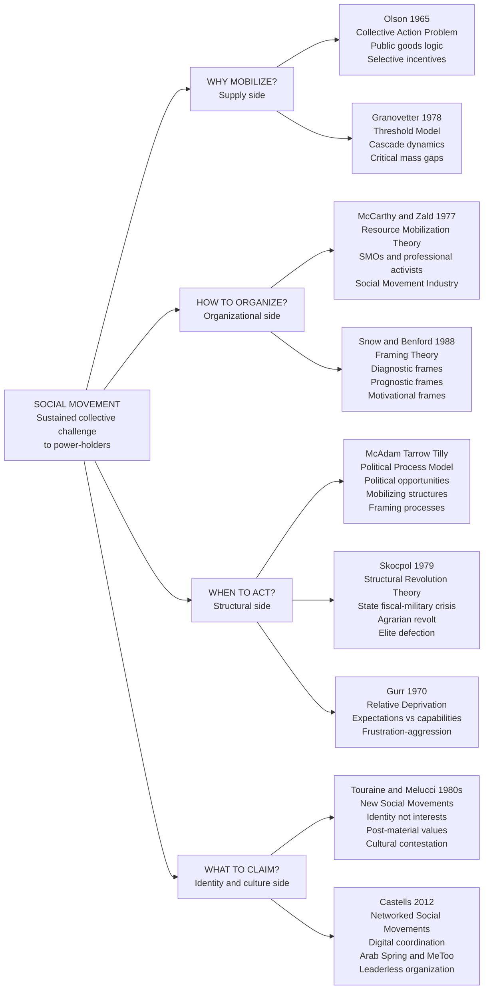

# Social Movements and Revolution

> [!abstract] TL;DR
> Social movements are sustained collective challenges to existing social arrangements; revolutions are the most transformative episodes, involving fundamental transfers of state power. Four theoretical traditions explain them: the collective action tradition (why individuals participate despite free-rider incentives), resource mobilization theory (how organizations convert grievances into campaigns), the political process model (when structural conditions open windows of opportunity), and new social movements theory (what identity-based, post-material claims mean for collective contention). Revolutions additionally require state structural crisis — mobilized grievances alone are insufficient.

---

## Intuition

**Analogy:** Imagine a crowd standing in an open square. A few people at the front begin to chant. Each bystander watches: "How many others are chanting before I risk joining in?" Some have a low threshold — they join the moment two others start. Others need to see fifty people before they'll move. Some would only join if virtually everyone already had. The crowd either erupts into a full collective action or stays awkwardly silent — and this depends not on whether grievances exist (everyone can feel the heat) but on the precise *distribution* of individual thresholds. One missing "linker" — a single person who would have joined at threshold 10, triggering those who need 11 — and the cascade stalls forever at nine.

This is social movement theory in miniature. Grievances are almost always present. What varies is the organizational infrastructure to harness them, the structural conditions that make action less costly, the interpretive frameworks that make action feel meaningful — and the cascading threshold dynamics that determine whether a spark becomes a wildfire or dies in the tinder.

---

## How It Works

### Core Mechanics

Social movement theory is organized around four interlocking questions:

1. **Why mobilize despite free-riding?** Mancur Olson (1965) identified the central paradox: social movements pursue *public goods* (civil rights, environmental protection, policy change) that benefit participants and non-participants equally. Rational individuals will free-ride — benefit without contributing — so large, latent groups systematically under-mobilize relative to their numbers and grievances. The solutions are: selective incentives (private benefits available only to participants — solidarity, status, identity affirmation), organizational subsidies that lower individual costs, or structural conditions that raise the cost of *not* joining.

2. **How do organizations convert grievances into campaigns?** McCarthy and Zald (1977) showed that grievances are relatively constant in societies; what varies is the *organizational infrastructure* to act on them. Social Movement Organizations (SMOs) — NAACP, Amnesty International, NOW — are the "firms" of the social movement industry. They deploy resources (money, lawyers, media access, professional staff) to overcome Olson's problem and sustain contention over time.

3. **When do structural conditions permit action?** The Political Process Model (McAdam, Tarrow, Tilly) identifies three jointly necessary elements: (a) *political opportunities* — shifts in institutional context, elite divisions, openness of the political system, presence of influential allies; (b) *mobilizing structures* — pre-existing organizational networks (churches, unions, neighborhood associations) that provide the infrastructure for rapid mobilization; (c) *framing processes* — the shared interpretive work that makes injustice visible, remedy imaginable, and action worthwhile. All three must align for sustained contention.

4. **What does the movement claim to be?** New Social Movements theory (Touraine, Melucci, 1980s) argued that post-industrial societies produce movements organized around *identity* rather than material interests. Feminist, LGBTQ+, environmental, and peace movements contest not just policy but the cultural codes and definitions of personhood that structure social life. The question shifts from "what resources do we need?" to "who are we, and who gets to define that?"

**Revolution** requires an additional structural dimension. Skocpol (1979) in *States and Social Revolutions* demonstrated that great revolutions (France 1789, Russia 1917, China 1949) were not made by ideologically driven vanguards — they occurred when state fiscal and military crises made old regimes unable to cope with international pressures, *combined with* agrarian class conflicts that activated peasant revolts. State collapse is the permissive cause; mobilization is the proximate cause. Neither alone is sufficient.

### Flow / Architecture



---

## Key Concepts

### Secondary Level

**What is a social movement?**

A social movement is a sustained, organized collective effort by people who share common purposes to challenge or defend existing social arrangements — typically by making claims on power-holders. It is distinguished from a riot (episodic, unorganized), a political party (works through established institutions), and a single protest event (a tactic, not a movement). Tarrow's definition captures the essentials: *sustained collective challenges, based on common purposes and social solidarities, in sustained interaction with elites, opponents, and authorities*.

**The basic puzzle:**

Most people who want social change do not join social movements. Millions of Americans wanted an end to the Vietnam War; only a fraction ever marched. Billions of people suffer from climate change; environmental movements remain a minority. This is not apathy or ignorance — it is a rational response to the free-rider problem. If the movement succeeds, everyone benefits regardless of whether they contributed. If it fails, they suffered the personal costs of participation for nothing. The rational choice is to let others take the risk and enjoy the benefits either way.

**Key terms:**

| Term | Definition |
|------|------------|
| Social movement | Sustained, organized collective challenge to power-holders with shared purposes |
| SMO | A formal organization that identifies with a movement's goals and attempts to implement them |
| Social movement industry | The set of all SMOs pursuing the same broad change |
| Political opportunity structure | External political conditions — elite divisions, regime openness, electoral cycles — that affect the cost of collective action |
| Frame | An interpretive schema that simplifies and condenses reality to mobilize participants and bystanders |
| Relative deprivation | The perceived gap between what people expect and what they actually receive |
| Revolution | A rapid, fundamental transformation of a society's state, class, and ideological structures |

**Classic examples at a glance:**

- **U.S. Civil Rights Movement (1954–1968)**: NAACP and SCLC as SMOs; Black churches as mobilizing structures; "We Shall Overcome" as a motivational frame; Brown v. Board as a political opportunity that made the stakes visible
- **Suffragette movement (1848–1920)**: Seneca Falls Convention as diagnostic frame; state-level voting rights victories as incremental political opportunities; hunger strikes as tactical escalation
- **Labor movement (1880s–1930s)**: AFL-CIO as SMO; strikes and collective bargaining as disruptive tactics; Wagner Act (1935) as institutionalization of movement demands

---

### Undergraduate Level

#### Olson's Collective Action Problem and Selective Incentives

Mancur Olson's *The Logic of Collective Action* (1965) is the most important single theoretical contribution to social movement theory. The argument proceeds in three steps:

1. Social movements pursue public goods — benefits that, once produced, are non-excludable (you can't stop non-participants from enjoying them) and non-rival (one person's enjoyment doesn't reduce another's).
2. Because non-participants enjoy the same benefits as participants, the individually rational strategy is to free-ride.
3. Therefore, large groups will *systematically* under-provide collective goods relative to their size and intensity of preference. Small groups (where each member's contribution is visible and crucial) organize more easily than large ones.

The implication is devastating for naive theories of social movements: the fact that millions of people share a grievance does not explain why a movement forms, because each individual has an incentive to let others carry the cost.

**Selective incentives** are Olson's solution: private benefits available *only* to participants. These come in two forms:
- *Positive selective incentives*: newsletters, legal services, solidarity, social identity, career advancement — the private benefits of membership that make participation individually worthwhile independent of collective success
- *Negative selective incentives*: social sanctions (peer pressure, ostracism) imposed on free-riders that raise the cost of non-participation

This reframes the sociological question: instead of asking "why do people join movements?", ask "what organizational infrastructure provides sufficient selective incentives to overcome the free-rider problem?"

#### Resource Mobilization Theory

McCarthy and Zald (1977) redirected the focus entirely away from grievances and toward *organizational resources*. Their key claims:

- **Grievances are constant**: at any given time, enough people have sufficient grievances to sustain almost any imaginable social movement. Grievances cannot explain variation in movement emergence or success.
- **What varies is resources**: money, professional staff, communication networks, legal support, credibility, access to media. Movements succeed when they can mobilize these resources, fail when they cannot.
- **Professionalization of movements**: Modern social movements are increasingly run by professional activists rather than directly aggrieved constituents. MADD (Mothers Against Drunk Driving) is organized by a professional staff; most "members" write checks. This is efficient but raises questions of accountability and authenticity.
- **SMO competition**: Multiple SMOs may compete for resources and constituents within the same social movement industry (Sierra Club vs. Greenpeace vs. Earth First! in the environmental movement). Competition can produce tactical diversity but also resource fragmentation.

**Critical assessment**: Resource mobilization correctly identifies organizational infrastructure as crucial, but it under-explains *why* people contribute resources in the first place (reintroducing the collective action problem) and ignores the cultural/interpretive dimension of mobilization.

#### Political Process Model: Opportunities, Structures, Frames

McAdam (1982), Tarrow (1994), and Tilly (2008) built the dominant synthetic framework in the field. The political process model proposes that sustained collective action requires three jointly present conditions:

**1. Political opportunity structure** — the degree to which a political system is open or vulnerable to challenge. Key dimensions (Tarrow):
- Openness or closure of institutionalized political system (can challengers access courts, legislatures, media?)
- Stability or instability of elite alignments (divisions among elites create openings)
- Presence or absence of elite allies (social movements need inside sponsors)
- State capacity and propensity for repression (high repression both raises costs and, when excessive, generates "backfire" — increased mobilization)

The same grievances produce different movements (or no movements) in different political opportunity structures. African Americans mounted the Civil Rights Movement in the 1950s partly because Cold War ideology made racial apartheid an international embarrassment that created elite incentives to moderate.

**2. Mobilizing structures** — the collective vehicles through which people mobilize and engage in collective action. These are pre-existing networks: Black churches in the U.S. South provided the organizational infrastructure for the Civil Rights Movement without anyone having to build it from scratch. Solidarity (the Polish trade union, 1980) built on an existing network of Catholic parish associations.

*The key insight*: movements do not build organizations from scratch — they *repurpose* existing organizational networks. The absence of such networks explains why movements fail to form even when grievances and opportunities are present.

**3. Framing processes** — the interpretive work that makes action feel necessary, possible, and worthwhile. Without resonant frames, neither resources nor opportunities produce mobilization. Snow and Benford (1988) distinguish three frame types:

| Frame Type | Function | Example |
|------------|----------|---------|
| **Diagnostic** | Identifies a problem and attributes blame | "Structural racism, not individual prejudice, produces police killings" |
| **Prognostic** | Proposes a solution and strategy | "Body cameras + civilian review boards + defunding" |
| **Motivational** | Calls people to action; creates a sense of urgency and agency | "We have a moral obligation to act; history will judge us" |

Effective framing resonates with pre-existing cultural narratives (what Snow calls "frame resonance") while also challenging received wisdom. Martin Luther King's use of American civic religion ("we hold these truths to be self-evident") reframed racial segregation as a *violation* of American values rather than their natural expression.

#### New Social Movements Theory

Alain Touraine (France) and Alberto Melucci (Italy) argued in the 1980s that resource mobilization and political process models — developed primarily from the American experience — missed a fundamental transformation in the nature of collective action in post-industrial societies.

**The argument**: Industrial-era movements (labor movements, socialist parties) organized around *class interests* and pursued *material redistribution*. They could be understood through Olson's logic: rational actors pursuing economic interests. But 1960s–1980s movements — feminism, environmentalism, LGBTQ+ rights, peace movements — organized around *identity* and pursued *cultural recognition* and *the right to self-definition*. These are not material interests that can be satisfied by redistribution; they are demands about *who counts as fully human* and *who gets to define that*.

**Key claims of New Social Movements theory**:
- The central stake of post-industrial conflict is *cultural* — the right to define one's own identity and way of life
- These movements reject hierarchical organization and professional leadership; they are networked, participatory, and suspicious of bureaucracy
- Post-material values (Inglehart's formulation): as material security increases across generations, new cohorts prioritize autonomy, self-expression, ecological sustainability, and quality of life over economic security
- Identity is constructed *through* participation in movements; the movement itself is a site of subjectivity-creation, not merely a means to external ends

**Critical assessment**: New Social Movements theory captures something real about feminist, environmental, and LGBTQ+ movements. But critics (including Piven and Cloward) note that it under-estimates material stakes in supposedly "post-material" movements (the feminist movement was always also about equal pay and reproductive rights) and that the theory works better for Western European movements than for labor movements in the Global South, which continued to organize around material interests well into the 21st century.

#### Revolution Theories: Structural, Psychological, and World-Systems

**Skocpol's structural theory** (*States and Social Revolutions*, 1979):

Skocpol's comparative-historical analysis of the French, Russian, and Chinese revolutions led to a fundamentally *anti-voluntarist* conclusion: revolutions are not primarily the result of revolutionary ideology, class consciousness, or organizational capacity — they are produced by structural contradictions that organizations and ideologies then navigate.

The structural preconditions for great revolution:
1. **State fiscal-military crisis**: the old regime faces international military competition it cannot fund, producing fiscal breakdown and administrative paralysis
2. **Elite defection**: state crises embolden landed elites (or other privileged groups) to block fiscal reforms, deepening the crisis and fragmenting the ruling coalition
3. **Agrarian class conflict**: peasant communities, when their customary arrangements are disrupted by the state crisis, revolt against local landlords — providing the mass mobilization without which no revolution succeeds

The structural argument does not deny human agency; it says that agency operates within structural possibilities. Robespierre and Lenin were talented organizers, but they could not have made revolutions if structural crises had not created power vacuums.

**Gurr's relative deprivation theory** (*Why Men Rebel*, 1970):

Ted Gurr offered the complementary micro-psychological account. The crucial variable is not absolute deprivation but *relative deprivation* — the perceived discrepancy between what people feel entitled to ("value expectations") and what they actually receive ("value capabilities"). High absolute poverty with low expectations produces resignation. Rapid modernization that raises expectations faster than it raises capabilities produces revolutionary potential: the "revolution of rising expectations."

Gurr's model explains why the most economically dynamic societies (not the most stagnant) are often the most politically volatile. Iran in 1979 had experienced two decades of rapid modernization; expectations had risen faster than the Shah's system could accommodate politically.

**World-systems perspective** (Wallerstein, Arrighi):

From a world-systems perspective, revolutions are not purely domestic phenomena — they are responses to a state's position in the capitalist world-economy. Peripheral and semi-peripheral states (those integrated into global capitalism on disadvantageous terms) bear the highest social costs of integration while having the weakest states to manage social conflict. Revolutionary crises cluster in these zones (Cuba, Vietnam, Iran, Nicaragua) rather than in core states, because core states can externalize costs onto the periphery while distributing sufficient domestic welfare to contain dissent.

---

### Graduate Level

#### Mechanisms and Processes: Beyond Structural Models

The "third generation" synthesis in McAdam, Tarrow, and Tilly's *Dynamics of Contention* (2001) acknowledged a critical weakness in the political opportunity structure model: it was too static and too structural. Explaining variation in movement trajectories required attention to *mechanisms* — recurrent causal processes — and *processes* — sequences of mechanisms that produce larger-scale outcomes.

Key mechanisms:
- **Brokerage**: the linking of two or more previously unconnected actors by a third party, enabling new coalitions (e.g., Frederick Douglass connecting Northern abolitionists and Black self-liberation movements)
- **Diffusion**: the spread of tactics, frames, and organizational forms across sites (the sit-in tactic spread from Greensboro across the South in weeks in 1960)
- **Scale shift**: the expansion of collective action from local to national or transnational levels, requiring new brokerage and new frames
- **Certification/de-certification**: the validation (or revocation of validation) of actors and their claims by external authorities — courts, states, international organizations

This approach moves from "what conditions cause movements?" to "how do movements work?" — from correlational to mechanistic explanation.

#### Social Movement Outcomes

The outcomes of social movements are genuinely difficult to measure and have been systematically under-studied relative to movement emergence. Gamson (1975) distinguished two dimensions of success:
- **Acceptance**: was the challenging group recognized as a legitimate representative of its constituents?
- **New advantages**: did the group win new material or policy benefits?

This generates four outcomes: full response (both), co-optation (acceptance without new advantages), preemption (new advantages without acceptance), and collapse (neither).

Subsequent scholarship has complicated this framework considerably. Movements can succeed culturally (changing norms and values) without winning policy (second-wave feminism transformed the social acceptability of domestic violence as a "private matter" long before legal protections caught up). They can win policy while losing organizationally (the Civil Rights Act passed partly because SNCC and CORE were destroying themselves through internal conflict). They can produce *biographical consequences* — permanently reshaping the life trajectories of participants — regardless of political outcomes.

The most durable movements tend to combine: inside-outside strategies (institutional lobbying plus disruptive direct action), multiple tactical repertoires (so repression of one tactic cannot end the campaign), and counter-cultural infrastructure that sustains participant commitment through periods of demobilization.

#### Digital Activism and Networked Social Movements

Manuel Castells (*Networks of Outrage and Hope*, 2012) argued that the networked architecture of digital communication fundamentally transforms the organizational logic of social movements. Key claims:

- Networked movements are organized around *nodes* rather than hierarchies; leadership is distributed, and no single arrest or assassination can decapitate the movement
- Digital media lower coordination costs dramatically, enabling rapid mobilization across large populations — the Tahrir Square mobilization in Egypt was organized through Facebook groups in days
- Movements spread through *rhizomatic diffusion*: the Occupy Wall Street frame spread to 1,500 cities in 14 days; Black Lives Matter spread internationally after George Floyd's killing in under two weeks
- The *autonomy* of networked movements from formal organizations creates flexibility but also fragility: without institutional infrastructure, movements may win cultural victories while failing to translate them into durable policy

**The #MeToo case** (Tarana Burke, 2006; viral 2017) illustrates networked frame diffusion: Alyssa Milano's tweet activated a pre-existing frame (Burke's decade-old work), which spread through celebrity networks, creating a *diagnostic frame* (Harvey Weinstein as representative, not exceptional) that then spread across industries. The movement's success in producing institutional changes (corporate HR reforms, legal reforms in several states) was real; its failure to sustain prosecutorial reform across all sectors illustrates the limits of networked organization without durable institutional infrastructure.

**The Arab Spring debate** turns on whether digital media caused or merely facilitated the uprisings. The structural answer: political opportunity (regional diffusion effects when Ben Ali fled Tunisia), organizational substrate (existing labor union networks in Egypt), and long-standing economic grievances were the structural causes. Digital media were the *coordination mechanism* that translated pre-existing grievances into timed, large-scale action. Zeynep Tufekci's *Twitter and Tear Gas* (2017) offers the most nuanced synthesis: digital tools lower the cost of *assembling* but do not substitute for the organizational learning and tactical capacity-building that comes from slower organizational development.

#### Backfire and the Paradox of Repression

State repression of social movements can either suppress them (the intended effect) or generate *backfire* — increased mobilization driven by moral outrage at state violence against nonviolent protesters. The conditions for backfire:

- The movement is perceived as nonviolent by relevant third parties
- The repression is disproportionate and visible (live media coverage is crucial)
- The movement has sufficient infrastructure to survive the immediate repression and exploit the outrage

The Birmingham campaign (1963) was strategically designed to provoke Bull Connor's disproportionate repression precisely to generate national backfire. The Tiananmen Square massacre (1989) produced international condemnation but succeeded in suppressing the domestic movement because the PRC could control information flows and had eliminated the organizational infrastructure needed to convert outrage into sustained contention.

---

## Python Demo

```python
import numpy as np
import matplotlib.pyplot as plt

# ---------------------------------------------------------------
# Granovetter (1978) Threshold Model of Collective Behavior
#
# Each of N individuals joins a social movement when at least
# r_i others have already joined (r_i = their personal threshold).
# F(x) = number of people whose threshold is <= x.
# Equilibrium: the stable fixed point x* where F(x*) = x*.
#
# Key finding: near-identical threshold distributions can produce
# radically different collective outcomes. A single "missing linker"
# can prevent a full cascade despite 999 willing participants.
# This explains why revolutions look impossible until they are inevitable.
# ---------------------------------------------------------------

rng = np.random.default_rng(42)
N = 1000  # population size


def Fx(thresholds, x_vals):
    """F(x) = number of individuals with threshold <= x (vectorized via binary search)."""
    t_sorted = np.sort(thresholds)
    return np.searchsorted(t_sorted, x_vals, side="right")


def cascade_equilibrium(thresholds):
    """
    Find the stable equilibrium by iterating x -> F(x) until convergence.
    Returns the number of eventual participants.
    """
    x = 0
    for _ in range(N + 1):
        new_x = int(np.sum(thresholds <= x))
        if new_x == x:
            return x
        x = new_x
    return x  # convergence guaranteed in at most N steps


x_vals = np.arange(N + 1)

# --- Four threshold distributions illustrating different movement outcomes ---
scenarios = [
    (
        "A: Uniform [0, N-1]\n→ FULL CASCADE (all join)",
        np.arange(N),          # exactly one person at threshold 0, 1, ..., N-1
        "steelblue",
    ),
    (
        "B: Gap at threshold 1\n→ CASCADE STALLS at 1 person",
        np.concatenate([[0], np.arange(2, N + 1)]),  # no one with threshold = 1
        "darkorange",
    ),
    (
        "C: All thresholds >= 300\n→ MOVEMENT NEVER STARTS",
        rng.integers(300, N, size=N),  # everyone requires 30%+ before joining
        "crimson",
    ),
    (
        "D: Thresholds mostly < N/4\n→ EASY CASCADE (many early adopters)",
        rng.integers(0, N // 4, size=N),
        "seagreen",
    ),
]

fig, axes = plt.subplots(2, 2, figsize=(13, 10))
fig.suptitle(
    "Granovetter (1978) Threshold Model — When Does a Social Movement Cascade?\n"
    "F(x) = number who would join given x current participants.\n"
    "Equilibrium: where the blue F(x) curve intersects the red 45-degree line y = x.",
    fontsize=11, fontweight="bold",
)

print(f"{'Scenario':<42} {'Equilibrium':>12} {'Participation':>14}")
print("-" * 70)

for ax, (title, thresholds, color) in zip(axes.flatten(), scenarios):
    Fvals = Fx(thresholds, x_vals)
    eq = cascade_equilibrium(thresholds)
    pct = eq / N * 100

    ax.plot(x_vals, Fvals, color=color, linewidth=2.5,
            label="F(x) — would-be joiners given x participants")
    ax.plot(x_vals, x_vals, color="crimson", linewidth=1.5, linestyle="--",
            label="y = x  (no-change line)")
    ax.scatter([eq], [eq], color="black", s=90, zorder=6,
               label=f"Equilibrium: {eq}/{N} ({pct:.0f}%)")

    ax.set_xlim(-20, N + 20)
    ax.set_ylim(-20, N + 20)
    ax.set_xlabel("x: current participants", fontsize=9)
    ax.set_ylabel("F(x): number who would join", fontsize=9)
    ax.set_title(title, fontsize=10, fontweight="bold")
    ax.legend(fontsize=8.5)
    ax.grid(True, alpha=0.3)

    short_title = title.split("\n")[0]
    print(f"{short_title:<42} {eq:>8}/{N}   {pct:>10.0f}%")

plt.tight_layout()
plt.savefig("granovetter_threshold_model.png", dpi=120, bbox_inches="tight")
plt.show()

print("\n--- Theoretical Interpretation ---")
print("Scenario A: Perfect uniform distribution -> full cascade.")
print("Scenario B: One missing 'critical linker' (threshold 1) -> cascade halts at 1.")
print("  This models the 'pre-revolutionary' situation: latent willingness,")
print("  missing connective tissue. The Arab Spring showed that one viral video")
print("  (the Bouazizi self-immolation) can supply the missing threshold-1 actor.")
print("Scenario C: Without early adopters, no cascade can start.")
print("  Skocpol: structural crisis must lower thresholds before mobilization is possible.")
print("Scenario D: Many early adopters -> rapid cascade even without perfect distribution.")
print("  Resource mobilization: professional SMOs artificially supply early adopters.")
```

---

## Real-World Applications

> **U.S. Civil Rights Movement (Resource Mobilization + Political Process):** The NAACP (founded 1909) and SCLC provided the organizational infrastructure — legal teams, funding networks, communication channels — that McCarthy/Zald's theory predicts as necessary. The political opportunity was the Cold War: Soviet propaganda highlighted American apartheid, giving the Eisenhower and Kennedy administrations an instrumental reason to support civil rights legislation. Black churches were the mobilizing structures: they provided space, communication networks, and the emotional resources (music, collective ritual) that sustained commitment through years of violent repression. King's "I Have a Dream" speech executed all three frame types simultaneously: diagnostic (systematic racism, not individual prejudice), prognostic (federal enforcement of constitutional rights), motivational (America's moral destiny, the grandchildren's inheritance).

> **French Revolution (Skocpol's Structural Theory):** France's fiscal crisis was a direct product of military competition with Britain — the debts of the Seven Years War and the American Revolution bankrupted the crown. The state's attempt to tax the nobility triggered elite defection (the Estates-General convocation). Peasant revolts across the countryside ("The Great Fear" of summer 1789) provided the mass component. The revolutionary ideology of the philosophes was the frame that channeled this structural crisis into a specific political outcome — but the structural preconditions were what made revolutionary transformation possible rather than mere riot.

> **Arab Spring (Digital Activation + Political Opportunity):** Tunisia and Egypt had populations with high education levels, rising economic expectations, and declining real incomes — Gurr's relative deprivation in textbook form. The Bouazizi self-immolation created a viral diagnostic frame that activated existing labor union and Muslim Brotherhood networks (mobilizing structures). The regional diffusion — from Tunisia to Egypt to Libya to Syria — exemplifies the "scale shift" and "diffusion" mechanisms that McAdam/Tarrow/Tilly identify. Facebook and Twitter reduced the coordination cost of turning private grievance into public assembly. But where existing mobilizing structures (trade unions in Tunisia, Egypt) were strong, transitions were relatively successful; where they were absent (Libya, Syria), movement success collapsed into civil war.

> **#MeToo (Networked Frame Diffusion):** Tarana Burke created the "Me Too" frame in 2006 for Black women survivors of sexual violence — an underserved, multiply marginalized population (intersectionality in action). The frame lay dormant until 2017, when celebrity social networks amplified it exponentially following the Weinstein revelations. The movement succeeded in the diagnostic framing task (sexual harassment as structural, not aberrant) and achieved significant institutional changes in corporate HR policies, some state laws, and entertainment industry norms. Its weakness — identified by Tufekci and others — is the absence of durable organizational infrastructure: without SMOs to sustain pressure, the movement's policy impact was uneven across sectors and rapidly subject to backlash in less visible industries.

---

## Common Pitfalls

- **Grievance determinism** — assuming movements arise whenever grievances exist. Zald and McCarthy showed that grievances are nearly constant; organizational infrastructure is the scarce variable. Soviet-era Eastern Europe had intense grievances for decades before Solidarity and the 1989 mobilizations; what changed was the organizational substrate and the political opportunity (Gorbachev's signals of non-intervention).

- **Conflating SMOs with movements** — a social movement organization is one actor in a broader movement ecosystem. The NAACP is not the Civil Rights Movement; it is one SMO within it. Movements contain multiple competing SMOs with different tactics, constituencies, and frames. Focusing exclusively on a single SMO produces a distorted picture of movement dynamics.

- **Ignoring framing as mere rhetoric** — framing is not spin applied after the fact to pre-existing interests; it is constitutive of what the movement's interests *are*. Without the diagnostic frame attributing workplace injuries to employer negligence rather than worker carelessness, the U.S. labor movement could not have mobilized around workplace safety. Frames do not describe reality; they organize it.

- **Overestimating digital activism** — social media lower coordination costs but do not solve the collective action problem. "Slacktivism" (signing online petitions, changing profile pictures) provides the psychological satisfaction of participation without the organizational learning, tactical resilience, and personal relationships that produce durable movements. Tufekci's paradox: digitally-organized movements assemble quickly but lack the organizational muscles that come from slower, harder mobilization — leaving them vulnerable to tactical counter-pressure.

- **Treating revolution and reform as a spectrum** — revolution is qualitatively distinct from reform, not just quantitatively more radical. Reform movements seek change *within* existing institutional frameworks (win the vote, pass the legislation). Revolutionary movements seek to transform the institutional framework itself — who holds state power, what property relations are legally enforced, what ideological principles legitimate governance. Applying social movement theory developed for reform movements uncritically to revolutionary situations systematically under-estimates the structural preconditions Skocpol identifies.

- **Structural determinism (the symmetrical error to grievance determinism)** — Skocpol's structural theory is powerful but incomplete. Many states have experienced fiscal-military crises without producing revolution (France in 1787 was not guaranteed to produce 1789). Human agency, contingency, and the particular frames that revolutionary actors deploy shape which of several possible outcomes a structural crisis produces. The structural account specifies the *range* of possible outcomes; it does not determine the specific outcome.

---

## Related Concepts

- [[_MOC_Culture_Identity_and_Socialization|↑ Culture, Identity & Socialization MOC]] — Section entry point and concept map
- [[Classical_Sociological_Theory]] — Marx's historical materialism and theory of class struggle is the direct intellectual ancestor of structural revolution theory; Weber's analysis of charismatic authority explains how revolutionary leaders legitimate new orders; Durkheim's anomie theory provides a micro-psychological underpinning for relative deprivation
- [[Intersectionality]] — Political intersectionality (Crenshaw) explains why movements organized around single axes of identity (race *or* gender) systematically marginalize participants with multiple subordinate identities; #SayHerName and #MeToo each illustrate the political intersectionality of social movements
- [[Political_Participation_and_Civil_Society]] — The broader context for social movement participation: Putnam's social capital provides the micro-level substrate (trust, networks) that makes mobilizing structures possible; Olson's collective action problem is developed in detail there
- [[Democratic_Backsliding_and_Polarization]] — Authoritarian backsliding can both trigger social movement mobilization (Bolsonaro's Brazil, Orban's Hungary) and reshape the political opportunity structure in ways that make sustained contention more costly; backfire dynamics are central to both literatures
- [[Socialism_Marxism_and_Communism]] — The Marxist tradition is the intellectual foundation for structural theories of revolution; the history of actually existing communist revolutions tests (and largely complicates) Skocpol's structural predictions and Marx's voluntarist assumptions simultaneously
- [[State_Formation_and_Political_Development]] — Skocpol's revolution theory is a theory about state breakdown as much as about social movements; Tilly's work on state formation and contention is the shared intellectual root of both literatures
- [[Group_Dynamics]] — Social facilitation, groupthink, and group polarization operate within movement organizations; the radicalization of movement factions over time is a group polarization phenomenon; SNCC's turn toward Black Power in 1966 is partly explicable through group dynamics in isolated, high-intensity activist groups
- [[Social_Influence_and_Conformity]] — Asch and Milgram's findings explain both why bystanders fail to join movements (pluralistic ignorance — everyone thinks everyone else isn't alarmed) and why, once a cascade starts, conformity pressure drives rapid participation
- [[Prosocial_Behavior]] — Kin selection and reciprocal altruism explain limited prosocial behavior; social movements extend the zone of concern through identity expansion — redefining the in-group to include strangers who share a collective identity
- [[Repeated_Games_and_Folk_Theorems]] — The iterated prisoner's dilemma provides a game-theoretic model of why sustained interaction (repeated games) can sustain cooperation even when one-shot defection is rational; movement solidarity is maintained through exactly these reputational mechanisms
- [[Nash_Equilibrium]] — The prisoner's dilemma Nash equilibrium (mutual defection) is the game-theoretic formalization of the collective action problem; the difference between the NE and the Pareto-optimal outcome quantifies exactly what social movements must overcome

---

## Review Questions

### Secondary

1. Explain in your own words why Olson thinks most people will free-ride on social movements even if they genuinely want the movement to succeed. Give one real example of a movement that solved this problem using selective incentives.
2. What is the difference between a riot, a social movement, and a revolution? Use specific historical examples for each category.
3. Why did Skocpol argue that great revolutions cannot be explained by ideology or organization alone? What structural conditions does she say must be present first?

### Undergraduate

1. Compare resource mobilization theory and the political process model as explanations for the Civil Rights Movement. What does each theory explain well, and what does each leave out? Is there a dimension of the movement that neither theory adequately captures?
2. Snow and Benford identify three types of frames (diagnostic, prognostic, motivational). Choose a contemporary social movement (#MeToo, Black Lives Matter, or the climate movement) and analyze the specific content of each type of frame it employs. Where do you see frame resonance succeeding, and where do you see frame disputes within the movement?
3. Gurr's relative deprivation theory and Skocpol's structural theory are often presented as rival explanations of revolution. Construct an argument that they are actually complementary — that each explains a different level (micro-psychological vs. macro-structural) of the same causal process. What would a fully integrated theory require?

### Graduate

1. McAdam, Tarrow, and Tilly's move from "political opportunity structure" to "mechanisms and processes" in *Dynamics of Contention* (2001) was explicitly self-critical. What are the theoretical limitations of the structural opportunity framework that motivated this shift, and does the mechanisms approach successfully resolve them or merely relocate the explanatory burden?
2. Castells argues that digitally networked social movements represent a qualitatively new form of collective action, not merely faster or cheaper versions of older forms. Critically evaluate this claim. What is genuinely new about networked movements (Tufekci's analysis is useful here), and what continuities with pre-digital movement dynamics do analyses like Castells' obscure?
3. Granovetter's threshold model implies that revolutionary cascades are highly sensitive to the distribution of individual thresholds — small changes in this distribution can produce either full mobilization or complete stagnation. What are the theoretical implications of this for the relative importance of structural conditions (Skocpol), organizational resources (McCarthy/Zald), and framing (Snow/Benford) in explaining revolutionary outcomes? Which theory, in your view, has the most leverage on "threshold-shifting"?

---

## Sources

- [Olson, M. (1965). *The Logic of Collective Action*. Harvard University Press.](https://www.hup.harvard.edu/books/9780674537514)
- [McCarthy, J. D., & Zald, M. N. (1977). Resource Mobilization and Social Movements. *American Journal of Sociology*, 82(6), 1212–1241.](https://www.jstor.org/stable/2777934)
- [McAdam, D. (1982). *Political Process and the Development of Black Insurgency, 1930–1970*. University of Chicago Press.](https://press.uchicago.edu/ucp/books/book/chicago/P/bo3622660.html)
- [Tarrow, S. (1994). *Power in Movement: Social Movements and Contentious Politics*. Cambridge University Press.](https://www.cambridge.org/core/books/power-in-movement/2BA70A22E8A3E0CF47E31A4CA1BFFD09)
- [Snow, D. A., & Benford, R. D. (1988). Ideology, Frame Resonance, and Participant Mobilization. *International Social Movement Research*, 1, 197–217.](https://www.jstor.org/stable/j.ctt1pp9r3.12)
- [Skocpol, T. (1979). *States and Social Revolutions*. Cambridge University Press.](https://www.cambridge.org/core/books/states-and-social-revolutions/FACDF6C63D50DB2A60B1BCE9EEDBD7FE)
- [Gurr, T. R. (1970). *Why Men Rebel*. Princeton University Press.](https://press.princeton.edu/books/paperback/9780691075280/why-men-rebel)
- [Granovetter, M. (1978). Threshold Models of Collective Behavior. *American Journal of Sociology*, 83(6), 1420–1443.](https://www.jstor.org/stable/2778111)
- [Castells, M. (2012). *Networks of Outrage and Hope*. Polity Press.](https://www.politybooks.com/bookdetail?book_slug=networks-of-outrage-and-hope--9780745662855)
- [Tufekci, Z. (2017). *Twitter and Tear Gas: The Power and Fragility of Networked Protest*. Yale University Press.](https://www.twitterandteargas.org/)
- [McAdam, D., Tarrow, S., & Tilly, C. (2001). *Dynamics of Contention*. Cambridge University Press.](https://www.cambridge.org/core/books/dynamics-of-contention/1E66DB3E87E9B35B35A91BF48B40A1C0)
- [Melucci, A. (1996). *Challenging Codes: Collective Action in the Information Age*. Cambridge University Press.](https://www.cambridge.org/core/books/challenging-codes/FBC6E9E62A0EFFA07EC8A7063CAAE3BC)

---

#Sociology #Culture #SocialMovements #Revolution #CollectiveAction #ResourceMobilization #PoliticalOpportunity #Framing #Granovetter #Skocpol
