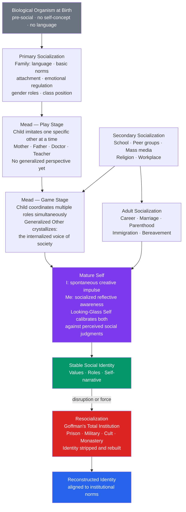

# Socialization and the Self

> [!abstract] TL;DR
> Socialization is the lifelong process by which human beings absorb the norms, values, language, and role expectations of their society and, in doing so, construct a self. Without it, biology is insufficient to produce personhood — as feral child cases confirm. The two foundational micro-level theories are Cooley's **looking-glass self** (the self-concept is a reflection of how we imagine others judge us) and Mead's **symbolic interactionism** (the self emerges through taking the role of others, culminating in internalization of the "generalized other"). Goffman extended the framework to the managed performances of everyday life and the radical identity-stripping of total institutions. Giddens later argued that in late modernity, identity becomes a reflexive, continuously renegotiated project rather than a social inheritance.

---

## Intuition

**Analogy:** Think of a smartphone fresh from the factory. The hardware — processor, sensors, screen — is all there. But without an operating system, apps, a language setting, and network connectivity, it cannot function as a social device. It cannot send a message, recognize a face, or locate itself on a map. Socialization is the process of installing the cultural software that transforms a biological organism into a functioning social person.

The hardware is human biology: neural architecture capable of language, empathy, and abstract reasoning. The software is everything culture provides: a mother tongue, rules about eye contact, a sense of what is shameful, an understanding of what a "student" or a "friend" or a "professional" is supposed to do. Strip away that software — as isolation experiments and feral child cases demonstrate — and the hardware alone cannot generate a self-aware, social being.

Crucially, the installation is not passive download. The infant is an active agent who builds the operating system through interaction, negotiation, and creative improvisation with others. The self is constructed, not received.

---

## How It Works

### Core Mechanism

Socialization proceeds through a sequence of overlapping phases, each adding layers to the self-concept:

1. **Primary socialization** occurs in infancy and early childhood, almost entirely within the family. It installs the foundational operating system: a first language, basic norms of hygiene and emotion, a sense of trust or mistrust, and the initial fragments of a self-concept. It is the most powerful phase because it occurs when the brain is most plastic and before the child has any basis for comparison or critique.

2. **Secondary socialization** begins when the child encounters institutions beyond the family — school, peer groups, mass media, religious communities. Each institution carries its own expectations, authority structures, and reward systems. The child learns that the family's rules are not universal; different contexts require different performances of self.

3. **The self develops through role-taking** (Mead). In the **play stage**, the young child imitates one specific other at a time — plays "mommy," "doctor," "superhero." In the **game stage**, the child must simultaneously hold the perspectives of multiple others (baseball: the pitcher must anticipate the catcher, batter, and fielders all at once). This capacity to coordinate multiple perspectives allows the **generalized other** to crystallize: an internalized composite representing society's collective expectations. Once the generalized other is in place, the child can feel embarrassed in private — because the societal audience is now internal.

4. **The self is continuously calibrated** through social feedback. Cooley's **looking-glass self** identifies three steps: (a) we imagine how we appear to others; (b) we imagine the judgment others make of that appearance; (c) we develop a self-feeling — pride or shame — based on that imagined judgment. The mirror is distorted by perception, selective attention, and status — which is why the same objective behavior can produce radically different self-assessments in different social settings.

5. **Adult socialization** continues throughout the life course: entering a profession, becoming a parent, migrating to a new culture, retiring. Identity is never finished.

6. **Resocialization** — deliberate or forced — can partially or fully overwrite existing identity. Goffman's **total institutions** (prisons, military boot camps, psychiatric hospitals, monasteries, cults) achieve this systematically: admission strips away prior identity markers (name, clothing, possessions), mortification processes degrade the existing self, and institutional routines install a replacement identity built around compliance and institutional roles.

### Architecture of Socialization



---

## Key Concepts

### Secondary Level

**What is socialization?**
Socialization is the process by which individuals learn and internalize the norms, values, language, beliefs, and role expectations of their society. It is what transforms a biological human infant — who is born with no language, no knowledge of social rules, and no self-concept — into a culturally competent social actor. Socialization does not end in childhood; it continues across the entire life course.

**Primary vs. secondary socialization.**
*Primary socialization* (Berger and Luckmann, 1966) occurs in early childhood within the family. It is the most fundamental because it takes place in a context of strong emotional attachment (the child has no choice and no critical distance), installs the mother tongue, and establishes the basic emotional and normative template the child will carry everywhere. *Secondary socialization* refers to all subsequent processes through which a person acquires role-specific knowledge and institutional norms — at school, among peer groups, through media, in religious communities, in the workplace.

**Agents of socialization.** The primary institutional channels through which socialization occurs:

| Agent | Primary Contribution | Peak Influence |
|---|---|---|
| **Family** | Language, basic norms, emotional regulation, class/ethnic identity, gender roles | Infancy–early childhood |
| **School** | Academic knowledge, punctuality, authority relations, peer norms, national identity | Middle childhood–adolescence |
| **Peer groups** | Subcultural norms, fashion, values, horizontal (equal-status) socialization | Adolescence |
| **Mass / social media** | Consumer identity, body norms, political views, aspirational lifestyles | Adolescence–adulthood |
| **Religion** | Moral framework, ritual practice, community, transcendent meaning | Childhood–adulthood |
| **Workplace** | Professional norms, occupational role, organizational culture | Adulthood |

**Cooley's looking-glass self** (1902). Charles Horton Cooley proposed that the self-concept is built from reflected appraisals — we see ourselves as we imagine others see us. The process has three steps: (1) imagine how we appear to others; (2) imagine their judgment of that appearance; (3) develop a self-feeling (pride or shame) based on that imagined judgment. Importantly, what shapes the self is the *imagined* judgment, not the actual one — which explains how persistent distortions in self-assessment (excessive self-criticism, narcissism) can form and resist correction.

**Feral children and the nature vs. nurture argument.** Cases of children raised in extreme isolation — Genie Wiley (isolated until age 13), Victor of Aveyron (18th century), and reported cases of children allegedly raised by animals — provide dramatic, if ethically tragic, natural experiments. Consistent findings: language acquisition requires socialization within a sensitive developmental window (roughly the first 7–12 years); emotional and social development is severely and often permanently impaired by the absence of consistent caregivers; the self-concept as a coherent social phenomenon does not develop without a social mirror. Biology provides the capacity; socialization activates it.

---

### Undergraduate Level

**Mead's symbolic interactionism and the stages of self.**
George Herbert Mead (*Mind, Self, and Society*, 1934) argued that the self is not a biological given but a social achievement — it emerges through the process of taking the role of others in symbolic (language-based) interaction.

The **I** is the subject pole of the self: the spontaneous, impulsive, creative, pre-reflective aspect. It is the part that acts before thinking. The **Me** is the object pole: the socially aware, reflective aspect that monitors behavior against internalized norms. The self is a continuous internal conversation between these two positions. A person who acts purely as "I" is antisocial (no regard for others' reactions); a person who is purely "Me" is conformist to the point of losing agency. Creativity and social integration both require the tension.

The **generalized other** is the internalized composite of society's collective attitudes, expectations, and norms. Once it is in place (after the game stage), self-regulation no longer requires an actual audience — the social gaze is internal. Guilt, shame, and moral self-assessment all operate through the generalized other.

**Freud's contribution to socialization theory.**
Freud did not write sociology but his topographic model maps directly onto socialization. The **id** (biological drives — libido, aggression) is the pre-socialized organism. The **superego** (internalized parental and societal prohibitions) is the product of socialization — it is Mead's generalized other in psychoanalytic language. The **ego** manages the tension between id and superego in interaction with reality. For Freud, socialization is fundamentally repressive: civilization requires the suppression of instinctual gratification and produces neurosis as its cost (*Civilization and Its Discontents*, 1930). Norms are internalized not just as external constraints but as internal guilt and shame — the psychic apparatus becomes its own jailer.

**Goffman's dramaturgical theory and total institutions.**
Erving Goffman (*The Presentation of Self in Everyday Life*, 1959) proposed that all social interaction involves **impression management**: we perform versions of ourselves calibrated to our audience, the setting, and our goals. Every situation has a **front stage** (the public performance, governed by idealized norms) and a **back stage** (where the props are stored, relaxation occurs, and the performance is dropped). Identity is not revealed in interaction — it is constructed in it.

Goffman's most sociologically radical work, *Asylums* (1961), analyzed **total institutions** — settings that encompass the whole life of their inmates and systematically reorganize identity. Total institutions share a common structure:

1. **Barrier to the outside world** (walls, locks, rules against communication)
2. **Batch processing**: all activities are scheduled, conducted together, and supervised by a hierarchy
3. **Admission procedures**: stripping of prior identity markers (civilian clothes, personal possessions, name → number)
4. **Mortification of the self**: degradation ceremonies, surveillance, arbitrary rule enforcement, removal of privacy
5. **Resocialization**: the replacement identity is built around institutional loyalty and the inmate role

The implication is philosophically significant: the self is not a stable essence but a fragile social construction that can be methodically dismantled and rebuilt. This insight had profound influence on the sociology of deviance, mental health policy, and critical criminology.

**Bronfenbrenner's ecological systems theory** (see also [[Lifespan_Development]]) embeds socialization in nested social systems: the microsystem (family, school), the mesosystem (connections between microsystems), the exosystem (systems that affect the child indirectly — parental employment), and the macrosystem (cultural values, economic structure). Socialization outcomes cannot be understood without the full ecological context; intervening at one level (e.g., improving family dynamics) is constrained by pressures at other levels (e.g., poverty at the macrosystem level).

---

### Graduate Level

**Giddens and reflexive identity in late modernity.**
Anthony Giddens (*Modernity and Self-Identity*, 1991) argued that traditional societies assign identity through fixed structural positions — caste, estate, gender, religion, locality. In **late modernity**, these structural anchors weaken. Identity becomes a **reflexive project**: an ongoing narrative of self-construction that the individual must actively maintain in the face of an overwhelming plurality of lifestyle options, expert systems, and cultural templates.

This creates what Giddens calls **ontological insecurity** — a pervasive anxiety about who one is, because identity must now be continuously chosen rather than inherited. The rise of self-help culture, therapy, identity politics, and lifestyle consumption are all responses to this condition: they provide resources for the project of self-construction. The flip side is existential freedom — people in late modernity have genuinely more latitude to construct identities across gender, sexuality, profession, and cultural affiliation than was structurally available to any previous generation.

**Foucault: discourse, power, and the subject.**
Where Mead and Cooley ask how the self is constructed through interpersonal interaction, Michel Foucault asks how power structures operate through discourse to produce the very categories of subjectivity available to individuals. The "normal" and the "deviant," the "healthy" and the "ill," the "criminal" and the "citizen" — these are not natural kinds but discursive constructions that certain institutions (medicine, psychiatry, law, education) produce and enforce. To be socialized is not merely to learn social rules; it is to be interpellated (Althusser) or subjected (Foucault) by them — to become a certain *type* of subject. Resistance requires not just rule-breaking but the construction of alternative subject positions, often through counter-discourses (feminist consciousness-raising, queer theory, Black power).

**Socialization and social reproduction.**
Pierre Bourdieu's theory of cultural capital and habitus connects socialization directly to social reproduction. **Habitus** is the set of durable, transposable dispositions — ways of speaking, thinking, moving, and valuing — that are acquired through early socialization and reflect the position of the family in the social field. Habitus is the socialized body: class, gender, and ethnicity are not just external categories but are literally inscribed in bodily hexis, aesthetic taste, and practical sense. The class system reproduces itself partly through the unequal distribution of cultural capital across families — children from professional-class families arrive at school already possessing the linguistic codes, cultural references, and self-presentation styles that the educational system rewards. Formal meritocracy coexists with structural reproduction through this mechanism.

**Identity in the digital age.**
Social media creates a new **digital looking-glass self**: quantified, instantaneous, and scaled. Like counts, follower metrics, comment tone, and algorithmic amplification all provide streams of perceived social evaluation that continuously update self-concept. Goffman's front/back stage distinction collapses under persistent documentation — there is always an audience, even in spaces formerly considered private. Research by Twenge and Campbell (*iGen*, 2017) documented correlations between heavy social media use and declining self-esteem, increased anxiety, and depression in adolescents — effects stronger for girls, consistent with heightened sensitivity to appearance-based social comparison. These findings remain contested (methodological debates about causality, screen time measurement, cohort confounding), but the theoretical framework — digital technologies as powerful new agents of secondary socialization — is broadly accepted.

Key features of digital socialization:
- **Algorithmic feedback loops**: platform algorithms reward content that generates engagement, systematically amplifying certain types of self-presentation (outrage, aspiration, extremity)
- **Quantified social evaluation**: abstract social approval is rendered as a visible, comparable number — transforming Cooley's imagined judgment into a tracked metric
- **Filter bubbles**: algorithmic curation creates enclosed socialization environments that concentrate exposure to like-minded others, potentially accelerating radicalization and identity consolidation
- **Platform-specific identity norms**: TikTok, LinkedIn, Instagram, and Twitter each carry distinct presentation norms that socialize users into different versions of self

---

## Python Demo

This simulation models **Cooley's looking-glass self** in a social network. Each agent has a fixed latent quality (their true underlying trait) and an initial self-assessment that may be biased above or below it. In each iteration, neighbors evaluate the agent (based on observed quality plus perception noise), and the agent's self-assessment updates toward the perceived average evaluation. The simulation compares convergence speed and accuracy under four network topologies: chain, ring, star, and fully connected.

```python
import numpy as np
import matplotlib.pyplot as plt

rng = np.random.default_rng(42)
N = 12          # agents
T = 60          # interaction steps
ALPHA = 0.25    # update rate: how strongly social feedback shifts self-concept
NOISE = 0.08    # evaluation noise: neighbors' perceptions are imperfect

# True latent quality of each agent (fixed, unknown to agents themselves)
quality = rng.uniform(0.20, 0.85, size=N)

# Initial self-assessments: randomly biased above or below true quality
init_bias = rng.uniform(-0.25, 0.25, size=N)
s0 = np.clip(quality + init_bias, 0.05, 0.95)

# Network topology constructors
def chain_adj(n):
    A = np.zeros((n, n))
    for i in range(n - 1):
        A[i, i + 1] = A[i + 1, i] = 1.0
    return A

def ring_adj(n):
    A = chain_adj(n)
    A[0, n - 1] = A[n - 1, 0] = 1.0
    return A

def star_adj(n):
    A = np.zeros((n, n))
    A[0, 1:] = A[1:, 0] = 1.0
    return A

def full_adj(n):
    return np.ones((n, n)) - np.eye(n)

def simulate(adj, quality, s0, alpha, noise, T):
    """Simulate looking-glass self dynamics over T interaction steps."""
    s = s0.copy()
    history = np.zeros((T + 1, N))
    history[0] = s
    for t in range(T):
        new_s = s.copy()
        for i in range(N):
            nbrs = np.where(adj[i] > 0)[0]
            if len(nbrs) == 0:
                continue
            # Neighbors evaluate agent i: perceived quality + Gaussian noise
            evals = quality[i] + rng.normal(0, noise, size=len(nbrs))
            perceived = float(np.mean(evals))
            # Cooley update: self-concept drifts toward perceived evaluation
            new_s[i] = (1 - alpha) * s[i] + alpha * np.clip(perceived, 0.0, 1.0)
        s = new_s
        history[t + 1] = s
    return history

topologies = [
    ("Chain",           chain_adj(N)),
    ("Ring",            ring_adj(N)),
    ("Star",            star_adj(N)),
    ("Fully Connected", full_adj(N)),
]

fig, axes = plt.subplots(2, 2, figsize=(13, 9))
fig.suptitle(
    "Cooley's Looking-Glass Self Simulation\n"
    "Self-assessments converge toward true quality through iterated social feedback\n"
    "Black line = group mean self-assessment  |  Red dashed = mean true quality  |  "
    "Orange dotted = initial mean",
    fontsize=10, fontweight="bold"
)

for ax, (name, adj) in zip(axes.flat, topologies):
    hist = simulate(adj, quality, s0, ALPHA, NOISE, T)

    # Individual agent trajectories
    for i in range(N):
        ax.plot(hist[:, i], alpha=0.40, linewidth=0.9)

    group_mean = hist.mean(axis=1)
    ax.plot(group_mean, color="black", linewidth=2.2, label="Group mean self-assess.")
    ax.axhline(quality.mean(), color="red",    linewidth=1.5, linestyle="--", label="True quality mean")
    ax.axhline(s0.mean(),      color="orange", linewidth=1.2, linestyle=":",  label="Initial self-assess. mean")

    final_gap = abs(group_mean[-1] - quality.mean())
    ax.set_title(f"{name}  (final gap = {final_gap:.3f})", fontweight="bold", fontsize=10)
    ax.set_xlabel("Social interaction step")
    ax.set_ylabel("Self-assessment (0-1)")
    ax.set_ylim(-0.05, 1.10)
    ax.legend(fontsize=7, loc="upper right")

plt.tight_layout()
plt.savefig("looking_glass_self_simulation.png", dpi=120, bbox_inches="tight")
plt.show()

# Convergence summary table
print(f"\n{'Topology':<22} {'Initial gap':>13} {'Final gap':>12}")
print("-" * 49)
for name, adj in topologies:
    hist = simulate(adj, quality, s0, ALPHA, NOISE, T)
    init_gap  = abs(s0.mean() - quality.mean())
    final_gap = abs(hist[-1].mean() - quality.mean())
    print(f"{name:<22} {init_gap:>13.4f} {final_gap:>12.4f}")
```

**What the output shows.** The fully connected topology converges fastest — maximum neighborhood exposure means the group's social mirror is richest and most accurate. The chain topology converges slowest — peripheral agents have only two neighbors, so social feedback is sparse and distorted. The star topology creates a two-tier outcome: the hub agent (connected to everyone) converges rapidly to near-true quality, while the peripheral agents receive evaluations only from the hub and converge more slowly. This directly models real sociological phenomena: individuals embedded in dense, diverse networks develop more calibrated self-concepts; isolated individuals (chain) remain biased by idiosyncratic early feedback; high-centrality individuals (star hub) receive rapid and accurate social feedback about their standing.

---

## Real-World Applications

**Early childhood policy.** The evidence that primary socialization is most powerful during sensitive developmental windows (0–7 years) underpins investments in early childhood education (Head Start, Sure Start), universal pre-K, and parental leave policies. The Perry Preschool Project (Michigan, 1960s) showed that high-quality early socialization interventions for disadvantaged children produced effects traceable 40 years later: lower crime rates, higher employment, better health.

**Military basic training.** Boot camp is a textbook total institution. New recruits undergo systematic identity stripping (uniform, head shave, rank replacement for name, drill instructor authority over every moment of the day) followed by resocialization into a military self organized around unit loyalty, hierarchical obedience, and occupational identity. The process is explicitly designed to override civilian self-concept and install one compatible with combat. Its effectiveness — and the psychological costs of re-transition to civilian life — is well-documented.

**Online radicalization.** Digital platforms function as total institutions in attenuated form: they capture attention fully, provide a consistent community of evaluation (the looking-glass self calibrated exclusively by in-group norms), strip away prior identity signals (anonymity, pseudonymity), and progressively intensify ideological commitment through algorithmic engagement loops. Socialization theory predicts that individuals with weak prior identity anchors — adolescents, recent immigrants, those experiencing role transitions — will be most susceptible.

**Prison recidivism.** Goffman's analysis of total institutions predicts that prison socialization instills a criminal identity and subcultural norms that actively undermine post-release reintegration. This is exactly what recidivism data show: incarceration-as-resocialization tends to socialize toward further criminal behavior rather than away from it. Rehabilitative frameworks (therapeutic communities, cognitive-behavioral programs, education) attempt to provide competing socialization toward non-criminal identities.

**Identity-affirming clinical practice.** Transgender identity, queer identity, and neurodivergent identity formation involve resistance to dominant socialization scripts and the construction of alternative self-narratives. Affirmative therapeutic models (supporting rather than attempting to extinguish non-normative identities) are grounded in the sociological understanding that identity is a reflexive project — one that can be constructed against, as well as with, prevailing social norms.

---

## Common Pitfalls

- **"Socialization equals passive indoctrination"** — The most common misreading. Mead insisted the "I" is always present as a spontaneous, creative agent that responds to but is never reducible to the "Me." Children actively interpret, test, and resist socialization pressures; peer groups generate subcultural norms that partly contradict the parental generation's values. Socialization is a negotiated process, not a transfer protocol.

- **"The self exists before society"** — The intuition that there is a "real me" underneath all the social roles is phenomenologically powerful but sociologically incoherent. The very capacity to ask "who am I?" is a language-dependent, culturally specific reflective operation that requires socialization to exist at all. Feral child cases provide the empirical limit case: without the social mirror, no coherent self-concept forms.

- **"Primary socialization determines the adult self"** — Developmental primacy is real, but it is not determinism. Adult socialization, resocialization, therapeutic experiences, and new social networks all produce genuine identity change. Attachment research on "earned security" and sociological studies of religious conversion, immigration, and recovery from addiction all confirm the plasticity of identity across the lifespan.

- **"Looking-glass self = accurate self-assessment"** — Cooley's theory describes how the self-concept forms, not how accurately it tracks reality. If the social mirrors an individual has access to are systematically biased — harsh, abusive, status-distorted, or limited — the resulting self-concept will be distorted accordingly. Low-status individuals receive devaluing social feedback that does not reflect their actual competence; high-status individuals receive inflated feedback. The looking-glass is a distorting mirror as often as a true one.

- **"Total institutions inevitably destroy the self"** — Goffman himself noted that inmates develop elaborate strategies of resistance: role distance, impression management directed at peers rather than staff, construction of small territories of autonomy (a hidden personal item, a nickname). The self is resilient; total institutions have to work hard against its persistent reassertion.

- **"Digital socialization is simply additive"** — The quantification and acceleration of the looking-glass self through social media is qualitatively different from face-to-face feedback: it is persistent (screenshotted, archived), decoupled from relationship context, exposed to anonymous others with unknown agendas, and governed by algorithmic amplification rather than social norms. These features create socialization dynamics with no clear prior historical analogue.

---

## Related Concepts

- [[_MOC_Culture_Identity_and_Socialization|↑ Culture, Identity & Socialization MOC]] — Section entry point and concept map
- [[Attachment_Theory]] — Primary socialization depends on the security of the caregiver-infant bond; Bowlby's internal working models are the psychological substrate of the early looking-glass self, encoding "Am I lovable?" and "Are others reliable?" as default filters on all subsequent social interaction
- [[Lifespan_Development]] — Erikson's psychosocial stages map socialization crises across the entire lifespan; the identity vs. role confusion crisis (Stage 5) is the most direct developmental parallel to Mead's account of the reflexive self; Bronfenbrenner's ecological systems are the structural containers of socialization
- [[Piagets_Cognitive_Development]] — Cognitive stages constrain what socialization can accomplish at each age; the child cannot internalize the generalized other before achieving the concrete operational capacity to de-center and coordinate multiple perspectives
- [[Social_Influence_and_Conformity]] — Secondary socialization through peer groups is the sociological macro-account of the same process that Asch's conformity experiments measure at the micro-level; normative vs. informational influence maps onto Mead's distinction between external compliance and genuine internalization
- [[Moral_Development]] — Kohlberg's moral stages are a cognitive-developmental account of what socialization internalizes; the movement from pre-conventional (fear of punishment) to conventional (rule compliance) to post-conventional (principled reasoning) mirrors the development from external social control to the internalized generalized other to reflective moral agency
- [[Group_Dynamics]] — Peer groups as agents of secondary socialization; group identity, in-group norms, and social comparison processes are the mechanisms through which adolescent secondary socialization operates
- [[Language_Development]] — Language is the primary vehicle of socialization: it carries the conceptual categories, pronoun structures, and speech acts through which social identity is constructed and transmitted; the critical window for language acquisition and the critical window for primary socialization overlap almost exactly
- [[Neurodevelopmental_Disorders]] — The neurodevelopmental perspective on socialization: the same sensitive period for social-circuit development (synaptogenesis, pruning, myelination of prefrontal cortex) that is disrupted in ASD and ADHD also underlies the irreversible effects of extreme early social deprivation in feral child cases; social brain development is neurobiologically as well as sociologically time-constrained

---

## Review Questions

### Secondary

1. Explain the difference between primary and secondary socialization. Give two concrete examples of each and identify the specific agent of socialization responsible in each case.
2. Using Cooley's looking-glass self, explain why a student who receives consistently harsh criticism from their teacher might develop persistently low academic self-confidence even if their actual ability is high.
3. What do feral child cases tell us about the relative contributions of biology and socialization to the development of a human self? What are the limitations of using these cases as evidence?

### Undergraduate

1. Compare Mead's account of the emergence of the self (play stage, game stage, generalized other, I vs. Me) with Freud's account (id, ego, superego). In what ways are they isomorphic? Where do they fundamentally differ in their assumptions about the relationship between the individual and society?
2. Goffman argues that the self is always a performance. Does this mean the self is not real? Evaluate the dramaturgical perspective, including both its explanatory power and its limitations as a theory of identity.
3. Using Goffman's concept of total institutions, analyze why military boot camp successfully resocializes recruits into a military identity while prisons largely fail to resocialize inmates away from criminal identity. What structural features explain the difference in outcomes?

### Graduate

1. Giddens argues that in late modernity identity becomes a "reflexive project." Evaluate this claim in relation to Bourdieu's concept of habitus. To what extent does the freedom to reflexively construct identity depend on class position and access to cultural resources?
2. Digital social media platforms function as agents of socialization through quantified looking-glass self mechanisms (like counts, follower metrics, algorithmic amplification). Design a sociological research study to test whether heavy social media use shifts adolescent self-assessments in the direction of platform-specific appearance norms rather than face-to-face peer norms. What methodological challenges would you face and how would you address them?
3. Foucault argues that the subject is produced by discursive power-knowledge regimes rather than being their origin. How does this differ from both Mead's interactionist account and Giddens' reflexive account of the self? What implications does the Foucauldian position have for the possibility of socialization that produces genuine individual agency rather than docile compliance?

---

## Sources

- Mead, G.H. (1934). *Mind, Self, and Society*. University of Chicago Press.
- Cooley, C.H. (1902). *Human Nature and the Social Order*. Scribner.
- Goffman, E. (1959). *The Presentation of Self in Everyday Life*. Anchor Books.
- Goffman, E. (1961). *Asylums: Essays on the Social Situation of Mental Patients and Other Inmates*. Anchor Books.
- Berger, P.L. & Luckmann, T. (1966). *The Social Construction of Reality*. Anchor Books.
- Giddens, A. (1991). *Modernity and Self-Identity: Self and Society in the Late Modern Age*. Polity Press.
- Bourdieu, P. (1977). *Outline of a Theory of Practice*. Cambridge University Press.
- Foucault, M. (1977). *Discipline and Punish: The Birth of the Prison*. Pantheon.
- Twenge, J.M. (2017). *iGen: Why Today's Super-Connected Kids Are Growing Up Less Rebellious, More Tolerant, Less Happy*. Atria Books.
- Bronfenbrenner, U. (1979). *The Ecology of Human Development*. Harvard University Press.

---

#Sociology #Culture #Socialization #Self #Identity
