# Culture, Identity, and Socialization

> [!abstract] Section Overview
> This section traces the full arc from the cultural OS that shapes social life, through the process that installs it in individuals, to the managed identities people perform in daily interaction, and finally to the large-scale collective identities — crowds, movements, nations — that emerge when millions of socialized selves act together. Mastering this arc is essential for understanding how social order reproduces itself and how it is challenged.

> [!info] How to use this map
> Start with **Culture**, follow the arrows left to right, and use the Learning Path below as your guide.
> Each node links to a full note. Come back to this map when you feel lost.

---

## Concept Map

```mermaid
graph LR
    CULT["Culture\nNorms · Values · Ideology"]
    SOC["Socialization\nand the Self"]
    IDENT["Identity · Stigma\nImpression Management"]
    COLL["Collective Behavior\nand Crowds"]
    MOV["Social Movements\nand Revolution"]
    NAT["Nationalism · Ethnicity\nCollective Identity"]

    CULT -->|"internalized through"| SOC
    SOC -->|"produces managed"| IDENT
    IDENT -->|"scales up to"| COLL
    COLL -->|"organizes into"| MOV
    MOV -->|"crystallizes as"| NAT

    CULT -.->|"habitus and reproduction"| IDENT
    IDENT -.->|"Social Identity Theory"| NAT
    COLL -.->|"effervescence fuels"| MOV

    style CULT fill:#4a9eff,color:#fff
    style SOC fill:#4a9eff,color:#fff
    style IDENT fill:#7c6cff,color:#fff
    style COLL fill:#7c6cff,color:#fff
    style MOV fill:#ff8c42,color:#fff
    style NAT fill:#ff6b6b,color:#fff
```

*(Blue = foundational, Purple = intermediate, Orange = advanced application, Red = most advanced — arrows show "leads to" or "requires")*

---

## Learning Path

*Recommended order for a first pass through this section:*

1. [[Culture_Norms_Values_and_Ideology]] — Start here; establishes the shared web of meanings, norms, values, symbols, and ideology that forms the cultural OS everything else runs on.
2. [[Socialization_and_the_Self]] — How that OS is installed in individuals; Cooley's looking-glass self, Mead's symbolic interactionism, Goffman's total institutions, and Giddens' reflexive identity.
3. [[Identity_Stigma_and_Impression_Management]] — How the socialized self is performed, defended, and sometimes spoiled; Goffman's dramaturgy, stigma management, and Tajfel-Turner's Social Identity Theory.
4. [[Collective_Behavior_and_Crowds]] — What happens when socialized individuals merge into collective episodes; LeBon, emergent norm theory, Smelser's value-added model, and Durkheim's collective effervescence.
5. [[Social_Movements_and_Revolution]] — How episodic collective behavior becomes organized, sustained contention; Olson's collective action problem, resource mobilization, political process model, and Skocpol's structural revolution theory.
6. [[Nationalism_Ethnicity_and_Collective_Identity]] — The largest scale of imagined collective identity; Anderson's imagined communities, Barth's boundary theory, civic vs. ethnic nationalism, and the sociology of genocide.

---

## All Notes in This Section

| Note | Core Idea | Difficulty |
|------|-----------|------------|
| [[Culture_Norms_Values_and_Ideology]] | Culture is the social OS — norms, values, symbols, and ideology reproduce power arrangements through hegemony and cultural capital | Intermediate |
| [[Socialization_and_the_Self]] | The self is a social achievement built through interaction; Cooley, Mead, Goffman, and Giddens explain how culture is internalized as identity | Beginner |
| [[Identity_Stigma_and_Impression_Management]] | Social life is performance; stigma spoils identity; group membership anchors self-esteem via Social Identity Theory | Intermediate |
| [[Collective_Behavior_and_Crowds]] | Crowds are not irrational mobs but norm-governed collective episodes; contagion, emergent norms, and effervescence explain the range of outcomes | Intermediate |
| [[Social_Movements_and_Revolution]] | Grievances alone do not produce movements; organizational resources, political opportunity, resonant frames, and threshold cascades explain when mobilization succeeds | Advanced |
| [[Nationalism_Ethnicity_and_Collective_Identity]] | Nations are imagined communities and ethnicity is defined by socially maintained boundaries, not primordial essence; these constructions can generate liberation or genocide | Advanced |

---

## Key Themes

- **Culture as invisible infrastructure** — like an operating system, culture shapes perception and behavior without being noticed by those running on it
- **The socially constructed self** — selfhood is not a biological given but an achievement built through interaction, socialization, and continuous performance
- **Performance, stigma, and the management of identity** — Goffman's dramaturgical insight: every interaction is a performance, and stigma events shatter the performance by exposing the gap between virtual and actual identity
- **The micro-to-macro bridge** — the section moves systematically from internalized culture, to managed self, to crowd dynamics, to organized movements, to imagined national communities
- **Collective identity as political resource** — identity is not just personal; it is the raw material of social movements and the justification for both liberation and ethnic cleansing
- **Reproduction and contestation** — cultural hegemony reproduces existing arrangements through consent; social movements and counter-hegemonic identity projects are the mechanism of change

---

## Key Questions This Section Answers

- How does social order reproduce itself without constant coercion — and why do dominated groups so often consent to their own domination?
- How does a biological organism become a self-aware social person, and what happens when that process is disrupted?
- Why do people manage their identities so carefully, and what are the social consequences of a "spoiled" identity?
- What distinguishes a crowd from a collection of individuals, and why do crowds sometimes produce celebration and sometimes riot?
- Why do most people with shared grievances not join social movements — and what organizational and structural conditions explain when they do?
- Are national and ethnic identities ancient facts or modern constructions — and does the answer matter for how we respond to nationalism and ethnic violence?

---

## Connections to Other Topics

- [[_MOC_Sociology_Master|↑ Sociology Master MOC]] — master entry to the full Sociology vault; this section bridges the theoretical foundations and the applied analysis of power and social change
- [[Classical_Sociological_Theory]] — Durkheim's collective conscience, Weber's verstehen, and Marx's base-superstructure model are the theoretical roots of every note in this section
- [[Group_Dynamics]] — Social facilitation, in-group favoritism, and group polarization are the psychological micro-mechanisms underlying collective behavior and Social Identity Theory
- [[Social_Influence_and_Conformity]] — The Asch and Milgram tradition is the experimental complement to this section's sociological account of norm enforcement and crowd behavior
- [[Prejudice_and_Discrimination]] — Tajfel's minimal group paradigm bridges Social Identity Theory in this section to the full prejudice literature
- [[Political_Participation_and_Civil_Society]] — Social movements are the organized, sustained counterpart to the spontaneous collective behavior this section covers
- [[Intersectionality]] — Crenshaw's framework extends the identity and stigma concepts here by analyzing how multiple subordinate identities compound one another
- [[Gender_Sex_and_Patriarchy]] — Butler's performativity theory extends Goffman's dramaturgy to show how gender identity itself is constituted through compulsory performance
- [[Democratic_Backsliding_and_Polarization]] — Populist nationalism (covered in Note 6) is the primary ideological vehicle for contemporary democratic erosion

---

#Sociology #MOC
