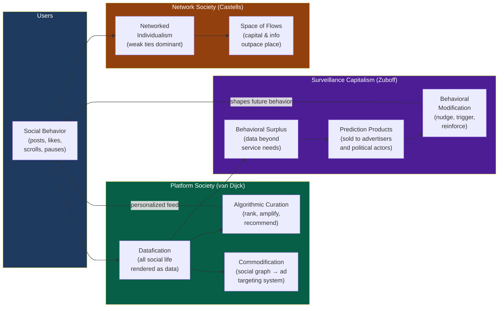

# Digital Society and Online Communities

> [!abstract] TL;DR
> Digital society is not a separate realm layered on top of "real" social life — it is social life reorganized through networked platforms that datafiy behavior, commodify relationships, and govern participation through algorithm. Three interlocking dynamics define the field: the digital divide determines who enters the network and with what power; platform capitalism extracts behavioral surplus and sells behavioral modification; and algorithmic governance reshapes identity, community, mental health, and political action in ways that neither Tocqueville nor Marx anticipated.

---

## Intuition

**Analogy:** For most of human history, the public square was genuinely public — owned by the municipality, governed by law, accessible to anyone who could walk there. Then, in the 20th century, the shopping mall appeared: privately owned, architecturally designed to maximize dwell time and purchasing behavior, with guards who could remove anyone who disrupted commerce. The mall looked like a public square and functioned like one socially, but its rules were set by a corporation optimizing for profit, not by citizens optimizing for deliberation.

The internet began as a public square and became a mall. Facebook, YouTube, TikTok, and X are private platforms that host most of humanity's informal public life — debate, community, grief, protest, friendship — while their business model is the monetization of behavioral data generated by that social activity. The platform architect does not forbid speech; it shapes what speech gets recommended to 2 billion people and what quietly disappears into an unindexed void. The architecture IS the governance.

---

## How It Works



The diagram captures the self-reinforcing loop at the heart of platform capitalism: user behavior generates data; data feeds the algorithm; the algorithm shapes the feed; the feed shapes future behavior; behavior generates more data. Castells' network society is the structural backdrop — information flows operate at a different speed and logic than physical place, concentrating power in whoever controls the nodes.

---

## Key Concepts

### Secondary Level

**What Is the Digital Society?**

The digital society is not simply society plus computers. It is a social formation in which digital networks have become the primary infrastructure for economic production, political communication, cultural distribution, and interpersonal relationship — and in which access to those networks increasingly determines life chances. Manuel Castells (*The Rise of the Network Society*, 1996) identified the decisive shift: in industrial capitalism, the key resource was physical capital (factories, machinery); in informational capitalism, the key resource is the capacity to generate, process, and apply knowledge through digital networks. Power flows to whoever controls the nodes and hubs of the network.

**The Digital Divide**

Not everyone enters the digital society on equal terms. Jan van Dijk (*The Deepening Divide*, 2005) identified three sequential orders of digital inequality:

| Order | Barrier | Example |
|---|---|---|
| **First-order** (access) | Lack of hardware, broadband, or electricity | Rural communities without fiber broadband; low-income households without smartphones |
| **Second-order** (skills) | Insufficient digital literacy — operational, informational, strategic | Elderly users who can use Facebook but cannot identify phishing attempts or evaluate source credibility |
| **Third-order** (outcomes) | Failure to translate digital access into social, economic, or political benefit | Students with internet access who use it primarily for entertainment, not educational capital |

First-order gaps are closing globally — smartphone penetration in the Global South has risen sharply. But second and third-order gaps are widening: as platforms become more sophisticated, the gap between expert digital users (who exploit platforms for career, civic engagement, and economic gain) and passive consumers (who are exploited by platforms for their behavioral data) grows. The digital divide is increasingly a divide in digital power, not merely digital access.

**Virtual Communities**

Sociologist Howard Rheingold (*The Virtual Community*, 1993) argued that genuine community could form in online spaces — he observed that WELL BBS participants built relationships with real emotional depth, mutual aid, and collective identity, despite never meeting in person. The sociological question is whether online communities constitute communities in the full sense: do they generate social capital, norms, sanctions, and solidarity, or are they merely aggregations of like-minded individuals?

Research suggests both: online communities of practice (Wenger) around shared expertise — open-source software developers, academic subreddits, medical patient communities — display strong norms, reputation systems, mutual aid, and collective learning. But many large-scale online aggregations (Facebook groups, Twitter "communities") exhibit thin ties, rapid dissolution, and susceptibility to brigading and norm collapse.

---

### Undergraduate Level

**Castells' Network Society**

Manuel Castells' trilogy (*The Information Age*, 1996–2004) argued that networks have replaced hierarchies as the dominant form of social organization across economics, politics, culture, and personal life:

- **Networked individualism**: Barry Wellman showed empirically that in the internet era, individuals — not households or neighborhoods — are the primary unit of social connection. People maintain large, geographically dispersed, weak-tie networks rather than the dense, localized, strong-tie communities of earlier eras. This is not social atomization; it is a different architecture of social life that trades depth for range.
- **Space of flows vs. space of places**: Capital, information, and power now flow through global networks at speeds that decouple them from local places. A factory in Ohio closes not because anything went wrong in Ohio but because capital flowed to cheaper labor markets through the network. The "space of flows" (global network time) dominates the "space of places" (local, historical, culturally embedded time), producing widespread disorientation and the backlash politics of place-based identity.
- **The fourth power**: In the network society, the mass media was the "fourth estate" checking political power. The new fourth power is the programming of communication networks — whoever decides what gets amplified and what gets silenced in the network exercises power more consequentially than any newspaper.

**Platform Society (van Dijck, Poell & de Waal, 2018)**

Jose van Dijck argues that platformization is a structural transformation of society, not merely a commercial development. Three mechanisms characterize the platform society:

| Mechanism | Definition | Sociological Consequence |
|---|---|---|
| **Datafication** | Converting all social acts into quantified data points | Transforms friendship into a "social graph," health into biometric streams, political opinion into engagement metrics |
| **Commodification** | Monetizing data-recorded social connections | The act of following a friend becomes an advertising targeting variable; civic engagement generates profit for a private corporation |
| **Selection** | Algorithmic decisions about what becomes visible | Platform-determined visibility replaces editorial gatekeeping without editorial accountability |

The critical move van Dijck makes is to distinguish **platforms as markets** (connecting buyers and sellers) from **platforms as infrastructures of sociality** (hosting most of public life). Once a platform becomes the infrastructure for political debate, public health communication, and civic organizing, it can no longer be treated as a neutral market mechanism — its design choices are inherently political.

**Surveillance Capitalism (Zuboff, 2019)**

Shoshana Zuboff's *The Age of Surveillance Capitalism* proposed a new economic logic:

1. **Discovery**: Google found that user behavioral data (search queries, click patterns, dwell time) produced more economic value when repurposed as predictive intelligence than when used to improve the search product.
2. **Behavioral surplus**: The data extracted beyond what the service requires — not "I searched for 'diabetes symptoms'" (used to return better results) but "I searched for 'diabetes symptoms' at 3am after reading about my father's diagnosis while my location shows me at a hospital" (the additional context that reveals emotional state, likely purchases, insurance decisions, voting behavior).
3. **Prediction products**: Behavioral surplus is processed by machine learning into increasingly accurate predictions of future behavior, sold to anyone who wants to influence that behavior — advertisers, political campaigns, insurance companies.
4. **Behavioral modification**: The logic extends from prediction to modification — engineering the user's information environment to make desired behaviors more probable, without the target's knowledge or consent.

Zuboff calls this **instrumentarian power** — a form of power that does not coerce or persuade but operates by modifying the behavioral context in which choices are made. It is distinct from totalitarian power (which demands ideological conformity) and from disciplinary power (Foucault's panopticon, which produces self-surveillance). Instrumentarian power does not need the subject to cooperate or even know they are being shaped.

**Digital Labor and Prosumption**

George Ritzer and Nathan Jurgenson (*Production, Consumption, Prosumption*, 2010) coined "prosumption" to describe how digital platforms blur the line between producer and consumer: Facebook users are simultaneously the customers (consuming the platform) and the product (producing the content and data that generate revenue). This creates a structural condition of **unpaid digital labor** — each like, share, post, and click is labor that generates value for the platform owner without compensation.

Dallas Smythe (1977) anticipated this with his "blindspot" essay: in broadcast capitalism, the product is not the TV show — it is the audience, sold to advertisers. Platform capitalism extends this: the product is not even the audience's attention — it is the audience's behavioral profile, sold as a prediction product. The user is simultaneously raw material, factory worker, and product.

**Filter Bubbles and Algorithmic Governance**

Eli Pariser (*The Filter Bubble*, 2011) argued that personalization algorithms create ideological enclosures: by showing users content similar to what they have previously engaged with, platforms reduce exposure to challenging information and produce increasingly homogeneous information environments. The filter bubble has two components:

- **Algorithmic homophily**: Recommendations cluster around what users already believe (content-based filtering amplifies existing preferences).
- **Engagement optimization**: Emotionally activating content — especially outrage, fear, and tribal identity — generates more clicks, shares, and dwell time than neutral information, so engagement-optimized algorithms systematically amplify extreme over moderate content.

The empirical record is more complex than Pariser's original claim: Axel Bruns (*Are Filter Bubbles Real?*, 2019) showed that most social media users are exposed to more ideologically diverse content than their offline networks. But the *engagement* with like-minded content is more intense, and the *reach* of extreme content is algorithmically amplified — so filter bubbles are real as structures of attention and virality even when they are not absolute walls.

**Online Communities and Virtual Communities of Practice**

Etienne Wenger's communities of practice framework maps well onto online communities: they develop shared repertoires (memes, inside references, vocabulary), mutual engagement (helping each other, enforcing norms), and joint enterprise (building a wiki, maintaining an open-source project, running a mutual aid network). Reddit's subreddit architecture has been studied as the most extensive natural experiment in online community governance: the 2015 ban of five hate-speech subreddits reduced hate speech across Reddit by 80% (Chandrasekharan et al., 2017) — demonstrating that platform governance decisions create real norm externalities across the network.

---

### Graduate Level

**Social Media and Mental Health: Twenge's iGen Thesis**

Jean Twenge (*iGen*, 2017) analyzed longitudinal surveys of American adolescents and identified a sharp inflection in mental health, social behavior, and developmental milestones beginning in 2012 — precisely when smartphone ownership crossed 50% among American teenagers. She documented:

- Rising rates of loneliness, depression, and anxiety among teenagers, especially girls
- Declining in-person socialization, sexual activity, dating, and driving (traditional markers of adolescent development)
- Increased screen time correlated with decreased psychological well-being at the individual level

The causal mechanism Twenge proposed: social media enables continuous social comparison, upward comparison with curated self-presentations, and 24/7 exposure to social exclusion signals (not being invited to events visible on Instagram). The "fear of missing out" (FOMO) is not a new emotion but it now has a continuous real-time data feed.

Critics (notably Candice Odgers, 2018) challenged Twenge's causal inference, pointing out that smartphone adoption coincided with the 2008 economic recession and its aftermath, and that the correlations between screen time and mental health are small (explaining 0.5% of variance in large survey studies, similar to the variance explained by potato consumption — Orben & Przybylski, 2019). The debate remains open, but the sociological point stands: whether or not smartphones *cause* the changes Twenge identifies, they certainly *mediate* adolescent social life in ways that are structurally novel.

**Digital Activism: Connective vs. Collective Action**

W. Lance Bennett and Alexandra Segerberg (*The Logic of Connective Action*, 2013) made a crucial distinction:

| Type | Logic | Example | Strength | Weakness |
|---|---|---|---|---|
| **Collective action** (Olson) | Organization-brokered; shared ideology; formal membership | Trade union strike, civil rights march | Durable; accountable; capable of sustained pressure | High coordination cost; excludes non-members; slow mobilization |
| **Connective action** | Network-brokered; personalized frames; loose digital networks | #MeToo, Arab Spring Facebook groups, climate school strikes | Fast mobilization; global reach; low entry cost | Shallow commitment; no organizational memory; easily suppressed or hijacked |

The Arab Spring was the paradigm case: connective action mobilized millions rapidly through Facebook and Twitter, but the movements could not translate networked mobilization into durable political organization. In Egypt, the network was defeated by a military organization with centuries of institutional memory. Bennett and Segerberg argue that neither form is intrinsically superior — the question is whether the political objective requires sustained organizational capacity or a rapid attention peak.

**Identity in Digital Spaces**

Erving Goffman's dramaturgical model of self-presentation (front stage/backstage) extends directly to digital spaces, but with key modifications:

- **Multiplicity**: Users maintain separate identities across platforms — LinkedIn self (professional), Instagram self (aesthetic/aspirational), Twitter/X self (political/intellectual), gaming identities, anonymous forum personas. Sherry Turkle (*Life on the Screen*, 1995) initially celebrated this multiplicity as liberating — the internet as a space for identity experimentation and fluid self-constitution. She later (2011) reversed her assessment, arguing that continuous digital self-presentation produces a "tethered self" constantly performing for an audience, unable to tolerate solitude.
- **Anonymity paradox**: Anonymity online enables both the most liberated self-expression (LGBTQ+ identity exploration, mental health disclosure, political dissent in authoritarian states) and the most destructive behavior (targeted harassment, trolling, radicalization). The key variable is not anonymity per se but accountability — systems with partial accountability (pseudonymity + persistent reputation) tend to produce better norm compliance than either full anonymity or full real-name enforcement.
- **Context collapse** (Marwick & boyd, 2011): Social media collapses multiple distinct social contexts — family, friends, colleagues, acquaintances, strangers — into a single audience. The self-presentation appropriate to one context is inappropriate to another. Context collapse produces permanent self-censorship among socially aware users and catastrophic mis-presentation among the unaware.

**Digital Inequalities and Intersectionality**

The digital divide is not a single divide but a matrix of intersecting disadvantages:

- **Race and platform architecture**: Algorithms trained on historical data reproduce and amplify racial bias. A 2021 audit found Facebook's advertising algorithm delivered job ads for supermarket positions to Black users at higher rates and programmer positions to white users, without employer instruction — algorithmic discrimination emerging from training data, not explicit instruction.
- **Gender and harassment**: Research by Amnesty International (2018) found that Black women on Twitter received abusive tweets at 84% higher rates than white women. Platforms systematically under-moderate harassment against women and minorities while over-moderating their resistance to it.
- **Algorithmic amplification of inequality**: Recommendation systems trained on engagement metrics amplify whoever already generates the most engagement — which reflects existing cultural hierarchies. The "attention economy" is not a meritocracy of ideas; it is a market that rewards whoever already has attention capital.

---

## Python Demo

```python
# Filter Bubble Formation via Engagement-Optimized Recommendation
#
# Demonstrates: even when the content pool is ALWAYS balanced (uniform
# across the ideological spectrum), an engagement-optimized personalization
# algorithm creates two dynamics simultaneously:
#   1. Filter bubble — mean feed diversity (std dev of ideological scores
#      in each user's feed) DECREASES over recommendation cycles
#   2. Polarization  — std dev of user interest vectors INCREASES as users
#      drift toward ideological extremes
#
# Key mechanism: extreme content generates higher engagement (outrage,
# tribal identity, emotional resonance). The algorithm therefore recommends
# extreme content even to users who start centrist. Slight random asymmetry
# in initial exposure causes users to drift toward one pole; the algorithm
# then reinforces that drift.
#
# Baseline (random recommendation): same update rule, but content is chosen
# uniformly at random — no engagement weighting, no personalization.
# Result: users converge toward center (mean of random feed ≈ 0) and feed
# diversity stays near the theoretical maximum.
#
# Uses: numpy and matplotlib only.

import numpy as np
import matplotlib
matplotlib.use("Agg")
import matplotlib.pyplot as plt

rng = np.random.default_rng(42)

# ── Parameters ───────────────────────────────────────────────────────────────
N_USERS   = 100     # simulated platform users
N_CONTENT = 800     # content pool — fixed, ideologically balanced
K         = 20      # items served per recommendation cycle
T         = 60      # total recommendation cycles
ALPHA     = 0.20    # rate at which user's interest profile drifts toward their feed
ENG_BIAS  = 2.2     # engagement multiplier for extreme content (|score|=1 gets ×3.2)

# ── Content pool: uniform(−1, 1), NEVER changes ──────────────────────────────
content_scores = rng.uniform(-1.0, 1.0, N_CONTENT)
# Engagement potential: extreme content is more engaging (outrage/identity activation)
content_eng    = 1.0 + ENG_BIAS * np.abs(content_scores)

# ── All users start as near-centrists (mean=0, small noise) ─────────────────
init_profiles  = rng.normal(0.0, 0.05, N_USERS)


def simulate(mode):
    """
    mode = 'algorithmic' : engagement-weighted personalization; profiles evolve.
    mode = 'random'      : uniform random selection; profiles still update
                           (toward random feed mean ≈ 0, so converge to center).
    """
    profiles   = init_profiles.copy()
    div_hist   = np.empty(T)    # per-step mean feed diversity
    polar_hist = np.empty(T)    # per-step std dev of user interest vectors

    for t in range(T):
        feeds = np.empty((N_USERS, K))
        for i in range(N_USERS):
            if mode == 'algorithmic':
                # Score = linear similarity × engagement + small exploration noise
                # Linear sim: 1.0 at distance 0, 0.0 at distance 2 (max possible)
                sim   = 1.0 - np.abs(content_scores - profiles[i]) / 2.0
                score = sim * content_eng + rng.normal(0, 0.04, N_CONTENT)
                top_k = np.argpartition(score, -K)[-K:]
            else:
                # Random baseline: no personalization, no engagement weighting
                top_k = rng.choice(N_CONTENT, size=K, replace=False)

            feeds[i] = content_scores[top_k]
            # Interest update: same rule in both modes — EMA toward feed centroid
            profiles[i] = (1 - ALPHA) * profiles[i] + ALPHA * feeds[i].mean()

        div_hist[t]   = np.mean(feeds.std(axis=1))   # mean within-user feed diversity
        polar_hist[t] = profiles.std()                # population-level polarization

    return div_hist, polar_hist


algo_div, algo_pol = simulate('algorithmic')
rand_div, rand_pol = simulate('random')

# ── Console summary ───────────────────────────────────────────────────────────
max_div = (1.0 / 3.0) ** 0.5    # std of Uniform(−1, 1) ≈ 0.577
print("=== Filter Bubble Simulation ===\n")
print(f"Content pool : {N_CONTENT} items  ~  Uniform(−1, 1)  [ALWAYS balanced]")
print(f"Users        : {N_USERS}, all starting near-centrist (mean=0, sd=0.05)")
print(f"Engagement   : extreme content receives up to {1+ENG_BIAS:.1f}× more engagement")
print(f"Theoretical max feed diversity (random selection): {max_div:.3f}\n")
print(f"{'Metric':<40}  {'t=1':>8}  {'t=60':>8}  {'Change':>8}")
print("─" * 64)
print(f"{'Feed diversity  — algorithmic':<40}  {algo_div[0]:>8.3f}  {algo_div[-1]:>8.3f}  "
      f"{algo_div[-1]-algo_div[0]:>+8.3f}")
print(f"{'Feed diversity  — random baseline':<40}  {rand_div[0]:>8.3f}  {rand_div[-1]:>8.3f}  "
      f"{rand_div[-1]-rand_div[0]:>+8.3f}")
print(f"{'User polarization — algorithmic':<40}  {algo_pol[0]:>8.3f}  {algo_pol[-1]:>8.3f}  "
      f"{algo_pol[-1]-algo_pol[0]:>+8.3f}")
print(f"{'User polarization — random baseline':<40}  {rand_pol[0]:>8.3f}  {rand_pol[-1]:>8.3f}  "
      f"{rand_pol[-1]-rand_pol[0]:>+8.3f}")

# ── Plot ──────────────────────────────────────────────────────────────────────
steps = np.arange(1, T + 1)
fig, axes = plt.subplots(1, 2, figsize=(12, 5))
fig.suptitle(
    "Filter Bubble Formation — Engagement-Personalized vs. Random Recommendation\n"
    "Content pool stays balanced throughout; narrowing and polarization are algorithmic artifacts",
    fontsize=11, fontweight="bold"
)

ax = axes[0]
ax.plot(steps, algo_div, lw=2.5, color="#e63946", label="Engagement-personalized algorithm")
ax.plot(steps, rand_div, lw=2.5, color="#2a9d8f", ls="--", label="Random baseline")
ax.axhline(max_div, color="#6c757d", ls=":", lw=1.5,
           label=f"Theoretical max diversity: {max_div:.3f}")
ax.set_title("Ideological Diversity in User Feeds", fontsize=11)
ax.set_xlabel("Recommendation Cycle", fontsize=10)
ax.set_ylabel("Mean Feed Diversity  (std dev of ideological scores)", fontsize=10)
ax.legend(fontsize=9)
ax.set_ylim(0, 0.85)

ax = axes[1]
ax.plot(steps, algo_pol, lw=2.5, color="#e63946", label="Engagement-personalized algorithm")
ax.plot(steps, rand_pol, lw=2.5, color="#2a9d8f", ls="--", label="Random baseline")
ax.set_title("Societal Polarization\n(std dev of user interest profiles across population)", fontsize=11)
ax.set_xlabel("Recommendation Cycle", fontsize=10)
ax.set_ylabel("User Polarization  (std dev)", fontsize=10)
ax.legend(fontsize=9)

plt.tight_layout()
plt.savefig("filter_bubble_formation.png", dpi=130, bbox_inches="tight")
print("\nFigure saved: filter_bubble_formation.png")
```

**What the model demonstrates:**

- **Engagement optimization drives divergence**: All 100 users begin as near-centrists. The engagement-biased algorithm initially shows centrist users high-scoring extreme content from both sides (±0.77 scores highest in the ranking function). Tiny random asymmetries in early exposure push users slightly left or right; the algorithm then reinforces that drift. After 60 cycles, feed diversity collapses and users are distributed bimodally near the ideological poles.
- **Balanced content pool is insufficient protection**: The content pool never changes — it remains uniform(−1,1) throughout the simulation. The polarization is entirely a product of the algorithm's scoring function that rewards engagement over diversity.
- **Random baseline reveals the counterfactual**: With random recommendation (no personalization), users are exposed to diverse content (feed diversity ≈ 0.577 throughout) and their profiles converge toward the center (diverse exposure pulls toward mean = 0). This is the chronological/undifferentiated feed counterfactual.
- **Policy implication**: Mandating diverse content pools (content quotas) does not solve the filter bubble problem if the recommendation algorithm optimizes for engagement. The intervention must target the scoring function itself — requiring platforms to optimize for diversity or deliberative quality, not just engagement.

---

## Real-World Applications

> **Example 1 — Facebook's 2014 Emotional Contagion Experiment**: Facebook secretly manipulated the News Feed of 689,003 users to show either more positive or more negative emotional content, then measured whether users' own posts became more positive or negative. The study (Kramer, Guillory & Hancock, 2014) confirmed emotional contagion at scale: emotional content in the feed does shift users' expressed emotional states. The ethical controversy was not the finding but the method — Facebook conducted a psychological experiment on nearly 700,000 users without their consent, demonstrating that platforms routinely treat users as experimental subjects for behavioral optimization.

> **Example 2 — WhatsApp and Mob Violence in India (2018)**: Between 2017 and 2019, misinformation spread through WhatsApp groups in India — rumors of child kidnappers, poisoners, organ harvesters — led to over 30 lynching deaths. WhatsApp's end-to-end encryption (a privacy feature) and its group forwarding architecture (designed for family communication) combined to create an information environment where misinformation could not be traced, fact-checked, or slowed. The case illustrates the trade-off between privacy (first-order digital right) and epistemic safety (second-order social good) — a tension surveillance capitalism resolves in favor of neither, optimizing instead for platform growth.

> **Example 3 — Reddit's Community Governance as Natural Experiment**: Reddit's 2015 ban of five hate-speech subreddits (including r/fatpeoplehate and r/CoonTown, with combined 400,000 subscribers) was studied by Chandrasekharan et al. (2017) as a natural experiment in platform governance. Key findings: hate speech in the banned subreddits dropped to zero (users could not reconstitute in existing subreddits); users who remained on Reddit posted 80% less hate speech; a substantial fraction simply left Reddit. The study challenges the "balloon effect" (suppressed content just moves elsewhere) and suggests platform-level norm enforcement has genuine effects on behavior.

> **Example 4 — Kenyan and Nigerian iHub Economies**: The assumption that digital inequality primarily disadvantages the Global South overstates first-order access gaps and understates third-order outcome gaps within those societies. Nairobi's iHub and Lagos's Yabacon Valley have produced significant tech economies — but the value generated by African digital labor and content (music streaming, viral content, creative labor) flows disproportionately to US-headquartered platforms. African creators who generate billions of streams receive cents while platform companies headquartered in California extract the behavioral surplus. The digital divide in its 2020s form is less about who has access and more about the global governance of who captures value from digital labor.

> **Example 5 — Wikipedia as Digital Commons**: Wikipedia is the largest encyclopedia in human history, written by volunteers, governed by community-enforced norms, and accessible without advertising. It is both an existence proof that non-commodified digital knowledge production is viable at scale and a case study in the persistent inequalities of digital participation: as of 2023, approximately 85% of Wikipedia editors are male, and articles about topics important to women, the Global South, and non-Western languages are systematically shorter and less frequently updated. The digital commons is not automatically equitable — it reproduces the social inequalities of who has time for voluntary knowledge labor.

---

## Common Pitfalls

- **Technological determinism** — Treating digital technology as an autonomous force that causes social changes independently of the political-economic structures in which it is embedded. Smartphones did not create surveillance capitalism; the business model of behavioral data extraction required smartphones as a collection device but was itself a choice, not a technical inevitability. The same smartphone technology could be deployed in a subscription model with no behavioral extraction. The technology's social consequences depend on who owns it, under what regulatory constraints, and for what purposes.

- **Digital dualism** (Nathan Jurgenson) — The assumption that "online" and "offline" are separate realities with distinct properties. In practice, they are dimensions of continuous social life: the romantic relationship that began on Tinder and the political opinion formed in a Twitter argument are no less real for their digital origin. The sociological error is to treat digital interaction as less "real" than physical interaction — this blinds analysis to the ways digital platforms shape identity, relationship, and community in the offline world.

- **Filter bubble absolutism** — Eli Pariser's original filter bubble thesis is frequently cited as meaning "social media users never encounter opposing views." The empirical literature is more nuanced: most users ARE exposed to cross-cutting content; the issue is differential engagement (people engage more intensely with confirming content) and algorithmic amplification (extreme content reaches larger audiences than moderate content). Saying "filter bubbles are real" requires specifying precisely which mechanism you mean — ideological isolation, selective attention, or algorithmic amplification of extremism.

- **Conflating correlation and causation in mental health research** — Twenge-style correlational research between screen time and mental health outcomes does not establish that smartphones cause depression. The same period saw the 2008 financial crisis, rising income inequality, housing unaffordability, and declining social trust. Large-scale experience sampling studies (where users track their own mood in real time alongside screen use) produce much smaller effect sizes than retrospective self-report surveys. The appropriate claim is that social media mediates adolescent social life in ways that create novel stressors — not that it is the primary driver of the mental health trends.

- **Treating surveillance capitalism as inevitable** — Zuboff's framework is sometimes read as a description of a permanent condition of digital life. In fact, the GDPR (EU, 2018), DSA (EU, 2022), and ongoing antitrust actions represent genuine regulatory constraints on behavioral extraction. The EU's approach — treating behavioral data as a fundamental rights issue rather than a market efficiency question — demonstrates that surveillance capitalism is a regulatory choice, not a technical necessity. Comparative analysis of platform behavior under different regulatory regimes (EU vs. US vs. China) shows that the business model changes when the regulatory environment changes.

- **Romanticizing connective action** — Bennett and Segerberg's distinction between connective and collective action is descriptive, not prescriptive. Connective action (hashtag movements, decentralized networks) has demonstrable mobilization power but has also been captured by commercial interests (AstroTurf campaigns mimic organic connective action), authoritarian governments (state-sponsored hashtag manipulation in China, Russia, Turkey), and far-right movements (QAnon, January 6 mobilization). The low entry cost of connective action is not inherently democratic.

---

## Related Concepts

- [[_MOC_Social_Networks_and_Community|↑ Social Networks and Community MOC]] — Section entry point and concept map for this section

- [[Media_Culture_and_Cultural_Industries]] — The sociology of traditional media (Adorno, Gramsci, Zuboff, van Dijck) provides the theoretical foundation for platform capitalism; digital society is the completion of cultural commodification described in that note's political economy section
- [[Technology_AI_and_Politics]] — Surveillance capitalism, AI-driven political advertising, computational propaganda, and algorithmic governance of speech are the political dimensions of the platform society analyzed here
- [[Media_Propaganda_and_Political_Communication]] — Filter bubbles and algorithmic amplification of partisan content are the digital-era mechanisms through which agenda-setting, framing, and echo chambers operate in contemporary political communication
- [[Democratic_Backsliding_and_Polarization]] — Algorithmic polarization is a structural driver of the affective partisan polarization and democratic erosion documented in that note; platform design choices have measurable effects on political attitudes and electoral behavior
- [[Political_Participation_and_Civil_Society]] — Connective vs. collective action, digital activism, and the civic potential and limits of online organizing are the digital dimensions of civil society participation examined there
- [[Socialization_and_the_Self]] — Digital identity, context collapse, and the algorithmic shaping of self-presentation extend Goffman's dramaturgical model and Cooley's looking-glass self into platforms where the "mirror" is owned by a corporation with commercial interests in the self it reflects
- [[Culture_Norms_Values_and_Ideology]] — Algorithmic governance of content is a new form of ISA (Althusser): recommendation systems enforce the norms of platform capitalism (engagement, virality, emotional activation) as if they were natural laws of communication; hegemony operates through the design of the feed
- [[Recommendation_System]] — The technical architecture of collaborative filtering, matrix factorization, and neural recommendation models is the engineering implementation of the filter bubble and behavioral modification processes described here; the algorithmic black box is a political institution
- [[DLP_and_Data_Protection]] — GDPR, data minimization principles, and the right to be forgotten are the regulatory instruments designed to constrain behavioral surplus extraction; understanding DLP is necessary to evaluate Zuboff's policy implications
- [[Intersectionality]] — Digital inequalities are not additive but intersectional: race, gender, class, and geography multiply to create differential experiences of platform exploitation, algorithmic discrimination, and online harassment that a single-axis analysis of the digital divide cannot capture

---

## Review Questions

### Secondary

1. A friend argues that social media is "not real life" and that online friendships don't count as genuine social relationships. Using at least two concepts from this note, evaluate this claim. What would a sociologist say about the distinction between online and offline social life?
2. The digital divide is described as having three orders. Give a concrete example of a person who has solved the first-order problem (has a smartphone and internet access) but still faces a significant third-order barrier. What specific intervention would address that third-order barrier — and why would simply giving them a better phone not solve it?

### Undergraduate

3. Van Dijck argues that platforms are "infrastructures of sociality" rather than neutral market mechanisms. Using Facebook's role in the 2021 Myanmar genocide (where the platform's recommendation algorithm amplified anti-Rohingya content) and Reddit's 2015 subreddit bans, evaluate the claim that platform design choices are inherently political decisions. What regulatory framework does this argument imply?
4. Bennett and Segerberg distinguish connective action from collective action. Apply this distinction to two of the following movements: #MeToo, the Arab Spring, Occupy Wall Street, Extinction Rebellion. For each, identify which type of action logic dominated, explain why, and assess whether that logic was appropriate to the movement's political objectives.
5. Zuboff argues that surveillance capitalism is qualitatively different from earlier forms of capitalism, while critics argue it is simply an extension of Smythe's "audience commodity." What are the specific mechanisms Zuboff identifies as novel? Is her claim of novelty empirically sustainable, or is behavioral data extraction continuous with the historical commodification of audience attention?

### Graduate

6. The filter bubble hypothesis (Pariser) has been both confirmed and refuted by different empirical studies. Synthesize the empirical debate: under what specific conditions (platform type, user population, political context) do filter bubbles constitute genuine ideological isolation versus mere selective engagement? What methodological choices (passive data collection vs. survey, revealed preference vs. stated attitude) account for the divergent findings, and what would a definitive test require?
7. Twenge's iGen thesis attributes rising adolescent mental health problems primarily to smartphone and social media adoption. Construct an alternative sociological explanation for the same trends that does not treat technology as the primary causal variable. What empirical evidence would allow you to adjudicate between the technological explanation and your alternative? What does the debate reveal about the methodological challenges of studying digital society effects?
8. Castells argues that the "space of flows" increasingly dominates the "space of places," producing a structural basis for the place-based identity politics that has driven Brexit, Trumpism, and European nativist movements. Evaluate this claim against two alternatives: (a) Zuboff's argument that platform capitalism's behavioral modification tools are the primary driver of political radicalization; (b) economic sociology accounts that attribute backlash to stagnant wages and precarious employment rather than spatial dislocation. Can these three explanations be synthesized, or do they make incompatible predictions?

---

## Sources

- [Manuel Castells, *The Rise of the Network Society* (Blackwell, 1996; 2nd ed. 2010)](https://www.wiley.com/en-us/The+Rise+of+the+Network+Society%2C+2nd+Edition-p-9781405196864)
- [Jan van Dijk, *The Deepening Divide: Inequality in the Information Society* (Sage, 2005)](https://uk.sagepub.com/en-gb/eur/the-deepening-divide/book226609)
- [Jose van Dijck, Thomas Poell & Martijn de Waal, *The Platform Society* (Oxford University Press, 2018)](https://doi.org/10.1093/oso/9780190889760.001.0001)
- [Shoshana Zuboff, *The Age of Surveillance Capitalism* (PublicAffairs, 2019)](https://www.publicaffairsbooks.com/titles/shoshana-zuboff/the-age-of-surveillance-capitalism/9781610395694/)
- [W. Lance Bennett & Alexandra Segerberg, *The Logic of Connective Action* (Cambridge University Press, 2013)](https://doi.org/10.1017/CBO9781139198752)
- [Eli Pariser, *The Filter Bubble: What the Internet Is Hiding from You* (Penguin Press, 2011)](https://www.penguinrandomhouse.com/books/309214/the-filter-bubble-by-eli-pariser/)
- [Jean Twenge, *iGen: Why Today's Super-Connected Kids Are Growing Up Less Rebellious, More Tolerant, Less Happy* (Atria Books, 2017)](https://www.simonandschuster.com/books/iGen/Jean-M-Twenge/9781501151989)
- [Sherry Turkle, *Alone Together: Why We Expect More from Technology and Less from Each Other* (Basic Books, 2011)](https://www.basicbooks.com/titles/sherry-turkle/alone-together/9780465031467/)
- [Howard Rheingold, *The Virtual Community: Homesteading on the Electronic Frontier* (Addison-Wesley, 1993)](https://www.rheingold.com/vc/book/)
- [George Ritzer & Nathan Jurgenson, "Production, Consumption, Prosumption," *Journal of Consumer Culture* 10(1), 2010](https://doi.org/10.1177/1469540510361241)
- [Dallas Smythe, "Communications: Blindspot of Western Marxism," *Canadian Journal of Political and Social Theory* 1(3), 1977](https://journals.uvic.ca/index.php/ctheory/article/view/15573)
- [Axel Bruns, *Are Filter Bubbles Real?* (Polity Press, 2019)](https://www.politybooks.com/bookdetail?book_slug=are-filter-bubbles-real--9781509536443)
- [Emaad Chandrasekharan et al., "You Can't Stay Here: The Efficacy of Reddit's 2015 Ban Examined Through Hate Speech," *CSCW* (2017)](https://doi.org/10.1145/3134666)
- [Adam Kramer, Jamie Guillory & Jeffrey Hancock, "Experimental Evidence of Massive-Scale Emotional Contagion Through Social Networks," *PNAS* 111(24), 2014](https://doi.org/10.1073/pnas.1320040111)
- [Amy Orben & Andrew Przybylski, "The Association Between Adolescent Well-Being and Digital Technology Use," *Nature Human Behaviour* 3, 2019](https://doi.org/10.1038/s41562-018-0506-1)
- [Alice Marwick & danah boyd, "I Tweet Honestly, I Tweet Passionately: Twitter Users, Context Collapse, and the Imagined Audience," *New Media & Society* 13(1), 2011](https://doi.org/10.1177/1461444810365313)
- [Nathan Jurgenson, *The Social Photo: On Photography and Social Media* (Verso, 2019)](https://www.versobooks.com/products/473-the-social-photo)

---

#Sociology #SocialNetworks #DigitalSociety #OnlineCommunities #PlatformSociety #SurveillanceCapitalism #DigitalDivide
