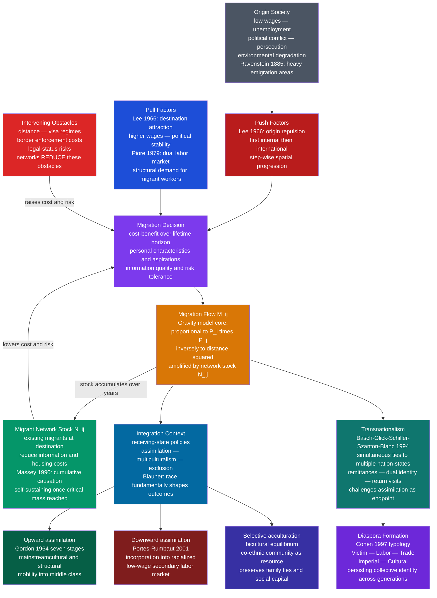

# Migration and Diaspora

> [!abstract] TL;DR
> Migration is not a random scatter of individuals in search of better wages — it is a structured, self-amplifying social process driven by the interaction of macro-level economic forces, state policies, and migrant social networks; and the diaspora communities those flows produce maintain ongoing ties to multiple societies simultaneously, challenging the assumption that immigrants cleanly "leave one world and enter another."

---

## Intuition — analogy FIRST

**Analogy:** Imagine a hiking trail that barely exists — overgrown, unsigned, and crossed only by the most determined walkers. Then one hiker cuts through and tells her cousin about it. The cousin goes. They both tell their village. Within a decade the path is worn smooth, there are waypoints, shortcuts are mapped, and people who never would have dared the original jungle are walking it comfortably. The trail did not change in physical difficulty; what changed was the network of knowledge and trust around it.

That is migration. The physical distance between Guadalajara and Los Angeles, or between Dhaka and Dubai, does not change. What changes is whether you have a brother-in-law at the destination who will let you sleep on his sofa the first three weeks, tell you which contractor hires without papers, and wire money home if the journey goes wrong. Migrant networks reduce the *effective* cost of migration — not by subsidizing bus fares but by converting a leap of faith into a calculated step. Once that network reaches critical mass, migration becomes self-sustaining regardless of the original conditions that started it. That is Douglas Massey's theory of cumulative causation, and it is the organizing engine of modern migration sociology.

---

## How It Works



---

## Key Concepts

### Secondary Level

**Types of Migration**

Migration is the movement of people across a significant boundary with the intention of changing residence, at least temporarily. Before applying theory, four distinctions matter:

| Axis | Type A | Type B |
|------|--------|--------|
| Scale | **Internal** — within one country (rural-urban) | **International** — crossing a national border |
| Motivation | **Voluntary** — seeking better conditions | **Forced** — fleeing violence, disaster, persecution |
| Duration | **Permanent** — intending to settle | **Temporary / circular** — seasonal labour, sojourning |
| Legal status | **Regular** — visa or residency permit | **Irregular / undocumented** — outside legal frameworks |

These categories interact. A Mexican agricultural worker in California may be voluntary, temporary, and undocumented simultaneously. A Syrian refugee to Germany is forced, international, and may become permanent. Legal status is not a simple binary — it is produced by the interaction of legal regimes and particular life histories, and it changes over time.

**Ravenstein's Laws of Migration (1885)**

E. G. Ravenstein's study of English census data produced the first empirical generalisations about migration patterns, still remarkably durable:

1. **Most migrants travel only short distances** — migration is distance-decayed. The majority of moves are local or regional, not intercontinental.
2. **Migration proceeds step-by-step** — rural populations first migrate to nearby towns; town populations fill the gaps of those who moved to cities; long-distance migration is chained through intermediate points.
3. **Every migratory current produces a counter-current** — migration flows generate return flows, though typically smaller.
4. **Urban natives migrate less than rural inhabitants** — the countryside generates emigration; cities generate in-migration.
5. **Women migrate more than men within their country of birth; men predominate in long-distance international migration** (a 19th-century finding now partially reversed in many corridors).
6. **Most migrants are adults** — the very young and old are underrepresented.
7. **Economic motives dominate** — migration responds primarily to labour market differentials.

Ravenstein had no sociological theory of *why* these patterns emerged. That came with the 20th-century frameworks below.

**The Push-Pull Model (Lee 1966)**

Everett Lee's *A Theory of Migration* (1966) systematised the folk wisdom of "people leave bad places for good ones" into a formal framework with four components:

1. **Factors at the origin** — some push migrants away (unemployment, poverty, conflict, crop failure, political repression) and some hold them back (family ties, familiarity, land ownership, fear of the unknown).
2. **Factors at the destination** — some attract migrants (higher wages, employment, safety, family reunion) and some repel them (cost of living, housing scarcity, discrimination, hostility).
3. **Intervening obstacles** — physical distance, the financial cost of moving, visa requirements, border enforcement, and language barriers; these are neither at origin nor destination but shape the feasibility of movement.
4. **Personal characteristics** — individual responses to the same push-pull balance vary with age, education, risk tolerance, family obligations, and access to information.

The push-pull model is intuitive and maps onto policy: politicians who want to reduce immigration debate whether to reduce push factors (by developing origin countries) or increase obstacles (by tightening borders). Its main limitation is that it treats migration as an individual economic calculation, missing the role of social networks and the way migration systems become self-sustaining.

**Basic Definitional Distinctions**

| Term | Definition | Legal Source |
|------|-----------|-------------|
| **Immigrant** | Person who enters a country to settle permanently | National immigration law |
| **Refugee** | Person outside their country who cannot return due to well-founded fear of persecution based on race, religion, nationality, political opinion, or membership of a particular social group | 1951 UN Refugee Convention |
| **Asylum seeker** | Person who has applied for refugee status but whose claim has not yet been determined | National asylum procedures under international law |
| **Internally displaced person (IDP)** | Displaced by conflict or disaster but still within their own country — NOT covered by the 1951 Convention | No binding international legal framework |
| **Economic migrant** | Moves primarily for economic reasons; does not qualify for refugee protection unless conditions meet Convention criteria | Contested; the distinction between "economic" and "forced" migration is often politically constructed |
| **Diaspora** | A population dispersed across multiple countries that maintains an ongoing collective identity tied to a real or imagined homeland | Analytical category, not legal status |

The UNHCR counted 108 million forcibly displaced people globally at end-2022 — the highest number ever recorded. Of these, 35.3 million were refugees, 62.5 million internally displaced. The distinction matters enormously for legal protection and state obligations.

---

### Undergraduate Level

**Network Theory of Migration: Massey and Cumulative Causation**

Douglas Massey and colleagues' *Worlds in Motion* (1998) synthesised a research programme spanning Mexican, European, and Asian migration corridors around a single central insight: once migration begins, it creates social structures that perpetuate it independently of the original conditions.

The mechanism is **social capital**. Every migrant who settles at a destination accumulates information, skills, connections, and resources that can be shared with potential future migrants from the same origin. A second-generation Mexican-American in Los Angeles who tells his cousin in Oaxaca which growers hire undocumented workers, where to find cheap housing in East LA, and how to wire money home has dramatically lowered the effective cost of the cousin's migration. The cousin needs less savings, faces less risk, and needs to make fewer decisions under uncertainty.

Formally, Massey models this through **cumulative causation**: each wave of migration alters social conditions at origin and destination in ways that generate further migration. At the origin: each migrant who leaves creates a vacancy, shifts cultural norms toward migration as a normal life strategy, and sends remittances that raise expectations without necessarily providing enough capital to stop future out-migration. At the destination: each established community attracts further migrants from the same origin, creating ethnic enclaves with housing, employment, and social networks concentrated in specific urban districts.

The empirical consequence: migration corridors — specific origin-to-destination flows — tend to persist and concentrate even when push and pull factors moderate. The Mexico-US corridor persisted through US recessions, NAFTA trade changes, and stepped-up border enforcement because it had reached critical mass: the network capital was sufficient to keep flows moving regardless of the current wage differential. *The corridor took on a life of its own.* This is why Massey calls migration systems "self-perpetuating social processes" rather than individual economic decisions.

**Dual Labor Market Theory: Piore**

Michael Piore's *Birds of Passage* (1979) made the structural argument that advanced industrial economies do not accidentally create demand for immigrant labour — they *require* it as a structural consequence of how labour markets are organised.

Piore's dual labour market:

| Segment | Characteristics | Typical Workers |
|---------|----------------|-----------------|
| **Primary sector** | Stable employment, career ladders, union protection, higher wages, social prestige | Native workers with social ties, education, and bargaining power |
| **Secondary sector** | Unstable, seasonal, low-wage, physically demanding, dangerous, low social status; no promotion ladders | Workers who accept these conditions: initially migrants, later racially marginalised minorities |

Why can't native workers fill the secondary sector? Piore's answer: in advanced societies, work is embedded in social status hierarchies. A native worker who takes a job picking lettuce or cleaning hotel rooms signals downward mobility relative to their community. They resist secondary-sector work not because the wages are insufficient but because the social meaning is intolerable. Immigrant workers, by contrast, have a *dual frame of reference*: they compare their California picking wages to agricultural wages in Oaxaca, not to California industrial wages. What is low status in one society is high earnings by the reference frame of another — a classic sociological insight about the relativity of status.

The policy implication is uncomfortable: restrictionist immigration policy runs against structural economic demand. When employers cannot hire immigrants formally, they hire them informally. The demand does not go away; it goes underground. The state's enforcement creates illegality without eliminating the underlying labour demand that produces migration.

**Transnationalism: Basch, Glick-Schiller, and Szanton-Blanc**

The "transnationalism" turn in migration studies emerged from Linda Basch, Nina Glick-Schiller, and Cristina Szanton-Blanc's *Nations Unbound* (1994). Their central argument was a methodological critique: prior migration scholarship was trapped in **methodological nationalism** — it assumed that migrants were in the process of leaving one bounded national society and entering another, with assimilation being the natural endpoint. Real migrants did not behave that way.

Basch et al. studied Caribbean and Filipino migrants in New York who maintained dense, ongoing ties to their home societies simultaneously with their US lives: they sent remittances, participated in hometown associations, maintained marriages and property across borders, voted in home-country elections (when permitted), and raised children who straddled two cultural worlds. These were not "unassimilated" migrants in a transitional phase — they were **transmigrants** who had built lives that spanned national borders as a stable, ongoing strategy.

The transnational framework reshaped the research agenda:

- Rather than asking "how assimilated are immigrants into the host society?" the question becomes "what are the simultaneous social fields migrants maintain across borders?"
- Rather than treating remittances as a temporary bridge until assimilation, they are understood as ongoing social and economic obligations within transnational family networks.
- Rather than treating migrant identity as transitional ("being between two worlds"), it is understood as genuinely plural — a permanent condition, not a phase.

**Diaspora: Cohen's Typology**

Robin Cohen's *Global Diasporas* (1997) provided the most used analytical typology of diaspora communities, based on the historical conditions under which populations became dispersed:

| Diaspora Type | Defining Conditions | Historical Examples |
|--------------|--------------------|--------------------|
| **Victim diaspora** | Dispersal caused by trauma — expulsion, genocide, enslavement | Jewish diaspora (multiple expulsions), African diaspora (transatlantic slavery), Armenian diaspora (1915 genocide) |
| **Labor diaspora** | Movement driven by labour demand under colonial or capitalist globalisation, often under coercive conditions | Indian indentured labour to the Caribbean and Fiji; Chinese "coolie" labour to Southeast Asia and the Americas |
| **Trade diaspora** | Merchant communities establishing trading networks across multiple societies | Lebanese diaspora in West Africa; Chinese business diaspora in Southeast Asia; Indian trading diaspora in East Africa |
| **Imperial diaspora** | Settlers and administrators dispersed through colonial projects | British diaspora in Australia, Canada, South Africa; Dutch/Afrikaner diaspora in southern Africa |
| **Cultural diaspora** | Dispersal based on soft cultural identification rather than forced movement or colonial extraction | Caribbean diaspora in the UK and North America; postwar Italian diaspora in Australia and Canada |

Cohen's typology distinguishes diaspora from simple emigrant communities: diaspora involves an ongoing, **conscious collective identity** tied to a real or imagined homeland, maintained across generations. The Jewish diaspora is the paradigm case: maintained over centuries, in dozens of countries, without a political state until 1948. The Palestinian diaspora is the contemporary equivalent: dispersed since 1948, maintaining collective identity across Lebanon, Jordan, Europe, and the Americas.

A critical refinement: William Safran (1991) identified six defining features of diaspora: dispersal from an original centre, a collective memory of the homeland, a belief that return is not (yet) possible, strong ethnic group consciousness maintained across generations, a relationship to the homeland that defines ethnic identity, and a sense that full acceptance in the host society is impossible or undesired. Not all migrant communities are diasporas; the term should be used selectively.

**Integration Debates: Assimilation, Multiculturalism, and Internal Colonialism**

The debate over how migrants should relate to receiving societies is both normative (how *should* they?) and empirical (what *actually* happens?). Three positions:

**Classical assimilation theory** (Milton Gordon, *Assimilation in American Life*, 1964) identified seven stages through which immigrant groups move toward full incorporation into the host society: cultural assimilation (acculturation to mainstream norms), structural assimilation (entry into mainstream social institutions), marital assimilation (intermarriage), identificational assimilation (shift in self-identity), attitude receptional assimilation (no prejudice), behavioural receptional assimilation (no discrimination), and civic assimilation (no value conflicts). Gordon argued that cultural assimilation is easy and happens first; structural assimilation is much harder and happens slowly. The Anglo-conformity model assumed that the destination culture was the normative endpoint.

**Multiculturalism** challenges the assimilation endpoint: rather than migrants conforming to a pre-existing national culture, diverse communities should be able to maintain their cultures within a shared civic framework. Will Kymlicka's *Multicultural Citizenship* (1995) gave this the strongest liberal-theoretical foundation: cultural membership is a primary good enabling autonomy; therefore, liberal states should accommodate and protect minority cultural communities rather than require their absorption. In practice, multicultural policies range from language accommodation and public funding for minority cultural organisations (Scandinavia, Canada, Netherlands until the 2000s) to more symbolic recognition without structural accommodation (United States).

**Blauner's internal colonialism** makes a more structural argument: for some groups, particularly people of colour in white-settler societies, "assimilation" and "integration" are misleading frameworks because these groups were incorporated not through voluntary immigration but through conquest, slavery, or coercive labour recruitment. Robert Blauner's *Racial Oppression in America* (1972) argued that African Americans, Native Americans, and Mexican Americans occupy a structurally different position from European immigrant groups — one shaped by internal colonialism rather than immigration — and therefore the assimilation model, which assumes voluntary entry into a host society, misrepresents their structural situation.

This is the intellectual foundation for understanding why "race" is not just one more variable in immigration outcomes but a fundamental structuring dimension.

---

### Graduate Level

**Segmented Assimilation: Portes and Rumbaut**

Alejandro Portes and Rubén Rumbaut's *Legacies: The Story of the Immigrant Second Generation* (2001) challenged the teleological assumption of classical assimilation theory: integration into the receiving society does not automatically produce upward mobility. Based on large-scale longitudinal data on second-generation youth in Miami and San Diego, they identified three distinct pathways:

1. **Upward assimilation** — the classic melting-pot path. Children of immigrants acculturate to mainstream middle-class culture, achieve educational credentials, and enter the primary labour market. Associated with: professional/managerial class parents, legal status, proximity to strong co-ethnic professional communities, race (lighter-skinned groups face fewer structural barriers).

2. **Downward assimilation** — the counterintuitive path in which second-generation youth assimilate successfully into the culture of the American underclass rather than the mainstream. Associated with: inner-city residence, racialised minorities with dark skin tones, weak ethnic community institutions, parents in secondary labour markets, exposure to peer cultures hostile to academic achievement ("acting white" dynamics). These youth adopt the oppositional culture of disadvantaged US minorities and experience downward social mobility relative to their immigrant parents.

3. **Selective acculturation** — a third path in which the second generation maintains strong ties to the co-ethnic community while selectively adopting mainstream cultural elements. Bilingualism is preserved. Co-ethnic networks provide social capital (jobs, mentoring, housing) while children integrate structurally through schools and labour markets. Associated with: strong ethnic enclave economies (Cuban Americans in Miami, Vietnamese in Orange County), high social cohesion, immigrant professional or entrepreneurial class parents.

The critical variable distinguishing path 1 from path 2 is not simply immigrant characteristics but the **context of reception**: the combination of government policy toward the group (welcome vs. persecution), host society reception (positive vs. hostile), and the characteristics of the co-ethnic community (resources vs. absence). Cuban exiles received warm government reception, community loans, and professional network integration; Haitian and Central American economic migrants received suspicion, legal instability, and dispersal into deprived urban zones. The same level of individual human capital produces different outcomes in different contexts of reception.

**The Politics of Illegality: De Genova**

Nicholas De Genova's *Working the Boundaries* (2005) and his seminal 2002 article "Migrant 'Illegality' and Deportability in Everyday Life" made a sharp argument: "illegality" — the undocumented status of millions of migrants — is not simply the inevitable consequence of migration in excess of legal channels. It is **socially produced** by specific immigration law regimes, and it serves a specific economic and political function.

De Genova's argument runs as follows: the US-Mexico border has historically been managed so as to maximise the availability of low-wage Mexican labour while maintaining the *deportability* of that labour force. The 1924 National Origins Act created numerical quotas for the Eastern Hemisphere but imposed none for the Western Hemisphere (effectively guaranteeing a large pool of legally flexible Mexican labour). The Bracero Program (1942–1964) created a legal template for Mexican agricultural labour, then was ended in a way that created illegal flows following the same structural channels. The 1986 IRCA's employer sanctions were never seriously enforced. The pattern: legal frameworks create undocumented status not to eliminate the labour but to make the labour manageable — an undocumented worker cannot easily change employers, cannot organise collectively without risk, cannot demand OSHA enforcement, and cannot sue for wage theft. *Deportability — the ever-present threat of deportation — disciplines the undocumented workforce far more effectively than actual deportation*.

The policy consequence De Genova identifies is a kind of "revolving door": immigration enforcement spectacles at the border serve a political function (demonstrating sovereign control to the electorate) while the interior enforcement that would actually remove labour is minimal. The result is a permanent reserve of deportable labour power — which is precisely what employers of undocumented workers require.

This analysis draws on Marx's concept of the "reserve army of labour" and extends it to the production of legal status itself as an instrument of labour market control.

**Remittances and the Migration-Development Nexus**

Migrants collectively transferred an estimated $831 billion in remittances to low- and middle-income countries in 2022 (World Bank) — approximately three times the volume of official development assistance (ODA). This fact has driven enormous debate about whether migration is a development strategy for sending countries.

The **optimist position** (Hein de Haas, Devesh Kapur): remittances represent a form of "development from below" (Guarnizo 2003) that bypasses corrupt state structures and reaches households directly. Remittances are countercyclical — they rise when sending countries experience crises, unlike FDI which flees. They fund education, health spending, housing construction, and small business formation. In El Salvador, Honduras, the Philippines, and Nepal, remittances constitute 15-30% of GDP — a fiscal resource no development bank could match.

The **pessimist position** (structuralist): remittances are generated by and feed back into the migration system without transforming the structural conditions that produced emigration. They are predominantly consumed — spent on goods, housing, and education — rather than invested productively. They can generate local inflation and Dutch-disease-style competitiveness effects (as the dollar-denominated inflows appreciate the exchange rate). Brain drain from peripheral to core countries transfers human capital investment — made at public expense — to wealthy countries. Nurses trained in the Philippines or engineers from sub-Saharan Africa who emigrate represent a subsidy from periphery to core that no remittance flow compensates for. The structural inequality that drives migration remains intact, and may be reinforced: households with migrant members gain resources to compete in the labour market, but the communities they leave behind lose their most mobile, able-bodied workers.

The **macro-sociological synthesis** (Massey, Arango et al.): the migration-development nexus is a world-systems problem. Migration flows predominantly from semi-peripheral to core countries, following the channels cut by colonial economic relations and continued through foreign investment, trade penetration, and IMF-structural-adjustment-induced labour market disruptions. In other words, the same global economic forces that produce periphery underdevelopment *produce* the migration flows. Remittances are endogenous to the system: they ameliorate individual household conditions without resolving the structural inequality that made migration necessary in the first place. Saskia Sassen-Koob's *The Mobility of Labor and Capital* (1988) made this argument first: capital mobility (FDI, investment flows from core to periphery) creates the conditions — disruption of local economies, integration into global labour markets — that subsequently produce *labour* mobility from periphery to core.

**Refugee Sociology and the 1951 Convention**

Refugee sociology sits at the intersection of international law, forced migration studies, and the political sociology of humanitarianism.

The 1951 Refugee Convention and its 1967 Protocol define a refugee as someone who has crossed an international border and faces a well-founded fear of persecution based on one of five grounds: race, religion, nationality, political opinion, or membership of a particular social group. Three features of this definition are analytically significant:

1. **It excludes IDPs** — the 65+ million internally displaced persons are not covered by the Convention. This is not an oversight but a structural consequence: the Convention was designed to manage *border-crossing* displacement in a world-system organised around sovereign states. IDPs remain the sovereign responsibility of the state that is often their persecutor.

2. **It excludes "economic migrants"** — the Convention refugee is a political victim, not an economic one. But this distinction is legally and empirically unstable: people fleeing the economic violence of a state that has deliberately starved a region, or farmers whose land is confiscated under a discriminatory ethnic land redistribution, may be simultaneously "economic" and "political" migrants. The distinction is enforced not because it reflects social reality but because it enables states to limit their protection obligations.

3. **The "social group" category** has expanded through case law to include women fleeing gender-based violence, LGBTQ+ individuals fleeing criminalisation, and people fleeing gang violence — but this expansion is contested, and asylum adjudicators in different countries reach radically different conclusions on the same facts.

The UNHCR's 2023 figure of 35.3 million refugees represents an unprecedented post-WWII peak, driven by displacement from Syria, Afghanistan, Ukraine, Sudan, and Myanmar. The international protection system is structurally under strain: the costs of refugee reception fall overwhelmingly on neighbouring developing countries (Bangladesh hosts 1 million Rohingya; Turkey hosts 3.6 million Syrians; Uganda hosts 1.5 million mixed nationalities), while wealthy states that could absorb far more and contributed to the conditions of displacement through foreign policy bear a small fraction of the burden.

---

## Python Demo

```python
import numpy as np
import matplotlib.pyplot as plt

# -------------------------------------------------------
# Network-Augmented Gravity Model of Migration
# (After Massey, Arango, Hugo et al. 1993, 1998)
#
# Standard gravity model:
#   M_ij = k * P_i^alpha * P_j^beta / d_ij^gamma
#
# Network-augmented version (Massey's cumulative causation):
#   M_ij(t) = k * P_i^alpha * P_j^beta / d_ij^gamma
#              * (1 + mu * N_ij(t))^delta
#
# Where:
#   N_ij(t) = cumulative stock of migrants from i settled in j
#   mu      = sensitivity to existing network stock
#   delta   = returns to network (< 1 = diminishing returns)
#
# Key insight: corridors with even a small initial stock
# grow faster over time than corridors with no network,
# creating self-sustaining chain migration independent of
# the original push-pull differential.
# -------------------------------------------------------

rng = np.random.default_rng(42)

N_ORIGINS = 4
N_DESTS   = 3
T         = 30

# Origin populations (millions) and economic pressure index
# (lower = more push force)
pop_orig   = np.array([10.0, 6.0, 15.0, 4.0])
econ_orig  = np.array([0.9,  1.0,  0.75, 1.0])

# Destination populations and wage premium (Piore: structural demand)
pop_dest   = np.array([60.0, 90.0, 40.0])
wage_prem  = np.array([3.2,  4.5,  2.5])

# Distance matrix (origin i x destination j) — normalised units
# Represents combined geographic and policy-induced friction
dist = np.array([
    [1.0, 3.0, 5.0],
    [2.5, 1.0, 3.5],
    [4.0, 2.0, 1.0],
    [1.5, 4.0, 2.5],
])

# Gravity model parameters
k     = 0.0010
alpha = 0.70    # origin population elasticity
beta  = 0.85    # destination population elasticity
gamma = 1.90    # distance decay (Ravenstein: steep decay)
mu    = 0.04    # network sensitivity (each person in stock reduces cost)
delta = 0.75    # diminishing returns to network size

# Initial network stocks
# Origin 0 → Dest 0 and Origin 2 → Dest 2 have established communities
# representing e.g. Mexican community in LA, Filipino community in Dubai
N = np.zeros((N_ORIGINS, N_DESTS))
N[0, 0] = 8_000
N[2, 2] = 5_000

# Base gravity flow (time-invariant: population, distance, wage premium)
base = np.zeros((N_ORIGINS, N_DESTS))
for i in range(N_ORIGINS):
    for j in range(N_DESTS):
        base[i, j] = (
            k
            * (pop_orig[i] ** alpha)
            * (pop_dest[j] ** beta)
            * wage_prem[j]
            * econ_orig[i]
            / (dist[i, j] ** gamma)
        )

# Simulate T periods: flows update stock; stock feeds back into flows
flow_hist  = np.zeros((T, N_ORIGINS, N_DESTS))
stock_hist = np.zeros((T + 1, N_ORIGINS, N_DESTS))
stock_hist[0] = N.copy()

for t in range(T):
    for i in range(N_ORIGINS):
        for j in range(N_DESTS):
            network_factor = (1.0 + mu * N[i, j]) ** delta
            flow = base[i, j] * network_factor * rng.uniform(0.92, 1.08)
            flow_hist[t, i, j] = flow
            N[i, j] += flow
    stock_hist[t + 1] = N.copy()

# -------------------------------------------------------
# Visualisation
# -------------------------------------------------------
fig, axes = plt.subplots(2, 2, figsize=(14, 9))
fig.suptitle(
    "Chain Migration Dynamics: Network-Augmented Gravity Model\n"
    "(Massey et al. — Cumulative Causation Creates Self-Sustaining Flows)",
    fontsize=12, fontweight="bold",
)

t_axis = np.arange(T)

# Corridors to track
corridors = [
    ("O1 to D1 (initial stock: 8 000)", 0, 0, "#1d4ed8", "-"),
    ("O1 to D2 (no initial stock)",     0, 1, "#1d4ed8", "--"),
    ("O3 to D3 (initial stock: 5 000)", 2, 2, "#dc2626", "-"),
    ("O3 to D1 (no initial stock)",     2, 0, "#dc2626", "--"),
    ("O2 to D2 (no stock, high wage)",  1, 1, "#059669", "-."),
]

# Panel A: Annual migration flows over time
ax = axes[0, 0]
for label, i, j, col, ls in corridors:
    ax.plot(t_axis, flow_hist[:, i, j], label=label, color=col, lw=2.2, ls=ls)
ax.set_title("Annual Migration Flows by Corridor\n(solid = has initial network; dashed = no network)")
ax.set_xlabel("Time period")
ax.set_ylabel("Annual migrants (persons)")
ax.legend(fontsize=7.5)
ax.grid(True, alpha=0.3)

# Panel B: Cumulative migrant stock
ax = axes[0, 1]
for label, i, j, col, ls in corridors[:4]:
    ax.plot(np.arange(T + 1), stock_hist[:, i, j], label=label, color=col, lw=2.2, ls=ls)
ax.set_title("Cumulative Migrant Stock\n(Massey's Social Capital Accumulation)")
ax.set_xlabel("Time period")
ax.set_ylabel("Cumulative migrants settled")
ax.legend(fontsize=7.5)
ax.grid(True, alpha=0.3)

# Panel C: Network amplification factor over time
ax = axes[1, 0]
for label, i, j, col, ls in corridors[:4]:
    amp = (1 + mu * stock_hist[:T, i, j]) ** delta
    ax.plot(t_axis, amp, label=label, color=col, lw=2.2, ls=ls)
ax.axhline(1.0, color="black", lw=0.9, ls=":", label="Base rate (no network)")
ax.set_title("Network Amplification Factor\n(How Stock Multiplies Base Migration Probability)")
ax.set_xlabel("Time period")
ax.set_ylabel("Amplification factor (x base flow)")
ax.legend(fontsize=7.5)
ax.grid(True, alpha=0.3)

# Panel D: Share of total system flow at t=0 vs t=T-1
ax = axes[1, 1]
flow_t0 = flow_hist[0].flatten()
flow_tT = flow_hist[T - 1].flatten()
labels_bars = [f"O{i+1}->D{j+1}" for i in range(N_ORIGINS) for j in range(N_DESTS)]
x_pos = np.arange(len(labels_bars))
w = 0.38
ax.bar(x_pos - w / 2, flow_t0 / flow_t0.sum() * 100, w,
       label="t=0 (nascent)", color="#1d4ed8", alpha=0.8)
ax.bar(x_pos + w / 2, flow_tT / flow_tT.sum() * 100, w,
       label=f"t={T-1} (mature)", color="#dc2626", alpha=0.8)
ax.set_xticks(x_pos)
ax.set_xticklabels(labels_bars, rotation=45, ha="right", fontsize=7)
ax.set_ylabel("Share of total system flow (%)")
ax.set_title("Flow Concentration Over Time\n(Network Channels Lock In Specific Corridors)")
ax.legend(fontsize=8)
ax.grid(True, alpha=0.3, axis="y")

plt.tight_layout()
plt.savefig("chain_migration_model.png", dpi=150)
plt.show()

# Print network multiplier summary
print("\nNetwork effect at end of simulation (t=29):")
print(f"{'Corridor':<22} {'Base flow':>12} {'Final flow':>12} {'Final stock':>13} {'Multiplier':>12}")
print("-" * 73)
for i in range(N_ORIGINS):
    for j in range(N_DESTS):
        bf   = base[i, j]
        af   = flow_hist[T - 1, i, j]
        stk  = stock_hist[T, i, j]
        mult = af / bf if bf > 0 else 0.0
        print(f"Origin {i+1} -> Dest {j+1}      {bf:>12.1f} {af:>12.1f} {stk:>13.0f} {mult:>11.1f}x")
```

**What the simulation demonstrates sociologically:**

Panel A shows the divergence that Massey's theory predicts: corridors with even a modest initial network stock pull ahead of structurally similar corridors (same origin population, similar distance, same wage differential) that lack the network. Panel C isolates the mechanism: the amplification factor rises continuously for stocked corridors and stays flat at 1.0 for unstocked ones. Panel D shows the mature-system concentration: a small number of corridors with established communities capture a disproportionate share of total migration flows — reproducing the empirical pattern that real-world migration is highly corridor-concentrated. The Mexico-US, Turkey-Germany, Morocco-France, and India-Gulf corridors dominate their respective regions not because of uniquely favourable push-pull balances but because historical accident and colonial economic ties created early network seeds that compounded over decades.

---

## Real-World Applications

**The Mexico-US Migration System: Cumulative Causation in Practice**

The Mexico-US migration corridor is the world's largest bilateral migration flow — an estimated 37 million Mexican-born immigrants or Mexican-Americans in the US at the 2020 census, with an undocumented population estimated at 4-5 million at any time. Massey's cumulative causation model was tested and refined primarily on this corridor.

The system's historical origins lie not in individual push-pull decisions but in colonial-era labour recruitment: the railroads that built the US Southwest were built with Mexican labour from the 1880s. The Bracero Program (1942–1964) formalised circular agricultural labour migration, creating settled Mexican communities in California, Texas, and Illinois that constituted the network stock for post-Bracero migration. When the Bracero Program ended, the labour demand and the networks did not — they simply redirected from legal circular migration to undocumented settlement. The 1986 IRCA amnesty legalised 2.7 million undocumented Mexicans, which, Massey argues, paradoxically *increased* family reunification-driven immigration by giving the legalised cohort access to sponsoring visas for family members.

By the 2000s, the Mexico-US corridor had reached what Massey calls "mature" system status: migration flows persisted even as Mexican wages rose relative to US wages, even as US border enforcement intensified (tripling in funding between 1993 and 2010), and even as the US economy contracted in 2008. The enforcement intensification had a perverse consequence — rather than deterring migration, it raised the cost of undocumented crossing (driving migrants into more dangerous desert routes) and, crucially, *reduced circularity*. Previously, many Mexicans worked seasonally and returned home. Heightened border risk meant that once the crossing was made, migrants stayed permanently rather than risk re-crossing. Net undocumented immigration may have *increased* in response to enforcement — a counterintuitive empirical finding documented by Massey, Durand, and Malone in *Beyond Smoke and Mirrors* (2002).

**The Indian Diaspora: A Multi-Type Case**

India's diaspora is one of the world's largest — approximately 18 million Indian-born people living outside India — and spans all five of Cohen's diaspora categories simultaneously, depending on the historical period and destination:

- **Labor diaspora** (19th-20th c.): Indian indentured labourers were transported under British colonial administration to Fiji, Mauritius, Trinidad, Guyana, South Africa, and Kenya following the abolition of slavery. Indentured labour was legally distinct from slavery but practically coercive — workers were locked into multi-year contracts they could not exit without legal penalty, in locations entirely controlled by planters. These communities are now several generations settled in their respective countries.
- **Trade diaspora** (19th-21st c.): Gujarati and Sindhi merchants established trading networks across East Africa, Southeast Asia, and the UK. The East African Asian community (largely Indian-origin traders and professionals who migrated to Kenya, Uganda, and Tanzania under British colonial facilitation) was expelled by Idi Amin from Uganda in 1972 — a trauma that transformed this trading diaspora into a victim diaspora element.
- **Professional/contemporary diaspora** (post-1965): The 1965 US Hart-Celler Act abolished national-origin quotas and introduced a skills-preference system, triggering high-skilled Indian immigration to the US. Indian-born tech workers now dominate the H-1B visa category; Indian-Americans are the highest-earning ethnic group in the US by median household income. This community practices transnationalism intensively — remittances, investment in Indian tech startups, and political engagement with both Indian and US governments.

The Indian state engages this diaspora instrumentally through "diaspora diplomacy": the Overseas Citizenship of India (OCI) card offers dual-citizenship-like privileges; Prime Minister Modi's Madison Square Garden rally in 2014 drew 19,000 Indian-Americans in a display of diaspora political mobilisation. The state-diaspora relationship is not one-directional: the diaspora also shapes Indian domestic politics, culture (Bollywood's global reach), and economic development through FDI and remittances.

**Germany's Turkish Guest Workers: From Temporary Labour to Permanent Community**

Germany's *Gastarbeiter* (guest worker) programme (1955–1973) was designed as a temporary labour solution: Turkey, Yugoslavia, and other countries would supply seasonal labour for German industry; workers would rotate every two years and return home. The theory of rotation contradicted the sociology of labour: employers invested in training workers and resisted rotation; workers accumulated social and economic ties; families began reuniting under family reunification rights. By the time Germany ended recruitment in 1973 amid the oil crisis, the workers were already there — and stayed.

The Turkish-German community today (approximately 3 million, with a total Turkish-origin population of 4-5 million including German-born generations) became the paradigm case for integration debates in Europe. Germany's *Jus soli* citizenship law did not apply to children of non-EU nationals until 2000, meaning that Turkish-origin children born in Germany were legally foreigners in their country of birth. The integration failure discourse blamed the Turkish community; the structural analysis pointed to citizenship law as the mechanism that prevented integration.

Segmented assimilation theory maps directly onto this case: German-born children of Turkish workers faced a "downward assimilation" risk into the low-wage secondary labour market, not because of individual cultural deficiency but because: (a) parents were disproportionately in low-wage industrial jobs with no promotion ladders, (b) residential segregation in industrial urban districts limited access to quality schools, and (c) legal status uncertainty discouraged long-term educational investment. The Turkish community in Germany also developed strong transnational characteristics — Turkish media, Turkish political party affiliations, and dual identity — precisely because German society's legal and cultural frameworks made full integration difficult.

---

## Common Pitfalls

- **Treating "refugee" and "economic migrant" as a natural binary** — The legal distinction is politically consequential (it determines who receives protection) but sociologically artificial. Structural violence — sustained deprivation, state predation, climate-driven resource collapse — does not produce a persecution event with a specific five-ground qualification under the 1951 Convention. The people walking from Venezuela to Colombia or from Central America to the US-Mexico border are fleeing combinations of gang violence, state failure, economic collapse, and climate stress that no clean binary captures. Using the legal distinction as an analytic category reproduces the state's classification of its own obligations.

- **Conflating assimilation with integration success** — Gordon's assimilation model describes one possible integration pathway, not a metric of success. A second-generation immigrant who is fully acculturated, structurally incorporated, and identifies as "American" may have achieved assimilation at the cost of language, cultural practices, and family networks. A second-generation immigrant who maintains bilingualism, co-ethnic community ties, and selective acculturation may have better labour market outcomes, psychological wellbeing, and family stability. Portes and Rumbaut's data showed the "segmented assimilation" finding precisely because they measured outcomes, not acculturation.

- **Misreading remittances as a substitute for development** — The empirical scale of remittances ($831 billion in 2022) is genuine and impactful for receiving households. The error is inferring that migration is therefore "good for development." Brain drain, the perpetuation of structural inequality that requires migration as coping strategy, the reproductive costs borne by origin families who maintain children without migrant parents, and the political costs of demographic depletion are all unmeasured in aggregate remittance figures.

- **Treating migrant networks as uniformly positive** — Massey's network theory emphasises how networks lower migration costs and sustain flows. But networks also channel migrants into specific labour market niches that can become traps: if all Bangladeshi workers recruited to construction in the Gulf are sourced through a small number of recruiting agents who extract high fees, those networks are simultaneously enabling migration and extracting rents from it. Networks transmit exploitation as well as opportunity.

- **Assuming transnationalism is new** — Scholars sometimes present the transnational practices of contemporary migrants as a novelty enabled by telecommunications and cheap air travel. Historically, the Jewish, Chinese, Indian, and Lebanese merchant diasporas maintained dense cross-border ties through letters, family networks, and periodic travel for centuries. The scale, speed, and cost of transnational communication have changed; the social form has not.

- **Conflating diaspora with immigrant community** — Not all immigrant communities become diasporas. A diaspora requires a sustained collective identity tied to a real or imagined homeland, maintained across generations, with a sense that full belonging in the host society is incomplete. Many immigrant communities assimilate fully within two or three generations and cease to reproduce diaspora identity. The analytical category should be used selectively, not applied to any ethnic minority community.

- **Applying De Genova's illegality framework without historical specification** — De Genova's argument is specific to the US-Mexico context and the historical production of that legal regime. The claim that "illegality serves economic functions" does not mean all states produce undocumented migration strategically; some states genuinely attempt and partially succeed at legal control. The framework should be applied by asking: what are the specific legal-historical conditions that produced this particular undocumented population, and what interests does the maintenance of their undocumented status serve?

---

## Related Concepts

- [[_MOC_Social_Networks_and_Community|↑ Social Networks and Community MOC]] — Section entry point and concept map for this section

- [[Race_Ethnicity_and_Racism]] — racial formation theory (Omi and Winant) is essential for understanding why migrants of colour face structurally different integration contexts than European immigrants; Blauner's internal colonialism framework draws the distinction between immigrant and colonized minorities
- [[Global_Inequality_and_Development]] — world-systems theory and core-periphery analysis explain why migration flows predominantly from semi-peripheral to core countries; Sassen-Koob's argument that capital mobility generates subsequent labour mobility connects these notes directly
- [[Intersectionality]] — migrant experiences are shaped by the intersection of legal status, race, gender, class, and nationality simultaneously; undocumented women face compounded vulnerabilities that neither "immigrant" nor "woman" as single categories capture
- [[Poverty_Social_Mobility_and_Life_Chances]] — migration as a household livelihood strategy for social mobility; the empirical question of whether migration actually improves inter-generational social mobility for sending families
- [[Social_Class_and_Stratification]] — class position shapes who can migrate (high-skill versus low-skill migration regimes), who receives reception resources, and which integration path (upward vs. downward assimilation) is available
- [[Socialization_and_the_Self]] — identity formation in diaspora and second-generation contexts; Goffman's stigma framework applies to undocumented status; "third culture kids" as a distinct socialization context
- [[Culture_Norms_Values_and_Ideology]] — acculturation as cultural change; multicultural policy as a normative position about cultural pluralism; the assimilation-multiculturalism debate is fundamentally about what a society's cultural norms should require of newcomers
- [[Family_Marriage_and_Kinship]] — transnational family structures challenge the assumption that the family is a co-resident unit; remittances are obligations within extended family networks; "left-behind" children and the feminization of migration
- [[Conflict_Theory_and_Critical_Theory]] — structural conflict theory underpins dependency and world-systems accounts of migration; De Genova's illegality argument is explicitly neo-Marxist; critical race theory informs the analysis of racial categorisation in migration regimes
- [[Social_Movements_and_Revolution]] — migrant rights movements (DREAM Act mobilisation, the March 2006 US immigration marches of 1-2 million people, sans-papiers movements in France) as collective political action by non-citizen populations
- [[Prejudice_and_Discrimination]] — social psychology of anti-immigrant prejudice; contact hypothesis and its limits when migrants are residentially segregated; scapegoating dynamics during economic downturns
- [[Group_Dynamics]] — co-ethnic community formation, in-group solidarity, and out-group dynamics in migrant enclaves; intergroup conflict between established minority communities and newly arriving migrants
- [[Stress_and_Coping]] — acculturation stress as a specific stressor category; the mental health costs of undocumented status and deportation anxiety; refugee trauma and PTSD; the "healthy migrant effect" (newly arrived migrants are healthier than native populations on average but converge downward over time)
- [[Globalization_and_Its_Discontents]] — globalization's distributional consequences produce the migration pressure Massey describes; Rodrik's trilemma implies that deep economic integration constrains national migration control; the political backlash against globalization is also a backlash against immigration
- [[Human_Rights_and_International_Law]] — the 1951 Refugee Convention is the primary international legal instrument for forced migration; non-refoulement as the foundational principle; the gap between Convention obligations and state practice
- [[Development_Economics]] — remittances as development finance; brain drain as a development cost; the "migration hump" (emigration initially increases with development before declining when wages converge); migration policy as development policy
- [[Unemployment]] — dual labour market theory predicts structural complementarity between migrant and native workers; empirical debate over whether immigration depresses native wages (Borjas) or raises them (Card); native workers' distributional concerns about labour market competition are not irrational, even if the aggregate effects are positive

---

## Review Questions

### Secondary

1. Lee's push-pull model explains migration as the result of negative conditions at the origin and positive conditions at the destination. Using a specific contemporary example (e.g., Syrian refugees to Europe, Venezuelan migrants to Colombia, Bangladeshis to the Gulf), identify at least two push factors, two pull factors, and one intervening obstacle that shapes who migrates and who does not.

2. Ravenstein's laws were based on 19th-century English census data. Which of his laws seem most durable today — still supported by contemporary evidence — and which seem most outdated? Give a reason for each answer.

3. Why does the distinction between a "refugee" and an "economic migrant" matter legally, and why is it sociologically problematic? Give an example of a migrant population whose situation makes the distinction difficult to apply.

### Undergraduate

1. Massey argues that migration networks make migration self-sustaining through cumulative causation. How does this theory explain why the Mexico-US migration corridor persisted and even expanded during the US economic recession of 2008-2009 and despite tripling of border enforcement budgets? What does the persistence of that flow imply for the effectiveness of enforcement-only immigration policy?

2. Portes and Rumbaut identify three paths for the second generation: upward assimilation, downward assimilation, and selective acculturation. What structural conditions — at the level of the receiving state, the labour market, the residential environment, and the co-ethnic community — determine which path is most likely for a given group? Use the contrast between Cuban Americans in Miami and Haitian Americans in Miami as an illustration.

3. Piore argues that advanced industrial economies structurally *require* immigrant labour for the secondary sector because native workers refuse to take secondary-sector jobs, not because of wage levels but because of the social meaning of those jobs. What does this imply for immigration policy in countries that simultaneously restrict immigration and face labour shortages in construction, agriculture, and food processing?

### Graduate

1. De Genova argues that "illegality" is socially produced by immigration law regimes and serves an economic function by creating a deportable workforce whose vulnerability disciplines labour. What is the full causal mechanism? How does De Genova's argument relate to Marx's concept of the "reserve army of labour"? What empirical evidence would support or falsify his claim that the US state systematically *maintains* undocumented labour pools rather than genuinely attempting to eliminate them?

2. Basch, Glick-Schiller, and Szanton-Blanc's concept of transnationalism is simultaneously an empirical observation and a methodological critique of how migration has been studied. What is "methodological nationalism" and why do they claim it distorts migration research? How does adopting a transnational frame change the research design for studying: (a) migrant integration outcomes, (b) the political participation of diaspora communities, and (c) the development impact of remittances?

3. The remittance-development nexus has been called "development from below" and also "an inadequate substitute for structural transformation." Drawing on Massey's cumulative causation model, world-systems theory's account of why migration flows from periphery to core, and the empirical evidence on remittance uses and brain drain costs, construct a synthesis that evaluates when and under what structural conditions remittances are likely to produce genuine development transformation versus when they are likely to reproduce the conditions of outmigration.

---

## Sources

- Douglas S. Massey, Joaquín Arango, Graeme Hugo, Ali Kouaouci, Adela Pellegrino & J. Edward Taylor, "Theories of International Migration: A Review and Appraisal," *Population and Development Review* 19(3), 1993
- Douglas S. Massey, Jorge Durand & Nolan J. Malone, *Beyond Smoke and Mirrors: Mexican Immigration in an Era of Economic Integration*, Russell Sage Foundation, 2002
- Douglas S. Massey, *Worlds in Motion: Understanding International Migration at the End of the Millennium*, Clarendon Press, 1998
- Everett S. Lee, "A Theory of Migration," *Demography* 3(1), 1966
- E. G. Ravenstein, "The Laws of Migration," *Journal of the Statistical Society of London* 48(2), 1885
- Michael J. Piore, *Birds of Passage: Migrant Labor and Industrial Societies*, Cambridge University Press, 1979
- Linda Basch, Nina Glick-Schiller & Cristina Szanton-Blanc, *Nations Unbound: Transnational Projects, Postcolonial Predicaments, and Deterritorialized Nation-States*, Gordon and Breach, 1994
- Robin Cohen, *Global Diasporas: An Introduction*, UCL Press, 1997
- Alejandro Portes & Rubén G. Rumbaut, *Legacies: The Story of the Immigrant Second Generation*, University of California Press, 2001
- Nicholas De Genova, "Migrant 'Illegality' and Deportability in Everyday Life," *Annual Review of Anthropology* 31, 2002
- Nicholas De Genova, *Working the Boundaries: Race, Space, and 'Illegality' in Mexican Chicago*, Duke University Press, 2005
- Saskia Sassen-Koob, *The Mobility of Labor and Capital: A Study in International Investment and Labor Flow*, Cambridge University Press, 1988
- Milton M. Gordon, *Assimilation in American Life: The Role of Race, Religion, and National Origins*, Oxford University Press, 1964
- Robert Blauner, *Racial Oppression in America*, Harper and Row, 1972
- Hein de Haas, "Migration and Development: A Theoretical Perspective," *International Migration Review* 44(1), 2010
- World Bank, *Migration and Development Brief 37: Remittances Brave Global Headwinds*, 2022
- UNHCR, *Global Trends: Forced Displacement in 2022*, UN High Commissioner for Refugees, 2023
- William Safran, "Diasporas in Modern Societies: Myths of Homeland and Return," *Diaspora* 1(1), 1991
- Alejandro Portes & Min Zhou, "The New Second Generation: Segmented Assimilation and Its Variants," *Annals of the American Academy of Political and Social Science* 530, 1993

---

#Sociology #SocialNetworks #Migration #Diaspora #Transnationalism #ChainMigration #PushPull #SegmentedAssimilation #RefugeeSociology #Remittances
