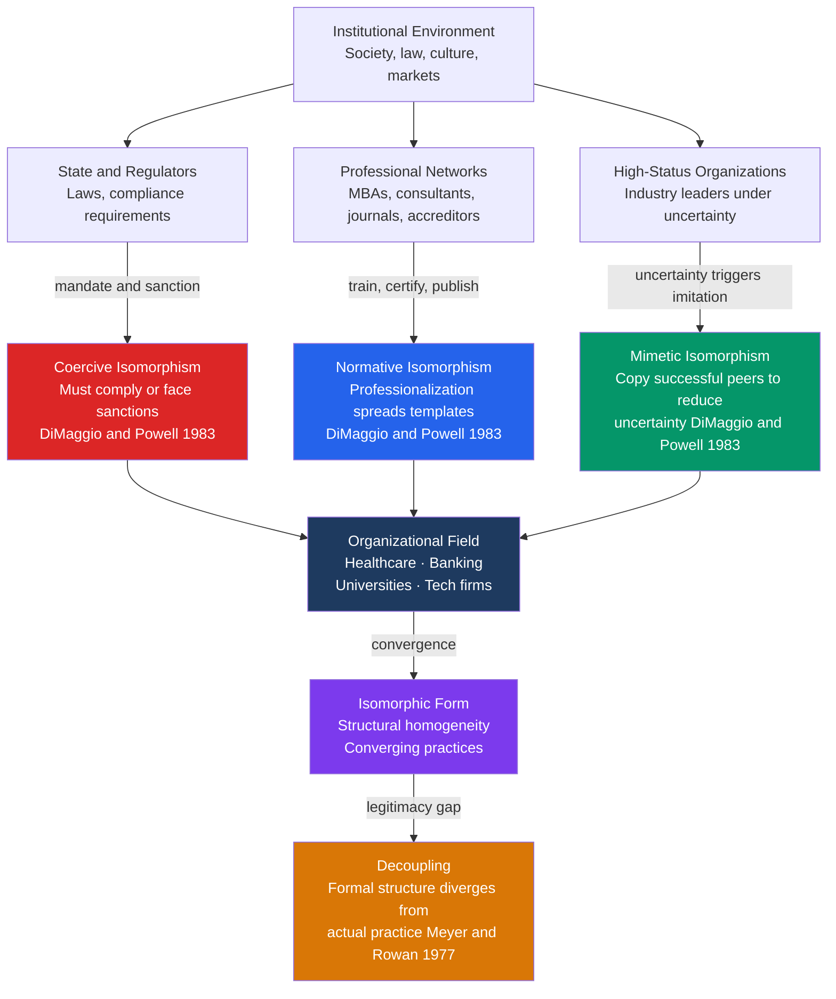

# Organizations and Formal Structures

> [!abstract] TL;DR
> Organizations are not merely rational instruments designed by managers to achieve goals — they are social structures shaped by history, power, institutional pressures, and cultural scripts that often have as much to do with legitimacy as with efficiency; neo-institutional theory shows that organizations in the same industry converge toward the same form not because it is optimal but because mimetic, normative, and coercive pressures make looking like everyone else safer than being genuinely different.

---

## Intuition

**Analogy:** Imagine every new restaurant that opens in a city over the past decade: reclaimed wood surfaces, exposed Edison bulbs, open kitchens, Instagram-worthy small plates, a "story" posted on chalkboard above the bar. No committee mandated this aesthetic. No efficiency study proved Edison bulbs improve revenue. Yet they all look the same. Some copied the successful restaurants nearby to reduce uncertainty (mimetic). Others hired chefs trained at culinary schools that teach what "modern casual dining" looks like (normative). All had to meet health-code inspections that required standard kitchen layouts (coercive). The result is homogeneity — not because one form is genuinely best, but because three separate pressures all pushed in the same direction.

This is DiMaggio and Powell's key insight about organizations writ large. A hospital, a university, an investment bank, and a Silicon Valley startup all eventually develop HR departments, mission statements, diversity committees, and sustainability reports — not because those structures improve core performance, but because the institutional environment rewards looking legitimate, and looking legitimate means looking like what a "proper" organization of your type looks like.

---

## How It Works



The diagram maps the institutional environment's three channels into organizational fields, the convergence they produce, and the decoupling gap where formal structure and actual practice diverge. Each of the theoretical schools below picks up one part of this picture and develops it into a full explanatory framework.

---

## Key Concepts

### Secondary Level

**What is a formal organization?** A formal organization is a deliberately constructed social unit that pursues specific goals through a division of labor, a hierarchy of authority, and explicit rules. Formal organizations differ from families or friendship groups in that membership is typically not ascriptive (you apply and are hired or admitted), roles are defined by the position rather than the person, and the organization has a legal identity independent of any individual member.

**Weber's ideal-type bureaucracy.** Max Weber argued that bureaucracy — the organizational form that pairs rational-legal authority with trained professional administration — was the most technically efficient form of large-scale organization ever devised. Its defining features:

| Feature | Description |
|---|---|
| Hierarchy of offices | Clear chain of command; each office supervises those below it |
| Formal written rules | Procedures codified so decisions are predictable and impersonal |
| Impersonality | Rules apply equally to everyone; relationships governed by role, not person |
| Qualification-based appointment | Staff selected on merit and credentials, not birth or patronage |
| Separation of office and officeholder | The office belongs to the organization; the officeholder cannot own or sell it |
| Fixed salaries and career progression | Staff are salaried employees, not fee-recipients; promotion on performance |

Weber called bureaucracy an "iron cage" — the system achieves efficiency by stripping away individual judgment, but in doing so imprisons human beings in a world of rules without meaning. He admired the machine and feared it simultaneously.

**Taylor's scientific management.** Frederick Winslow Taylor (1911) pursued a parallel project in factory organization. His *Principles of Scientific Management* proposed that the "one best way" to perform any task could be discovered through systematic time-and-motion study, then codified into instructions and drilled into workers. Wages should be tied directly to output (piece-rate pay) to align individual and organizational incentives. Mental work (planning, design) should be separated from manual work (execution) — managers think, workers do. Taylorism was enormously influential in early 20th-century manufacturing and remains visible in call-center scripting, fast-food kitchen layout, and warehouse picking algorithms.

**The Hawthorne effect: Mayo's human relations school.** Between 1924 and 1932, Elton Mayo and colleagues at Western Electric's Hawthorne plant in Illinois conducted a series of experiments intended to measure how physical conditions (lighting, rest breaks, pay) affected worker productivity. The findings were perplexing: productivity rose almost regardless of what was changed, including when conditions were made worse. The experimenters' eventual interpretation — contested ever since — was that the workers were responding to the *social fact of being observed and cared about*, not to the physical manipulations. The attention of managers and researchers itself changed behavior. This "Hawthorne effect" became the founding insight of the human relations school: social and psychological factors — belonging, recognition, group norms, informal leadership — matter as much as or more than formal structure and monetary incentives.

**Organizational chart and division of labor.** Every formal organization represents a structural solution to the problem of coordinating many people toward common ends. The organizational chart (org chart) maps formal reporting relationships. The division of labor specifies which roles are responsible for which tasks. Both structures formalize what would otherwise be improvised — but they also create new coordination problems: silos between departments, communication failures across hierarchical levels, and goal displacement (where subunits optimize for their own metrics rather than organizational outcomes).

---

### Undergraduate Level

#### Neo-Institutionalism: DiMaggio, Powell, Meyer, and Rowan

**Organizational fields.** Paul DiMaggio and Walter Powell introduced the concept of the *organizational field* in their landmark 1983 paper "The Iron Cage Revisited." An organizational field is the set of organizations that, in the aggregate, constitute a recognized area of institutional life: key suppliers, resource and product consumers, regulatory agencies, and other organizations that produce similar services or products. Organizations within a field recognize each other, compete, cooperate, and share assumptions about what a "proper" organization in their sector looks like. The important structural question is not whether organization A is efficient, but what the institutional rules of the field permit and require.

**The three isomorphisms.** Once organizations are established in an organizational field, powerful institutional forces push them toward structural similarity — *isomorphism*. DiMaggio and Powell identified three distinct mechanisms:

| Mechanism | Source | Example |
|---|---|---|
| **Coercive isomorphism** | State and regulatory bodies; dominant organizations in the supply chain | All US hospitals adopt electronic health records (EHR) to qualify for Medicare reimbursement |
| **Normative isomorphism** | Professionalization — business schools, professional associations, management consultants, certification bodies | All large firms adopt ISO 9001 quality management because certifiers and consultants trained in it populate their management ranks |
| **Mimetic isomorphism** | Uncertainty — when goals are unclear or technology is poorly understood, organizations copy apparently successful peers | During the dot-com boom, every company created a website and stock option programme regardless of whether it made sense for their sector |

The key theoretical claim: organizations converge not because a single best form has been identified and rationally adopted, but because each of the three pressures provides a different route to the same destination — the dominant institutional template of the field.

**Meyer and Rowan: the decoupling thesis.** John Meyer and Brian Rowan's 1977 paper "Institutionalized Organizations: Formal Structure as Myth and Ceremony" added a second insight to the neo-institutional toolkit. If organizations adopt formal structures (diversity offices, quality management systems, sustainability committees) primarily to achieve *legitimacy* rather than to improve core technical performance, then those structures may be *decoupled* from actual operational practice. The formal structure is ceremonially maintained — it satisfies external audiences (regulators, funders, accreditors, the press) — while the actual work proceeds by a different, locally evolved logic. Decoupling is a rational response to competing institutional demands: the formal structure signals compliance to the environment while insulating technical work from interference. Examples: a university with an elaborate student mental health policy that nobody actually follows; a corporation with a published ethics code whose culture rewards the opposite behavior.

**Loose coupling (Weick).** Karl Weick extended this with the concept of *loose coupling*: the elements of an organization (departments, individuals, rules, events) are often only weakly connected. An action in one part of the system does not automatically produce predictable effects in another. This is not simply disorganization — loose coupling preserves flexibility, allows local adaptation, and insulates subunits from each other's failures. A school where teacher behavior is loosely coupled to administrative directives can more easily accommodate diverse teaching styles. But loose coupling also means that formal policies (the org chart, the mission statement, the written procedures) may have limited traction on actual behavior.

#### Resource Dependence Theory: Pfeffer and Salancik

Jeffrey Pfeffer and Gerald Salancik's *The External Control of Organizations* (1978) offered a corrective to neo-institutionalism's focus on legitimacy: organizations also need *resources* (money, labor, materials, information), and those who control critical resources thereby gain power over the organization. The core propositions:

1. Organizations depend on their environments for resources essential to survival.
2. Power accrues to those who control resources the organization critically needs and cannot easily obtain elsewhere.
3. Organizations act strategically to manage their resource dependencies — through mergers, interlocking directorates, joint ventures, political lobbying, and co-optation of key resource controllers onto their boards.

Resource dependence theory explains corporate board composition (why energy companies put lawyers and financiers on their boards), inter-organizational alliances (why pharmaceutical firms partner with university research labs), and political behavior (why regulated industries contribute to both parties). Power flows toward whoever holds the resource bottleneck.

**Inter-organizational power asymmetries.** The theory also accounts for intra-organizational conflict. Departments that control critical scarce resources gain organizational power regardless of their formal position in the hierarchy. A university's Law School may have more de facto power than its Sociology Department not because of structural authority but because Law brings in more tuition revenue and alumni donations.

#### Population Ecology: Hannan and Freeman

Michael Hannan and John Freeman's *Organizational Ecology* (1977, 1989) imported the logic of evolutionary biology into organizational sociology. The key questions shift from "how does this organization adapt?" to "which organizations survive in which environments?"

**Core propositions:**
- Organizations, like species, occupy ecological niches defined by resource requirements and competitive interactions.
- Selection operates at the population level, not just the individual organization. Some populations of organizations (forms) survive; others do not.
- **Structural inertia**: successful organizations become rigid. The same features that make them reliable and accountable (standard operating procedures, legitimacy) make them slow to change. This inertia means that adaptation often fails to outpace environmental change — organizations go extinct rather than adapt.

**Density dependence.** The most empirically productive prediction of population ecology concerns *density* — the number of organizations of a given form in a population at a given time:

- At low density: each new organization increases the *legitimacy* of the organizational form, making it easier for subsequent organizations to be founded.
- At high density: competition for finite resources intensifies, raising mortality rates and depressing founding rates.
- The result is an inverted-U relationship between population density and organizational founding rates, and a U-shaped relationship between density and mortality. This has been confirmed empirically across newspaper industries, breweries, labor unions, and semiconductor firms.

**Organizational mortality and the liability of newness.** New organizations face systematically higher death rates than older ones — the "liability of newness" (Stinchcombe, 1965). New organizations must learn routines, build trust, and establish external relationships from scratch, all while competing with established incumbents. Organizational age is therefore a genuine survival advantage, independent of size or efficiency.

#### Organizational Culture and Sensemaking: Weick

Weick's theory of *sensemaking* reframes organizations not as stable structures but as ongoing accomplishments of collective interpretation. Organizations confront an inherently ambiguous environment; sensemaking is the process by which members retrospectively impose plausible meaning on what they have done and experienced. Weick's famous formulation: "How can I know what I think until I see what I say?" — action precedes meaning; people discover what they are doing by watching themselves do it and constructing a narrative.

**Enacted environment.** Organizations do not simply respond to an objective environment; they *enact* their environments through the interpretive frameworks they bring to experience. Two firms in the same industry, facing the same market data, may construct entirely different accounts of what is happening and what to do about it. Sensemaking is not passive information processing but active construction.

**Edgar Schein's three levels of organizational culture.** Schein's model distinguishes:
- **Artifacts** — visible symbols, rituals, physical space, dress codes. Easy to observe; hard to interpret without the other levels.
- **Espoused values** — stated strategies, goals, philosophies, and what members say they believe.
- **Basic underlying assumptions** — the unconscious, taken-for-granted beliefs that structure how members perceive, think, and feel. These are the invisible core of culture; they are not debated because they are not perceived as assumptions but as reality.

Culture change is difficult because it requires altering basic assumptions, not merely changing artifacts or rewriting value statements.

---

### Graduate Level

#### Neo-Institutional Theory: Institutional Logics and Complexity

The second wave of neo-institutional theory, developed by Friedland and Alford (1991) and extended by Thornton, Ocasio, and Lounsbury, introduced *institutional logics* — the overarching belief systems and associated practices that constitute reality and norms for actors within a particular institutional order. Modern societies are characterized by multiple institutional orders (capitalism, the state, democracy, the family, religion, the professions), each with its own logic that provides organizing principles for behavior.

**Institutional complexity.** Organizations embedded in multiple fields face *institutional complexity* when they must respond simultaneously to contradictory logics. A Catholic hospital serves simultaneously the logic of medicine (clinical outcomes, evidence-based practice), the logic of the market (cost efficiency, revenue), and the logic of religion (refusal of certain procedures on doctrinal grounds). Managing these competing demands — which are institutionally embedded and not reducible to individual preferences — is a core challenge for hybrid and public-sector organizations.

**The macro-institutional environment.** Meyer, Boli, Thomas, and Ramirez developed *world polity theory*: a global institutional environment of shared scripts, models, and rationalized mythologies that diffuses worldwide and shapes how national states and organizations understand themselves and their missions. The proliferation of identical ministry structures, educational credential systems, human rights frameworks, and accounting standards across radically different societies is less a product of functional efficiency than of participation in a global cultural order that certifies what a "legitimate" state or university or corporation looks like.

#### Perrow's Normal Accident Theory and High-Reliability Organizations

Charles Perrow's *Normal Accidents* (1984) introduced a framework that fundamentally challenged the assumption that organizational failures are preventable with better procedures and training. His key variables:

- **Complexity**: the degree to which a system's parts interact in unplanned, unexpected, and opaque ways. A complex system has many feedback loops, components that serve multiple functions, and non-linear interactions.
- **Tight coupling**: the degree to which processes are directly connected so that failures in one component immediately affect others, leaving little slack, time, or redundancy to absorb the failure before it cascades.

**The normal accident thesis.** In systems that are both *complex* and *tightly coupled* — nuclear power plants, chemical plants, aircraft, financial markets — catastrophic accidents are not aberrations but *normal* system properties. When an interaction failure (an unexpected combination of events, none of which is individually catastrophic) occurs in a tightly coupled system, there is no time or space to intervene before the cascade becomes irreversible. No amount of safety regulation can eliminate normal accidents; they are built into the system architecture.

**High-reliability organizations (HRO).** A competing research tradition (Weick, Roberts, LaPorte, Rochlin) studied organizations that manage extremely hazardous technologies with remarkably few accidents — aircraft carriers, nuclear submarines, air traffic control centers. Their characteristics:

| HRO Feature | Description |
|---|---|
| Preoccupation with failure | Treat near-misses as signals; actively hunt for what could go wrong |
| Reluctance to simplify | Resist reductive interpretations; maintain rich representations of uncertainty |
| Sensitivity to operations | Front-line workers are expert; authority migrates to expertise under crisis |
| Commitment to resilience | Develop capacity to improvise around failures rather than prevent all failures |
| Deference to expertise | Hierarchy is suspended during emergencies; decisions go to most knowledgeable person |

The debate between normal accident theory and HRO theory is fundamentally about whether design can override complexity — whether institutional commitment to reliability can compensate for tight coupling and interactive complexity, or whether sufficiently complex systems will inevitably fail catastrophically regardless of organizational culture.

#### Hybrid Organizations and Mission Drift

Contemporary organizational landscapes increasingly feature *hybrid organizations* that combine features of organizational forms (market, state, voluntary sector) or operate with multiple institutional logics simultaneously. Social enterprises, B-corporations, NHS Trusts, university spin-outs, and public-private partnerships are all hybrids — they pursue social or public-sector missions using market mechanisms, or commercial activities in pursuit of social goals.

**Mission drift** is the central vulnerability of hybrid organizations: over time, the commercial or efficiency logic tends to colonize the social or public-service logic, not necessarily through bad intentions but through institutional pressures. Organizations that compete for market resources gradually adopt the criteria of market success; staff hired for financial expertise bring market logics; investors apply financial metrics. The original social mission is not abandoned — it is decoupled: the formal mission statement persists while actual resource allocation increasingly reflects commercial priorities. This is Meyer and Rowan's decoupling thesis applied to organizational purpose.

**Post-bureaucratic forms.** The network organization — in which value is created through inter-organizational relationships rather than within a single hierarchy — became the dominant organizational form of the late 20th century. Platform firms (Uber, Airbnb, Amazon Marketplace) take this to an extreme: the platform coordinates thousands of nominally independent contractors and businesses, capturing value from network effects while externalizing costs, risks, and employment relationships. This raises fundamental questions for organizational sociology: Is the "organization" the platform firm (with a few thousand employees) or the network it governs (with hundreds of thousands of participants)? Whose interests does formal organizational structure serve when the boundary between inside and outside has dissolved?

---

## Python Demo

```python
import numpy as np
import matplotlib.pyplot as plt
from matplotlib.lines import Line2D

# ---------------------------------------------------------------
# Organizational Isomorphism Simulation
# 50 firms in an organizational field, each with a "practice adoption"
# score (0 = fully heterodox; 1 = fully isomorphic dominant form).
#
# Three DiMaggio-Powell pressures operate each time step:
#   - Mimetic:    pull toward the average practice of high-status peers
#   - Coercive:   push toward a regulatory standard (0.80)
#   - Normative:  pull toward the professional field norm (0.70)
#
# Shows convergence of the field distribution toward a dominant form.
# ---------------------------------------------------------------

rng = np.random.default_rng(seed=42)

N_FIRMS = 50
N_STEPS = 120
HIGH_STATUS_THRESHOLD = 0.80  # top ~20% by status score

# Initial practices: uniformly spread across the field
practices = rng.uniform(0.05, 0.95, size=N_FIRMS)

# Assign fixed status scores to each firm (independent of practices)
status = rng.uniform(0, 1, size=N_FIRMS)

# Pressure magnitudes
alpha_mimetic = 0.07    # pull toward high-status peer average
alpha_coercive = 0.05   # push toward regulatory standard
alpha_normative = 0.04  # pull toward professional norm
noise_sd = 0.018        # idiosyncratic organizational drift

REGULATORY_STANDARD = 0.80
PROFESSIONAL_NORM = 0.70

# Record full history for plotting
history = np.zeros((N_STEPS + 1, N_FIRMS))
history[0] = practices.copy()

for t in range(N_STEPS):
    high_status_mask = status >= HIGH_STATUS_THRESHOLD
    high_status_avg = practices[high_status_mask].mean()

    mimetic_delta   = alpha_mimetic   * (high_status_avg        - practices)
    coercive_delta  = alpha_coercive  * (REGULATORY_STANDARD    - practices)
    normative_delta = alpha_normative * (PROFESSIONAL_NORM       - practices)
    noise           = rng.normal(0, noise_sd, size=N_FIRMS)

    practices = np.clip(
        practices + mimetic_delta + coercive_delta + normative_delta + noise,
        0.0, 1.0
    )
    history[t + 1] = practices.copy()

# ---- Plot ----------------------------------------------------------
fig, axes = plt.subplots(1, 3, figsize=(16, 5))
steps = np.arange(N_STEPS + 1)

# Panel 1: individual firm trajectories
ax1 = axes[0]
for i in range(N_FIRMS):
    color  = "#f59e0b" if status[i] >= HIGH_STATUS_THRESHOLD else "#60a5fa"
    zorder = 3         if status[i] >= HIGH_STATUS_THRESHOLD else 2
    ax1.plot(steps, history[:, i], color=color, alpha=0.45, linewidth=0.9, zorder=zorder)

ax1.axhline(REGULATORY_STANDARD, color="#dc2626", linestyle="--", linewidth=1.8,
            label=f"Coercive target ({REGULATORY_STANDARD})", zorder=4)
ax1.axhline(PROFESSIONAL_NORM,   color="#059669", linestyle="--", linewidth=1.8,
            label=f"Normative target ({PROFESSIONAL_NORM})",  zorder=4)

legend_els = [
    Line2D([0], [0], color="#f59e0b", linewidth=2, label="High-status firms"),
    Line2D([0], [0], color="#60a5fa", linewidth=2, label="Other firms"),
    Line2D([0], [0], color="#dc2626", linestyle="--", linewidth=1.8, label=f"Coercive ({REGULATORY_STANDARD})"),
    Line2D([0], [0], color="#059669", linestyle="--", linewidth=1.8, label=f"Normative ({PROFESSIONAL_NORM})"),
]
ax1.legend(handles=legend_els, fontsize=7.5, loc="lower right")
ax1.set_xlabel("Time steps")
ax1.set_ylabel("Practice adoption score  (0=heterodox, 1=isomorphic)")
ax1.set_title("Individual Firm Trajectories\nAll firms converge toward dominant form", fontsize=9)
ax1.set_ylim(0, 1)
ax1.grid(alpha=0.25)

# Panel 2: distribution at t=0 vs t=N_STEPS
ax2 = axes[1]
bins = np.linspace(0, 1, 18)
ax2.hist(history[0],  bins=bins, alpha=0.55, color="#60a5fa", label=f"t = 0  (initial)")
ax2.hist(history[-1], bins=bins, alpha=0.55, color="#dc2626", label=f"t = {N_STEPS} (final)")
ax2.axvline(history[0].mean(),  color="#2563eb", linestyle="--", linewidth=1.5,
            label=f"Initial mean = {history[0].mean():.2f}")
ax2.axvline(history[-1].mean(), color="#b91c1c", linestyle="--", linewidth=1.5,
            label=f"Final mean   = {history[-1].mean():.2f}")
ax2.set_xlabel("Practice adoption score")
ax2.set_ylabel("Number of firms")
ax2.set_title("Distribution Shift:\nHeterogeneity → Isomorphic Cluster", fontsize=9)
ax2.legend(fontsize=7.5)
ax2.grid(alpha=0.25)

# Panel 3: field-level variance over time (convergence = isomorphism)
ax3 = axes[2]
field_std = history.std(axis=1)
ax3.plot(steps, field_std, color="#7c3aed", linewidth=2.2, label="Field std dev")
ax3.fill_between(steps, 0, field_std, alpha=0.15, color="#7c3aed")
ax3.set_xlabel("Time steps")
ax3.set_ylabel("Standard deviation of practices")
ax3.set_title("Isomorphic Convergence:\nDecreasing Heterogeneity Across Field", fontsize=9)
ax3.legend(fontsize=9)
ax3.grid(alpha=0.25)

# Annotate convergence speed
half_time = int(np.argmax(field_std <= field_std[0] / 2))
if half_time > 0:
    ax3.axvline(half_time, color="gray", linestyle=":", linewidth=1.2)
    ax3.text(half_time + 2, field_std[0] * 0.55,
             f"Half-variance\nat t={half_time}", fontsize=7.5, color="gray")

fig.suptitle(
    "DiMaggio and Powell (1983): Three-Pressure Isomorphism Model\n"
    "Mimetic (copy high-status peers)  +  Coercive (regulations)  +  Normative (professional norms)",
    fontsize=11, fontweight="bold"
)
plt.tight_layout()
plt.savefig("organizational_isomorphism.png", dpi=130, bbox_inches="tight")
plt.show()

print("\n--- Organizational Field Summary ---")
print(f"{'':20s} {'Mean':>8} {'Std Dev':>10}")
print(f"{'Initial (t=0)':20s} {history[0].mean():>8.3f} {history[0].std():>10.3f}")
print(f"{'Final   (t=N)':20s} {history[-1].mean():>8.3f} {history[-1].std():>10.3f}")
print(f"\nVariance reduction: {(1 - history[-1].var() / history[0].var()) * 100:.1f}%")
print(
    "\nInterpretation: the organizational field begins with wide heterogeneity "
    "(firms doing things many different ways). Over time, three institutional "
    "pressures — none of them requiring any single firm to be irrational — "
    "drive the field toward a narrow cluster of dominant practices. "
    "This is isomorphism without central planning."
)
```

**Reading the output.** Panel 1 shows individual firm trajectories; high-status firms (amber) cluster near the top and act as the mimetic reference point. Panel 2 shows the distribution shift from a near-uniform spread (blue) to a tight cluster near the dominant form (red). Panel 3 quantifies convergence: field-level standard deviation falls monotonically as all three pressures reinforce each other. The model demonstrates DiMaggio and Powell's core argument — isomorphism emerges from the interaction of decentralized institutional pressures, not from any deliberate coordination.

---

## Real-World Applications

> **Coercive isomorphism — hospitals and electronic health records.** The US Meaningful Use programme (2009 HITECH Act) required hospitals to adopt certified Electronic Health Record systems to qualify for Medicare and Medicaid reimbursements. Within five years, EHR adoption among US hospitals rose from 12% to over 80%. The speed and uniformity of adoption was not driven by hospitals discovering that EHRs improved care (the evidence was mixed); it was driven by the financial penalty for non-adoption. This is coercive isomorphism in near-pure form: a regulatory standard backed by resource sanctions produces rapid convergence on a single technical template, regardless of local appropriateness.

> **Normative isomorphism — the MBA and corporate governance.** The global diffusion of MBA programmes since the 1970s has created a transnational professional class trained in the same analytical frameworks, organizational vocabularies, and strategic templates. DiMaggio and Powell predicted that professionalization is a primary normative isomorphism vector: when senior managers have been socialized in the same programmes, exposed to the same case studies, and credentialed by the same accreditors, they bring homogeneous cognitive models into organizations across industries and countries. This explains why shareholder value ideology spread from US finance into manufacturing, retail, healthcare, and eventually government: not through market efficiency but through the professional socialization of the people who ran those organizations.

> **Mimetic isomorphism — the Agile cargo cult.** Agile software development was formulated in 2001 for small, collocated software teams delivering incremental product in environments of deep uncertainty. By the 2020s, "Agile transformations" had spread across pharmaceutical firms, construction companies, government agencies, and financial institutions — sectors with radically different work structures, regulatory requirements, and output characteristics. Most of these adoptions failed to improve the targeted outcomes. This is mimetic isomorphism: under conditions of genuine uncertainty about how to manage complex organizations, firms adopt the practices of visibly successful tech companies. The adoption signals modernity and competence to investors and boards regardless of technical fit.

> **Decoupling — corporate sustainability reports.** Meyer and Rowan's decoupling thesis finds its most conspicuous contemporary expression in ESG reporting. From the mid-2000s onward, regulatory pressure, investor expectation, and professional norms converged to require large corporations to produce detailed sustainability reports. The formal structures (Chief Sustainability Officers, sustainability committees, published metrics) satisfy the institutional environment. The evidence on whether these structures change actual environmental behavior is deeply mixed — in many cases, they are ceremonially maintained while operational decisions continue to maximize short-term profit. This is decoupling: formal structure achieving legitimacy precisely by *not* being tightly coupled to practice.

> **Population ecology — the newspaper industry.** The population ecology perspective predicts that new organizational forms displace old ones through resource competition, not internal adaptation. Between 1990 and 2020, the US daily newspaper population collapsed from ~1,600 to fewer than 1,300 titles, with accelerating closures after 2008. This fits population ecology's predictions: a new organizational form (digital news platforms) entered the population's niche, commanding the same advertiser attention and reader time at lower cost. Existing newspapers were structurally inert — they could not easily shed their printing infrastructure, union contracts, and advertising-dependent revenue models — and so a substantial fraction went extinct rather than adapting. The density-dependence pattern also held: as digital news platforms multiplied, competition within the new form intensified, driving consolidation and mortality among digital entrants as well.

---

## Common Pitfalls

- **Treating isomorphism as conspiracy** — DiMaggio and Powell explicitly argued that isomorphism does not require central coordination or deliberate copying. Each of the three mechanisms is individually rational for the organization adopting it. The homogeneity emerges from the interaction of decentralized rational choices, not from any coordinating actor. Describing organizational convergence as "planned" or "conspiratorial" misrepresents the institutional argument.

- **Conflating decoupling with hypocrisy** — Meyer and Rowan's decoupling thesis is frequently misread as saying organizations are cynical or dishonest. The sociological argument is structural: when the institutional environment makes contradictory demands (be efficient *and* be equitable; be innovative *and* be compliant), organizations manage these contradictions by separating the formal structure (which addresses the external demands) from the operational core (which addresses the technical demands). This is an adaptive organizational response to institutional complexity, not evidence of bad faith.

- **Confusing organizational ecology with Darwinism** — Hannan and Freeman explicitly rejected the idea that natural selection produces "optimal" organizations. Selection in organizational ecology produces *surviving* organizations — those that happen to fit current environmental conditions — not necessarily the most efficient, ethical, or beneficial ones. A monopolistic firm that has survived for a century is not thereby optimal; it has simply avoided the selection pressures that might have replaced it.

- **Assuming bureaucracy is dysfunctional by nature** — Weber saw bureaucracy as technically superior to every pre-modern form of administration. The "iron cage" critique is about the macro-historical consequences of rationalization, not about bureaucracy being a bad organizational design. For specific tasks — applying rules consistently, processing large volumes of routine cases, maintaining public accountability — bureaucratic structure is genuinely superior to informal alternatives. The pathologies of bureaucracy (goal displacement, red tape, resistance to change) are real but do not negate the analytical and practical achievements of Weberian formalization.

- **Applying resource dependence theory only to formal contracts** — Power in resource dependence terms flows from *critical dependency*, which may be entirely informal. A junior employee who is the only person who understands a legacy codebase has resource dependence power regardless of their formal rank. A theory department that trains all the institution's future leaders has power regardless of its budget size. The formal org chart rarely maps power accurately.

- **Ignoring the Hawthorne effect in research design** — The Hawthorne studies' finding that being observed changes behavior is a methodological lesson as much as a sociological finding. Any intervention study in organizational settings — whether it tests a new management technique, a policy change, or a training programme — risks attributing outcome changes to the intervention when they are in fact due to the social effects of the research process itself. This is why rigorous organizational research requires control conditions, long-term follow-up, and, where possible, blinding.

- **Treating normal accident theory and HRO research as contradictory** — Perrow and the HRO researchers were asking different questions. Perrow asked: for which system architectures is catastrophic failure inevitable regardless of organizational effort? The HRO researchers asked: given that some organizations manage dangerous systems with very few accidents, what organizational practices enable this? The two frameworks are compatible if the domain conditions are specified: HRO practices work in systems with sufficient slack and decomposability; in truly tightly coupled, highly complex systems, even HRO practices may only delay rather than prevent normal accidents.

---

## Related Concepts

- [[_MOC_Social_Networks_and_Community|↑ Social Networks and Community MOC]] — Section entry point and concept map for this section

- [[Classical_Sociological_Theory]] — Weber's ideal-type bureaucracy and rationalization thesis are the direct predecessors of organizational sociology; the "iron cage" metaphor is the foundational image for all subsequent critiques of formal organization
- [[Contemporary_Sociological_Theory]] — Bourdieu's field theory is the closest parallel to DiMaggio and Powell's organizational fields; Giddens's structuration theory addresses how formal organizational rules are reproduced and modified through practice; Foucault's analysis of discipline and surveillance directly informs the study of managerial control
- [[Conflict_Theory_and_Critical_Theory]] — resource dependence theory draws on a conflict-theory conception of power; critical theory's analysis of ideological reproduction is the macrosociological backdrop to neo-institutionalism's decoupling thesis
- [[Organizational_Psychology]] — the psychological interior of the organizations analyzed here; organizational culture (Schein), leadership theory (Bass, Edmondson), and performance management complement the structural and institutional analysis of organizational sociology
- [[Regulatory_Politics_and_Administrative_Law]] — coercive isomorphism is produced by the regulatory apparatus analyzed in regulatory politics; the principal-agent problems and regulatory capture dynamics are the political science face of the same phenomenon
- [[Political_Institutions_and_Constitutions]] — formal constitutional structures are the macro-organizational form of the state; neo-institutional theory has been applied to legislatures, courts, and international organizations as well as firms
- [[Group_Dynamics]] — the micro-sociological processes (groupthink, social facilitation, conformity) that operate within organizations; high-reliability organization research connects these group-level dynamics to organizational-level outcomes
- [[Law_Deviance_and_Social_Control]] — formal rules and their enforcement are a core mechanism of organizational behavior; the sociology of law intersects with organizational sociology in the analysis of compliance, deviance, and social control within institutions
- [[Culture_Norms_Values_and_Ideology]] — normative isomorphism is the vector through which cultural scripts and professional ideologies enter organizations; organizational culture theory is the application of cultural sociology to the intra-organizational level
- [[Social_Influence_and_Conformity]] — mimetic isomorphism is the organizational-field-level analog of conformity; the mechanisms Asch and Milgram identified at the individual level (uncertainty, status, authority) operate at the inter-organizational level in isomorphism processes

---

## Review Questions

### Secondary

1. Weber argued that bureaucracy was the most technically efficient form of organization ever devised, yet also called it an "iron cage." Explain both claims. How can the same structure be both efficient and dehumanizing?
2. What did the Hawthorne experiments find that surprised their original researchers? What does this tell us about the limits of Taylor's scientific management approach?
3. Give one example of a way that an organization you are familiar with (a school, hospital, company) has adopted a formal structure or policy that seems more about looking good to outsiders than actually improving internal operations. What does organizational sociology call this?

### Undergraduate

1. DiMaggio and Powell identify three distinct mechanisms of isomorphism. Using a real organizational field (healthcare, higher education, or banking), trace each mechanism: who or what is the source of each pressure, what specific practices does each mechanism produce, and why does the result look like rational convergence even if no single actor designed it?
2. Pfeffer and Salancik's resource dependence theory and DiMaggio and Powell's neo-institutional theory both explain why organizations do what they do — but through different mechanisms. For a specific organizational decision (e.g., a hospital system joining a large network, a university creating a sustainability office), identify which mechanism each theory would invoke and what predictions they would make about when and how the decision would occur.
3. Karl Weick argued that organizations are primarily "sensemaking" rather than "decision-making" systems. What does he mean by this, and how does the concept of loose coupling support his argument? How would this view change how you would try to implement a major organizational change?

### Graduate

1. Neo-institutional theory has been criticized for being unable to explain organizational change: if institutions are self-reproducing and isomorphic pressures are overwhelming, how does any organizational field ever transform? Drawing on DiMaggio and Powell's later work on institutional entrepreneurship, Meyer and Rowan's decoupling thesis, and at least one other theoretical resource (Bourdieu's field theory, resource dependence, or population ecology), construct an account of how institutional change occurs.
2. Perrow's normal accident theory and the high-reliability organization (HRO) research program reach apparently contradictory conclusions about the feasibility of safe management in hazardous technologies. Specify the conditions under which each set of predictions is valid. What would a research design look like that could empirically distinguish between a "tightly coupled complex system where accidents are normal" and a "manageable system where HRO practices can prevent accidents"?
3. Hybrid organizations — social enterprises, public-private partnerships, B-corporations — are designed to pursue multiple institutional logics simultaneously. Drawing on institutional logics theory (Friedland and Alford, Thornton and Ocasio), resource dependence theory, and the decoupling thesis, analyze the conditions under which mission drift is most and least likely to occur. What organizational design features might slow or prevent drift, and what are the limits of those mechanisms?

---

## Sources

- [Paul DiMaggio & Walter Powell, "The Iron Cage Revisited: Institutional Isomorphism and Collective Rationality in Organizational Fields," *American Sociological Review*, 48(2), 1983](https://www.jstor.org/stable/2095101)
- [John Meyer & Brian Rowan, "Institutionalized Organizations: Formal Structure as Myth and Ceremony," *American Journal of Sociology*, 83(2), 1977](https://www.jstor.org/stable/2778293)
- [Jeffrey Pfeffer & Gerald Salancik, *The External Control of Organizations: A Resource Dependence Perspective* (1978, Harper & Row)](https://www.sup.org/books/title/?id=6867)
- [Michael Hannan & John Freeman, "The Population Ecology of Organizations," *American Journal of Sociology*, 82(5), 1977](https://www.jstor.org/stable/2777807)
- [Charles Perrow, *Normal Accidents: Living with High-Risk Technologies* (1984; updated 1999, Princeton University Press)](https://press.princeton.edu/books/paperback/9780691004129/normal-accidents)
- [Karl Weick, *The Social Psychology of Organizing* (2nd ed., 1979, Addison-Wesley)](https://www.harpercollins.com/products/the-social-psychology-of-organizing-karl-e-weick)
- [Karl Weick, "Sensemaking in Organizations," in *Foundations for Organizational Science* (1995, Sage)](https://uk.sagepub.com/en-gb/eur/sensemaking-in-organizations/book3648)
- [Patricia Thornton, William Ocasio, & Michael Lounsbury, *The Institutional Logics Perspective* (2012, Oxford University Press)](https://global.oup.com/academic/product/the-institutional-logics-perspective-9780199601936)
- [W. Richard Scott, *Institutions and Organizations: Ideas, Interests, and Identities* (4th ed., 2013, Sage)](https://uk.sagepub.com/en-gb/eur/institutions-and-organizations/book237665)
- [Arthur Stinchcombe, "Social Structure and Organizations," in *Handbook of Organizations*, ed. James March, 1965](https://psycnet.apa.org/record/1966-03588-007)
- [Michael Hannan & Glenn Carroll, *Dynamics of Organizational Populations* (1992, Oxford University Press)](https://global.oup.com/academic/product/dynamics-of-organizational-populations-9780195071207)
- [Karl Weick, Kathleen Sutcliffe, & David Obstfeld, "Organizing for High Reliability," *Research in Organizational Behavior*, 21, 1999](https://www.sciencedirect.com/science/article/pii/S0191308599210039)

---

#Sociology #SocialNetworks #Organizations #InstitutionalTheory #Isomorphism #Bureaucracy #OrganizationalCulture
