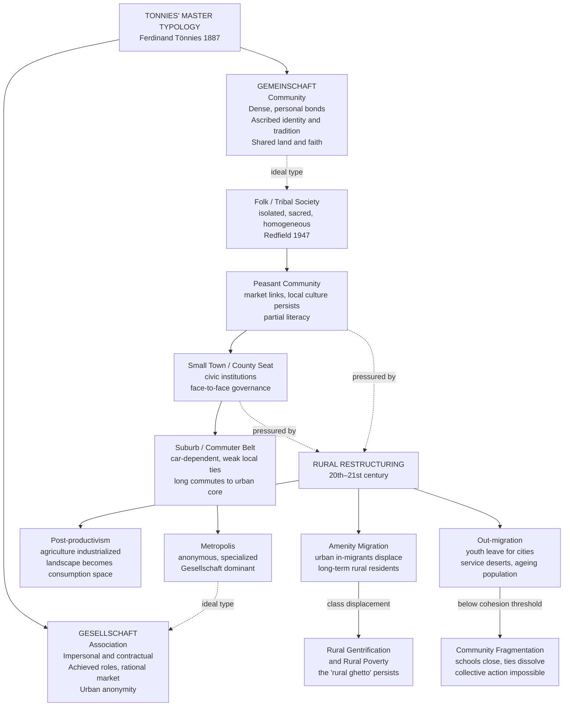

# Rural and Community Sociology

> [!abstract] TL;DR
> Rural and community sociology studies the social organization of non-urban places and the bonds — or their absence — that make collective life possible. Tönnies' foundational opposition between **Gemeinschaft** (community: dense, personal, traditional) and **Gesellschaft** (association: impersonal, contractual, urban) organizes the entire field. The critical 21st-century question is how rural communities survive global restructuring: as agriculture industrializes, services concentrate in cities, and educated youth migrate out, what holds a community together — and at what point does collective action become structurally impossible?

---

## Intuition

**Analogy:** Think of a small rural community as a fishing net. Every household is a knot, and every regular interaction — shared labour at harvest, borrowing tools, attending church together, knowing your neighbour's children by name — is a thread between knots. When the net is dense and well-maintained, it can hold things: collective decisions get made, the school stays open, the volunteer fire brigade shows up. Now imagine that every year, several knots loosen and drift away to the city. The threads remain briefly but lose tension. After enough knots have gone, what remains is not a slightly smaller net — it is a different object entirely: scattered fragments that cannot hold anything together.

The sociology of community is the study of what makes the net, what holds it, and at what point enough threads have frayed that it ceases to function as a collective.

---

## How It Works

### Core Mechanics

The field rests on two foundational tensions:

1. **The Gemeinschaft–Gesellschaft opposition**: Is social life organized by personal bonds, shared tradition, and common place (community) — or by impersonal contracts, rational calculation, and voluntary association (society)? All subsequent community sociology elaborates or challenges this dichotomy.

2. **The continuity vs rupture debate**: Is the folk–urban spectrum a smooth gradient, or are there qualitative thresholds at which community relationships break down irreversibly? The percolation model from network theory says yes — there are sharp thresholds.

### Flow / Architecture



---

## Key Concepts

### Secondary Level

**What is a community?** In 1955, sociologist George Hillery searched the literature and found 94 distinct definitions. Of these, 69 agreed on three common elements: **(1) a territorial area**, **(2) social interaction** among members, and **(3) common ties** — shared values, culture, or identity. The core of the concept, however, resisted full systematization. Hillery's conclusion: the one thing all 94 definitions share is that they involve *people*. Community is inherently relational — it is a quality of social bonds, not merely a geographic fact.

Three dimensions now organize modern definitions:
- **Territorial community**: people sharing a bounded place (a village, a neighbourhood, a county)
- **Relational community**: people connected by networks of interaction regardless of place (professional associations, diaspora networks)
- **Identity-based community**: people who share a sense of belonging and common purpose

**Gemeinschaft and Gesellschaft** (Tönnies, *Gemeinschaft und Gesellschaft*, 1887). Ferdinand Tönnies proposed the most influential dichotomy in community sociology. *Gemeinschaft* (community) is characterized by:
- relationships that are **ends in themselves** — you help your neighbour because she is your neighbour, not because it benefits you
- bonds rooted in **kinship, friendship, neighbourhood**
- strong **collective conscience** and conformity to tradition
- typical of pre-industrial villages, small towns, craft guilds

*Gesellschaft* (society or association) is characterized by:
- relationships as **means to ends** — the contract, the transaction, the market exchange
- bonds rooted in **rational self-interest** and voluntary agreement
- individuation — each person is an autonomous agent pursuing private goals
- typical of modern cities, corporations, bureaucratic states

Tönnies did **not** argue that Gesellschaft is better — he mourned the loss of Gemeinschaft intimacy under industrial capitalism, much as Durkheim mourned the dissolution of mechanical solidarity (see [[Classical_Sociological_Theory]]). The transition from Gemeinschaft to Gesellschaft was, for Tönnies, both inevitable and tragic.

**The rural–urban divide in everyday terms.** In rural settings, most people know most other people. This has two consequences. First, **informal social control** is strong: deviance is visible and sanctioned without formal institutions (police, courts). Second, **social support** is dense: reciprocal labour exchange, communal childcare, and mutual aid through hard times are structurally embedded. The costs are conformity pressure, gossip, and limited exit options for those who do not fit — minorities, dissenters, queer individuals. Urban Gesellschaft offers anonymity and freedom alongside isolation and anomie.

---

### Undergraduate Level

#### Redfield's Folk–Urban Continuum

Robert Redfield, studying four communities across the Yucatán Peninsula (1947) — the tribal settlement of Tusik, the peasant village of Chan Kom, the town of Dzitas, and the modern capital Mérida — proposed the **folk–urban continuum**. Folk societies are characterized by:
- **Isolation**: minimal contact with outside groups
- **Small scale**: all members know each other
- **Homogeneity**: little division of labour, shared beliefs
- **Sacred orientation**: behaviour governed by tradition and the sacred
- **Oral culture**: knowledge transmitted through practice, not writing

As communities move along the continuum toward the urban pole, Redfield observed increasing **secularization**, **individualization**, and **cultural disorganization** — the breakdown of received meanings and the multiplication of ways of life. The continuum was simultaneously descriptive (different communities occupy different positions) and historical (modernization moves societies from folk toward urban).

**Criticisms.** Oscar Lewis re-studied Tepoztlán (one of Redfield's original sites) and found conflict, distrust, and violence where Redfield had seen harmony — demonstrating that the ethnographer's lens shapes what "community" is found. The continuum also implies a linear evolution from folk to urban that masks the actual complexity of rural–urban interaction: rural communities are never sealed off from the market; they have always been embedded in wider political economies.

#### The Community Studies Tradition

From the 1920s onward, sociologists conducted intensive community studies — ethnographies of entire towns — that produced the richest empirical base in the field:

- **Robert and Helen Lynd, *Middletown* (1929) and *Middletown in Transition* (1937)**: Study of Muncie, Indiana. The Lynds documented how industrialization transformed a mid-American town: the decline of craft work, the rise of consumer culture, the concentration of economic power in a single industrial family (the Ball family), and the persistence of a class divide between the "business class" and the "working class" that shaped every social institution from church attendance to recreation. *Middletown* established the template for community study as a method: total immersion, systematic coverage of all social institutions, longitudinal return.

- **Michael Young and Peter Willmott, *Family and Kinship in East London* (1957)**: Study of Bethnal Green, a working-class London neighbourhood scheduled for slum clearance. Young and Willmott found a dense network of kinship ties — mothers, daughters, and sisters living within walking distance, providing daily childcare, emotional support, and mutual aid — that constituted a genuine Gemeinschaft in the industrial city. When families were rehoused in peripheral estates, this network was destroyed: the physical dispersal of kin dissolved the social fabric. The book became foundational evidence against urban renewal's assumption that community is simply a function of housing quality rather than social network density.

- **William Foote Whyte, *Street Corner Society* (1943)**: Ethnography of an Italian-American slum in Boston ("Cornerville"), documenting the informal social organization that operated beneath visible poverty and disorder: the gang structure, the political machine, the bowling-league hierarchy. Community organization persisted even where formal institutions had failed.

#### Rural Restructuring and Post-productivism

From the 1970s onward, rural sociologists identified a structural transformation in the relationship between rural space and the economy:

**Productivism (1940s–1970s):** Rural space was defined primarily by agricultural production. State policy supported farms through subsidies, price supports, and land improvement grants. Rural communities were communities of farmers; their social fabric was organized around the farming calendar.

**Post-productivism (1980s–present):** Agriculture became industrialized and globally competitive, eliminating smallholder farming and depopulating agricultural villages. Simultaneously, urban professionals began to consume the countryside — for recreation, tourism, second homes, retirement, and aesthetic pleasure. Rural space was reconstituted as a **consumption landscape** rather than a production landscape.

Three consequences followed:

1. **Amenity migration**: Urban professionals and retirees relocated to attractive rural areas — coastal villages, national park peripheries, scenic hills — attracted by landscape quality, lower costs, and remote work. In-migrants brought higher incomes, different values, and less embeddedness in local networks. This produced **rural gentrification**: house prices rose, local services (pubs, post offices, shops) reoriented toward affluent newcomers, and long-term residents — farmers, agricultural workers, young families — were priced out.

2. **Rural poverty and the "rural ghetto"**: Where amenity migration did not occur — old mining communities, agricultural flatlands, peripheral upland areas — rural depopulation combined with service withdrawal produced what some sociologists call the **rural ghetto**: concentrated poverty that is invisible because it lacks the spatial density and political voice of urban poverty. Rural poverty rates are often comparable to or exceed urban rates, but they are dispersed across vast geographies, making collective mobilization and service delivery equally difficult.

3. **Service deserts**: The closure of rural schools, hospitals, post offices, banks, and public transport — driven by population thresholds and cost rationalization — progressively stripped rural communities of the institutional infrastructure that sustained social interaction. The school in particular is not merely an educational facility but a community hub: its closure typically accelerates out-migration by young families, triggering the very threshold effect that makes further service provision unviable.

#### Community Attachment and Place Identity

**Place attachment** is the affective bond between a person and a meaningful environment — the emotional significance invested in a home village, a familiar landscape, a childhood neighbourhood. Sociologists (and psychologists working in environmental psychology) distinguish:

- **Place dependence**: functional attachment — this place has the specific resources I need (agricultural land, fishing waters, kinship network)
- **Place identity**: identity attachment — this place is part of who I am; my sense of self is partly constituted by belonging here

Rural communities typically generate stronger place identity than urban ones, because the smaller scale makes the place more legible — you know its history, its characters, its rhythms. Out-migration does not simply relocate households; it tears people from a formative identity anchor, producing grief and a kind of existential dislocation for both those who leave and those who remain. This is why community sociologists argue that rural decline is not merely an economic problem but a cultural and psychological one.

**Community attachment** — the degree of identification and emotional investment that community members have in their locality — is the strongest predictor of civic participation, volunteering, and political engagement at the local level. High-attachment communities maintain their collective action capacity longer during demographic stress.

#### Suburban Sociology and the Commuter Belt

Suburbs are not simply "between city and country" — they constitute a distinctive social formation with their own sociology:

- **Suburbanization** emerged with the mass automobile, cheap gasoline, and government mortgage subsidies (especially US federal housing policy 1945–1970). It encoded racial and class segregation: federally subsidized mortgages were systematically denied to Black applicants (redlining), producing racially homogeneous white suburbs while urban cores became disinvested Black and immigrant neighbourhoods.

- **Suburban social life** is organized around the private home and the nuclear family rather than street-level public interaction. William Whyte's *The Organization Man* (1956) and David Riesman's *The Lonely Crowd* (1950) described suburban conformism — the peer-group pressure of the cul-de-sac, the social policing of lawn quality and car models — as a new and anxious form of social integration.

- **Commuter belt sociology**: In the zone beyond the suburb, extending 30–90 miles from major cities, "exurbanites" live in villages and small towns while commuting to urban employment. These communities have the physical form of rural life but the social structure of urban Gesellschaft: residents are residential-only, commuting away for work, shopping, and socialization. Local community institutions — schools, churches, pubs, voluntary associations — are maintained instrumentally rather than embedded organically. The commuter village is, in Tönnies' terms, a Gesellschaft masquerading in Gemeinschaft clothing.

---

### Graduate Level

#### Agrarian Sociology and Food Systems

A distinct tradition within rural sociology — agrarian sociology — studies the political economy of agriculture as a social system. Key theoretical contributions:

- **Peasant studies** (Chayanov, Wolf, Scott): The peasant household is not a miniature capitalist firm but a unit with different rationality — it maximizes subsistence security, not profit. James Scott's *The Moral Economy of the Peasant* (1976) argued that peasant communities maintain subsistence ethics (reciprocal guarantees of minimum livelihood) that capitalism systematically erodes. When those ethics collapse — typically through enclosure, taxation, or rent extraction — peasant revolt becomes rational.

- **Agri-food systems**: The industrial food system — spanning seeds, pesticides, contract farming, global commodity chains, supermarket retail — restructures rural space and labour. Philip McMichael's concept of the **food regime** identifies three historical phases: British-centred (1870–1914), US-centred (1945–1970s), and corporate/neoliberal (1980s–present). In the current regime, transnational agri-food corporations capture most of the value added by agricultural labour, while farmers — increasingly on contract — bear production risk without controlling prices.

- **Food sovereignty** (La Via Campesina movement): Counter to the food regime, rural social movements assert the right of communities to define their own food systems, seed sovereignty, and land tenure outside the global commodity circuit. This is community sociology applied to agrarian politics.

#### Community Resilience

Community resilience refers to a community's capacity to absorb disturbance, reorganize, and continue developing along the same trajectory. It incorporates:

- **Social capital** (Putnam): bonding capital (internal cohesion) provides immediate mutual aid; bridging capital (connections to outside networks) enables recovery by importing resources. Rural communities with high bonding but low bridging capital can weather local shocks but struggle with systemic restructuring.

- **Adaptive capacity**: The ability to learn, reorganize, and innovate in response to change — not merely to "bounce back" but to transform productively. Communities that have diverse economic bases, strong civic leadership, high levels of educational attainment, and external linkages (to universities, NGOs, government agencies) show higher adaptive capacity.

- **Collective efficacy** (Sampson): The shared belief that the community can act together to achieve goals. It predicts successful collective action across community types — from rural volunteer fire brigades to urban neighbourhood watch programs.

- **Threshold effects**: Research drawing on complexity theory (Resilience Alliance) suggests that social-ecological systems have tipping points — beyond which reorganization occurs around a qualitatively different attractor. For rural communities, the threshold often corresponds to critical mass of population for the school, the local shop, or the farm supply cooperative. Once those anchor institutions close, the system reorganizes around individual household survival rather than collective provision — and this reorganization is difficult to reverse.

#### Post-rural Theory

From the late 1990s, Keith Halfacree and others have proposed a **post-rural** framework arguing that the category "rural" is no longer a coherent social-structural concept but a **social representation** — a set of images, ideas, and desires (the "rural idyll") that are consumed, constructed, and contested, rather than a description of an actually distinctive social organization. The countryside is increasingly produced *for* the urban gaze: heritage tourism, organic food certification, "authentic" villages, rewilding — all commodify a rural distinctiveness that is partly real and partly manufactured. This does not mean that rural poverty, isolation, and political marginalization are not real — they demonstrably are — but that the boundaries between "rural" and "urban" sociological analysis have become analytically blurred.

**Critical rural sociology** (Cloke, Milbourne, Watt) has pushed back against the middle-class rural idyll to insist on the material conditions of rural poverty, marginalization, and exclusion — the elderly woman who cannot afford heating, the agricultural worker on zero-hours contract, the young person who cannot afford rural housing. Community sociology that focuses only on cohesion and attachment risks naturalizing the countryside as a haven while ignoring its class relations.

---

## Python Demo

```python
import numpy as np
import matplotlib.pyplot as plt

rng = np.random.default_rng(42)

# -----------------------------------------------------------------------
# Model: N_INIT rural households placed in a unit square.
# Two households are socially connected if within geographic radius R.
# Each period, a fraction MIGRATE_RATE of households out-migrate;
# weakly connected (isolated) households have higher emigration weight.
# Track: average local ties (degree), largest connected component (LCC),
# and whether the community can still mount collective action.
#
# Key insight: below a network percolation threshold, the LCC collapses
# non-linearly — community fragmentation is not proportional to population
# loss. This is the sociological "tipping point" for rural decline.
# -----------------------------------------------------------------------

N_INIT = 100          # starting households
N_STEPS = 40          # simulation periods
MIGRATE_RATE = 0.04   # fraction migrating per period
RADIUS = 0.21         # social-tie radius (geographic proximity)
COLLECTIVE_THRESHOLD = 0.40  # LCC must contain >= 40% for collective action

# --- Place households randomly in a unit square ---
positions = rng.uniform(0, 1, size=(N_INIT, 2))

def build_adj(pos, active, r):
    """Build adjacency matrix: connect active households within radius r."""
    n = len(pos)
    A = np.zeros((n, n), dtype=np.int8)
    idx = np.where(active)[0]
    for a in range(len(idx)):
        for b in range(a + 1, len(idx)):
            i, j = idx[a], idx[b]
            d = np.hypot(pos[i, 0] - pos[j, 0], pos[i, 1] - pos[j, 1])
            if d <= r:
                A[i, j] = A[j, i] = 1
    return A

def lcc_fraction(A, active):
    """Fraction of active nodes in the largest connected component (BFS)."""
    idx = np.where(active)[0]
    if len(idx) == 0:
        return 0.0
    visited = np.zeros(len(A), dtype=bool)
    best = 0
    for start in idx:
        if visited[start]:
            continue
        stack = [start]
        visited[start] = True
        size = 0
        while stack:
            node = stack.pop()
            size += 1
            for nb in np.where((A[node] > 0) & active & ~visited)[0]:
                visited[nb] = True
                stack.append(nb)
        best = max(best, size)
    return best / len(idx)

# --- Run simulation ---
active = np.ones(N_INIT, dtype=bool)
A = build_adj(positions, active, RADIUS)

history = {"n": [], "avg_degree": [], "lcc": []}

for step in range(N_STEPS + 1):
    idx = np.where(active)[0]
    n = len(idx)
    if n == 0:
        break

    sub = A[np.ix_(idx, idx)]
    avg_deg = float(sub.sum()) / n
    lcc = lcc_fraction(A, active)

    history["n"].append(n)
    history["avg_degree"].append(avg_deg)
    history["lcc"].append(lcc)

    if step == N_STEPS:
        break

    # Preferential out-migration: isolated households most likely to leave
    degrees = sub.sum(axis=1).astype(float)
    weights = 1.0 / (degrees + 1.0)
    probs = weights / weights.sum()
    n_leave = max(1, int(n * MIGRATE_RATE))
    local_leavers = rng.choice(len(idx), size=n_leave, replace=False, p=probs)
    leavers = idx[local_leavers]
    active[leavers] = False
    A[leavers, :] = 0
    A[:, leavers] = 0

steps = np.arange(len(history["n"]))

# --- Visualise ---
fig, axes = plt.subplots(1, 3, figsize=(15, 5))
fig.suptitle(
    f"Rural Community Cohesion Decay Under Sustained Out-Migration\n"
    f"(N₀ = {N_INIT} households, {MIGRATE_RATE*100:.0f}% migrate per period; "
    "weakly connected households leave first)",
    fontsize=11, fontweight="bold"
)

ax = axes[0]
ax.plot(steps, history["n"], color="steelblue", lw=2.5)
ax.set(xlabel="Time Period", ylabel="Households Remaining",
       title="Population Decline", ylim=(0, N_INIT * 1.05))
ax.grid(alpha=0.3)

ax = axes[1]
ax.plot(steps, history["avg_degree"], color="darkorange", lw=2.5)
ax.axhline(2.0, color="crimson", ls="--", lw=1.5,
           label="Min viable degree (2)\n— below this, dyadic ties only,\n  no community network")
ax.set(xlabel="Time Period", ylabel="Avg Local Ties per Household",
       title="Erosion of Social Bonds")
ax.legend(fontsize=8.5)
ax.grid(alpha=0.3)

ax = axes[2]
ax.plot(steps, history["lcc"], color="seagreen", lw=2.5)
ax.axhline(COLLECTIVE_THRESHOLD, color="crimson", ls="--", lw=1.5,
           label=f"Collective action threshold ({COLLECTIVE_THRESHOLD:.0%})\n"
                 "– below this, community cannot\n  staff schools, fire brigades, etc.")
threshold_step = next(
    (i for i, v in enumerate(history["lcc"]) if v < COLLECTIVE_THRESHOLD), None
)
if threshold_step is not None:
    ax.axvline(threshold_step, color="crimson", ls=":", lw=1.2, alpha=0.7)
    ax.annotate(
        f"t = {threshold_step}\nCommunity\nfragmented",
        xy=(threshold_step, history["lcc"][threshold_step]),
        xytext=(threshold_step + 2, history["lcc"][threshold_step] + 0.15),
        fontsize=8, color="crimson",
        arrowprops=dict(arrowstyle="->", color="crimson")
    )
ax.set(xlabel="Time Period",
       ylabel="Fraction of Households in\nLargest Connected Component",
       title="Community Fragmentation (LCC)", ylim=(0, 1.1))
ax.legend(fontsize=8.5)
ax.grid(alpha=0.3)

plt.tight_layout()
plt.savefig("community_cohesion_decay.png", dpi=120, bbox_inches="tight")
plt.show()

# Summary milestones
print("\nCommunity Cohesion Milestones")
print(f"{'Period':>8}  {'Households':>11}  {'Avg Degree':>11}  "
      f"{'LCC %':>7}  {'Collective Action':>18}")
print("-" * 66)
milestone_steps = list(range(0, len(steps), max(1, len(steps) // 8))) + [len(steps) - 1]
for i in sorted(set(milestone_steps)):
    ca = "YES" if history["lcc"][i] >= COLLECTIVE_THRESHOLD else "NO -- fragmented"
    print(f"{int(steps[i]):>8}  {history['n'][i]:>11}  {history['avg_degree'][i]:>11.2f}  "
          f"{history['lcc'][i]:>6.1%}  {ca:>18}")
```

**Reading the output.** The third panel is the core sociological result. Notice that population declines smoothly (panel 1), and average degree drops fairly steadily (panel 2) — but the largest connected component fraction (panel 3) shows a sharper, non-linear collapse. There is a critical point at which the community tips from "somewhat depleted but still organized" to "fragmented." This mirrors the observed sociology of rural school closures: the community functions with 40 families, with 35, even with 30 — and then the school closes, the post office closes, the pub closes, and the remaining 25 families have no shared institutions left. The threshold is structural, not gradual.

---

## Real-World Applications

> **Example — Appalachian coal communities (USA):** When coal mining collapsed in Appalachia following deindustrialisation and the natural gas revolution, communities that had been Gemeinschaft-organized around the mine — shared work rhythms, union solidarity, company-town infrastructure — lost not just employment but the entire social architecture. Robert Wuthnow's *The Left Behind* (2018) documents how these communities experienced the departure of local employers, the closure of banks and hospitals, and the evacuation of young people as a sequence of losses that individually might have been absorbed but cumulatively crossed a threshold. Chronic opioid addiction accelerated the collapse of social ties precisely because it is a response to place-based grief and anomie — reproducing Durkheim's prediction that normlessness produces pathological coping.

> **Example — Post-war East London (UK):** Young and Willmott's *Family and Kinship in East London* (1957) documented the destruction of a working-class Gemeinschaft by well-intentioned urban renewal. Bethnal Green's dense matrilocal kinship networks — mothers and daughters who saw each other daily, arranged childcare, and managed illness together — were dissolved when families were rehoused in planned estates miles away. The new housing was materially better; the new communities never cohered. This provided the empirical foundation for community impact assessment in planning — the obligation to evaluate the social network costs of physical displacement alongside housing quality gains.

> **Example — Swiss rural governance (Gemeinde system):** Switzerland's political system — in which the *Gemeinde* (municipality, often tiny) retains substantial governing powers including taxation, welfare provision, and land-use control — is a deliberate political preservation of Gemeinschaft governance. Swiss municipalities with 200 residents still hold referenda on local issues. This institutional design counteracts the Gesellschaft tendency toward centralization and maintains what Tocqueville called the "political arts" of self-governance at the local scale. Federalism in this context is not merely constitutional architecture but a technology for preserving community sociology (see [[Federalism_and_Decentralization]]).

---

## Trade-offs

| Aspect | Gemeinschaft / High Cohesion | Gesellschaft / Low Cohesion |
|--------|------------------------------|------------------------------|
| Social support | Dense mutual aid, informal care networks | Thin; reliant on market or state provision |
| Conformity pressure | High — deviance visible and sanctioned | Low — anonymity permits diversity and exit |
| Collective action | Easier — shared identity, high trust | Harder — free-rider problem, coordination costs |
| Innovation | Slow — tradition constrains experimentation | Faster — diversity of contacts, ideas, recombination |
| Marginalization of outsiders | High — strangers and minorities excluded | Lower — impersonal norms less exclusionary |
| Service provision | Efficient through mutual aid when dense | Requires formal institutions; fails below scale threshold |

---

## When to Use vs Avoid

**Use community as the unit of analysis when:**
- You are studying collective goods provision (schools, water systems, fire protection) where the relevant causal factor is the quality of social organization, not individual attributes
- Studying place-based identity, cultural persistence, or social memory
- Analyzing disasters, regeneration, or shock absorption — where network density determines collective response
- Investigating the political mobilization of rural and working-class places

**Avoid community as the sole lens when:**
- Power relations and class conflict *within* communities are the primary object — community cohesion often masks internal inequality
- The community is traversed by high-frequency mobility (commuter belts, tourist towns) — the spatial boundary does not correspond to a social network boundary
- You risk romanticizing the rural idyll and naturalizing the exclusions that make some communities "cohesive" (racial homogeneity, class closure, patriarchal family structure)

---

## Common Pitfalls

- **Romanticizing Gemeinschaft** — Tönnies himself recognized that Gemeinschaft's intimacy came at the cost of conformism, patriarchy, and the suppression of individual difference. The rural village was often a site of intense social surveillance and rigid gender roles. Nostalgia for community should be distinguished from analytical description of its social properties.

- **Treating "community" as inherently positive** — Community cohesion can sustain collective action for harmful ends (vigilante justice, exclusion of ethnic minorities, resistance to refugee settlement). The network properties of community are morally neutral; outcomes depend on values and power relations within the community.

- **Ignoring within-community stratification** — Rural communities contain landlords and tenants, employers and workers, long-timers and newcomers. Treating "the community" as a unitary actor obscures who holds decision-making power and whose interests community institutions serve. Critical rural sociology insists on class analysis alongside cohesion analysis.

- **Equating rurality with tradition** — Rural spaces are thoroughly penetrated by global capital, digital media, and cosmopolitan cultural flows. The farmer using precision agriculture GPS technology and the rural teenager on TikTok are not living in folk society. Redfield's folk–urban continuum describes a gradient of social organization, not a temporal sequence from which rural communities will eventually "emerge."

- **Confusing population density with community** — Dense urban neighbourhoods can be high-community (Bethnal Green), and sprawling rural counties can be low-community (commuter belt villages). Community is a property of social networks, not of geography per se. The network-theoretic tools of density, clustering coefficient, and largest connected component are more precise than spatial measures alone.

- **Threshold blindness in policy** — Service planners who close the last school, last pub, or last bus route assuming the loss is proportional to the closure consistently underestimate the threshold effect. When anchor institutions go, the entire community network can unravel rapidly and non-linearly — precisely because the institution was the site of network maintenance.

---

## Related Concepts

- [[_MOC_Social_Networks_and_Community|↑ Social Networks and Community MOC]] — Section entry point and concept map for this section

- [[Classical_Sociological_Theory]] — Tönnies' Gemeinschaft/Gesellschaft and Durkheim's mechanical/organic solidarity are parallel diagnoses of the same transition from pre-industrial to industrial social organization; Weber's iron cage applies directly to Gesellschaft's rationalization of rural life
- [[Functionalism_and_Systems_Theory]] — Parsons' pattern variables (affectivity/neutrality, particularism/universalism, ascription/achievement) operationalize the Gemeinschaft–Gesellschaft distinction within structural-functionalist vocabulary
- [[Poverty_Social_Mobility_and_Life_Chances]] — rural poverty and the "service desert" as mechanisms of life-chance deprivation; the geographic dimension of the Great Gatsby Curve (Chetty's work shows rural areas have among the lowest intergenerational mobility rates in the US)
- [[Family_Marriage_and_Kinship]] — the extended rural kinship network is the social infrastructure of Gemeinschaft; Young and Willmott's East London study shows kinship as the primary mechanism of community cohesion
- [[Global_Inequality_and_Development]] — the rural–urban gap within nations mirrors the North–South gap between nations; agrarian sociology's food regime framework connects peasant communities to global capital chains
- [[Federalism_and_Decentralization]] — institutional design that preserves local governing competencies is the political counterpart to community sociology's argument for the value of place-based collective life
- [[Welfare_States_and_Social_Policy]] — service withdrawal from rural areas reflects welfare state retrenchment; Esping-Andersen's social democratic model (universal provision regardless of population density) produces better outcomes for rural community sustainability than liberal models
- [[Group_Dynamics]] — community collective action depends on the group dynamics of small groups (quorum sensing, leadership, free-rider problems) that Simmel's formal sociology and subsequent small-group research theorize; community = network of overlapping small groups
- [[Attachment_Theory]] — place attachment in adults parallels Bowlby's attachment to caregivers: disruption of place attachment through forced relocation (urban renewal, rural depopulation) produces grief responses that mirror attachment disruption
- [[Stress_and_Coping]] — chronic rural poverty activates the same HPA-axis stress physiology as urban poverty, but the combination of geographic isolation, service deserts, and social surveillance makes coping resources structurally scarcer
- [[Prosocial_Behavior]] — rural reciprocal exchange (labour sharing, barn-raising, mutual aid in emergencies) is prosocial behavior structured by high community identity and repeated interaction — consistent with kin selection and reciprocal altruism extended to fictive kin through community membership
- [[Social_Class_and_Stratification]] — rural class structures (landed gentry, tenant farmers, agricultural labourers, rural service workers, in-migrant professionals) are as differentiated as urban ones; rural gentrification introduces new class conflicts between old and new rural residents

---

## Review Questions

### Secondary

1. Explain in your own words the difference between a Gemeinschaft and a Gesellschaft. Give one real example of each from your own experience or knowledge. Which type do you think your own community most resembles, and what evidence would you use to support that?
2. Hillery found 94 different definitions of community, yet they shared common elements. What were those elements, and why do you think sociologists find "community" so difficult to define precisely?
3. What is the difference between "bonding social capital" and "bridging social capital"? Why might a rural community with strong internal bonds but few outside connections struggle to recover from a factory closure or a natural disaster?

### Undergraduate

1. Redfield's folk–urban continuum was later criticized by Oscar Lewis, who re-studied one of Redfield's communities and found conflict and inequality rather than harmony. What does this methodological dispute reveal about the role of the researcher's theoretical framework in "discovering" community? Does it invalidate the folk–urban continuum as an analytical tool, or only as an empirical description?
2. Compare the community effects of rural amenity migration and rural out-migration. Both involve population change in rural areas, but they produce different social outcomes. For whom is each process beneficial, and for whom is it harmful? Use the concept of community attachment to analyze the differential effects.
3. Young and Willmott's study of Bethnal Green showed that well-designed public housing could destroy community by displacing social networks. How should urban planners and policymakers incorporate sociological knowledge about network density and community cohesion when making decisions about urban renewal, school closures, or rural service withdrawal?

### Graduate

1. The network model of community cohesion (LCC fraction as a threshold variable) suggests that community decline is non-linear — gradual population loss can trigger sudden fragmentation. What methodological approaches would you use to identify the threshold empirically for a specific rural community? What policy interventions would need to occur *before* the threshold is crossed to prevent the tipping point?
2. Critically evaluate the claim that "post-rural" theory — the argument that rural space is increasingly produced as a consumption landscape rather than a distinctive social formation — renders traditional rural sociology analytically obsolete. What does this framework capture that productivism-focused rural sociology misses, and what does it fail to see?
3. Agrarian sociology (food regimes, peasant studies, food sovereignty) and community sociology (social capital, collective action, place attachment) are often conducted in separate literatures. Construct a synthetic framework that integrates both: how does the political economy of the food system shape the social capital, collective action capacity, and place identity of rural communities — and what does that integration imply for rural social movements?

---

## Sources

- [Tönnies' Gemeinschaft and Gesellschaft — Sociology Institute explainer](https://sociology.institute/introduction-to-sociology/gemeinschaft-vs-gesellschaft-tonnies-theory/)
- [Redfield's Folk–Urban Continuum — Sociology Institute](https://sociology.institute/urban-sociology/redfield-ideal-type-theory-rural-urban-continuum/)
- [Hillery, G. A. (1955). "Definitions of community: Areas of agreement." *Rural Sociology*, 20, 111–123 — Open Access Library reference](https://www.oalib.com/references/14249828)
- [Amenity Migration: Diverse Conceptualizations — Springer *GeoJournal*](https://link.springer.com/article/10.1007/s10708-009-9295-4)
- [Rural gentrification, 2024 — Wiley *Population, Space and Place*](https://onlinelibrary.wiley.com/doi/10.1002/psp.2827)
- [Poverty and resilience in rural areas — ScienceDirect](https://www.sciencedirect.com/science/article/pii/S2949697725000189)
- Ferdinand Tönnies, *Gemeinschaft und Gesellschaft* (1887), trans. Charles Loomis as *Community and Society* (1957)
- Robert Redfield, *The Folk Culture of Yucatan* (1941); "The Folk Society," *American Journal of Sociology* (1947)
- Robert S. Lynd and Helen Merrell Lynd, *Middletown: A Study in Modern American Culture* (1929)
- Michael Young and Peter Willmott, *Family and Kinship in East London* (1957)
- Robert D. Putnam, *Bowling Alone: The Collapse and Revival of American Community* (2000)
- Robert Wuthnow, *The Left Behind: Decline and Rage in Rural America* (2018)

---

#Sociology #SocialNetworks #RuralSociology #Community #Gemeinschaft #Gesellschaft
