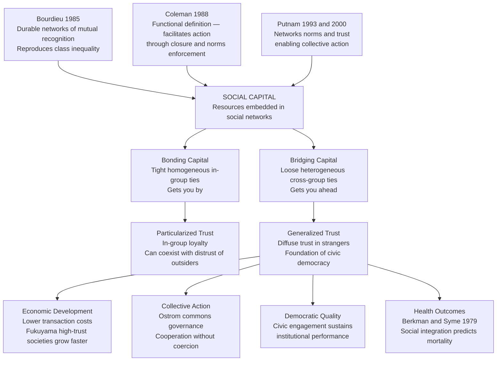

# Social Capital and Trust

> [!abstract] TL;DR
> Social capital — the resources embedded in social networks — shapes outcomes from individual health to national economic growth to the quality of democratic government. Three theorists defined it differently: Bourdieu saw it as class capital reproducing inequality through durable networks; Coleman saw it as a functional resource enabling action through network closure and norms enforcement; Putnam saw it as the collective civic fabric of generalized trust that sustains democracy itself. The central tension is whether social capital is a private asset accumulated by individuals or a public good generated by communities — and both are true, which is exactly why it can simultaneously empower the privileged and anchor democratic life.

---

## Intuition

**Analogy:** Imagine two residents of the same city facing the same crisis — a sudden medical emergency, a child struggling at school, a contractor who disappears after taking a deposit. The first resident has lived in the neighborhood for fifteen years: she knows her doctor by first name, has a neighbor who teaches at the local school, and can call on a dozen people who know which contractor is trustworthy. The second resident moved three months ago. She has the same formal rights and access to the same services, but none of the informal infrastructure. She pays more, waits longer, and resolves less.

The difference between them is social capital: the accumulated network of relationships, the shared norms of reciprocity, and the diffuse trust in neighbors that converts formal opportunities into actual capacity to act. Scale this up from two residents to an entire society, and you have the central question of the social capital literature: what happens to a democracy, an economy, or a community when those networks fray?

---

## How It Works



The diagram captures the three-way theoretical division and the shared mechanism: regardless of whether social capital is conceived as individual asset (Bourdieu), functional resource (Coleman), or collective good (Putnam), it ultimately flows through two structural forms — bonding and bridging — and produces its civic-democratic effects through generalized trust. The critical split between particularized and generalized trust is the difference between a Mafia-like arrangement (very high in-group trust, zero generalized trust) and a civic democratic community (moderate in-group ties, strong generalized trust extending to strangers and institutions).

---

## Key Concepts

### Secondary Level

**What is social capital?**

Physical capital is a machine; human capital is a skill; social capital is a relationship. It is the value embedded in the connections between people — the norms, networks, and trust that allow individuals and communities to act collectively, solve shared problems, and access resources they could not reach alone.

The concept does three things simultaneously that make it powerful:
1. It explains why people with identical formal qualifications have different life outcomes (networks vary).
2. It explains why some communities govern themselves effectively and others do not (trust and civic engagement vary).
3. It names a resource that can be created, destroyed, invested, and depleted — which means it has policy implications.

**Putnam's Bowling Alone Thesis (1995/2000)**

Robert Putnam's observation is deceptively simple: Americans were bowling more than ever in the 1990s, but bowling *leagues* — which require showing up regularly, knowing teammates, navigating conflict — had declined by roughly 40 percent since 1980. Individual bowling went up; social bowling went down. The metaphor gave his 2000 book its title and its central argument.

Putnam documented a broad decline in virtually every indicator of civic and social engagement in the United States between the mid-1960s and the late 1990s:

| Indicator | Decline |
|---|---|
| Voter turnout (1960–1990) | Down ~25% |
| Attendance at public meetings (1973–1993) | Down 40% (22% → 13%) |
| PTA membership (1964–1993) | Down 61% |
| Active club membership | Down 50%+ across most civic categories |
| Informal socializing with neighbors | Down sharply across all demographic groups |
| General social trust ("Most people can be trusted") | Down from ~56% (1960s) to ~35% (late 1990s) |

Putnam's four explanations for the decline: pressure of work and time; suburban sprawl (increased commute time, reduced face-to-face contact with neighbors); television and electronic entertainment (privatizing leisure that had previously been social); and **generational replacement** — the civic generation that came of age during the New Deal and World War II was being replaced by less civic-minded cohorts for whom voluntary associations were not a default form of social life.

**Bonding versus Bridging Social Capital**

This is Putnam's most influential conceptual distinction:

- **Bonding capital** consists of strong, dense ties within homogeneous groups — ethnic associations, religious congregations, close-knit families, old-school networks. It provides emotional support, resources in emergencies, and a sense of belonging. It is *exclusive* — it strengthens in-group solidarity by reinforcing the boundary between insiders and outsiders. Putnam's aphorism: bonding capital is good for "getting by."

- **Bridging capital** consists of weaker, looser ties across different groups — parent-teacher associations, cross-partisan civic clubs, professional networks, multi-ethnic neighborhood organizations. It provides access to information, opportunities, and people one would not otherwise meet. It is *inclusive* — it connects people who would not naturally associate. Bridging capital is good for "getting ahead."

The distinction matters for democracy because it is bridging capital — not bonding capital — that sustains the cross-group trust needed for large-scale collective action and institutional legitimacy. A society of tightly bonded factions that mistrust each other has high bonding capital and zero bridging capital: it functions well for ethnic Mafias and street gangs, less well for democratic self-governance.

**Generalized versus Particularized Trust**

Trust is the psychological core of social capital, but not all trust is equal:

- **Particularized trust** is trust in specific others — family, close friends, fellow church members, people like oneself. It is earned through direct experience and is bounded by the group. Even criminal organizations generate high particularized trust within the gang.

- **Generalized trust** (sometimes called "social trust") is a diffuse willingness to trust strangers — the belief, independent of particular evidence, that most people are basically honest and well-intentioned. The classic survey item: "Generally speaking, would you say that most people can be trusted, or that you can't be too careful in dealing with people?" High-trust societies score high; low-trust societies score low; and the score predicts a remarkable range of outcomes.

- **Institutional trust** is trust in formal organizations — governments, courts, banks, the media, the police. Institutional trust and generalized trust are related but distinct: one can trust neighbors while distrusting the government (common in high-social-capital communities under poor governance), or trust formal institutions while being deeply suspicious of individual strangers (a pattern sometimes observed in high-inequality societies with effective rule of law).

Uslaner (2002) argues that generalized trust is a largely stable trait rooted in childhood socialization in optimistic, non-threatening environments — not something easily generated by government programs or adult experience. This has a pessimistic implication: once a society's generalized trust erodes, it may take decades or generations to rebuild.

---

### Undergraduate Level

**Bourdieu: Social Capital as Class Capital**

Pierre Bourdieu introduced the modern sociological concept of social capital in his 1985 essay "The Forms of Capital." His definition: "the aggregate of actual or potential resources which are linked to possession of a durable network of more or less institutionalized relationships of mutual acquaintance or recognition."

Several features distinguish Bourdieu's account from Putnam's:

1. **Social capital is individual, not collective.** For Bourdieu, social capital belongs to agents who have invested in maintaining networks. It is not a property of communities but of persons occupying positions in social fields.

2. **It is genuinely capital — it is convertible.** Social capital can be converted into economic capital (a well-connected deal closes faster; a call from the right person gets a loan approved) and cultural capital (the right social environment opens access to the right educational institutions, credentials, and cultural markers of class). Conversion is not automatic but requires investment: maintaining relationships costs time and symbolic energy.

3. **It reproduces inequality.** Because social capital is accumulated through prior investment, and investment capacity depends on existing capital holdings, those who start with more resources can build larger and higher-quality networks. Elite social capital (the old boys' network, the business roundtable, the right club) is not merely nice to have — it is the mechanism by which class privilege is reproduced across generations. "It's not what you know but who you know" is not a cynical aside; it is a structural feature of capitalist societies.

4. **Trust is not a central concept for Bourdieu.** Unlike Putnam, Bourdieu does not make trust the key mechanism. What matters is the durable structure of mutual recognition — the fact that network members acknowledge each other as worthy of interaction. The mechanism is obligation and expectation, not necessarily warmth or confidence in others' goodwill.

**Coleman: Closure, Obligations, and Information Channels**

James Coleman's 1988 paper "Social Capital in the Creation of Human Capital" offered a *functional* definition: social capital is "a variety of different entities, with two elements in common: they all consist of some aspect of social structures, and they facilitate certain actions of actors — whether persons or corporate actors — within the structure."

Coleman identified three forms:

| Form | Definition | Example |
|---|---|---|
| **Obligations, expectations, trustworthiness** | If A does something for B, A has a credit slip redeemable in the future; this functions as social capital if the social structure is trustworthy | A parent helps another parent's child; the expectation of reciprocity is a social resource both can draw on |
| **Information channels** | Social relations are a vehicle for information, reducing the cost of acquiring it | An investor hears about an opportunity through a friend; the friend provides what market channels would not |
| **Norms and effective sanctions** | Norms that prescribe appropriate behavior, backed by informal sanctions, enable collective action | A norm that "you report misconduct in this community" backed by social disapproval effectively controls behavior |

Coleman's crucial structural concept is **closure**: a network is closed when the relationships between members are dense enough that anyone who violates a norm can be sanctioned by the group. Open networks (like Granovetter's "strength of weak ties" networks) carry more information but less normative force. Closed networks carry less novel information but can enforce the trust and reciprocity that allows collective action.

Coleman's empirical application: Catholic schools in the United States had significantly higher graduation rates than comparable public schools — not primarily because of religious discipline, but because Catholic school parents formed a closed network. They knew each other, they monitored each other's children, and they provided social capital that reinforced the school's academic norms. Coleman showed that controlling for family background and school resources, network closure among parents predicted student outcomes.

**Ostrom and Social Capital for Common Pool Resources**

Elinor Ostrom's *Governing the Commons* (1990) — for which she won the 2009 Nobel Prize in Economics — showed empirically that local communities regularly managed shared resources (fisheries, irrigation systems, forests, grazing lands) without privatization or state control, contrary to Hardin's "tragedy of the commons" prediction. The mechanism was social capital: communities with sufficient trust, reciprocity norms, monitoring capacity, and graduated sanctions could sustain the cooperation required to prevent over-extraction.

Ostrom's eight design principles for successful common pool resource management are, in essence, a blueprint for building and deploying social capital in collective action problems:

1. Clearly defined group boundaries (who is in, who is out)
2. Rules matched to local conditions
3. Those affected by rules participate in modifying them
4. Effective monitoring of both resource and users' behavior
5. Graduated sanctions for rule violation
6. Conflict resolution mechanisms
7. External recognition of community's right to self-organize
8. Nested organizations for larger systems

The connection to social capital is structural: monitoring works only if monitors trust each other and share norms; sanctions work only if the community has enough social cohesion to make exclusion a real punishment; rule modification requires the bridging capital to bring diverse users together. Social capital is not just the output of civic life — it is the input to collective action institutions.

**The Measurement Problem**

How do you measure social capital? Three main approaches:

- **Survey-based**: the classic World Values Survey question ("Most people can be trusted / can't be too careful") as a proxy for generalized trust; self-reported association membership and civic participation as proxies for network density.

- **Network-based**: mapping actual social network structures (density, clustering coefficient, bridging ties, brokerage positions) using ego-network surveys or digital trace data. This is more direct but expensive and rarely done at population scale.

- **Output-based**: measuring social capital by its hypothesized effects — voter turnout, crime rates, cooperative behavior in experiments. This risks circular reasoning if social capital is defined partly by its effects.

Alejandro Portes (1998) noted several measurement traps: the tendency to define social capital by its effects (making it tautologically true that social capital causes collective outcomes); the conflation of the possession of social capital with the mechanisms generating it; and the difficulty of separating social capital effects from the effects of economic capital and human capital that are correlated with it.

---

### Graduate Level

**Individual Resource versus Collective Good: The Definitional Stakes**

The three-way theoretical division has practical stakes. If social capital is primarily an individual resource (Bourdieu), then policy aimed at "building social capital" in disadvantaged communities misses the point — the issue is not that poor communities lack bonding capital (they often have strong informal networks), but that they lack convertible capital: the bridges to institutions, employers, and resources that are controlled by dominant groups. Programs that create community vegetable gardens are generating bonding capital; programs that create paid internship pipelines to professional firms are generating bridging capital. The difference is enormous for mobility outcomes.

If social capital is primarily a collective good (Putnam), then it faces the classic free-rider problem: why contribute to civic associations when others will maintain them? This is why Putnam's "decline" narrative is so alarming — collective goods are vulnerable to coordinated defection. When television offers a private leisure alternative to civic association, the individually rational choice (stay home and watch TV) produces a collectively irrational outcome (the collapse of the civic fabric). This is a genuine social dilemma, not a simple coordination failure.

Coleman's account bridges these framings: social capital is generated through individual investments in relationships but often has the character of a public good within the network (the norm that operates for everyone). This explains the under-investment problem: individuals cannot capture the full returns to their social capital investments, so investment falls below the social optimum — exactly Putnam's empirical observation.

**Social Capital and Economic Development**

The connection between generalized trust and economic growth is one of the most robust findings in comparative social science. Fukuyama's *Trust* (1995) argued that high-trust societies (Germany, Japan, United States) generate large, professionally managed corporations naturally, while low-trust societies (China in family-firm form, parts of Southern Europe and Latin America) face structural barriers to creating organizations larger than family networks. The mechanism: trust reduces transaction costs. In a high-trust environment, contracts do not need extensive monitoring and enforcement mechanisms; reputation functions as an informal guarantee; relationships substitute for formal legal infrastructure.

Woolcock and Narayan (2000) brought social capital into development economics, distinguishing between:
- **Bonding social capital** (intra-community ties) — gives the poor "access to resources, reciprocal help, and emotional support," but can also trap them in poverty through downward-leveling norms and limited information access to opportunity outside the community
- **Bridging social capital** (extra-community ties) — enables mobility and access to resources outside the community; its absence is a key mechanism of poverty traps
- **Linking social capital** (ties to formal institutions and power structures) — the ability to leverage norms of respect and networks for vertical relationships with people or groups in positions of power

This three-way distinction refines Putnam's bonding/bridging binary and makes clear that much anti-poverty policy that generates bonding capital within communities while failing to build vertical links to institutions will not translate into economic mobility.

**Dark Side of Social Capital (Portes 1998)**

Portes's landmark critique identified four negative consequences of social capital:

1. **Exclusion of outsiders**: Strong in-group networks function by gatekeeping — ethnic business enclaves that discriminate against non-members, professional old-boy networks that exclude women and minorities, neighborhoods that deploy social capital to resist integration. The same closure that enforces prosocial norms in-group generates hostile exclusion out-group.

2. **Excess claims on group members**: Dense obligation networks exact high costs on successful members. First-generation immigrants who achieve economic success often face relentless demands from extended networks — the "crab bucket" dynamic where community norms and obligations pull down those who try to rise. The very trust and reciprocity that generate support also generate extraction.

3. **Restrictions on individual freedom**: High-closure communities exert conformity pressure that constrains individual experimentation, mobility, and self-expression. Tight-knit religious communities generate social capital but also enforce behavioral norms that some members experience as oppressive.

4. **Downward-leveling norms**: In communities where institutional channels to success have been systematically closed off, norms can invert — academic achievement becomes "acting white," striving becomes disloyalty. These norms function as social capital within the peer group (enforcing solidarity) while generating collective disadvantage at the community level.

The Mafia is the limiting case: an organization with extremely high bonding social capital (intense loyalty, mutual obligation, trust enforced by lethal sanction) and zero generalized trust (the outside world is a resource to be exploited). Gangs, terrorist networks, and organized crime syndicates all exhibit this structure — high social capital in Putnam's trust-and-norms sense, deeply destructive social capital in its effects on the broader society.

**Inequality and Social Capital Hoarding**

The most politically charged aspect of social capital theory is the recognition that social capital is unequally distributed — and not randomly so. Elite networks (the Davos class, Ivy League alumni associations, corporate board interlocks, political donor networks) are among the most powerful forms of social capital in existence: dense, closed, convertible to extraordinary economic and political returns. The members of these networks often do not recognize them as "social capital" because the benefits feel natural rather than structurally produced — an invisible asset in the same sense that McIntosh described white privilege.

This creates a structural irony: academic and policy discourse about "building social capital" in disadvantaged communities often focuses on bonding capital (creating community gardens, strengthening neighborhood associations), while ignoring the vastly more consequential bridging capital that connects people to power, resources, and opportunity. The result can be a policy that generates feelings of community belonging without addressing the structural barriers to mobility — social capital as palliative rather than emancipatory tool.

**Diversity and Social Capital: The Uncomfortable Finding**

In a 2007 paper that became one of the most debated in political sociology, Putnam reported that ethnic diversity reduced social trust — both in-group (bonding) and out-group (bridging) — in the short to medium term. Using data from 41 US communities, he found that residents of highly diverse neighborhoods "hunker down" — they distrust neighbors regardless of race, withdraw from civic participation, volunteer less, have fewer friends, and express lower confidence in local government. The effect was not limited to cross-race trust; even same-race trust was lower in diverse neighborhoods.

Putnam was explicit that diversity has long-run economic and cultural benefits and that integration has ultimately generated social capital at larger scales in historical cases. But the short-run finding — that diversity temporarily reduces social capital — was politically difficult. Defenders of multiculturalism argued the finding reflected measurement artifacts, confounding by inequality (diverse neighborhoods are often also poor), or the legacy of historically produced racial distrust rather than diversity per se. Critics argued it validated immigration restriction. The debate continues in the literature and has not reached resolution.

What is less disputed: Putnam's finding is a finding about transition costs, not a permanent steady state. Societies that invest in institutions that bridge diversity (school integration, mixed-income housing, cross-group civic programs) can build bridging capital across diverse lines. The challenge is institutional design, not ethnographic destiny.

---

## Python Demo

```python
# Simulate Putnam's bowling-alone thesis:
# Civic participation creates ties between people across community groups.
# As shared civic activity declines (from step 20 onward), cross-group
# (bridging) ties collapse while within-group (bonding) ties, sustained by
# constant local contact, persist. Result: network fragmentation and
# reduced bridging capital — Putnam's core structural claim visualized.

import numpy as np
import matplotlib.pyplot as plt

rng = np.random.default_rng(42)

N_AGENTS = 80          # agents total
N_GROUPS = 4           # community groups (equal size, 20 each)
N_LOCAL_EVENTS = 6     # within-group events per time step (constant)
N_CIVIC_EVENTS = 4     # cross-group civic events per time step (declining)
T_STEPS = 60           # simulation steps
TIE_DECAY = 0.88       # fraction of tie strength retained each step
TIE_THRESHOLD = 2.0    # accumulated strength required to count as an active tie
LOCAL_RATE = 0.30      # constant within-group contact probability

group_of = np.repeat(np.arange(N_GROUPS), N_AGENTS // N_GROUPS)
group_size = N_AGENTS // N_GROUPS

# Civic participation rate: stable at 0.65 for steps 0-19, then declines
civic_rates = np.concatenate([
    np.full(20, 0.65),
    np.linspace(0.65, 0.10, 40)
])

adj = np.zeros((N_AGENTS, N_AGENTS), dtype=float)
same_group_mask = (group_of[:, None] == group_of[None, :])

metrics = {k: [] for k in
           ["total_ties", "bonding_ties", "bridging_ties",
            "bridging_fraction", "giant_component", "isolation_rate"]}


def component_sizes(binary_adj, n):
    """BFS-based connected components; returns array of component sizes."""
    visited = np.zeros(n, dtype=bool)
    sizes = []
    for start in range(n):
        if visited[start]:
            continue
        size = 0
        stack = [start]
        while stack:
            node = stack.pop()
            if visited[node]:
                continue
            visited[node] = True
            size += 1
            for nb in np.where(binary_adj[node])[0]:
                if not visited[nb]:
                    stack.append(int(nb))
        sizes.append(size)
    return np.array(sizes, dtype=int)


for t in range(T_STEPS):
    civic_p = civic_rates[t]

    # Within-group (local) events — constant participation
    for g in range(N_GROUPS):
        group_agents = np.where(group_of == g)[0]
        for _ in range(N_LOCAL_EVENTS):
            attend = group_agents[rng.random(group_size) < LOCAL_RATE]
            if len(attend) >= 2:
                adj[np.ix_(attend, attend)] += 1.0

    # Cross-group civic events — participation declines over time
    for _ in range(N_CIVIC_EVENTS):
        attend = np.where(rng.random(N_AGENTS) < civic_p)[0]
        if len(attend) >= 2:
            adj[np.ix_(attend, attend)] += 1.0

    np.fill_diagonal(adj, 0.0)   # no self-ties
    adj *= TIE_DECAY              # ties decay if not reinforced

    # Binary adjacency (threshold separates active from dormant ties)
    binary = adj >= TIE_THRESHOLD
    np.fill_diagonal(binary, False)

    upper = np.triu(binary, k=1)
    bonding  = int(np.sum(upper & same_group_mask))
    bridging = int(np.sum(upper & ~same_group_mask))
    total    = bonding + bridging

    metrics["total_ties"].append(total)
    metrics["bonding_ties"].append(bonding)
    metrics["bridging_ties"].append(bridging)
    metrics["bridging_fraction"].append(bridging / total if total > 0 else 0.0)

    sizes = component_sizes(binary, N_AGENTS)
    metrics["giant_component"].append(int(np.max(sizes)) / N_AGENTS)
    metrics["isolation_rate"].append(int(np.sum(sizes == 1)) / N_AGENTS)

# -----------------------------------------------------------------------
steps = np.arange(T_STEPS)

fig, axes = plt.subplots(2, 2, figsize=(13, 8))
fig.suptitle(
    "Putnam's Bowling Alone: Simulated Civic Participation Decline\n"
    "and Its Effect on Social Network Structure  (N=80 agents, 4 community groups)",
    fontsize=12, fontweight="bold"
)

# Panel 1: Civic participation rate over time
ax1 = axes[0, 0]
ax1.plot(steps, civic_rates, color="#2563eb", linewidth=2.5)
ax1.axvline(20, color="gray", linestyle="--", linewidth=1.2, alpha=0.7,
            label="Decline begins (t=20)")
ax1.fill_between(steps[:20], 0, civic_rates[:20], alpha=0.12, color="#2563eb")
ax1.fill_between(steps[20:], 0, civic_rates[20:], alpha=0.12, color="#ef4444")
ax1.text(8,  0.68, "Golden era\n(bowling leagues)", ha="center", fontsize=8.5, color="#1d4ed8")
ax1.text(43, 0.35, "Erosion era\n(bowling alone)",  ha="center", fontsize=8.5, color="#dc2626")
ax1.set_xlabel("Time Step")
ax1.set_ylabel("Civic Participation Rate")
ax1.set_title("Civic Participation Rate\n(Local contact constant; civic events decline)")
ax1.legend(fontsize=8)
ax1.set_ylim(0, 0.85)
ax1.grid(alpha=0.3)

# Panel 2: Bonding versus bridging ties
ax2 = axes[0, 1]
ax2.plot(steps, metrics["bonding_ties"],  color="#16a34a", linewidth=2.2,
         label="Bonding ties (within-group)")
ax2.plot(steps, metrics["bridging_ties"], color="#dc2626", linewidth=2.2,
         label="Bridging ties (cross-group)")
ax2.axvline(20, color="gray", linestyle="--", linewidth=1.2, alpha=0.7)
ax2.set_xlabel("Time Step")
ax2.set_ylabel("Number of Active Ties")
ax2.set_title("Bonding vs. Bridging Social Capital\n"
              "(Bridging ties collapse; bonding ties persist)")
ax2.legend(fontsize=9)
ax2.grid(alpha=0.3)

# Panel 3: Giant component and isolation
ax3 = axes[1, 0]
ax3.plot(steps, metrics["giant_component"],
         color="#7c3aed", linewidth=2.2, label="Giant component fraction")
ax3.plot(steps, metrics["isolation_rate"],
         color="#b45309", linewidth=2.2, linestyle="--",
         label="Isolated agents fraction")
ax3.axvline(20, color="gray", linestyle="--", linewidth=1.2, alpha=0.7)
ax3.set_xlabel("Time Step")
ax3.set_ylabel("Fraction of Agents")
ax3.set_title("Network Fragmentation\n"
              "(Giant component shrinks; isolation rises)")
ax3.legend(fontsize=9)
ax3.set_ylim(0, 1.05)
ax3.grid(alpha=0.3)

# Panel 4: Era comparison bar chart
early = {k: float(np.mean(v[:20]))  for k, v in metrics.items()}
late  = {k: float(np.mean(v[-20:])) for k, v in metrics.items()}

keys     = ["bridging_fraction", "giant_component", "isolation_rate"]
xlabels  = ["Bridging Capital\nFraction", "Giant Component\nFraction", "Isolation\nRate"]
e_vals   = [early[k] for k in keys]
l_vals   = [late[k]  for k in keys]
x        = np.arange(len(keys))
w        = 0.32

ax4 = axes[1, 1]
b1 = ax4.bar(x - w / 2, e_vals, w, color="#2563eb", alpha=0.85,
             label="Golden era  (t=0-19)")
b2 = ax4.bar(x + w / 2, l_vals, w, color="#ef4444", alpha=0.85,
             label="Eroded era  (t=40-59)")
for bar, val in zip(list(b1) + list(b2), e_vals + l_vals):
    ax4.text(bar.get_x() + bar.get_width() / 2, val + 0.015,
             f"{val:.2f}", ha="center", va="bottom", fontsize=8)
ax4.set_xticks(x)
ax4.set_xticklabels(xlabels, fontsize=9)
ax4.set_ylabel("Fraction")
ax4.set_title("Era Comparison: Key Network Metrics")
ax4.legend(fontsize=8)
ax4.set_ylim(0, 1.15)
ax4.grid(alpha=0.3, axis="y")

plt.tight_layout()
plt.savefig("putnam_bowling_alone_simulation.png", dpi=150)
plt.show()

# Summary table
print(f"\nCivic Decline — Network Impact Summary")
print(f"{'Metric':<35} {'Golden Era':>11} {'Eroded Era':>12} {'Delta':>9}")
print("-" * 71)
label_map = dict(zip(keys, ["Bridging capital fraction",
                             "Giant component fraction", "Isolation rate"]))
for k in keys:
    delta = late[k] - early[k]
    print(f"{label_map[k]:<35} {early[k]:>11.3f} {late[k]:>12.3f} {delta:>+9.3f}")
```

**Reading the output.** Panel 1 shows the civic participation rate trajectory. Panel 2 shows the asymmetric collapse: bridging ties (requiring cross-group civic events) plummet after step 20, while bonding ties (sustained by constant local contact) remain relatively stable. This is Putnam's core finding — the decline is selective, hollowing out the bridges between communities rather than dissolving communities themselves. Panel 3 shows the structural consequence: the network fragments, the giant connected component shrinks, and isolated agents multiply. Panel 4 compares era averages numerically. The simulation confirms that the same decline in civic participation rate that mildly reduces bonding capital catastrophically reduces bridging capital and network cohesion — the structural signature of bowling alone.

---

## Real-World Applications

> **Italy: Making Democracy Work (Putnam 1993).** In the most influential empirical test of social capital theory at the political level, Putnam and colleagues tracked 20 newly created regional Italian governments from 1970 to 1989. Northern Italian regions (Emilia-Romagna, Tuscany) had centuries-old traditions of civic associations, cooperative societies, choral groups, and football clubs — dense networks of horizontal civic engagement generating generalized trust. Southern Italian regions (Calabria, Sicily) had comparable formal institutions but much weaker civic traditions, characterized by vertical patron-client relationships and family-based particularized trust. The result: northern governments performed dramatically better on every institutional metric — speed of policy implementation, budget management, legislative innovation, statutory stability. Putnam's explanation: civic traditions generated social capital that made government accountable and responsive. The same formal democratic institutions produced radically different governance outcomes depending on the civic culture in which they were embedded. This finding is the empirical foundation for the claim that social capital is not merely a pleasant social amenity but a structural determinant of institutional effectiveness.

> **Chicago Collective Efficacy (Sampson, Raudenbush, and Earls 1997).** Robert Sampson and colleagues studied crime rates across 343 Chicago neighborhoods and found that "collective efficacy" — defined as social cohesion among neighbors combined with their willingness to intervene in public disorder — predicted violent crime rates better than concentrated poverty, residential instability, or racial composition alone. Neighborhoods with high collective efficacy (in Putnam's terms, high bonding and bridging capital with prosocial activation) had crime rates roughly 40 percent lower than neighborhoods with equivalent structural disadvantages but low collective efficacy. The finding reframed crime prevention: the key resource was not police presence but the social capital that made neighbors trust each other enough to act collectively. Critically, the effect held even for poor, predominantly minority neighborhoods — demonstrating that social capital is not simply a proxy for class composition.

> **COVID-19 and Generalized Trust.** The pandemic provided a natural experiment in the public-health consequences of social capital. Countries with high generalized trust (the Nordic states, South Korea, New Zealand) achieved dramatically better pandemic outcomes through voluntary compliance with public health guidance — mask-wearing, social distancing, and vaccination — without requiring coercive enforcement. Countries with low institutional and generalized trust (parts of Eastern Europe, the United States in many regions) struggled to achieve compliance even with mandates. The mechanism: generalized trust allows citizens to take costly individual actions on behalf of collective welfare without monitoring every individual; low trust produces free-rider logic — "why should I sacrifice if I don't believe others will?" — that is rational at the individual level and catastrophic at the collective level. Researchers estimated that each 10-percentage-point increase in social trust was associated with a 5-8 percent reduction in COVID-19 mortality, independent of income, population density, and healthcare capacity.

> **High-Trust Economies and Transaction Costs (Fukuyama 1995).** Fukuyama documented systematic differences in the scale and structure of firms across high-trust and low-trust societies. Germany, Japan, and the United States developed large, professionally managed corporations with ownership separated from management — a structure that requires shareholders to trust professional managers who are strangers. Low-trust societies — Fukuyama's examples included Taiwan, Hong Kong, and much of Latin America — generated powerful family firms but struggled to develop large professional corporations because the trust required to delegate authority to non-kin was absent. The structural consequence: high-trust societies dominate capital-intensive industries (automotive, pharmaceutical, aerospace) that require large organizational scale, while low-trust societies are competitively advantaged in industries where family-firm scale and coordination is sufficient. Economists (Knack and Keefer, 1997) confirmed this cross-nationally: a 10-percentage-point increase in the share of people agreeing that "most people can be trusted" was associated with roughly 0.8 percentage points of additional annual GDP growth, holding other variables constant.

---

## Common Pitfalls

- **Conflating bonding and bridging capital** — treating "social capital" as a single quantity that communities either have or lack. A community can have abundant bonding capital (tight neighborhood networks, strong religious congregations) while being severely deficient in bridging capital (no connections to employment networks outside the neighborhood, no cross-group civic associations). Policy that strengthens bonding capital without building bridges will improve social support without improving mobility — a common outcome of well-intentioned community development programs.

- **Ignoring the dark side** — academic and policy uses of social capital often import only its positive connotations. The social capital literature must account for the fact that the Ku Klux Klan, the Italian Mafia, and terrorist cells all exhibit strong social capital. Portes's critique is not merely academic: any policy framework that treats "more social capital" as unambiguously good will overlook the mechanisms through which strong networks harm outsiders and enforce conformity within groups.

- **Circular definitions** — defining social capital by its effects (communities with good institutions have social capital; social capital produces good institutions) renders the theory unfalsifiable. The measurement challenge is to operationalize social capital independently of its hypothesized outcomes, which requires either network-structural measures or behavioral/attitudinal measures that are validated against outcomes rather than defined by them.

- **Confusing generalized trust with optimism or personality** — generalized trust is not the same as being a trusting or naive person. At the individual level, it is a reasonably calibrated assessment of the social environment: people in high-trust societies are correct that most people can be trusted; people in low-trust societies are correct to be more cautious. Uslaner (2002) shows that generalized trust predicts civic engagement, health, and economic behavior not because trusting people are gullible but because trust in others enables the cooperative engagement that generates the outcomes.

- **Underestimating Bourdieu's inequality critique** — the Putnam-centric version of social capital theory that dominates policy discourse focuses on civic engagement and community building, often obscuring Bourdieu's insight that social capital is a class resource whose accumulation mirrors the accumulation of economic and cultural capital. Programs that strengthen community ties without addressing structural inequality risk providing social capital as a substitute for economic capital — making disadvantaged communities more cohesive while leaving the structural barriers to mobility intact.

- **Treating the Putnam decline as irreversible** — Putnam himself argued in *Bowling Alone* that the civic generation's habits were produced historically (by the mobilization experiences of the New Deal and World War II) and that comparable civic renewal was possible under the right conditions. Post-2001 there was a brief measurable uptick in civic participation. The direction of change is not structurally fixed; it responds to institutional investment, crisis mobilization, and organizational entrepreneurship. The bowling-alone thesis is a diagnosis, not a sentence.

---

## Related Concepts

- [[_MOC_Social_Networks_and_Community|↑ Social Networks and Community MOC]] — Section entry point and concept map for this section

- [[Contemporary_Sociological_Theory]] — Bourdieu's tripartite theory of capital (economic, cultural, social) is developed here in its full field-theoretic context; understanding habitus and field is essential to grasping why social capital is unevenly distributed across class positions
- [[Education_and_Social_Reproduction]] — the Coleman Report is dual-use: it introduced social capital into the education literature by showing that parental network closure predicted student outcomes independent of school resources; Bourdieu's cultural capital and Coleman's social capital operate in parallel as mechanisms of educational reproduction
- [[Political_Participation_and_Civil_Society]] — Putnam's civic engagement account is developed here in the context of collective action, Ostrom's design principles, and social movement theory; this note and that one are closely paired
- [[Democratic_Backsliding_and_Polarization]] — declining generalized trust and bridging capital are structural preconditions for the polarization and institutional erosion that produce backsliding; Putnam's documented decline is partly the long-run social condition underlying the polarization patterns that Levitsky and Ziblatt document
- [[Repeated_Games_and_Folk_Theorems]] — the folk theorem shows formally why repeated interaction with credible punishment sustains cooperation; generalized trust is the informal social-capital equivalent of Grim Trigger: when communities have dense repeated interaction with reputational consequences, cooperative norms are self-enforcing without formal contracts
- [[Prosocial_Behavior]] — social capital mobilizes prosocial tendencies by providing the social context (known others, reputational stakes, group membership) that activates helping behavior; bystander diffusion of responsibility is precisely what weak social capital produces — anonymity among strangers with no norm of collective responsibility
- [[Group_Dynamics]] — in-group cohesion, out-group hostility, and the processes that drive bonding capital are documented in social identity theory and intergroup contact research; Putnam's finding that diversity temporarily reduces generalized trust has a direct parallel in the contact hypothesis — contact reduces hostility only under specific institutional conditions
- [[Public_Goods]] — social capital is the mechanism by which communities overcome the free-rider problem in public goods provision; the collective action failure Olson identifies is exactly what Putnam's civic engagement prevents; high social capital communities produce local public goods that market and state mechanisms cannot efficiently supply
- [[Poverty_Social_Mobility_and_Life_Chances]] — Woolcock and Narayan's linking capital concept shows that the absence of vertical social capital (connections to power and formal institutions) is a primary mechanism of poverty traps; elite social capital networks are the mirror image — the primary mechanism by which class advantages are transmitted across generations
- [[Conflict_Theory_and_Critical_Theory]] — the dark-side critique of social capital (exclusion, capital hoarding, elite networks) sits squarely within the conflict-theoretic tradition; Bourdieu's framing is explicitly a conflict theory of social reproduction, in tension with the functionalist/civic-humanist framing that dominates Putnam's work

---

## Review Questions

### Secondary

1. Putnam says Americans are "bowling alone." What does he mean, and why does it matter for democracy? Give two specific examples from his data that illustrate the decline he is describing.
2. Explain the difference between bonding and bridging social capital using a concrete example from your own community. Which type does Putnam think is more important for democratic governance, and why?
3. Why might a very tight-knit community that takes care of its own members actually be bad for the broader society? Use Portes's concept of "exclusion of outsiders" in your answer.

### Undergraduate

1. Bourdieu, Coleman, and Putnam each define social capital differently. For *one specific social problem* (e.g., inequality in school outcomes, neighborhood crime, or economic development), explain how each theorist's definition would lead to a different diagnosis of the problem and a different policy recommendation. Which account do you find most analytically useful, and why?
2. Coleman argues that network *closure* — the density of ties within a community — is the key mechanism through which social capital enables trust and norm enforcement. Granovetter's famous "strength of weak ties" argument, by contrast, holds that *open* networks carry more valuable information and opportunity. Under what conditions does each logic apply? Design a scenario where closure is essential and one where bridging weak ties are essential, and explain the structural difference between them.
3. Putnam's 2007 finding that diversity reduces generalized trust has been interpreted both as an argument against immigration and as an artifact of poverty and historical racial conflict rather than diversity per se. What empirical evidence would you need to distinguish between these interpretations? What policy implications follow from each interpretation if it is correct?

### Graduate

1. The definition of social capital oscillates between an individual resource (Bourdieu: I have social capital; my network is my asset) and a collective good (Putnam: our community has social capital; the civic fabric is shared). This is not merely a semantic dispute — it has implications for measurement, causation, and policy. Reconstruct the strongest version of each position, identify the key empirical implication that distinguishes them (i.e., a finding that would confirm one and disconfirm the other), and evaluate which framing better accounts for the empirical evidence on social capital and economic mobility.
2. Ostrom's design principles for common pool resource management can be read as a theory of how social capital is institutionalized into governance structures. Evaluate this reading: in what ways do Ostrom's principles require social capital as a prerequisite, and in what ways do they generate social capital as an output? Does this suggest a fundamental problem with using institutional design to build social capital in communities where it is initially absent — or does Ostrom offer a path for doing so?
3. Putnam documented declining social capital in the United States from the 1960s to the 2000s using pre-internet data. Digital social networks have created entirely new forms of connection: billions of weak ties, continuous low-cost interaction with geographically dispersed others, and online communities based on interest rather than proximity. Critically evaluate three rival hypotheses: (a) digital networks are generating new bridging capital that Putnam's measures do not capture; (b) digital networks are generating bonding capital within ideologically homogeneous online communities while actively eroding bridging capital across difference; (c) digital interaction substitutes for civic participation without generating the reciprocal obligations and trust that make civic participation socially productive. What evidence would you need to evaluate each hypothesis, and what does the existing literature suggest?

---

## Sources

- [Putnam, R. D. (1995). "Bowling Alone: America's Declining Social Capital." *Journal of Democracy*, 6(1)](https://www.cftompkins.org/wp-content/uploads/2012/07/Putnam-article.pdf)
- [Bourdieu, P. (1985). "The Forms of Capital" — in J. Richardson (ed.), *Handbook of Theory and Research for the Sociology of Education*](https://www.marxists.org/reference/subject/philosophy/works/fr/bourdieu-forms-capital.htm)
- [Coleman, J. S. (1988). "Social Capital in the Creation of Human Capital." *American Journal of Sociology*, 94 (Supplement)](https://www.jstor.org/stable/2780243)
- [Putnam, R. D. (2000). *Bowling Alone: The Collapse and Revival of American Community* — Beyond Intractability Summary](https://www.beyondintractability.org/bksum/putnam-bowling)
- [Siisiäinen, M. (2003). "Two Concepts of Social Capital: Bourdieu vs. Putnam" — DLC Indiana (PDF)](https://dlc.dlib.indiana.edu/dlc/bitstreams/a95b3b47-becd-4a65-8be9-9dbb0b4b1bc5/download)
- [Portes, A. (1998). "Social Capital: Its Origins and Applications in Modern Sociology." *Annual Review of Sociology*, 24](https://www.annualreviews.org/doi/10.1146/annurev.soc.24.1.1)
- [Ostrom, E. (1990). *Governing the Commons* — Cambridge University Press](https://www.cambridge.org/core/books/governing-the-commons/A82E84BD571ADB77D4B3BAFD4CDBA97E)
- [Sampson, R. J., Raudenbush, S. W., & Earls, F. (1997). "Neighborhoods and Violent Crime: A Multilevel Study of Collective Efficacy." *Science*, 277(5328)](https://www.science.org/doi/10.1126/science.277.5328.918)
- [Woolcock, M. & Narayan, D. (2000). "Social Capital: Implications for Development Theory, Research, and Policy." *World Bank Research Observer*, 15(2)](https://elibrary.worldbank.org/doi/10.1093/wbro/15.2.225)
- [Social Capital — Comparing Bourdieu, Putnam, and Coleman — Thinking Sociologically](https://thinkingsociologically.com/2025/11/06/social-capital-explained-comparing-bourdieu-putnam-and-coleman-on-networks-trust-and-inequality/)

---

#Sociology #SocialNetworks #SocialCapital #Trust #CivicEngagement
