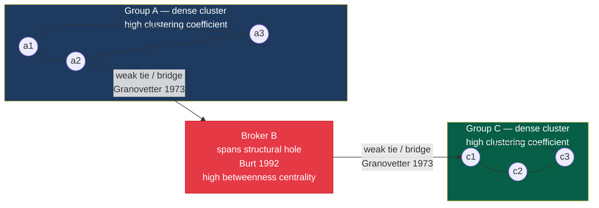

# Social Networks and Social Ties

> [!abstract] TL;DR
> Social network analysis reveals that the *structure* of ties between people — more than individuals' attributes alone — governs information flow, job-finding, power, and social contagion. Granovetter's weak ties bridge disconnected clusters and are the primary channel for novel information; Burt's structural holes explain why brokers who span gaps between groups accumulate informational and strategic advantages; the Watts-Strogatz small-world model shows that a handful of random long-range ties collapse six degrees of separation even in large networks; scale-free degree distributions emerge from preferential attachment; and homophily ensures that our networks systematically mirror our own demographic and cultural characteristics, reproducing inequality across generations.

---

## Intuition

**Analogy:** Think about how you learned of your most unexpected professional opportunity — a new job, a collaborator, a piece of information that changed your direction. It almost certainly did not come from your closest friends. They go to the same conferences, follow the same feeds, and move in the same circles as you. The information they have is information you already have. It came, instead, from an acquaintance you barely see — a former colleague glimpsed at a reunion, a friend of a friend met once at dinner, someone who lives in a different city. That person had access to a world of information you lacked, precisely because they were not already embedded in your dense cluster.

This is the central and counter-intuitive insight of social network analysis: the people you know least well are often your most valuable social connections — not for emotional support, but for information, opportunity, and access to the wider world. Mark Granovetter (1973) formalized this into one of sociology's most cited findings: it is not the strength of a tie that predicts its social utility, but its structural position as a bridge between otherwise disconnected groups.

Network sociology takes that insight and generalizes it: the pattern of who is connected to whom in a society — the topology of the social network — shapes which information spreads and which is suppressed, which diseases cascade into epidemics and which die out, which norms become universal and which remain local, and which people accumulate power and which remain peripheral.

---

## How It Works

### Core Mechanics

A social network is formally a graph G = (V, E), where V is a set of nodes (individuals, organizations, or any social actors) and E is a set of edges (ties between them). Edges may be directed (A sends information to B, but not vice versa) or undirected (A and B are mutual friends). They may be weighted (frequency of contact) or binary (present/absent). From this simple substrate, a rich set of structural properties emerges:

1. **Degree** of a node = number of direct connections. A node with many connections is a local hub. Degree distribution across all nodes describes whether the network is uniform or highly unequal.

2. **Path length** between two nodes = minimum number of edges to traverse. Average path length L measures how many hops information must cross to get from any one person to any other. Small L means fast diffusion.

3. **Clustering coefficient** C of a node = fraction of a node's neighbors who are also connected to each other. High clustering means "my friends are also friends with each other" — the hallmark of dense social clusters. Average C across all nodes measures global cliquishness.

4. **Betweenness centrality** of a node = fraction of all shortest paths (between all pairs of other nodes) that pass through it. High betweenness means the node sits at a structural chokepoint — it is a broker, a bridge, a gatekeeper. Removing it would most disrupt network connectivity.

5. **Closeness centrality** of a node = inverse of the average shortest distance to all other nodes. High closeness means the node can reach anyone quickly — it is structurally close to the center of the network.

6. **Eigenvector centrality** (and its web-scale cousin, PageRank) of a node = weighted by the centrality of its neighbors. Being connected to important people makes you important — this captures prestige and status, not just raw connection count.

7. **Network density** = actual edges / possible edges. A fully connected network has density 1; real social networks are extremely sparse (density < 0.01 for networks of thousands of people).

These properties are not merely descriptive. They predict, with remarkable precision, who gets the job offer, which community adopts a health behavior, which rumor spreads to the whole organization, and who accumulates disproportionate information advantage.

### Architecture: Weak Ties, Structural Holes, and Brokers



The diagram captures the two foundational structural insights. Groups A and C are internally dense (strong ties, high clustering) but have no direct connection to each other — a **structural hole** in Burt's terminology. Broker B has weak ties into both groups. Because Broker B is the only conduit between two worlds of information, they accrue both a *knowledge advantage* (they hear novel things from each side that the other side does not know) and a *control advantage* (they can regulate when and how information flows across the divide). Within each cluster, information circulates quickly but redundantly — everyone in Group A already knows what everyone else knows. The broker is the only person in the network who combines both worlds.

---

## Key Concepts

### Secondary Level

**What is a social network?** At its simplest, a social network is the pattern of who knows whom in a group, organization, or society. The insight that makes network analysis powerful is that this pattern is *non-obvious*: you cannot infer it from knowing individuals' characteristics (age, class, education) alone. Two organizations with identical workforce demographics can have radically different internal communication networks, productivity levels, and innovation rates depending on whether the network has structural holes, bridges, or dense sub-groups.

**Tie strength** refers to the combination of time, emotional intensity, mutual confiding, and reciprocal services that characterize a relationship. Granovetter (1973) classified ties on a spectrum from strong (close friends, family — frequent contact, high emotional investment) to weak (acquaintances — infrequent contact, low emotional investment) to absent (no tie). This simple classification has outsized analytical power because tie strength correlates powerfully with network structure:

| Tie Type | Contact Frequency | Redundancy | Structural Position | Information Value |
|----------|------------------|------------|---------------------|-------------------|
| Strong | High | High | Within cluster | Low (shared already) |
| Weak | Low | Low | Bridge between clusters | High (novel) |
| Absent | None | None | Structural hole | Potential broker site |

**Network density and cohesion**: A dense network (many edges relative to possible edges) creates high social capital within the group — shared norms, mutual monitoring, fast coordination, strong trust. Putnam (2000) called this **bonding social capital**: the glue that holds communities together. But it comes with a cost: dense networks are insular, slow to receive external information, and can enforce conformity at the expense of innovation. **Bridging social capital** — the weaker ties that connect different groups — is what allows a society to function as more than a collection of isolated villages.

**Homophily**: The tendency for similar people to form ties. McPherson, Smith-Lovin & Cook (2001) documented that social networks are deeply shaped by similarity in race, age, education, class, religion, and values — people overwhelmingly form ties with others like themselves ("birds of a feather flock together"). The result is **network segregation**: the information, norms, and opportunities that circulate within one demographic group are systematically unavailable to adjacent groups. Homophily is the structural mechanism that makes social inequality self-reinforcing: the networks of the disadvantaged are more likely to be composed of other disadvantaged people, limiting access to the resources — job information, professional contacts, cultural capital — that are disproportionately concentrated in high-status networks.

---

### Undergraduate Level

**Granovetter's Strength of Weak Ties (1973)**

In his landmark paper, Granovetter surveyed professional workers in a Boston suburb about how they found their jobs. The finding was unexpected: most job leads came not from close friends but from acquaintances seen "occasionally" or "rarely." Close friends — strong ties — knew the same information as the respondent. Acquaintances — weak ties — moved in different social circles and carried different, non-redundant information.

The sociological mechanism is structural, not psychological: strong ties cluster. If A is close friends with both B and C, B and C are also likely to be close friends (triadic closure — a fundamental principle of social networks). This means the information circulating within a dense cluster of strong ties is quickly shared by everyone and becomes redundant. Weak ties, precisely because they are infrequent and cross-cutting, are the bridges between otherwise disconnected clusters. They carry information from one world into another — a job posting in a different industry, a contact at a firm the jobseeker had never considered, a professional norm operating in a different community of practice.

Granovetter's finding has been replicated across dozens of studies and extended to diffusion of innovations, adoption of behaviors, and the spread of political information. The counterintuitive prescription: to maximize access to novel information and opportunity, cultivate a *diverse* network of acquaintances spanning multiple social worlds, not just a deep network of intimates within one world.

**Burt's Structural Holes (1992)**

Ronald Burt formalized a complementary insight. A **structural hole** is the absence of a tie between two of a focal actor's contacts. If you know Alice and Bob, and Alice and Bob do not know each other, you span a structural hole between them. You are a **broker**: a node that mediates between two otherwise disconnected groups.

Burt argued that this structural position generates two distinct advantages:

1. **Information advantage**: The broker receives information from both sides before either side receives it from the other. Combining information from two non-overlapping social worlds creates the raw material for novel ideas — what Burt calls "creative recombination." Empirically, employees who span structural holes within organizations generate more creative proposals, have faster promotion rates, and earn higher compensation — controlling for individual talent and seniority.

2. **Control advantage**: The broker controls the timing, framing, and completeness of information that crosses the hole. They can play one side against the other (a "tertius gaudens" strategy — the rejoicing third) or bring them together in controlled alliance (a "tertius iungens" strategy). This structural control advantage operates independently of individual authority or charisma.

Burt's **constraint** measure quantifies how much a node's structural holes are "filled in" by redundant ties (all your contacts know each other, giving you little brokerage leverage). Low constraint = high brokerage potential. This has been applied to corporate boards, scientific collaboration networks, military command hierarchies, and gang structures.

**Centrality Measures and Their Sociological Interpretations**

| Centrality Type | Formula (simplified) | Sociological Meaning | Example |
|----------------|----------------------|---------------------|---------|
| Degree | $k_i$ = number of direct neighbors | Popularity, local influence, visibility | The most-mentioned Twitter user |
| Betweenness | Fraction of all shortest paths passing through node $i$ | Brokerage power, gatekeeping, bridge position | The PR executive who controls media relationships |
| Closeness | $1 / \bar{d}_i$ (inverse average distance) | Speed of information receipt, diffusion efficiency | The employee who hears everything first |
| Eigenvector | Centrality weighted by neighbors' centrality | Prestige, reflected status, influence of influencers | A scientist cited by Nobel laureates |

These measures often diverge dramatically. The CEO of a firm may have high degree centrality (many formal connections) but low betweenness (formal hierarchy does not control information flow). The informal "know everyone" secretary may have low degree but high betweenness — making them structurally more powerful in practice than their position suggests.

**Small-World Networks: Milgram and Watts-Strogatz**

Stanley Milgram's 1967 "small-world" experiment asked residents of Omaha, Nebraska, to forward a letter to a Boston stockbroker using only personal acquaintances. Letters that arrived did so in an average of 5.5 steps — the origin of "six degrees of separation." The number captured a paradox: even in a nation of hundreds of millions, social networks are remarkably compact.

Duncan Watts and Steven Strogatz (1998) offered a structural explanation. They showed that any network with two properties simultaneously — **high clustering coefficient** (my friends know each other) AND **short average path length** (anyone can reach anyone in a few steps) — is a **small-world network**. These two properties appear contradictory: high clustering tends to produce locally dense but globally isolated cliques (long paths). Short paths tend to come with low clustering (a random network). What bridges them?

The Watts-Strogatz model starts with a regular ring lattice (very high clustering, very long paths) and randomly **rewires** a small fraction of its edges to random distant nodes. Even rewiring just 1% of edges dramatically collapses average path length while barely reducing clustering. The intuition: a small number of random long-range "shortcuts" (like intercontinental friendships) allows navigation of any large social space in a few hops, even though most ties remain intensely local.

Real networks — from C. elegans neuronal connectivity to the Western power grid to the collaboration network of film actors — exhibit this signature: C >> C_random and L ≈ L_random. The small-world property has practical consequences: innovations, diseases, and information can travel very far very fast through social networks, even when most people live in tightly clustered local communities.

**Network Density and Social Cohesion**

Network density captures the proportion of possible ties that actually exist. Dense networks:
- Enforce norms through mutual monitoring and reputation effects
- Generate strong in-group trust and fast coordination
- Are socially conservative (deviation is immediately visible and punished)
- Provide emotional support and resilience

Sparse networks with high betweenness nodes:
- Generate novel information flows across group boundaries
- Support entrepreneurship, innovation, and creative recombination
- Are socially dynamic but have weaker in-group trust
- Are vulnerable to fragmentation if key brokers leave

The sociological question is always: *for what purpose?* Dense cohesion is valuable for executing known routines (a military unit, an assembly line) but inhibits the search for novel solutions (innovation labs, research departments). Network design — deliberately shaping who interacts with whom — is a serious organizational intervention with measurable outcomes.

---

### Graduate Level

**Scale-Free Networks and Preferential Attachment (Barabási & Albert, 1999)**

Most real social networks exhibit **scale-free** degree distributions: a small number of nodes have extremely high degree (hubs) while the vast majority have very low degree. Formally, the probability that a node has degree k follows a power law: P(k) ~ k^(-γ) with γ typically between 2 and 3.

Albert-László Barabási and Réka Albert (1999) showed this emerges naturally from **preferential attachment**: when new nodes enter the network, they preferentially attach to already well-connected nodes ("the rich get richer" or the Matthew effect). This produces a network where:

- Connectivity is extremely unequal — a few nodes concentrate enormous proportions of all edges
- The network is robust to random failures (most nodes are poorly connected; removing random nodes rarely disconnects the network)
- The network is *fragile* to targeted attacks — removing the top hubs rapidly fragments it
- Average path length is ultra-short (the hubs serve as global shortcuts)

Scale-free properties have been documented in the World Wide Web, citation networks, protein interaction networks, and online social platforms (Twitter follower graphs, Instagram follower networks). Facebook and Twitter exhibit power-law follower distributions: the top 1% of accounts account for a majority of all follows. This has direct implications for information diffusion — content that reaches a hub propagates to an exponentially larger audience than content reaching an ordinary node.

The mechanism also reproduces and amplifies existing social inequalities: early entrants to a network field (the Matthew effect in science — researchers who publish early get cited more, enabling more research, enabling more citations) accumulate structural advantages that later, equally talented entrants cannot overcome.

**Network Contagion and Cascade Models (Watts, 2002)**

Not everything spreads the same way through networks. Watts (2002) distinguished:

- **Simple contagion** (viruses, rumors): one exposure from one infected neighbor is sufficient to infect/spread. Governed by standard epidemiological SIR dynamics on networks. Highly connected hubs are the primary vectors.

- **Complex contagion** (behaviors, innovations, social movements): multiple exposures from multiple neighbors are required before adoption. Governed by **threshold models** — each node has a threshold θ (the fraction of neighbors who must have adopted before the node adopts). Low-threshold nodes are "vulnerable"; high-threshold nodes are "resistant."

The key finding (Watts 2002): whether a small initial perturbation triggers a global cascade or dies out depends not primarily on how many people are initially infected, but on the **network structure** — specifically, whether vulnerable nodes (low θ) are globally connected. A network with many low-threshold nodes but no global connectivity among them will see local cascades that stop at cluster boundaries. A network where even a small fraction of low-threshold nodes form a spanning cluster can trigger avalanche-scale cascades from trivial initial shocks.

This explains puzzles like: why do apparently similar political movements sometimes ignite into revolutions and sometimes fizzle? Why does a fashion trend sometimes go global and sometimes stays local? The answer is not found in the quality or content of the initial trigger, but in the underlying topology of the social network through which it propagates.

**Christakis & Fowler: Three Degrees of Influence**

Nicholas Christakis and James Fowler (2007, 2008) analyzed long-running panel data (Framingham Heart Study, 1948–2003) to track how behaviors and traits spread through friendship networks. They found that obesity, smoking cessation, happiness, and loneliness each spread to three degrees of separation — you are affected by your friends' friends' friends, people you may never have met. The mechanism is partly direct (behavioral norms, visible imitation) and partly structural (emotion and behavior alter the social environment, which alters others' environments in cascade).

The "three degrees" finding suggests that social networks operate as behavioral contagion systems operating well beyond immediate social contact. The practical implication is substantial: public health interventions, organizational culture change, and political mobilization can produce effects far beyond their direct target population if they are seeded into strategically positioned network nodes.

**Homophily, Selection, and Influence: A Methodological Minefield**

A fundamental challenge in network sociology is distinguishing **selection** (homophily — similar people form ties) from **influence** (people in ties become more similar over time). If obese people cluster together in friendship networks, is that because obese people select obese friends (homophily) or because being friends with obese people increases your obesity risk (influence/contagion)? The two processes are observationally equivalent in cross-sectional data and only partially separable in longitudinal data.

Sophisticated approaches use:
- **Network autocorrelation models** that simultaneously estimate tie formation and attribute change
- **Stochastic actor-based models** (SAOM, Snijders et al.) that model the evolution of networks and behavior as co-evolving processes
- **Instrumental variable strategies** using exogenous assignment to social groups (random dormitory assignment, military platoon assignment) to identify causal influence effects

The selection/influence problem matters enormously for policy: if obesity clustering reflects homophily, then targeting network hubs with health interventions will not create cascades because the mechanism is selection, not contagion. If it reflects contagion, hub-targeting could have multiplier effects. The empirical evidence suggests both processes operate simultaneously, with domain-specific balance.

**Online Social Networks and the Transformation of Network Dynamics**

Digital platforms have introduced qualitatively new features into social network dynamics:

1. **Asymmetric ties at scale**: Twitter/X permits one-sided following, creating networks with massive in-degree inequality. The top 0.1% of accounts receive a disproportionate share of all attention — a more extreme version of scale-free properties than typically observed in offline social networks.

2. **Algorithmic curation of the social environment**: The feeds that platforms surface are not random samples of the user's network but algorithmically optimized presentations, typically maximizing engagement. This alters the effective network each user experiences — the "experienced network" may diverge sharply from the "structural network" of formal connections.

3. **Persistence and searchability**: Online interactions leave permanent records, altering the information economy of social ties. Weak ties that would have faded in offline networks can be maintained at near-zero cost, expanding the practical size of one's accessible weak-tie network by orders of magnitude.

4. **Echo chambers and filter bubbles**: Homophily is algorithmically amplified. If the platform's recommendation engine optimizes for engagement, and engagement is higher within homophilous ties (we prefer content from similar others), the platform will systematically push users toward increasingly homogenous networks. The network segregation predicted by homophily theory becomes technologically accelerated.

5. **Coordinated information cascades**: The combination of scale-free network structure, low-threshold complex contagion dynamics, and platform amplification creates the conditions for rapid, large-scale information cascades — including both genuine viral social movements and coordinated disinformation campaigns. The structural conditions are identical; the outcome depends on content and initial network seeding.

---

## Python Demo

```python
# Watts-Strogatz Small-World Transition — pure numpy/matplotlib, no networkx
#
# Demonstrates the key empirical signature of small-world networks:
#   - Average path length L(p) collapses rapidly even at small rewiring probability p
#   - Clustering coefficient C(p) remains high across most of the p range
#   - The "small-world regime" is where C(p)/C(0) is high AND L(p)/L(0) is low
#
# Reproduces Figure 2 of Watts & Strogatz (1998), Nature 393: 440-442.

import numpy as np
import matplotlib.pyplot as plt

# ---------- Network parameters ----------
N        = 30     # number of nodes (original WS used 1000; 30 is fast enough to demo)
K        = 4      # each node connected to K nearest neighbours (must be even)
N_TRIALS = 8      # number of independent rewired graphs per p value (for averaging)
rng      = np.random.default_rng(42)


# ---------- Graph construction ----------
def make_ring_lattice(n, k):
    """
    Undirected ring lattice: node i connected to i±1, ..., i±(k//2) mod n.
    Returns n×n int8 adjacency matrix.
    """
    adj  = np.zeros((n, n), dtype=np.int8)
    half = k // 2
    for i in range(n):
        for d in range(1, half + 1):
            j = (i + d) % n
            adj[i, j] = 1
            adj[j, i] = 1
    return adj


def watts_strogatz_rewire(adj_orig, p, local_rng):
    """
    Watts-Strogatz rewiring: iterate over each 'forward' edge of the original
    lattice and with probability p replace it with a uniformly random edge
    (no self-loops, no duplicate edges).
    Returns a new adjacency matrix.
    """
    n       = adj_orig.shape[0]
    half    = K // 2
    adj_new = adj_orig.copy()
    for i in range(n):
        for d in range(1, half + 1):
            j = (i + d) % n
            if adj_orig[i, j] == 1 and local_rng.random() < p:
                # Remove the edge
                adj_new[i, j] = 0
                adj_new[j, i] = 0
                # Candidate rewiring targets: not i, not already a neighbour of i
                excluded   = set(np.where(adj_new[i] == 1)[0]) | {i}
                candidates = [v for v in range(n) if v not in excluded]
                if candidates:
                    new_j = candidates[int(local_rng.integers(len(candidates)))]
                    adj_new[i, new_j] = 1
                    adj_new[new_j, i] = 1
                else:
                    # No room to rewire; restore original edge
                    adj_new[i, j] = 1
                    adj_new[j, i] = 1
    return adj_new


# ---------- Graph metrics ----------
def local_clustering(adj, i):
    """
    Watts-Strogatz clustering coefficient for node i:
        C_i = (edges among i's neighbours) / (k_i choose 2)
    Returns 0.0 if degree < 2.
    """
    neighbours = np.where(adj[i] == 1)[0]
    k = len(neighbours)
    if k < 2:
        return 0.0
    edge_count = 0
    for a in range(k):
        for b in range(a + 1, k):
            edge_count += adj[neighbours[a], neighbours[b]]
    return edge_count / (k * (k - 1) / 2)


def mean_clustering(adj):
    return float(np.mean([local_clustering(adj, i) for i in range(adj.shape[0])]))


def bfs_avg_path(adj, source):
    """
    BFS from `source`; returns mean shortest path to all reachable non-source nodes.
    """
    n    = adj.shape[0]
    dist = np.full(n, -1, dtype=np.int32)
    dist[source] = 0
    queue = [source]
    head  = 0
    while head < len(queue):
        node = queue[head]; head += 1
        for nb in np.where(adj[node] == 1)[0]:
            if dist[nb] == -1:
                dist[nb] = dist[node] + 1
                queue.append(nb)
    reachable = dist[dist > 0]
    return float(reachable.mean()) if len(reachable) > 0 else 0.0


def mean_path_length(adj):
    return float(np.mean([bfs_avg_path(adj, i) for i in range(adj.shape[0])]))


# ---------- Sweep rewiring probabilities ----------
p_values = np.logspace(-3, 0, 22)   # 0.001 → 1.0 on a log scale
lattice  = make_ring_lattice(N, K)
C0       = mean_clustering(lattice)
L0       = mean_path_length(lattice)

C_norm = []
L_norm = []

for p in p_values:
    c_list, l_list = [], []
    for _ in range(N_TRIALS):
        g = watts_strogatz_rewire(lattice, p, rng)
        c_list.append(mean_clustering(g))
        l_list.append(mean_path_length(g))
    C_norm.append(np.mean(c_list) / C0)
    L_norm.append(np.mean(l_list) / L0)

C_norm = np.array(C_norm)
L_norm = np.array(L_norm)

# ---------- Plot ----------
fig, ax = plt.subplots(figsize=(9, 5))

ax.semilogx(p_values, C_norm, 'o-',  color='#2a9d8f', linewidth=2.5,
            markersize=6, label=r'$C(p)\,/\,C(0)$ — clustering coefficient')
ax.semilogx(p_values, L_norm, 's--', color='#e63946', linewidth=2.5,
            markersize=6, label=r'$L(p)\,/\,L(0)$ — average path length')

# Mark the small-world regime (C high, L low)
ax.axvline(0.01, color='gold', linestyle=':', linewidth=1.5, alpha=0.8)
ax.axvline(0.1,  color='gold', linestyle=':', linewidth=1.5, alpha=0.8)
ax.text(0.012, 0.15, 'small-world\nregime', fontsize=9, color='#b8860b',
        fontstyle='italic')

ax.set_xlabel('Rewiring probability $p$  (log scale)', fontsize=12)
ax.set_ylabel('Normalized metric', fontsize=12)
ax.set_title(
    f'Watts-Strogatz Small-World Transition  '
    f'(N={N} nodes, K={K} neighbours, {N_TRIALS} trials per p)',
    fontsize=12, fontweight='bold'
)
ax.legend(fontsize=11, loc='upper right')
ax.set_ylim(0, 1.1)
ax.set_xlim(p_values[0] * 0.8, p_values[-1] * 1.2)
ax.grid(True, which='both', linestyle='--', alpha=0.35)
plt.tight_layout()
plt.show()

# ---------- Summary table ----------
print(f"Ring lattice baseline:  C₀ = {C0:.4f},  L₀ = {L0:.4f}\n")
print(f"{'p':>8}  {'C/C₀':>8}  {'L/L₀':>8}  {'Regime':>14}")
print("-" * 46)
for p, c, l in zip(p_values, C_norm, L_norm):
    if c > 0.6 and l < 0.6:
        regime = "SMALL-WORLD"
    elif c < 0.2 and l < 0.3:
        regime = "random graph"
    else:
        regime = "regular / transitional"
    print(f"{p:8.4f}  {c:8.3f}  {l:8.3f}  {regime:>14}")
```

**What the demo shows:**

- The ring lattice baseline (p = 0) has high clustering (C₀ ≈ 0.5 for K=4) and long average paths — it is a locally cohesive but globally disconnected world.
- As p increases past ~0.01, L/L₀ collapses dramatically (paths become short) while C/C₀ barely moves — a tiny fraction of random rewirings creates global shortcuts without destroying local clustering.
- The **small-world regime** (marked in gold) is where both conditions hold simultaneously: C/C₀ > 0.6 and L/L₀ < 0.6.
- By p ≈ 0.5, clustering also collapses and the network approaches a random graph (low C, short L but no special structure).
- This precisely models why six degrees of separation holds in human societies: our ties are mostly local and clustered, but a few long-range friendships (different cities, professions, cultures) suffice to make the global network navigable in a handful of steps.

---

## Real-World Applications

> **Example 1 — Job Search and the Labour Market**: Granovetter's original 1973 finding — that most professional job placements flow through weak ties rather than strong ties — has been validated in replicated studies across countries and occupational categories. A 2022 LinkedIn natural experiment (Rajkumar et al., *Science*) analyzed 20 million users randomly exposed to different fractions of weak-tie job recommendations. Weak ties increased job mobility but with a nuance: moderately weak ties (not the weakest ties, which were too distant) produced the most placements. The network structure of the labour market means that job openings propagate through weak ties first, making acquaintance cultivation a measurable economic strategy.

> **Example 2 — The Arab Spring and Information Cascades**: The 2010-2011 Arab Spring illustrated Watts's cascade theory at population scale. In Tunisia and Egypt, initial protests involved small, low-threshold clusters of politically activated individuals who had been in contact for years. The cascade went global when these clusters were structurally connected — through Facebook groups, Twitter hashtags, and Al Jazeera coverage — to larger populations of moderately-threshold individuals. The critical variable was not the intensity or eloquence of the initial activists but the network topology: whether the low-threshold early adopters were globally connected to the moderate-threshold majority. Structurally identical initial conditions in other countries (Libya, Syria, Bahrain) produced radically different cascade outcomes because the underlying network structures differed.

> **Example 3 — HIV Transmission and Core Groups**: Epidemiological network analysis of HIV transmission found that the disease spread through a **scale-free** contact network: a small number of highly sexually active individuals served as hubs connecting otherwise separate risk communities. Standard population-average epidemiological models (which assume homogeneous mixing) dramatically underestimated transmission rates because they missed the hub structure. Network-aware interventions — targeting prevention resources at high-degree nodes — proved far more cost-effective than uniform population-level campaigns. This is the public health application of betweenness centrality: targeting nodes that bridge communities, not just the most locally connected ones.

> **Example 4 — Corporate Boards and Structural Holes**: Burt's structural hole theory has been tested extensively in organizational settings. Studies of management consulting firms (Burt 2004) showed that managers whose ego networks spanned structural holes (whose contacts did not know each other) generated ideas rated as significantly more creative and valuable by independent raters — not because they were more talented, but because their structural position allowed them to recombine ideas from different professional worlds. The same pattern held for investment bankers, researchers, and corporate executives. The implication for organizational design: cross-functional teams with sparse internal networks and diverse external connections outperform homogeneous, tightly-bonded teams on innovation metrics.

> **Example 5 — Wikipedia's Small-World Structure**: The English Wikipedia link graph (articles linking to other articles) exhibits classic small-world properties: high clustering (articles link to topically related articles, forming dense topic clusters) and short average path length (any two articles are reachable in about 4-5 clicks). This topology means that a reader following any article's links can reach almost any other topic in a few steps — the structural basis for the famous "Wikipedia rabbit hole" phenomenon. It also has practical implications: articles with high betweenness centrality (interdisciplinary connectors like "Mathematics," "United States," and "World War II") serve as global hubs that anchor the encyclopaedia's navigability. Their quality and neutrality have disproportionate structural importance.

---

## Common Pitfalls

- **Conflating tie strength with tie importance** — Granovetter's finding is regularly misread as "weak ties are better than strong ties." They are not: strong ties provide emotional support, trust, coordination in high-stakes situations, and willingness to expend effort on your behalf. Weak ties are superior specifically for *access to novel information and non-redundant resources*. The two types of social capital serve different purposes; the sophisticated network actor cultivates both strategically.

- **Assuming all real networks are scale-free** — The scale-free paradigm was significantly overstated in the early 2000s. Broido & Clauset (2019) examined nearly 1000 empirical network datasets and found that truly scale-free degree distributions are the exception, not the rule. Many networks exhibit power-law-like tails only in limited degree ranges, or have degree distributions better described by other heavy-tailed families. The preferential attachment mechanism is real and important, but the universality claim was premature.

- **Confusing selection and influence (homophily vs. contagion)** — When similar people cluster together in networks, it is tempting to infer causal social influence. But if similar people simply sought each other out (homophily/selection), the clustering reflects preferences, not contagion. Policy interventions premised on network contagion (vaccinating network hubs against behavioral risks, seeding social movements through opinion leaders) will fail if the underlying mechanism is selection. This is one of the most important and underappreciated methodological challenges in network sociology.

- **Ignoring network dynamics** — Most network sociology is based on cross-sectional snapshots of a network at one point in time. But networks evolve: ties form and dissolve, nodes enter and exit, structural holes open and close. Static analyses can badly misrepresent the causal ordering of events (did the network structure cause the outcome, or did anticipation of the outcome shape the network?). Longitudinal network data and stochastic actor-based models are necessary but demanding.

- **Ecological fallacy: inferring individual outcomes from structural position** — Network centrality predicts group-level tendencies, not individual outcomes. The person with the most broker-like network position is *on average* more innovative and better-compensated — but many specific individuals with poor structural positions will outperform many with excellent ones. Deterministic application of network structural theory to individual career advice overreaches the evidence.

- **Underestimating the role of tie content and context** — Network analysis abstracts away from the *quality* of ties (what is being communicated, how honestly, with what power differential) and focuses on structure. But a network of weak ties among people who actively dislike each other, or among people with nothing professionally relevant to share, generates different outcomes from the same structure among people with complementary skills and genuine goodwill. Structure and content interact; pure structural analysis has limits.

- **Treating online follower counts as equivalent to social network ties** — Asymmetric follower relationships on Twitter/X or Instagram are not equivalent to the reciprocal acquaintance ties that Granovetter studied. The information diffusion dynamics, the level of trust, and the willingness to act on information differ substantially between a genuine weak tie (mutual recognition and occasional interaction) and a one-sided parasocial follow relationship. Network concepts migrate poorly between social contexts without recalibration.

---

## Related Concepts

- [[_MOC_Social_Networks_and_Community|↑ Social Networks and Community MOC]] — Section entry point and concept map for this section

- [[Classical_Sociological_Theory]] — Durkheim's mechanical solidarity (dense, homogeneous networks with strong in-group ties) versus organic solidarity (sparse, differentiated networks with weak bridging ties) directly anticipates the strong tie / weak tie distinction by 80 years. Network analysis gives Durkheim's intuition formal quantitative expression.

- [[Contemporary_Sociological_Theory]] — Bourdieu's concept of social capital is the accumulated network resource that flows through strong and weak ties; his field theory maps onto network analysis as positions in a multi-dimensional social space defined by connection patterns. Giddens's structuration theory provides the ontological grounding for why network structure is simultaneously produced by and constraining of individual action.

- [[Symbolic_Interactionism_and_Microsociology]] — Goffman's interaction ritual chains describe the micro-level mechanism by which strong ties are reproduced through repeated co-presence: shared emotion, collective effervescence, and symbolic entrainment. Network sociology provides the macro-structure within which these micro-interactions are embedded.

- [[Social_Class_and_Stratification]] — Social capital inequality is a primary mechanism of class reproduction: upper-class networks are larger, more diverse (more bridging capital), and contain nodes with access to elite institutions, while working-class networks are denser but more homogeneous (more bonding capital, less bridging). Bourdieu's social capital is the network sociology of class.

- [[Poverty_Social_Mobility_and_Life_Chances]] — Network-mediated social capital is a key determinant of upward mobility: access to mentors, professional contacts, and information about opportunity all flow through social network ties. The concentration of high-value contacts within high-status networks structurally disadvantages those born into low-status network positions.

- [[Media_Culture_and_Cultural_Industries]] — Lazarsfeld and Katz's two-step flow model — media reaches opinion leaders first, then diffuses through personal networks — is essentially a network betweenness argument: opinion leaders are high-betweenness nodes who mediate between media producers and the mass audience. Platform algorithms interact with network structure to accelerate or attenuate cascade dynamics.

- [[Education_and_Social_Reproduction]] — School networks are the primary site of social tie formation in adolescence. The social capital accumulated in elite educational institutions — ties to future professionals, exposure to high-value norms and information — is a major mechanism of intergenerational advantage that operates through network structure, not just credentialism.

- [[Socialization_and_the_Self]] — Mead's "generalized other" is internalized from the specific network of significant others who surround the developing child. Network position shapes socialization outcomes: children in isolated networks (low degree, high homophily) receive less diverse normative exposure than children embedded in cross-cutting networks.

- [[Social_Influence_and_Conformity]] — Conformity pressure (Asch, Milgram) operates through immediate network ties: the social proof that activates conformity is drawn from visible network neighbors, not from abstract population statistics. Complex contagion models formalize this: behavioral adoption requires threshold fractions of *network neighbors* to have already adopted, not of the total population.

- [[Group_Dynamics]] — Groupthink is the pathological outcome of excessive network density within a decision-making group: when all members are strongly tied to each other, dissent is suppressed, information diversity collapses, and the group generates fewer creative alternatives. Group polarization accelerates in algorithmically curated high-homophily networks.

- [[Attitudes_and_Persuasion]] — The Elaboration Likelihood Model predicts that high-elaboration (central route) persuasion is more durable; in network terms, this corresponds to strong-tie influence (high trust, high engagement) versus weak-tie influence (low trust, peripheral processing). Cialdini's social proof principle is structurally equivalent to complex contagion threshold dynamics.

- [[Nash_Equilibrium]] — Network formation games model the strategic incentives to form and maintain ties. A Nash equilibrium in a network formation game is a stable configuration where no player can improve their payoff by unilaterally adding or removing a link. Pairwise stability (Jackson & Wolinsky 1996) captures bilateral consent in tie formation.

- [[Repeated_Games_and_Folk_Theorems]] — Long-term cooperation (the basis of strong ties) is sustained by the shadow of the future: the threat of relationship termination disciplines opportunism. The folk theorem explains why dense clusters of strong ties achieve high levels of cooperation that sparse networks cannot sustain.

- [[Replicator_Dynamics]] — At the population level, network-mediated social learning can be modeled as replicator dynamics: strategies that perform well in a network neighborhood spread to neighbors, strategies that perform poorly are replaced. The topology of the network (lattice vs. random vs. scale-free) dramatically alters which strategies evolve to dominance.

- [[GraphRAG]] — Graph Retrieval-Augmented Generation applies network analysis to knowledge graphs, using graph structure (node centrality, community detection, path queries) to retrieve contextually relevant information. The same structural measures (betweenness, community membership, path length) that describe human social networks are used to navigate semantic knowledge networks in AI systems.

---

## Review Questions

### Secondary

1. Granovetter argues that "weak ties" — relationships with acquaintances you rarely see — are often more valuable than "strong ties" — close friendships — for finding jobs or learning new things. This seems counterintuitive: wouldn't people who care about you most be most helpful? Explain precisely why the network structure of strong vs. weak ties reverses this intuition. Can you think of a situation in your own life where a weak tie gave you access to something your close friends could not?

2. Milgram's small-world experiment showed that any two strangers in the United States could be connected in about six steps through a chain of personal acquaintances. What does the Watts-Strogatz model say is the *structural* reason this is possible, even though most people mostly know people who are geographically and socially similar to them? What would have to change in the structure of society to make the average path length between any two people much longer?

### Undergraduate

3. Ronald Burt argues that people who "span structural holes" — who have ties to two groups that are not themselves connected — earn more, advance faster, and generate better ideas than those embedded in dense, cohesive networks, even when controlling for individual ability. A critic responds: perhaps these people were simply more talented to begin with, and that is why they accumulated both brokerage positions and career success. How would you design a study that could distinguish between Burt's structural argument and this alternative individual-ability explanation? What kind of data would you need?

4. The Watts-Strogatz small-world model predicts that even a very small fraction of randomly rewired "long-range" ties (say, 1% of all edges) is sufficient to collapse average path length dramatically while preserving clustering. What are the sociological implications of this finding for:
   (a) Information diffusion during a public health crisis,
   (b) The potential for social movements to mobilize across previously isolated communities,
   (c) The difficulty of achieving network segregation even when groups have strong inward-looking homophily?

5. Homophily — the tendency to form ties with similar others — is documented across all major social categories (race, age, education, class). What are the mechanisms that produce homophily (at least three distinct mechanisms)? What are the sociological consequences of homophily for (a) social mobility, (b) information inequality, and (c) democratic deliberation? Under what conditions can institutional design overcome homophily-driven network segregation?

### Graduate

6. Barabási and Albert's preferential attachment model generates scale-free degree distributions from a simple generative mechanism: new nodes attach preferentially to already well-connected nodes. Critically assess whether this model adequately explains the scale-free properties observed in real social networks. What alternative mechanisms (fitness, aging of ties, geographic constraint, institutional affiliation) could generate similar degree distributions? What are the empirical strategies for distinguishing between competing generative mechanisms?

7. Watts's (2002) global cascade model predicts that whether a small initial shock triggers a global information or behavioral cascade depends primarily on whether vulnerable nodes (low adoption threshold) form a globally connected subgraph — not on the intensity of the initial trigger. If this model is correct, what does it imply for the design of public health campaigns, social movement strategy, and platform design? What empirical conditions would falsify the threshold-cascade model in favor of simpler diffusion-based explanations?

8. The network analysis tradition (Granovetter, Burt, Watts, Barabási) proceeds primarily from a *structural* perspective: it explains outcomes from the topology of ties, relatively independent of the content, meaning, or power relations embedded in those ties. Sociologists in the relational sociology tradition (White, Emirbayer) and critical network scholars (e.g., Tilly on network mechanisms of inequality) argue that this abstraction is analytically limiting. Construct a synthetic argument: what can pure structural network analysis never explain that requires attention to the relational, cultural, or historical content of ties? Where is the structural approach adequate, and where does it require supplementation?

---

## Sources

- [Mark Granovetter, "The Strength of Weak Ties," *American Journal of Sociology* 78(6), 1973](https://doi.org/10.1086/225469)
- [Ronald S. Burt, *Structural Holes: The Social Structure of Competition* (Harvard University Press, 1992)](https://www.hup.harvard.edu/catalog.php?isbn=9780674843714)
- [Duncan J. Watts and Steven H. Strogatz, "Collective dynamics of 'small-world' networks," *Nature* 393, 1998](https://doi.org/10.1038/30918)
- [Duncan J. Watts, "A Simple Model of Global Cascades on Random Networks," *PNAS* 99(9), 2002](https://doi.org/10.1073/pnas.082090499)
- [Stanley Milgram, "The Small World Problem," *Psychology Today* 1(1), 1967](https://www.tandfonline.com/doi/abs/10.1080/00224545.1967.9919851)
- [Albert-László Barabási and Réka Albert, "Emergence of Scaling in Random Networks," *Science* 286(5439), 1999](https://doi.org/10.1126/science.286.5439.509)
- [Miller McPherson, Lynn Smith-Lovin, and James M. Cook, "Birds of a Feather: Homophily in Social Networks," *Annual Review of Sociology* 27, 2001](https://doi.org/10.1146/annurev.soc.27.1.415)
- [Nicholas A. Christakis and James H. Fowler, "The Spread of Obesity in a Large Social Network over 32 Years," *New England Journal of Medicine* 357, 2007](https://doi.org/10.1056/NEJMsa066082)
- [Stanley Wasserman and Katherine Faust, *Social Network Analysis: Methods and Applications* (Cambridge University Press, 1994)](https://doi.org/10.1017/CBO9780511815478)
- [Ronald S. Burt, "Structural Holes and Good Ideas," *American Journal of Sociology* 110(2), 2004](https://doi.org/10.1086/421787)
- [Aaron Clauset, Cosma Rohilla Shalizi, and M. E. J. Newman, "Power-Law Distributions in Empirical Data," *SIAM Review* 51(4), 2009](https://doi.org/10.1137/070710111)
- [Ana Lucia Broido and Aaron Clauset, "Scale-free networks are rare," *Nature Communications* 10, 2019](https://doi.org/10.1038/s41467-019-08746-5)
- [Matthew O. Jackson, *Social and Economic Networks: Models and Analysis* (Princeton University Press, 2008)](https://press.princeton.edu/books/paperback/9780691148205/social-and-economic-networks)
- [Karthik Rajkumar et al., "A causal test of the strength of weak ties," *Science* 377(6612), 2022](https://doi.org/10.1126/science.abl4476)
- [Robert D. Putnam, *Bowling Alone: The Collapse and Revival of American Community* (Simon & Schuster, 2000)](https://www.simonandschuster.com/books/Bowling-Alone/Robert-D-Putnam/9780743203043)

---

#Sociology #SocialNetworks #WeakTies #NetworkAnalysis #Granovetter #Burt #SmallWorld #Homophily
