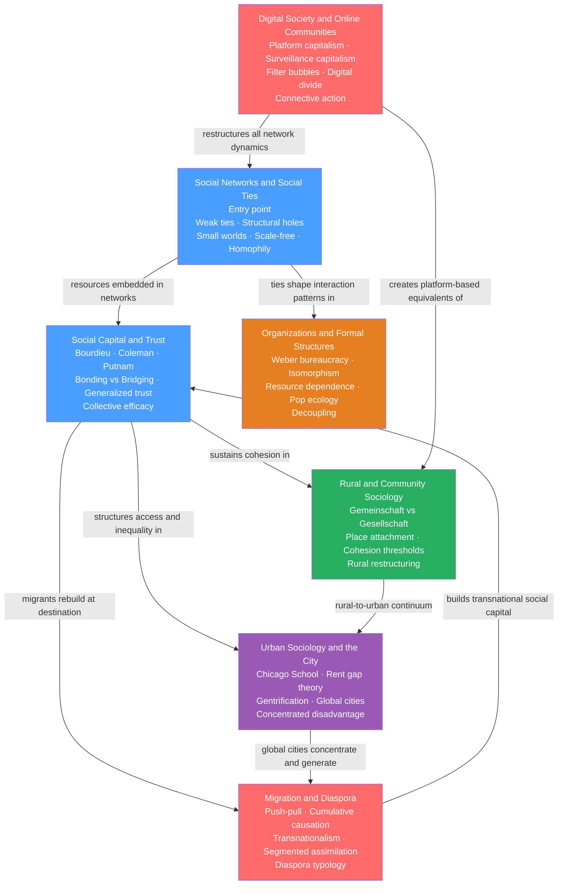

# Social Networks and Community

> [!info] How to use this map
> Start with **Social Networks and Social Ties** to get the structural toolkit, then follow the arrows downward. The Learning Path below sequences the notes from foundational concepts through spatial settings to contemporary transformations. Come back to this map when you need to see how any note connects to the rest of the section.

> [!abstract] Section Overview
> This section maps the spaces and structures of social life — from the basic topology of who knows whom, through local communities and global cities, into formal organizations, across migration corridors, and onto digital platforms. The thread connecting all seven notes is a single structural insight: the pattern of relationships people are embedded in shapes their access to information, opportunity, and power more decisively than individual attributes alone. Understanding social life therefore requires understanding social structure — how ties, trust, space, institutions, movement, and algorithms combine to produce the unequal and dynamic world we inhabit.

---

## Concept Map

*(Blue = foundational structural concepts; Green = primary community setting; Purple = urban spatial theory; Orange = formal institutional context; Red = advanced contemporary transformations. Arrows indicate "builds on" or "leads to.")*

---

## Learning Path

*Recommended order for a first pass through this section:*

1. [[Social_Networks_and_Social_Ties]] — Start here. This note provides the structural toolkit for the entire section: weak and strong ties, structural holes, betweenness centrality, small-world networks, scale-free distributions, and homophily. Every other note presupposes at least an intuition for these concepts.

2. [[Social_Capital_and_Trust]] — Extends the network toolkit to the "value" dimension. Bourdieu, Coleman, and Putnam each answer why the same structural position in a network produces different outcomes: it is about the resources, norms, and trust flowing through those ties. Bonding vs. bridging capital and generalized trust are essential for the spatial and institutional notes that follow.

3. [[Rural_and_Community_Sociology]] — The most concrete spatial grounding. Tonnies' Gemeinschaft/Gesellschaft dichotomy gives a vocabulary for comparing dense-local and loose-impersonal social organization; the percolation model of community fragmentation shows why cohesion collapses non-linearly under out-migration. Read this before the city note for maximum contrast.

4. [[Urban_Sociology_and_the_City]] — Scales community up to the metropolis and beyond. The Chicago School's ecology, Harvey and Lefebvre's political economy, Smith's rent gap, and Sassen's global cities together answer who the city is organized for and who it expels. Draws on social capital (Sampson's collective efficacy) and network topology (Granovetter's job-market weak ties in urban contexts).

5. [[Organizations_and_Formal_Structures]] — Shifts from informal ties to formal institutional settings. Weber's bureaucracy, DiMaggio and Powell's three isomorphisms, and Meyer and Rowan's decoupling thesis explain why organizations look alike even without planning, and why formal structure and actual practice routinely diverge. Resource dependence and population ecology complete the picture of organizational power and survival.

6. [[Migration_and_Diaspora]] — Brings movement back in. Massey's cumulative causation shows migration networks are self-amplifying once seeded; Piore's dual labour market explains structural demand; Portes and Rumbaut's segmented assimilation shows that context of reception — not individual effort — determines integration outcomes. Basch et al.'s transnationalism challenges the assumption that social life is bounded by a single nation-state.

7. [[Digital_Society_and_Online_Communities]] — Contemporary transformation of everything above. Castells' network society, van Dijck's platformization, and Zuboff's surveillance capitalism show how digital platforms reorganize social ties, community, and capital through datafication and algorithmic governance. Bennett and Segerberg's connective action and the filter bubble debate complete the section's intellectual arc.

---

## All Notes in This Section

| Note | Core Idea | Difficulty |
|------|-----------|------------|
| [[Social_Networks_and_Social_Ties]] | Network topology — weak ties bridge disconnected clusters, structural holes give brokers power, small-world shortcuts enable six degrees of separation, scale-free hubs concentrate influence | Intermediate |
| [[Social_Capital_and_Trust]] | Resources embedded in social networks; Bourdieu sees it as class capital reproducing inequality, Coleman as functional closure enabling norms, Putnam as the civic trust sustaining democracy | Intermediate |
| [[Rural_and_Community_Sociology]] | Gemeinschaft vs. Gesellschaft structures the entire field; rural decline is not proportional but crosses non-linear cohesion thresholds; place attachment is social infrastructure as much as sentiment | Beginner–Intermediate |
| [[Urban_Sociology_and_the_City]] | Cities are contested arenas of capital accumulation vs. resident use value; the rent gap drives gentrification and displacement; global cities polarize socially while commanding global capital flows | Intermediate |
| [[Organizations_and_Formal_Structures]] | Organizations converge toward the same structural form through coercive, normative, and mimetic isomorphism, not through optimization; formal structures decouple from actual practice to manage competing legitimacy demands | Intermediate |
| [[Migration_and_Diaspora]] | Migration is a self-amplifying social process driven by cumulative causation in network stock; transnationalism challenges the assimilation endpoint; diaspora formation creates plural, sustained cross-border belonging | Intermediate–Advanced |
| [[Digital_Society_and_Online_Communities]] | Digital platforms reorganize social life through datafication and behavioral modification; algorithmic governance of visibility, identity, and community constitutes a new form of structural power | Advanced |

---

## Key Themes

### 1. Structure over Attributes
Across every note, the central sociological move is the same: the position someone occupies in a structure — a network, a neighbourhood, an organization, a labour market segment, a digital feed — explains outcomes better than their individual characteristics alone. Granovetter's weak ties, Wilson's concentrated disadvantage, Portes and Rumbaut's segmented assimilation, and DiMaggio and Powell's isomorphism all demonstrate this.

### 2. Social Life Happens in Space
Community, city, and migration are not separate topics but different scales of the same question: how does the spatial organization of social ties produce and reproduce inequality? Tonnies' rural Gemeinschaft, Sassen's global city, and Massey's transnational corridor all answer where social life is lived and who gains or loses from that arrangement.

### 3. Cohesion and Fragmentation are Non-Linear
Whether it is the collapse of a rural community's largest connected component below a critical threshold, the cascade dynamics of Watts's global cascade model, or the rapid fragmentation of bridging capital under civic decline, sociological systems exhibit tipping points rather than smooth transitions. This is one of the section's most important and counterintuitive findings.

### 4. Institutions Shape Networks, Networks Sustain Institutions
Organizations and formal structures are not separate from the network and community dynamics described in the other notes — they are embedded in them. DiMaggio and Powell's organizational fields are networks of organizations. Coleman's network closure explains why Catholic schools worked. Massey's migration corridors are sustained by the institutional memories of co-ethnic communities.

### 5. The Digital Does Not Replace the Social — It Reorganizes It
Digital Society and Online Communities is deliberately placed last because it transforms but does not abolish the dynamics described in every preceding note. Scale-free network properties, bonding and bridging capital, community cohesion, organizational isomorphism, and migration networks all survive the digital transition — but are now mediated, amplified, and partially governed by algorithmic platforms optimizing for behavioral surplus.

---

## Key Questions This Section Answers

- Why do people find jobs through acquaintances rather than close friends — and what does that imply for how social inequality perpetuates itself?
- What is social capital, and why do some communities have enough of it to govern themselves well while others collapse under the same formal conditions?
- Who benefits from the way cities are organized, and what mechanism produces gentrification and displacement?
- Why do rural communities sometimes fragment abruptly rather than decline gradually — and what can preserve them?
- Why do all hospitals, universities, and banks end up with the same HR departments and diversity committees, regardless of whether those structures improve performance?
- How does migration become self-sustaining even when the original push-pull conditions weaken — and what determines whether the second generation rises or falls?
- What happens to social ties, community, and political participation when the public square becomes a privately owned platform optimized for behavioral data extraction?

---

## Connections to Other Topics

- [[_MOC_Sociology_Master|↑ Sociology Master MOC]] — master entry to the full Sociology vault; this section operationalizes the structural insights of theory and stratification in spatial and relational terms
- [[Social_Class_and_Stratification]] — Social capital (Bourdieu's convertible class resource), urban residential segregation, and segmented assimilation are all mechanisms through which class inequality is spatially and socially reproduced. The network toolkit of this section operationalizes the stratification processes described there.
- [[Race_Ethnicity_and_Racism]] — Residential segregation (redlining, exclusionary zoning), Blauner's internal colonialism framework for non-immigrant minorities, racialized algorithmic discrimination, and the differential contexts of reception that produce divergent assimilation paths all connect this section to race and ethnicity.
- [[Poverty_Social_Mobility_and_Life_Chances]] — Wilson's concentrated disadvantage, Sampson's collective efficacy, Chetty's neighbourhood effects research, and Massey's cumulative causation together form the empirical bridge between this section and the life-chances literature. Where you live and who you know are among the strongest predictors of where you end up.
- [[Classical_Sociological_Theory]] — Tonnies' Gemeinschaft/Gesellschaft, Weber's iron cage, Simmel's stranger and metropolis essay, Durkheim's mechanical/organic solidarity: the foundational theorists appear throughout this section as the intellectual ancestors of every major framework discussed here.
- [[Contemporary_Sociological_Theory]] — Bourdieu's field theory and social capital, Giddens's structuration (how network structure is reproduced through practice), and Foucault's disciplinary surveillance (extended by Zuboff into algorithmic form) are the contemporary theoretical backbone of the section.
- [[Political_Participation_and_Civil_Society]] — Putnam's civic engagement and declining social capital, Bennett and Segerberg's connective vs. collective action, and migrant political mobilization all bridge this section to the politics of civil society and democratic participation.
- [[Globalization_and_Its_Discontents]] — Sassen's global cities, Massey's world-systems account of migration corridors, and Castells' space of flows are the sociological face of globalization's distributional consequences — and of the place-based backlash politics that followed.

---

#Sociology #MOC
