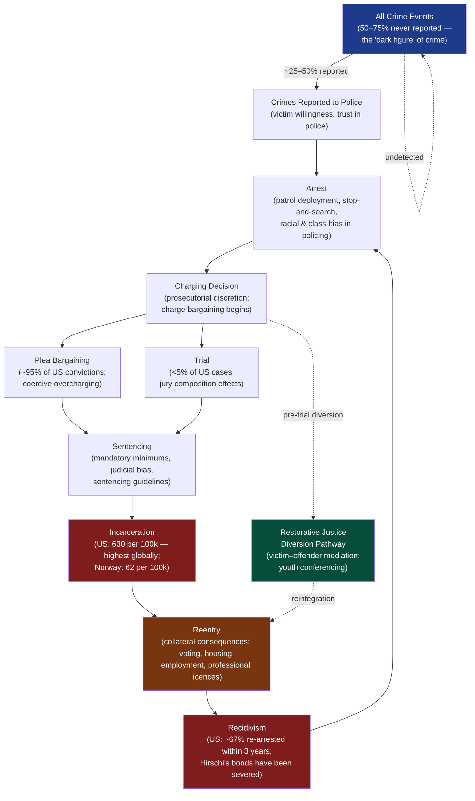

# Crime, Criminology, and Criminal Justice

> [!abstract] TL;DR
> Criminology asks three questions simultaneously: why do people commit crime, why does society respond as it does, and what does the criminal justice system actually accomplish? The answers span rational deterrence (Beccaria), structural blocked opportunity (Merton), learned technique (Sutherland), performed masculinity (Messerschmidt), and racial caste management (Alexander) — each theory implying a different reform agenda and each capturing something the others miss.

---

## Intuition

**Analogy:** Imagine three different coaches watching the same footballer miss the net repeatedly. The biomechanics coach says the player's technique is wrong — fix the swing and the goals come. The tactics coach says the player is always in the wrong position because the team's formation blocks good angles. The club economist says the player is underpaid, undertrained, and recruited from an academy that only the wealthy can attend — the miss is a structural outcome, not a personal failure. The sports journalist says the player has been publicly humiliated so many times he has mentally quit trying and now labels himself a striker who "just doesn't score."

Criminology has exactly these four coaches arguing simultaneously. The rational-choice theorist says the criminal calculated costs and benefits. The strain theorist says the social structure blocked legitimate routes to success. The differential association theorist says crime is a learned craft passed between intimate associates. The labeling theorist says the criminal identity was socially assigned and then inhabited. They are not necessarily wrong about each other — they are looking at different moments in the same causal chain.

---

## How It Works

### The Criminal Justice Funnel

Every real-world criminal event passes through a series of institutional filters, each governed by discretion, resource constraints, and structural bias. The funnel shape captures how drastically the system narrows between crime occurrence and actual punishment.



The funnel reveals a structural truth: **official crime statistics measure policing decisions as much as criminal behaviour**. Who enters at the top is shaped by victim reporting (linked to trust in police); who is arrested is shaped by patrol geography; who is convicted is shaped by resources for legal defence; who is incarcerated is shaped by mandatory sentences and judicial discretion. Any criminological analysis that begins with arrest data systematically overrepresents policed populations.

---

## Key Concepts

### Secondary Level

**What criminology is and what it studies.**

Criminology is the interdisciplinary scientific study of crime, criminals, and criminal justice. It draws on sociology, psychology, law, economics, and political science. Its central questions are:

1. **Aetiology** — what causes crime? (Why do some individuals and groups commit more crime than others?)
2. **Social reaction** — why do societies define some acts as criminal and not others? (Who decides what crime is?)
3. **Criminal justice** — what do police, courts, and prisons actually accomplish? (Do they reduce crime, or do they produce something else?)

**Classical criminology and the deterrence framework.**

The oldest systematic theory of crime is also the most intuitive. Cesare Beccaria (*On Crimes and Punishments*, 1764) and Jeremy Bentham (*Introduction to the Principles of Morals and Legislation*, 1789) argued from Enlightenment premises: human beings are rational pleasure-seekers who calculate costs and benefits before acting. Crime occurs when the expected benefits of an illegal act exceed its expected costs (probability of detection × severity of punishment).

The policy implications Beccaria drew are still debated in legislatures today:

| Deterrence Principle | Beccaria's Position | Modern Evidence |
|---|---|---|
| Certainty matters more than severity | A moderate punishment applied with high certainty deters better than a severe punishment applied rarely | Supported: certainty of arrest is correlated with crime rates; severity of sentence (beyond a threshold) shows weak independent effect (Nagin 2013) |
| Punishment should be proportionate | Excessive punishment is unjust and counter-productive — it brutalises both the offender and the public | Partially supported: mandatory minimums and three-strikes laws have not produced predicted deterrent effects |
| Swiftness matters | The shorter the delay between act and consequence, the clearer the associative learning | Supported for specific deterrence; the US criminal justice system's multi-year delays reduce this effect |
| Punishment should be public | Publicised punishment generalises deterrence to potential offenders | Mixed: high-profile sentencing has some general deterrent effect; media sensationalism distorts risk perception (availability heuristic) |

**Rational choice theory** (Cornish and Clarke 1986) modernised Beccaria: offenders make bounded-rational decisions shaped by situational factors — target attractiveness, guardianship, ease of escape. **Situational crime prevention** follows directly: reduce opportunity (locks, CCTV, lighting) rather than change people.

**Routine activity theory** (Cohen and Felson 1979) identifies three necessary conditions for a crime event: a motivated offender, a suitable target, and the absence of a capable guardian. The theory explains macroscopic crime trends without reference to individual motivation — the postwar rise in property crime in the US tracked the rise in portable consumer electronics (suitable targets) and dual-income households (reduced guardianship in homes), not a change in human nature.

**Crime taxonomy — what sociologists study:**

| Category | Examples | Key Sociological Issue |
|---|---|---|
| Violent crime | Homicide, assault, sexual violence | Gender asymmetry (men as perpetrators and victims of stranger violence); concentrated in socially disorganised neighbourhoods |
| Property crime | Theft, burglary, robbery | Most common; strongly correlated with economic inequality (Merton's strain) |
| White-collar crime | Corporate fraud, embezzlement, wage theft, price-fixing | Sutherland 1949: causes greater aggregate economic harm than all street crime combined; policed and punished far less severely |
| Victimless crime | Drug use, consensual adult sex work | Contested category: does state have legitimate authority to criminalise self-regarding acts? |
| State crime | Genocide, state torture, illegal mass surveillance | States both create criminal law and systematically violate it — a structural contradiction the standard criminological framework rarely addresses |
| Organised crime | Drug trafficking, human trafficking, extortion | Provides illicit markets where legal markets are suppressed (Prohibition as natural experiment) |

---

### Undergraduate Level

**Merton's Strain Theory (1938) — Anomie and the American Dream.**

Robert Merton's *Social Structure and Anomie* (*American Sociological Review*, 1938) is the single most cited paper in criminological sociology. The argument: American culture universally promotes material success as a goal, but the structural means to achieve it (quality education, professional networks, capital) are unequally distributed. The *strain* between the universally internalised goal and structurally blocked legitimate means creates pressure toward illegitimate means.

Merton's five adaptations (see [[Law_Deviance_and_Social_Control]] for extended treatment and Python simulation):

| Adaptation | Goals | Means | Description |
|---|---|---|---|
| **Conformity** | + | + | Accepts goals, uses legitimate means. No deviance. The statistical majority. |
| **Innovation** | + | − | Accepts success goals; substitutes illegitimate means (crime). The adaptation Merton associates with working-class property crime. |
| **Ritualism** | − | + | Abandons aspirations; goes through the motions. The rule-following bureaucrat who no longer believes in the mission. |
| **Retreatism** | − | − | Withdraws entirely. Chronic drug addiction, homelessness, social dropout. |
| **Rebellion** | ~ | ~ | Rejects prevailing goals and means; substitutes alternative ones. Revolutionary movements, radical subcultures. |

**Critical insight:** It is not absolute deprivation but *relative* deprivation — the gap between aspiration and accessible means — that produces strain. Merton's framework thus predicts that the US, with high cultural emphasis on success and among the highest income inequality in the OECD, will be structurally criminogenic regardless of absolute living standards.

---

**Subcultural Theories — Status Frustration and Differential Opportunity.**

Albert Cohen (*Delinquent Boys: The Culture of the Gang*, 1955) extended Merton in a crucial direction. Working-class boys, Cohen argued, are not simply failed economic actors — they are status competitors who have been evaluated by middle-class standards in schools and found wanting. The resulting **status frustration** produces a *reaction formation*: the delinquent subculture inverts middle-class values, awarding status for exactly the behaviours (toughness, defiance, non-utilitarian vandalism) that the dominant culture punishes.

Cohen's key additions to Merton:
- Strain is *psychological* and *symbolic* (about status and dignity), not only material
- The response is *collective*, not individual — gangs emerge as solutions to shared status problems
- The delinquent subculture is *non-utilitarian* — much gang crime is malicious or destructive rather than rationally profitable, which Merton's instrumentalism cannot explain

Richard Cloward and Lloyd Ohlin (*Delinquency and Opportunity*, 1960) combined Merton and Cohen with **differential association** (below) to produce **differential opportunity theory**. Their observation: just as legitimate means are unequally distributed, so are *illegitimate* means. Not every blocked young person can join a professional criminal organisation — access to criminal opportunity also depends on social structure.

Cloward and Ohlin identified three subcultural adaptations to blocked legitimate opportunity:

| Subculture | Condition | Characteristic Activity |
|---|---|---|
| **Criminal subculture** | Stable neighbourhood with established criminal organisation | Rational property crime; integration between youth gangs and adult criminal enterprises; apprenticeship into criminal career |
| **Conflict subculture** | Unstable, disorganised neighbourhood with no established criminal structure | Violence as a route to status; gang warfare; no economic rationale — violence *is* the product |
| **Retreatist subculture** | Blocked from both legitimate and criminal opportunity | Drug use; withdrawal from competitive status systems entirely |

**Policy implication of subcultural theory:** President Kennedy's *President's Committee on Juvenile Delinquency* (1961) and Johnson's *Great Society* programmes were directly influenced by Cloward and Ohlin. If crime results from blocked legitimate opportunity, the solution is to expand that opportunity: job training, community development, and educational investment in high-strain neighbourhoods.

---

**Sutherland's Differential Association Theory (1939).**

Edwin Sutherland's *Principles of Criminology* (3rd edition, 1939) introduced **differential association**, one of the most elegant and comprehensive learning theories of crime. Sutherland's key insight: criminal behaviour is *learned behaviour*, transmitted through normal social processes of communication and imitation within intimate personal groups. Crime is not pathological — it is socially normal, acquired the same way any other skill or attitude is acquired.

Sutherland stated the theory in nine propositions:

1. Criminal behaviour is **learned**, not inherited or invented.
2. It is learned in **interaction with other persons** in a process of communication.
3. The principal learning occurs within **intimate personal groups**; mass media and other impersonal sources play a minor role.
4. The learning includes (a) **techniques** of committing crime (from opening a lock to running a confidence scheme) and (b) **motives, drives, rationalisations, and attitudes**.
5. The specific **direction of motives and drives** is learned from definitions of legal codes as favourable or unfavourable.
6. A person becomes delinquent because of an **excess of definitions favourable to violation** of law over definitions unfavourable to violation. *This is the core of the theory.*
7. Differential associations vary in **frequency, duration, priority, and intensity**.
8. The process of learning criminal behaviour involves **all the mechanisms** of any other learning; it is not restricted to mere imitation.
9. Criminal behaviour is an **expression of general needs and values** but is not explained by them, since non-criminal behaviour expresses the same needs and values.

Proposition 6 means: whether you become criminal depends on the balance of pro-crime vs. anti-crime definitions to which you have been exposed across your lifetime associations. A child raised among professional thieves acquires, through entirely normal social learning, the skills, rationalisations, and values that make theft natural. A child of similar background who associates primarily with law-abiding peers acquires the opposite balance.

**Empirical application — white-collar crime:** Sutherland's *White Collar Crime* (1949) applied differential association to corporate crime, demolishing the then-assumption that crime was a lower-class phenomenon caused by poverty. Corporate executives commit fraud, price-fixing, and embezzlement not because they are poor or pathologically motivated but because they have been socialised in organisational cultures with an excess of definitions favourable to violating regulatory codes — reinforced by colleagues, mentors, and industry norms.

---

**Neutralization Theory (Sykes and Matza, 1957).**

Gresham Sykes and David Matza (*Techniques of Neutralization: A Theory of Delinquency*, *American Sociological Review*, 1957) made a subtle but devastating critique of subcultural theory: **delinquents are not morally committed to deviant values**. If Cohen's theory were right — that delinquent subcultures invert mainstream values — delinquents should feel no guilt or shame when caught. But they manifestly do: they express remorse, make excuses, distinguish between deserving and undeserving victims, condemn those who inform on them. They are not outside the moral order; they are temporarily suspended from it.

Sykes and Matza's concept of **drift**: delinquents exist in a moral limbo, drifting between law-abiding and criminal behaviour depending on situational context. They neutralise the constraints of the moral order before committing deviant acts, using specific **techniques of neutralization** that pre-emptively justify the behaviour to themselves:

| Technique | Definition | Example |
|---|---|---|
| **Denial of responsibility** | "It wasn't my fault — my environment made me do it." | "I was drunk / abused / from a bad neighbourhood." |
| **Denial of injury** | "Nobody was really hurt." | "It's only a corporation; insurance covers it; they can afford it." |
| **Denial of the victim** | "They deserved it." | "He was a snitch / a paedophile / he had it coming." |
| **Condemnation of the condemners** | "Those judging me are hypocrites." | "The cops are corrupt; politicians are worse than me." |
| **Appeal to higher loyalties** | "I did it for my people / my gang / my family." | "I couldn't let them disrespect my crew." |

**Why this matters beyond delinquency:** Neutralization theory has become central to the analysis of *organisational crime and white-collar crime* (Vaughan 1983; Coleman 1987). Corporate actors committing fraud routinely deploy denial of injury ("the market will self-correct"), denial of the victim ("shareholders are wealthy"), and appeal to higher loyalties ("I was protecting the jobs of our employees"). The Challenger disaster, the 2008 financial crisis, and Volkswagen's emissions scandal all show neutralization operating within legitimate organisations. The technique explains how morally ordinary people commit extraordinary institutional harms without abandoning their self-image as ethical actors.

---

**Labeling Theory and Social Bond Theory** — see [[Law_Deviance_and_Social_Control]] for full treatment of Becker's moral entrepreneurs, Lemert's primary/secondary deviance, Goffman's stigma, and Hirschi's four social bonds. The core takeaway from each for criminal justice policy:

| Theory | Key Insight | Policy Implication |
|---|---|---|
| **Labeling (Becker/Lemert)** | Social reaction creates deviant careers; the criminal record is a self-fulfilling master status | Reduce formal labeling: diversion, Ban the Box, expungement, raise age of criminal responsibility |
| **Social Bond (Hirschi)** | Conformity is maintained by four social ties (attachment, commitment, involvement, belief); crime is what happens when bonds weaken | Invest in institutions that create and sustain bonds: schools, families, communities, labour markets |

---

### Graduate Level

**Feminist Criminology: Gender, Masculinity, and Crime.**

The most robust empirical regularity in criminology is the **gender gap in offending**: in every society, for every crime type, men commit crime at substantially higher rates than women. The ratio is roughly 4:1 for overall crime and 9:1 for violent crime. Pre-feminist criminology either ignored this or explained it through biological essentialism (males have higher testosterone → aggression). Feminist criminology exposed this as ideologically saturated.

Two distinct feminist contributions:

**1. The chivalry hypothesis and women's invisibility in criminology (Heidensohn 1968, Smart 1976):** Mainstream criminology was written by men, about men, for men. Women's crime was either ignored, sensationalised (the "female offender" as doubly deviant — violating gender norms as well as law), or explained through biological/psychological pathology (pre-menstrual syndrome, sexual dysfunction). The criminal justice system applied a *chivalry effect* to some women (first-offence leniency) and a *double jeopardy effect* to others (harsh treatment of women who violated gender norms — the unmarried mother, the sex worker, the violent woman). Feminist criminology demanded a **gendered criminology** rather than a criminology that treated the male experience as universal and the female as exceptional.

**2. Messerschmidt's masculinity and crime (*Masculinities and Crime*, 1993):** James Messerschmidt drew on Raewyn Connell's theory of *hegemonic masculinity* (the culturally dominant form of manhood that organises gender relations) to explain why crime is overwhelmingly male. His argument: **crime is a resource for "doing masculinity"** when legitimate resources (breadwinning, authority, physical dominance in valued occupations) are unavailable.

Messerschmidt identified how different *forms* of masculinity produce different *forms* of crime:

| Masculine Position | Structural Location | Criminal Expression |
|---|---|---|
| **Hegemonic masculinity** | White middle-class men in authority positions | White-collar crime; sexual harassment; domestic violence used to reassert household authority |
| **Subordinated masculinity** | Working-class white men with limited legitimate resources | Street crime; gang violence; robbery as masculine performance of power and toughness |
| **Marginalised masculinity** | Young men of colour at intersection of class and racial subordination | Gang crime; violent crime; drug markets — structured by *both* class exclusion (Merton/Cloward) *and* racial exclusion (Alexander) |

**Critical assessment:** Messerschmidt's framework elegantly links gender, class, and race through the common mechanism of masculine identity construction. Critics note it can become circular (crime is masculinity performed; masculine performance is crime) and struggles to explain why *most* men in subordinated positions do not commit crime. It also undertheorises women's crime, though Chesney-Lind's *pathways theory* — showing that women's criminal trajectories are typically rooted in childhood victimisation (abuse, neglect) driving runaway, homelessness, drug use, and survival crime — provides the necessary complement.

---

**Critical and Marxist Criminology.**

Classical criminology accepts the legal definition of crime as given. Critical criminology asks: who defines crime? The answer, in the Marxist tradition, is: the class with the power to write and enforce law.

William Chambliss's study "The Saints and the Roughnecks" (*Society*, 1973) documented two groups of delinquent teenagers in a US high school: middle-class "Saints" and working-class "Roughnecks." The Saints committed more serious crimes (drunk driving, vandalism, truancy) more frequently — but were never arrested. The Roughnecks were arrested repeatedly for less serious offences. The difference was entirely attributable to police discretion shaped by class presentation: the Saints were polite, deferential, had access to cars (which removed them from visible street corners), and had parents who intervened effectively. Chambliss concluded that the criminal justice system *produces* the criminal classes it claims to be responding to.

Richard Quinney (*The Social Reality of Crime*, 1970) systematised the Marxist argument: criminal definitions are formulated by social groups with the power to shape public policy; criminal behaviour patterns develop in response to those definitions; the concept of crime itself is constructed to serve the interests of the dominant class. The "war on drugs" is not a war on drugs — it is a mechanism for managing surplus labour populations and racially subordinated communities excluded from the formal economy.

**Limitations of the critical approach:** It is stronger as critique than as causal theory. Explaining *why* people commit acts defined as criminal — even acts that harm members of their own class (most violent crime is intra-class and intra-racial) — requires resources from strain, subcultural, and social bond theories that critical criminology tends to absorb but does not independently generate.

---

**Mass Incarceration and the Carceral State.**

The United States incarcerates approximately 2 million people on any given day — a rate of 630 per 100,000, compared with 130 in the UK and 62 in Norway. This is not a historical constant: the US incarceration rate quadrupled between 1975 and 2000, driven almost entirely by drug offences and mandatory minimum sentencing laws passed during the Reagan and Clinton administrations.

Michelle Alexander's *The New Jim Crow* (2010) argues this constitutes a racial caste system: because drug use rates are roughly equal across racial groups but enforcement is geographically concentrated in Black and Latino neighbourhoods, Black Americans are imprisoned for drug offences at 10–15 times the rate of white Americans. The resulting felony record strips convicted persons of voting rights, public housing eligibility, student loan access, and professional licences across 45,000+ collateral consequences — functional equivalents of the legal disabilities that defined Jim Crow segregation.

For the theoretical architecture connecting these observations to the broader criminological tradition:
- **Merton's strain** explains the economic conditions in deindustrialised Black communities that elevated criminal innovation as an adaptation
- **Cloward/Ohlin's differential opportunity** explains why drug markets (criminal subcultures with accessible criminal opportunity structures) emerged specifically in those communities
- **Labeling theory** explains why the felony record functions as a permanent master status, producing secondary deviance through labour market exclusion
- **Foucault's carceral continuum** explains how the prison's failures (recidivism, community destruction) are not failures at all but functional products of a system that produces manageable, surveilled populations

For deep treatment of Foucault's *Discipline and Punish*, restorative justice (Braithwaite), and the full evidential record on mass incarceration, see [[Law_Deviance_and_Social_Control]].

---

**White-Collar Crime and the Limits of Classical Theory.**

Sutherland coined the term "white-collar crime" in his presidential address to the American Sociological Association in 1939, defining it as "a crime committed by a person of respectability and high social status in the course of his occupation." His point was not taxonomic — it was polemical. Sutherland demonstrated empirically that 70 of the 70 largest US corporations had been convicted or officially cited for criminal or regulatory violations; the average corporation had been found in violation 14 times. If crime were a product of poverty, psychological pathology, or social disorganisation, why were the most powerful economic actors in the country among the most persistent offenders?

The criminological implications:

1. **Classical deterrence theory** systematically underestimates corporate crime: the probability of detection and prosecution of white-collar crime is far lower than for street crime (no patrol officers in corporate boardrooms); penalties are typically financial (cost-of-doing-business fines) rather than custodial; the stigma of prosecution rarely attaches to individuals.

2. **Differential association** explains it better: corporate crime is learned behaviour, transmitted through organisational culture, mentorship, and industry norms. The investment banker who commits securities fraud has learned from senior colleagues that certain regulatory provisions are "guidelines," that enforcement is lax, and that the social definition of such acts as "aggressive but legitimate business practice" dominates.

3. **Neutralization theory** explains *how*: white-collar offenders systematically deny injury ("the market allocates resources efficiently regardless"), deny victims ("shareholders understand the risk"), condemn the condemners ("regulators don't understand business"), and appeal to higher loyalties ("I was protecting shareholder value / employee jobs").

4. **Critical criminology** explains the pattern of non-enforcement: the legislators who write securities law, the regulators who enforce it, and the executives who violate it move through the same social networks, attend the same schools, and rotate through the same institutions (the revolving door). The legal definition of financial crime is not the product of neutral deliberation — it reflects the power of financial capital to shape regulatory definitions in its own interests.

---

## Python Demo

```python
import numpy as np
import matplotlib.pyplot as plt

# ─────────────────────────────────────────────────────────────────────────────
# Merton's Strain Theory — Population Simulation
#
# Model: N individuals, each with:
#   goal_i  ~ Beta(8, 2)     : strength of internalised cultural success goal.
#             High alpha concentrates mass near 1 — the American Dream is
#             universally promoted regardless of class position.
#   means_i ~ Beta(a, b)     : access to legitimate institutional means
#             (education, employment, social capital, professional networks).
#             As structural inequality rises, 'a' shrinks — legitimate means
#             concentrate at the top and become inaccessible to most.
#
# Adaptation classification (Merton 1938):
#   goal >= G_THRESH & means >= M_THRESH  ->  Conformity   (0)
#   goal >= G_THRESH & means <  M_THRESH  ->  Innovation   (1)  <- crime
#   goal <  G_THRESH & means >= M_THRESH  ->  Ritualism    (2)
#   goal <  G_THRESH & means <  M_THRESH  ->  Retreatism   (3)
#   Retreatist, with probability R_PROB   ->  Rebellion    (4)
#
# We sweep inequality from 0.05 (near-equal access) to 0.85 (extreme
# concentration), keeping the cultural goal distribution CONSTANT.
# This makes Merton's structural argument explicit: the adaptation
# distribution shifts because opportunity changes, not because
# aspirations change.
# ─────────────────────────────────────────────────────────────────────────────

np.random.seed(42)
N = 6_000
INEQUALITY = np.linspace(0.05, 0.85, 9)
LABELS = ["Conformity", "Innovation\n(Crime)", "Ritualism", "Retreatism", "Rebellion"]
COLORS = ["#2563eb", "#dc2626", "#d97706", "#6b7280", "#7c3aed"]

G_THRESH = 0.55   # threshold separating high/low goal internalisation
M_THRESH = 0.45   # threshold separating high/low means access
R_PROB   = 0.12   # proportion of retreatists who become rebels instead

def means_distribution(ineq, n):
    """Beta(alpha, 2.5) for means access.
    alpha drops from 6.0 (equal society) to 0.3 (extreme inequality),
    progressively shifting the distribution toward low means access."""
    alpha = 6.0 - 5.7 * ineq
    return np.random.beta(alpha, 2.5, n)

# Goals are fixed: every individual in a high-aspiration society
goals = np.random.beta(8, 2, N)

props = np.zeros((len(INEQUALITY), 5))

for i, ineq in enumerate(INEQUALITY):
    means   = means_distribution(ineq, N)
    high_g  = goals >= G_THRESH
    high_m  = means >= M_THRESH
    rebel   = np.random.random(N) < R_PROB

    adapt = np.where(
        high_g & high_m,  0,
        np.where(
            high_g & ~high_m, 1,
            np.where(
                ~high_g & high_m, 2,
                np.where(~high_g & ~high_m & rebel, 4, 3)
            )
        )
    )
    for j in range(5):
        props[i, j] = (adapt == j).mean()

# ── Visualisation ─────────────────────────────────────────────────────────────
fig, axes = plt.subplots(1, 3, figsize=(18, 6))

# Panel 1: Stacked bar — composition at each inequality level
ax = axes[0]
bottom = np.zeros(len(INEQUALITY))
x = np.arange(len(INEQUALITY))
for j in range(5):
    ax.bar(x, props[:, j], bottom=bottom,
           label=LABELS[j], color=COLORS[j], alpha=0.87,
           edgecolor="white", linewidth=0.5)
    bottom += props[:, j]
ax.set_xticks(x)
ax.set_xticklabels([f"{v:.2f}" for v in INEQUALITY], fontsize=8, rotation=30)
ax.set_xlabel("Structural Inequality Level\n(0 = equal access, 1 = extreme concentration)")
ax.set_ylabel("Proportion of Population")
ax.set_title("Adaptation Composition\nat Each Inequality Level")
ax.legend(loc="upper right", fontsize=8)
ax.set_ylim(0, 1)
ax.grid(axis="y", alpha=0.3)

# Panel 2: Line trajectories — how each adaptation shifts
ax2 = axes[1]
for j in range(5):
    ax2.plot(INEQUALITY, props[:, j], color=COLORS[j],
             marker="o", linewidth=2.2, markersize=5,
             label=LABELS[j].replace("\n", " "))
ax2.set_xlabel("Structural Inequality Level")
ax2.set_ylabel("Proportion of Population")
ax2.set_title("Trajectory of Each Adaptation\nas Inequality Rises")
ax2.legend(fontsize=8)
ax2.grid(alpha=0.3)
ax2.set_xlim(0, 0.9)

# Panel 3: Means access distribution at low vs. high inequality
ax3 = axes[2]
low_ineq  = np.random.beta(6.0 - 5.7 * 0.05, 2.5, 10000)
mid_ineq  = np.random.beta(6.0 - 5.7 * 0.45, 2.5, 10000)
high_ineq = np.random.beta(6.0 - 5.7 * 0.85, 2.5, 10000)
bins = np.linspace(0, 1, 50)
ax3.hist(low_ineq,  bins=bins, alpha=0.55, color="#2563eb",
         density=True, label="Inequality = 0.05 (low)")
ax3.hist(mid_ineq,  bins=bins, alpha=0.55, color="#d97706",
         density=True, label="Inequality = 0.45 (mid)")
ax3.hist(high_ineq, bins=bins, alpha=0.55, color="#dc2626",
         density=True, label="Inequality = 0.85 (high)")
ax3.axvline(M_THRESH, color="black", linestyle="--", linewidth=1.2,
            label=f"Means threshold = {M_THRESH}")
ax3.set_xlabel("Legitimate Means Access (0 = none, 1 = full)")
ax3.set_ylabel("Density")
ax3.set_title("Means Access Distribution\nShifts as Inequality Rises\n(Goals held constant at Beta(8,2))")
ax3.legend(fontsize=8)
ax3.grid(alpha=0.3)

fig.suptitle(
    "Merton's Anomie / Strain Theory  —  N = {:,} agents\n"
    "Key insight: increasing structural inequality shifts population into Innovation (crime) and Retreatism\n"
    "without any change in individual aspiration — the structural, not cultural, driver of crime".format(N),
    fontsize=10
)
plt.tight_layout()
plt.savefig("merton_strain_inequality.png", dpi=150, bbox_inches="tight")
plt.show()
```

**What the simulation demonstrates:**

- The third panel (means access distributions) makes Merton's structural argument *visible*: the cultural goal distribution (Beta(8,2)) is identical across all runs — everyone is equally ambitious. Only the opportunity structure changes. Yet the adaptation composition shifts dramatically.
- At **low inequality**, most individuals land above the means threshold: Conformity dominates. Ritualism is the second-largest category (means accessible but aspirations quietly abandoned).
- As **inequality rises**, Innovation (crime) increases steeply — the population retains high aspirations but finds legitimate routes progressively blocked. This is Merton's *criminogenic culture*: not an immoral culture but an aspirational one with closed legitimate doors.
- **Retreatism** grows at high inequality as both goals and means are denied to a widening share.
- **Rebellion** remains a small but rising fraction — the politically organised response that substitutes alternative social orders rather than simply opting out.
- The simulation refutes the *individualistic* explanation of crime: no individual's character changed; structural opportunity shifted. The policy implication is to widen legitimate opportunity (education, employment, wealth-building), not to intensify punishment of the inevitable criminal adaptations that blocked opportunity produces.

---

## Real-World Applications

**1. Classical deterrence tested — Three Strikes laws and mandatory minimums.**

If Beccaria's deterrence model were correct, dramatically increasing sentence severity should reduce crime. California's "Three Strikes and You're Out" law (1994) mandated life imprisonment for a third felony conviction. A rigorous natural-experiment evaluation (Helland and Tabarrok 2007) found the law had a modest deterrent effect on two-strike offenders — consistent with certainty-of-consequence effects — but far smaller than proponents claimed, and concentrated among offenders already aware of their prior convictions. Mandatory minimum sentencing for drug offences showed negligible aggregate crime reduction effects (National Academy of Sciences 2014 meta-analysis) while generating enormous costs and racial disparities — directly consistent with Beccaria's own argument that it is *certainty*, not severity, that deters.

**2. Cloward and Ohlin in practice — Chicago's Mobilisation for Youth.**

The 1960s Mobilisation for Youth programme in New York City, directly designed by Cloward as a test of differential opportunity theory, expanded legitimate opportunity for working-class youth: job training, community organisation, educational resources, and legal services. Early evaluations were complicated by political backlash (the FBI investigated Mobilisation for Youth as a communist organisation — itself an illustration of Quinney's critical criminology). Long-run research on Head Start and similar opportunity-expansion programmes found significant reductions in adult criminal records among participants (Heckman 2006) — supporting the differential opportunity framework.

**3. Neutralization in corporate culture — the 2008 financial crisis.**

Mortgage originators, securities packagers, and rating agency analysts who produced and sold toxic mortgage-backed securities in 2005–2007 overwhelmingly avoided criminal prosecution. Ethnographic and interview-based research (Ho 2009, *Liquidated: An Ethnography of Wall Street*; Lewis 2010, *The Big Short*) documented the neutralization techniques in use: denial of injury ("the instruments are priced by the market — there is no victim until the market corrects"), denial of responsibility ("I'm just following client orders"), and condemnation of the condemners ("regulators don't understand the complexity of the instruments"). Of the approximately 800 executives prosecuted after the 1980s S&L crisis — a smaller fraud — fewer than 35 were prosecuted after 2008, illustrating critical criminology's prediction about selective enforcement.

**4. Messerschmidt's masculinity framework — gang violence and institutional responses.**

David Kennedy's *Operation Ceasefire* (Boston, 1996) and the subsequent *Group Violence Intervention* (GVI) model provide an indirect empirical test of subcultural and masculinity frameworks. Kennedy's research established that Boston gang violence was overwhelmingly concentrated among a small network of young men whose violence was directly linked to challenges to masculine respect and honour within the gang structure — consistent with Cohen's status frustration and Messerschmidt's masculine performance. GVI's intervention: direct social pressure from community members and ex-offenders (disrupting the in-group definitions that made violence legitimate — Sutherland's balance of definitions), combined with credible certain consequences for continued violence (deterrence) and simultaneous expansion of legitimate opportunity (jobs, services). Boston homicides fell by 63% in the first two years. GVI has since been replicated in over 80 US cities, consistently producing 20–60% reductions in group-member homicide. The programme is theoretically *multi-theoretical* — deliberately — which is itself a criminological lesson: single-theory interventions underperform because crime is causally overdetermined.

**5. Restorative justice at scale — New Zealand's Youth Justice system.**

New Zealand reformed its youth justice system in 1989 with the Children, Young Persons, and Their Families Act, making **family group conferencing** — a restorative process rooted in Maori *hui* tradition — the default response to youth offending. Rather than prosecution, the young person, their family, the victim and their support network, police, and social workers meet to establish what happened, what harm was caused, and what the young person should do to repair it. Evaluations (Morris and Maxwell 2001) found high victim satisfaction (80%+ felt involved and heard), lower recidivism compared to court-processed youth, and significant cost savings. New Zealand's youth incarceration rate is a fraction of the US rate. The programme is a practical instantiation of Braithwaite's *reintegrative shaming*: it condemns the act explicitly while affirming the young person's continued membership in the moral community — exactly reversing the secondary deviance process Lemert described.

---

## Common Pitfalls

- **Treating deterrence as if severity and certainty are interchangeable.** The academic and political consensus since Nagin and Paternoster (1991) is that certainty of punishment is the operative deterrent variable; severity beyond a modest threshold adds little. Politicians routinely increase sentence severity (which is visible and signals toughness) rather than certainty (which requires expensive investments in police, prosecution, and detection). Criminological analysis must distinguish the two.

- **Applying Merton only to working-class crime.** Strain theory is often read as a theory of poor people's property crime. But Merton's framework is explicitly about the disjuncture between cultural goals and accessible means, which applies equally to corporate executives whose legal means (competitive markets, regulatory constraints) are insufficient to hit quarterly earnings targets. Sutherland made this point in 1949; it is still neglected in policy discussions.

- **Conflating "learning theory" (differential association) with peer pressure.** Sutherland's theory is not primarily about peer pressure (social bond theory's involvement dimension). It is about the *content* of what is learned — definitions, rationalisations, and techniques — not merely exposure to delinquent companions. An individual who associates with criminals but acquires anti-crime definitions from those associations (police informants, reformed criminals) does not, on Sutherland's theory, have excess pro-crime definitions. The distinction matters for interventions: mentorship by ex-offenders can either transmit anti-crime definitions (if carefully structured, as in GVI) or pro-crime definitions (if poorly managed).

- **Reading neutralization techniques as mere post-hoc rationalisations.** Sykes and Matza argued that neutralizations are applied *before* the deviant act, not only after. They function as *moral licences* — cognitive preparation that pre-empts the anticipated guilt. This has been confirmed by studies of white-collar offending (Coleman 1987) and of soldiers in morally ambiguous conflict situations. An intervention that changes the available neutralizations (by making denial of injury implausible, or by making denial of responsibility harder through explicit accountability structures) may reduce offending pre-emptively.

- **Conflating feminist criminology's two arguments.** The argument that women are disproportionate victims of crime and the argument that crime is a masculine performance are distinct claims requiring different evidence. Messerschmidt's masculinity framework is not refuted by data on women's crime (it is, like all structural theories, a probabilistic framework, not a universal one); the pathways framework (Chesney-Lind) is not refuted by data on men's crime. A comprehensive feminist criminology needs both.

- **Using recidivism rates to evaluate correctional programmes without controlling for selection.** Prisoners who complete rehabilitative programmes in custody have lower recidivism than those who do not — but this correlation is massively confounded by selection: motivated, higher-functioning prisoners self-select into programmes. Rigorous evaluation requires random assignment to programme participation (as in several drug court studies) or quasi-experimental designs exploiting natural variation in programme availability. Raw recidivism comparisons support neither rehabilitation nor its absence.

---

## Related Concepts

- [[Law_Deviance_and_Social_Control]] — the primary companion note covering the sociology of deviance from Durkheim through Foucault; provides full treatment of labeling theory, Hirschi's social bonds, Foucault's carceral continuum, mass incarceration, and restorative justice that this note cross-references
- [[Social_Class_and_Stratification]] — Merton's strain theory is explicitly a theory of class-structured aspiration: the cultural success goal is universal but the legitimate means are class-distributed; property crime concentrations track class geography
- [[Race_Ethnicity_and_Racism]] — racial disparities in policing, prosecution, and incarceration are not explicable by differential offending rates; Alexander's "New Jim Crow" thesis, Chambliss's "Saints and Roughnecks," and differential stop-and-search patterns all require racial formation theory alongside criminological frameworks
- [[Poverty_Social_Mobility_and_Life_Chances]] — the Great Gatsby Curve (Corak 2013) establishes the same empirical regularity as Merton's theory at the macro level: high inequality predicts low mobility and (by extension) high crime; Weber's life chances concept is the structural backdrop for differential opportunity theory
- [[Conflict_Theory_and_Critical_Theory]] — Marxist criminology (Chambliss, Quinney) derives from conflict theory's claim that law and its enforcement protect the interests of the dominant class; Gramsci's hegemony explains how those definitions achieve the status of common sense
- [[Gender_Sex_and_Patriarchy]] — Messerschmidt's masculinity theory requires Connell's hegemonic masculinity framework; feminist criminology is grounded in the structural analysis of gender that patriarchy theory provides; the gender gap in offending is the most robust fact in criminology
- [[Intersectionality]] — Crenshaw's intersectionality framework is required to analyse how race, class, and gender interact in criminal justice outcomes; a Black working-class woman's experience of the criminal justice system differs qualitatively from any single-axis analysis
- [[Symbolic_Interactionism_and_Microsociology]] — labeling theory and Goffman's stigma analysis are applications of symbolic interactionism; the criminal career is a microsociological process of identity negotiation shaped by the reactions of others
- [[Prejudice_and_Discrimination]] — implicit bias research documents racial stereotyping in police shoot/don't-shoot decisions, jury verdicts, and judicial sentencing; these are empirical instantiations of labeling theory's prediction that social characteristics of the actor shape social reactions to identical acts
- [[Group_Dynamics]] — Sutherland's differential association is a theory of group-level learning; gang dynamics are explicable through group polarisation (shifts toward extreme positions through within-group discussion) and Cohen's status frustration operating within a competitive group structure
- [[Social_Influence_and_Conformity]] — Milgram's obedience experiments illuminate how ordinary police officers and prison guards can be induced to engage in systematic violence; Asch's conformity findings explain compliance with criminal peer groups that Sutherland's balance-of-definitions framework requires
- [[Welfare_States_and_Social_Policy]] — Garland's *Culture of Control* (2001) argues that penal expansion tracks welfare state retrenchment across OECD countries: the punitive state substitutes for the social protection that welfare states provide; Scandinavian penal exceptionalism (low incarceration rates) correlates with strong universalist welfare states
- [[Social_Contract_Theory]] — criminal law is foundational to social contract theory; Hobbes's Leviathan is designed precisely to prevent the war of all against all through a monopoly on legitimate violence; Rawls's veil-of-ignorance principles generate direct implications for just punishment
- [[Decision_Making_and_Reward_Circuits]] — neuroscientific evidence on impulsivity, reward sensitivity, and temporal discounting provides the biological substrate for classical deterrence theory's failure at long time-horizons; adolescent crime peaks are explained partly by prefrontal cortex maturation trajectories
- [[Psychiatric_Disorders_and_Neurobiology]] — antisocial personality disorder, substance use disorders, and impulse-control disorders are overrepresented in prison populations; the causal arrow is complex (mental illness drives crime AND incarceration drives mental illness), and criminalisation of mental illness is a contemporary critique of deinstitutionalisation policy

---

## Review Questions

### Secondary

1. Beccaria argued that certainty of punishment deters crime more effectively than severity. A politician proposes doubling prison sentences for drug possession as a crime-reduction measure. Using Beccaria's framework and the evidence on deterrence, evaluate this proposal. What would be a more effective deterrence-based intervention?

2. Imagine two teenagers: one grows up in a stable neighbourhood with strong schools and employed parents; the other in a deindustrialised neighbourhood with high unemployment, weak schools, and family instability. Both have the same level of cultural aspiration (both want economic success). Using Merton's strain theory, predict how each teenager's adaptation might differ — and explain why Merton would say the difference is structural, not a matter of individual character.

3. Cohen and Cloward/Ohlin both extend Merton's strain theory but in different directions. What does Cohen add that Merton misses? What does Cloward/Ohlin add that Cohen misses? Which theory best explains the non-economic aspects of gang violence (tagging, territorial fights over symbolic prestige rather than resources)?

### Undergraduate

1. Sutherland claimed that criminal behaviour is learned through the same normal processes as any other behaviour, and he demonstrated this with white-collar crime. Does differential association theory explain corporate crime *better* than it explains street crime, or equally well? What aspects of corporate crime (specifically, the role of organisational culture and regulatory capture) does differential association handle better than rational choice theory or strain theory?

2. Sykes and Matza argued that delinquents are not committed to deviant values but drift between conformity and deviance using neutralization techniques. How does this critique change the implications of subcultural theory (Cohen's inverted values thesis)? Design a field research study that could test whether neutralization precedes or follows the deviant act in a specific organisational crime context.

3. The gender gap in offending (men commit ~80% of violent crime) is criminology's most robust empirical regularity. Messerschmidt's masculinity framework and biosocial theories (testosterone, prenatal androgens, evolution) both claim to explain it. What kinds of evidence would allow you to adjudicate between these explanations? What cross-cultural and historical evidence bears on the question, and what does it support?

### Graduate

1. The criminal justice funnel is characterised by substantial discretion at every stage (reporting, arrest, charging, plea, sentencing). Critical criminologists argue this discretion systematically produces racially and class-stratified outcomes even in the absence of explicit discriminatory intent — a structural racism argument. How would you design a research programme to distinguish between (a) structural racism through facially neutral but disparate-impact policies, (b) implicit bias at individual decision-making nodes, and (c) differential offending rates driven by structural strain? What are the methodological challenges, and what policy frameworks follow from each causal attribution?

2. Sutherland's differential association, Sykes and Matza's neutralization theory, and Messerschmidt's masculinity framework all locate crime causation in learned cultural content rather than in blocked structural opportunity. Are they genuinely competing with strain theory (Merton, Cloward/Ohlin), or are they explaining different stages of the same causal process? Construct a synthetic causal model that incorporates structural, learning, and identity-based mechanisms, and identify a real-world intervention programme that implicitly operationalises all three.

3. Alexander's "New Jim Crow" thesis, Garland's "culture of control" explanation, and Western's labour-market account all offer different explanations of mass incarceration in the United States — racial caste management, cultural punitiveness in the face of late-modern insecurity, and surplus labour force management respectively. Are these accounts genuinely competing, or are they capturing different levels of the same phenomenon? Using the comparative evidence from Scandinavian penal exceptionalism (low inequality, strong welfare state, low incarceration, low recidivism) and the Portuguese drug decriminalisation model (2001–present), identify the conditions under which each explanation's favoured reforms — racial justice, welfare expansion, labour market reform — would be jointly necessary and jointly sufficient to produce penal moderation in a high-inequality, high-incarceration context.

---

## Sources

- [Beccaria, C. (1764). *On Crimes and Punishments*. (H. Paolucci, trans., 1963). Bobbs-Merrill](https://archive.org/details/oncrimesspunishm00becc)
- [Bentham, J. (1789). *Introduction to the Principles of Morals and Legislation*. Clarendon Press (1907 edition)](https://archive.org/details/antecedentfactor00bent)
- [Merton, R.K. (1938). "Social Structure and Anomie." *American Sociological Review* 3(5), 672–682](https://www.jstor.org/stable/2084686)
- [Cohen, A.K. (1955). *Delinquent Boys: The Culture of the Gang*. Free Press](https://www.simonandschuster.com/books/Delinquent-Boys/Albert-K-Cohen/9780029055403)
- [Cloward, R.A. & Ohlin, L.E. (1960). *Delinquency and Opportunity: A Theory of Delinquent Gangs*. Free Press](https://archive.org/details/delinquencyoppor00clow)
- [Sutherland, E.H. (1939). *Principles of Criminology* (3rd ed.). Lippincott](https://archive.org/details/principlesofcrim00suth)
- [Sutherland, E.H. (1949). *White Collar Crime*. Dryden Press](https://archive.org/details/whitecollarcrime00suth)
- [Sykes, G.M. & Matza, D. (1957). "Techniques of Neutralization: A Theory of Delinquency." *American Sociological Review* 22(6), 664–670](https://www.jstor.org/stable/2088191)
- [Cornish, D.B. & Clarke, R.V. (1986). *The Reasoning Criminal: Rational Choice Perspectives on Offending*. Springer-Verlag](https://link.springer.com/book/9780387963259)
- [Cohen, L.E. & Felson, M. (1979). "Social Change and Crime Rate Trends: A Routine Activity Approach." *American Sociological Review* 44(4), 588–608](https://www.jstor.org/stable/2094589)
- [Hirschi, T. (1969). *Causes of Delinquency*. University of California Press](https://ucpress.edu/book/9780520019010/causes-of-delinquency)
- [Messerschmidt, J.W. (1993). *Masculinities and Crime: Critique and Reconceptualization of Theory*. Rowman & Littlefield](https://rowman.com/ISBN/9780847678082)
- [Chambliss, W.J. (1973). "The Saints and the Roughnecks." *Society* 11(1), 24–31](https://link.springer.com/article/10.1007/BF02701417)
- [Quinney, R. (1970). *The Social Reality of Crime*. Little, Brown](https://archive.org/details/socialrealityofc0000quin)
- [Alexander, M. (2010). *The New Jim Crow: Mass Incarceration in the Age of Colorblindness*. The New Press](https://thenewpress.com/books/new-jim-crow)
- [Braithwaite, J. (1989). *Crime, Shame, and Reintegration*. Cambridge University Press](https://www.cambridge.org/core/books/crime-shame-and-reintegration/8B0A571BEA6B49B4D86A29B3AF3ADCDB)
- [National Academy of Sciences (2014). *The Growth of Incarceration in the United States: Exploring Causes and Consequences*. National Academies Press](https://nap.nationalacademies.org/catalog/18613)
- [Nagin, D.S. (2013). "Deterrence in the Twenty-First Century." *Crime and Justice* 42(1), 199–263](https://www.journals.uchicago.edu/doi/10.1086/670398)

---

#Sociology #AppliedSociology #Criminology #CriminalJustice #StrainTheory #DifferentialAssociation #Neutralization #ClassicalCriminology #MasculinityCrime #MassIncarceration
