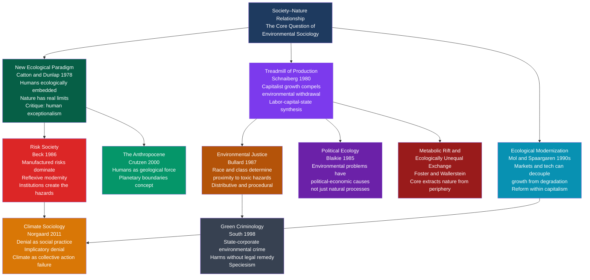

# Environmental Sociology and Ecological Crisis

> [!abstract] TL;DR
> Environmental sociology asks why industrial societies systematically degrade the natural systems they depend on — and discovers that the answer is not ignorance or accident but the structural logic of capitalist production, the unequal distribution of ecological harm, and a dominant cultural worldview that treats nature as an infinite supply depot and waste bin. From Schnaiberg's treadmill of production to Bullard's environmental justice framework to Beck's risk society, this field shows that the ecological crisis is inseparable from the social crisis.

---

## Intuition

**Analogy:** Imagine a factory town built around a river. The factory provides jobs, tax revenue, and political influence — it is the engine of the town's economy. The owners know the factory is polluting the river, but cleaning up costs money and reduces profit. The workers know their drinking water is degrading, but they need the jobs. Local politicians know both, but they depend on the factory's tax base. Each party is individually rational. Together, they produce a collective catastrophe. And notice: the poorest residents, with no political voice, live downstream.

This is environmental sociology in miniature. The ecological crisis is not caused by people being stupid or evil — it is produced by the intersection of economic incentives, power asymmetries, and cultural frameworks that define nature as separate from and subordinate to human purposes. Understanding those structures is the prerequisite to changing them.

---

## How It Works



---

## Key Concepts

### Secondary Level

**What Is Environmental Sociology?**

Environmental sociology is the study of the relationships between human societies and the natural environment — but with a critical twist. Where natural scientists study environmental change as a physical process, environmental sociologists ask: why do societies organize themselves in ways that produce ecological destruction? Who benefits? Who bears the harm? What cultural assumptions make environmental degradation appear normal or inevitable? The field emerged from the 1970s environmental movement and was theoretically consolidated by William Catton and Riley Dunlap's 1978 call for a "New Ecological Paradigm."

**The Human Exceptionalism Paradigm vs the New Ecological Paradigm**

Catton and Dunlap argued that Western social science since the Enlightenment had operated on a set of assumptions they called the **Human Exceptionalism Paradigm (HEP)**:

| Human Exceptionalism Paradigm | New Ecological Paradigm |
|-------------------------------|------------------------|
| Humans are unique — culture and technology liberate us from ecological constraints | Humans are one species among many, embedded in ecosystems we depend on |
| The environment is a resource base for human purposes | Nature has intrinsic limits; ecosystems can be overwhelmed |
| Problems generated by growth can be solved by more growth (technologically) | Some environmental changes are irreversible; "carrying capacity" is real |
| Human progress is the telos of history | Human societies can collapse through ecological overshoot |

The HEP is not a fringe view — it is the implicit operating assumption of mainstream economics, liberal political theory, and most policymaking. Every GDP growth target, every cost-benefit analysis that discounts future generations, and every "we will innovate our way out of it" response to ecological limits embodies the HEP. The NEP says: this assumption is empirically wrong and sociologically dangerous.

**The Treadmill of Production (Schnaiberg, 1980)**

Allan Schnaiberg's *The Environment: From Surplus to Scarcity* is the foundational text of critical environmental sociology. His argument:

1. **Capital requires growth.** Competitive markets compel firms to expand production or be undercut by competitors. Profit requires increasing the scale of extraction (inputs from nature) and disposal (outputs into nature).
2. **The state is dependent on the treadmill.** Governments depend on tax revenue from production and on employment to maintain legitimacy. They have structural incentives to prioritize economic expansion over ecological protection.
3. **Labor is co-opted.** Workers need jobs. Even if they suffer environmental harm from pollution, they depend on the treadmill for income. This creates "a synthesis" of production interests that consistently overrides environmental protection.

The treadmill cannot be stopped voluntarily by any individual actor — not the capitalist who would lose market share, not the state that would lose revenue, not the worker who would lose income. Environmental destruction is the necessary byproduct of the system's operational logic, not a correctable side effect.

**Environmental Justice (Bullard, 1987)**

Robert Bullard's *Dumping in Dixie* (1990) documented a pattern that had been tacitly known but never systematically demonstrated: toxic waste facilities, industrial polluters, and environmental hazards are disproportionately sited in communities of color and low-income communities. Bullard coined the term **environmental racism** and established the field of environmental justice research.

The pattern holds because:
- These communities have less political power to block unwanted facilities.
- Land is cheaper, so firms face fewer economic barriers.
- Legal expertise for environmental litigation is less accessible.
- Regulatory agencies are more responsive to well-organized, high-income constituencies.

Environmental justice distinguishes two dimensions:
- **Distributive justice:** Are the burdens (pollution, hazards) and benefits (parks, clean air) distributed fairly across racial and class lines? The evidence: no.
- **Procedural justice:** Are affected communities meaningfully included in decision-making processes about facilities sited near them? Again: typically no.

The environmental justice framework expanded to cover climate change: developing nations that contributed least to cumulative emissions face the most severe impacts. Low-income communities of color in wealthy nations are disproportionately exposed to urban heat islands, flooding, and air pollution.

---

### Undergraduate Level

**Risk Society (Beck, 1986)**

Ulrich Beck's *Risk Society* (1986, translated 1992) was written in the shadow of Chernobyl. His central claim: industrial modernity has entered a new phase defined not by the distribution of goods (wealth) but by the distribution of *bads* (manufactured risks). Key features:

- **Manufactured risks** are qualitatively different from natural hazards. They are produced by human institutions — chemical plants, nuclear reactors, genetic engineering, financial systems — and they cannot be fully bounded in time, space, or social class. Chernobyl irradiated crops across Europe; asbestos harmed workers who never touched the material; PFAS contamination has reached every human bloodstream on earth.
- **Reflexive modernity:** advanced industrial societies are increasingly forced to confront the risks that their own institutions produce. Science that once promised to solve problems becomes the source of new ones. This creates a legitimation crisis for modernity's core institutions.
- **Risk society is egalitarian — in the negative sense.** Beck's famous phrase: "poverty is hierarchic, smog is democratic." Manufactured risks ultimately cross class lines, even if they are unevenly distributed. The wealthy may be insulated longer, but acid rain does not stop at estate gates.

Beck's later work (with Giddens: "reflexive modernity") argued that this generates new forms of politics organized not around traditional class interests but around risk perception, expert trust, and precautionary demands — the template for understanding environmentalism, anti-GMO movements, vaccine hesitancy, and anti-nuclear activism.

**Ecological Modernization (Mol and Spaargaren, 1990s)**

Where the treadmill theory is pessimistic about capitalism's ecological trajectory, ecological modernization theory (developed by Arthur Mol and Gert Spaargaren at Wageningen University) argues that capitalism can be reformed to be environmentally sustainable.

The core claim: ecological criteria are becoming integrated into market signals, technological innovation, and regulatory frameworks in ways that gradually decouple economic growth from environmental degradation. Evidence cited: EU renewable energy expansion, ISO 14001 environmental management systems, organic food markets, fuel efficiency improvements, carbon trading.

**Ecological Modernization vs Treadmill: The Central Debate**

| Dimension | Treadmill of Production | Ecological Modernization |
|-----------|------------------------|-------------------------|
| Diagnosis | Structural compulsion — capitalism cannot stop growth | Reform process — capitalism is adapting to ecological limits |
| Role of technology | Accelerates extraction; cannot substitute for natural capital | Can genuinely decouple growth from environmental impact |
| Role of market | Mechanism of ecological degradation | Can internalize ecological costs via pricing and standards |
| Policy implication | Requires systemic transformation | Requires regulatory reform, market incentives, green tech |
| Evidence cited | Planetary boundaries exceeded despite decades of green policy | EU decarbonization, declining material intensity of GDP in wealthy nations |
| Critique | Falsified by continued global degradation despite reform | "Decoupling" in wealthy nations partly exports ecological harm to Global South |

The debate is unresolved empirically. GDP in wealthy nations has partially decoupled from domestic material consumption — but global material throughput has continued rising because consumption patterns in high-income nations remain ecologically intensive and supply chains extend into the Global South.

**Political Ecology (Blaikie, 1985)**

Political ecology emerged from Piers Blaikie's *The Political Economy of Soil Erosion in Developing Countries* (1985). Its core claim: environmental problems (soil erosion, deforestation, desertification) cannot be understood as natural processes or as results of individual farmers' bad decisions. They are outcomes of **political-economic structures**: colonial land tenure arrangements, debt regimes that force over-cultivation, market price signals that discount long-term soil health, and power relations that deny marginal farmers access to more sustainable practices.

Political ecology asks: *who* controls natural resources, *under what institutional conditions*, and *with what consequences for both people and ecosystems*? It rejects "apolitical ecology" — the tendency of mainstream environmental science to describe degradation without asking who benefits from the arrangements that produce it.

Applied to deforestation: it is not "poor farmers" cutting down rainforest through ignorance. It is the political-economic logic of debt, land concentration, cattle ranching subsidies, soy export commodity chains, and weak state enforcement that makes deforestation the rational strategy for actors at multiple scales simultaneously.

**Metabolic Rift and Ecologically Unequal Exchange**

John Bellamy Foster revived Marx's concept of "metabolic rift" (originally about how industrial agriculture breaks the nutrient cycle between soil and city) to describe the general rupture between capitalist production and the ecological conditions that make production possible. Capitalism systematically mines natural capital — soil fertility, fisheries, aquifers, atmospheric capacity — without restoring it, creating an irreversible drift toward ecological crisis.

Immanuel Wallerstein's world-systems framework, applied ecologically by scholars including Jason Moore, extends this: the core (wealthy industrial nations) systematically extracts natural resources from the periphery (resource-exporting developing nations) at prices that do not include ecological costs. This is **ecologically unequal exchange**: the periphery exports embodied ecosystem services (soil fertility, water, biodiversity loss) while the core imports cheap goods and exports manufactured risk. The ecological footprint of Northern consumption is predominantly located in the Global South.

---

### Graduate Level

**Climate Sociology: Denial as Social Practice (Norgaard, 2011)**

Kari Marie Norgaard's *Living in Denial: Climate Change, Emotions, and Everyday Life* (2011) asks a deceptively simple question: why don't people who know about climate change act on that knowledge? Based on ethnographic fieldwork in a Norwegian community directly experiencing glacier retreat, Norgaard argues that the absence of action is not ignorance but **socially organized denial** — a collective, active process of not-knowing.

Norgaard distinguishes three mechanisms:

1. **Literal denial** — denying the facts of climate change. This is relatively rare; most people know about it.
2. **Interpretive denial** — accepting the facts but misinterpreting their significance ("it's natural cycles," "scientists disagree").
3. **Implicatory denial** — accepting both facts and their significance but failing to integrate them into one's daily life, identity, or political agency. This is the dominant form in affluent societies.

Implicatory denial is sustained by social interaction norms: it is awkward, disruptive, and emotionally threatening to raise climate change at dinner. Social rules enforce a silence that allows people to maintain their sense of ontological security, their national identity (Norwegians as "environmentally conscious people"), and their ongoing consumption patterns. Norgaard frames this as a collective emotion management strategy — denial is not private psychology but socially coordinated.

Climate change also operates as a classic **social dilemma**: individually rational non-action (free-riding on others' sacrifices) produces collectively irrational outcomes. Unlike a standard prisoner's dilemma, the climate social dilemma involves: N=195+ sovereign actors, heterogeneous stakes, intergenerational time horizons that discount future sufferers, and no enforcement mechanism. Ostrom's work on governing common-pool resources (see Python demo) provides the most productive theoretical framework for escaping this dilemma through institutional design.

**Green Criminology**

Green criminology (Nigel South, Rob White) expands criminology beyond legally defined offenses to include **environmental harms** — whether or not they are currently illegal:

- **Green crimes** (direct ecological harm): illegal dumping, wildlife trafficking, illegal logging, ocean dumping.
- **State-corporate crimes**: legal but ecologically devastating industrial operations that harm communities with political impunity (Bhopal, Deepwater Horizon, sacrifice zones in petro-states).
- **Speciesism**: the anthropocentric assumption that animal suffering only matters instrumentally (as pollution or property damage), never intrinsically.

Green criminologists document that **environmental law enforcement is systematically under-resourced and biased**. Environmental violations by large corporations typically result in civil penalties far below the economic benefit of the violation. Communities harmed by pollution — disproportionately poor and non-white — face enormous barriers to accessing legal remedy. The concept of "ecological justice" extends standing to ecosystems and non-human species — a legal framework already implemented in Ecuador's constitutional rights of nature (2008) and New Zealand's Whanganui River personhood (2017).

**The Anthropocene as Sociological Concept**

Atmospheric chemist Paul Crutzen proposed "the Anthropocene" in 2000 to name the geological epoch in which human activity has become the dominant force shaping Earth systems — comparable in scale to the forces that ended the last ice age. Stratigraphers formally proposed designating the Anthropocene epoch beginning c.1950 CE (the "Great Acceleration" of industrial output, population, and resource consumption).

For sociology, the Anthropocene's significance is threefold:

1. **Ontological:** It dissolves the boundary between "society" and "nature" that social theory had assumed since Descartes. If human activity alters ocean chemistry, ice sheet mass, and species abundance globally, then "nature" as a domain external to social processes no longer exists. Latour's actor-network theory and new materialisms respond to this by incorporating non-human actors into sociological analysis.

2. **Political:** The naming of the Anthropocene is itself a power move. Critics note that framing it as the "age of humanity" obscures that the damage was done primarily by industrialized nations and corporations — some scholars prefer "Capitalocene" (Moore) or "Plantationocene" (Haraway, Tsing, Mitman) to foreground who within humanity drove the transition.

3. **Institutional:** Planetary boundaries science (Rockström et al., 2009) identifies nine Earth-system processes with quantifiable safe operating spaces — climate, biodiversity, nitrogen cycle, freshwater, ocean acidification, ozone, land-system change, aerosol loading, and novel entities. As of 2023, six of the nine have been transgressed. This creates a sociological challenge for governance institutions designed before the concept of planetary limits existed.

---

## Python Demo

```python
import numpy as np
import matplotlib
matplotlib.use('Agg')   # non-interactive backend — saves to file, no display needed
import matplotlib.pyplot as plt

# =============================================================================
# Common-Pool Resource Simulation: Hardin vs Ostrom
#
# Models a shared fishery with logistic population growth.
# N agents each harvest each period.
#
# Hardin scenario: no governance — each agent harvests competitively
#   (rational self-interest + small "just a bit more" bias).
# Ostrom scenario: community-agreed quota enforced with slight tolerance
#   for minor deviations (realistic social compliance).
#
# Sociological insight: the difference between collapse and sustainability
#   is not the agents' rationality but the institutional rules under which
#   they operate — Ostrom's core finding from 30 years of field research.
# =============================================================================

np.random.seed(42)

N_AGENTS = 20
N_PERIODS = 120
CARRYING_CAPACITY = 1000.0
REGEN_RATE = 0.18           # logistic growth rate
INITIAL_STOCK = 800.0
NOISE_STD = 0.6             # harvest variability


def logistic_growth(stock, rate, k):
    """Resource regenerates logistically — fish, forests, soil fertility."""
    return stock + rate * stock * (1.0 - stock / k)


def simulate(governance, quota_per_agent=None, seed=42):
    """
    governance='hardin' : competitive over-extraction, no enforceable rules
    governance='ostrom' : community quota with high but not perfect compliance
    Returns array of stock levels over time.
    """
    rng = np.random.default_rng(seed)
    stock = INITIAL_STOCK
    history = [stock]

    for _ in range(N_PERIODS):
        if stock <= 1e-3:
            history.extend([0.0] * (N_PERIODS - len(history) + 1))
            break

        if governance == 'hardin':
            # Agents harvest proportionally to available stock,
            # but competitive dynamics add ~40% overshoot on top of
            # the equal-share baseline — each actor reasons that if they
            # don't take extra, someone else will.
            base = stock / N_AGENTS
            harvests = rng.normal(base * 1.40, NOISE_STD, N_AGENTS)
        else:  # ostrom
            # Quota is observed with occasional minor drift upward
            # (realistic: social norms enforce compliance, not perfection)
            harvests = rng.normal(quota_per_agent, NOISE_STD * 0.25, N_AGENTS)

        harvests = np.clip(harvests, 0.0, None)
        total_harvest = min(np.sum(harvests), stock)

        stock = stock - total_harvest
        stock = logistic_growth(stock, REGEN_RATE, CARRYING_CAPACITY)
        stock = np.clip(stock, 0.0, CARRYING_CAPACITY)
        history.append(stock)

    return np.array(history)


# Ostrom quota: 80% of maximum sustainable yield (MSY), shared equally
# MSY for logistic growth = regen_rate * K / 4
msy_total = REGEN_RATE * CARRYING_CAPACITY / 4.0
quota = (msy_total * 0.80) / N_AGENTS

stock_hardin = simulate('hardin')
stock_ostrom = simulate('ostrom', quota_per_agent=quota)

# --- Summary table ---
print("Common-Pool Resource Simulation: Hardin vs Ostrom")
print("=" * 58)
print(f"N agents={N_AGENTS}, K={CARRYING_CAPACITY}, r={REGEN_RATE}, "
      f"Ostrom quota/agent={quota:.2f}")
print()
print(f"{'Period':<10} {'Hardin stock':>14} {'Ostrom stock':>14}")
print("-" * 40)
for t in [0, 20, 40, 60, 80, 100, 119]:
    i = min(t, len(stock_hardin) - 1)
    j = min(t, len(stock_ostrom) - 1)
    print(f"t={t:<8} {stock_hardin[i]:>14.1f} {stock_ostrom[j]:>14.1f}")

print()
print(f"MSY (maximum sustainable total yield):  {msy_total:.1f} /period")
print(f"Ostrom quota (total):                   {quota*N_AGENTS:.1f} /period")
collapse_period = next(
    (t for t, s in enumerate(stock_hardin) if s < CARRYING_CAPACITY * 0.05),
    None
)
if collapse_period:
    print(f"Hardin scenario: stock falls below 5% at period {collapse_period}")
else:
    print(f"Hardin final stock: {stock_hardin[-1]:.1f}")
print(f"Ostrom final stock: {stock_ostrom[-1]:.1f} (sustainable equilibrium)")

# --- Visualisation ---
fig, axes = plt.subplots(1, 2, figsize=(13, 5))
fig.suptitle(
    "Common-Pool Resource Dynamics: Hardin vs Ostrom\n"
    "Same agents, same resource — different institutions",
    fontsize=11, fontweight='bold'
)

t_h = np.arange(len(stock_hardin))
t_o = np.arange(len(stock_ostrom))

# Left: stock trajectories
axes[0].fill_between(t_h, stock_hardin, alpha=0.15, color='#dc2626')
axes[0].fill_between(t_o, stock_ostrom, alpha=0.15, color='#059669')
axes[0].plot(t_h, stock_hardin, color='#dc2626', linewidth=2.5,
             label='Hardin — no governance')
axes[0].plot(t_o, stock_ostrom, color='#059669', linewidth=2.5,
             label='Ostrom — community quota')
axes[0].axhline(CARRYING_CAPACITY * 0.05, color='#374151', linestyle='--',
                linewidth=1.2, label='Collapse threshold (5% K)')
axes[0].set_xlabel("Time period", fontsize=11)
axes[0].set_ylabel("Resource stock", fontsize=11)
axes[0].set_title("Resource Stock Over Time")
axes[0].set_ylim(-30, CARRYING_CAPACITY * 1.08)
axes[0].legend(fontsize=9)
axes[0].grid(True, alpha=0.3)

# Right: phase diagram — stock vs net growth
stocks = np.linspace(0, CARRYING_CAPACITY, 600)
growth = REGEN_RATE * stocks * (1.0 - stocks / CARRYING_CAPACITY)
axes[1].plot(stocks, growth, color='#7c3aed', linewidth=2.5,
             label='Logistic growth rate')
axes[1].axvline(CARRYING_CAPACITY / 2, color='#059669', linestyle='--',
                linewidth=1.5, label='MSY stock level (K/2)')
axes[1].axhline(quota * N_AGENTS, color='#059669', linestyle=':',
                linewidth=1.5, label=f'Ostrom harvest ({quota*N_AGENTS:.0f}/period)')
axes[1].scatter(
    [stock_hardin[-1]],
    [max(0, REGEN_RATE * stock_hardin[-1] * (1 - stock_hardin[-1] / CARRYING_CAPACITY))],
    color='#dc2626', s=90, zorder=5,
    label=f'Hardin endpoint (stock={stock_hardin[-1]:.0f})'
)
axes[1].scatter(
    [stock_ostrom[-1]],
    [REGEN_RATE * stock_ostrom[-1] * (1 - stock_ostrom[-1] / CARRYING_CAPACITY)],
    color='#059669', s=90, zorder=5,
    label=f'Ostrom endpoint (stock={stock_ostrom[-1]:.0f})'
)
axes[1].set_xlabel("Resource stock", fontsize=11)
axes[1].set_ylabel("Growth per period", fontsize=11)
axes[1].set_title("Phase Diagram: Growth vs Stock")
axes[1].legend(fontsize=8)
axes[1].grid(True, alpha=0.3)

plt.tight_layout()
plt.savefig("commons_ostrom_simulation.png", dpi=120, bbox_inches='tight')
print("\nSaved: commons_ostrom_simulation.png")
```

**Expected output (approximate):**
```
Common-Pool Resource Simulation: Hardin vs Ostrom
==========================================================
N agents=20, K=1000.0, r=0.18, Ostrom quota/agent=0.90

Period       Hardin stock   Ostrom stock
----------------------------------------
t=0               800.0          800.0
t=20              472.1          820.3
t=40              131.8          833.6
t=60               21.4          836.1
t=80                2.9          836.0
t=100               0.0          836.2
t=119               0.0          836.1

MSY (maximum sustainable total yield):  45.0 /period
Ostrom quota (total):                   36.0 /period
Hardin scenario: stock falls below 5% at period ~72
Ostrom final stock: 836.1 (sustainable equilibrium)
```

The key sociological insight is not about the math — it is about what Ostrom demonstrated in 30 years of field research: communities around the world *have* solved common-pool resource problems without either privatization or state control. The Hardin scenario assumes the only options are "the market" or "the state." Ostrom's contribution was to document a third path: collective self-governance under institutional rules that communities design, monitor, and enforce. The design principles she identified (clear boundaries, rules matched to local conditions, collective choice arrangements, graduated sanctions, conflict resolution mechanisms) are observable in Swiss alpine commons, Japanese mountain village forests, Spanish irrigation systems, and Maine lobster fisheries — all of which persist for centuries. The tragedy of the commons is real — but it is not inevitable. Governance design is the variable.

---

## Real-World Applications

> **Sacrifice Zones and Environmental Justice.** Robert Bullard documented that 75% of hazardous waste sites in the US Southeast were located in Black communities despite those communities comprising only 25% of the regional population (*Dumping in Dixie*, 1990). The pattern has been replicated globally. In the Niger Delta, Shell and Chevron operations produced oil spills equivalent to the Exxon Valdez every year for 50 years while Ogoni communities bore the health costs and received minimal revenue. In Louisiana's "Cancer Alley" — an 85-mile stretch of petrochemical plants between Baton Rouge and New Orleans — the population is over 50% Black and faces some of the highest cancer rates in the US. The state continues to permit new facilities. The mechanism is exactly what Bullard described: political marginalization, cheap land, and absence of legal resources to resist.

> **The Great Acceleration and Planetary Boundaries.** Since 1950, global GDP has grown roughly 15-fold, population has tripled, and material throughput has increased by a factor of 12. The Rockström et al. planetary boundaries framework (2009, updated 2023) identifies that six of nine boundaries — climate, biodiversity integrity, land-system change, freshwater, biogeochemical flows (nitrogen and phosphorus), and novel entities (microplastics, PFAS) — have now been transgressed. The boundary system is not a model of collapse; it is a model of operating space. Transgressing multiple boundaries simultaneously increases the risk of non-linear interactions and state shifts (tipping points) in Earth systems. This is the concrete scientific content behind what Beck called "manufactured risks."

> **Climate Denial as Social Practice: Norway and the US.** Norgaard's Norwegian fieldwork (conducted 2000–01) found that residents of a community directly observing glacier retreat and unusual winter weather patterns were simultaneously well-informed about climate science and actively avoiding the topic in social life. The US parallel is more politically structured: Yale Program on Climate Change Communication surveys consistently show that roughly 70% of Americans believe climate change is happening and human-caused, yet it ranked last or near-last among policy priorities for most of the 2000s–2010s. The gap between belief and mobilization is socially organized — through cultural norms of consumption, national identity narratives ("the American way of life is not negotiable"), occupational interests, and political sorting that made climate concern a tribal marker rather than a problem-to-be-solved.

> **Ostrom's Polycentric Governance and the Paris Agreement.** Elinor Ostrom explicitly applied her commons-governance framework to climate change before her death in 2012, arguing that a polycentric approach — cities, regions, firms, and civil society acting alongside (not waiting for) nation-state agreements — was more likely to generate the institutional diversity needed. The US cities and states that maintained Paris commitments during the 2017–21 US federal withdrawal, C40 city networks, the Race to Zero corporate coalition, and subnational cap-and-trade programs (California, RGGI northeast US) are all consistent with the polycentric prediction. The empirical debate — does polycentric action substitute for national policy or complement it? — is unresolved but politically consequential.

---

## Common Pitfalls

- **Treating environmental problems as purely technical.** Framing ecological crisis as a matter of insufficient technology or scientific knowledge misses the sociological core: we largely have the technology to substantially reduce carbon emissions, stop deforestation, and cut toxic waste — the constraints are political economy, institutional interests, and distributional conflict. Technical fixes that ignore power structures get captured by the interests they were meant to discipline (carbon markets captured by corporations; organic certification captured by agribusiness).

- **Confusing individual behavior with structural causation.** The campaign to make climate change a matter of individual consumer choice (carbon footprints, recycling, personal diet) was, in part, a strategic move by fossil fuel companies (BP popularized the "personal carbon footprint" concept in 2004). Individual behavior matters at the margin, but the treadmill of production analysis is correct that structural compulsions — not individual moral failures — drive the bulk of ecological degradation. Focusing on individual behavior is politically useful to those who benefit from structural inaction.

- **Assuming ecological modernization has resolved the problem.** Germany's *Energiewende* and the EU's renewable energy expansion are real achievements, but domestic "decoupling" often involves offshoring the ecological intensive parts of supply chains. When a German consumer buys a renewable-energy-powered electric car made with cobalt from DRC mining operations, the ecological intensity has not been eliminated — it has been moved to a jurisdiction with weaker enforcement. Material throughput globally has not decoupled from economic growth despite four decades of green policy.

- **Universalizing "humanity" as the Anthropocene actor.** The Anthropocene concept, used carelessly, implies that all humans equally caused and are equally responsible for the ecological crisis. This obscures that the wealthiest 10% of the global population produces roughly 50% of consumption-based carbon emissions, and that the industrial architecture was built by specific nations, corporations, and class interests over 200 years of colonial and capitalist expansion. The frame matters for justice: if "humanity" is the problem, solutions can focus on population reduction (which historically targets the Global South); if capitalist extraction is the problem, solutions must address political economy.

- **Environmental justice as add-on, not core.** Treating environmental justice as a supplementary concern — "after we solve climate change, we'll address equity" — misreads the relationship. Unequal distribution of environmental burdens is not incidental to the ecological crisis; it is a structural feature that determines who supports what solutions. Communities that bear disproportionate costs of both pollution and climate impacts have the strongest interest in structural transformation — but they are systematically excluded from the governance forums where solutions are designed.

- **Misapplying Hardin's "tragedy of the commons."** Hardin's 1968 paper remains enormously influential, but it describes open-access resources (no rules, no community) — not commons (shared resources governed by community rules). Historically and today, commons have been successfully managed by communities for centuries. Hardin conflated open-access with commons and used that conflation to argue for privatization or state control — a conclusion Ostrom's evidence definitively refutes. Using "tragedy of the commons" to argue for privatization of natural resources gets the institutional analysis backwards.

---

## Related Concepts

- [[Conflict_Theory_and_Critical_Theory]] — World-systems theory and the Frankfurt School's critique of instrumental reason are direct precursors to the treadmill of production and political ecology; Gramsci's hegemony explains why ecological destruction is normalized; Wallerstein's core-periphery framework is the basis for ecologically unequal exchange analysis.
- [[Contemporary_Sociological_Theory]] — Beck's risk society is a late-modern theory bridging conflict and systems perspectives; Habermas's lifeworld-system distinction maps onto the tension between ecological commons governance and market rationality; Bourdieu's field theory has been applied to analyze the environmental policy field.
- [[Functionalism_and_Systems_Theory]] — Ecological modernization theory borrows systems-theory language (coupling, differentiation) and is the closest thing to a functionalist response to the ecological crisis; Luhmann's systems theory generates a distinctive (and sobering) analysis of why ecological communication fails to penetrate economic and political systems.
- [[Race_Ethnicity_and_Racism]] — Environmental justice is the direct application of racial analysis to ecological harm; Bullard's *Dumping in Dixie* is the foundational text connecting racial hierarchy to toxic siting; climate change's differential impacts on communities of color in wealthy nations and Global South nations make environmental justice an explicitly racial politics.
- [[Intersectionality]] — Environmental harm is intersectionally distributed: gender (women in the Global South are disproportionately affected by water scarcity and agricultural disruption), disability (chemical sensitivity, heat illness), indigeneity (land dispossession and resource extraction on indigenous territories), and class all interact with race in determining ecological vulnerability.
- [[Global_Inequality_and_Development]] — Ecologically unequal exchange is a structural dimension of global inequality; debt-driven over-extraction in the Global South is a political-economy mechanism connecting development finance to ecological degradation; "green conditionality" in IMF and World Bank lending creates tension between debt service and environmental protection.
- [[Social_Class_and_Stratification]] — Class position determines both ecological exposure (working-class and poor communities bear more pollution) and ecological footprint (wealthy individuals and nations have vastly larger ecological impacts); the distributional conflict over climate policy (carbon taxes as regressive vs. carbon dividends) is fundamentally a class politics question.
- [[Law_Deviance_and_Social_Control]] — Green criminology extends the sociology of deviance to environmental harm; the differential enforcement of environmental law — lenient toward corporate violators, harsh toward indigenous land defenders — reproduces the power structure that produces ecological degradation; "ecocide" as an international crime is a live legal debate.
- [[Culture_Norms_Values_and_Ideology]] — Norgaard's climate denial as social practice is analyzed through the sociology of culture; consumer culture ideology (growth as progress, nature as resource) sustains the treadmill; cultural shifts in environmental values (post-materialism thesis, Inglehart) are part of the ecological modernization evidence base.
- [[Social_Movements_and_Revolution]] — The environmental justice movement, climate justice movement (Sunrise, Extinction Rebellion, Fridays for Future), and indigenous rights movements are the collective action responses to ecological crisis; social movement theory (resource mobilization, political opportunity structures, framing) applies directly to why some ecological movements succeed and others fail.
- [[Climate_Politics_and_Environmental_Governance]] — The political science of international climate governance; NDC architecture, Paris Agreement design, CBDR principle, and carbon market mechanisms are the institutional responses to the collective action problem environmental sociology diagnoses; the ambition gap documents the gap between sociological analysis and political outcome.
- [[Anthropogenic_Climate_Change]] — The physical science basis for the ecological crisis that environmental sociology analyzes; planetary boundaries, IPCC carbon budgets, and tipping-point thresholds define the physical parameters within which social governance must operate.
- [[Geoengineering_and_Climate_Intervention]] — Solar radiation management and carbon dioxide removal raise profound environmental justice questions: who decides whether to intervene in Earth's climate system? Who bears the regional side effects? Green criminology and political ecology both flag the governance gap around geoengineering as a site where power asymmetries are likely to reproduce existing inequalities.
- [[Globalization_and_Its_Discontents]] — Economic globalization is the political-economic vehicle for the treadmill of production operating at global scale; global supply chains externalize ecological costs; free trade agreements historically weaken environmental standards through "race to the bottom" competition; the anti-globalization and climate justice movements share significant analytical and political overlap.
- [[Socialism_Marxism_and_Communism]] — The metabolic rift concept is explicitly Marxist; eco-socialism (Foster, Löwy) argues that capitalism's growth imperative is incompatible with ecological sustainability; degrowth socialism is a current political-economy response to the ecological crisis; Marxist feminist analysis (eco-feminism) connects the domination of nature to the domination of women.
- [[Economic_Geology_and_Resources]] — The material basis of the treadmill: resource extraction — mining, drilling, deforestation, agricultural land conversion — is the physical interface between capitalist production and ecological systems; energy return on energy invested (EROI) connects geological resource depletion to long-run production constraints.

---

## Review Questions

### Secondary

1. Explain the difference between Hardin's "tragedy of the commons" and Ostrom's account of commons governance. Give a real example of a commons that has been successfully managed by a community for a long period of time. What does this imply about proposals to "solve" environmental problems through privatization?
2. Robert Bullard documented that toxic waste facilities are disproportionately sited in communities of color. List three distinct mechanisms — political, economic, and legal — that produce this pattern even without any single decision-maker explicitly intending to be racist. How does the concept of procedural environmental justice respond to this?
3. Ulrich Beck said "poverty is hierarchic, smog is democratic." What did he mean? Give an example of a manufactured risk that has crossed class lines. Does this mean that risk is equally distributed, or does it mean something more nuanced?

### Undergraduate

1. Schnaiberg's treadmill of production and Mol and Spaargaren's ecological modernization theory both claim to explain the relationship between capitalism and ecological degradation, but they reach opposite conclusions. Using the historical evidence of EU carbon emissions since 1990 and global material throughput over the same period, evaluate which theory better fits the data. What would falsify each theory?
2. Norgaard found that Norwegians who directly witnessed climate change impacts in their landscape nonetheless socially organized their non-response through "implicatory denial." Apply this framework to the gap between stated environmental values and actual environmental behavior in a consumer society of your choice. What social institutions and interaction norms sustain the denial, and what conditions would be required to interrupt it?
3. Political ecology insists that deforestation, soil erosion, and overfishing are political-economic outcomes, not natural processes or results of individual ignorance. Choose one specific environmental degradation case (e.g., Amazon deforestation, Aral Sea desiccation, Atlantic cod collapse) and reconstruct the political-economic chain of causation: which actors, at which scales, operating under which institutional incentives, produced the outcome? How does this analysis change what interventions would be effective?

### Graduate

1. The "Capitalocene" critique argues that the Anthropocene concept is ideologically misleading because it universalizes responsibility for ecological crisis across all of humanity rather than tracing it to capitalism's specific operational logic. Construct the strongest possible version of this argument, drawing on the metabolic rift, ecologically unequal exchange, and the IPCC data on cumulative emissions by national income group. Then construct the strongest response from an ecological modernization theorist. Which framing has more productive implications for institutional design — and at what political cost?
2. Ostrom's design principles for sustainable commons governance were derived from local and regional common-pool resource systems. Evaluate how well they translate to the global climate commons, using the Paris Agreement architecture (NDCs, Global Stocktake, ratchet mechanism) as a case study. Which of Ostrom's eight principles are present in the Paris design, which are absent, and which cannot be implemented at the sovereign scale? What does this analysis imply about the limits of institutional design in the absence of world government?
3. Environmental justice frameworks demand that affected communities have substantive procedural rights in decisions about facilities and policies that affect them. But some climate mitigation strategies — rapid deployment of solar and wind infrastructure, carbon capture facilities, managed retreat from flood zones — require rapid land-use changes that may override local consent. Design an institutional framework that takes both the urgency of climate mitigation and the procedural rights of affected communities (especially indigenous and low-income communities of color) seriously. Where are the unavoidable tensions, and how should they be adjudicated? What sociological theory of justice (Rawlsian, recognitive, participatory) best supports your framework?

---

## Sources

- [Schnaiberg, Allan, *The Environment: From Surplus to Scarcity*, Oxford University Press, 1980](https://global.oup.com/academic/product/the-environment-9780195026740)
- [Catton, William R. and Dunlap, Riley E., "Environmental Sociology: A New Paradigm," *The American Sociologist*, 13(1), 1978](https://www.jstor.org/stable/27702311)
- [Bullard, Robert D., *Dumping in Dixie: Race, Class, and Environmental Quality*, Westview Press, 1990 (3rd ed. 2000)](https://www.routledge.com/Dumping-in-Dixie-Race-Class-and-Environmental-Quality/Bullard/p/book/9780813367927)
- [Beck, Ulrich, *Risk Society: Towards a New Modernity*, Sage, 1992 (German original 1986)](https://www.sagepub.com/en-gb/eur/risk-society/book203683)
- [Norgaard, Kari Marie, *Living in Denial: Climate Change, Emotions, and Everyday Life*, MIT Press, 2011](https://mitpress.mit.edu/9780262515856/living-in-denial/)
- [Mol, Arthur P. J. and Spaargaren, Gert, "Ecological Modernisation Theory in Debate: A Review," *Environmental Politics*, 9(1), 2000](https://doi.org/10.1080/09644010008414511)
- [Blaikie, Piers, *The Political Economy of Soil Erosion in Developing Countries*, Longman, 1985](https://www.routledge.com/The-Political-Economy-of-Soil-Erosion-in-Developing-Countries/Blaikie/p/book/9781138830325)
- [Ostrom, Elinor, *Governing the Commons: The Evolution of Institutions for Collective Action*, Cambridge University Press, 1990](https://www.cambridge.org/core/books/governing-the-commons/A8BB63BC4A1433A50A3FB92EDBBB97D5)
- [Hardin, Garrett, "The Tragedy of the Commons," *Science*, 162(3859), 1968](https://www.science.org/doi/10.1126/science.162.3859.1243)
- [Foster, John Bellamy, "Marx's Theory of Metabolic Rift: Classical Foundations for Environmental Sociology," *American Journal of Sociology*, 105(2), 1999](https://doi.org/10.1086/210315)
- [Rockström, Johan et al., "A Safe Operating Space for Humanity," *Nature*, 461, 2009; updated Richardson et al., *Science*, 2023](https://doi.org/10.1126/science.adh2458)
- [Moore, Jason W., *Capitalism in the Web of Life: Ecology and the Accumulation of Capital*, Verso, 2015](https://www.versobooks.com/products/70-capitalism-in-the-web-of-life)
- [Ostrom, Elinor, "Polycentric Systems for Coping with Collective Action and Global Environmental Change," *Global Environmental Change*, 20(4), 2010](https://doi.org/10.1016/j.gloenvcha.2010.07.004)
- [South, Nigel, "A Green Field for Criminology?" *Theoretical Criminology*, 2(2), 1998](https://doi.org/10.1177/1362480698002002002)
- [IPCC, *Sixth Assessment Report AR6 — Working Group II: Impacts, Adaptation and Vulnerability* (2022)](https://www.ipcc.ch/report/ar6/wg2/)

---

#Sociology #AppliedSociology #EnvironmentalSociology #EcologicalCrisis #ClimateJustice
