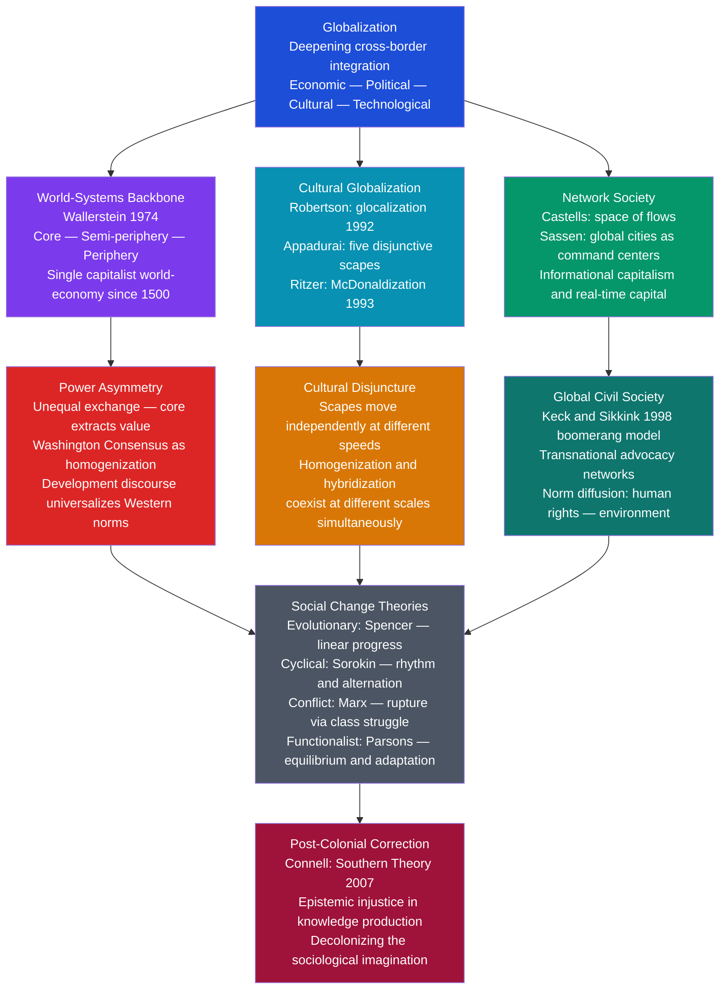

# Globalization and Social Change

> [!abstract] TL;DR
> Globalization is not a single force but a collision of economic flows, cultural diffusion, and power asymmetries that simultaneously homogenizes and hybridizes societies — sociologists map it through Wallerstein's structural world-system, Robertson's glocalization, Appadurai's disjunctive scapes, Castells' network society, and Ritzer's McDonaldization, while the post-colonial critique (Connell's Southern Theory) insists that the very concepts used to understand globalization reproduce the epistemic hierarchy they claim to describe.

---

## Intuition

**Analogy:** Imagine dropping a large rock into a pond that already has dozens of smaller stones resting on the bottom.

The splash sends powerful ripples outward in all directions — that is the economic force of globalization. But the pond is not empty. The existing stones on the bottom redirect the waves. Some areas of the pond are shallow; others are deep. The plants at the edges absorb energy differently than the bare mud. Where ripples hit rocks, they bounce back and cross incoming waves, producing interference patterns no one planned.

The deepest part of the pond still barely moves. The shore is transformed. A few isolated islands in the centre remain calm. And most surprisingly, where the ripples interact with the existing bottom, they produce entirely new formations — tiny whirlpools, standing waves, patterns that did not exist before the stone landed and would not exist if the pond had been empty.

That is globalization meeting local societies. The **homogenization thesis** (McDonaldization, Washington Consensus universalism) sees only the outward ripple: Western economic and cultural forms swamping everything in their path. The **hybridization thesis** (glocalization, Appadurai's scapes) sees the interference patterns: genuinely novel cultural forms emerging from the collision of global forces with specific local histories, languages, and institutions. The **world-systems perspective** reminds us that the rock was not dropped into a neutral pond — the pond was already structured by 500 years of colonial history, and the rock is heavier on some shores than others.

---

## How It Works



---

## Key Concepts / Details

### Secondary Level

**What Is Globalization? Four Dimensions**

Globalization is not one process but four interacting ones:

| Dimension | Core Mechanism | Sociological Effect |
|-----------|---------------|---------------------|
| **Economic** | Trade, FDI, supply chains, finance | Restructures labour markets, creates winners and losers |
| **Political** | Pooled sovereignty, international institutions | Erodes the nation-state's autonomous policy capacity |
| **Cultural** | Media flows, migration, tourism, diaspora | Produces both cultural standardization and new hybrid forms |
| **Technological** | Internet, containerization, logistics | Compresses space and time; distributes unevenly across the globe |

These dimensions do not move in lockstep. A poor country can be technologically integrated (mobile phones, WhatsApp) while remaining economically peripheral and politically excluded from global decision-making. That gap between dimensions is what Arjun Appadurai calls *disjuncture* — and it is the source of much contemporary cultural and political turbulence.

---

**Social Change: The Four Classical Theories**

Social change — the transformation of culture, behaviour, social institutions, and social structure over time — has four classical theoretical frameworks. Every contemporary theory of globalization implicitly draws on one or more of them.

| Theory | Core Claim | Key Thinker | Limitation |
|--------|-----------|-------------|------------|
| **Evolutionary** | Societies progress through stages from simple to complex | Herbert Spencer (1876) — "survival of the fittest" applied to society | Ethnocentric; Western modernity treated as the universal destination |
| **Cyclical** | History moves in grand cycles, not linear progress | Pitirim Sorokin (*Social and Cultural Dynamics*, 1937): ideational, idealistic, and sensate cultures alternate; Arnold Toynbee: rise-challenge-response cycles | Macro-patterns are real but hard to operationalize; prediction weak |
| **Conflict** | Change is driven by structural contradictions and class struggle | Karl Marx: capitalism generates its own contradictions — eventual rupture | Underestimates non-economic sources of change (gender, ethnicity, ecology) |
| **Functionalist** | Social systems adapt incrementally to restore equilibrium | Talcott Parsons: change as differentiation, generalized adaptive capacity; societies incorporate innovations without system collapse | Conservative bias; overestimates equilibrium; marginalizes radical discontinuity |

Globalization is simultaneously an evolutionary story (if you follow modernization theory's linear stages), a cyclical story (if the Bretton Woods era and the hyper-globalization era are counted as distinct waves), a conflict story (if you follow world-systems theory's core-periphery extraction logic), and a functionalist story (if you see the WTO, IMF, and UN as adaptive mechanisms that allow the global capitalist system to manage its own tensions).

---

**Ritzer's McDonaldization: Rationalization Goes Global**

George Ritzer's *The McDonaldization of Society* (1993) argued that Max Weber's "iron cage" of formal rationality — applied originally to modern bureaucracy — had found its purest expression in the fast-food industry and was now colonizing all other institutions: hospitals, universities, retail, dating apps, childcare. McDonaldization has four interlocking dimensions:

| Dimension | What It Means | Institutional Example |
|-----------|--------------|----------------------|
| **Efficiency** | Optimal method to move from input to output | Self-checkout kiosks; standardized hospital discharge checklists |
| **Calculability** | Quantity over quality — emphasis on measurable outcomes | University league tables; calorie counts replacing food culture |
| **Predictability** | Standardized, familiar, no surprises | Identical hotel rooms across 100 countries; standardized airline safety announcements |
| **Control** | Replace human unpredictability with technology | ATMs replacing bank tellers; automated customer service |

The crucial Weberian irony Ritzer identifies: **the irrationality of rationality**. Each dimension maximizes a local efficiency measure, but the aggregate effect is collectively irrational — nutritionally impoverished food served at scale, dehumanized healthcare encounters, graduates who can pass standardized tests but cannot think originally, workers whose knowledge has been absorbed into systems that no longer need their judgment.

McDonaldization's global reach makes it a theory of cultural change through economic form. The Big Mac is not exported as a cultural symbol; it arrives embedded in a whole system of labour organization, supply-chain management, real-estate strategy, and quality control that restructures local food economies and cultural practices around the logic of formal rationality.

---

### Undergraduate Level

**Robertson's Glocalization: Global Forces, Local Expressions**

Roland Robertson (*Globalization: Social Theory and Global Culture*, 1992) coined **glocalization** to challenge both the homogenization thesis and simplistic resistance narratives. His argument: globalization does not steamroll local cultures — it produces a new global condition in which the local and the global are simultaneously constructed and mutually constitutive.

The term originated in Japanese business practice (*dochakuka*: "deriving from the land"), where global marketing strategies were systematically adapted for local conditions. Toyota does not sell identical cars worldwide; it sells cars that have been globally engineered but locally calibrated — right-hand drive for Japan and the UK, different safety ratings for US markets, different engine specifications for emission regimes.

Robertson's sociological extension: the global does not exist apart from the local. Global processes are always actualized in specific local contexts. And local particularity is itself increasingly produced in relation to global frameworks — indigenous rights movements define themselves against global cosmopolitanism; nationalist populism is a reaction to, and constituted by, global integration.

**Three types of glocal outcomes:**
1. **Strategic localization** — global brands adapting products (McDonald's India menu with no beef; K-pop fans adapting US hip-hop aesthetics through Korean language and aesthetics)
2. **Hybrid institutional forms** — microfinance merging global banking concepts with local trust networks (Grameen Bank in Bangladesh)
3. **Reactive localization** — local communities explicitly constructing difference *against* global standardization (Slow Food movement, artisan craft revival, language preservation movements)

---

**Appadurai's Five Scapes: Disjuncture and Difference**

Arjun Appadurai (*Modernity at Large*, 1996) developed the most influential framework for understanding cultural globalization. His central claim: global cultural flows are not a unified force moving in one direction but five disjunctive streams operating at different speeds, in different directions, with different actors.

| Scape | What Flows | Key Dynamic |
|-------|-----------|-------------|
| **Ethnoscapes** | People: migrants, tourists, refugees, guest workers, exiles | Deterritorialized identities; transnational communities maintain homeland connections through digital media |
| **Mediascapes** | Images, narratives, information: film, television, internet, news | Imagination as social practice; people use media images to construct aspirational life-worlds across borders |
| **Technoscapes** | Technology: machinery, software, infrastructure | Moves according to profit logic and political negotiations, not cultural affinity |
| **Financescapes** | Capital: currency flows, stock markets, commodity speculation | Fastest-moving scape; destabilizes national economies at millisecond speed |
| **Ideoscapes** | Ideas and ideologies: democracy, freedom, sovereignty, human rights, welfare | Travels in fragments; the same word (e.g. "democracy") carries entirely different semantic content in Washington, Beijing, and Nairobi |

**Why "disjuncture" is the key term.** The scapes move at different speeds and in different directions. Technoscapes bring smartphones to rural India, enabling connection to global mediascapes, without producing equivalent economic integration (financescape flows bypass rural India entirely) or political integration (ideoscape — democratic governance — remains contested). This uncoupling of dimensions explains why globalization produces not convergence but *multiple modernities*: different configurations of the same global elements, inflected by distinct histories and power positions.

Appadurai's framework challenges both the McDonaldization thesis (which sees a single rationalization logic colonizing all dimensions) and the world-systems thesis (which sees a single structural logic of capital extraction). Globalization is not one thing; it is five things moving at different speeds and producing their combinations locally.

---

**Sassen's Global Cities: The Command Centers**

Saskia Sassen (*The Global City*, 1991) identified an apparent paradox in the age of globalization: as economic activity dispersed globally across supply chains and emerging markets, the coordination, management, and financial control of that dispersal became *more* concentrated, not less.

Global cities — New York, London, Tokyo (Sassen's original triad), later extended to Paris, Frankfurt, Singapore, Shanghai, Dubai — function as **command-and-control centers** for the global economy. Their specific functions:

- **Advanced producer services**: law firms, accounting, management consulting, advertising — the expertise-intensive services that global corporations require to operate across jurisdictions
- **Financial centers**: global capital markets require physical concentration of traders, analysts, and regulators despite digital trading
- **Innovation hubs**: the tacit knowledge exchanges that produce new financial instruments, legal strategies, and management innovations require face-to-face proximity
- **Migrant labour bifurcation**: global cities simultaneously attract the world's most highly skilled (financial analysts, tech workers, lawyers) and depend on poorly-paid migrant service labour (cleaning, construction, food delivery) — producing extreme within-city inequality

Sassen's sociological contribution: globalization did not produce flat, borderless space. It produced a specific urban hierarchy — a network of global cities that are more deeply integrated with each other than with their own hinterlands. A financial worker in London is economically and socially closer to a counterpart in Singapore than to a manufacturing worker 100 miles away in the English Midlands.

---

**Castells' Network Society: The Space of Flows**

Manuel Castells (*The Rise of the Network Society*, 1996) argued that the fundamental organizing logic of the global economy had shifted from industrial space (defined by geographic proximity and national borders) to **informational space** (defined by connectivity in real-time data and communication networks).

Two spatial logics now operate simultaneously:
- **Space of flows**: the logic of networks — capital, information, technology, organizational interaction operate in real time across space, organized through nodes (global cities, telecom hubs, financial centers) and corridors
- **Space of places**: the logic of physical locality — where people actually live, work, sleep, raise families, and build community

The tension between these two spatial logics is the organizing contradiction of contemporary globalization. Power lies in the space of flows; lives are lived in the space of places. When the space of flows reorganizes (a factory closes, a financial crisis hits), the space of places (the specific town, the specific community) bears the adjustment costs, while the networks that caused the disruption simply relocate to new nodes.

Castells extends this to the **network state**: national governments increasingly govern through networked partnerships with international institutions, regional bodies, and non-state actors rather than through unilateral sovereign command. The EU is the paradigm case — member states remain sovereign in formal-legal terms, but economic policy, monetary policy, and regulatory standards are produced at the network level.

---

**Transnational Advocacy Networks: The Boomerang Model**

Margaret Keck and Kathryn Sikkink (*Activists Beyond Borders*, 1998) identified a distinctive political mechanism through which global civil society produces change in countries resistant to domestic pressure.

The **boomerang pattern**: when a domestic civil society group (e.g., human rights activists in an authoritarian state) is blocked by their own government, they establish alliances with international NGOs and foreign governments. These external actors then apply pressure on the blocking government from the outside — the domestic grievance, thrown at the wall, comes back from a completely different direction as international pressure.

Classical case: **Argentina's dirty war (1976-1983)**. When the military junta disappeared thousands of political opponents, relatives of the disappeared formed the Madres de Plaza de Mayo. Unable to pressure the junta directly, they allied with Amnesty International, human rights organizations in Europe, and eventually the US State Department (under Carter's human rights foreign policy). External pressure contributed to the erosion of the junta's international legitimacy. The boomerang returned.

Keck and Sikkink identify four conditions that favor effective transnational advocacy:
1. **Principled framing**: the issue must be frameable in terms of universal norms (human rights, environmental harm to children) rather than purely political or economic interests
2. **Vulnerability**: the target government must care about its international reputation or be materially dependent on foreign assistance
3. **Network density**: a well-connected network of NGOs, sympathetic states, and intergovernmental bodies must exist
4. **Information politics**: the network must be able to generate and credibly communicate accurate information about violations

Global civil society is not a unified actor. It is a contested space of NGOs, social movements, religious organizations, and professional associations with competing agendas. But the boomerang model remains the most influential explanation of how normative change (human rights, environmental standards, anti-corruption norms) propagates transnationally without a world government to enforce it.

---

### Graduate Level

**Wallerstein as the Structural Backbone of Globalization Sociology**

Immanuel Wallerstein's world-systems theory provides the deepest structural account of why globalization takes the asymmetric form it does rather than producing the universal convergence modernization theory predicted. The full architecture:

- **The longue durée**: the modern world-system is not a 20th-century phenomenon; it began with the "long 16th century" (1450-1640) as European capitalism incorporated the Americas, Africa, and Asia into a single division of labour through colonial extraction
- **The zone logic**: core (high-wage, capital-intensive, technologically advanced), semi-periphery (intermediate, politically ambiguous buffer zone), periphery (low-wage, labour-intensive, raw-material exporting) are not stages on a developmental ladder but **simultaneous structural positions** within a single system that requires all three zones to function
- **The hegemonic cycle**: no state maintains permanent dominance; US hegemony since 1945 is already in relative decline, producing a prolonged transition period of "systemic chaos" before a new hegemonic order stabilizes

At the graduate level, the key debates with world-systems theory are:
1. **Against the cyclical hegemony thesis**: Charles Kindleberger and Robert Gilpin's hegemonic stability theory reaches similar empirical conclusions through a realist lens rather than a Marxist one — does the causal mechanism matter?
2. **The semi-periphery problem**: South Korea, Taiwan, and China "escaped" peripheral status without dismantling the world-system structure. World-systems theorists argue this is merely positional mobility within an unchanged structure. Critics argue it falsifies the strong form of dependency logic
3. **Agency and contingency**: Wallerstein's macro-structuralism leaves limited room for political agency, institutional variation, or contingent outcomes. The "antisystemic movements" (socialist states, national liberation movements) that Wallerstein identified as potential system-transformers mostly either failed or were incorporated

---

**The Cultural Homogenization vs. Hybridization Debate**

The deepest theoretical fault line in the sociology of globalization runs between two empirically supported but theoretically incompatible readings of what global cultural exchange produces.

**The homogenization argument** has two versions:
- *McWorld* (Benjamin Barber, 1995): the globalization of consumer culture (American fast food, Hollywood, pop music, brand culture) produces a shallow, commodified global monoculture that dissolves local particularities into consumer identities. Democracy and cultural depth are casualties of market integration
- *Cultural imperialism* (Herbert Schiller, 1969; updated as media imperialism): American and Western media institutions systematically export ideological products that serve the interests of global capital and erode alternative cultural forms; not just cultural diffusion but structured domination of the means of cultural production

**The hybridization argument** has three versions:
- *Glocalization* (Robertson): global forms are always locally inflected; the result is not American culture but creolized, hybrid forms that are neither purely global nor purely local
- *Disjuncture* (Appadurai): the five scapes operate independently; no single cultural logic colonizes all five simultaneously; unexpected cultural formations emerge from their intersections
- *Third culture* formation (Mike Featherstone, Ulf Hannerz): internationally mobile professionals, migrants, and diasporic communities create new cultural spaces that belong fully to neither their origin nor destination cultures

**The synthesis position** (Jan Nederveen Pieterse, *Globalization and Culture*, 2003): homogenization and hybridization are not alternatives; they operate simultaneously at different levels of analysis. Global consumer brands homogenize certain consumption practices. But the meanings attached to those practices, the social contexts of their use, and the cultural identities constructed around them are hybridized. A Japanese teenager wearing Nike shoes and listening to hip-hop is neither an American cultural clone nor someone untouched by globalization — they are something genuinely new.

---

**Connell's Southern Theory and Epistemic Injustice**

Raewyn Connell's *Southern Theory* (2007) delivers the most sustained sociological critique of how globalization reproduces inequality in the domain of knowledge itself — a problem she calls the **Northern monopoly on theory**.

The argument: virtually all foundational sociological theory — from Durkheim, Weber, and Marx through Parsons, Giddens, Bourdieu, and Habermas — was produced in the Global North (primarily Western Europe and North America), using data primarily from those societies, addressing problems defined by those societies' self-understanding. This theory is then applied globally as if it were universal.

The mechanics of epistemic injustice in global sociology:
1. **Citation patterns**: global journal rankings are dominated by Northern institutions; Southern scholars cite Northern theory; Northern scholars rarely cite Southern scholars even on topics where Southern data is directly relevant
2. **Theory-data asymmetry**: the Global South is treated as a *data source* (a place where general theories are "tested") rather than as a *theoretical source* (a place where the experience of colonialism, underdevelopment, and plural modernity generates distinctive theoretical insights)
3. **Concept misfit**: core sociological concepts were developed for specific historical conditions (industrial capitalism, nation-state governance, Protestant secularization) and require substantial modification to analyze Southern realities — informal economies, postcolonial state forms, indigenous social structures, religious social movements

**Connell's alternatives from the Global South:**
- Frantz Fanon (*The Wretched of the Earth*, 1961): colonial psychology and the violence of decolonization as a sociological problem, not merely a political one
- Orlando Fals Borda (Colombia): participatory action research — knowledge produced *with* communities rather than *about* them
- Paulin Hountondji (Benin): African philosophy as systematic theoretical tradition, not merely "local knowledge" for anthropologists to collect
- The CPES (Connell, Pearse, Evans-Pritchard): endogenous development of Southern theoretical frameworks rather than adoption of Northern templates

The political implication for globalization studies: if sociological theory itself is a product of the Northern position in the global system, then the concepts used to analyze globalization — development, modernity, civil society, rationalization — carry embedded assumptions that systematically reproduce the perspective of the core. Decolonizing sociology is not a political gesture; it is an epistemological necessity for the discipline to accurately describe the world it claims to explain.

---

## Python Demo

```python
import numpy as np
import matplotlib.pyplot as plt

# ─────────────────────────────────────────────────────────────────────────────
# Cultural Diffusion vs Hybridization Under Globalization
#
# Model: two cultures A (dominant) and B (local) are represented
# as vectors of N cultural trait adoption probabilities (0.0 = absent, 1.0 = present).
#
# At each time step:
#   - B is "pulled" toward A by a power-weighted diffusion term
#     (dominant culture transmits traits to local culture)
#   - When bidirectional=True, A is also weakly pulled toward B
#     (local culture influences dominant — hybridization mechanism)
#
# Three scenarios test Robertson's glocalization argument:
#   1. Homogenization  — high power asymmetry (7:1), unidirectional
#      -> Local culture B converges to dominant culture A
#   2. Hybridization   — moderate asymmetry (2.5:1), bidirectional
#      -> A stable non-zero cultural distance persists; hybrid forms emerge
#   3. Symmetric exchange — equal power (1:1), bidirectional
#      -> Both cultures transform; final state differs from both originals
# ─────────────────────────────────────────────────────────────────────────────

N = 60        # number of distinct cultural traits (practices, values, norms)
T = 300       # time steps (can be read as generations or decades)


def run_scenario(power_ratio, bidirectional, noise_level=0.006, seed=42):
    rng_local = np.random.default_rng(seed)

    # Initialize: A and B start with complementary trait distributions
    A = rng_local.uniform(0.15, 0.85, N)
    B = np.clip(1.0 - A + rng_local.normal(0, 0.08, N), 0.05, 0.95)

    # Transmission rates sum to 0.20 per step
    # A-to-B rate scales with power ratio; B-to-A rate is the complement
    rate_AtoB = 0.20 * power_ratio / (1.0 + power_ratio)
    rate_BtoA = 0.20 / (1.0 + power_ratio) if bidirectional else 0.0

    A_hist = np.zeros((T + 1, N))
    B_hist = np.zeros((T + 1, N))
    A_hist[0], B_hist[0] = A.copy(), B.copy()

    for t in range(T):
        # B moves toward A (pressure from dominant global culture)
        B = B + rate_AtoB * (A - B) + rng_local.normal(0, noise_level, N)
        B = np.clip(B, 0.0, 1.0)

        # A moves toward B (only in bidirectional / glocalization scenarios)
        if bidirectional:
            A = A + rate_BtoA * (B - A) + rng_local.normal(0, noise_level * 0.5, N)
            A = np.clip(A, 0.0, 1.0)

        A_hist[t + 1], B_hist[t + 1] = A.copy(), B.copy()

    return A_hist, B_hist


# Run the three scenarios with identical initial conditions (same seed)
A1, B1 = run_scenario(power_ratio=7.0, bidirectional=False, seed=42)
A2, B2 = run_scenario(power_ratio=2.5, bidirectional=True,  seed=42)
A3, B3 = run_scenario(power_ratio=1.0, bidirectional=True,  seed=42)

steps = np.arange(T + 1)

# Mean absolute distance between cultures: proxy for cultural distinctiveness
def mean_distance(A_h, B_h):
    return np.mean(np.abs(A_h - B_h), axis=1)

# Trait-level std across both cultures: proxy for overall cultural diversity
def diversity_index(A_h, B_h):
    return np.mean(np.std(np.stack([A_h, B_h], axis=2), axis=2), axis=1)

d1, d2, d3 = mean_distance(A1, B1), mean_distance(A2, B2), mean_distance(A3, B3)
v1, v2, v3 = diversity_index(A1, B1), diversity_index(A2, B2), diversity_index(A3, B3)

# ─── Plot ─────────────────────────────────────────────────────────────────────
fig, axes = plt.subplots(2, 3, figsize=(16, 9))
fig.suptitle(
    "Cultural Diffusion and Hybridization Under Globalization\n"
    "Simulation of power-asymmetric trait exchange: dominant culture A vs local culture B",
    fontsize=12, fontweight="bold"
)

scenarios = [
    ("Homogenization\nPower 7:1 — unidirectional\n(McDonaldization logic)", A1, B1, "#dc2626"),
    ("Hybridization\nPower 2.5:1 — bidirectional\n(Robertson's glocalization)", A2, B2, "#059669"),
    ("Symmetric Exchange\nPower 1:1 — bidirectional\n(Utopian equal contact)", A3, B3, "#2563eb"),
]
dists = [d1, d2, d3]
divs  = [v1, v2, v3]

trait_sample = [4, 13, 23, 38, 51]   # 5 representative traits to plot

for col, (title, A_h, B_h, color) in enumerate(scenarios):
    ax_top = axes[0][col]
    ax_bot = axes[1][col]

    # Top row: trait trajectories (illustrates convergence vs stable difference)
    for t in trait_sample:
        ax_top.plot(steps, A_h[:, t], "--", color="steelblue", alpha=0.55, linewidth=1.3)
        ax_top.plot(steps, B_h[:, t], "-",  color="tomato",    alpha=0.65, linewidth=1.3)
    ax_top.plot([], [], "--", color="steelblue", label="Dominant culture A")
    ax_top.plot([], [], "-",  color="tomato",    label="Local culture B")
    ax_top.set_title(title, fontsize=9.5, fontweight="bold")
    ax_top.set_ylabel("Trait adoption probability")
    ax_top.set_ylim(-0.02, 1.02)
    ax_top.legend(fontsize=8)
    if col == 1:
        ax_top.set_xlabel("Time steps")

    # Bottom row: cultural distance and diversity over time
    ax_bot.plot(steps, dists[col], color=color,    linewidth=2.2, label="Cultural distance |A - B|")
    ax_bot.fill_between(steps, dists[col], alpha=0.15, color=color)
    ax_bot.plot(steps, divs[col],  color="#6b7280", linewidth=1.5, linestyle="--",
                label="Cultural diversity index")
    ax_bot.axhline(dists[col][-1], color="black", linewidth=0.7, linestyle=":",
                   label=f"Final distance: {dists[col][-1]:.3f}")
    ax_bot.set_xlabel("Time steps")
    ax_bot.set_ylabel("Index value")
    ax_bot.set_ylim(0, 0.65)
    ax_bot.legend(fontsize=7.5)

plt.tight_layout()
plt.savefig("cultural_diffusion_hybridization.png", dpi=150)
plt.show()

# ─── Summary ──────────────────────────────────────────────────────────────────
print("=== Final cultural distance (lower = more homogenized) ===")
rows = [
    ("Homogenization  (power 7:1, unidirectional)", d1[-1], v1[-1]),
    ("Hybridization   (power 2.5:1, bidirectional)", d2[-1], v2[-1]),
    ("Symmetric       (power 1:1, bidirectional)",   d3[-1], v3[-1]),
]
print(f"  {'Scenario':<45}  {'Distance':>10}  {'Diversity':>10}")
print("  " + "-" * 70)
for name, d, v in rows:
    print(f"  {name:<45}  {d:>10.4f}  {v:>10.4f}")

print()
print("Interpretation:")
print("  Homogenization: B's distance from A collapses to near zero —")
print("    the local culture loses its distinctiveness (McDonaldization predicted).")
print("  Hybridization:  a stable non-zero distance persists — the hybrid is a")
print("    genuinely new cultural form, not merely diluted B culture (Robertson).")
print("  Symmetric:      both cultures transform; the final state differs from both")
print("    originals — mutual third-culture formation (Hannerz, Pieterse).")
```

**What the simulation reveals and where its limits lie:**

The homogenization scenario (top-left and bottom-left panels) shows both cultures' traits converging rapidly on the dominant culture's values — local distinctiveness collapses within roughly 50 steps. This captures the McDonaldization logic: when power asymmetry is high and exchange is one-directional, the weaker culture's traits are replaced.

The hybridization scenario (centre panels) stabilizes at a persistent cultural distance — local culture is pulled toward the dominant culture but never fully absorbed, and the dominant culture is itself modified. The stable equilibrium is not a midpoint average of the two originals; it is a genuinely new configuration (the trait values at equilibrium differ from both initial states). This operationalizes Robertson's glocalization: global forces reshape local culture, but the local reshapes the global form in turn, producing a third thing.

The simulation's limits are important. It treats all cultural traits as equally exchangeable and quantifiable — which Appadurai's scapes framework explicitly rejects. The model also assumes static power ratios; in reality, power asymmetries themselves change over the period being modeled (as China's growth has shifted cultural power relationships in East Asia). The model cannot capture *meaning* — the difference between adopting a McDonald's menu item and adopting a cosmology.

---

## Real-World Applications

> **K-pop as Glocalization (South Korea, 1990s–present)**
> South Korean pop music is the paradigm case of Robertson's glocalization producing genuinely new global cultural forms. K-pop emerged in the 1990s when South Korean entertainment companies synthesized American hip-hop, R&B, and electronic dance music production techniques with Korean linguistic and aesthetic sensibilities, rigorous Confucian-influenced training regimes, and East Asian visual aesthetics. The result was not Korean imitation of American music nor American music adapted for Korean audiences — it was a genuinely new global genre that now exports from South Korea to 170 countries. Appadurai's technoscapes (digital production and distribution), mediascapes (YouTube, V Live, social media), and ethnoscapes (Korean diaspora as early adopters) intersected to produce a cultural flow that moves against the expected West-to-Rest direction. The global success of BTS and BLACKPINK is simultaneously a business story (HYBE's valuation surpassed $10 billion), a cultural story (Korean language courses saw 38% enrollment increase globally 2018-2022), and a sociological story about the directionality of cultural flows under conditions of technological democratization.

> **The Mothers of the Plaza de Mayo and the Boomerang Effect (Argentina, 1977-1984)**
> When Argentina's military junta began disappearing political opponents after the 1976 coup, the Madres de Plaza de Mayo — mothers of the disappeared — faced a state that controlled all domestic media, courts, and security apparatus. Their weekly silent protests in front of the Casa Rosada were dangerous and largely invisible domestically. The boomerang pattern: they made contact with Amnesty International (which published a report in 1977 documenting systematic torture), aligned with European socialist governments who pressured the junta diplomatically, and connected with the US State Department under Carter's human rights foreign policy. The external pressure contributed to fracturing the junta's international legitimacy and created space for internal military divisions to surface. After the Falklands defeat (1982), civilian government was restored in 1983, and the subsequent Nunca Mas commission identified 8,960 documented disappearances. The case established the boomerang model as a general pattern in human rights advocacy and influenced the design of the Inter-American Commission on Human Rights' complaint procedures.

> **Uber, Airbnb, and McDonaldization of the Informal Economy (global, 2010s–present)**
> Ritzer's McDonaldization reached its logical extension in the gig economy: the efficiency, calculability, predictability, and control principles are now applied not to a conventional employment relationship but to formerly informal service markets. Uber does not employ drivers; it creates a technological system (app, GPS tracking, rating algorithm, surge pricing) that imposes efficiency (optimal route matching), calculability (star ratings reducing trust to a number), predictability (standardized car interior, payment method, insurance coverage globally), and control (algorithmic dispatch replacing driver judgment) onto what was previously an unrationalized local service. The global deployment of the same algorithmic system constitutes a form of McDonaldization that is simultaneously genuinely global (same app in Jakarta and London) and locally inflected (regulatory battles in each jurisdiction; cultural norms around tipping and interaction differ; local legal challenges to employment status). The "gig economy" is also the world's largest experiment in the McDonaldization of self-employment — imposing formal rationality on the residual informal sphere that traditional McDonaldization had not yet reached.

> **Zapatistas and the Global in the Local (Chiapas, Mexico, 1994–present)**
> The Ejército Zapatista de Liberación Nacional (EZLN) staged its uprising on January 1, 1994 — the day NAFTA came into force — explicitly framing it as a response to economic globalization's impact on indigenous Mayan communities in Chiapas. The EZLN's innovation was strategic use of Appadurai's mediascapes and ideoscapes: Subcomandante Marcos issued communiqués through the early internet, generating global solidarity networks (anti-globalization activists in Europe and the US, intellectual circles around Le Monde Diplomatique), which provided protective international attention that made violent suppression politically costly for the Mexican state. The Zapatistas simultaneously embodied the resistance to globalization (protecting local indigenous autonomy, land rights, and governance forms) and used global tools (internet, transnational advocacy networks, global media attention) to survive it. The result was not a victory for indigenous sovereignty in any conventional sense — Chiapas remains poor, the indigenous communities remain politically marginalized — but a thirty-year experiment in using transnational civil society to constrain state violence, which became a template for subsequent global justice movements (World Social Forum, first convened in Porto Alegre in 2001).

---

## Common Pitfalls

- **Treating homogenization and hybridization as mutually exclusive** — The deepest error in undergraduate essays. Both processes operate simultaneously at different levels and in different scapes. Consumer product standardization (homogenization of material culture) coexists with linguistic diversification (hybridization of cultural expression). K-pop is both a product of American music industry homogenization and a genuine hybridization that created a new cultural form. Saying that globalization "either homogenizes or hybridizes" culture misses the point that it does both at different scales simultaneously.

- **Conflating Robertson's glocalization with simple "local adaptation of global brands"** — Glocalization is not merely McDonald's India offering a McAloo Tikki burger. Robertson's concept is about the *mutual constitution* of global and local — the local is itself partly constructed through its articulation with global frameworks, and the global is always actualized in specific local contexts. The McDonald's India menu adaptation is a trivial example; the more sociologically interesting cases are hybrid institutional forms (microfinance, community health workers, indigenous rights law) that create genuinely new practices by combining elements from both global and local repertoires.

- **Treating Wallerstein's world-systems theory as economic determinism that forecloses agency** — World-systems theory identifies structural tendencies and long-run dynamics, not iron laws that prevent all variation. The semi-periphery concept specifically explains how some countries (South Korea, Taiwan) navigate structural constraints through state-directed industrial policy. The lesson from Wallerstein is that structural position shapes the costs and options available to actors, not that structure eliminates choice. The analytical error is treating structural tendency as inevitability.

- **Applying Appadurai's scapes as a descriptive checklist rather than an analytical framework** — Students sometimes list the five scapes and describe what flows through each one without addressing Appadurai's central claim: that the scapes are *disjunctive*, moving at different speeds in different directions, producing unexpected cultural formations at their intersections. The interesting analysis is always in the gaps and mismatches between scapes — why does technological connectivity (technoscape) reach a community before financial integration (financescape) does, and what social formations result?

- **Ignoring the political economy of global civil society** — Keck and Sikkink's boomerang model describes how civil society advocacy can produce normative change, but it does not account for which issues get taken up by transnational networks and which do not. Issues that threaten core economic interests (labour rights, tax justice, intellectual property reform) are systematically less successful in transnational advocacy than issues that can be framed purely in humanitarian terms without challenging capital flows. The boomerang works more reliably against authoritarian torture than against multinational tax avoidance.

- **Treating McDonaldization as a completed state** — Ritzer describes McDonaldization as a contemporary tendency, not a final condition. Counter-tendencies exist and are genuine: craft food movements, progressive educational pedagogy, narrative medicine and patient-centred healthcare, artisan manufacturing. The sociological question is whether these counter-tendencies represent significant resistance or are themselves being McDonaldized (certification of "authentic" craft practice; standardized slow-food criteria; evidence-based narrative medicine protocols). Ritzer's Weberian iron cage has gates — the question is whether they open from the inside.

- **Reading Connell's Southern Theory as anti-Western intellectual nationalism** — Connell is not arguing that Western sociological theory is worthless or that it should be replaced by Southern alternatives. She is arguing that the *monopoly position* of Northern theory — its claim to universality when it was produced under specific historical conditions — must be dismantled. The goal is genuinely universal sociology, which requires incorporating theoretical insights developed from Southern experiences of colonialism, informality, plural modernity, and non-Western social structures. The pitfall is either dismissing Southern Theory as politics or embracing it as a simple inversion that celebrates non-Western knowledge uncritically.

---

## Related Concepts

- [[Classical_Sociological_Theory]] — Spencer's evolutionary theory of social change (unilinear progress from simple to complex) provides the direct baseline against which Wallerstein's cyclical world-system and Marx's conflict-driven rupture both define themselves

- [[Contemporary_Sociological_Theory]] — Giddens' reflexive modernity extends structuration theory to the global level: globalization intensifies reflexivity by exposing individuals to global risk structures (climate, pandemic, financial crisis); Bauman's liquid modernity names the condition where global flows dissolve the solid institutional structures that previously provided identity and security

- [[Conflict_Theory_and_Critical_Theory]] — Wallerstein's world-systems theory is the global extension of conflict sociology; Gramsci's hegemony concept explains why Washington Consensus ideology was accepted as common sense in structural adjustment negotiations, not merely imposed by force

- [[Functionalism_and_Systems_Theory]] — Parsons' AGIL schema and differentiation theory provide the functionalist reading of globalization as adaptive system evolution; Luhmann's world society theory (a single global social system differentiated by functional subsystems) is the most sophisticated sociological globalization theory from within the systems-theory tradition

- [[Culture_Norms_Values_and_Ideology]] — McDonaldization, Appadurai's scapes, and the homogenization-hybridization debate are introduced there; this note provides the full theoretical frameworks underlying those concepts

- [[Global_Inequality_and_Development]] — Wallerstein's core-periphery structure, the elephant curve, and the Washington Consensus critique are the economic face of the same processes analyzed here in cultural and sociological terms; the two notes are complementary halves of a complete picture of global social change

- [[Media_Culture_and_Cultural_Industries]] — Appadurai's mediascapes and the homogenization-hybridization debate in global media are the specific cultural dimension of globalization; this note provides the broader sociological frameworks; Nollywood and K-pop are discussed there as empirical cases

- [[Race_Ethnicity_and_Racism]] — Appadurai's ethnoscapes — the flow of migrants, diasporas, refugees — directly shapes racial and ethnic identities; Paul Gilroy's Black Atlantic is the paradigm case of a transnational cultural formation produced by globalized movement

- [[Work_Organizations_and_Bureaucracy]] — Weber's rationalization thesis is the direct theoretical ancestor of Ritzer's McDonaldization; global supply chains are McDonaldized production systems applied at the planetary scale; the bureaucratic organization of MNCs enacts the space-of-flows logic in organizational form

- [[Social_Class_and_Stratification]] — Sassen's global city analysis maps a distinctive class structure: super-rich global professionals and impoverished migrant service workers sharing the same urban space but connected to entirely different social systems; Castells' space of flows produces new forms of class polarization

- [[Globalization_and_Its_Discontents]] — the political economy companion to this note: Rodrik's trilemma, Stolper-Samuelson distributional effects, the China shock, Brexit, and slowbalization are the political and economic dimensions; this note provides the sociological and cultural dimensions

- [[Global_Order_and_Hegemony]] — US hegemony in the post-1945 order is the political-structural context within which Washington Consensus universalism operated; Gramsci's hegemony concept, via Robert Cox's international relations adaptation, links directly to the cultural homogenization debate

- [[The_Future_of_Global_Order]] — multipolarity, technological fragmentation, and climate governance crises are the emerging structural conditions that will shape the next wave of globalization and social change

- [[International_Institutions_and_Multilateralism]] — the WTO, IMF, UN, and regional bodies are the institutional expression of global civil society's formal layer; their relationship to the transnational advocacy networks (Keck/Sikkink) is the intersection of formal and informal global governance

- [[Human_Rights_and_International_Law]] — global human rights law is the institutional product of transnational advocacy network success: the boomerang model's accumulated victories over decades produced the ICC, the CAT, CEDAW, and the SDGs as formal normative frameworks

- [[Development_Economics]] — development economics and the sociological theory of globalization converge on the same empirical puzzles (why do some countries develop? what does development mean?) but from different methodological starting points; Sen's capability approach is the bridge

- [[Balance_of_Payments]] — Sassen's financescape flows register in current account imbalances and capital account dynamics; the real-time financial integration that drives the "space of flows" logic is visible in balance of payments data

---

## Review Questions

### Secondary

1. Ritzer argues that the principles of the fast-food industry — efficiency, calculability, predictability, and control — are colonizing all areas of social life. Name two institutions outside the food industry where you can see this happening, and explain which of the four dimensions is most visible in each case.

2. Spencer argued that societies evolve progressively from simple to complex, with Western industrial society as the pinnacle. What is the main sociological objection to this view, and which of the other three social change theories (cyclical, conflict, or functionalist) do you find most persuasive as an alternative? Explain your reasoning.

3. Robertson coined "glocalization" to describe what happens when global forces meet local societies. Using a real example from music, food, or technology, explain why the result is neither pure global homogenization nor unchanged local tradition, but something new.

### Undergraduate

1. Appadurai's five scapes — ethnoscapes, mediascapes, technoscapes, financescapes, ideoscapes — are described as "disjunctive": they move at different speeds and in different directions. Select a specific country or region and analyze how the disjuncture between two of the scapes has produced a distinctive social or cultural outcome that neither scape would have produced alone.

2. Keck and Sikkink's boomerang model describes how domestic activists blocked by their own government can use transnational networks to generate external pressure. Apply the model to a contemporary human rights or environmental campaign. What factors determine whether the boomerang succeeds? What are the limitations of the model that the case reveals?

3. Ritzer's McDonaldization and Robertson's glocalization appear to predict opposite outcomes from globalization — standardization vs hybridization. Jan Nederveen Pieterse argues they operate at different levels of analysis and are compatible rather than contradictory. Construct the argument for this synthesis position and identify one empirical case where both processes are simultaneously visible.

### Graduate

1. Connell's Southern Theory argues that the universalism claimed by Northern sociological theory is a form of epistemic injustice that reproduces the Global North's structural position in the knowledge economy. Evaluate this argument critically: is the problem one of *application* (good theory applied without attention to contextual differences) or *production* (the foundational concepts themselves are historically parochial)? What methodological implications follow from your answer for how globalization research should be conducted?

2. Castells distinguishes the "space of flows" from the "space of places" and locates power in the former while lives are lived in the latter. How does this distinction map onto Wallerstein's core-periphery structure? Are global cities best understood as nodes in Castells' informational network, as core actors in Wallerstein's world-system, or as something the two frameworks analyze differently enough to be irreconcilable? What does the spatial sociology of a city like Dubai or Singapore — simultaneously core financial node and politically authoritarian periphery in human rights terms — reveal about the limits of each framework?

3. The Python simulation shows that hybridization (moderate power asymmetry, bidirectional exchange) produces a stable non-zero cultural distance — a genuine hybrid neither identical to A nor to B. But the model's power ratio is static, whereas historical processes of cultural globalization involve shifting power asymmetries (colonial era → decolonization → US hegemony → multipolarity). How would you extend the model to incorporate dynamic power ratios, and what theoretical framework (world-systems cycles, hegemonic transition, or Appadurai's disjunctive scapes) would best guide the specification of how power ratios change over historical time? What would you expect the simulation to show, and why?

---

## Sources

- Robertson, R. (1992). *Globalization: Social Theory and Global Culture*. Sage Publications.
- Appadurai, A. (1996). *Modernity at Large: Cultural Dimensions of Globalization*. University of Minnesota Press.
- Ritzer, G. (1993). *The McDonaldization of Society*. Pine Forge Press.
- Castells, M. (1996). *The Rise of the Network Society* (The Information Age, Vol. 1). Blackwell.
- Sassen, S. (1991). *The Global City: New York, London, Tokyo*. Princeton University Press.
- Wallerstein, I. (1974). *The Modern World-System, Vol. I*. Academic Press.
- Keck, M. E., & Sikkink, K. (1998). *Activists Beyond Borders: Advocacy Networks in International Politics*. Cornell University Press.
- Connell, R. (2007). *Southern Theory: The Global Dynamics of Knowledge in Social Science*. Polity Press.
- Barber, B. R. (1995). *Jihad vs. McWorld: How Globalism and Tribalism Are Reshaping the World*. Times Books.
- Pieterse, J. N. (2003). *Globalization and Culture: Global Mélange*. Rowman and Littlefield.
- Sorokin, P. A. (1937). *Social and Cultural Dynamics*, Vols. I–IV. American Book Company.
- Fanon, F. (1961). *The Wretched of the Earth*. Présence Africaine. (English translation: Grove Press, 1963.)
- Featherstone, M. (Ed.). (1990). *Global Culture: Nationalism, Globalization and Modernity*. Sage.
- Hannerz, U. (1996). *Transnational Connections: Culture, People, Places*. Routledge.
- [Appadurai, A. — "Disjuncture and Difference in the Global Cultural Economy," *Theory, Culture & Society* 7(2–3), 1990](https://journals.sagepub.com/doi/10.1177/026327690007002017)
- [Sassen, S. — "The Global City: Introducing a Concept," *Brown Journal of World Affairs* 11(2), 2005](https://www.saskiasassen.com/PDFs/publications/the-global-city-brown.pdf)

---

#Sociology #AppliedSociology #Globalization #SocialChange #McDonaldization #Glocalization #WorldSystemsTheory #NetworkSociety #GlobalCivicSociety #PostColonialSociology #Appadurai #Castells #Ritzer #Robertson #Connell #TransnationalAdvocacy
