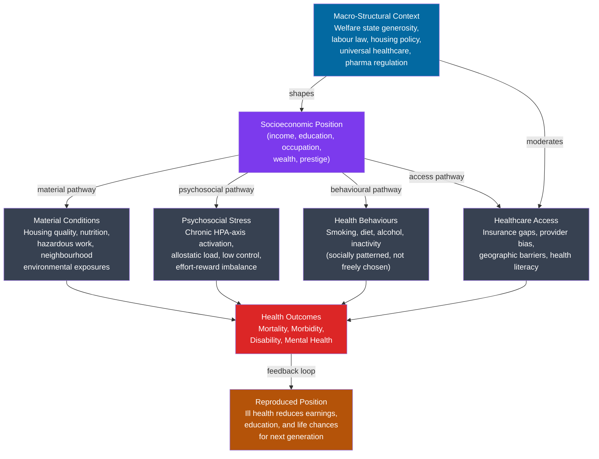

# Health Inequality and Medical Sociology

> [!abstract] TL;DR
> Medical sociology examines health, illness, and healthcare as social phenomena — not merely biological ones. The central finding is the **social gradient of health**: health outcomes follow socioeconomic position in a continuous gradient, not a simple poor/rich threshold. Parsons' **sick role** theorized illness as a temporary, legitimated deviation from normal social functioning. The **Whitehall studies** (Marmot, 1967–present) demonstrated that even among employed civil servants — eliminating absolute poverty — each step up the hierarchy produced better health. **Structural violence** (Farmer) frames poverty and inequality as forms of violence embedded in social arrangements that systematically shorten lives. **Medicalization** (Conrad) describes how social problems — deviance, unhappiness, ADHD, menopause — are redefined as medical conditions requiring clinical intervention, with consequences for power, stigma, and pharmaceutical profit.

---

## Intuition

**Analogy:** Imagine two soldiers ordered to run through a minefield. The first is barefoot and knows nothing of the terrain; the second wears boots, has a map, and walks with a guide. Both are "exposed to the same minefield" in the sense that the mines are distributed identically. But their risk of injury is radically different — not because of their genes or personal choices, but because of the resources and information they were given before entering the field.

Now extend the analogy: there are not two soldiers but five hundred, distributed across five columns with progressively better equipment. The injury rate falls continuously from column to column — not as a step-function that separates the "totally unequipped" from "everyone else," but as a smooth gradient. Even the soldiers in the second-best column have meaningfully worse outcomes than those in the best column, despite both being "above the poverty threshold."

This is the social gradient of health as Michael Marmot found it in the British civil service. The mines are chronic stressors — job insecurity, debt, environmental toxins, poor housing, inadequate food, lack of autonomy. The boots and maps are socioeconomic resources: income, education, social support, sense of control, access to healthcare. Health is the gradient between them.

---

## How It Works



---

## Key Concepts

### Secondary Level

**What is medical sociology?**

Medical sociology is the sub-discipline that applies sociological frameworks to questions of health, illness, and the organization of healthcare. Three questions anchor the field:

1. Why are some groups healthier than others? (the inequality question)
2. How do societies define what counts as illness, and who has authority over those definitions? (the power question)
3. How do patients and providers interact, and what norms govern the "sick" role? (the interaction question)

The foundational sociological claim is that health is not simply a biological property of individuals. It is produced and distributed through social structures — your zip code, your job, your race, the welfare state of your country. The biological body is the site where social arrangements leave their marks.

**Parsons and the sick role.**

Talcott Parsons, writing in *The Social System* (1951), offered the first systematic sociological account of illness. He argued that being sick is not merely a physical state but a *social role* — a recognized set of rights and obligations that society grants and imposes on the ill person. The sick role has four features:

| Component | Content |
|-----------|---------|
| **Right 1: Exemption from normal duties** | The sick person is legitimately excused from work, family obligations, and social roles — illness is recognized as involuntary |
| **Right 2: Reduced blame** | The sick person is not held morally responsible for their condition (they did not "choose" to be ill) |
| **Obligation 1: Seek recovery** | The sick person is expected to want to get well; long-term sick identity without effort to recover is illegitimate |
| **Obligation 2: Seek competent help** | The sick person must consult a doctor and comply with treatment; illness is not a private matter |

The sick role is a **functional equilibrium device**: illness threatens social order because it removes people from their productive and reproductive roles. By granting temporary exemption in exchange for the obligation to recover and re-enter those roles, the sick role contains the threat. The physician is the gatekeeper — the social agent who validates the claim to illness and authorizes the exemption.

**Parsons' model has been heavily critiqued** for (a) assuming acute, short-term illness in a male worker — it does not fit chronic illness, mental illness, disability, or conditions society blames the patient for (obesity, addiction, HIV/AIDS); (b) assuming symmetrical trust between physician and patient that masks massive power differentials; and (c) naturalizing the physician's authority without questioning how medicine itself is a social institution that serves particular interests.

**Social determinants of health: the basic model.**

The World Health Organization defines social determinants of health as "the conditions in which people are born, grow, live, work, and age." The core insight — documented across thousands of studies — is that income, education, employment, and social support explain more variance in population health than genetics or healthcare access combined. The WHO Commission on Social Determinants of Health (Marmot, Chair, 2008) concluded that "the social gradient in health is not a natural phenomenon but the result of a toxic combination of poor social policies and programmes, unfair economic arrangements, and bad politics."

The key variables are:

- **Income and wealth**: directly purchase food quality, housing safety, healthcare, and freedom from the cortisol-spiking anxiety of financial precarity.
- **Education**: confers health literacy, access to professional jobs, cognitive resources for navigating healthcare systems, and social networks with health-promoting information.
- **Employment and working conditions**: job control (the ability to decide how and when work is done) is one of the strongest predictors of cardiovascular disease risk — Karasek's demand-control model shows that high demand combined with low control is the most toxic combination.
- **Social support and networks**: socially isolated people have all-cause mortality rates 50-100% higher than the well-connected; Berkman and Syme's Alameda County study (1979) was among the first to document this.

---

### Undergraduate Level

**The Whitehall studies and the health gradient.**

The most influential empirical contribution to medical sociology came from a series of studies of British civil servants — the Whitehall (1967–1977) and Whitehall II (1985–present) cohort studies, led by Michael Marmot. The studies are remarkable for what they *ruled out*: they studied employed white-collar workers in stable government jobs, eliminating unemployment, poverty, and most obvious material deprivation as explanations.

What they found was a precise, continuous gradient: each step down the administrative hierarchy — from senior administrators to clerical staff — produced worse health outcomes (higher coronary heart disease mortality, shorter life expectancy, higher rates of diabetes and depression). The gradient was not a step-function dividing the "deprived" from the rest; it ran continuously from top to bottom. Even workers in the second tier had worse health than those in the first tier.

The proposed mechanism was **psychosocial**: lower-grade workers had less *control* over their work, less *social support* from supervisors, and lower *status* — which Marmot and colleagues argued produced chronic HPA-axis activation (see [[Stress_and_Coping]]). The autonomic stress response, designed for acute threats, becomes pathological when chronically activated: elevated cortisol damages the hippocampus, suppresses immune function, promotes atherosclerosis, and impairs sleep. The gradient in health is a gradient in chronic physiological burden produced by social arrangements.

This distinction — **gradient**, not threshold — is politically significant. Poverty interventions that focus only on the very bottom (raising people above a poverty line) will improve the health of the worst-off quintile but leave the rest of the gradient intact. The Marmot Review (*Fair Society, Healthy Lives*, 2010) argued that action is needed across the full social gradient — "proportionate universalism" — rather than targeting only the poor.

**Wilkinson and Pickett: inequality itself as a health risk.**

Richard Wilkinson and Kate Pickett's *The Spirit Level* (2009) assembled cross-national data showing that among rich countries, absolute income level matters far less for health outcomes than *income inequality* (measured by the Gini coefficient or top-to-bottom income ratio). More unequal rich countries — the United States, United Kingdom, Portugal — have worse outcomes on virtually every health and social indicator (life expectancy, infant mortality, obesity, mental illness, incarceration, social mobility) than equally wealthy but more equal countries (Japan, Norway, Sweden).

The proposed mechanism operates through two pathways: (1) material — inequality concentrates environmental and occupational hazards at the bottom; and (2) psychosocial — high-inequality societies generate more *status anxiety* at every level of the hierarchy (the perceived distance between oneself and those above and below is larger), triggering chronic stress responses across the whole social spectrum, not just among the poor.

**Medicalization: Conrad's sociology of social problems as medical conditions.**

Peter Conrad, building on earlier work by Irving Zola and Eliot Freidson, developed the concept of **medicalization** — the process by which non-medical problems come to be defined and treated as medical conditions. Conrad's thesis is not that medicine is fraudulent, but that medical categories are *applied to* domains that were previously handled by religion, criminal law, education, or family, with significant consequences for how we understand and respond to them.

Classic examples of medicalized conditions:
- **Hyperactivity / ADHD**: previously understood as bad behaviour, moral failure, or inadequate discipline; redefined as a neurological disorder treatable by stimulant medication; diagnosis rates in the US have risen from under 1% in the 1970s to over 10% of school-age children by 2020, though cross-national variation (low rates in France; high in US) suggests cultural and structural, not purely biological, drivers.
- **Menopause**: a natural hormonal transition redefined as an "estrogen deficiency disease" requiring pharmaceutical management; Conrad and Reinharz argue that pharmaceutical companies actively promoted this framing to expand markets.
- **Alcoholism**: transformed from moral failure ("sin" or "weakness of will") to medical disease ("alcohol use disorder"), with implications for criminal responsibility, insurance coverage, and social sympathy.
- **Shyness / Social Anxiety Disorder**: the reclassification of personality variation as clinical disorder coincided with the availability of SSRIs, creating what critics called "disease-mongering."

Conrad identifies three social forces driving medicalization: *professional interests* (medicine expanding jurisdiction), *patient-consumer demand* (seeking legitimation, exemption, or treatment), and *pharmaceutical industry* (creating markets by sponsoring research, influencing DSM revisions, and direct-to-consumer advertising in countries that allow it).

**Biomedicalization: Clarke's technoscientific transformation.**

Adele Clarke and colleagues proposed **biomedicalization** (2003) as the successor to medicalization — describing a shift from treating disease to *transforming* bodies and selves through technoscience. Where medicalization focused on extending medical control over more domains, biomedicalization is characterized by:

1. The commodification of health — health becomes a *moral obligation* to optimize and an object of individual self-improvement, not merely the absence of disease.
2. Risk and surveillance — genetic testing, biomarkers, screening programs, and wearable devices identify "pre-patients" at statistical risk before they have symptoms; medicine manages populations, not just patients.
3. Technoscientific transformations — genomics, pharmacogenomics, and personalized medicine (see [[Pharmacogenomics_and_Personalized_Medicine]]) promise treatments tailored to individual biological profiles, extending medical authority deep into the genome.
4. Knowledge practices — patient activism, online health communities, and direct-to-consumer genomics create new hybrid forms of lay-expert knowledge.

The critique: biomedicalization further extends medical power into everyday life, transforms social problems into individual biological management challenges, and reconfigures responsibility from the welfare state (ensuring health-enabling conditions for all) to the self-optimizing individual.

**Health disparities by race, class, and gender.**

Health disparities are the systematic, avoidable differences in health outcomes between social groups.

*Class*: The Whitehall gradient holds globally. In the United States, adults in the bottom income quintile die on average 10–15 years earlier than those in the top quintile. The gradient persists after controlling for behavioural factors (smoking, diet, exercise), demonstrating that health behaviours explain the gradient only partially — the psychosocial and material pathways operate independently.

*Race*: Black Americans experience worse outcomes on virtually every health indicator — infant mortality (2.3 times higher than for white Americans), maternal mortality (3 times higher), cardiovascular disease, hypertension, diabetes, and life expectancy. The mechanisms are multiple: residential segregation concentrating environmental hazards, differential access to healthcare and insurance, provider bias and discrimination in clinical encounters (weathering hypothesis — chronic stress from racism accelerates biological aging, documented by Arline Geronimus), and generational wealth gaps from redlining that translate into neighbourhood effects.

*Gender*: Women live longer than men (5–7 years, globally) but report higher rates of chronic illness, disability, depression, and anxiety. The paradox — women die less, but suffer more — reflects both reporting differences and real gendered patterns of illness. Women's pain and symptoms are systematically undertreated relative to men's (the phenomenon of "yentl syndrome": clinical research historically conducted on male subjects, so female presentations of heart disease are unrecognized); domestic violence is a leading cause of injury and mental illness for women; unpaid care work imposes physical and psychological burdens disproportionately on women.

**Patient-provider interaction and medical authority.**

Eliot Freidson's *Profession of Medicine* (1970) analysed professional dominance — the way physicians secured exclusive jurisdiction over the definition and treatment of illness, delegating limited authority to allied professions (nursing, pharmacy), and maintaining client dependence through information asymmetry and licensing barriers.

Symbolic interactionist studies of clinical encounters (Erving Goffman, David Sudnow) documented how medical authority operates at the micro-level: doctors interrupt patients (an average of 18 seconds before redirecting in early studies), use technical language that obscures rather than informs, and treat working-class patients differently — with less explanation, less time, more directive recommendations. Aaron Antonovsky and others showed that physicians consistently attribute illness to lifestyle choices (individual responsibility) more readily for lower-class patients, naturalized by biomedical frameworks that render social causes invisible.

---

### Graduate Level

**Structural violence and health: Paul Farmer.**

Paul Farmer's *Pathologies of Power* (2003) introduced structural violence into medical sociology as a framework for understanding how poverty and inequality kill. Structural violence is not the direct violence of assault or warfare; it is violence embedded in social structures — economic arrangements, political institutions, cultural practices — that systematically harm particular groups by denying them resources, dignity, and physical safety that others take for granted.

Farmer drew on Johan Galtung's original concept and applied it to Haiti, Peru, and Rwanda: in all three cases, he showed that which populations contracted tuberculosis, HIV/AIDS, or died in political violence was not random — it was precisely the populations already most disadvantaged by colonial history, economic dependency, and racial hierarchy. The TB patient in Haiti who dies for lack of $50 of antibiotics dies not of an infection but of a social arrangement that made antibiotics unavailable to her. The violence is real; it is lethal; but its agency is distributed across centuries of colonial dispossession and contemporary economic institutions rather than concentrated in a single perpetrator.

Farmer's framework resists three common evasions: (1) blaming patient non-compliance (the patient's fatalism, ignorance, or culture); (2) fatalism about resource availability (the poor countries cannot afford interventions); and (3) clinical detachment from the social context of suffering. His Partners in Health intervention model proves that high-quality tuberculosis and HIV treatment is achievable in resource-poor settings with community health workers, accompaniers, and removal of structural barriers — demonstrating that the barrier is political will, not technical impossibility.

**The political economy of global health and the pharmaceutical industry.**

John Abraham, Marcia Angell, and others have documented how the pharmaceutical industry's profit structure distorts medical research and global health. The issues are structural, not merely ethical:

- *Neglected diseases*: 90% of global disease burden falls on populations in low-income countries, but less than 10% of pharmaceutical R&D targets diseases prevalent there. Malaria, tuberculosis, and tropical diseases receive minimal commercial investment because their sufferers cannot pay market prices. The market mechanism systematically misallocates medical innovation away from where need is greatest.

- *Disease mongering*: the pharmaceutical industry, through funding of clinical trials, sponsorship of medical education, direct-to-consumer advertising, and influence over diagnostic criteria revision (the DSM revision process has been documented by critics including Robert Whitaker and David Healy), expands the definition of treatable conditions — lowering thresholds for hypertension, cholesterol, depression — thereby expanding markets.

- *TRIPS and access*: the WTO's Agreement on Trade-Related Aspects of Intellectual Property Rights extended patent protection globally, preventing low-income countries from producing generic versions of HIV medications at affordable cost. The AIDS crisis in Sub-Saharan Africa during the 1990s — when HAART medications existed and were routinely saving lives in wealthy countries but cost $15,000 per year (equivalent to multiple years of GDP per capita in countries like Malawi) — is the paradigmatic case of how intellectual property regimes operate as instruments of structural violence.

**Foucault, biopower, and the governance of health.**

Michel Foucault's *The Birth of the Clinic* (1963) and later work on *Discipline and Punish* (1975) and the lectures on biopolitics introduced the concept of **biopower** — the exercise of power over the biological body, both at the individual level (disciplinary power: clinical surveillance, examination, normalization) and at the population level (biopolitics: public health, epidemiology, demographic management).

The clinical gaze (*le regard médical*) is not a neutral scientific observation but a historically constituted form of knowledge-power that defines the boundaries of the normal and pathological, authorizes certain interventions, and produces subjects who understand themselves through medical categories. The medicalization of sexuality (homosexuality was classified as a mental disorder in DSM until 1973), the psychiatric institutionalization of dissenters, and the eugenic public health campaigns of the early 20th century are all applications of biopower — the use of medical authority to manage populations by defining who is normal, productive, and governable.

Foucault's framework explains why medicalization is not simply an expansion of beneficial treatment but also a form of social control: the sick role (Parsons) makes the ill person legible, manageable, and temporarily exempted from social demands in exchange for submission to medical authority. The extension of medical categories to behaviour, emotion, and identity — what Foucault called the medicalization of existence — produces subjects who experience their own deviance, distress, or difference as individual pathology requiring clinical correction, rather than as responses to social conditions requiring political change.

**Mental health sociology.**

Anne Horwitz and Jerome Wakefield's *The Loss of Sadness* (2007) argued that the DSM's elimination of a "bereavement exclusion" (grief was previously a reason not to diagnose major depression in recently bereaved individuals) exemplifies a broader pattern: the conflation of normal human suffering with psychiatric disorder. The medicalisation of distress — transforming grief, anxiety, social alienation, and political despair into disorders with neurochemical causes requiring pharmacological correction — obscures the social origins of suffering.

David Pilgrim and Anne Rogers's sociology of mental health identifies three key patterns:
1. **Social causation vs. social selection**: does lower SES cause mental illness (via stressors, adversity, trauma) or do people with mental illness drift into lower SES? Longitudinal data supports bidirectionality but with causation from SES dominant for common mental disorders (depression, anxiety) and selection somewhat stronger for severe disorders like schizophrenia.
2. **Diagnosis and power**: psychiatric diagnosis is not a neutral biological categorization. The history of DSM revision shows consistent influence of pharmaceutical companies (new billable diagnoses expand markets), professional interests (psychiatry's status depends on being a "real" medicine), and cultural values (which forms of distress merit the status of illness).
3. **The asylum and its successors**: deinstitutionalization in the 1960s–1980s transferred patients from psychiatric hospitals to "community care" — which in practice often meant prisons (the US now incarcerates more severely mentally ill people than it hospitalizes), homeless shelters, and family caregiving, predominantly by women.

**Epigenetics and the embodiment of inequality.**

Social epidemiologist Nancy Krieger's **ecosocial theory** argues that bodies literally embody social inequalities — that the biological traces of social disadvantage are written into gene expression, immune function, cardiovascular physiology, and even telomere length. This is not metaphor. Research on epigenetics (see [[Epigenetics_DNA_Methylation_and_Histone_Modification]]) documents that chronic stress from poverty, racism, and adversity induces methylation patterns that alter gene expression without changing DNA sequence, with consequences for immune function, inflammation, and metabolism. These epigenetic marks can persist across generations — a biological mechanism for intergenerational transmission of health disadvantage that does not require genetic inheritance of disease variants.

Arline Geronimus' **weathering hypothesis** proposes that Black Americans experience accelerated biological aging — measured by telomere length, allostatic load markers, and epigenetic clocks — as a consequence of cumulative chronic stress from racism and socioeconomic disadvantage, beginning in early adulthood. This explains the paradox of infant mortality: in the United States, infant mortality is higher for college-educated Black women than for white women who did not complete high school — the accumulated weathering of racism outweighs the protective effect of education and income.

---

## Python Demo

```python
# Marmot-style social gradient of health simulation
# Models mortality rates across 5 SES quintiles as a function of:
#   - Chronic stress exposure (inverse of SES)
#   - Buffering capacity (social support, control, material resources; positive with SES)
#   - Net allostatic burden = exposure - buffer
# Also simulates what happens when inequality is reduced by 45%:
#   compressing the SES distribution shifts the whole gradient downward,
#   benefiting all quintiles — not just the lowest.
# Key demonstration: the gradient is continuous (not a poverty threshold effect).

import numpy as np
import matplotlib.pyplot as plt

rng = np.random.default_rng(42)

QUINTILES = 5
N_PER_QUINTILE = 2000
LABELS = ["Q1\n(Lowest)", "Q2", "Q3", "Q4", "Q5\n(Highest)"]

# Chronic stress exposure: inversely related to SES
# Calibrated to Karasek demand-control and Siegrist effort-reward research
stress_exposure = np.array([0.85, 0.68, 0.52, 0.35, 0.20])

# Buffering capacity: income, social support, sense of control (Marmot)
buffer_capacity = np.array([0.15, 0.30, 0.48, 0.65, 0.80])

# Net allostatic burden (MacArthur Network allostatic load concept)
net_burden = np.clip(stress_exposure - 0.6 * buffer_capacity, 0.01, 0.99)

# Age-standardized mortality rate (deaths per 1000 per year)
# Calibrated loosely to Whitehall II range across civil service grades
mort_mean = 2.0 + 10.0 * net_burden
mort_std = 1.2

# Individual-level variation within each quintile
individual_mort = [
    np.clip(rng.normal(mort_mean[q], mort_std, N_PER_QUINTILE), 0.5, 20.0)
    for q in range(QUINTILES)
]

# === Inequality reduction scenario (Marmot Review: proportionate universalism) ===
# Compress the SES gradient by 45%: raise lower quintiles, moderate upper
reduction = 0.45
compressed_stress = stress_exposure - reduction * (stress_exposure - stress_exposure.mean())
compressed_buffer = buffer_capacity + reduction * (buffer_capacity.mean() - buffer_capacity)
compressed_burden = np.clip(compressed_stress - 0.6 * compressed_buffer, 0.01, 0.99)
compressed_mort = 2.0 + 10.0 * compressed_burden

# ===========================  VISUALISATION  ===========================
fig, axes = plt.subplots(1, 3, figsize=(16, 6))

# --- Panel 1: Mortality gradient before and after inequality reduction ---
ax1 = axes[0]
x = np.arange(QUINTILES)
w = 0.35
ax1.bar(x - w/2, mort_mean, w, color="#dc2626", alpha=0.85, label="Baseline inequality")
ax1.bar(x + w/2, compressed_mort, w, color="#2563eb", alpha=0.85, label="Reduced inequality (−45%)")
ax1.set_xticks(x)
ax1.set_xticklabels(LABELS, fontsize=8.5)
ax1.set_ylabel("Mortality rate (deaths per 1000/year)")
ax1.set_title("Marmot Social Gradient:\nMortality by SES Quintile", fontweight="bold")
ax1.legend(fontsize=9)
ax1.grid(axis="y", alpha=0.3)
for i, (bv, cv) in enumerate(zip(mort_mean, compressed_mort)):
    ax1.text(x[i] - w/2, bv + 0.12, f"{bv:.1f}", ha="center", fontsize=7.5, color="#dc2626")
    ax1.text(x[i] + w/2, cv + 0.12, f"{cv:.1f}", ha="center", fontsize=7.5, color="#2563eb")

# --- Panel 2: Decomposition into stress, buffer, net burden ---
ax2 = axes[1]
ax2.plot(range(QUINTILES), stress_exposure, "o-", color="#dc2626",
         lw=2.5, ms=8, label="Chronic stress exposure")
ax2.plot(range(QUINTILES), buffer_capacity, "s-", color="#16a34a",
         lw=2.5, ms=8, label="Buffering capacity (control + support)")
ax2.plot(range(QUINTILES), net_burden, "^-", color="#7c3aed",
         lw=2.5, ms=8, label="Net allostatic burden")
ax2.fill_between(range(QUINTILES), net_burden, buffer_capacity * 0.6,
                 alpha=0.08, color="#dc2626", label="Uncompensated stress")
ax2.set_xticks(range(QUINTILES))
ax2.set_xticklabels(LABELS, fontsize=8.5)
ax2.set_ylabel("Index (0 = none, 1 = maximum)")
ax2.set_title("Karasek-Marmot Decomposition:\nStress, Buffer, Net Burden", fontweight="bold")
ax2.legend(fontsize=8)
ax2.grid(alpha=0.3)

# --- Panel 3: Distribution of individual risk (violin plot) ---
ax3 = axes[2]
parts = ax3.violinplot(individual_mort, positions=range(QUINTILES),
                       showmedians=True, widths=0.72)
for pc in parts["bodies"]:
    pc.set_facecolor("#f97316")
    pc.set_alpha(0.55)
parts["cmedians"].set_colors("#111827")
ax3.set_xticks(range(QUINTILES))
ax3.set_xticklabels(LABELS, fontsize=8.5)
ax3.set_ylabel("Individual mortality risk score")
ax3.set_title("Continuous Gradient:\nDistribution Within and Across Quintiles",
              fontweight="bold")
ax3.grid(axis="y", alpha=0.3)
med_q4 = float(np.median(individual_mort[3]))
med_q5 = float(np.median(individual_mort[4]))
ax3.annotate(
    f"Even Q4→Q5 gap:\n{med_q4:.1f} vs {med_q5:.1f}\n(not just Q1 vs rest)",
    xy=(3.5, (med_q4 + med_q5) / 2),
    xytext=(2.2, med_q5 + 3.8),
    fontsize=7.5, color="#1d4ed8",
    arrowprops=dict(arrowstyle="->", color="#1d4ed8", lw=1.2),
)

fig.suptitle(
    "Social Gradient of Health: Marmot-Style Simulation\n"
    "Stress exposure, buffering capacity, and the effect of inequality reduction",
    fontsize=12, fontweight="bold", y=1.01
)
plt.tight_layout()
plt.savefig("health_inequality_gradient.png", dpi=150, bbox_inches="tight")
plt.show()

# Summary table
print(f"\n{'Quintile':<16} {'Baseline':>10} {'Reduced':>10} {'Gain':>8}")
print("-" * 46)
for i, lbl in enumerate(["Q1 (Lowest)", "Q2", "Q3", "Q4", "Q5 (Highest)"]):
    gain = mort_mean[i] - compressed_mort[i]
    print(f"{lbl:<16} {mort_mean[i]:>9.2f} {compressed_mort[i]:>9.2f} {gain:>7.2f}")

pop_gain = mort_mean.mean() - compressed_mort.mean()
grad_before = mort_mean[0] - mort_mean[-1]
grad_after = compressed_mort[0] - compressed_mort[-1]
print(f"\nPopulation mean:  {mort_mean.mean():.2f} -> {compressed_mort.mean():.2f}  (gain: {pop_gain:.2f})")
print(f"Gradient width:   {grad_before:.2f} -> {grad_after:.2f}  (narrowing: {grad_before - grad_after:.2f})")
print("\nKey: inequality reduction benefits ALL quintiles, not just Q1.")
print("The continuous gradient means that Q4->Q5 differences carry real health costs.")
```

**Reading the output.** Panel 1 shows that compressing the SES distribution by 45% reduces mortality in every quintile — most dramatically in Q1, but measurably across all. This illustrates the Marmot Review's "proportionate universalism": universal policies benefit all, with proportionally greater benefit at the bottom. Panel 3 demonstrates the continuous gradient — even within each quintile there is substantial individual variation, and the distribution shifts monotonically up the social hierarchy. The Q4-to-Q5 gap, while smaller than Q1-to-Q2, is real and documentable — the gradient is not merely a poverty threshold effect.

---

## Real-World Applications

> **Whitehall II and the Demand-Control Model in Practice.** The Whitehall II study found that Grade 7 civil servants (senior administrators) had approximately 40% lower coronary heart disease mortality than Grade 1 (clerical/support staff) — despite both groups being employed, housed, and above any poverty threshold. Marmot and Theorell operationalised the mechanism as "control over work": low-grade workers had high job demands but low latitude over how they fulfilled those demands — Karasek's "high strain" quadrant. Interventions derived from this research (job redesign to increase worker autonomy, participatory management) are now embedded in occupational health policy in several Nordic countries, directly reducing cardiovascular risk by structural means.

> **ADHD and Medicalization in the United States.** ADHD diagnosis rates in the US rose from approximately 3% in 1997 to 10.5% of children by 2016, with rates in some southern US states exceeding 15%. Conrad's medicalization framework predicts that this variation reflects social and institutional factors — pressure on teachers to manage classroom behaviour, school funding tied to special education designations, pharmaceutical marketing, and state-level variation in insurance mandates — rather than biological variation in prevalence. Cross-national data support this: ADHD diagnosis rates are 2–4% in France, where child psychiatry tradition emphasises family and context, compared with 10%+ in the US where a biomedical framework dominates. This does not mean ADHD is fictional — a genuine neurobiological variation exists — but that where the clinical threshold is set is a social negotiation, not a biological discovery.

> **Partners in Health and Structural Violence in Haiti.** Paul Farmer's Partners in Health (PIH) demonstrated that community-based directly observed therapy (DOT) for tuberculosis achieved cure rates of over 95% in rural Haiti — comparable to the US — by addressing structural barriers: providing food, transportation, and accompagnateurs (community health workers) to ensure adherence, rather than attributing treatment failure to patient non-compliance. The intervention proved that patient non-compliance was itself a structural outcome (people interrupted treatment because they could not afford to eat while taking medications that suppress appetite). When the structure changed — when social support arrived — compliance rates matched those in wealthy countries.

> **The Opioid Epidemic and Medical Authority.** The opioid epidemic in the United States (estimated 500,000 deaths 1999–2019) is a case study in the convergence of medicalization, pharmaceutical industry influence, and structural health inequality. Purdue Pharma's marketing of OxyContin aggressively promoted the claim that extended-release opioids carried low addiction risk, a claim unsupported by clinical evidence but successfully disseminated through sponsored medical education, journal advertising, and patient advocacy groups. The epidemic disproportionately hit deindustrialised white working-class communities — the intersection of economic despair (structural causes) and medically supplied addictive substances. Both structural violence (the collapse of manufacturing employment and the defunding of social services) and medicalization (the prescription of opioids as a medical solution to what was partly a social crisis) were necessary conditions.

> **Biomedicalization and Genomic Medicine.** The Human Genome Project (completed 2003) and the subsequent GWAS (genome-wide association study) era promised personalized medicine — treatments matched to individual genetic profiles (see [[Pharmacogenomics_and_Personalized_Medicine]]). Clarke's biomedicalization framework predicts that this technoscientific transformation will individualize health responsibility further: rather than addressing socioeconomic conditions that drive 80% of health variance, genomic medicine targets the 20% of variance attributable to genetic risk factors. Critics note that GWAS studies have predominantly been conducted on populations of European descent, limiting generalizability; that polygenic risk scores identify statistical risk without clear clinical actionability for most conditions; and that the genomic framework reinforces genetic determinism at the expense of structural analysis.

---

## Common Pitfalls

- **Confusing the gradient with a poverty threshold effect** — The most politically costly mistake in health policy is to target only the poorest quintile, leaving the rest of the gradient untouched. The Whitehall studies show that health differences between the second-highest and highest employment grade are real and substantial. "Fixing poverty" would reduce health inequality but not eliminate it; the full gradient requires action across the whole social distribution.

- **Treating health behaviours as the proximate cause without asking why behaviours are socially patterned** — Smoking rates are four times higher among the lowest income quintile than the highest. This is not evidence that inequality causes health disparities primarily via smoking — it is evidence that unhealthy behaviours are themselves *consequences* of structural disadvantage, concentrated in populations experiencing chronic stress, limited autonomy, and poor housing. Anti-smoking campaigns that target individual behaviour without addressing social conditions are addressing a symptom.

- **Medicalizing the analysis itself** — A common error, even among sociologists, is to accept biomedical frameworks uncritically while analysing health. The question "why do Black Americans have higher rates of hypertension?" is answered in biomedical discourse by genetic risk factors; in social epidemiology by chronic stress from racism, residential exposure to environmental toxins, and healthcare under-treatment. Both answers may be partly true — but selecting only the biomedical framing forecloses the social analysis. Krieger's ecosocial theory and the weathering hypothesis provide the sociological counter-framework.

- **Assuming medicalization is always harmful** — Conrad explicitly frames medicalization as ambivalent. The medicalization of epilepsy, tuberculosis, and depression has provided legitimation, reduced moral stigma, and enabled effective treatment. The medicalization of alcoholism replaced imprisonment with treatment programmes. The problem is not that medical categories are applied but that *they may be applied in ways that serve pharmaceutical profit, extend social control, or depoliticize structural suffering*. The critical analyst must distinguish these cases, not oppose medical knowledge as such.

- **Confusing structural violence with moralizing about systems** — Farmer's structural violence concept is sometimes misread as political rhetoric. It is intended as a precise analytical claim: specific, identifiable social arrangements (colonial land tenure, pharmaceutical patent law, trade agreements, housing segregation policies) produce measurable excess mortality in specific populations that would not occur under different arrangements. The claim is falsifiable — it requires specifying which structures, affecting which populations, through which mechanisms, producing which health outcomes. It is not equivalent to "capitalism is bad."

- **Ignoring patient agency in medicalization analyses** — Symbolic interactionist studies of medicalization (Conrad, Schneider) emphasize that patients are not passive recipients of medical categories; they actively seek medical labels to gain legitimation, disability accommodations, insurance coverage, or social sympathy. The sick role grants rights as well as imposing obligations. A complete analysis recognises that medicalization operates through patient demand as well as professional expansion and pharmaceutical industry interest.

---

## Related Concepts

- [[Social_Class_and_Stratification]] — socioeconomic position is the primary independent variable in the social determinants of health model; Bourdieu's capital forms (economic, cultural, social) are the mechanisms through which class produces health gradients
- [[Poverty_Social_Mobility_and_Life_Chances]] — Weber's life chances concept is directly applicable to health: your class position shapes the probability of living to 70; the Great Gatsby Curve's inequality-mobility relationship has a direct analogue in the inequality-health relationship documented by Wilkinson and Pickett
- [[Intersectionality]] — race, class, and gender interact multiplicatively to produce health disparities; Black women's maternal mortality in the US (3x the white rate, persisting after controlling for income and education) is an intersectional health outcome invisible to single-axis analysis
- [[Race_Ethnicity_and_Racism]] — Geronimus' weathering hypothesis and Krieger's ecosocial theory document how racism operates as a chronic stressor that accelerates biological aging and produces racial health disparities independent of absolute socioeconomic level
- [[Gender_Sex_and_Patriarchy]] — the gender health paradox (women live longer but suffer more chronic illness), the medicalization of female biology (menopause, premenstrual syndrome, childbirth), and the gendered division of care labour as a health burden are core topics in feminist medical sociology
- [[Conflict_Theory_and_Critical_Theory]] — structural violence (Farmer) and the political economy of health are applications of conflict theory; the pharmaceutical industry as a profit-maximizing institution operating within capitalist relations of production is the Marxist analysis of global health inequity
- [[Functionalism_and_Systems_Theory]] — Parsons' sick role is the foundational functionalist contribution to medical sociology; understanding its assumptions (equilibrium, consensual norms, professional authority) is necessary to appreciate why later conflict and interactionist theorists rejected it
- [[Stress_and_Coping]] — the HPA axis, cortisol physiology, allostatic load, and Karasek's demand-control model provide the psychobiological mechanism linking low socioeconomic status to cardiovascular disease, immune dysfunction, and premature aging
- [[Psychiatric_Disorders_and_Neurobiology]] — DSM classification and the biomedical model of mental illness are the targets of medicalization critique in mental health sociology; the social causation vs. social selection debate requires understanding both the neurobiology and the social epidemiology
- [[Welfare_States_and_Social_Policy]] — Esping-Andersen's welfare state regimes explain why universal healthcare systems (social democratic) produce shallower health gradients than liberal systems (US/UK); decommodification of healthcare is the policy mechanism for flattening the social gradient
- [[Epigenetics_DNA_Methylation_and_Histone_Modification]] — Krieger's ecosocial theory is biologically grounded in epigenetics: social adversity induces methylation patterns that alter gene expression, providing a molecular mechanism for the embodiment of inequality and the intergenerational transmission of health disadvantage
- [[Pharmacogenomics_and_Personalized_Medicine]] — biomedicalization (Clarke) identifies genomic personalized medicine as the latest phase of technoscientific medicalization; the promise of pharmacogenomics raises questions about whether genetic individualization will substitute for structural reform of health determinants

---

## Review Questions

### Secondary

1. Talcott Parsons argued that illness is a social role, not merely a biological state. What four features define the sick role? Give one example of a contemporary illness (e.g., long COVID, depression, obesity) where the sick role applies imperfectly, and explain why.
2. The Whitehall studies found a continuous health gradient among employed civil servants with no one in poverty. What does this finding imply about "poverty" as the explanation for health inequality? Why is the distinction between a gradient and a threshold politically important?
3. What does it mean to say that health behaviours (smoking, diet, exercise) are "socially patterned"? Why is a policy that targets smoking without addressing why disadvantaged groups smoke at higher rates likely to be insufficient?

### Undergraduate

1. Peter Conrad defines medicalization as the process by which non-medical problems become defined and treated as medical conditions. Using ADHD as your case study, identify the three social forces Conrad proposes drive medicalization, and evaluate the evidence that each was operative in the expansion of ADHD diagnosis in the United States since 1990. Does acknowledging medicalization require concluding that ADHD is not a real condition?
2. Richard Wilkinson and Kate Pickett argue that among wealthy nations, income inequality — not absolute income level — predicts health outcomes. What are the two proposed mechanisms (material and psychosocial)? What methodological criticisms have been raised against their cross-national comparative design, and how have Wilkinson and Pickett responded?
3. Adele Clarke distinguishes biomedicalization from Conrad's medicalization. Using genomic testing for disease risk as your example, explain what is distinctively "biomedicalized" about this practice — how does it differ from the medicalization of, say, childbirth or alcoholism — and what social consequences does Clarke predict from the shift toward surveillance, risk management, and bodily optimization?

### Graduate

1. Paul Farmer argues that structural violence is a more analytically precise concept than "poverty" or "inequality" for explaining health disparities in global health. Specify the precise causal claim embedded in the structural violence framework — which structures, affecting which populations, through which mechanisms — and evaluate it against two alternative explanatory frameworks: (a) the individual behaviour / cultural explanation, and (b) the absolute resource constraint (low-income countries lack the capacity for expensive interventions). What empirical evidence does Farmer's Partners in Health intervention provide, and what are the limits of that evidence?
2. Nancy Krieger's ecosocial theory proposes that bodies "embody" social inequality through epigenetic, neuroendocrine, and immunological pathways. How does this account differ from (a) purely social-constructionist accounts of health inequality (health disparities are artefacts of differential labelling and diagnosis) and (b) genetic determinist accounts (racial health disparities reflect inherited genetic risk)? What would a research programme informed by ecosocial theory look like, and what methodological challenges does it face?
3. The sociology of mental health contains a persistent debate between social causation (low SES causes mental illness) and social selection / drift (mental illness causes downward mobility). Design a longitudinal study to empirically distinguish these two hypotheses for major depression. What confounders would you need to address? How does the epigenetic inheritance of stress-response dysregulation (intergenerational transmission) complicate the causation/selection distinction at the population level?

---

## Sources

- [Marmot, M. (2010). *Fair Society, Healthy Lives: The Marmot Review*. UCL Institute of Health Equity](https://www.instituteofhealthequity.org/resources-reports/fair-society-healthy-lives-the-marmot-review)
- [Wilkinson, R. & Pickett, K. (2009). *The Spirit Level: Why More Equal Societies Almost Always Do Better*. Allen Lane](https://www.equalitytrust.org.uk/resources/the-spirit-level)
- [Parsons, T. (1951). *The Social System*. Free Press — Sick Role chapter](https://www.jstor.org/stable/j.ctvss3wqh)
- [Conrad, P. (2007). *The Medicalization of Society*. Johns Hopkins University Press](https://www.press.jhu.edu/books/title/10028/medicalization-society)
- [Farmer, P. (2003). *Pathologies of Power: Health, Human Rights, and the New War on the Poor*. University of California Press](https://www.ucpress.edu/book/9780520243262/pathologies-of-power)
- [Clarke, A. et al. (2003). "Biomedicalization: Technoscientific Transformations of Health, Illness, and U.S. Biomedicine." *American Sociological Review* 68(2):161–194](https://www.jstor.org/stable/1519765)
- [Marmot, M. et al. (1991). "Health Inequalities Among British Civil Servants: The Whitehall II Study." *The Lancet* 337:1387–1393](https://www.thelancet.com/journals/lancet/article/PII0140-6736(91)93068-K/abstract)
- [WHO Commission on Social Determinants of Health (2008). *Closing the Gap in a Generation*](https://www.who.int/publications/i/item/WHO-IER-CSDH-08.1)
- [Geronimus, A. T. (1992). "The Weathering Hypothesis and the Health of African-American Women." *Ethnicity and Disease* 2(3):207–221](https://www.ethnicityanddisease.com/abstract.php?issue=2-3&page=207-221)
- [Krieger, N. (2001). "Theories for Social Epidemiology in the 21st Century: An Ecosocial Perspective." *International Journal of Epidemiology* 30(4):668–677](https://academic.oup.com/ije/article/30/4/668/685253)
- [Karasek, R. & Theorell, T. (1990). *Healthy Work: Stress, Productivity, and the Reconstruction of Working Life*. Basic Books](https://www.basicbooks.com/titles/robert-karasek/healthy-work/9780465028979/)

---

#Sociology #AppliedSociology #MedicalSociology #HealthInequality #SocialDeterminants
