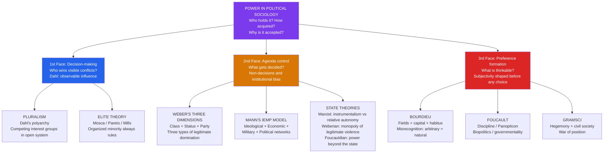

> [!abstract] TL;DR
> Political sociology examines who holds power, how it is acquired and legitimated, and why subordinate groups so often accept arrangements that disadvantage them. Five theoretical traditions offer competing answers: Weber grounds power in the intersection of class (market life-chances), status (social honor), and party (organized will-formation); Bourdieu shows that power circulates through fields as symbolic capital, disguised as natural competence through misrecognition; Foucault dissolves power from a possession into a diffuse network of disciplinary practices, surveillance, and the biopolitical governance of populations; elite theorists from Mosca to Mills demonstrate empirically that all complex societies produce a ruling minority; and Michael Mann's IEMP model disaggregates power into four irreducible sources — ideological, economic, military, and political — whose varying combinations explain the rise and fall of states and civilizations.

---

## Intuition

**Analogy:** Think of the difference between gravity and wind. Wind is visible — you can see the flags bending, feel the pressure, identify the storm system approaching. Gravity is invisible — it shapes every trajectory, holds every building to the earth, determines which direction rivers flow — but no one perceives it as an external force acting on them at each moment. It just is the way things are.

Weber's "party" and Mills' power elite resemble wind: organized, visible, acting with recognizable agency. But Bourdieu's symbolic power and Foucault's disciplinary power are closer to gravity: they structure what is thinkable, possible, and normal before anyone makes a conscious decision. The graduate student who self-censors her dissertation to match what she assumes examiners will accept, the worker who does not apply for a management position because "people like me don't do that," the journalist who instinctively frames stories in ways that won't alienate advertisers — none of these are responding to visible coercion. They are responding to a social gravity that has been internalised so thoroughly it feels like personal preference.

Political sociology is the science of social gravity: the systematic inquiry into why power concentrates, how it naturalises itself, what forms it takes across different institutions and societies, and under what conditions it can be redistributed.

---

## How It Works

The field organises around a fundamental conceptual tension between three faces of power, each requiring a different empirical method and a different theoretical framework.

Steven Lukes (*Power: A Radical View*, 1974) systematized this: Robert Dahl's pluralist definition locates power in observable, intentional acts of influence — A gets B to do something B would not otherwise do. Peter Bachrach and Morton Baratz (1962) added the **second face**: the most significant power is often not winning decisions but preventing issues from ever reaching a decision — non-decision, agenda control, and mobilisation of bias. Lukes' own **third face** went further still: the most profound power shapes preferences themselves — making B want what A wants B to want, without any observable conflict arising at all. These three dimensions map onto different research programmes: pluralism studies the first face; institutional and elite theory the second; cultural and critical theory (Bourdieu, Foucault, Gramsci) the third.



---

## Key Concepts

### Secondary Level

**What Is Political Sociology?**

Political sociology is not the same as political science. Political science tends to take political institutions — elections, legislatures, courts, parties — as its primary object of study and asks how they function. Political sociology asks the prior questions: what social conditions produce different kinds of states and political orders? Who benefits from political arrangements, and what non-political mechanisms — class, culture, religion, organizational density — shape political outcomes? Where does the state end and society begin? Why do some groups have political power while others, with equal formal rights, have virtually none?

The field begins with a deceptively simple question: what is power? Max Weber's answer, from *Economy and Society* (1922), remains the starting point: power (*Macht*) is "the probability that one actor within a social relationship will be in a position to carry out his own will despite resistance, regardless of the basis on which this probability rests." Weber immediately distinguishes legitimate domination (*Herrschaft*) from mere coercion: a stable political order requires not just the capacity to force compliance but the belief, on the part of those subject to it, that the authority is entitled to command. All stable states rest on some combination of three pure types of legitimate authority:

| Type | Basis of Legitimacy | Historical Example |
|------|---------------------|--------------------|
| **Traditional** | Sanctity of immemorial custom; "it has always been this way" | Hereditary monarchy, tribal chieftainship |
| **Charismatic** | Exceptional, superhuman qualities attributed to a leader | Revolutionary figures, prophets, fascist leaders |
| **Legal-rational** | Belief in the validity of formal rules and the competence of those appointed under them | Modern bureaucratic states, democratic constitutions |

Real political orders mix all three, but modernity's dominant direction is the *routinization of charisma* into legal-rational forms — bureaucracy as the organizational cage of modernity. Weber's melancholy: modern rational-legal states are enormously effective and irreversible, but they strip politics of the passionate meaning that drove religious and revolutionary transformations. The iron cage is also an iron framework of legitimate authority.

**Weber's Three Dimensions of Power**

Beyond authority types, Weber insisted that social inequality and political power have three analytically independent bases, not one. This directly challenged Marx, who reduced all political power to a reflection of economic class position.

*Class* — a person's position in the economic market. Class is determined not by what you own (Marx's emphasis) but by your *market life-chances*: the probability that you can sell your labour or services at a favorable price, access credit, acquire education, and convert economic resources into political influence. Classes do not automatically become political actors; they require organizational infrastructure and ideological articulation to mobilize into parties or movements.

*Status groups* — collectivities defined by shared styles of life, social honor, and prestige accorded by others. Status is the dimension of social inequality based on recognition, not just market position. Status groups share a positive or negative estimation and maintain social distance through endogamy, distinctive consumption patterns, and exclusionary social rituals. Status regularly diverges from class: the "poor but respectable" academic has high status but modest income; the nouveau riche entrepreneur has high class but contested status; ethnic minorities may have high economic attainment but face low status recognition. Racial, ethnic, religious, and gender hierarchies are primarily status phenomena, not reducible to class.

*Party* — organized collective action oriented toward acquiring power within a political order. Parties in Weber's broad sense include not just electoral parties but trade unions, professional associations, ethnic lobbies, military factions, and any organization with political aims. They cut across class and status: the same class can split into multiple parties with different strategies; parties regularly serve status-group interests that cut across class lines. Parties are the mechanism through which class interests and status-group identities are articulated and translated — imperfectly and with consistent distortions — into political power.

Weber's three-dimensional model remains the foundation of most quantitative stratification research and is the direct ancestor of Bourdieu's theory of capital forms. (See [[Social_Class_and_Stratification]] for the economic dimension in detail; [[Classical_Sociological_Theory]] for Weber's broader methodology.)

**Elite Theory: Mosca, Pareto, and Mills**

Elite theory holds that all complex societies, regardless of formal constitution, are governed by organized minorities who possess distinctive qualities enabling them to coordinate and maintain political dominance over disorganized majorities.

Gaetano Mosca (*The Ruling Class*, 1896) formulated the iron law most starkly: "In all societies — two classes of people appear — a class that rules and a class that is ruled." The ruling class is always a minority, always organized, and always justifies its rule through a *political formula* — a moral and legal ideology that represents elite rule as an expression of the people's will, divine mandate, or natural order. The political formula legitimates rather than actually constrains elite power. Different eras have different formulas (divine right, democratic mandate, technocratic expertise), but the underlying structure of organized minority rule remains constant.

Vilfredo Pareto (*The Mind and Society*, 1935) introduced *elite circulation*. Elites are defined by their excellence in their domain — not just political elites but elites in every field. Over time, elites degenerate and lose their qualities; when they can no longer co-opt rising counter-elites, they are replaced — "history is the graveyard of aristocracies." Pareto classified ruling elites as *lions* (who rule by force and tradition) versus *foxes* (who rule by cunning, manipulation, and coalition). Healthy regimes maintain elite circulation — bringing in talent from below before crisis forces replacement. Regimes that close themselves to circulation eventually face revolts that the lions can no longer repress or the foxes can no longer manipulate. Pareto's cycle illuminates the sociology of political revolutions as elite replacement rather than social transformation: new faces, same structure.

C. Wright Mills (*The Power Elite*, 1956) provided the definitive American application. His thesis: three institutional hierarchies — the corporate economy, the political executive, and the military establishment — had fused into an interlocking directorate by the mid-20th century. The power elite is not a conspiratorial cabal but a *structural convergence*: the same individuals move between Wall Street, the Pentagon, and the Cabinet; they attended the same prep schools, belong to the same clubs, share the same formation and worldview. Democratic elections decide which faction of the elite holds the executive, but the underlying institutional structure is not electorally contestable. The "middle levels of power" — Congress, interest groups, voluntary associations — are where pluralist competition actually occurs, but these are consequentially limited arenas compared to the corporate, military, and executive apex.

**Pluralism versus Elitism: The Defining Debate**

The central empirical debate in political sociology for the second half of the 20th century was between elite theorists and pluralists. Robert Dahl (*Who Governs?*, 1961) studied New Haven, Connecticut, and found that different groups dominated different issue areas with no single coherent elite controlling all domains. Power was dispersed among competing, cross-cutting groups — a "polyarchy" rather than an oligarchy.

Elite theorists responded at three levels:

1. **Methodological critique** (Bachrach and Baratz, 1962): Dahl studied only decisions that were made. The second face of power — keeping issues off the agenda — was invisible in his method. Who decided what New Haven would debate, and what it would permanently not debate?

2. **Structural critique** (G. William Domhoff, *Who Rules America?*, 1967 and subsequent editions): business class cohesion, policy network overlap, and direct participation by capitalists in policy formation are more extensive than pluralism acknowledges. Policy outputs systematically favor organized business interests over diffuse public interests.

3. **Ideological critique** (Lukes, 1974): the third face of power means that the absence of visible conflict reflects not genuine consensus but successful ideological incorporation. Quiescent workers are not necessarily satisfied workers.

The contemporary synthesis: the United States has genuine competitive electoral pluralism at the level of electoral politics *and* structural elite dominance at the level of economic policy and institutional agenda-setting. These are not mutually exclusive — they coexist in a system where electoral competition is real but structurally bounded by the power to define what is electorally contestable.

---

### Undergraduate Level

**Bourdieu's Theory of Fields, Capital, and Symbolic Power**

Pierre Bourdieu's political sociology is built on three interlocking concepts — field, capital, and habitus — that together explain how social power reproduces itself through cultural practices that appear natural rather than political. (Capital and habitus in the context of class stratification are treated in [[Social_Class_and_Stratification]]; this section focuses on the *field* concept and the specifically *political* applications.)

*Fields* are structured spaces of social competition organized around specific stakes and rules. The academic field, the literary field, the economic field, the political field, the juridical field — each has its own logic (*nomos*), its own form of capital, and its own hierarchy of positions. A field is a structured space of *position-taking*: agents occupy positions relative to each other, and the structure of positions shapes the strategies available. Entry into a field requires accepting its rules of the game — the academic who "plays the game" of citation, peer review, and disciplinary conventions is not being hypocritical but is doing what the field demands. The political field has its own specific logic: the accumulation of specifically political capital (credibility, representational legitimacy, organizational recognition) that is only convertible *within* the political field and only by those recognized as legitimate political players.

*Capital* is any resource that can be effectively deployed in a field to secure advantage. Four forms:

| Form | Description | Examples |
|------|-------------|---------|
| **Economic** | Money and financial assets | Income, inheritance, investment portfolios |
| **Cultural** | Embodied (skills, tastes, speech), objectified (diplomas, artworks), institutionalized (credentials) | University degree, refined cultural competence, accent |
| **Social** | Durable networks of social connections mobilizable for advantage | Professional networks, elite club memberships, family alliances |
| **Symbolic** | Any capital misrecognized as natural competence or virtue rather than social advantage | Reputation, honor, charisma, "gravitas" |

The critical insight is *capital convertibility*: economic capital buys cultural capital (elite schools, private coaching); cultural capital converts to economic capital (credentials unlock high-earning careers); social capital does both. Symbolic capital is the political form par excellence — it converts all other capitals into legitimate authority. The politician who deploys her working-class background as cultural authenticity, or the billionaire whose philanthropic projects become moral leadership, is performing symbolic capital conversion.

*Doxa* is the set of unquestioned assumptions of a field — what "goes without saying because it comes without saying." In the political field, doxa includes the assumption that electoral competition is the legitimate form of political will-formation, that economic growth is a valid goal of state policy, and that private property is the natural basis of economic organization. *Heterodox* positions challenge doxa; *orthodox* positions defend it. The political field is structured by competition between competing orthodoxies that share the same underlying doxic premises, which is why electoral politics in capitalist democracies has a persistent structural conservatism: what gets contested is distribution within the system, not the system's premises.

*Misrecognition* (*méconnaissance*) is the mechanism through which symbolic power operates: agents misrecognize the arbitrary — the socially produced advantage of class origin, cultural capital, and network connections — as natural competence, merit, or moral virtue. When the elite candidate's polish, articulateness, and self-assurance are "recognized" as leadership potential and her working-class rival's equivalent intelligence is not recognized because it lacks the appropriate cultural packaging, symbolic violence occurs: the dominated participate in their own domination by accepting standards of evaluation that systematically disadvantage them. Misrecognition is not a cognitive error — it is a structural feature of how capital legitimates itself by making the social appear natural.

**Foucault: Power/Knowledge, Discipline, and Governmentality**

Michel Foucault's contribution to political sociology was to dissolve the state-centric model of power. For Weber and Marxism alike, power emanates from a center — the state, the ruling class — and radiates outward. Foucault's genealogies of madness, the clinic, punishment, and sexuality demonstrated instead that modern power is diffuse, capillary, and *productive* rather than repressive. (Its application to law and social control is treated in [[Law_Deviance_and_Social_Control]]; here the focus is the full political sociology implications.)

*Disciplinary power* (in *Discipline and Punish*, 1975) characterizes the regime of surveillance, examination, and normalization that modern institutions — prisons, schools, hospitals, military barracks, factories — deploy to produce docile, useful bodies. The ideal instrument is the **Panopticon**: Bentham's architectural diagram of a circular prison with a central observation tower from which a single guard can observe all inmates without being seen. Foucault uses it as a diagram of modern power: once subjects internalize the *possibility* of being observed, they discipline themselves. The guard need not be present; the prisoner's self-surveillance is more efficient than any external enforcement. Schools, open-plan offices, social media platforms, and performance management systems all operate as partial Panopticons — they produce self-regulating subjects who conform not because they are forced to in any given moment but because they have internalised the norm of continuous visibility.

Disciplinary power works through three specific instruments: *hierarchical observation* (supervisory arrangements that make behavior permanently visible); *normalizing judgment* (ranking, comparing, and measuring individuals against a norm — the examination, the performance review, the standardised test); and *the examination* itself, which combines both, converting individuals into "cases" — knowable, comparable, administrable.

*Biopolitics* describes the shift from sovereign power (which killed or let live) to modern power, which *manages life*. From the 18th century onward, the state became increasingly concerned with the health, reproduction, sexuality, longevity, and productivity of populations. Public health systems, census-taking, immigration controls, welfare states, demographic policy — all are exercises of biopower: the administration of life at the population level. Biopower operates through two axes: disciplinary power over individual bodies (*anatomo-politics*) and regulatory power over populations (*biopolitics* proper — birth rates, mortality statistics, epidemics, working capacity). The Holocaust was, for Foucault, the logical extreme of biopolitics: the state deciding, on pseudo-scientific racial-biological grounds, which populations deserve to live and which must be eliminated as threats to the national body.

*Governmentality* (from his Collège de France lectures, 1977-79) extends the analysis: power in modernity operates not primarily through prohibition and coercion but through the "conduct of conduct" — shaping the milieu, incentive structures, norms, and subjectivities within which free subjects make choices. Neoliberal governmentality produces the *entrepreneurial self*: a subject who understands herself as a bundle of human capital to be invested, marketed, and optimized. Unemployment becomes personal failure rather than structural outcome; health becomes lifestyle responsibility rather than social determinant; precarious employment becomes "flexibility" and "entrepreneurial opportunity" rather than insecurity. The government of the self — self-discipline, self-management, self-improvement — is simultaneously a technology of the self and a mode of political rule that substitutes internalized norms for visible coercion.

*Power/knowledge*: power and knowledge are not external to each other. Every form of knowledge produces its own field of objects, norms, and subjects; every power arrangement is also an epistemological arrangement determining what counts as truth, who counts as an expert, and what problems are visible. Psychiatry defines madness; criminology defines the criminal type; economics defines rational agency — and each definition simultaneously enables power interventions (hospitalization, incarceration, policy) and forecloses alternative understandings. To challenge power is therefore also to challenge the knowledge regime that makes it appear necessary and natural.

**Mann's IEMP Model of Social Power**

Michael Mann (*The Sources of Social Power*, 4 vols., 1986-2013) argues that power cannot be reduced to a single source — not class, not the state, not violence, not ideas alone. Social power flows through four overlapping and intersecting networks, each with its own organizational forms, spatial reach, and historical trajectory:

| Source | Description | Key Organization | Historical Peak Example |
|--------|-------------|------------------|-----------------------|
| **Ideological (I)** | Commands over meaning-making: sacred, aesthetic, normative, scientific | Religions, universities, media, science institutions | Catholic Church in medieval Europe; global science today |
| **Economic (E)** | Commands over production, distribution, and appropriation of surplus | Firms, markets, trade networks, property law | Capitalism from 18th c.; transnational corporations |
| **Military (M)** | Organized, concentrated, lethal force | Armies, navies, police, private military contractors | Rome's legions; 20th-century total war |
| **Political (P)** | Territorial, centralized administration and surveillance | States, empires, city-leagues | Modern nation-state; Roman imperial administration |

Mann's key claims:

1. **Organizational irreducibility**: the four sources generate different organizational forms with different spatial topologies. An economic network (a supply chain) has different spatial reach than a military network (territorial control) or an ideological network (a religion that transcends state boundaries). Neo-Marxists are wrong to reduce military and ideological power to economic power; Weberians are wrong to privilege political power as the master form.

2. **Empirical rather than definitional dominance**: which source dominated a given epoch is an empirical question. Medieval Christianity represented the dominance of ideological power; 19th-century capitalism the dominance of economic power combined with military-colonial expansion; the 20th-century nation-state the dominance of political power (administrative penetration of daily life).

3. **Interstitial emergence**: new social configurations often emerge in the *gaps* between existing power networks — when actors exploit spaces that existing authorities do not yet control. Christianity grew in the interstices of the Roman Empire; capitalism grew in the interstices of feudal military and religious authority; digital platforms grew in the interstices of 20th-century regulatory states.

4. **Enveloping versus diffused power**: some power organizations are *enveloping* (states, empires — they territorially contain all social activities within them); others are *diffused* outward across space through economic or ideological circuits that cross political boundaries (the Catholic Church, global capitalism, the internet).

Mann's IEMP model has been enormously productive for historical-comparative sociology and provides the standard multi-causal alternative to both Marxist economism and Weberian statism. It also provides the basis for analyzing **why state power varies**: states differ in the degree to which they can coordinate all four sources, and this coordination capacity predicts their developmental trajectory and geopolitical fate. (See [[Global_Order_and_Hegemony]] for IEMP applied to international hegemony.)

**Political Opportunity Structures**

The political process model in social movement theory introduced **political opportunity structure (POS)** as the environmental conditions that shape whether and how collective action can emerge and succeed. (See [[Social_Movements_and_Revolution]] for the full theory.) Here the focus is the concept's contribution to political sociology more broadly.

Four dimensions of political opportunity are consistently identified: the *openness or closure* of the institutionalized political system (how many access points exist; how competitive elections are; how much federalism disperses power); the *stability or instability of elite alignments* (divided elites open opportunities for challengers; unified elites can repress or absorb them); the *presence or absence of elite allies* (movements that can ally with sympathetic insiders achieve far more policy change); and *state capacity and propensity for repression* (high-capacity states can repress effectively; low-capacity states may be unable to prevent mobilization).

Political opportunity structures explain why the same grievances produce different political outcomes across contexts and time. The US civil rights movement achieved legislative success partly because Cold War elite opinion was divided (Jim Crow was an international embarrassment undercutting American democracy's credibility in decolonizing nations), partly because the movement could build coalitions with Northern Democratic liberals. The same grievances had existed for 80 years without these structural openings. POS analysis is thus the bridge between structural sociology (what conditions exist) and political agency (how movements respond to and sometimes reshape those conditions).

---

### Graduate Level

**State Theories: Marxist, Weberian, and Foucauldian**

The state is the central institution of political sociology, and the discipline has produced three major theoretical families.

*Marxist state theories* share the premise that the state is constitutively bound up with capitalist class relations. The **instrumentalist** version (Ralph Miliband, *The State in Capitalist Society*, 1969) holds that the state is an instrument: personnel overlap, class origin of state managers, social networks, and the structural threat of capital flight ensure that the state generally serves capitalist class interests. Miliband documented the class composition of senior civil servants, judges, military officers, and political executives in Britain and the US: overwhelmingly from bourgeois and upper-class origins, trained in elite schools, embedded in business networks. They do not need to be bribed — they share the same formation and worldview as their corporate counterparts.

Nicos Poulantzas (*Political Power and Social Classes*, 1968; *State, Power, Socialism*, 1978) challenged Miliband's instrumentalism in the most productive theoretical exchange in Marxist sociology. The state's function in reproducing capitalist social relations does not depend on the class origin of state personnel — it depends on the *structure* of the state itself. The state is a "social relation" — it condenses class forces, reproduces the conditions of capital accumulation (property law, contract enforcement, stable monetary system, disciplined labour force), and exercises "relative autonomy" between immediate class interests and capital's long-run requirements. **Relative autonomy** is real: the state can, and regularly does, act against the immediate interests of particular capitals (anti-monopoly law, bank regulation, environmental protection, social insurance) while serving capital's general conditions of reproduction. The welfare state is the paradigm case: workers' social rights were won against capitalist resistance, yet the welfare state ultimately stabilised capitalism by reproducing a healthy, educated, and consumption-capable labour force.

Bob Jessop's *strategic-relational* approach (developed from the 1980s) resolves the Miliband-Poulantzas impasse: the state has a "strategic selectivity" — its institutional forms are not neutral but are more porous to some class strategies than others; and actors, in turn, develop strategies adapted to the specific strategic selectivity of the state formation they confront. This avoids both structural determinism (the state always serves capital, whatever happens) and voluntarism (anyone can make the state do anything with sufficient mobilization).

*Weberian state theory* focuses not on class relations but on the organizational features of the state as an institution. The state is defined — as Weber defined it — by the successful claim to the **monopoly on the legitimate use of physical force** within a territory. Key analytical focus: the development of rational-legal bureaucracy, the professionalization of the military and police, and the separation of the office from the person — all features distinguishing the modern state from patrimonial rule, where the state apparatus is the personal property of the ruler.

The Weberian tradition produces theories of *state capacity* — the ability of state institutions to implement goals despite societal resistance — that are analytically independent of state power. Theda Skocpol's "bringing the state back in" (1985) challenged neo-Marxist reductionism by demonstrating that state managers have genuine organizational interests not reducible to class interests, and that state structure — not just class conflict — shapes political outcomes. The state is not merely a register of social forces; it is an organizational actor with its own resources, constraints, and interests. (See [[State_Formation_and_Political_Development]] for the full Weberian and neo-institutionalist state theory.)

*Foucauldian state theory* — or more precisely, Foucault's challenge to state-centric power theory — holds that the state is not the master form of modern power. Disciplinary power and biopolitical power operate through institutions that are not strictly part of the state and through subjects who have internalised norms rather than simply complied with commands. Foucault's concept of **governmentality** explicitly targets the idea of the state as a unified, strategic actor: states are assemblages of heterogeneous institutions, discourses, and practices operating with different logics. And the "government" of modern liberal states operates increasingly through the freedom, not the coercion, of subjects — shaping the conditions under which autonomous individuals make choices (housing markets, incentive structures, media environments, credit systems) rather than commanding behaviors directly. Neoliberal governance does not command — it constructs subjects and environments within which "free" market choices produce the outcomes power requires. This is why the Foucauldian framework is indispensable for analyzing welfare state retrenchment, austerity, and the transformation of social risk from collective insurance to individual responsibility.

**Gramsci's Civil Society and the Political Field**

Gramsci's concept of civil society occupies a distinctive position in political sociology. Unlike Hegel and Marx, who positioned civil society as the domain of bourgeois economic interest (between the family and the state), Gramsci locates civil society as the domain of *hegemonic struggle* — the network of "private" institutions (churches, schools, newspapers, unions, voluntary associations, cultural organizations) through which ideological leadership is contested and secured.

The political implication is decisive: political power is not reducible to what happens in formal political institutions. The sociological conditions for democratic governance — civic culture, institutional trust, social capital, the density and pluralism of civil society associations — are produced through processes largely non-political in the narrow sense. Robert Putnam's research on Italian regions (*Making Democracy Work*, 1993) demonstrated that the efficacy of regional governments, regardless of their formal institutional design, was best predicted by the density of civic associations — choral societies, sports clubs, mutual aid societies — what he called **social capital**. The north-south civic capital gap in Italy, rooted in medieval republican city-state versus feudal Norman heritage, proved more predictive of 20th-century democratic performance than constitutional arrangements, economic development levels, or political party platforms. (See [[Conflict_Theory_and_Critical_Theory]] for the full development of Gramscian hegemony, war of position, organic intellectuals, and the historic bloc; the treatment here focuses on the civil society dimension.)

**Populism as a Political Sociology Concept**

Populism is possibly the most contested concept in contemporary political analysis and acquires a distinctive analytical character in political sociology. Rather than defining it as an ideology (Mudde's "thin-centered ideology" opposing "the pure people" to "the corrupt elite"), Ernesto Laclau (*On Populist Reason*, 2005) theorizes populism as a *discursive logic* of political articulation that can fill any ideological content.

Laclau's model: under normal politics, particular demands (better healthcare, lower housing costs, anti-corruption measures) are addressed through existing institutional channels — they are "absorbed" as "democratic demands." When the institutional system systematically fails to address a heterogeneous range of demands, these frustrated demands accumulate and potentially link together through an **equivalential chain** — they become "equivalent" in their shared opposition to the system that refuses them. When a political signifier (a leader, a slogan, a symbol — "the people," "drain the swamp," "we are the 99%") successfully condenses this equivalential chain into a unified collective identity opposed to a common "enemy" (the corrupt elite, the establishment, the cosmopolitan elite), populism emerges.

This is not merely rhetorical: it is a real socio-structural process. Populism emerges when institutional channels are genuinely blocked — when the democratic system's capacity to absorb and process demands fails. Its ideological valence — left (Sanders, Podemos, Lula) or right (Trump, Orbán, Modi) — depends on which equivalential chains are constructed and which "enemy" (Wall Street financiers, or "globalism" and cultural elites) is identified. The sociological conditions for populism are specific: economic precarity among previously secure classes; institutional delegitimation (visible corruption, policy failure, elite capture); identity threat (demographic change, cultural anxiety among dominant groups); and the availability of political entrepreneurs capable of condensing heterogeneous grievances into an emotionally compelling narrative of popular demand against corrupt power. (See [[Democratic_Backsliding_and_Polarization]] for the authoritarian outcomes of right-populist consolidation; [[Contemporary_Political_Ideologies]] for populism's ideological varieties.)

**Democracy's Sociological Conditions**

Political sociology contributes to democratic theory not by analyzing constitutions and electoral rules but by identifying the sociological pre-conditions without which formal democratic institutions underperform or collapse.

Seymour Martin Lipset (*Political Man*, 1960) proposed the **modernization thesis**: democracy is most stable in societies with high levels of economic development, urbanization, literacy, and a large middle class. Wealth provides the material conditions for political engagement rather than survival preoccupation; literacy facilitates participation; a large middle class is temperamentally moderate and provides social stability against which democratic competition occurs. The "third wave" of democratization (Huntington, 1991) largely confirmed this: economic development is a necessary though not sufficient condition for democratic consolidation.

Putnam's social capital thesis adds the organizational dimension: democracy requires a rich civil society of horizontal associations that build generalized trust, reciprocity, and civic competence. Where civil society is thin, colonized by hierarchical patron-client networks, or demobilized by authoritarian legacies, democracy is formally present but substantively hollow. Voting turnout is high; actual accountability is low.

Arend Lijphart's work on **consociational democracy** examines how severely divided societies — with multiple ethnic, linguistic, or religious communities in deep mutual suspicion — can sustain stable democracy through elite-level power-sharing arrangements rather than majoritarian competition. Proportional representation, coalition executives, cultural autonomy, and mutual veto rights allow the political incorporation of all major groups. Majoritarian democracy in divided societies produces permanently excluded minorities; consociationalism trades decisiveness for inclusion. Belgium, Switzerland, and the post-Dayton Bosnian settlement illustrate the range of consociational arrangements.

The contemporary challenge is **democratic backsliding** — the gradual erosion of democratic norms, institutions, and practices by elected governments operating within formally democratic frameworks. Hungary's Orbán, Turkey's Erdogan, and the norm erosion in the US under Trump all demonstrate that democratic collapse does not require a military coup. The sociological analysis examines the conditions under which citizens and elites accept norm violation: high inequality (reducing cross-class civic solidarity and generating status resentment); social media (enabling curated information environments that substitute partisan tribal identity for democratic deliberation); partisan sorting (making rule violations acceptable when "our side" commits them); and institutional legacy (whether existing institutions have the capacity and political will to self-enforce against encroachment). (See [[Political_Participation_and_Civil_Society]] for Putnam's social capital research in full.)

---

## Python Demo

This simulation models power concentration dynamics in a political network. Nodes represent political actors — individuals, organizations, factions. Influence accumulates via preferential attachment, where new influence flows disproportionately to already-influential actors (the "Matthew effect" formalized in Barabasi-Albert network models). Two scenarios are compared: pure elite consolidation (unconstrained preferential attachment) versus pluralist countervailing forces (redistribution from the most powerful actors to the least). The Gini coefficient of influence distribution is tracked over time; the final Lorenz curves and rank-influence distributions are compared across all three panels.

```python
import numpy as np
import matplotlib.pyplot as plt

# ─── Configuration ─────────────────────────────────────────────────────────────
N = 200          # political actors in the network
STEPS = 150      # simulation time steps
NEW_UNITS = 100  # new influence units distributed each step (integer multinomial)


# ─── Gini coefficient ──────────────────────────────────────────────────────────
def gini(arr):
    """Standard Gini coefficient (sorted cumulative formula; returns 0 for equal distribution)."""
    arr = np.sort(np.abs(arr))
    n = len(arr)
    total = arr.sum()
    if total == 0:
        return 0.0
    idx = np.arange(1, n + 1)
    return float((2.0 * (idx * arr).sum()) / (n * total) - (n + 1.0) / n)


# ─── Simulation ────────────────────────────────────────────────────────────────
def run_simulation(scenario, n, steps, new_units, seed):
    """
    scenario: 'elite'     — pure preferential attachment (Mills / Mosca)
              'pluralist' — preferential attachment + countervailing redistribution
    Returns: (final_influence array, gini_history array of length steps+1)
    """
    prng = np.random.default_rng(seed)
    influence = np.ones(n, dtype=float)   # all actors start with equal influence
    history = [gini(influence)]

    for _ in range(steps):
        # Preferential attachment: probability proportional to current influence
        probs = influence / influence.sum()
        probs = np.clip(probs, 0.0, None)
        probs /= probs.sum()   # renormalize for floating-point safety

        gains = prng.multinomial(new_units, probs).astype(float)
        influence += gains

        if scenario == "pluralist":
            # Countervailing force: top-10% actors transfer 8% of their
            # excess above the 90th-percentile threshold to the bottom 30%
            p90 = np.percentile(influence, 90)
            excess = np.maximum(influence - p90, 0.0) * 0.08
            total_transfer = excess.sum()
            influence -= excess

            bottom_mask = influence < np.percentile(influence, 30)
            if bottom_mask.any() and total_transfer > 0:
                influence[bottom_mask] += total_transfer / bottom_mask.sum()

        history.append(gini(influence))

    return influence, np.array(history)


# ─── Run both scenarios ────────────────────────────────────────────────────────
elite_inf, elite_gini = run_simulation("elite",     N, STEPS, NEW_UNITS, seed=42)
plur_inf,  plur_gini  = run_simulation("pluralist", N, STEPS, NEW_UNITS, seed=42)


# ─── Lorenz curve ─────────────────────────────────────────────────────────────
def lorenz(arr):
    s = np.sort(arr)
    cum = np.cumsum(s) / s.sum()
    x = np.linspace(0, 1, len(arr) + 1)
    y = np.concatenate([[0.0], cum])
    return x, y


# ─── Plot ──────────────────────────────────────────────────────────────────────
fig, axes = plt.subplots(1, 3, figsize=(15, 5))
steps_x = np.arange(STEPS + 1)

# Panel 1: Gini coefficient over time
ax = axes[0]
ax.plot(steps_x, elite_gini, color="#dc2626", lw=2.5,
        label="Elite consolidation\n(pure preferential attachment)")
ax.plot(steps_x, plur_gini,  color="#2563eb", lw=2.5,
        label="Pluralist\n(countervailing redistribution)")
ax.set_xlabel("Time steps")
ax.set_ylabel("Gini coefficient of influence")
ax.set_title("Power Concentration Over Time")
ax.legend(fontsize=9)
ax.grid(alpha=0.3)
ax.set_ylim(0, 1.0)

# Panel 2: Final influence by rank (log scale)
ax = axes[1]
rank = np.arange(1, N + 1)
ax.plot(rank, np.sort(elite_inf)[::-1], color="#dc2626", lw=2,
        label=f"Elite  (Gini={elite_gini[-1]:.3f})")
ax.plot(rank, np.sort(plur_inf)[::-1],  color="#2563eb", lw=2,
        label=f"Pluralist (Gini={plur_gini[-1]:.3f})")
ax.set_yscale("log")
ax.set_xlabel("Actor rank (most to least influential)")
ax.set_ylabel("Influence (log scale)")
ax.set_title("Final Influence Distribution by Rank")
ax.legend(fontsize=9)
ax.grid(alpha=0.3, which="both")

# Panel 3: Lorenz curves
ax = axes[2]
ax.plot([0, 1], [0, 1], "k--", lw=1, label="Perfect equality")
xe, ye = lorenz(elite_inf)
xp, yp = lorenz(plur_inf)
ax.fill_between(xe, xe, ye, alpha=0.15, color="#dc2626")
ax.plot(xe, ye, color="#dc2626", lw=2, label=f"Elite  (Gini={elite_gini[-1]:.3f})")
ax.fill_between(xp, xp, yp, alpha=0.15, color="#2563eb")
ax.plot(xp, yp, color="#2563eb", lw=2, label=f"Pluralist (Gini={plur_gini[-1]:.3f})")
ax.set_xlabel("Cumulative share of actors")
ax.set_ylabel("Cumulative share of influence")
ax.set_title("Lorenz Curve: Final Influence Inequality")
ax.legend(fontsize=9)
ax.grid(alpha=0.3)

fig.suptitle(
    "Power Concentration Dynamics: Elite Consolidation vs Pluralist Countervailing Forces\n"
    "Preferential attachment (rich-get-richer) | Gini coefficient of influence distribution",
    fontsize=11, fontweight="bold"
)
plt.tight_layout()
plt.savefig("power_concentration_dynamics.png", dpi=120, bbox_inches="tight")
plt.show()

# ─── Summary ──────────────────────────────────────────────────────────────────
top10 = N // 10
print(f"\nFinal Gini after {STEPS} steps:")
print(f"  Elite consolidation:      {elite_gini[-1]:.4f}")
print(f"  Pluralist countervailing: {plur_gini[-1]:.4f}")
print(f"\nTop-10% share of total influence:")
print(f"  Elite:     {np.sort(elite_inf)[::-1][:top10].sum() / elite_inf.sum() * 100:.1f}%")
print(f"  Pluralist: {np.sort(plur_inf)[::-1][:top10].sum() / plur_inf.sum() * 100:.1f}%")
print(
    f"\nMills' prediction: a small organizational minority concentrates"
    f"\ndisproportionate influence even without explicit coordination."
    f"\nPluralism's claim: countervailing institutions significantly moderate"
    f"\nconcentration — though they do not eliminate inequality."
    f"\nBourdieu's observation: the Gini coefficient measures economic capital;"
    f"\nsymbolic capital concentration is not captured here, and may be higher."
)
```

---

## Real-World Applications

**Bourdieu's Field Theory and the Revolving Door**

The Washington, DC "revolving door" — the movement of individuals between senior government positions, lobbying firms, and corporate directorates — is textbook Bourdieu. Those who move between these positions accumulate multiple forms of capital simultaneously: political capital (inside access, regulatory knowledge, relationships with current officials) that is convertible into economic capital (lobbying fees, corporate salaries) and social capital (elite network embeddedness) that in turn converts back into political appointments. The revolving door is not corruption in the legal sense; it is the structured convertibility of capital forms that gives a small group decisive influence across multiple institutional fields simultaneously. Bourdieu's prediction: this convertibility is *naturalized* — participants genuinely believe their expertise (cultural capital in the form of regulatory knowledge) is what is being compensated, not their political access.

**Foucauldian Biopolitics and COVID-19 Governance**

The COVID-19 pandemic was a case study in biopolitics at global scale. State responses involved the full toolkit of biopolitical governance: mass surveillance (contact tracing apps, mobility data), population management (quarantine, vaccination mandates, movement restrictions), normalization through statistical comparison (excess mortality, R-rates, vaccination percentages), and the production of subjects as vectors of biological risk or protection. Different national responses — China's authoritarian lockdown, Sweden's herd-immunity approach, the UK's "protect the NHS" framing — each represent different configurations of biopolitical rationality. The Foucauldian insight: the debate between "freedom" and "lockdown" obscures that *both* were forms of governmentality — one governing through prohibition, the other governing through the responsibility-laden freedom of self-managing individuals asked to "follow the science" and protect the vulnerable through voluntary behavior change.

**Mann's IEMP and China's Rise**

China's emergence as a global power since 1978 is best explained through Mann's IEMP rather than through single-factor theories. Economically, the shift from planned to market-socialist economy produced extraordinary capital accumulation. Militarily, the People's Liberation Army's modernization — conventional forces, nuclear deterrent, maritime and space capabilities — projects force across increasingly wider circles. Politically, the CCP state's administrative capacity is without modern parallel in a large economy. Ideologically, the "socialism with Chinese characteristics" and civilizational-nationalist discourse provides both domestic legitimacy and a soft-power alternative to liberal internationalism. Mann's point: no single dimension explains China's rise; the four sources are mutually reinforcing, and the specific articulation of all four simultaneously — state-directed capitalism, strong military, high administrative capacity, and nationalist-civilizational ideology — is the signature of hegemonic challengers in world history.

**Elite Theory and Tech Billionaires in Democratic Politics**

The concentration of economic and ideological power in a small number of technology-sector billionaires — Elon Musk's acquisition of X (Twitter) and direct involvement in the Trump administration, Peter Thiel's funding of political candidates, Larry Ellison and Marc Andreessen's political advocacy — is a real-time test of Mills' power elite thesis updated for platform capitalism. The new power elite does not require the old forms of institutional interlocking (Pentagon, boardroom, Cabinet meeting). Instead, it operates through platform ownership (controlling the infrastructure of public discourse), campaign finance (direct funding of political candidates), regulatory capture (funding pro-deregulation policy institutes and candidates), and increasingly direct governmental positions. The structural difference from Mills: the new elite's ideological diversity (techno-libertarians vs. social liberals) suggests pluralism within the elite, even as the *concentration* of cross-domain influence in very few hands confirms the elite structure's persistence.

---

## Common Pitfalls

- **Conflating power with force.** Weber's entire framework rests on distinguishing legitimate domination from mere coercion. Most durable power operates through consent, norm internalization, and misrecognition — not through visible force. Analyses that reduce power to who has the most weapons or the most money miss the most important mechanisms by which power reproduces itself.

- **Treating Bourdieu's "field" as synonymous with "sector" or "industry."** A field is not simply an area of activity but a *structured space of position-taking* with its own specific capital, its own nomos (rules of the game), and its own doxa (unquestioned premises). The academic field, the journalistic field, and the political field are genuinely distinct structures — each can only be analyzed by mapping its specific positions and the capital forms that structure competition within it, not by borrowing categories from adjacent fields.

- **Misreading Foucault as claiming "power is everywhere therefore nowhere."** Foucault does not argue that power is equally distributed or that resistance is impossible. He argues that power is diffuse and capillary — operating through multiple sites and practices rather than from a single center — which means there is also no single point from which it can be overthrown. Resistance is real and productive; it is also necessarily local and multiple rather than unified and frontal.

- **Applying Mann's IEMP model as a checklist rather than a dynamic interaction model.** The four sources of power are not additive inputs to a single output score. They interact, compete, and mutually reinforce in historically specific configurations. Medieval Christianity and capitalism both have ideological and economic components; what differs is which source dominates and how the four are articulated — which requires historical-comparative analysis, not merely identifying which boxes are checked.

- **Confusing populism with demagoguery or irrationalism.** The Laclauian framework makes clear that populism is a structural political logic that emerges when institutional channels are genuinely blocked. Dismissing populist movements as irrational or authoritarian by definition forecloses analysis of what institutional failures generated them and what legitimate demands they contain. Left and right populism are structurally similar in their discursive logic; they are politically and morally distinct in their content — the sociological task is to explain, not adjudicate.

- **Treating "social capital" as uniformly positive for democracy.** Putnam's bonding social capital — dense intra-group ties within homogeneous communities — can generate strong civic capacity *within* a group while reinforcing intergroup hostility. The same dense civic networks that produce high trust and cooperative governance in homogeneous communities can produce exclusion, ethnic enclosure, and anti-democratic parochialism when they lack bridging capital to heterogeneous others. Social capital is a resource; its political effects depend on its form, distribution, and the institutional context within which it operates.

---

## Related Concepts

- [[Classical_Sociological_Theory]] — Weber's full typology of legitimate domination (traditional, charismatic, legal-rational) and the original formulation of class, status, and party are developed there; this note builds on those foundations toward specifically political sociology applications
- [[Conflict_Theory_and_Critical_Theory]] — Gramsci's hegemony, organic intellectuals, war of position, and the historic bloc are treated in full depth there; the Frankfurt School's culture industry and Habermas's communicative action are also covered; this note cross-references rather than repeats
- [[Social_Class_and_Stratification]] — Bourdieu's capital theory (economic, cultural, social), habitus, and field as applied to social stratification and intergenerational reproduction; this note extends those concepts to the specifically political field and symbolic power
- [[Social_Movements_and_Revolution]] — political opportunity structures, the political process model, resource mobilization theory, and collective action; this note uses POS as one component of political sociology more broadly
- [[Culture_Norms_Values_and_Ideology]] — doxa, ideology, and cultural reproduction as Bourdieusian and Gramscian concepts; the ideological dimension of how power maintains consent through culture
- [[Law_Deviance_and_Social_Control]] — Foucauldian disciplinary power applied to the specific institution of the carceral system; the panopticon, normalization, and the prison as a node in the wider disciplinary apparatus
- [[Intersectionality]] — the critique of single-axis power analysis; how race, gender, class, and sexuality intersect to produce distinct power positionings that none of Weber's three dimensions alone captures
- [[State_Formation_and_Political_Development]] — the Weberian theory of the state (monopoly of legitimate violence, bureaucratic rationalization), Tilly's war-makes-states thesis, and Acemoglu and Robinson's extractive versus inclusive institutions framework
- [[Socialism_Marxism_and_Communism]] — the Marxist theory of the state as an instrument of ruling-class power; base and superstructure; historical materialism as the foundation on which Poulantzas and Miliband build their debates
- [[Democracy_Types_and_Electoral_Systems]] — the formal-institutional side of what political sociology analyzes from the social-structural angle; Lijphart's consociational theory, majoritarian versus proportional systems
- [[Political_Participation_and_Civil_Society]] — Putnam's social capital research, civil society density and democratic performance, Tocqueville's voluntary associations, and the organizational preconditions for democratic governance
- [[Global_Order_and_Hegemony]] — Mann's IEMP applied to the international level; hegemonic stability theory (Kindleberger, Nye); Gramscian international relations (Cox); the social basis of hegemonic order
- [[Contemporary_Political_Ideologies]] — populism, nationalism, and neoliberalism as the contemporary ideological formations that political sociology must explain; Laclau's discursive theory of ideology
- [[Democratic_Backsliding_and_Polarization]] — the contemporary crisis of democratic legitimacy that political sociology explains through sociological conditions (inequality, social capital erosion, media fragmentation) rather than through institutional malfunction alone
- [[Political_Psychology_and_Ideology]] — why individuals internalise ideologies that do not serve their material interests; system justification theory, social dominance orientation, and authoritarian personality as the psychological mechanisms underlying Bourdieu's misrecognition
- [[Social_Influence_and_Conformity]] — the social psychology of compliance and norm internalization that underlies Foucauldian self-discipline and Gramscian hegemonic consent; Milgram's obedience studies as a laboratory version of legitimate domination
- [[Group_Dynamics]] — elite cohesion and in-group dynamics as the organizational basis of Mills' power elite; social identity theory applied to ruling-class solidarity
- [[Power_Indices]] — formal game-theoretic measurement of voting power (Shapley-Shubik, Banzhaf) in weighted voting systems; the quantitative complement to political sociology's structural analysis
- [[Bargaining_Theory]] — formal theory of power and negotiation between actors with asymmetric resources; the game-theoretic microfoundation for Weber's "party" concept and collective action
- [[Repeated_Games_and_Folk_Theorems]] — the game-theoretic basis for why long-run power equilibria can sustain cooperation between elites and conditional compliance by subordinate groups when the shadow of the future is long enough

---

## Review Questions

### Secondary

1. Weber argued that political power has three independent dimensions: class, status, and party. Give a concrete example of a person or group who is high on one dimension but low on another. What does this suggest about why politics cannot be reduced to economics?

2. Mosca claimed that "in all societies, two classes of people appear: a class that rules and a class that is ruled." Does the existence of competitive elections in democracies refute this claim, qualify it, or confirm it? What specific evidence would be most relevant to settling this question?

### Undergraduate

1. Bourdieu argues that academic credentials are a form of cultural capital that converts economic advantage into "merit" through a process of misrecognition. Evaluate this argument against the claim that educational achievement is primarily a result of individual effort and ability. What empirical evidence would Bourdieu point to, and what evidence would his critics marshal in response?

2. Foucault distinguishes sovereign power ("take life or let live"), disciplinary power (producing docile bodies through surveillance and normalization), and biopolitics (governing populations as biological resources). Apply all three to a contemporary technology: the smartphone. Which form of power is most fully instantiated in smartphone ecosystems, and why?

3. Mann's IEMP model holds that social power flows through four irreducible networks. Compare Mann's account of why Rome fell with a Marxist account and a Weberian account. What does each framework see that the others miss? Which best explains the timing and sequence of collapse?

### Graduate

1. The Miliband-Poulantzas debate concerns whether the capitalist state's class character depends on the class origin of its personnel (instrumentalism) or on its structural position within capitalist social relations (structuralism). Develop Jessop's strategic-relational resolution of this debate. Does it successfully transcend the dichotomy, or does it merely displace the problem? Apply your answer to a specific case: the Obama administration's response to the 2008 financial crisis.

2. Laclau argues that populism is a discursive logic that can fill any ideological content and that emerges when democratic demands are systematically refused by existing institutions. Using this framework, analyze both left-populism (Sanders 2016-2020, Podemos 2014-2020) and right-populism (Trump, Orbán) as responses to the same institutional failure. What does this analysis suggest about the relationship between economic inequality, institutional delegitimation, and the specific ideological content that different populisms acquire?

3. Foucault's concept of governmentality holds that modern liberal governance produces subjects who govern themselves — rendering visible coercion increasingly unnecessary. Bourdieu's symbolic power holds that misrecognition makes domination invisible by making the arbitrary appear natural. These appear compatible but rest on different assumptions about the subject of power. Compare their accounts of *resistance*: under what conditions, through what mechanisms, and by what subjects does each theory allow for effective challenge to power? Which account is more adequate to explaining the emergence of the Black Lives Matter movement, the #MeToo movement, or the global climate movement?

---

## Sources

- Max Weber, *Economy and Society* (2 vols.), University of California Press, 1978 (orig. 1922)
- C. Wright Mills, *The Power Elite*, Oxford University Press, 1956
- Gaetano Mosca, *The Ruling Class*, McGraw-Hill, 1939 (orig. 1896)
- Vilfredo Pareto, *The Mind and Society* (4 vols.), Harcourt Brace, 1935 (orig. 1916)
- Pierre Bourdieu, *The Field of Cultural Production*, Columbia University Press, 1993
- Pierre Bourdieu, *Language and Symbolic Power*, Harvard University Press, 1991
- Michel Foucault, *Discipline and Punish*, Pantheon, 1977 (orig. 1975)
- Michel Foucault, *The Birth of Biopolitics: Lectures at the Collège de France, 1978-79*, Palgrave Macmillan, 2008
- Steven Lukes, *Power: A Radical View* (2nd ed.), Palgrave Macmillan, 2005 (orig. 1974)
- Michael Mann, *The Sources of Social Power*, Vol. 1: *A History of Power from the Beginning to A.D. 1760*, Cambridge University Press, 1986
- Nicos Poulantzas, *Political Power and Social Classes*, Verso, 1978 (orig. 1968)
- Ralph Miliband, *The State in Capitalist Society*, Basic Books, 1969
- Robert Dahl, *Who Governs? Democracy and Power in an American City*, Yale University Press, 1961
- Robert Putnam, *Making Democracy Work: Civic Traditions in Modern Italy*, Princeton University Press, 1993
- Ernesto Laclau, *On Populist Reason*, Verso, 2005
- Theda Skocpol (ed.), *Bringing the State Back In*, Cambridge University Press, 1985
- Seymour Martin Lipset, *Political Man: The Social Bases of Politics*, Doubleday, 1960
- Peter Bachrach and Morton Baratz, "Two Faces of Power," *American Political Science Review*, Vol. 56, No. 4, 1962
- [Weber's Three Types of Authority — Stanford Encyclopedia of Philosophy](https://plato.stanford.edu/entries/weber/)
- [Bourdieu's Field Theory — Internet Encyclopedia of Philosophy](https://iep.utm.edu/bourdieu/)
- [Foucault's Political Philosophy — Stanford Encyclopedia of Philosophy](https://plato.stanford.edu/entries/foucault/)

---

#Sociology #AppliedSociology #PoliticalSociology #SocialPower #StateTheory #Weber #Bourdieu #Foucault #EliteTheory #Mann #Governmentality #Biopolitics #IEMP #Populism #Democracy
