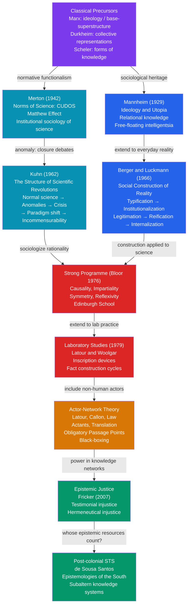

# Sociology of Knowledge and Science

> [!abstract] TL;DR
> The sociology of knowledge and Science and Technology Studies (STS) examine how social contexts, power structures, and community dynamics determine what counts as knowledge, who is authorized to produce it, and how scientific facts are constructed through laboratory work, paradigms, and networks of human and non-human actors — revealing that objectivity is not the absence of the social but a particular, historically achieved social accomplishment.

---

## Intuition

**Analogy:** Consider a courtroom. A piece of evidence does not speak for itself. It requires a witness with the right credentials, a chain of custody document, a forensic protocol the judge accepts, and a jury predisposed to trust certain sources over others. A fingerprint is only evidence if fingerprint analysis is institutionally certified, if the expert presenting it belongs to an accredited laboratory, if the opposing attorney cannot impugn the methodology, and if the twelve jurors have absorbed the cultural assumption that "science" trumps anecdote. Change any of those social conditions — bring the trial to a different era, a different jurisdiction, a different cultural context — and the same fingerprint may or may not become a fact.

Science works the same way. When Latour and Woolgar spent two years inside a Salk Institute endocrinology laboratory in the late 1970s, they watched scientists produce not discoveries but documents: graphs, spectrographs, tables, papers. A statement graduated from tentative claim to established fact as it survived successive rounds of peer scrutiny, replication, citation, and institutional inscription — not because nature simply handed it over, but because a community of practitioners, operating through shared instruments, journals, funding bodies, and professional norms, collectively certified it as real. This is not to say the facts are false; it is to say that their truth is socially produced, maintained, and — occasionally — dismantled.

---

## How It Works



The architecture of the field moves in two directions simultaneously. The *downward* movement — from Mannheim through Berger/Luckmann through the Strong Programme to laboratory studies — progressively extends sociological analysis deeper into the content of scientific knowledge itself, no longer stopping at the social envelope around science but opening the black box of laboratory practice. The *sideways* movement — from ANT through Fricker to post-colonial STS — extends the critical gaze to who counts as a knower and whose knowledge systems are rendered invisible by the global dominance of Western scientific epistemology.

---

## Key Concepts

### Secondary Level

**What Is the Sociology of Knowledge?**

The sociology of knowledge asks a deceptively simple question: does your social position affect what you know and believe? Every major sociological tradition answers yes, but they disagree about the mechanism, the scope, and the consequences.

Whereas epistemology (a branch of philosophy) asks "how do we know anything is true?", the sociology of knowledge brackets that question and asks instead: "what social conditions make it possible for certain ideas to be accepted as knowledge in particular times and places, while other ideas are dismissed, suppressed, or never articulated at all?" The two questions are related but distinct. A sociologist does not need to resolve whether atoms really exist in order to study why atomic theory became institutionally dominant in the late nineteenth century and what social interests were served by its triumph over rival frameworks.

The field has two major tributaries: the *sociology of knowledge* proper, concerned with everyday and intellectual knowledge in general, and *Science and Technology Studies (STS)*, which focuses specifically on scientific knowledge, technology, and their entanglement with society.

**Merton's Norms of Science (CUDOS)**

Robert K. Merton (1942) provided the first systematic sociological analysis of science as a social institution. For Merton, science has a distinctive *ethos* — a set of shared norms that, when followed, produce reliable knowledge. He identified four institutional imperatives, often remembered by the acronym CUDOS:

| Norm | Content | What It Prohibits |
|---|---|---|
| **Communalism** | Scientific findings are common property; results must be shared | Trade secrets; proprietary suppression of data |
| **Universalism** | Truth claims are evaluated on impersonal criteria, regardless of the claimant's race, nationality, religion, or gender | Ad hominem evaluation; national or racial science |
| **Disinterestedness** | Scientists act for the advancement of knowledge, not personal gain | Fraud, fabrication, career-motivated bias |
| **Organized Skepticism** | Claims are subjected to rigorous, communal scrutiny before acceptance | Dogmatism; authority-based acceptance |

Merton was careful to distinguish the *normative* claim (what scientists should do) from the *empirical* claim (what they actually do). The CUDOS norms are aspirational; the sociology of science is partly the study of how and why they are violated, and with what consequences for knowledge production.

**The Matthew Effect**

Merton also identified the **Matthew effect** (1968) — named from the Gospel of Matthew: "to him who has, more shall be given." In science, recognition is allocated according to prior reputation rather than purely on merit. An identical discovery receives more credit when attributed to a Nobel laureate than to an unknown graduate student. Citations cluster around established names. Funding flows toward already-funded laboratories. The cumulative advantage dynamic means that early career accidents — who your supervisor was, which journal first accepted your work — compound over decades into enormous prestige differentials that no longer reflect actual differences in contribution. The Matthew effect is Merton's candid acknowledgment that even the institutional home of organized skepticism is not immune to the sociological dynamics it studies in others.

---

### Undergraduate Level

**Mannheim: Relational Knowledge and the Free-Floating Intelligentsia**

Karl Mannheim's *Ideology and Utopia* (1929) is the founding text of the sociology of knowledge as an explicit discipline. Mannheim distinguished two forms of socially conditioned thought:

| Concept | Definition | Political direction |
|---|---|---|
| **Ideology** | A thought system that serves to maintain the existing social order by distorting or concealing social reality in favor of dominant groups | Conservative, retrospective |
| **Utopia** | A thought system oriented toward a future that transcends and disrupts the existing order | Progressive, prospective |

Both are "situationally determined" — they arise from and serve specific social positions. This was not new with Mannheim; Marx had said as much about ideology. What was new was Mannheim's **total** (vs. particular) conception of ideology and his **relational** (vs. absolute) epistemology.

The **particular conception of ideology** says the opponent is lying or deluded; *my* views are objective. The **total conception** extends suspicion to one's own thought: *all* thought is socially conditioned, including the thought that one's thought is objective. This generates Mannheim's celebrated paradox: if all knowledge is socially conditioned, what is the epistemic status of the sociological claim that all knowledge is socially conditioned?

Mannheim's answer is the concept of **relationalism** (not relativism): knowledge claims are not true or false in absolute terms, but they are not therefore arbitrary — they are always evaluated relative to the social position from which they are produced. Different positions yield different partial perspectives; sociology of knowledge maps those perspectives onto social positions; **synthesis** of multiple partial perspectives is possible and productive.

Who can achieve synthesis? Mannheim's controversial answer: the **free-floating intelligentsia** (*freischwebende Intelligenz*). The educated class, because it is recruited from multiple class positions and trained in multiple conceptual frameworks, is relatively detached from any single class standpoint and thus capable of integrating competing perspectives. Mannheim did not claim the intelligentsia is objective; he claimed it is *relatively* less perspectivally bound than other strata. Critics (including the Frankfurt School) objected that the intelligentsia is not socially unanchored at all — it is deeply embedded in particular class interests, institutional positions, and cultural assumptions it cannot easily see.

**Berger and Luckmann: The Social Construction of Reality**

Peter Berger and Thomas Luckmann's *The Social Construction of Reality* (1966) is the most widely cited work in the sociology of knowledge. Its argument is built across five interlocking processes:

**1. Typification**
Humans do not respond to each situation as entirely novel; they classify — "typify" — situations, actors, and actions into known types. "A police officer," "a doctor's consultation," "paying for groceries" are typifications: internalized scripts for how this kind of thing normally proceeds. Typifications economize cognition but also impose pre-existing social categories on experience.

**2. Institutionalization**
When typifications are reciprocally shared — when A and B both behave according to type, each knowing the other knows the type — the typification becomes an institution. "This is how things are done here." Institutions are habitualized patterns of action that preexist individual actors, confront them as external facts, and resist change. Berger and Luckmann identify three key features: institutions are **historical** (they predate current participants), **objective** (they present themselves as external constraints), and **coercive** (they enforce themselves through sanctions).

**3. Legitimation**
Institutions require justification — "This is not only how things are done, but how they should be done, and here is why." Berger and Luckmann identify four levels of legitimation:

| Level | Content | Example |
|---|---|---|
| Pre-theoretical | Practical maxims; "we have always done it this way" | "You shake hands when you meet someone" |
| Proto-theoretical | Proverbs, folk wisdom; not yet systematic | "Spare the rod, spoil the child" |
| Explicit theory | Differentiated bodies of knowledge; experts and institutions of transmission | Law schools, theology faculties, medical schools |
| Symbolic universe | Integrating legitimations into a totalizing worldview; makes sense of everything including death | Religion, cosmology, political ideology, medical model |

**4. Reification**
The most important sociological concept in Berger/Luckmann: **reification** is the process by which social constructs — historical, contingent, changeable products of human activity — come to be experienced as natural, eternal, or inevitable things. "The market," "gender roles," "race," "the nation," "natural law" are reified when their socially constructed character is forgotten. Reification is the extreme form of objectivation — not merely "this is external to me" but "this could not be otherwise." The sociological task is **de-reification**: recovering the human authorship of social arrangements that present themselves as given.

**5. Internalization**
Socialization is the process by which the institutional order is internalized — taken inside and made part of subjectivity. Primary socialization (childhood) produces the world as "the world"; secondary socialization (adult role acquisition) adds more specific institutional identities. Goffman's observation that people "become" their roles, Cooley's "looking-glass self," Mead's "generalized other" — all are internalization processes. The socialized subject does not merely comply with institutions; they actively reproduce them, often without awareness.

**Kuhn: Paradigms and Scientific Revolutions**

Thomas Kuhn's *The Structure of Scientific Revolutions* (1962) is among the most influential academic books of the twentieth century. Its central claim: scientific development does not proceed by steady accumulation of facts but through periodic, discontinuous **paradigm shifts** triggered by crisis.

| Phase | Description | What scientists do |
|---|---|---|
| **Pre-paradigm** | Multiple competing schools; no consensus framework | Debate fundamentals; argue about basics |
| **Normal science** | Paradigm accepted; research is "puzzle-solving" within it | Extend and refine the paradigm's applications; ignore or explain away anomalies |
| **Anomaly accumulation** | Results that resist assimilation into the paradigm multiply; cannot be indefinitely ignored | Improvise ad hoc patches; note the "anomaly" as a problem for later |
| **Crisis** | Paradigm is visibly strained; alternative models proliferate | Extraordinary research; challenge fundamentals |
| **Revolution** | New paradigm proposed and eventually adopted | Convert to new framework; rewrite the history of the field to make the revolution seem inevitable |
| **New normal science** | New paradigm generates its own puzzle-solving program | Return to ordinary problem-solving within the new framework |

The concept of the **paradigm** is Kuhn's most contested contribution. Kuhn used the term in two senses that Margaret Masterman famously distinguished in 21 incompatible usages: as **disciplinary matrix** (shared symbolic generalizations, models, values, and exemplars) and as **exemplar** (a concrete puzzle-solution — Newton's *Principia*, Darwin's *Origin* — that the community treats as a model for what a scientific solution looks like). The exemplar sense is Kuhn's most original: scientists learn science not primarily by learning rules but by solving worked examples until the correct way of seeing problems becomes automatic — a tacit, embodied competence.

**Incommensurability** is the most philosophically explosive consequence: paradigms before and after a revolution are not simply different theories about the same facts. They redefine what counts as a fact, what counts as a problem, and what counts as a solution. Newtonian and Einsteinian physicists do not mean the same thing by "mass" or "space." This does not mean communication across paradigms is impossible — it means it requires interpretation, not merely translation, and that some things will be systematically lost in the crossing.

---

### Graduate Level

**The Strong Programme: Bloor's Symmetry Principle**

David Bloor's *Knowledge and Social Imagery* (1976) proposed a radical extension of Mertonian sociology of science into the *content* of scientific knowledge itself. Merton had sociologized the *institutions* of science while treating the *content* of successful science as beyond sociology's brief (that was epistemology and history of science's domain). Bloor rejected this division: the sociology of knowledge should explain both true and false beliefs by the same types of cause.

The Strong Programme has four tenets:

| Tenet | Meaning |
|---|---|
| **Causality** | Explanations should identify social causes that produce beliefs |
| **Impartiality** | It should be impartial between true and false, rational and irrational beliefs |
| **Symmetry** | The same types of causes should explain both true and false beliefs — not "social factors caused the error, but the evidence caused the truth" |
| **Reflexivity** | The programme should apply to itself; sociology of knowledge is also socially conditioned |

The **symmetry principle** is the engine of the Strong Programme and its most controversial element. Traditional history and philosophy of science used an asymmetric explanatory strategy: successful science is explained by its rational response to evidence; failed science is explained by bias, ideology, or error. Bloor argued this asymmetry was itself ideological — a way of placing successful Western science beyond sociological scrutiny. If we want a genuine sociology of knowledge, the same social factors — interests, negotiations, laboratory practices, professional networks — must be invoked whether the belief in question later turns out to be "correct" or not.

The Edinburgh School applied this to historical case studies: the controversy between supporters of phlogiston theory and oxygen theory in the late 18th century; the dispute between particle and wave theories of light; the debate over catastrophism and gradualism in geology. In each case, they argued that social interests — professional positioning, institutional affiliations, national scientific cultures — shaped what was seen as evidence and what was dismissed as anomaly.

**Laboratory Studies: Constructing Scientific Facts**

Bruno Latour and Steve Woolgar's *Laboratory Life* (1979) took the sociology of science into its natural habitat. They embedded themselves in Jonas Salk's neuroendocrinology laboratory for two years and applied methods borrowed from anthropological fieldwork to the production of scientific knowledge. What they found challenged the naive picture of science as the passive recording of nature.

Key findings:

**Inscription devices** are all the machines, instruments, and apparatus that transform material substances into written traces — graphs, spectrographs, blots, numbers. Every fact passes through a chain of inscription devices before it reaches the printed page. The sociological point: what counts as data is already a function of which inscription devices the laboratory can afford, maintains, and trusts. Different instruments produce different traces; choices about which traces count are made by scientists operating under social constraints.

**The credit cycle** is the economy that drives scientific work. Scientists invest in research to produce credible claims; credibility, if established, produces recognition; recognition produces access to better equipment, funding, and students; better resources allow more research that produces more credible claims. The credit economy is not separate from the cognitive content of science — it shapes which questions get asked, which anomalies get pursued, and which results get published.

**The construction of facts** proceeds through five stages that Latour and Woolgar mapped:

1. **Speculative claim** — "It might be that..."
2. **Hedged claim** — "Our preliminary data suggest..."
3. **Contested claim** — Literature battle; "X's results cannot be replicated because..."
4. **Established fact** — "It is well established that..."
5. **Taken-for-granted** — The claim disappears from explicit statement and becomes a premise for further research; the footnote citations drop away; the statement has become infrastructure

The reversal of this process — the de-construction of a fact — is what happens when a crisis in Kuhn's sense occurs: the premises are put back on the table for examination.

**Actor-Network Theory**

Latour, Michel Callon, and John Law developed Actor-Network Theory (ANT) from the laboratory studies program. ANT's central move is to extend social analysis beyond the human: non-human entities — instruments, organisms, documents, technologies, money — are treated as **actants** that participate in the production and maintenance of knowledge. A fact is not made by scientists alone; it is made by scientists in alliance with thermometers, petri dishes, funding agencies, journal editors, animal models, and rival laboratories.

Four key ANT concepts:

**Translation** is the process by which one actor transforms and enrolls others into a network, speaking for them, redefining their interests so that the actor's project aligns with those interests. Callon's classic study of scallop fishermen and marine biologists showed how researchers translated the scallops themselves (by treating their behavior as a datum to be explained), the fishermen (by promising that understanding scallop ecology would improve their catch), and the scientific community (by framing the work as fundamental marine biology) into a stable network of aligned interests.

**Obligatory Passage Points (OPPs)** are nodes through which all network actors must pass if the network is to hold. An OPP is a bottleneck that gives the actor who controls it leverage over the entire network. A laboratory that controls the only validated assay for a particular compound becomes an OPP: anyone wanting to work on that compound must pass through, and the laboratory's spokesperson can define what the compound "really" is.

**Black-boxing** occurs when a network has stabilized so thoroughly that its internal workings become invisible. The result is that opening the black box and examining its social construction becomes practically and politically difficult. QWERTY keyboards, the TCP/IP protocol, the BMI measurement, the IQ test — all are black boxes: they were constructed through specific historical negotiations but now present themselves as natural, neutral infrastructure.

**Immutable mobiles** are representations (maps, tables, diagrams, standardized samples) that can travel across networks while maintaining their essential properties. The capacity to produce immutable mobiles — to translate local phenomena into representations that can be checked, compared, and accumulated at a central point — is Latour's explanation for why European science became globally dominant: it produced better immutable mobiles (accurate maps, standardized measurements) that enabled colonial administration, trade, and military operations at a distance.

**Epistemic Justice: Fricker's Two Forms**

Miranda Fricker's *Epistemic Injustice: Power and the Ethics of Knowing* (2007) introduced the concept of **epistemic injustice** — a wrong done to someone specifically in their capacity as a knower. Fricker identifies two primary forms:

**Testimonial injustice** occurs when a listener deflates the credibility of a speaker's testimony due to identity prejudice — typically race, gender, class, or sexuality. The speaker has knowledge, but because of who they are, they are not credited with having it. Fricker's paradigm case: Tom Robinson in *To Kill a Mockingbird*, whose accurate testimony about Mayella Ewell's behavior is systematically discounted because an all-white jury has internalized the stereotype that Black men are not credible witnesses in cases involving white women. Testimonial injustice is pervasive in medical encounters (women's pain reports discounted relative to men's), legal proceedings, psychiatric assessments, and academic peer review.

**Hermeneutical injustice** is structurally deeper: it occurs when a gap in collective interpretive resources puts someone at an unfair disadvantage in communicating their own social experience. Before "sexual harassment" existed as a concept in the 1970s, women who experienced it had the experience but lacked the shared vocabulary to name, communicate, and protest it. The absence of the concept was not random — it reflected the fact that the people who most needed the interpretive resource were systematically excluded from the social institutions (law schools, sociology departments, corporate HR) that produce interpretive resources. Hermeneutical injustice is an injustice of having an experience without the epistemic tools to articulate it socially.

Both forms of epistemic injustice connect STS and sociology of knowledge to the sociology of inequality: who produces knowledge, whose testimony counts as evidence, and whose experience gets theorized are not epistemologically neutral questions but questions shaped by racial, gender, and class power.

**Post-colonial STS and Southern Knowledge**

The most recent expansion of the field challenges the implicit assumption that the sociology of knowledge is a sociology of Western knowledge. Boaventura de Sousa Santos (*Epistemologies of the South*, 2014) argues that the modern world-system has produced an "epistemicide" — the systematic destruction of non-Western knowledge systems through colonialism. Indigenous astronomical knowledge, African medicinal knowledge, and Asian ecological knowledge were either absorbed into Western science on Western terms (losing their original ontological frameworks) or dismissed as superstition.

De Sousa Santos proposes:

- **Sociology of absences**: analyzing what has been rendered invisible, non-existent, or discredited by the dominance of Western epistemological frameworks
- **Sociology of emergences**: recovering and amplifying knowledge practices that exist but are suppressed
- **Ecology of knowledges**: not a relativist abandonment of truth but a pluralist insistence that different knowledge practices — Indigenous, scientific, local, global — can be placed in productive dialogue without one determining the terms of engagement for all others

The practical stake: in debates about climate change, agricultural sustainability, and biodiversity, post-colonial STS argues that excluding Indigenous ecological knowledge from the conversation is not merely politically unjust but epistemically impoverishing — it wastes knowledge that has been refined over millennia of observation.

---

## Python Demo

```python
# Kuhnian Paradigm Shift Dynamics
#
# Simulates a scientific community's response to anomaly accumulation
# using a Kuhnian model:
#   - Normal science: commitment to old paradigm resists conversion
#   - Crisis: anomaly pressure exceeds community inertia threshold
#   - Revolution: stochastic conversion with social contagion
#   - Heatmap: time to 50% paradigm shift as f(anomaly_rate, resistance)
#
# Only numpy and matplotlib used.

import numpy as np
import matplotlib
matplotlib.use("Agg")
import matplotlib.pyplot as plt

RNG = np.random.default_rng(42)

# ── Core model ─────────────────────────────────────────────────────────────

def kuhnian_community(
    n_scientists=80,
    anomaly_rate=0.08,
    resistance=0.65,
    social_contagion=0.30,
    T=300,
):
    """
    Simulate a scientific community's paradigm state over T time steps.

    Each scientist holds commitment c_i to the current paradigm,
    drawn from Beta(alpha, beta_p) parameterized by 'resistance'.
    Higher resistance → distribution skewed toward strong commitment.

    At each time step:
      1. Anomalies accumulate as a Poisson process.
      2. Normalized anomaly pressure = cumulative_anomalies / critical_mass,
         where critical_mass = sum(commitments) captures total community inertia.
      3. Individual conversion probability:
            p_indiv_i = sigmoid(8 * (pressure - c_i))
         Scientists with low commitment convert under low pressure;
         high-commitment holdouts need sustained anomaly accumulation.
      4. Social contagion adds a peer-pressure term:
            p_social = contagion * fraction_already_converted
         This models Kuhn's observation that paradigm shifts accelerate
         once a critical number of converts demonstrate the new paradigm's
         fruitfulness (social proof within the scientific community).
    """
    alpha   = resistance * 10.0
    beta_p  = (1.0 - resistance) * 10.0 + 0.5
    commitments = RNG.beta(alpha, beta_p, size=n_scientists)
    commitments = np.clip(commitments, 0.01, 0.99)

    critical_mass = commitments.sum()   # total inertia of the community

    converted       = np.zeros(n_scientists, dtype=bool)
    anomalies       = 0.0
    history_old     = np.zeros(T)
    history_pressure = np.zeros(T)

    for t in range(T):
        # Anomalies accumulate: each step adds Poisson(rate * N) anomalies
        anomalies += RNG.poisson(anomaly_rate * n_scientists)

        # Pressure: normalized by community's total inertia
        pressure = anomalies / critical_mass

        # Individual sigmoid conversion probability
        logit    = 8.0 * (pressure - commitments)
        p_indiv  = 1.0 / (1.0 + np.exp(-logit))

        # Social contagion: boosts conversion among uncommitted scientists
        convert_frac = converted.mean()
        p_social     = social_contagion * convert_frac

        # Combine: only unconverted scientists can convert
        still_old = ~converted
        p_total   = np.clip(p_indiv + p_social * still_old.astype(float),
                            0.0, 1.0)

        # Stochastic conversion event
        new_converts = still_old & (RNG.random(n_scientists) < p_total)
        converted   |= new_converts

        history_old[t]      = (~converted).mean()
        history_pressure[t] = pressure

    return history_old, history_pressure, commitments


# ── Parameter sweep: time to paradigm shift ─────────────────────────────────

def time_to_shift(anomaly_rate, resistance, threshold=0.50, T=350, trials=4):
    """
    Return mean steps until >threshold fraction has converted.
    Returns T (never shifted within window) if threshold not reached.
    """
    times = []
    for _ in range(trials):
        old, _, _ = kuhnian_community(
            anomaly_rate=anomaly_rate,
            resistance=resistance,
            T=T,
        )
        crossed = np.where(old < (1.0 - threshold))[0]
        times.append(int(crossed[0]) if len(crossed) else T)
    return float(np.mean(times))


# ── Run single detailed simulation ──────────────────────────────────────────

old_frac, pressure, commitments = kuhnian_community(
    anomaly_rate=0.08, resistance=0.65, T=300
)
steps = np.arange(1, 301)

# Identify Kuhnian phase transitions
crisis_idx = np.where(pressure > 0.50)[0]
crisis_t   = int(crisis_idx[0]) + 1 if len(crisis_idx) else None
shift_idx  = np.where(old_frac < 0.50)[0]
shift_t    = int(shift_idx[0]) + 1 if len(shift_idx) else None

# ── Heatmap: time-to-shift over parameter grid ───────────────────────────────

anomaly_rates = np.linspace(0.03, 0.16, 9)
resistances   = np.linspace(0.35, 0.85, 9)
heatmap       = np.zeros((len(resistances), len(anomaly_rates)))

for i, res in enumerate(resistances):
    for j, ar in enumerate(anomaly_rates):
        heatmap[i, j] = time_to_shift(ar, res, T=350, trials=4)


# ── Plotting ──────────────────────────────────────────────────────────────────

fig, axes = plt.subplots(1, 3, figsize=(16, 5))
fig.suptitle("Kuhnian Paradigm Shift Model", fontsize=12, fontweight="bold")

# Panel 1: Commitment distribution across scientists
ax = axes[0]
ax.hist(commitments, bins=20, color="#4a90d9", edgecolor="white", alpha=0.85)
ax.axvline(commitments.mean(), color="#c0392b", lw=2.0, ls="--",
           label=f"mean commitment = {commitments.mean():.2f}")
ax.set_title("Scientist Commitment Distribution\n(resistance = 0.65)", fontsize=10)
ax.set_xlabel("Commitment to Old Paradigm", fontsize=9)
ax.set_ylabel("Number of Scientists", fontsize=9)
ax.legend(fontsize=8)
ax.text(0.05, ax.get_ylim()[1] * 0.88,
        "Low commitment: early adopters\nHigh commitment: holdouts",
        fontsize=7, color="#555555")

# Panel 2: Community dynamics over time
ax   = axes[1]
ax2  = ax.twinx()

ax.plot(steps, old_frac,  color="#2563eb", lw=2.5, label="Old Paradigm Holders")
ax2.plot(steps, pressure, color="#d97706", lw=1.6, ls="--", alpha=0.8,
         label="Anomaly Pressure")

ax.axhline(0.5, color="gray", lw=1, ls=":", alpha=0.6)

if crisis_t:
    ax.axvline(crisis_t, color="#d97706", lw=1.2, ls=":", alpha=0.75)
    ax.text(crisis_t + 2, 0.93, "Crisis", color="#d97706", fontsize=8,
            fontstyle="italic")
if shift_t:
    ax.axvline(shift_t, color="#dc2626", lw=1.5, ls=":", alpha=0.75)
    ax.text(shift_t + 2, 0.80, "Revolution", color="#dc2626", fontsize=8,
            fontstyle="italic")

# Shade phases
ax.axvspan(1, crisis_t or 300, alpha=0.04, color="#2563eb", label="Normal Science")
if crisis_t and shift_t:
    ax.axvspan(crisis_t, shift_t, alpha=0.06, color="#d97706", label="Crisis")
    ax.axvspan(shift_t, 300, alpha=0.06, color="#059669", label="New Normal Science")

ax.set_title("Community Dynamics\nNormal → Crisis → Revolution", fontsize=10)
ax.set_xlabel("Time Step", fontsize=9)
ax.set_ylabel("Fraction Holding Old Paradigm", fontsize=9, color="#2563eb")
ax2.set_ylabel("Anomaly Pressure (anomalies / inertia)", fontsize=9, color="#d97706")
ax.set_ylim(-0.02, 1.05)
ax.set_xlim(1, 300)

h1, l1 = ax.get_legend_handles_labels()
h2, l2 = ax2.get_legend_handles_labels()
ax.legend(h1 + h2, l1 + l2, fontsize=7, loc="upper right")

# Panel 3: Heatmap of time to paradigm shift
ax = axes[2]
im = ax.imshow(
    heatmap,
    aspect="auto",
    origin="lower",
    extent=[anomaly_rates[0], anomaly_rates[-1],
            resistances[0],   resistances[-1]],
    cmap="YlOrRd_r",
    vmin=0,
    vmax=350,
)
cbar = plt.colorbar(im, ax=ax, fraction=0.046, pad=0.04)
cbar.set_label("Steps to 50% Paradigm Shift", fontsize=8)
ax.set_title("Time to Paradigm Shift\n(lighter = faster revolution)", fontsize=10)
ax.set_xlabel("Anomaly Accumulation Rate", fontsize=9)
ax.set_ylabel("Community Resistance", fontsize=9)

plt.tight_layout()
plt.savefig("kuhnian_paradigm_shift.png", dpi=130, bbox_inches="tight")
print("Figure saved: kuhnian_paradigm_shift.png")

# ── Summary output ────────────────────────────────────────────────────────────

print("\n=== Kuhnian Paradigm Shift: Single Run (rate=0.08, resistance=0.65) ===")
print(f"  Crisis onset (pressure > 0.50):    t = {crisis_t if crisis_t else 'N/A'}")
print(f"  Paradigm revolution (>50% shifted): t = {shift_t  if shift_t  else 'N/A'}")
print(f"\n=== Parameter Sweep: Extremes ===")
min_idx = np.unravel_index(np.argmin(heatmap), heatmap.shape)
max_idx = np.unravel_index(np.argmax(heatmap), heatmap.shape)
print(f"  Fastest shift: {heatmap[min_idx]:.0f} steps  "
      f"(rate={anomaly_rates[min_idx[1]]:.2f}, resistance={resistances[min_idx[0]]:.2f})")
print(f"  Slowest shift: {heatmap[max_idx]:.0f} steps  "
      f"(rate={anomaly_rates[max_idx[1]]:.2f}, resistance={resistances[max_idx[0]]:.2f})")

print("""
Sociological interpretation:
  Panel 1: The community is not monolithic — early adopters (low commitment)
            exist alongside hard-core defenders (high commitment). This maps
            to Kuhn's observation that some scientists "see the light" early,
            while established figures often die before converting.
  Panel 2: Normal science is flat (old paradigm stable); anomaly pressure
            builds invisibly; at the crisis point the fraction drops sharply
            as social contagion accelerates conversion — the revolution is fast
            once it starts.
  Panel 3: The heatmap shows the joint effect of anomaly rate and community
            resistance. High anomaly rate + low resistance = rapid revolution.
            High resistance + slow anomaly rate = paradigm persists indefinitely.
            The contour lines are the policy-relevant finding: small increases
            in anomaly accumulation rate disproportionately reduce time-to-shift
            when resistance is already moderate — representing the role of
            replication crises, meta-analyses, and open-science reforms.
""")
```

---

## Real-World Applications

> **Application 1 — Climate Science and Manufactured Doubt:** The IPCC consensus on anthropogenic climate change is a case study in the Strong Programme's symmetry principle applied backwards. Naomi Oreskes and Erik Conway's *Merchants of Doubt* (2010) documented how a small network of physicists-turned-policy-advocates systematically applied the social strategies of scientific controversy — demanding more research, exploiting uncertainty language, challenging modeling assumptions — to manufacture the appearance of scientific debate where scientific consensus existed. The tobacco playbook was reused for acid rain, ozone depletion, and climate change. The sociology of science lesson: the social forms of scientific dispute can be weaponized by actors who never intend to engage with the evidence — because those forms are social conventions, not guarantees of epistemic integrity.

> **Application 2 — The Replication Crisis as Kuhnian Anomaly:** Psychology's replication crisis (2011–present), in which roughly 60% of published findings failed to replicate in the Many Labs and Open Science Collaboration studies, functions as a Kuhnian anomaly. The normal-science response — ad hoc explanations for each failed replication (different samples, slightly different procedures) — eventually became untenable when the failures were systematic. The resulting crisis produced methodological reform proposals (pre-registration, open data, larger N, direct replication) that amount to a paradigm shift in the norms of what counts as publishable psychological science — not in the subject matter but in the epistemic practices of the field.

> **Application 3 — Algorithmic Systems as Black Boxes (ANT + Epistemic Justice):** Modern credit scoring algorithms, predictive policing tools, and recidivism risk instruments are ANT black boxes: stabilized socio-technical networks in which historical data (encoded social inequalities), model architectures, calibration choices, and institutional deployment decisions have been bundled together and are now presented as objective outputs. COMPAS (Correctional Offender Management Profiling for Alternative Sanctions), used in US sentencing decisions, was shown by ProPublica (2016) to falsely flag Black defendants as high-risk at nearly twice the rate of white defendants. This is Fricker's testimonial injustice enacted at industrial scale: the algorithm is credible; the human defendant is not. The "fairness" definition built into COMPAS (equal predictive accuracy across groups) satisfies one formal criterion while violating others (equal false positive rates) — a technical reflection of the underlying social disagreement about what justice requires.

> **Application 4 — The Discovery of TRF and the Credit Economy:** Latour and Woolgar's laboratory study was conducted in Roger Guillemin's endocrinology lab at the Salk Institute, where researchers were racing to isolate and characterize Thyrotropin-Releasing Factor (TRF). The competition for priority — and the Nobel Prize that would eventually reward it — shaped every laboratory practice: which results were communicated, which anomalies buried, which collaborations maintained. The "discovery" of TRF was not a moment but a process, completed only when the scientific community's inscription of TRF as a real molecule became sufficiently stabilized that the Nobel Committee could attribute it to specific individuals. The credit economy was the motor driving the epistemic engine.

> **Application 5 — COVID-19 and Hermeneutical Injustice:** Long COVID — the persistent constellation of fatigue, cognitive impairment, and exercise intolerance in post-infection patients — initially encountered the hermeneutical injustice Fricker describes. The experience existed; the interpretive resource to name and credential it did not. Patients, disproportionately women, reported symptoms that matched no established clinical category and were systematically attributed to anxiety, deconditioning, or malingering. The eventual emergence of "Long COVID" as an ICD-11 diagnosis represented the hermeneutical work of patient advocacy groups, sympathetic clinicians, and eventually large-cohort studies forcing the interpretive gap closed — not by discovering a new disease, but by constructing a new conceptual category that made an existing experience communicable.

---

## Common Pitfalls

- **Conflating social construction with anti-realism** — The most persistent misreading of Berger/Luckmann and Latour is that "socially constructed" means "not real" or "merely subjective." Berger and Luckmann are explicit: objective social facts are real *as* social facts — they genuinely constrain behavior — even though they were created by human activity and could in principle be remade. Latour's laboratory studies do not argue that TRF does not exist; they argue that TRF came to *count as real* through a specific social process. "Socially constructed" is a claim about the *mode of existence* of knowledge claims, not a claim about their ultimate ontological status.

- **Mannheim's paradox mishandled** — Applying the total conception of ideology to itself generates the reflexivity problem: if all knowledge is socially conditioned, so is the sociology of knowledge. The correct response is Mannheim's own: acknowledge the conditionedness, identify the social position of the sociologist of knowledge, and pursue relational rather than absolute knowledge claims. The incorrect response — concluding that since all knowledge is conditioned, all knowledge claims are equally valid — collapses into relativism that the total conception does not entail.

- **Misreading Kuhn as epistemological nihilism** — Kuhn's incommensurability thesis is frequently read as saying "paradigm shifts are irrational jumps, science makes no progress." Kuhn repeatedly denied this. Later paradigms are better than earlier ones at solving certain classes of problems — that is what paradigm shifts mean. Incommensurability means that comparison across paradigms requires interpretation and that some features of the old paradigm are genuinely lost in the shift, not that the new paradigm is not better. Kuhn was a historian of science defending the *rationality* of scientific development against the naive cumulative model, not attacking rationality.

- **Treating CUDOS as descriptive rather than normative** — Merton's norms describe the ideal-typical ethos of modern science, not the actual behavior of scientists. Reward structures in contemporary science actively undermine communalism (patents, trade secrets), universalism (geographic and institutional prestige hierarchies), and disinterestedness (industry funding, publication bias). Using CUDOS as a checklist to evaluate any real scientific institution will always find violations; that is the point — the gap between norm and practice is what the sociology of science studies.

- **Black-boxing ANT to technological determinism** — ANT insists on symmetry between human and non-human actants, but it does not argue that technology determines social outcomes. Networks are always fragile: black boxes can be reopened, translations can fail, obligatory passage points can be bypassed. The collapse of the Betamax standard, the abandonment of nuclear power in Germany, the failure of Google Glass — all show stabilized socio-technical networks being destabilized by shifts in human interests, regulatory decisions, and counter-translations. ANT is anti-determinist in both directions: neither social interests nor technological constraints alone explain socio-technical outcomes.

- **Using epistemic justice as a trump card without structural analysis** — Fricker's framework identifies real wrongs, but "you are committing epistemic injustice" can be deployed to shut down legitimate criticism as readily as it can identify genuine credibility deficits. The distinction that matters is whether the credibility discount tracks identity prejudice (testimonial injustice) or tracks genuine evidential considerations. Making the diagnosis requires structural analysis of who systematically bears credibility deficits in which institutional contexts — not simply the identification that someone's testimony was doubted.

---

## Related Concepts

- [[Classical_Sociological_Theory]] — Marx's base-superstructure model and Durkheim's collective representations are the direct precursors to Mannheim's sociology of knowledge; Weber's analysis of intellectuals and rationalization shapes the sociology of expertise
- [[Conflict_Theory_and_Critical_Theory]] — The Frankfurt School's critique of instrumental reason, Gramsci's hegemony, and Habermas's theory of communicative action all bear directly on how dominant knowledge systems naturalize power; the sociology of science's Strong Programme extends critical theory into the content of science itself
- [[Contemporary_Sociological_Theory]] — Bourdieu's field theory and scientific capital provide the most systematic account of stratification within science; Foucault's power-knowledge and genealogy of disciplines is the background theory for the laboratory studies tradition; Latour's ANT builds on and departs from both
- [[Culture_Norms_Values_and_Ideology]] — Berger and Luckmann's social construction of reality is the micro-sociological complement to Althusser's ISAs and Gramsci's hegemony; reification is the mechanism by which culturally produced norms acquire the appearance of natural law
- [[Sociological_Research_Methods]] — The epistemological debates within STS — about observer effects, the theory-ladenness of observation, and the impossibility of a view from nowhere — directly challenge the positivist model of sociological research; reflexivity as a methodological principle flows directly from Mannheim
- [[Symbolic_Interactionism_and_Microsociology]] — Blumer's symbolic interactionism and Garfinkel's ethnomethodology are the micro-sociological foundations for laboratory studies; the laboratory is a setting for symbolic interaction and practical reasoning under conditions of professional stakes
- [[Race_Ethnicity_and_Racism]] — Post-colonial STS and the concept of epistemicide name the macro-scale destruction of non-Western knowledge systems as a dimension of racial domination; Fricker's testimonial injustice is structurally concentrated along racial lines in legal, medical, and academic institutions
- [[Gender_Sex_and_Patriarchy]] — Feminist standpoint epistemology (Hartsock, Harding, Longino) argues that women's social position generates a distinctive and epistemically advantageous perspective on social reality; the concept of "strong objectivity" — knowing from a social position rather than from nowhere — is a feminist contribution to the Strong Programme
- [[Intersectionality]] — Fricker's hermeneutical injustice is compounded by intersectional identities: the interpretive gap is deepest for those who occupy multiple subordinate social positions simultaneously and whose experiences are therefore least represented in the dominant interpretive frameworks
- [[Technology_AI_and_Politics]] — AI systems are socio-technical networks in the ANT sense; AI governance debates are about who controls the obligatory passage points of digital knowledge infrastructure; Fricker's epistemic injustice framework provides the critical vocabulary for analyzing algorithmic discrimination
- [[AI_Bias_and_Fairness]] — Machine learning bias is the industrialization of testimonial injustice: training data encodes historical credibility differentials; the sociology of knowledge explains why "the data" cannot be value-neutral and why technical fairness definitions cannot substitute for sociological analysis of the social relations they operationalize
- [[Responsible_AI]] — The responsible AI framework — transparency, accountability, explainability, non-discrimination — maps directly onto the CUDOS norms transposed to AI development; the sociology of knowledge asks who defines "responsible" and whose knowledge systems those definitions encode
- [[Cognitive_Biases]] — Confirmation bias, in-group bias, and anchoring are the psychological mechanisms through which community resistance to paradigm shift operates at the individual level; Kuhn's account of normal science's resistance to anomalies is the sociological complement to the cognitive psychology of motivated reasoning

---

## Review Questions

### Secondary

1. A classmate argues: "Science is objective — it just discovers what's already out there in nature. Society has nothing to do with it." Using Merton's CUDOS framework and one example of a norm violation in real science, explain why the statement is partly right and partly wrong. What is the difference between saying "scientific knowledge is socially influenced" and saying "scientific knowledge is therefore unreliable"?

2. Berger and Luckmann argue that all social institutions — from universities to marriage — rest on a foundation of "reification": social constructs that began as human activities have come to feel like natural facts. Choose one institution from your own life and trace the process: what was originally a human choice that became typified, institutionalized, legitimated, and eventually reified? What would it take to de-reify it?

### Undergraduate

3. Mannheim argues that all thought is "situationally determined" by the thinker's social position, and that the free-floating intelligentsia is best positioned to achieve a synthetic understanding. Evaluate this claim using two specific objections: (a) the reflexivity problem — how Mannheim's own theory is situationally determined, and (b) the empirical objection that intellectuals are not socially unanchored but deeply embedded in class-specific institutions, cultures, and interests. How would Mannheim respond?

4. Kuhn distinguishes "normal science" (puzzle-solving within a paradigm) from "revolutionary science" (paradigm shift). Apply this distinction to one of the following: (a) the replication crisis in psychology; (b) the transition from Newtonian to quantum mechanics in physics; (c) the shift from the DSM-III to the DSM-5 in psychiatry. What counts as a "paradigm" in your chosen case? Was there genuine incommensurability between the old and new frameworks, or merely refinement?

5. Latour's Actor-Network Theory insists on treating non-human entities as "actants" in the production of knowledge. Using the example of a specific instrument, organism, or document (a thermometer, a lab rat, a journal review form), trace how that non-human entity shapes what counts as a scientific fact. What would be lost if we removed non-human actants from our sociological account of science?

### Graduate

6. Bloor's symmetry principle holds that the same social causes must explain both true and false beliefs. Critics (e.g., Laudan, Slezak) argue this commits a category error: rational responses to evidence are not social causes and therefore do not need the same explanation as irrational ones. Evaluate the symmetry debate. Does sociologizing scientific reasoning require abandoning the distinction between good and bad epistemic practices, or can a sociology of science acknowledge epistemic normativity while still explaining why particular communities at particular times found certain arguments persuasive?

7. Fricker distinguishes testimonial injustice (speaker's credibility wrongly deflated) from hermeneutical injustice (speaker lacks interpretive resources to articulate experience). Design a concrete institutional intervention to address each type in the following domain: algorithmic risk assessment in criminal sentencing. What structural changes would address testimonial injustice (whose testimony counts as evidence about model performance)? What new conceptual or interpretive resources would address hermeneutical injustice (who gets to name the harm done by a "biased" model)?

8. De Sousa Santos argues that modernity has produced an "epistemicide" — the systematic destruction of non-Western knowledge systems — and proposes an "ecology of knowledges" as the alternative. A critic responds: the ecology of knowledges is romantic anti-modernism that would dissolve the epistemic standards that make reliable scientific inquiry possible. Evaluate this exchange. Is there a defensible middle position between Western scientific universalism (one set of epistemic standards applies everywhere) and Santosian pluralism (all knowledge systems are equally valid in their domains)? What would that position look like institutionally — in science policy, funding, and educational curricula?

---

## Sources

- [Mannheim, K. (1936). *Ideology and Utopia*. Harcourt Brace (orig. German 1929)](https://archive.org/details/ideologyutopia00mann)
- [Berger, P. & Luckmann, T. (1966). *The Social Construction of Reality*. Doubleday](https://www.goodreads.com/book/show/51726.The_Social_Construction_of_Reality)
- [Merton, R.K. (1942). "A Note on Science and Democracy." *Journal of Legal and Political Sociology* 1(1-2), 115–126](https://www.sciencedirect.com/science/article/pii/0048733376900376)
- [Merton, R.K. (1968). "The Matthew Effect in Science." *Science* 159(3810), 56–63](https://doi.org/10.1126/science.159.3810.56)
- [Kuhn, T.S. (1962). *The Structure of Scientific Revolutions*. University of Chicago Press](https://www.goodreads.com/book/show/61539.The_Structure_of_Scientific_Revolutions)
- [Bloor, D. (1976). *Knowledge and Social Imagery*. Routledge & Kegan Paul](https://www.goodreads.com/book/show/1196046.Knowledge_and_Social_Imagery)
- [Latour, B. & Woolgar, S. (1979). *Laboratory Life: The Construction of Scientific Facts*. Sage (2nd ed. Princeton UP 1986)](https://www.goodreads.com/book/show/179015.Laboratory_Life)
- [Callon, M. (1984). "Some Elements of a Sociology of Translation." *Sociological Review Monograph* 32, 196–233](https://doi.org/10.1111/j.1467-954X.1984.tb00113.x)
- [Latour, B. (1987). *Science in Action*. Harvard University Press](https://www.goodreads.com/book/show/179018.Science_in_Action)
- [Fricker, M. (2007). *Epistemic Injustice: Power and the Ethics of Knowing*. Oxford University Press](https://doi.org/10.1093/acprof:oso/9780198237907.001.0001)
- [de Sousa Santos, B. (2014). *Epistemologies of the South: Justice Against Epistemicide*. Paradigm Publishers](https://www.goodreads.com/book/show/20889476-epistemologies-of-the-south)
- [Oreskes, N. & Conway, E.M. (2010). *Merchants of Doubt*. Bloomsbury Press](https://www.goodreads.com/book/show/7799004-merchants-of-doubt)
- [Harding, S. (1986). *The Science Question in Feminism*. Cornell University Press](https://www.goodreads.com/book/show/860344.The_Science_Question_in_Feminism)
- [Open Science Collaboration (2015). "Estimating the Reproducibility of Psychological Science." *Science* 349(6251)](https://doi.org/10.1126/science.aac4716)
- [Masterman, M. (1970). "The Nature of a Paradigm." In Lakatos & Musgrave (Eds.), *Criticism and the Growth of Knowledge*. Cambridge University Press](https://www.worldcat.org/title/criticism-and-the-growth-of-knowledge)

---

#Sociology #AppliedSociology #SociologyOfKnowledge #STS #SocialConstruction
