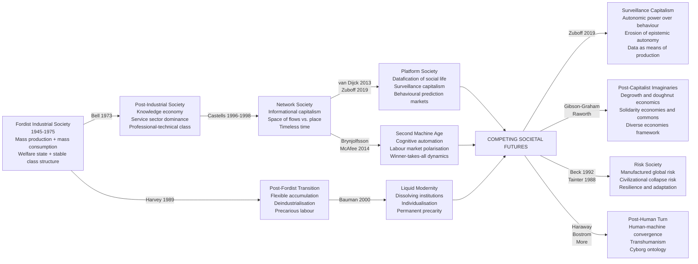

# The Future of Society

> [!abstract] TL;DR
> The sociology of the future asks how post-industrial transformation, digital networks, AI-driven automation, platform capitalism, and civilizational risk are restructuring work, identity, inequality, and governance — and what post-capitalist or post-human alternatives might look like. Five major theoretical traditions map the terrain: Bell's knowledge economy, Castells' network society, Bauman's liquid modernity, Brynjolfsson and McAfee's second machine age (with its labor market polarization), and van Dijck and Zuboff's platform-surveillance capitalism — each diagnosing a different consequence of the same underlying transition away from Fordist industrial society.

---

## Intuition

**Analogy:** Imagine a city that grew up around a single large factory. The factory organized everything: the rhythms of daily life, the neighborhoods where workers lived, the schools that trained their children, the pubs where they drank together, the unions that negotiated their wages, the politics of the town council. The factory gave people not just income but identity — you were a steelworker, a miner, a machinist. The shift pattern told you when to wake up; the pension told you when to die.

Now the factory closes. What replaces it is not another factory but a logistics hub, a call centre, a software startup, a food delivery platform, and a hospital. Some workers retrain. Others drive for Uber. Their children scroll TikTok, worried about climate change and their mortgage prospects. The town council debates whether to build a data centre or a wind farm. Nobody agrees on who they are or what they owe each other anymore.

This is sociological futures theory in miniature. The question is not simply what jobs will exist in 2050 — it is how the dissolution of the Fordist factory, and its replacement by networked, platform, and AI-driven production, is reshaping every social institution, every form of solidarity, every source of identity, and every mechanism of collective risk. The answers are contested: techno-optimists see abundance and liberation; critical theorists see surveillance and precarity; degrowth theorists say the premise is wrong and the planet cannot sustain the question.

---

## How It Works

### Core Mechanics

Sociological futures theory is organized around a shared diagnosis and competing prognoses:

**Shared diagnosis**: The Fordist industrial social formation — mass production + mass consumption + welfare state + stable class identities + nation-state sovereignty — entered structural crisis in the 1970s. Deindustrialisation, financialisation, digital technology, and globalization are the four interlocking drivers of its dissolution. What replaces it is genuinely open — not determined by economic logic but shaped by politics, power, culture, and contingency.

**Five theoretical traditions** then diverge on what the emerging formation looks like and what its dominant logics are:

1. **Post-industrial theory (Bell)**: the organizing principle of society shifts from manufacturing to knowledge; the professional-technical class displaces the industrial working class as the central social actor.
2. **Network society (Castells)**: information technology restructures the architecture of capitalism around networks; the fundamental social cleavage is between those who are connected nodes and those who are switched off.
3. **Liquid modernity (Bauman)**: solid social structures — careers, marriages, class memberships, national identities — dissolve into fluid, temporary, individually negotiated arrangements; freedom and insecurity are two faces of the same transformation.
4. **Second machine age (Brynjolfsson and McAfee)**: AI and robotics extend automation into cognitive work, polarizing labor markets between high-skill complemented workers and low-skill non-routine service workers, while eliminating the middle.
5. **Platform society and surveillance capitalism (van Dijck, Zuboff)**: digital platforms are not neutral infrastructure but governance systems that extract behavioral data, predict and modify human behavior, and accumulate unprecedented asymmetric power.

### Flow / Architecture



---

## Key Concepts

### Secondary Level

**The big question: What kind of society are we becoming?**

Every society in history has been organized around a primary source of economic value: agricultural societies extracted value from land; industrial societies extracted value from factories and physical labor; post-industrial societies extract value from knowledge, information, and services. Daniel Bell (*The Coming of Post-Industrial Society*, 1973) was the first sociologist to systematically describe this transition.

**Bell's post-industrial society in plain terms:**

Bell argued that three shifts were remaking Western societies:

1. *The economy shifts from goods to services*. Instead of most people making physical things (cars, steel, textiles), most people work in education, healthcare, finance, retail, government, and professional services. The UK crossed this threshold in the 1950s; most OECD countries did so by 1980.

2. *Knowledge replaces physical capital as the organizing principle*. The key assets are no longer blast furnaces and assembly lines — they are patents, algorithms, databases, trained professionals, and institutional know-how. Bell coined the term **knowledge economy** to describe a system in which theoretical knowledge generates technical innovation, which generates economic growth.

3. *The professional-technical class becomes dominant*. Engineers, scientists, doctors, lawyers, managers, and professors displace factory workers as the central social actors. Credentials and education replace manual skill and union membership as the pathways to social status.

**Key terms for the sociology of futures:**

| Term | Definition |
|------|------------|
| Post-industrial society | A society whose economy is organized primarily around knowledge, information, and services rather than manufacturing |
| Knowledge economy | An economy in which the generation, distribution, and application of knowledge is the primary driver of growth and wealth creation |
| Network society | Castells' term for a social structure built around digital information networks that reconfigure space, time, and power |
| Liquid modernity | Bauman's term for the contemporary condition in which previously solid social forms — careers, identities, relationships, institutions — become fluid and temporary |
| Datafication | The process by which social activities are converted into quantifiable, storable, and tradeable data |
| Labor market polarization | The simultaneous growth of high-skill, high-wage jobs and low-skill, low-wage jobs, accompanied by the hollowing out of middle-skill, middle-wage jobs |
| Surveillance capitalism | Zuboff's term for a business logic that claims private human experience as raw material for behavioral prediction products sold to advertisers and others |
| Degrowth | A political-economic proposal that argues for deliberately reducing economic throughput to achieve ecological sustainability and social justice |
| Post-humanism | A theoretical position that questions the boundaries between human and machine, nature and technology, the organic and the artificial |
| Risk society | Beck's term for a social formation in which the dominant challenge is managing the unintended manufactured risks generated by modernity itself (nuclear, chemical, climate) |

**Why this matters for everyday life:**

The transitions Bell, Castells, and Bauman describe are not abstractions — they explain why your grandparents had a "job for life" and you have a "career portfolio"; why middle-income manufacturing jobs disappeared while software developer and care worker jobs grew simultaneously; why your Instagram feed knows what you want to buy before you do; why climate change, AI risk, and pandemics feel qualitatively different from older threats.

---

### Undergraduate Level

#### Castells and the Network Society

Manuel Castells' three-volume *The Information Age* (1996–1998) is the most ambitious sociological account of the post-industrial transition. Castells argues that a new social structure — the **network society** — has emerged from the intersection of three independent processes:

**1. The information technology revolution (1970s onwards)**

The microprocessor, the internet, and digital communications did not merely add new tools to existing society — they transformed the *material basis* of social life. Information processing capacity became so cheap and ubiquitous that every domain of social activity — production, trade, communication, governance, culture — was reorganized around digital networks. The crucial distinction for Castells is between *informatization* (using computers as tools within existing organizations) and *informational capitalism* (a new form of capitalism in which the generation and manipulation of information is the primary source of productivity and power).

**2. The rise of the networked enterprise**

The corporate form of the industrial era — the large, vertically integrated firm with a stable workforce organized around a bureaucratic hierarchy — was dismantled and replaced by networks of smaller, specialized firms, subcontractors, and project-based teams connected by information technology. This is not merely Post-Fordist "flexibility" — it is a new organizational logic in which *the network itself*, rather than any node within it, is the unit of competitive advantage. A firm like Apple does not make iPhones — it coordinates a global network of design, manufacturing, logistics, and retail nodes, capturing value through the network architecture it controls.

**3. The emergence of the global economy**

Financial capital, information, and some categories of skilled labor became genuinely global — moving across borders in real time, unconstrained by national regulation. But most people, most communities, and most forms of social life remained local. This is Castells' central spatial contradiction: the **space of flows** (financial capital, media content, elite networks moving in real time across a global infrastructure) came to dominate the **space of places** (specific geographies, local communities, territorial states). The communities that could insert themselves into globally relevant networks prospered; those that could not were "switched off" from the networks of wealth and power.

**The dual labor market consequence:**

Castells identifies a structural division between *core* workers (high-skill, high-value, globally mobile, working in project teams with flexible contracts but high autonomy) and *generic* workers (performing standardized tasks that can be done by anyone anywhere, and thus subject to global wage competition and automation). This is not primarily a matter of individual ability — it is a structural feature of informational capitalism that requires a relatively small number of high-value knowledge workers and a much larger number of interchangeable, substitutable workers.

#### Bauman's Liquid Modernity

Zygmunt Bauman (*Liquid Modernity*, 2000; *The Individualized Society*, 2001) offered the complementary cultural diagnosis. Where Castells focused on structural transformation, Bauman focused on what structural transformation *feels like from the inside* — the experiential texture of living in a society that no longer offers solid moorings.

**The metaphor**: In the "solid" phase of modernity (the industrial era), social forms were durable, predictable, and constraining. You were born into a class, trained for a trade, joined a union, married your neighbor, retired on your firm's pension, and identified with your nation. These structures were experienced as both oppressive (you couldn't easily leave them) and supporting (you couldn't easily fall through them either). Liquid modernity dissolves these structures. The same forces that liberate — freedom to reinvent your career, your location, your relationships, your identity — simultaneously withdraw the social scaffolding that made long-term planning and collective solidarity possible.

**Key dimensions of liquid modernity:**

| Dimension | Solid phase (industrial) | Liquid phase (post-industrial) |
|-----------|--------------------------|--------------------------------|
| Work | Stable employment, career ladders, defined-benefit pensions | Portfolio careers, gig work, skill obsolescence, personal branding |
| Identity | Class, occupation, union membership, national belonging | Reflexive self-construction, lifestyle choice, consumption-based identity |
| Community | Neighborhood, workplace, church — inherited, long-lasting | Elective, temporary, mediated through platforms — "cloakroom communities" |
| Risk | Collective, managed by welfare state and unions | Individualized — your unemployment, your health, your retirement, your responsibility |
| Time | Long-term — five-year plans, thirty-year mortgages, lifetime careers | Short-term — projects, contracts, episodes; "no long-term commitment" |

**The individualization trap**: Bauman draws on Beck and Beck-Gernsheim's concept of *individualization* — the structural process by which individuals are released from traditional class and family ties, but simultaneously made responsible for managing risks that were previously managed collectively. The freedom is real but asymmetric: elites can exploit fluidity to accumulate advantage across multiple contexts; the precariat experiences the same fluidity as permanent insecurity with no safety net.

#### The Second Machine Age: Automation and Labor Market Polarization

Erik Brynjolfsson and Andrew McAfee (*The Second Machine Age*, 2014) synthesized the economic literature on automation's distributional consequences. Their core claim: digital technologies are general-purpose technologies that, unlike previous waves of automation (which substituted for physical labor), substitute for *cognitive* labor — creating fundamentally new distributional dynamics.

**The task-based model (Autor, Levy and Murnane, 2003)**:

Jobs are bundles of tasks. Not all tasks are equally automatable. The key distinction:

- **Routine tasks** (cognitive and manual): tasks that can be specified by explicit rules — clerical data processing, bookkeeping, assembly-line work, sorting. These are highly automatable because the rule can be programmed.
- **Non-routine cognitive tasks**: tasks requiring judgment, creativity, pattern recognition, persuasion, expert knowledge application — not easily reduced to explicit rules. Technology tends to *complement* these, raising productivity.
- **Non-routine manual tasks**: tasks requiring fine motor skill, situational judgment, and physical adaptability in unstructured environments — cleaning, care work, artisanal trades, driving (until recently). Harder to automate not because they require intelligence but because they require embodied, adaptive physical skill.

**The polarization prediction**:

As automation sweeps through routine tasks, middle-skill, middle-wage jobs (bank clerks, factory operatives, data entry workers, bookkeepers) are eliminated. High-skill cognitive workers are complemented by technology and see productivity and wages rise. Low-skill non-routine service workers cannot be automated (yet) but face downward wage pressure from displaced routine workers flooding into the only remaining sector. The labor market *hollows out in the middle* — producing what Goos and Manning (2007) called the growth of "lousy and lovely jobs."

**Winner-takes-all dynamics**:

Brynjolfsson and McAfee also identify a superstar phenomenon: in digitally mediated markets, small advantages in quality or reputation are amplified across global markets, concentrating rewards in a tiny elite. The best lawyer, the best programmer, the best musician can serve a global market; the second-best competes for the residual. This is not primarily a technology story — it is a consequence of zero marginal cost reproduction of digital goods — but it has profound distributional consequences.

#### Platform Society and Surveillance Capitalism

José van Dijck (*The Platform Society*, 2018) argues that social media and digital platforms are not merely communication tools — they are the infrastructure of contemporary social life, reshaping how families connect, how news is distributed, how markets clear, how public services are delivered, and how citizens relate to each other and to the state. The platform society is characterized by:

- **Datafication**: the conversion of social interaction into data — every click, purchase, location, relationship, and behavior is recorded, stored, and analyzed. This is not merely a privacy issue; it is a transformation in the nature of social knowledge and social power.
- **Commodification**: the data produced by social interaction is commercialized — sold to advertisers, insurers, political campaigns, and governments. Social relationships become raw material for commercial extraction.
- **Selection**: algorithms determine what information reaches whom, shaping the information environment within which people form beliefs, make decisions, and construct identities.

Shoshana Zuboff (*The Age of Surveillance Capitalism*, 2019) extends this analysis into a theory of a new form of capital accumulation: **surveillance capitalism** claims private human experience as free raw material for behavioral prediction products. The logic is not merely to monitor human behavior but to *modify* it — to use predictive analytics to intervene in behavior in ways that steer it toward outcomes valuable to customers (advertisers, political campaigns, insurers). Zuboff argues this constitutes a fundamentally new form of power — not disciplinary power (which requires compliance) but *instrumentarian* power (which bypasses human will by modifying the informational environment within which choices are made).

---

### Graduate Level

#### Post-Humanism and the Sociology of Human-Machine Convergence

The post-human turn in social theory (Donna Haraway, N. Katherine Hayles, Bruno Latour, Karen Barad) challenges the foundational assumption of classical sociology: that the social is a distinctly *human* domain. As technology augments, modifies, and increasingly constitutes human capacities, the boundary between "the human" and "the machine" becomes analytically unstable.

**Haraway's cyborg**: Donna Haraway's *A Cyborg Manifesto* (1985) offered a feminist critique of the human-machine boundary. The cyborg — a hybrid of organism and machine — was not a dystopian warning but an *emancipatory figure*: by blurring the distinction between natural and artificial, it destabilized the nature-culture, male-female, white-other dualisms on which oppressive social arrangements depended. This was not futurology but a critical-theoretical intervention: the argument that technoscience was already dissolving the ontological categories on which existing hierarchies depended.

**Transhumanism and its sociological critics**: The transhumanist movement (Nick Bostrom, Ray Kurzweil, Max More) argues that technology should be deliberately deployed to enhance human capacities — intelligence, lifespan, emotional regulation, physical capability — beyond current biological limits. The sociological critique is distributive: enhancements available only to the wealthy will produce new forms of *bio-stratification* — a social hierarchy in which the enhanced elite differs not merely in wealth and status but in cognitive capacity, health, and lifespan. The enhanced and the unenhanced may eventually constitute quasi-different species with radically different life prospects — a sociological catastrophe with no historical precedent.

**Actor-Network Theory (Latour and Callon)**: The broader posthumanist current in sociology treats technology not as a tool used by pre-existing social actors but as an *actant* — a participant in the social networks through which the world is ordered. The algorithm that routes Uber drivers is not a passive instrument of corporate strategy; it actively constitutes the employment relationship, the wage, the disciplinary regime, and the power asymmetry between platform and worker. Sociological analysis must follow the network, not assume that human intention fully explains social outcomes.

**AGI and sociological futures**: The prospect of artificial general intelligence — a system with human-level or above-human cognitive capability across domains — poses questions that mainstream sociological theory has not adequately confronted. If AGI systems become the primary agents of economic production, knowledge generation, and decision-making, existing theories of labor, power, stratification, and governance — all premised on human social actors — require fundamental reconstruction. The sociology of AI (currently focused on algorithmic bias, labor displacement, and surveillance) may be insufficient for a transition of that magnitude.

#### Degrowth and Post-Capitalist Imaginaries

J.K. Gibson-Graham (*A Postcapitalist Politics*, 2006) argued that the left's fixation on critiquing capitalism's dominance was itself politically paralyzing — it made capitalism seem total, impervious, and without alternative. Their "diverse economies" framework drew attention to the *actually existing* non-capitalist economic practices hidden in plain sight: cooperatives, commons, gift economies, volunteer labor, subsistence production, community land trusts. The project was not utopian fantasy but empirical mapping of economic diversity that capitalism's hegemonic self-presentation obscured.

**Degrowth**: The degrowth movement (Serge Latouche, Tim Jackson, Giorgos Kallis) challenges the deepest assumption shared by mainstream economics, post-industrial theory, and techno-optimism alike: that growth in GDP is a social good and policy goal. The ecological critique is empirical — continuous economic growth in a biophysically finite system is impossible and is already producing ecological catastrophe. The sociological critique is deeper: GDP growth measures throughput, not wellbeing; it counts pollution cleanup as growth; it is indifferent to distribution; it is historically correlated with declining social connection, increasing work hours, and rising anxiety. Kate Raworth's *Doughnut Economics* (2017) reformulates the goal: not "how do we grow?" but "how do we thrive within planetary boundaries?"

The sociological implication: a post-growth society would require fundamental reorganization of work (decoupling identity and social contribution from paid employment), of time (shorter work weeks, more care time, more civic time), of property (more commons, fewer intellectual property monopolies), and of politics (democratic governance of production decisions currently left to capital).

**Solidarity economy and commons**: Elinor Ostrom's work on the governance of the commons showed that collective resources can be sustainably managed outside both market and state, through community institutions with polycentric governance. The internet, open-source software, and Wikipedia are contemporary commons that challenge the assumption that non-proprietary resources must be either under-provided or degraded. The question for sociological futures is whether commons-based production can scale beyond digital goods into material production, care, and energy.

#### Risk Society, Catastrophe Sociology, and Civilizational Resilience

Ulrich Beck (*Risk Society*, 1992) argued that late modernity is characterized by a new relationship to risk. Industrial society produced *external* risks — natural disasters, poverty, disease — and managed them through insurance, welfare states, and technical expertise. **Risk society** produces *manufactured risks* — nuclear contamination, chemical pollution, climate change, pandemic disease, algorithmic bias — generated by the same industrial and technological processes that were supposed to produce security. Manufactured risks have four distinctive features:

1. **Non-boundedness**: they respect no national boundaries, class boundaries, or temporal limits
2. **Invisibility**: they cannot be perceived by the senses but require expert measurement
3. **Irreversibility**: once certain thresholds are crossed, damage cannot be undone
4. **Reflexivity**: they are produced by the same institutions (science, industry, the state) tasked with managing them — creating a fundamental legitimacy crisis

**The sub-politics of risk**: Beck argues that manufactured risks generate new political conflicts that cut across traditional class lines. Climate change endangers wealthy and poor alike (though unequally). The distribution of risk becomes as politically contentious as the distribution of wealth — producing a new form of politics that operates outside traditional party and union structures.

**Collapse sociology**: Joseph Tainter (*The Collapse of Complex Societies*, 1988) analyzed the archaeological and historical record of civilizational collapse. His thesis: complex societies invest increasing resources in administrative, military, and technical complexity to solve successive problem waves; at some point, the marginal return on complexity investment turns negative — complexity costs more to maintain than it produces in problem-solving capacity. Collapse (a rapid reduction in complexity) becomes the *efficient* solution to an unsustainable cost structure. The sociological question for contemporary industrial civilization is whether current complexity trajectories are approaching Tainter's threshold.

**Resilience thinking**: The ecological literature on resilience (Holling, Walker, and Gunderson's *Panarchy*) has been incorporated into social theory as an alternative to linear progress narratives. Resilient social systems have adaptive capacity — the ability to absorb shocks and reorganize while maintaining function. But "resilience" has also been criticized as a depoliticizing concept: it asks individuals and communities to adapt to risks that structural analysis would trace to specific economic and political choices, substituting personal coping capacity for structural transformation.

#### Futures Methodology in Sociology

How do sociologists study the future? The future is not directly observable, making it methodologically unique. Key approaches:

**Sociological imagination and backcasting**: C. Wright Mills' *sociological imagination* — the ability to connect personal troubles to public issues, and present conditions to historical trajectories — is the foundational capacity for futures analysis. Backcasting (rather than forecasting) begins by specifying a desirable future state and works backward to identify the policy and structural changes required to reach it.

**Scenario planning**: Developed by Royal Dutch Shell in the 1970s, scenario planning creates a small set of plausible, divergent future scenarios (typically 2x2 matrices defined by two key uncertainties) and stress-tests strategic decisions against all scenarios. The sociological contribution is to incorporate social, cultural, and political dynamics (not merely economic and technical variables) into scenario construction.

**Delphi method**: A structured iterative process in which expert judgments are collected, aggregated anonymously, and fed back to participants who revise their estimates in light of the group's collective assessment. Multiple rounds reduce variance and surface hidden consensus. Used in technology foresight, public health planning, and policy scenario development.

**Causal Layered Analysis (Inayatullah, 1998)**: A post-structuralist futures methodology that analyzes social phenomena at four levels — litany (surface events), systemic causes, worldview (deep cultural assumptions), and myth-metaphor (the narrative archetypes organizing social reality). The point is that futures change requires transformation at all four levels, not merely policy adjustment at the litany level.

**The Futures Cone**: A visual tool representing the expanding range of possible futures — from the *probable* (extrapolation of current trends) through the *plausible* (consistent with known laws and dynamics) to the *possible* (requiring changes in deep structure) to the *preferable* (normatively desired). Sociological futures work operates primarily in the plausible-to-possible range.

---

## Python Demo

```python
import numpy as np
import matplotlib.pyplot as plt

# ---------------------------------------------------------------
# Labor Market Polarization Under Automation
# (After Brynjolfsson & McAfee 2014; Autor, Levy & Murnane 2003)
#
# Four task categories in the labor market:
#   1. Non-routine cognitive  (high-skill) — management, programming, creativity
#   2. Routine cognitive      (middle-skill) — clerical, bookkeeping, data entry
#   3. Routine manual         (middle-skill) — assembly, sorting, machine operation
#   4. Non-routine manual/service (low-skill) — care, cleaning, hospitality
#
# Automation substitutes for routine tasks (2 & 3) at increasing rates.
# Non-routine cognitive is complemented by technology (wages rise).
# Non-routine manual is hard to automate — but absorbs displaced routine workers,
# suppressing wages through oversupply.
#
# Result: bimodal "hollowing out" — middle-skill employment collapses while
# high-skill and low-skill shares both grow, driving wage divergence.
# ---------------------------------------------------------------

rng = np.random.default_rng(2026)
T = 30   # years of simulation
years = np.arange(T + 1)

# Initial employment shares (approximate OECD baseline ~2000)
emp_0 = np.array([0.25, 0.25, 0.25, 0.25])

# Annual automation displacement rate for each category
# High for routine categories; low for NR categories
auto_rate = np.array([0.003, 0.024, 0.021, 0.004])

# Initial wage index (NR cognitive = 2.5x the routine baseline of 1.0)
wage_0 = np.array([2.5, 1.0, 0.9, 0.7])

# Annual wage growth rates
# NR cognitive benefits from tech complementarity; routine wages decline;
# NR service wages decline due to oversupply of displaced workers
wage_growth = np.array([0.022, -0.005, -0.008, -0.003])

emp = np.zeros((T + 1, 4))
wages = np.zeros((T + 1, 4))
emp[0] = emp_0.copy()
wages[0] = wage_0.copy()

for t in range(1, T + 1):
    prev = emp[t - 1].copy()
    # Automation removes jobs from routine categories
    delta = -auto_rate * prev
    # NR cognitive generates new tasks as technology expands the frontier
    delta[0] = auto_rate[0] * 0.4
    # Displaced routine workers flow into NR service (no other large absorber)
    displaced = -(delta[1] + delta[2])
    delta[3] += displaced * 0.65     # 65% absorbed into low-skill service
    # 35% exit labor force or remain unemployed (not modeled separately here)
    new_emp = np.clip(prev + delta, 0.01, None)
    emp[t] = new_emp / new_emp.sum()  # keep shares summing to 1

    # Wage evolution
    new_wages = wages[t - 1] * (1.0 + wage_growth)
    # Additional wage suppression in NR service from influx of displaced workers
    oversupply_pressure = (emp[t, 3] / emp_0[3] - 1.0) * 0.005
    new_wages[3] *= max(1.0 - oversupply_pressure, 0.97)
    wages[t] = new_wages

labels = [
    "Non-routine cognitive\n(high-skill)",
    "Routine cognitive\n(middle-skill)",
    "Routine manual\n(middle-skill)",
    "Non-routine manual/service\n(low-skill)",
]
colors = ["#1d4ed8", "#d97706", "#dc2626", "#059669"]

fig, axes = plt.subplots(1, 3, figsize=(17, 6))
fig.suptitle(
    "Labor Market Polarization Under Automation\n"
    "Brynjolfsson & McAfee (2014) Second Machine Age — Task Model",
    fontsize=12, fontweight="bold",
)

# Panel 1: Employment share trajectories
ax1 = axes[0]
for i in range(4):
    ax1.plot(years, emp[:, i] * 100, color=colors[i], lw=2.5,
             label=labels[i].replace("\n", " "))
ax1.set_xlabel("Years from baseline", fontsize=9)
ax1.set_ylabel("Employment share (%)", fontsize=9)
ax1.set_title("Employment Share by Task Type\n(Middle hollows out)", fontsize=10, fontweight="bold")
ax1.legend(fontsize=7.5)
ax1.grid(True, alpha=0.25)

# Panel 2: Wage index trajectories
ax2 = axes[1]
for i in range(4):
    ax2.plot(years, wages[:, i], color=colors[i], lw=2.5,
             label=labels[i].replace("\n", " "))
ax2.set_xlabel("Years from baseline", fontsize=9)
ax2.set_ylabel("Wage index (routine baseline = 1.0)", fontsize=9)
ax2.set_title("Wage Index by Task Type\n(Divergence widens)", fontsize=10, fontweight="bold")
ax2.legend(fontsize=7.5)
ax2.grid(True, alpha=0.25)

# Panel 3: Employment distribution snapshots — visualizing bimodal hollowing
ax3 = axes[2]
skill_x = np.array([0.85, 0.55, 0.35, 0.15])
bar_w = 0.055
snap_years_list = [0, 15, 30]
snap_colors = ["#94a3b8", "#6366f1", "#0f172a"]
snap_labels_list = ["Year 0", "Year 15", "Year 30"]
offsets = [-bar_w, 0.0, bar_w]

for k, (t_s, sc, sl) in enumerate(zip(snap_years_list, snap_colors, snap_labels_list)):
    ax3.bar(skill_x + offsets[k], emp[t_s] * 100, width=bar_w * 0.88,
            color=sc, alpha=0.88, label=sl, edgecolor="white", linewidth=0.4)

ax3.set_xticks(skill_x)
ax3.set_xticklabels(
    ["High\nskill\n(NR cog.)", "Mid\n(R cog.)", "Mid\n(R manual)", "Low\nskill\n(NR svc.)"],
    fontsize=8,
)
ax3.set_xlabel("Task category by skill level", fontsize=9)
ax3.set_ylabel("Employment share (%)", fontsize=9)
ax3.set_title("Employment Distribution at Three Points:\nBimodal Polarization Over Time", fontsize=10, fontweight="bold")
ax3.legend(fontsize=8.5)
ax3.grid(True, alpha=0.25, axis="y")

plt.tight_layout()
plt.savefig("labor_market_polarization.png", dpi=150, bbox_inches="tight")
plt.show()

print("Employment Share Summary")
print(f"{'Category':<30} {'Year 0':>8} {'Year 15':>10} {'Year 30':>10}")
print("-" * 63)
short_labels = ["Non-routine cognitive", "Routine cognitive", "Routine manual", "NR manual/service"]
for i, lbl in enumerate(short_labels):
    print(f"{lbl:<30} {emp[0,i]*100:>7.1f}%  {emp[15,i]*100:>8.1f}%  {emp[30,i]*100:>8.1f}%")

print("\nWage Index Summary")
print(f"{'Category':<30} {'Year 0':>8} {'Year 15':>10} {'Year 30':>10}")
print("-" * 63)
for i, lbl in enumerate(short_labels):
    print(f"{lbl:<30} {wages[0,i]:>8.2f}  {wages[15,i]:>9.2f}  {wages[30,i]:>9.2f}")
```

**What the simulation shows.** Starting from equal employment shares across all four task categories, automation depletes routine cognitive and routine manual jobs over 30 years, pushing displaced workers into non-routine service. Non-routine cognitive employment grows modestly (new task creation) but wages rise sharply (technology complementarity). Non-routine service employment grows significantly but wages stagnate or fall (oversupply pressure). The wage ratio between high-skill and low-skill workers widens from approximately 3.5x to above 4.5x. The employment distribution shifts from a uniform four-bar histogram to a bimodal shape — visible in Panel 3 — with the two middle bars shrinking while the high-skill and low-skill bars grow. This is the "hollowing out of the middle" that Goos and Manning's empirical work documented in the UK and OECD data has confirmed across most advanced economies.

---

## Real-World Applications

> **The UK labor market 1979–2023 (Polarization):** Goos and Manning (2007) documented the growth of both "lovely" jobs (high-skill professional and managerial occupations) and "lousy" jobs (low-skill personal service work) in the UK between 1975 and 1999, with a marked decline in routine middle-skill occupations. Subsequent OECD analysis confirmed this pattern across most member states. The US Bureau of Labor Statistics' occupational employment data show that the 10 fastest-growing occupations by volume between 2020 and 2030 are concentrated at the two ends of the skill distribution: software developers and data scientists at the high end; home health aides, restaurant workers, and warehouse operatives at the low end. The middle has not recovered from the automation wave of the 1990s–2010s; the AI-driven automation wave of the 2020s extends the same dynamic into professional knowledge work.

> **Amazon's supply chain and Bell's knowledge economy (inverted):** Bell predicted that the knowledge economy would be led by professionals and technocrats generating value through expertise. Amazon's model partially confirms and partially inverts this: the value-generating core (algorithms, logistics optimization, cloud infrastructure, market intelligence) is indeed a knowledge economy in Bell's sense — a small, highly educated professional class generating most of the firm's value. But it is supported by a mass workforce of warehouse operatives, delivery drivers, and customer service workers performing exactly the routine physical and cognitive tasks the task model predicts as most vulnerable to automation. Amazon's warehouses are already partially automated; the Digit humanoid robot (tested from 2023) is explicitly targeted at full automation of its warehouse operations. Bell's knowledge economy and Braverman's deskilling thesis operate simultaneously within the same firm.

> **Meta and Alphabet as van Dijck's Platform Society:** Facebook, Instagram, WhatsApp, YouTube, and Google Search are not, in van Dijck's analysis, primarily communication or search tools — they are behavioral data extraction infrastructure. Every post, search, click, and location ping is converted into training data for behavioral prediction models. Zuboff's surveillance capitalism logic is operationalized in the auction system that sells targeting parameters to advertisers: the product is not the post or the search result but the *predicted behavior* of the user — their probability of buying a specific product, voting for a specific candidate, or developing a specific belief. The political economy of this system produces outcomes that are not incidental failures of content moderation but structural features of an extractive business model: attention maximization as the objective function systematically rewards outrage, tribalism, and radicalization.

> **Finland and the UBI Experiment (Post-work futures):** Finland's 2017–2018 basic income experiment provided 2,000 unemployed citizens with an unconditional monthly payment of €560, replacing their unemployment benefit. Results: recipients reported better mental health, higher wellbeing, and slightly higher employment rates than the control group — contrary to the assumption that unconditional income reduces work incentives. Bauman's liquid modernity framework interprets this as a partial correction of individualized risk: by providing an unconditional floor, UBI restores some of the collective security that dissolution of the welfare state withdrew, without reimposing the bureaucratic conditionality of means-tested benefits.

> **The Zapatistas and Gibson-Graham's diverse economies:** When the EZLN (Zapatista Army of National Liberation) declared war on NAFTA in Chiapas, Mexico on 1 January 1994, they simultaneously initiated a decades-long experiment in indigenous autonomous governance. Zapatista communities operate cooperatives, communal healthcare and education systems, and democratic governance outside the state — a real-world instantiation of Gibson-Graham's diverse economies framework. They are not post-capitalist in the sense of having abolished market exchange; they are post-capitalist in the sense of embedding market activity within communal governance structures that prevent capital from capturing community resources. The experiment has survived 30 years of state repression and market pressure — a fact that "impossible" post-capitalist imaginaries cannot easily dismiss.

---

## Common Pitfalls

- **Technological determinism** — treating digital technology as an autonomous force that produces fixed social outcomes regardless of political and institutional context. Technology shapes possibilities; institutions determine which possibilities are actualized and how their benefits and costs are distributed. Germany and the UK faced the same automation technologies in the 2000s–2020s; their different labor market institutions (codetermination versus shareholder primacy) produced different distributional outcomes. See [[Work_Organizations_and_Bureaucracy]] for the comparative evidence.

- **Conflating the post-industrial with the post-work** — Bell's post-industrial society is an economy in which the *primary sector* is services and knowledge, not one in which work disappears. Most people in post-industrial societies work very long hours. The question of whether AI-driven automation will produce genuine mass unemployment or merely restructure work is empirically contested; presenting either scenario as certain oversteps the evidence.

- **Treating liquid modernity as universal** — Bauman's diagnosis is primarily about the experience of middle-class, post-industrial workers in wealthy OECD societies. For the majority of the global workforce — in manufacturing export zones in Bangladesh, agricultural labor in sub-Saharan Africa, or domestic service in Gulf states — the relevant sociological framework is still closer to Wallerstein's world-systems theory than Bauman's liquid modernity. Global inequality means that post-industrial theory describes one stratum of a deeply unequal world system.

- **Surveillance capitalism as conspiracy** — Zuboff's framework is sometimes read as attributing the outcomes of platform capitalism to the intentional designs of specific executives. The stronger version of her argument is structural: the behavioral modification logic is an emergent property of the advertising business model in digitally mediated environments. Individual corporate decisions reinforce and elaborate this logic, but no single decision-maker designed the surveillance apparatus — it arose from the incentive structure of the attention economy. The policy implication is structural regulation, not individual accountability.

- **Degrowth as primitivism** — degrowth is frequently caricatured as a demand for return to pre-industrial poverty. The economic degrowth literature (Raworth, Kallis, Hickel) argues for reducing *throughput* — material and energy consumption — not for reducing wellbeing. High-wellbeing outcomes (life expectancy, education, social connection, subjective wellbeing) can be achieved at much lower levels of material consumption than current OECD averages, as the performance of Costa Rica, Cuba, and Kerala (India) on wellbeing metrics relative to GDP illustrates.

- **Beck's risk society as fatalism** — Beck's manufactured risk concept does not imply that risks are unmanageable or that collapse is inevitable. It implies that risk management requires *reflexive modernization* — the institutional capacity to question and reform the modernization processes that generate risks. The climate transition, if achieved, would be the largest instance of reflexive modernization in history: industrial civilization deliberately restructuring itself to eliminate the catastrophic risk its own growth has generated.

- **Futures methodology as prediction** — scenario planning and Delphi methods do not produce predictions; they produce *structured uncertainty* — a mapping of the plausible possibility space. Treating scenario outputs as forecasts is a category error that discredits the methodology when scenarios fail to materialize. The value of futures methodology is in improving present decisions under uncertainty, not in predicting specific outcomes.

---

## Related Concepts

- [[Contemporary_Sociological_Theory]] — Bauman's liquid modernity and Giddens' reflexive modernization are treated in full there; the post-structuralist and postmodern currents that shaped post-humanist theory are also covered; this note extends their insights into applied futures contexts
- [[Work_Organizations_and_Bureaucracy]] — the detailed sociology of automation, platform capitalism, gig economy, and labor market polarization; the Fordism-to-Post-Fordism transition that is the structural background to all futures theory; Frey and Osborne's 47% automation estimate is discussed in depth there
- [[Social_Class_and_Stratification]] — post-industrial society transforms class structure (Bell's professional-technical class; the precariat as a new formation); understanding futures requires understanding how stratification systems are being reconstructed around knowledge, credentials, and network position
- [[Global_Inequality_and_Development]] — network society and platform capitalism operate globally but unevenly; the "switched off" populations in Castells' framework overlap substantially with the global South; development sociology frames the inequality dimensions of digital futures
- [[Social_Movements_and_Revolution]] — social responses to the futures described here: climate movements, labor movements for gig worker rights, digital rights movements, degrowth movements; Castells' own analysis of networked social movements is the bridge between the two notes
- [[Media_Culture_and_Cultural_Industries]] — the cultural industries dimension of platform society; datafication transforms culture into extractable resource; the attention economy and its effects on public discourse
- [[Technology_AI_and_Politics]] — AI governance, digital authoritarianism, electoral interference, and the political consequences of surveillance capitalism; the state dimension of what is here analyzed as economic and social transformation
- [[The_Future_of_Global_Order]] — the geopolitical dimension of futures: US-China competition over AI and semiconductor supply chains, the relationship between technological power and geopolitical order, multipolarism and the network society
- [[Globalization_and_Its_Discontents]] — the globalization that created the network society is now generating a backlash; the interaction between technological globalization and political nationalism is one of the central dynamics of sociological futures
- [[Climate_Politics_and_Environmental_Governance]] — the intersection of degrowth theory with climate governance; Beck's risk society applied to its most consequential manufactured risk; the political economy of the green transition
- [[Welfare_States_and_Social_Policy]] — UBI debates, social protection for gig workers, retraining policy — the institutional responses to automation and labor market polarization that determine whether technological change is socially managed or simply imposed
- [[Technological_Progress]] — the macroeconomic treatment of total factor productivity, the Solow residual, and endogenous growth theory; the economic growth framework within which automation's macroeconomic consequences are analyzed
- [[Development_Economics]] — the poverty trap and structural transformation literature in development economics frames how lower-income countries navigate the post-industrial transition with different institutional endowments
- [[Unemployment]] — the macroeconomic measurement and theory of unemployment; the sociological futures question of whether automation produces structural unemployment or merely restructures occupational distribution
- [[AI_Agents_Overview]] — the AI infrastructure driving the second machine age; autonomous agents as the technical realization of cognitive automation at scale; the connection between LLM capability development and labor market displacement
- [[Sociological_Research_Methods]] — futures methodology (scenario planning, Delphi, causal layered analysis) is a specialized application of the broader sociological research repertoire; epistemological debates about studying the future connect to broader debates about sociological knowledge
- [[Organizations_and_Formal_Structures]] — how formal organizations adapt to and drive post-industrial transformation; the network enterprise form and its consequences for organizational sociology

---

## Review Questions

### Secondary

1. Daniel Bell argued that post-industrial society is organized around knowledge rather than physical production. Give three examples from your own experience or observation of the economy that support Bell's argument, and one that complicates it.
2. Bauman says that modern life has become "liquid" — that the stable, solid structures of the industrial era have dissolved. Do you think this is a good thing, a bad thing, or both? What do people gain and what do they lose when careers, relationships, and community ties become more fluid?
3. Automation is replacing middle-skill routine jobs (like bank clerks and assembly-line workers) faster than high-skill or low-skill jobs. Why does this happen, according to the task model? What should governments and individuals do in response?

### Undergraduate

1. Castells argues that the fundamental social cleavage in the network society is between those who are connected nodes and those who are switched off — not between capital and labor in the Marxist sense. Evaluate this claim: in what ways does it capture something the traditional class analysis misses, and in what ways does it obscure structural power relations that class analysis illuminated? Use specific empirical examples.
2. Van Dijck and Zuboff both argue that digital platforms are not neutral infrastructure. Compare their analytical frameworks: what does Zuboff's surveillance capitalism add to van Dijck's platform society concept, and where do the frameworks diverge in their policy implications? Is antitrust regulation, data rights legislation, or structural ownership reform the appropriate institutional response?
3. The degrowth movement and the techno-accelerationist tradition (Brynjolfsson, Kurzweil, Bostrom) both claim to be responding to the same planetary challenges — ecological limits, inequality, the automation transition — but prescribe diametrically opposed strategies. Using the sociological frameworks covered in this note, analyze the political economy of each position: whose material interests do they serve, what institutional changes do they require, and what empirical assumptions do they depend on?

### Graduate

1. Bauman's liquid modernity and Beck's risk society both diagnose a dissolution of the collective risk-management institutions of industrial modernity. But they locate the problem differently: Bauman in the individualization of biographical risk, Beck in the systemic production of unmanageable manufactured hazards. Construct a theoretical synthesis that incorporates both levels of analysis. What would a "solid" response to liquid modernity and risk society require at the institutional level, and what political obstacles make such a response structurally improbable under current conditions?
2. The post-human turn (Haraway, Latour, Hayles) challenges the foundational assumption of classical sociology that the social is a distinctly human domain. Assess whether this challenge is: (a) merely philosophical, with no consequences for empirical sociological analysis; (b) important for analysis of specific domains (AI, biotechnology) but not general sociological theory; or (c) a genuine paradigm shift requiring reconstruction of core sociological concepts including agency, structure, class, and power. Defend your answer with reference to at least two concrete empirical cases from contemporary techno-social systems.
3. Sociological futures methodology (scenario planning, causal layered analysis, Delphi) was developed primarily by practitioners in policy and planning contexts outside academic sociology. What does this methodological tradition offer to sociological theory that conventional retrospective-empirical methods do not, and what epistemological problems does studying the future raise that these methods inadequately resolve? Discuss with reference to at least one specific futures application (climate transition, AI governance, or post-work policy design).

---

## Sources

- [Bell, D. (1973). *The Coming of Post-Industrial Society: A Venture in Social Forecasting*. Basic Books.](https://www.basicbooks.com/titles/daniel-bell/the-coming-of-post-industrial-society/9780465097135/)
- [Castells, M. (1996–1998). *The Information Age: Economy, Society and Culture*, Vols. I–III. Blackwell.](https://www.wiley.com/en-us/The+Information+Age%3A+Economy%2C+Society+and+Culture%2C+3+Volume+Set-p-9781405196918)
- [Bauman, Z. (2000). *Liquid Modernity*. Polity Press.](https://www.politybooks.com/bookdetail?book_slug=liquid-modernity--9780745624105)
- [Brynjolfsson, E. & McAfee, A. (2014). *The Second Machine Age: Work, Progress, and Prosperity in a Time of Brilliant Technologies*. W.W. Norton.](https://wwnorton.com/books/the-second-machine-age/)
- [Autor, D., Levy, F. & Murnane, R.J. (2003). The Skill Content of Recent Technological Change: An Empirical Exploration. *Quarterly Journal of Economics*, 118(4), 1279–1333.](https://doi.org/10.1162/003355303322552801)
- [van Dijck, J., Poell, T. & de Waal, M. (2018). *The Platform Society: Public Values in a Connective World*. Oxford University Press.](https://global.oup.com/academic/product/the-platform-society-9780190889760)
- [Zuboff, S. (2019). *The Age of Surveillance Capitalism: The Fight for a Human Future at the New Frontier of Power*. PublicAffairs.](https://www.publicaffairsbooks.com/titles/shoshana-zuboff/the-age-of-surveillance-capitalism/9781610395694/)
- [Beck, U. (1992). *Risk Society: Towards a New Modernity*. Sage.](https://us.sagepub.com/en-us/nam/risk-society/book203184)
- [Goos, M. & Manning, A. (2007). Lousy and Lovely Jobs: The Rising Polarization of Work in Britain. *Review of Economics and Statistics*, 89(1), 118–133.](https://doi.org/10.1162/rest.89.1.118)
- [Gibson-Graham, J.K. (2006). *A Postcapitalist Politics*. University of Minnesota Press.](https://www.upress.umn.edu/book-division/books/a-postcapitalist-politics)
- [Raworth, K. (2017). *Doughnut Economics: Seven Ways to Think Like a 21st-Century Economist*. Chelsea Green.](https://www.chelseagreen.com/product/doughnut-economics/)
- [Haraway, D. (1985). A Cyborg Manifesto: Science, Technology, and Socialist-Feminism in the Late Twentieth Century. *Socialist Review*, 80.](https://doi.org/10.1007/978-1-4020-3803-7_4)
- [Tainter, J.A. (1988). *The Collapse of Complex Societies*. Cambridge University Press.](https://www.cambridge.org/core/books/collapse-of-complex-societies/0E0DA0B7F15BD2C85F1BEA0B6D7F6F5E)
- [Inayatullah, S. (1998). Causal Layered Analysis: Poststructuralism as Method. *Futures*, 30(8), 815–829.](https://doi.org/10.1016/S0016-3287(98)00086-X)
- [Acemoglu, D. & Restrepo, P. (2018). Robots and Jobs: Evidence from US Labor Markets. *Journal of Political Economy*, 128(6), 2188–2244.](https://doi.org/10.1086/705716)
- [Ostrom, E. (1990). *Governing the Commons: The Evolution of Institutions for Collective Action*. Cambridge University Press.](https://www.cambridge.org/core/books/governing-the-commons/A8BB63BC4A1433A50A3FB92EDBBB97D5)

---

#Sociology #AppliedSociology #FutureOfSociety #PostIndustrial #SocialChange #Automation #PlatformCapitalism #Degrowth #RiskSociety #NetworkSociety #LiquidModernity
