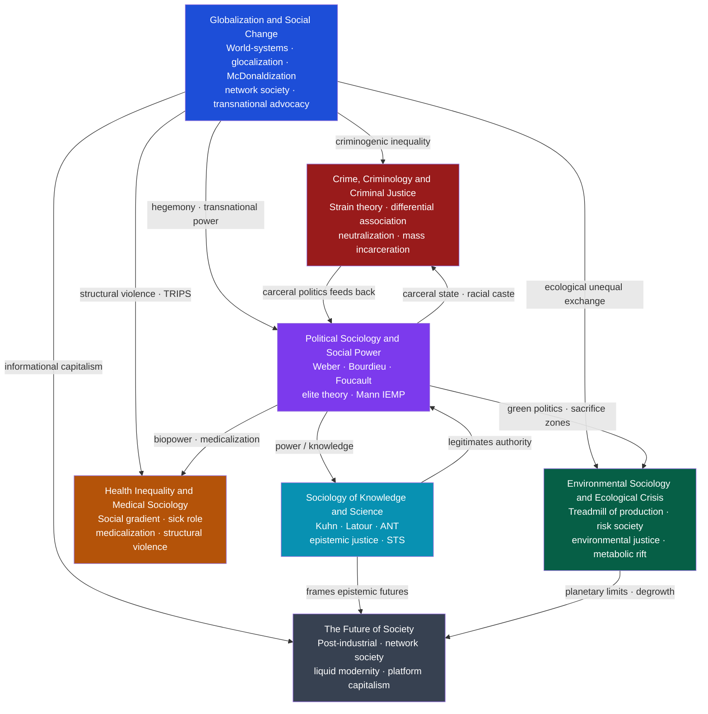

# Applied and Contemporary Sociology

> [!abstract] Section Overview
> This section brings sociological theory into direct contact with the major institutions and crises of the contemporary world — globalization, ecological breakdown, health systems, criminal justice, political power, knowledge production, and civilizational futures. Each note takes a structural rather than individualist stance: the central questions are not "why do some people commit crime?" or "why do some people get sick?" but why these outcomes are systematically patterned by class, race, gender, and position in global networks of power. Together they form an integrated anatomy of how modern societies reproduce inequality, manage risk, and — sometimes — transform themselves.

---

## Concept Map

*(Blue = structural entry point, Purple = cross-cutting power hub, arrows = dominant analytical relationship)*

---

## Recommended Learning Path

*Recommended order for a first pass through this section:*

1. [[Globalization_and_Social_Change]] — Start here to establish the macro structural frame: the world-system, cultural globalization, the network society, and transnational civil society. Every other note in this section describes a domain shaped by these forces.

2. [[Political_Sociology_and_Social_Power]] — Follow immediately with the power framework. Weber's class-status-party, Bourdieu's fields and symbolic capital, Foucault's discipline and biopower, and Mann's IEMP provide the analytical vocabulary used throughout the remaining notes.

3. [[Environmental_Sociology_and_Ecological_Crisis]] — The first applied domain. Applies conflict theory and world-systems logic to the society-nature relationship; Schnaiberg's treadmill, Bullard's environmental justice, and Beck's risk society show how structural power distributes ecological harm.

4. [[Health_Inequality_and_Medical_Sociology]] — The second applied domain. The social gradient, the Whitehall studies, structural violence, medicalization, and Foucauldian biopower converge here; this note operationalizes what power does to bodies.

5. [[Crime_Criminology_and_Criminal_Justice]] — The third applied domain. Merton's strain, Sutherland's differential association, feminist criminology, and the critical analysis of mass incarceration show how structural blocked opportunity is criminalized and managed.

6. [[Sociology_of_Knowledge_and_Science]] — The reflexive turn: after examining how power structures health, crime, and ecology, this note asks how power also structures what counts as legitimate knowledge — Kuhn, the Strong Programme, Latour's ANT, and Fricker's epistemic justice.

7. [[The_Future_of_Society]] — The synthesis and forward-looking note. Bell's post-industrial society, Castells' network society, Bauman's liquid modernity, Brynjolfsson and McAfee's second machine age, surveillance capitalism, degrowth, and post-human futures bring all preceding frameworks into prospective analysis.

---

## All Notes in This Section

| Note | Core Idea | Difficulty |
|------|-----------|------------|
| [[Globalization_and_Social_Change]] | Globalization homogenizes and hybridizes simultaneously; world-systems theory, glocalization, Appadurai's disjunctive scapes, and the boomerang model of transnational advocacy explain how global forces and local societies mutually constitute each other | Intermediate |
| [[Environmental_Sociology_and_Ecological_Crisis]] | Ecological destruction is not accidental but structurally compelled by the treadmill of production; environmental harm is unequally distributed by race and class; Beck's risk society names manufactured risks that cross class lines | Intermediate |
| [[Health_Inequality_and_Medical_Sociology]] | Health outcomes follow a continuous social gradient, not a poverty threshold; structural violence kills through identifiable social arrangements; medicalization and biopower extend medical authority into social life | Intermediate |
| [[Crime_Criminology_and_Criminal_Justice]] | Crime causation spans rational choice, structural strain, learned behavior, and performed masculinity; the carceral state in the US functions as a racial caste management system; restorative justice offers an institutional alternative | Advanced |
| [[Political_Sociology_and_Social_Power]] | Power operates through three faces — decision-making, agenda control, and preference formation; Weber, Bourdieu, Foucault, elite theory, and Mann's IEMP each capture a different dimension of how power is acquired, legitimated, and naturalized | Advanced |
| [[Sociology_of_Knowledge_and_Science]] | Scientific facts are socially constructed through laboratory networks, paradigm communities, and inscription devices; epistemic injustice describes how social position determines who counts as a knower; post-colonial STS names the epistemicide produced by colonial knowledge hierarchies | Advanced |
| [[The_Future_of_Society]] | The dissolution of Fordist industrial society is producing the network society, liquid modernity, labor market polarization, surveillance capitalism, and contested post-capitalist or post-human alternatives | Intermediate |

---

## Key Themes

**1. Structure over individual agency**
Every note in this section begins with the same move: replacing individualist explanation with structural analysis. Crime is not caused by bad people — it is produced by structural strain and blocked opportunity. Poor health is not caused by bad choices — it is produced by the social gradient. Ecological destruction is not caused by human ignorance — it is compelled by the treadmill of production.

**2. Power and the distribution of harm**
Globalization, capitalism, and the state do not distribute their costs randomly. Race, class, gender, and position in the world-system systematically determine who bears pollution, who gets sick, who gets incarcerated, and whose knowledge counts. The section as a whole is a sociology of structured suffering.

**3. Knowledge, legitimation, and reflexivity**
The Sociology of Knowledge note provides the reflexive frame for the entire section: the frameworks used to analyze crime, health, and ecology are themselves socially produced and can themselves reproduce the power hierarchies they claim to critique. Connell's Southern Theory, Fricker's epistemic justice, and de Sousa Santos' epistemologies of the South are the critical correctives.

**4. Institutional responses and their limits**
Each note describes not only how problems are produced but how institutions respond — and how those responses often reproduce the problem. The criminal justice funnel produces recidivism. Ecological modernization exports harm to the Global South. Medicalization turns structural suffering into individual pathology. The Future of Society asks what genuinely transformative alternatives might look like.

**5. Globalization as cross-cutting driver**
Wallerstein's world-system, Castells' network society, and Beck's risk society are each theories of globalization at different scales. The section reads most coherently when the global structural context is held in view throughout.

---

## Key Questions This Section Answers

- Why do health outcomes, criminal justice outcomes, and environmental burdens consistently fall along racial and class lines rather than being randomly distributed?
- How does capitalist growth structurally compel ecological destruction even when individual actors would prefer otherwise?
- What are the mechanisms by which social inequality becomes biological — written into bodies through chronic stress, allostatic load, and epigenetic marks?
- How is legitimate authority maintained without constant coercion — what are the "third face of power" mechanisms that shape preferences before any visible conflict arises?
- Why does scientific knowledge carry social authority, and whose knowledge systems are rendered invisible or illegitimate by that authority?
- What does the dissolution of industrial society's stable structures mean for work, identity, solidarity, and governance?
- What transformative alternatives to surveillance capitalism, the carceral state, and the treadmill of production have actually been built or attempted?

---

## Cross-Section Links

- [[_MOC_Sociology_Master|↑ Sociology Master MOC]] — master entry to the full Sociology vault; this section is the applied synthesis where all theoretical and structural frameworks meet contemporary crises
- [[Classical_Sociological_Theory]] — Weber's legitimate domination, Durkheim's anomie, and Marx's structural contradictions are the theoretical ancestors of everything in this section; strain theory, biopower, and the treadmill of production are all reworkings of classical concepts
- [[Contemporary_Sociological_Theory]] — Bourdieu's capital theory, Foucault's genealogies, Beck's reflexive modernity, Bauman's liquid modernity, and Castells' network society are the contemporary theoretical foundations the section's notes build on directly
- [[Social_Stratification_and_Inequality]] — Race, class, gender, and intersectionality provide the axis variables along which all the section's structural harms are distributed; understanding the inequality notes is prerequisite for the applied sociology notes
- [[Law_Deviance_and_Social_Control]] — The primary companion to Crime, Criminology and Criminal Justice; labeling theory, Hirschi's social bonds, Foucault's carceral continuum, and restorative justice are covered in full there
- [[Social_Movements_and_Revolution]] — The collective response to the structural harms this section diagnoses; political opportunity structures, resource mobilization, and framing connect political sociology to movement outcomes
- [[Global_Inequality_and_Development]] — The economic face of what Globalization and Social Change analyzes sociologically; Wallerstein's core-periphery structure, the elephant curve, and the Washington Consensus critique are the economic complement

#Sociology #MOC
