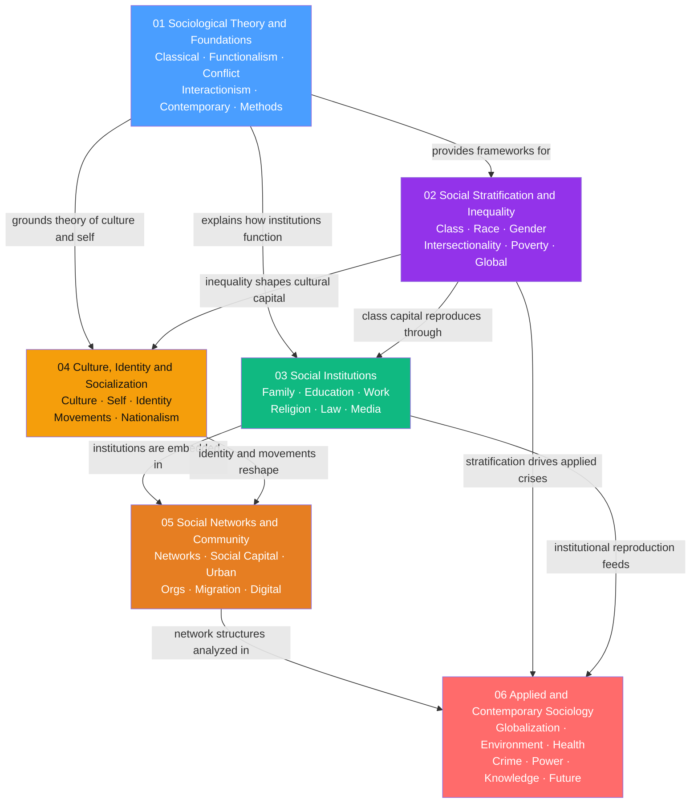

# Sociology — Master Map of Content

> [!abstract] Vault Overview
> A 38-note sociology vault spanning six thematic sections: the theoretical and methodological foundations of the discipline, the mechanisms of stratification and inequality, the six major social institutions through which society reproduces itself, the cultural and identity processes that bind and contest social order, the structural topology of networks and communities, and the applied sociology of globalization, ecology, health, crime, power, and knowledge. Together the sections form a complete analytical arc — from the classical question "what holds society together?" through "who benefits and who pays?" to "where is it going?"

> [!info] How to use this map
> Start with **Section 01** for theoretical grounding, then move through the sections in order for a systematic first pass. Jump directly to any section MOC for a focused deep-dive. The learning paths below offer curated shortcuts for three different intellectual objectives. All 38 notes are catalogued in the section tables.

---

## Vault Structure

*(Blue = foundational theory entry point, Purple = stratification core, Green = institutional reproduction, Amber = culture and identity, Orange = structural topology, Red = applied and contemporary synthesis)*

---

## Sections

### 01 Sociological Theory and Foundations

**Section MOC:** [[01_Sociological_Theory_and_Foundations/_MOC_Sociological_Theory_and_Foundations|Sociological Theory and Foundations MOC]]

> Establishes the theoretical and methodological backbone of sociology — from the four founding theorists through the three major 20th-century schools to the contemporary syntheses of Bourdieu, Giddens, and Foucault.

| Note | Core Idea | Difficulty |
|------|-----------|------------|
| [[Classical_Sociological_Theory]] | Marx, Durkheim, Weber, and Simmel each diagnosed a different wound of modernity: alienation, anomie, rationalization, fragmentation of self | Intermediate |
| [[Sociological_Research_Methods]] | Method choice is inseparable from epistemological stance; quantitative, qualitative, and computational tools reveal different layers of social reality | Intermediate |
| [[Functionalism_and_Systems_Theory]] | Social institutions are explained by what they do for the whole — from Parsons' AGIL schema to Luhmann's autopoietic subsystems | Intermediate |
| [[Conflict_Theory_and_Critical_Theory]] | Society is organized around competition over scarce power; domination is sustained through ideology, hegemony, and colonization of everyday culture | Intermediate |
| [[Symbolic_Interactionism_and_Microsociology]] | Social reality is accomplished through face-to-face interaction; the self is built from the outside in through symbolic exchange | Beginner–Intermediate |
| [[Contemporary_Sociological_Theory]] | Bourdieu, Giddens, and Foucault dissolve the structure-agency divide; power operates through habitus, discipline, and surveillance | Advanced |

---

### 02 Social Stratification and Inequality

**Section MOC:** [[02_Social_Stratification_and_Inequality/_MOC_Social_Stratification_and_Inequality|Social Stratification and Inequality MOC]]

> Examines how societies sort people into unequal hierarchies and why those hierarchies persist, reproduce, and compound across generations — from class theory through race and gender to intersectionality and global inequality.

| Note | Core Idea | Difficulty |
|------|-----------|------------|
| [[Social_Class_and_Stratification]] | Society is arranged in durable hierarchical layers shaped by economic, cultural, and social capital; habitus and the Great Gatsby Curve explain invisible intergenerational reproduction | Beginner–Advanced |
| [[Race_Ethnicity_and_Racism]] | Race is a social construction with entirely real material consequences; colorblind racism is the dominant contemporary form operating at individual, institutional, and cultural levels | Beginner–Advanced |
| [[Gender_Sex_and_Patriarchy]] | Gender is a socially constructed performance; patriarchy sustains male dominance through ideology, the gendered division of labor, and institutional power | Beginner–Advanced |
| [[Intersectionality]] | Race, gender, and class are interlocking — not additive — axes of power producing qualitatively distinct oppressions invisible to single-axis analysis | Beginner–Advanced |
| [[Poverty_Social_Mobility_and_Life_Chances]] | Poverty is absolute deprivation and relative exclusion; the Great Gatsby Curve shows high inequality structurally forecloses intergenerational mobility | Intermediate |
| [[Global_Inequality_and_Development]] | Global inequality is historically produced; dependency theory, world-systems theory, and Milanovic's elephant curve explain who wins and loses from globalization | Intermediate–Advanced |

---

### 03 Social Institutions

**Section MOC:** [[03_Social_Institutions/_MOC_Social_Institutions|Social Institutions MOC]]

> Examines the six major institutions of modern societies — family, education, religion, work, law, and media — as an interlocking system that enables social life while systematically reproducing inequality.

| Note | Core Idea | Difficulty |
|------|-----------|------------|
| [[Family_Marriage_and_Kinship]] | Kinship systems regulate descent, residence, and marriage; the nuclear family is historically recent; feminist sociology exposes the household as a site of unpaid labour and contested power | Intermediate |
| [[Religion_Sacred_and_Secular]] | Religion creates solidarity through collective effervescence; Calvinist predestination accidentally produced the spirit of capitalism; the secularization thesis is challenged by the religious economy model | Intermediate |
| [[Education_and_Social_Reproduction]] | Schools simultaneously enable mobility and reproduce class inequality; Bourdieu's cultural capital converts inherited advantage into apparent individual merit via misrecognition | Intermediate |
| [[Work_Organizations_and_Bureaucracy]] | Work is organized power over the labour process; from Weber's iron cage through Taylorist deskilling and Fordism to algorithmic gig economy discipline | Intermediate |
| [[Law_Deviance_and_Social_Control]] | Deviance is a label applied by those with power; Merton shows structural strain produces crime; Foucault reframes modern punishment as the production of docile subjects | Advanced |
| [[Media_Culture_and_Cultural_Industries]] | Cultural industries produce shared social reality under commodity logic; Gramsci's hegemony explains how ruling-class interests become common sense; platform surveillance capitalism extracts behavioral surplus | Advanced |

---

### 04 Culture, Identity, and Socialization

**Section MOC:** [[04_Culture_Identity_and_Socialization/_MOC_Culture_Identity_and_Socialization|Culture, Identity and Socialization MOC]]

> Traces the arc from the cultural OS that shapes social life, through the process that installs it in individuals, to the managed identities people perform in interaction, and finally to collective identities — crowds, movements, nations.

| Note | Core Idea | Difficulty |
|------|-----------|------------|
| [[Culture_Norms_Values_and_Ideology]] | Culture is the social OS — norms, values, symbols, and ideology reproduce power arrangements through hegemony and cultural capital | Intermediate |
| [[Socialization_and_the_Self]] | The self is a social achievement built through interaction; Cooley, Mead, Goffman, and Giddens explain how culture is internalized as identity | Beginner |
| [[Identity_Stigma_and_Impression_Management]] | Social life is performance; stigma spoils identity; group membership anchors self-esteem via Social Identity Theory | Intermediate |
| [[Collective_Behavior_and_Crowds]] | Crowds are norm-governed collective episodes; contagion, emergent norms, and effervescence explain the range of crowd outcomes | Intermediate |
| [[Social_Movements_and_Revolution]] | Grievances alone do not produce movements; organizational resources, political opportunity, resonant frames, and threshold cascades explain when mobilization succeeds | Advanced |
| [[Nationalism_Ethnicity_and_Collective_Identity]] | Nations are imagined communities; ethnicity is defined by socially maintained boundaries, not primordial essence; these constructions can generate liberation or genocide | Advanced |

---

### 05 Social Networks and Community

**Section MOC:** [[05_Social_Networks_and_Community/_MOC_Social_Networks_and_Community|Social Networks and Community MOC]]

> Maps the spaces and structures of social life — from the topology of who knows whom, through local communities and global cities, into formal organizations, across migration corridors, and onto digital platforms.

| Note | Core Idea | Difficulty |
|------|-----------|------------|
| [[Social_Networks_and_Social_Ties]] | Weak ties bridge disconnected clusters, structural holes give brokers power, small-world shortcuts enable six degrees of separation, scale-free hubs concentrate influence | Intermediate |
| [[Social_Capital_and_Trust]] | Resources embedded in social networks; Bourdieu sees class capital reproducing inequality, Coleman as functional closure enabling norms, Putnam as civic trust sustaining democracy | Intermediate |
| [[Rural_and_Community_Sociology]] | Gemeinschaft vs. Gesellschaft structures the entire field; rural decline is non-linear and crosses cohesion thresholds; place attachment is social infrastructure as much as sentiment | Beginner–Intermediate |
| [[Urban_Sociology_and_the_City]] | Cities are contested arenas of capital accumulation vs. resident use value; rent gap drives gentrification; global cities polarize socially while commanding global capital flows | Intermediate |
| [[Organizations_and_Formal_Structures]] | Organizations converge toward the same structural form through coercive, normative, and mimetic isomorphism rather than optimization; formal structures decouple from actual practice | Intermediate |
| [[Migration_and_Diaspora]] | Migration is a self-amplifying social process driven by cumulative causation; transnationalism challenges the assimilation endpoint; diaspora creates plural cross-border belonging | Intermediate–Advanced |
| [[Digital_Society_and_Online_Communities]] | Digital platforms reorganize social life through datafication and behavioral modification; algorithmic governance of visibility and community constitutes a new form of structural power | Advanced |

---

### 06 Applied and Contemporary Sociology

**Section MOC:** [[06_Applied_and_Contemporary_Sociology/_MOC_Applied_and_Contemporary_Sociology|Applied and Contemporary Sociology MOC]]

> Brings sociological theory into direct contact with the major institutions and crises of the contemporary world — globalization, ecological breakdown, health, criminal justice, political power, knowledge production, and civilizational futures.

| Note | Core Idea | Difficulty |
|------|-----------|------------|
| [[Globalization_and_Social_Change]] | Globalization homogenizes and hybridizes simultaneously; world-systems theory, glocalization, Appadurai's scapes, and transnational advocacy explain how global forces and local societies mutually constitute each other | Intermediate |
| [[Environmental_Sociology_and_Ecological_Crisis]] | Ecological destruction is structurally compelled by the treadmill of production; environmental harm is unequally distributed by race and class; Beck's risk society names manufactured risks that cross class lines | Intermediate |
| [[Health_Inequality_and_Medical_Sociology]] | Health outcomes follow a continuous social gradient; structural violence kills through identifiable social arrangements; medicalization and biopower extend medical authority into social life | Intermediate |
| [[Crime_Criminology_and_Criminal_Justice]] | Crime causation spans structural strain, learned behavior, and performed masculinity; the US carceral state functions as a racial caste management system; restorative justice offers an institutional alternative | Advanced |
| [[Political_Sociology_and_Social_Power]] | Power operates through three faces — decision-making, agenda control, and preference formation; Weber, Bourdieu, Foucault, elite theory, and Mann's IEMP each capture a different dimension of how power is legitimated and naturalized | Advanced |
| [[Sociology_of_Knowledge_and_Science]] | Scientific facts are socially constructed through laboratory networks and paradigm communities; epistemic injustice describes how social position determines who counts as a knower | Advanced |
| [[The_Future_of_Society]] | The dissolution of Fordist industrial society is producing the network society, liquid modernity, labour market polarization, surveillance capitalism, and contested post-capitalist or post-human alternatives | Intermediate |

---

## Learning Paths

### Path 1 — Classical Foundations Track
*For readers building a systematic theoretical base before approaching any applied topic.*

1. [[Classical_Sociological_Theory]] — the four founding diagnoses of modernity; every subsequent note is in dialogue with Marx, Durkheim, Weber, and Simmel
2. [[Sociological_Research_Methods]] — how sociologists know what they claim to know; grounds the epistemological stakes of every theoretical choice
3. [[Functionalism_and_Systems_Theory]] — the first major macro school; Parsons and Luhmann on how societies absorb shocks and maintain order
4. [[Conflict_Theory_and_Critical_Theory]] — direct critique of functionalism; Gramsci and Habermas on power hiding inside common sense
5. [[Symbolic_Interactionism_and_Microsociology]] — the micro turn; Goffman and Garfinkel on social order as an interactional accomplishment
6. [[Contemporary_Sociological_Theory]] — Bourdieu, Giddens, and Foucault synthesize all three prior schools and push sociology into the 21st century
7. [[Social_Class_and_Stratification]] — apply the classical frameworks to the central empirical puzzle of class reproduction
8. [[Family_Marriage_and_Kinship]] — trace the theoretical frameworks into their most fundamental institutional site
9. [[Culture_Norms_Values_and_Ideology]] — complete the arc with Gramsci and Bourdieu on how culture reproduces structure

---

### Path 2 — Inequality and Stratification Track
*For readers focused on how social advantage and disadvantage are produced, reproduced, and experienced.*

1. [[Social_Class_and_Stratification]] — the foundational vocabulary of Marx, Weber, and Bourdieu; Gini coefficient and the Great Gatsby Curve
2. [[Race_Ethnicity_and_Racism]] — race as a structurally distinct axis; colorblind ideology and the compounding wealth gap
3. [[Gender_Sex_and_Patriarchy]] — gender as a third independent axis; Butler's performativity and Walby's six structures of patriarchy
4. [[Intersectionality]] — Crenshaw and Collins on why single-axis analysis systematically misses harm at the intersections
5. [[Education_and_Social_Reproduction]] — how family-transmitted advantages are laundered as individual merit through schooling
6. [[Poverty_Social_Mobility_and_Life_Chances]] — poverty traps, blocked mobility, and the structural over cultural explanation
7. [[Global_Inequality_and_Development]] — zoom out to the world scale; colonial institutional persistence and the elephant curve
8. [[Health_Inequality_and_Medical_Sociology]] — how social inequality becomes biological, written into bodies through the social gradient
9. [[Crime_Criminology_and_Criminal_Justice]] — how structural blocked opportunity is criminalized and managed by the carceral state

---

### Path 3 — Contemporary Issues Track
*For readers who want to understand the sociology of the present — digital society, ecological crisis, political power, and the future.*

1. [[Globalization_and_Social_Change]] — establish the macro structural frame: world-system, network society, and transnational civil society
2. [[Political_Sociology_and_Social_Power]] — the power framework: Weber, Bourdieu, Foucault, elite theory, and Mann's IEMP
3. [[Digital_Society_and_Online_Communities]] — how platforms reorganize social ties, community, and democracy through surveillance capitalism
4. [[Environmental_Sociology_and_Ecological_Crisis]] — the treadmill of production, environmental justice, and the risk society
5. [[Health_Inequality_and_Medical_Sociology]] — how power structures bodies; biopower and the social gradient
6. [[Social_Movements_and_Revolution]] — the organized response to structural harm; resource mobilization and political opportunity
7. [[Sociology_of_Knowledge_and_Science]] — the reflexive turn: how power structures what counts as legitimate knowledge
8. [[The_Future_of_Society]] — liquid modernity, labor polarization, surveillance capitalism, and contested post-capitalist alternatives

---

## Key Questions the Vault Answers

- Why do social inequalities persist and reproduce across generations even in societies that formally guarantee equal opportunity and prohibit discrimination?
- How does power maintain itself without constant visible force — through culture, common sense, institutions, and everyday interaction?
- What is the relationship between individual agency and the social structures that predate any individual?
- How does the spatial organization of social ties — networks, neighborhoods, cities, migration corridors, digital platforms — produce and reproduce unequal life chances?
- Why are health outcomes, criminal justice outcomes, and environmental burdens consistently patterned by race and class rather than randomly distributed?
- How does capitalist growth structurally compel ecological destruction even when individual actors prefer otherwise?
- What transformative alternatives to the carceral state, surveillance capitalism, and the treadmill of production have actually been built or attempted?
- Where is industrial society going — and what do the network society, liquid modernity, and platform capitalism tell us about the sociology of the future?

---

## Cross-Vault Connections

| Vault | Connection Points |
|-------|-------------------|
| [[Psychology/_MOC_Psychology_Master\|Psychology]] | Social psychology of conformity, group dynamics, prejudice, and implicit bias is the experimental micro-level complement to macrosociological theory; attachment theory and moral development ground the mechanisms through which family and education produce social outcomes; personality and evolutionary psychology connect to socialization and the self |
| [[Political_Science/_MOC_Political_Science_Master\|Political Science]] | Conflict theory, Gramsci's hegemony, and world-systems theory directly inform political sociology; the state is both Parsons' G-subsystem and the terrain of hegemonic struggle; Habermas's public sphere is a normative theory of democratic legitimacy; social movements connect to political participation and civil society |
| [[Game_Theory/_MOC_Game_Theory_Master\|Game Theory]] | Olson's collective action problem in social movements is a direct application of the n-person prisoner's dilemma; social capital and trust map onto repeated-game equilibria and norm enforcement; the free-rider problem underlies every theory of collective behavior in this vault |
| [[Macroeconomics/_MOC_Macroeconomics_Master\|Macroeconomics]] | The welfare state, Keynesian demand management, and Esping-Andersen's regime typology connect stratification to macroeconomic institutions; the Washington Consensus and structural adjustment are the macroeconomic face of global inequality; development economics complements the sociological treatment of poverty traps |
| [[AI-ML/_MOC_AI_ML_Master\|AI and Machine Learning]] | Zuboff's surveillance capitalism is the sociological critique of machine learning's business model; algorithmic hiring, credit scoring, and predictive policing are sites of computational reproduction of racial and class inequality; computational social science and network analysis are methodological bridges |
| [[Neuroscience/_MOC_Neuroscience_Master\|Neuroscience]] | Social neuroscience provides the neural substrate for in-group/out-group bias, status hierarchies, and the stress pathways through which the social gradient produces health inequality; allostatic load connects the sociological concept of structural violence to measurable biological mechanisms |
| [[Genetics/_MOC_Genetics_Master\|Genetics]] | Gene-environment interaction and epigenetics operationalize how structural violence and chronic social stress become biologically embedded; behavioral genetics debates directly engage the structure-agency tension at the core of sociology; population genetics informs the biological meaninglessness of racial categories alongside their social reality |
| [[Meteorology_and_Climatology/_MOC_Meteorology_Master\|Meteorology and Climatology]] | Environmental sociology and ecological crisis rest on climate science; Beck's risk society takes on specific content when paired with atmospheric science; environmental justice and the sociology of climate denial require understanding the physical phenomena that social actors are disputing and the communities bearing disproportionate climate burden |

---

#Sociology #MOC
