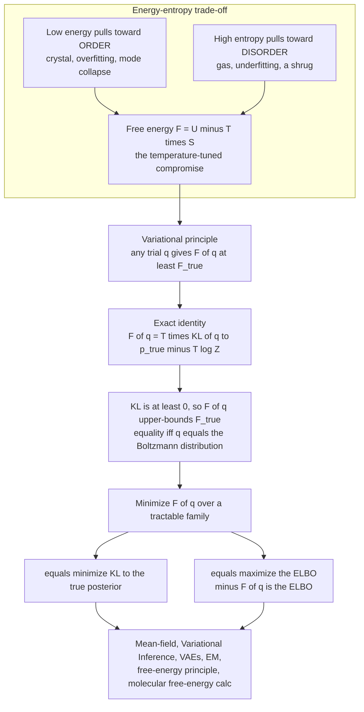

# ⚖️ Free Energy Minimization and Variational Principles

> [!abstract] TL;DR
> A physical system at temperature $T$ does **not** settle into its lowest-energy state (that would freeze everything into a perfect crystal) nor its highest-entropy state (that would blur everything into featureless gas). It minimizes the **Helmholtz free energy** $F = U - TS$ — average energy minus temperature times entropy — the exact, temperature-tuned compromise between order and disorder. The **variational principle** makes this operational: for *any* trial distribution $q$, the variational free energy $F[q] = \langle E\rangle_q - T\,H[q]$ obeys $F[q] \ge F_{\text{true}} = -T\log Z$, with equality **iff** $q$ is the true Boltzmann distribution. The exact identity $F[q] = T\,\mathrm{KL}(q\,\|\,p_{\text{true}}) - T\log Z$ means that **minimizing variational free energy = minimizing KL to the true posterior = maximizing the ELBO**. That single line is the foundation of variational inference, VAEs, mean-field theory, EM, and Friston's free-energy principle of the brain — the conceptual bridge that turns *statistical-mechanics equilibrium* into *machine-learning inference*.

---

## Intuition

**Analogy — nature is lazy, but not *too* lazy.** Imagine water deciding what to be. If it only wanted to minimize energy, every molecule would lock into the tidy lattice of ice and stay there forever — maximally ordered, maximally boring. If it only wanted to maximize entropy, it would fly apart into a diffuse gas — maximally disordered, structureless. Real water at room temperature does neither: it stays liquid, striking a *bargain* between the two urges. The quantity it actually minimizes is **free energy** $F = U - TS$: energy pulls toward order, the $-TS$ term rewards spreading out into more configurations, and **temperature is the exchange rate** that decides who wins. Turn the temperature down and energy dominates (ice). Turn it up and entropy dominates (steam). The phase you see is whichever option has the lower free energy.

Machine-learning inference faces the *identical* dilemma. When you fit a model to data you want it to **explain the evidence** (low "energy" — a good fit) but also to **stay humble and spread out** over the possibilities it cannot distinguish (high entropy — calibrated uncertainty). Chase the fit alone and you overfit or collapse onto a single mode (a crystal). Chase spread alone and you underfit into a shrug (a gas). The principled middle — fit the data *while* keeping as much uncertainty as the data allows — is once again free-energy minimization. This is why the *same* $F = U - TS$ that predicts whether $\mathrm{H_2O}$ is ice or steam also underlies training a variational autoencoder, doing approximate Bayesian inference, and — some argue — how the brain itself resists disorder.

---

## How It Works

### Core mechanics

**1. Equilibrium minimizes free energy, not energy.** A system held at fixed temperature $T$ (in contact with a heat bath), volume, and particle number reaches equilibrium at the distribution that **minimizes** the Helmholtz free energy

$$F = U - TS = \langle E\rangle - T\,S .$$

The competition is explicit: $U = \langle E\rangle$ wants to be small (order); $S$ wants to be large (disorder); $T$ sets the trade. Minimizing $F$ over all probability distributions on the microstates, subject to normalization, yields the **Boltzmann distribution** $p_i = e^{-E_i/T}/Z$ with partition function $Z = \sum_i e^{-E_i/T}$, and the minimized value is exactly

$$F_{\text{true}} = -T\log Z .$$

(Throughout I set Boltzmann's constant $k_B = 1$, so temperature and energy share units.) See [[Thermodynamic_Potentials]] and [[Classical_Statistical_Mechanics]] for the physics derivation, and the companion sibling *Partition_Functions_and_Free_Energy_in_ML* for the $Z \leftrightarrow$ evidence dictionary.

**2. The energy-entropy trade-off is the heart of it.** Pure energy minimization freezes the system into its ground state — a crystal, or in ML the pathologies of **overfitting** and **mode collapse**. Pure entropy maximization gives featureless disorder — a gas, or in ML **underfitting**. Free energy is the principled compromise, and **temperature tunes it**: low $T$ → energy wins → order; high $T$ → entropy wins → disorder. When this balance shifts *abruptly* as a parameter crosses a threshold, you get a **phase transition** — a preview developed in [[Phase_Transitions_and_Critical_Phenomena]] and foreshadowed for learning dynamics.

**3. The variational principle — a universal inequality.** Here is the powerful part. Take *any* trial distribution $q$ over the microstates and define its **variational free energy**

$$F[q] = \langle E\rangle_q - T\,H[q] = \sum_i q_i E_i + T\sum_i q_i \log q_i ,$$

where $H[q] = -\sum_i q_i \log q_i$ is the entropy of $q$. Then

$$\boxed{\,F[q] \;\ge\; F_{\text{true}} = -T\log Z\,}\qquad\text{equality iff } q = p_{\text{true}} .$$

So **any** trial distribution's free energy is an **upper bound** on the true free energy (equivalently, a **lower bound on $\log Z$**). Minimizing $F[q]$ over a tractable family of $q$'s gives the *best available approximation* and a certified bound. This is the **Gibbs-Bogoliubov-Feynman inequality**, the engine of mean-field theory.

**4. The key identity: free energy = KL + $\log Z$.** Why is the bound true? Substitute the Boltzmann form $E_i = -T\log p_i - T\log Z$ into $F[q]$:

$$F[q] = \sum_i q_i E_i + T\sum_i q_i \log q_i
      = T\sum_i q_i \log\frac{q_i}{p_i} \;-\; T\log Z ,$$

$$\boxed{\,F[q] \;=\; T\,\mathrm{KL}(q\,\|\,p_{\text{true}}) \;-\; T\log Z\,}$$

Because $\mathrm{KL}(q\,\|\,p)\ge 0$ (Gibbs' inequality; a consequence of [[Jensen_and_Inequalities]]) and vanishes only when $q=p$, the variational bound is *immediate*. And it tells us exactly what minimizing $F[q]$ is doing: since $-T\log Z$ is a constant that does not depend on $q$,

$$\min_q F[q] \;\;\Longleftrightarrow\;\; \min_q \mathrm{KL}(q\,\|\,p_{\text{true}}) .$$

**Minimizing variational free energy = minimizing KL divergence to the true posterior.** See [[Relative_Entropy_and_Cross_Entropy]] for the KL machinery.

**5. Variational inference and the ELBO.** Now read the identity in Bayesian language. Let the target be a posterior $p_{\text{true}}(z) = p(z\mid x) = p(x,z)/p(x)$, so the role of $-\log Z$ is played by the negative log-evidence $-\log p(x)$. With $T=1$,

$$F[q] = -\underbrace{\big(\langle \log p(x,z)\rangle_q + H[q]\big)}_{\text{ELBO}} = -\,\mathrm{ELBO}(q),\qquad
\log p(x) = \mathrm{ELBO}(q) + \mathrm{KL}\big(q\,\|\,p(z\mid x)\big) .$$

The **ELBO (Evidence Lower BOund) is exactly the negative variational free energy.** Minimizing $F[q]$ = maximizing the ELBO = shrinking the KL to the true posterior. This single equivalence is the foundation of **variational inference**, VAEs, and variational Bayes — developed fully in [[Variational_Inference_the_ELBO_and_VAEs]] and, from the SM side, in the sibling *Variational_Inference_as_Free_Energy_Minimization*.

**6. Mean-field theory — the workhorse approximation.** The variational bound is useless unless the family of $q$'s is tractable. The classic choice restricts $q$ to a **factorized** form $q(x) = \prod_i q_i(x_i)$ (all coordinates independent), then minimizes $F[q]$. Each unit ends up seeing only the **mean field** of its neighbors, giving **self-consistent equations** for the $q_i$. This is the same mathematics from the mean-field solution of the Ising model (see [[The_Ising_Model_and_Statistical_Physics]]) to mean-field variational inference and the mean-field theory of deep networks — foreshadowed in the sibling *Mean_Field_Theory_of_Neural_Networks*.

**7. The grand extrapolation — the free-energy principle.** Friston's **free-energy principle** proposes that biological systems and brains persist by *minimizing variational free energy*, which upper-bounds "surprise" (negative log-evidence of their sensory stream). Perception minimizes $F$ by updating beliefs $q$; action minimizes $F$ by changing the sensations themselves (**active inference**). It is a sweeping — and vigorously debated — unification of thermodynamics, inference, and life, treated in [[The_Free_Energy_Principle_and_Active_Inference]] and its SM-vault sibling of the same name.

### Flow / architecture



---

## Key Concepts

**Secondary (build the picture).**
- **Free energy $F = U - TS$**: what a system at fixed temperature actually minimizes — a tug-of-war between low energy (order) and high entropy (disorder), refereed by temperature.
- **Temperature as an exchange rate**: low $T$ → energy wins (ordered); high $T$ → entropy wins (disordered). Same knob that decides ice vs. steam decides fit-vs-uncertainty in a model.
- **The compromise, not the extreme**: pure energy min = frozen crystal / overfitting; pure entropy max = gas / underfitting; free energy is the principled middle.

**Undergraduate (make it precise).**
- **Boltzmann distribution as the free-energy minimizer**: minimizing $F$ over all distributions yields $p_i = e^{-E_i/T}/Z$, and $F_{\text{true}} = -T\log Z$.
- **Variational free energy** $F[q] = \langle E\rangle_q - T\,H[q]$ for a trial $q$, and the **variational inequality** $F[q]\ge F_{\text{true}}$.
- **Key identity** $F[q] = T\,\mathrm{KL}(q\,\|\,p_{\text{true}}) - T\log Z$: the *gap* above the true free energy is exactly $T$ times the KL divergence.
- **ELBO $= -F[q]$** (at $T=1$): $\log p(x) = \mathrm{ELBO}(q) + \mathrm{KL}(q\,\|\,p(z\mid x))$.

**Graduate (the machinery and its reach).**
- **Gibbs-Bogoliubov-Feynman bound**: the variational inequality specialized to a tractable reference Hamiltonian; basis of mean-field free-energy estimates.
- **Mean-field theory**: restrict $q=\prod_i q_i$, minimize $F[q]$, obtain self-consistent equations; coordinate-ascent variational inference (CAVI) is the same fixed-point iteration.
- **EM as free-energy minimization (Neal & Hinton)**: E-step maximizes $-F$ over $q$ at fixed parameters; M-step maximizes over parameters at fixed $q$ — alternating minimization of the *same* free-energy functional.
- **The free-energy principle / active inference**: variational free energy as a bound on surprise; perception updates $q$, action changes the data.
- **Reverse-KL geometry**: because VI minimizes $\mathrm{KL}(q\,\|\,p)$ (not $\mathrm{KL}(p\,\|\,q)$), the approximation is **mode-seeking** and tends to *underestimate variance* — a direct consequence of which free energy you bound.

---

## Python Demo

```python
# Free-energy minimization and the variational principle, from scratch.
# (a) Free energy as an energy-entropy trade-off in a two-level system:
#     the F-minimum sits BETWEEN the energy minimum and the max-entropy point,
#     and SHIFTS with temperature (low T -> ordered, high T -> disordered).
# (b) The variational bound: for a target Boltzmann distribution p and a
#     one-parameter trial family q_alpha, show F[q] >= F_true with equality
#     when q = p, and verify the identity F[q] = T*KL(q||p) + F_true.
#
# Runnable with only numpy + matplotlib.
import numpy as np
import matplotlib.pyplot as plt

rng = np.random.default_rng(0)

# ----------------------------------------------------------------------
# (a) TWO-LEVEL SYSTEM: state "down" (energy 0, ordered) vs "up" (energy eps).
#     A distribution is set by p = P(down). U = (1-p)*eps, S = binary entropy.
# ----------------------------------------------------------------------
eps = 1.0
p = np.linspace(1e-6, 1 - 1e-6, 400)          # P(ground state)

def binary_entropy(p):
    return -(p * np.log(p) + (1 - p) * np.log(1 - p))

U = (1 - p) * eps                              # average energy
S = binary_entropy(p)                          # entropy

T_show = 0.7
F = U - T_show * S                             # free energy at one temperature
p_star = p[np.argmin(F)]                       # numerical free-energy minimizer
p_boltz = 1.0 / (1.0 + np.exp(-eps / T_show))  # analytic Boltzmann P(ground)

print(f"(a) T={T_show}:  argmin F = {p_star:.3f}   Boltzmann P(ground) = {p_boltz:.3f}")
print(f"    energy min at p=1 (ordered),  entropy max at p=0.5 (disordered)")

# ----------------------------------------------------------------------
# (b) VARIATIONAL BOUND on a richer system: double-well energy landscape.
# ----------------------------------------------------------------------
x = np.linspace(-3, 3, 200)
E = (x**2 - 1.0)**2                            # symmetric double well
T = 0.5
beta = 1.0 / T

def boltzmann(energy, beta):
    w = np.exp(-beta * (energy - energy.min()))  # stable normalization
    return w / w.sum()

p_true = boltzmann(E, beta)                     # target Boltzmann distribution
Z = np.exp(-beta * (E - E.min())).sum() * np.exp(-beta * E.min())
F_true = -T * np.log(Z)                         # true free energy = -T log Z

def var_free_energy(q, E, T):
    q = np.clip(q, 1e-300, None)
    U_q = np.sum(q * E)                         # <E>_q
    H_q = -np.sum(q * np.log(q))                # entropy of q
    return U_q - T * H_q

def kl(q, p):
    q = np.clip(q, 1e-300, None); p = np.clip(p, 1e-300, None)
    return np.sum(q * np.log(q / p))

# One-parameter trial family: q_alpha ~ exp(-alpha * E)  (a trial "temperature").
# It equals p_true exactly when alpha = beta -> the equality case of the bound.
alphas = np.linspace(0.2 * beta, 3.0 * beta, 200)
F_of_q  = np.array([var_free_energy(boltzmann(E, a), E, T) for a in alphas])
KL_line = np.array([T * kl(boltzmann(E, a), p_true) + F_true for a in alphas])
a_star  = alphas[np.argmin(F_of_q)]
q_star  = boltzmann(E, a_star)

print(f"(b) F_true = -T log Z = {F_true:.4f}")
print(f"    min_alpha F[q] = {F_of_q.min():.4f}  at alpha={a_star:.3f} (true beta={beta:.3f})")
print(f"    identity check  max|F[q] - (T*KL + F_true)| = {np.max(np.abs(F_of_q - KL_line)):.2e}")
print(f"    bound holds     min(F[q] - F_true) = {np.min(F_of_q - F_true):.2e}  (>= 0)")

# ----------------------------------------------------------------------
# Plots
# ----------------------------------------------------------------------
fig, ax = plt.subplots(2, 2, figsize=(12, 9))

# (a1) energy / entropy / free energy vs distribution parameter
ax[0, 0].plot(p, U, label="energy U", color="crimson")
ax[0, 0].plot(p, T_show * S, label="T*S (entropy term)", color="steelblue")
ax[0, 0].plot(p, F, label="free energy F = U - T*S", color="black", lw=2)
ax[0, 0].axvline(1.0, ls=":", color="crimson", alpha=.6)      # energy min (ordered)
ax[0, 0].axvline(0.5, ls=":", color="steelblue", alpha=.6)    # entropy max (disordered)
ax[0, 0].axvline(p_star, ls="--", color="black")              # free-energy min (between)
ax[0, 0].set_title(f"(a) Energy-entropy trade-off  (T={T_show})")
ax[0, 0].set_xlabel("P(ground state)  -- 1.0 = ordered, 0.5 = disordered")
ax[0, 0].legend(fontsize=8)

# (a2) free-energy curves at several temperatures -> minimum shifts
for T_i, c in zip([0.2, 0.5, 1.0, 3.0], ["#08306b", "#2171b5", "#6baed6", "#c6dbef"]):
    Fi = U - T_i * S
    ax[0, 1].plot(p, Fi - Fi.min(), color=c, label=f"T={T_i}")
    ax[0, 1].axvline(p[np.argmin(Fi)], ls="--", color=c, alpha=.7)
ax[0, 1].set_title("(a) Low T -> min near 1.0 (order);  high T -> min near 0.5 (disorder)")
ax[0, 1].set_xlabel("P(ground state)")
ax[0, 1].set_ylabel("F - min(F)")
ax[0, 1].legend(fontsize=8)

# (b1) variational free energy vs alpha: bound touched only at alpha = beta
ax[1, 0].plot(alphas, F_of_q, color="black", lw=2, label="F[q_alpha]")
ax[1, 0].plot(alphas, KL_line, "o", ms=3, color="orange",
              label="T*KL(q||p) + F_true")
ax[1, 0].axhline(F_true, ls="--", color="crimson", label="F_true = -T log Z (bound)")
ax[1, 0].axvline(beta, ls=":", color="green", label="true beta (q = p)")
ax[1, 0].set_title("(b) Variational bound: F[q] >= F_true, equality at q = p")
ax[1, 0].set_xlabel("variational alpha")
ax[1, 0].set_ylabel("free energy")
ax[1, 0].legend(fontsize=8)

# (b2) optimal q recovers the target p_true
ax[1, 1].plot(x, p_true, color="crimson", lw=2, label="target p_true (Boltzmann)")
ax[1, 1].plot(x, q_star, "--", color="black", label="optimal q (min F)")
ax[1, 1].set_title("(b) Minimizing F[q] drives q toward the target")
ax[1, 1].set_xlabel("state x (double-well)")
ax[1, 1].set_ylabel("probability")
ax[1, 1].legend(fontsize=8)

plt.tight_layout()
plt.savefig("free_energy_variational_principle.png", dpi=110)
print("\nSaved: free_energy_variational_principle.png")
```

**What the output shows.** Panel (a) makes the trade-off visible: the energy term is minimized at full order ($P=1$) and the entropy term at full disorder ($P=0.5$), yet the **free energy** $F=U-TS$ bottoms out *between* them — and the second panel shows that minimum sliding from the disordered side (high $T$) toward the ordered side (low $T$). Panel (b) demonstrates the variational principle numerically: $F[q_\alpha]$ never dips below the horizontal line $F_{\text{true}}=-T\log Z$, kissing it exactly at $\alpha=\beta$ where $q=p_{\text{true}}$; the orange markers confirm the identity $F[q]=T\,\mathrm{KL}(q\,\|\,p)+F_{\text{true}}$ to machine precision; and the final panel shows the free-energy-minimizing $q$ recovering the target — the ELBO connection made concrete.

---

## Real-World Applications

- **Variational inference and VAEs** — the flagship. Training a variational autoencoder *is* per-datapoint free-energy minimization: the loss is the negative ELBO = reconstruction error (energy) plus a $\mathrm{KL}(q(z\mid x)\,\|\,p(z))$ rate term (entropy/regularization). See [[Variational_Autoencoders]] and [[VAE]].
- **Mean-field methods** in both physics and ML — from the mean-field Ising solution to mean-field VI, factorized $q$'s turn intractable coupled systems into solvable self-consistent equations.
- **Expectation-Maximization (Neal & Hinton, 1998)** — EM is coordinate descent on the *same* free-energy functional: the E-step optimizes $q$, the M-step optimizes parameters. Gaussian mixtures, HMMs, and topic models all fall out of this view.
- **Molecular free-energy calculations** — drug binding affinities are computed as free-energy differences (free-energy perturbation, thermodynamic integration), directly minimizing/estimating $F$ for candidate ligand-protein complexes.
- **Phase transitions and equilibrium** — the free energies of competing phases cross at a transition; the lower-$F$ phase is realized, connecting to [[Phase_Transitions_and_Critical_Phenomena]].
- **The free-energy principle in neuroscience** — perception and action modeled as minimization of a variational free energy bounding sensory surprise; see [[The_Free_Energy_Principle_and_Active_Inference]].
- **Optimization by annealing** — simulated annealing and sampling (see [[The_Metropolis_Algorithm_and_MCMC]]) lower an effective free energy while cooling $T$, trading exploration (entropy) for exploitation (energy), the same knob as [[Gradient_Descent]] with a temperature schedule.

---

## Common Pitfalls

- **Confusing energy minimization with free-energy minimization.** Minimizing energy alone gives the ground state (a crystal / an overfit point estimate). At $T>0$ the system minimizes $F=U-TS$; forgetting the entropy term is the single most common conceptual error and shows up in ML as mode collapse and overconfident posteriors.
- **Thinking the variational bound gives the *right* distribution.** $F[q]\ge F_{\text{true}}$ guarantees an upper bound on free energy, not that the minimizing $q$ equals $p$ — that only holds if $p$ lies in your family. A tractable family (e.g. mean-field) generally cannot represent $p$, so you get the *closest* member, not the truth.
- **Reverse-KL variance underestimation.** VI minimizes $\mathrm{KL}(q\,\|\,p)$, which is **mode-seeking**: it happily ignores modes and shrinks variance. Reporting variational posterior variances as if they were exact is a classic trap; the direction of the KL (a choice of which free energy you bound) causes it.
- **Sign and temperature bookkeeping.** The ELBO is *minus* the variational free energy, and factors of $T$ (or $\beta=1/T$) sprinkle through every identity. Dropping a sign turns a lower bound on $\log Z$ into nonsense; conflating $T=1$ (Bayesian) with general $T$ (physics) hides the temperature knob.
- **Mean-field self-consistency ≠ global optimum.** The mean-field fixed-point equations can have multiple solutions (spontaneous symmetry breaking); naive iteration may land in a poor local minimum of $F[q]$. Random restarts / annealing $T$ mitigate it.
- **Assuming the partition function is optional.** $-T\log Z$ is a constant *for a fixed model*, so it drops out of $\arg\min_q$ — but it is exactly the evidence you often ultimately want. Treating $Z$ as ignorable everywhere is how people lose the ability to compare models.

---

## Related Concepts

- [[Thermodynamic_Potentials]] — defines the Helmholtz free energy $F=U-TS$ and why fixed-$T$ systems minimize it; the physics source of everything here.
- [[Classical_Statistical_Mechanics]] — derives the Boltzmann distribution and partition function $Z$ that make $F_{\text{true}}=-T\log Z$ concrete.
- [[Entropy_and_Second_Law]] — the entropy that competes with energy inside $F$; why disorder is favored at finite temperature.
- [[Entropy_in_Thermodynamics_and_Statistical_Mechanics]] — the information-theoretic reading of the same entropy term.
- [[Relative_Entropy_and_Cross_Entropy]] — the KL divergence whose non-negativity *is* the variational inequality and the exact gap $F[q]-F_{\text{true}}$.
- [[Maximum_Entropy_Principle]] — the dual perspective: fixing $\langle E\rangle$ and maximizing entropy also yields the Boltzmann distribution, mirroring free-energy minimization.
- [[Variational_Inference_the_ELBO_and_VAEs]] — the ML incarnation: negative variational free energy = ELBO; posterior approximation as optimization.
- [[Variational_Autoencoders]] — VAEs train by minimizing per-datapoint variational free energy.
- [[VAE]] — the generative-modeling view of the same objective.
- [[The_Free_Energy_Principle_and_Active_Inference]] — Friston's extrapolation to brains and life.
- [[The_Ising_Model_and_Statistical_Physics]] — the canonical system whose mean-field solution is free-energy minimization over factorized $q$.
- [[The_Metropolis_Algorithm_and_MCMC]] — the sampling counterpart: reach the Boltzmann distribution stochastically instead of by optimizing $F[q]$.
- [[Jensen_and_Inequalities]] — Jensen's inequality underlies both $\mathrm{KL}\ge 0$ and the ELBO derivation.
- [[Convex_Functions]] — convexity/concavity that make the variational bound and its optimization well-behaved.
- [[Bayesian_Statistics]] — the posterior $p(z\mid x)$ that plays the role of the target Boltzmann distribution.
- [[Gradient_Descent]] — how $F[q]$ is minimized in practice (stochastic VI, VAE training).

---

## Review Questions

1. **(Secondary)** Why does a glass of water at room temperature stay liquid instead of freezing into ice (pure order) or dispersing into vapor (pure disorder)? Frame your answer in terms of energy, entropy, and temperature, and state what quantity the water is actually minimizing.
2. **(Undergraduate)** Starting from $F[q]=\langle E\rangle_q - T\,H[q]$ and the Boltzmann form $p_i=e^{-E_i/T}/Z$, derive the identity $F[q]=T\,\mathrm{KL}(q\,\|\,p)-T\log Z$. Use it to prove $F[q]\ge -T\log Z$ and state the equality condition. What does this bound become for $\log Z$?
3. **(Undergraduate → Graduate)** Explain precisely why "minimizing variational free energy," "minimizing $\mathrm{KL}(q\,\|\,p(z\mid x))$," and "maximizing the ELBO" are three names for the same optimization. Where does the intractable evidence $\log p(x)$ go, and why can we optimize without ever computing it?
4. **(Graduate)** You approximate a bimodal posterior with a mean-field Gaussian $q$ by minimizing $F[q]$. Predict qualitatively what $q$ looks like (which mode, what variance) and explain *why* the direction of the KL divergence — a choice of which free energy you bound — produces that behavior. How would minimizing $\mathrm{KL}(p\,\|\,q)$ instead change the result?
5. **(Graduate, scenario)** A colleague trains a VAE and the latent posterior collapses onto a single point (posterior collapse). Interpret this failure as an energy-entropy imbalance in the free-energy objective. Which term dominated, and what temperature-like knob (e.g. a $\beta$ weight on the KL term) would you turn, and in which direction?

---

## Sources

- Neal, R. M., & Hinton, G. E. (1998). *A View of the EM Algorithm that Justifies Incremental, Sparse, and Other Variants.* In *Learning in Graphical Models* (pp. 355-368). Springer. — EM as free-energy minimization.
- Blei, D. M., Kucukelbir, A., & McAuliffe, J. D. (2017). *Variational Inference: A Review for Statisticians.* Journal of the American Statistical Association, 112(518), 859-877.
- Feynman, R. P. (1972). *Statistical Mechanics: A Set of Lectures.* Benjamin/Cummings. — Variational (Gibbs-Bogoliubov-Feynman) free-energy bound.
- MacKay, D. J. C. (2003). *Information Theory, Inference, and Learning Algorithms*, Ch. 33 (Variational Methods). Cambridge University Press. [Free online](https://www.inference.org.uk/mackay/itila/)
- Friston, K. (2010). *The free-energy principle: a unified brain theory?* Nature Reviews Neuroscience, 11(2), 127-138.
- Kingma, D. P., & Welling, M. (2014). *Auto-Encoding Variational Bayes.* ICLR. [arXiv:1312.6114](https://arxiv.org/abs/1312.6114)

---

#statistical-mechanics #machine-learning #free-energy #variational-inference #ELBO
