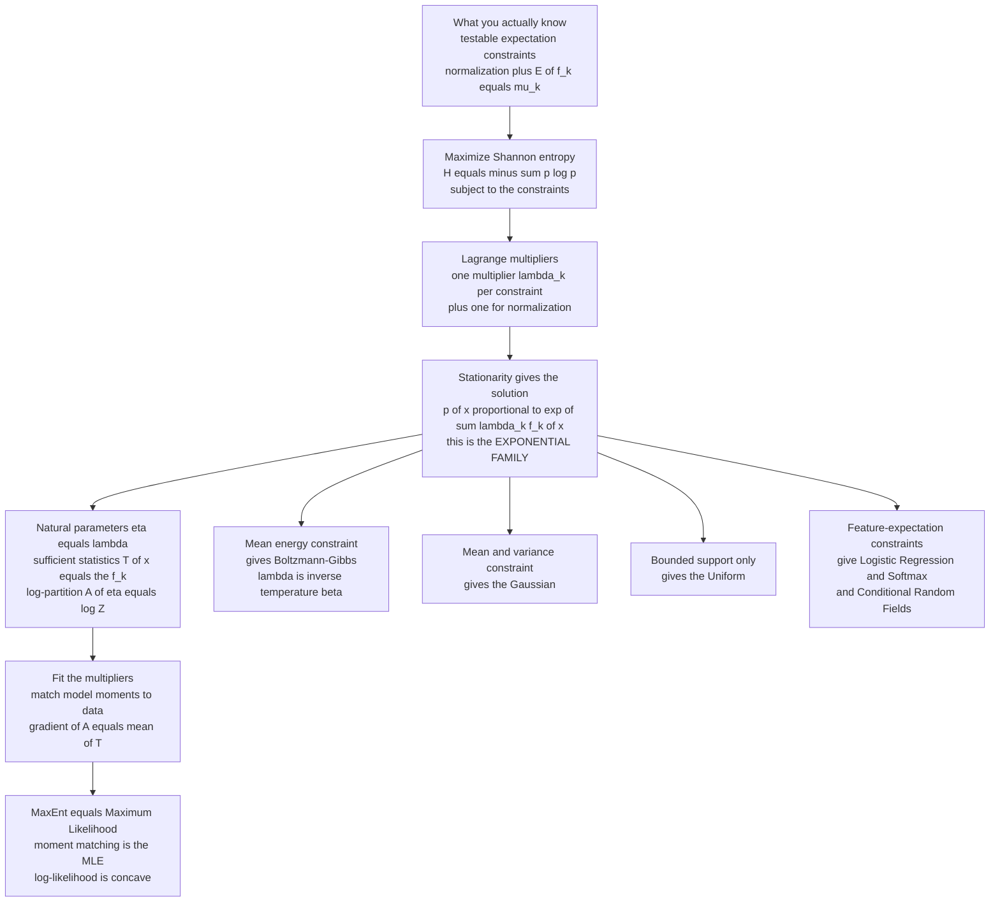

# 🎲 Maximum Entropy and Exponential Families

> [!abstract] TL;DR
> When only partial information pins down a probability distribution, infinitely many candidates fit. Jaynes' **maximum-entropy principle** selects the single *least-biased* one — the flattest, most non-committal distribution consistent with your constraints. Enforcing those constraints with **Lagrange multipliers** always yields the same shape, the **exponential family** $p(x) \propto \exp\!\big(\sum_k \lambda_k f_k(x)\big)$, where the multipliers are the **natural parameters**. This one recipe *derives* the Boltzmann distribution (mean-energy constraint), the Gaussian (mean + variance), the uniform (support only), and — in machine learning — logistic regression, softmax, CRFs, and GLMs. The **MaxEnt = maximum-likelihood duality** (moment matching) makes the family convex and tractable. It is the deepest single idea beneath the statistical-mechanics ↔ machine-learning correspondence: statistical mechanics *is* inference.

---

## Intuition

**Analogy.** You are handed a six-sided die and told exactly one fact: its rolls average **4.5**, not the fair-die 3.5. It is loaded — but *how*? Infinitely many distributions over $\{1,\dots,6\}$ have mean 4.5. Which should you assume? Quoting equal probabilities is now a lie (you'd be ignoring the fact you were given), but inventing a jagged, spiky distribution is *also* a lie — you'd be asserting structure nobody told you about. The only honest answer is the distribution that is **maximally noncommittal**: as spread-out and unassuming as possible while still averaging 4.5. That is the maximum-entropy distribution, and it is the mathematical embodiment of *"don't assume anything you haven't been told."*

The astonishing payoff: this single "assume the least" rule *derives* the great distributions of science, each as the least-biased answer to a different question. Constrain the average **energy** and out falls the **Boltzmann distribution** of physics. Constrain a mean and a variance and out falls the **Gaussian** — which is why the bell curve is everywhere. Constrain expected **features** and out falls **logistic regression** and **softmax**, the workhorses of machine learning. Different constraints, one principle, one functional form. This note is the foundation of the whole *Statistical Mechanics of Machine Learning* vault; the Boltzmann distribution, partition functions, energy-based models, and undirected graphical models that follow are all this principle wearing different clothes.

---

## How It Works

### Core Mechanics

**1. The underdetermined inference problem.** You want a distribution $p(x)$ over outcomes $x$, but the data give only $m$ *expectation constraints* — testable averages $\mathbb{E}[f_k(X)] = \mu_k$ (pick $f_1(x)=x$ to fix the mean, $f_2(x)=x^2$ to fix the variance, an indicator to fix a probability) — plus normalization $\sum_x p(x)=1$. For anything beyond one or two constraints this is wildly underdetermined. You need a principled **selection rule**.

**2. Jaynes' rule.** Among all feasible distributions, choose the one that **maximizes the Shannon entropy** $H(p) = -\sum_x p(x)\log p(x)$. Entropy is (by Shannon's axioms) the unique consistent measure of uncertainty; maximizing it means *committing to the least*. Any feasible distribution with lower entropy has smuggled in structure your data cannot justify. This generalizes Laplace's "principle of insufficient reason" (no information → uniform) to the partial-information case.

**3. The Lagrange-multiplier machinery.** Attach a multiplier $\lambda_k$ to each constraint and $\lambda_0$ to normalization, and maximize the Lagrangian

$$
\mathcal{L} = -\sum_x p(x)\log p(x) - \lambda_0\Big(\sum_x p(x)-1\Big) - \sum_{k=1}^{m}\lambda_k\Big(\sum_x p(x)f_k(x)-\mu_k\Big).
$$

Setting $\partial\mathcal{L}/\partial p(x)=0$ gives $-\log p(x) - 1 - \lambda_0 - \sum_k \lambda_k f_k(x) = 0$, hence

$$
\boxed{\,p(x) = \frac{1}{Z(\boldsymbol\lambda)}\exp\!\Big(\sum_{k=1}^m \lambda_k f_k(x)\Big),\qquad Z(\boldsymbol\lambda)=\sum_x \exp\!\Big(\sum_k \lambda_k f_k(x)\Big).\,}
$$

The MaxEnt solution is **always of exponential-family form**. The multipliers $\lambda_k$ are *not free*: they are pinned so that $\mathbb{E}[f_k(X)]=\mu_k$. In physics these multipliers are named quantities — the inverse temperature $\beta$ (multiplier on energy) and the chemical potential $\mu/T$ (multiplier on particle number). See the Lagrange/convex machinery in [[Optimization_Theory]].

**4. The exponential family, cleanly.** Rewriting with $\eta=\boldsymbol\lambda$ gives the canonical parameterization

$$
p(x) = h(x)\,\exp\!\big(\eta\cdot T(x) - A(\eta)\big),
$$

with **natural parameters** $\eta$, **sufficient statistics** $T(x)$ (exactly the constrained functions $f_k$), base measure $h(x)$, and **log-partition function** $A(\eta)=\log Z(\eta)$. The log-partition is a **cumulant generator**: its gradient gives the mean of the sufficient statistics and its Hessian gives their covariance,
$$
\nabla_\eta A(\eta) = \mathbb{E}[T(X)],\qquad \nabla^2_\eta A(\eta)=\operatorname{Cov}(T(X))\succeq 0.
$$
Because $A$ is convex, the whole fitting problem is convex. This family contains the **Boltzmann/Gibbs, Gaussian, Bernoulli, categorical, Poisson, exponential, gamma, and beta** distributions — it is the shared backbone of statistical physics, classical statistics, and ML.

**5. Which constraint → which distribution.** Just plug different sufficient statistics into the same recipe:

| Constraints | MaxEnt distribution | Multiplier meaning |
|---|---|---|
| Bounded support only | **Uniform** $p=1/N$ | all $\lambda_k=0$ |
| Fixed mean on $\{0,1,2,\dots\}$ | **Geometric** $p_k\propto e^{-\lambda k}$ | $\lambda$ sets the mean |
| Fixed mean on $[0,\infty)$ | **Exponential** $p\propto e^{-\lambda x}$ | $\lambda$ = rate |
| Fixed mean and variance on $\mathbb{R}$ | **Gaussian** $p\propto e^{-\lambda_1 x-\lambda_2 x^2}$ | $\lambda_2 = 1/2\sigma^2$ |
| Fixed average energy $\langle E\rangle$ | **Boltzmann-Gibbs** $p_i\propto e^{-\beta E_i}$ | $\lambda=-\beta=-1/kT$ |
| Fixed expected features on labels | **Softmax / Logistic** | $\lambda$ = feature weights |

The Boltzmann row is Jaynes' bombshell: the **canonical ensemble is not a physical postulate** but the MaxEnt distribution given one number, the average energy. Statistical mechanics *is* inference; **temperature is a Lagrange multiplier**, and $-kT\log Z$ is the Helmholtz free energy. Adding a particle-number constraint yields the grand canonical ensemble (a second multiplier, the chemical potential); fixing energy exactly yields the microcanonical ensemble. This reframing — probability as *logic and inference* rather than long-run frequency — unifies the three ensembles as MaxEnt under three constraint sets, and is developed in the companion note *Statistical_Mechanics_of_Machine_Learning_Overview* and *The_Boltzmann_Distribution_in_Learning* (forthcoming in this vault).

**6. MaxEnt = Maximum Likelihood (the duality).** Fitting the multipliers of a MaxEnt model by matching constraints is *mathematically identical* to fitting an exponential-family model by **maximum likelihood**. At the MLE, the gradient condition $\nabla_\eta A(\eta) = \frac{1}{N}\sum_i T(x_i)$ says exactly: **set model expected sufficient statistics equal to empirical averages** — moment matching. Two philosophically opposite programs (MaxEnt "assume the least" vs. MaxLik "explain the data best") are Fenchel–convex duals and land on the same $\eta$. Because $A$ is convex, the log-likelihood is concave, so there are no local optima. This duality is *why* the "maximum-entropy classifier" of NLP is literally multinomial [[Logistic_Regression]], and it connects to [[Maximum_Likelihood_and_Information]].

**7. The ML incarnations.** Recognize MaxEnt / exponential family throughout machine learning: **logistic regression and softmax** (the maximum-entropy classifier under feature-expectation constraints), **conditional random fields** and **Markov random fields** (exponential-family models over graphs — see the forthcoming *Markov_Random_Fields_and_Undirected_Graphical_Models*), **generalized linear models** (exponential-family regression), and **energy-based models / RBMs** which generalize them by letting the energy $-\eta\cdot T(x)$ be a learned neural network (see *Energy_Based_Models* and *Partition_Functions_and_Free_Energy_in_ML*, forthcoming). In every case the intractable object is the same partition function $Z$ that plagues physics.

### Flow / Architecture



---

## Key Concepts

### Secondary (intuitive)
- **Least-biased choice:** MaxEnt picks the flattest, most spread-out distribution that still respects your facts — it never invents structure you did not measure.
- **No information → uniform:** with only a list of outcomes and nothing else, the honest answer is "all equally likely"; MaxEnt is the disciplined generalization of that instinct.
- **One fact changes the shape:** add a known average and the flattest-consistent distribution tilts *just enough* to obey it and no more.
- **Familiar curves are not arbitrary:** the Gaussian, the exponential, the uniform are the *maximally honest* answers to "known variance," "known mean," "known range."

### Undergraduate
- **The variational problem:** maximize $H(p)=-\sum p\log p$ subject to $\sum p=1$ and $\mathbb{E}[f_k]=\mu_k$. Convex objective + linear constraints ⇒ unique solution.
- **Exponential-family solution:** $p(x)=h(x)\exp(\eta\cdot T(x)-A(\eta))$; the sufficient statistics $T$ are exactly the constrained functions.
- **Log-partition bookkeeping:** $A(\eta)=\log Z$ is the cumulant generating function; $\nabla A=\mathbb{E}[T]$ and $\nabla^2 A=\operatorname{Cov}(T)$. Fitting $\eta$ is convex.
- **Standard derivations to know cold:** uniform (support only), geometric/exponential (mean), Gaussian (mean + variance), Laplace (mean absolute deviation), Bernoulli/categorical (indicator constraints), Boltzmann (average energy).
- **GLMs:** generalized linear models are exponential-family regression — the "link function" is just the map from linear predictor to natural parameter.

### Graduate
- **MaxEnt = I-projection:** the MaxEnt distribution is the information (KL) projection of the base measure onto the linear family of constraint-satisfying distributions; a Pythagorean identity $D(p\|q)=D(p\|p^\star)+D(p^\star\|q)$ holds for any feasible $p$ (connect to [[Relative_Entropy_and_Cross_Entropy]]).
- **Convex duality:** the MaxEnt primal and the maximum-likelihood dual are Fenchel duals; strong duality gives equality of the optimal natural parameters, the theoretical basis of MaxEnt logistic/softmax classifiers.
- **Concentration (Jaynes / Csiszár / Sanov):** the number of length-$n$ sequences with empirical distribution near a feasible $p$ scales as $e^{nH(p)}$, so types far from the MaxEnt distribution are exponentially rare — the rigorous reason equilibrium *is* the MaxEnt state (method of types).
- **Statistical mechanics as inference:** canonical $p_i\propto e^{-\beta E_i}$ maximizes entropy at fixed $\langle E\rangle$; $\beta$ is a multiplier, $\log Z$ is $-\beta$ times the free energy, thermodynamic identities are cumulant relations of $\log Z$. See [[Classical_Statistical_Mechanics]] and [[Thermodynamic_Potentials]].
- **Curved vs. flat, mean vs. natural parameters:** exponential families carry a rich information-geometric structure — the Fisher metric is $\nabla^2 A$, and the natural ($\eta$) and mean ($\mu=\mathbb{E}[T]$) parameters are Legendre-dual coordinates.
- **Maximum Caliber:** the extension of MaxEnt from *distributions over states* to *distributions over trajectories*, giving a variational route to non-equilibrium and dynamical inference.

---

## Python Demo

```python
# Maximum entropy and exponential families, end to end (numpy + matplotlib).
#   (a) MAXENT derivation: solve p_i ~ exp(-lambda * x_i) for the single Lagrange
#       multiplier that matches a target mean -> the Boltzmann/exponential shape.
#   (b) A variance constraint -> exactly the Gaussian.
#   (c) MaxEnt = MaxLik duality: the MLE of an exponential family sits where the
#       model mean equals the empirical mean (moment matching).
#   (d) Logistic regression IS the MaxEnt model given expected-feature constraints:
#       at the optimum the model's feature expectations match the empirical ones.
import numpy as np
import matplotlib.pyplot as plt

rng = np.random.default_rng(0)

# ---- (a) MAXENT with a mean constraint  ->  BOLTZMANN  p_i ~ exp(-beta x_i) ----
K = 30
x = np.arange(K)                                   # "energy levels" 0..K-1

def maxent_mean(lmbda):
    w = np.exp(-lmbda * x); p = w / w.sum()
    return (x * p).sum(), p

def solve_lambda(target, lo=-5.0, hi=5.0):         # E[x] decreases in lambda -> bisect
    for _ in range(200):
        mid = 0.5 * (lo + hi)
        m, _ = maxent_mean(mid)
        lo, hi = (mid, hi) if m > target else (lo, mid)
    return 0.5 * (lo + hi)

boltz = {}
for t in (3.0, 7.0, 12.0):
    lam = solve_lambda(t); m, p = maxent_mean(lam); boltz[t] = (lam, p)
    print(f"(a) target mean={t:4.1f} -> lambda(beta)={lam:+.4f}  achieved={m:.4f}")

# ---- (b) VARIANCE constraint  ->  GAUSSIAN  p(x) ~ exp(-lam2 * x^2) ------------
xs, s2 = np.linspace(-6, 6, 2000), 1.7
lam2 = 1.0 / (2.0 * s2)                             # multiplier for E[x^2] = s2
g = np.exp(-lam2 * xs**2); g /= np.trapz(g, xs)     # MaxEnt density (normalized)
gauss = np.exp(-xs**2 / (2*s2)) / np.sqrt(2*np.pi*s2)
print(f"(b) variance target={s2}: max|MaxEnt - Gaussian| = {np.max(np.abs(g-gauss)):.2e}")

# ---- (c) MaxEnt = MaxLik duality for an exponential family  p_i ~ exp(eta x_i) -
eta_true = -0.35
p_true = np.exp(eta_true * x); p_true /= p_true.sum()
data = rng.choice(x, size=4000, p=p_true); emp_mean = data.mean()

def loglik(eta):
    logZ = np.log(np.exp(eta * x).sum())
    return (eta * data).sum() - len(data) * logZ

def model_mean(eta):
    w = np.exp(eta * x); p = w / w.sum(); return (x * p).sum()

etas = np.linspace(-0.8, 0.1, 400)
lls = np.array([loglik(e) for e in etas]); eta_mle = etas[np.argmax(lls)]
print(f"(c) empirical mean={emp_mean:.4f}  model mean at MLE={model_mean(eta_mle):.4f}"
      f"  (moment matching)")

# ---- (d) LOGISTIC REGRESSION as MaxEnt: sum y*phi == sum p*phi at the optimum --
n = 800
X = np.column_stack([np.ones(n), rng.normal(size=n), rng.normal(size=n)])
w_star = np.array([0.4, 1.5, -1.0])
y = (rng.random(n) < 1/(1+np.exp(-X @ w_star))).astype(float)
w = np.zeros(3)
for _ in range(4000):                              # gradient ascent on log-likelihood
    p = 1/(1+np.exp(-X @ w))
    w += 0.01 * (X.T @ (y - p))                     # grad = empirical - model feature sums
p = 1/(1+np.exp(-X @ w))
emp_feat, mod_feat = X.T @ y, X.T @ p
print("(d) logistic regression = MaxEnt (feature-expectation matching):")
for j in range(3):
    print(f"    feature {j}: empirical={emp_feat[j]:+.3f}  model={mod_feat[j]:+.3f}")

# ---- figure -------------------------------------------------------------------
fig, ax = plt.subplots(2, 2, figsize=(13, 9))
colors = ["#c0392b", "#2980b9", "#27ae60"]
for (t, (lam, p)), c in zip(boltz.items(), colors):
    ax[0,0].plot(x, p, "o-", ms=4, color=c, label=f"mean={t}  beta={lam:+.2f}")
ax[0,0].set_title("(a) mean constraint -> Boltzmann  p_i ~ exp(-beta x_i)")
ax[0,0].set_xlabel("energy level x_i"); ax[0,0].set_ylabel("p_i"); ax[0,0].legend()

ax[0,1].plot(xs, g, color="#c0392b", lw=3, label="MaxEnt exp(-lam2 x^2)")
ax[0,1].plot(xs, gauss, "k--", lw=1.5, label="analytic Gaussian")
ax[0,1].set_title("(b) mean + variance constraint -> Gaussian")
ax[0,1].set_xlabel("x"); ax[0,1].set_ylabel("density"); ax[0,1].legend()

ax[1,0].plot(etas, lls - lls.max(), color="#8e44ad", lw=2)
ax[1,0].axvline(eta_mle, color="#c0392b", ls="--", label=f"MLE eta={eta_mle:.3f}")
ax[1,0].axvline(eta_true, color="#27ae60", ls=":", label=f"true eta={eta_true:.2f}")
ax[1,0].set_title("(c) MaxEnt = MaxLik: peak where model mean = empirical mean")
ax[1,0].set_xlabel("natural parameter eta"); ax[1,0].set_ylabel("log-lik (shifted)")
ax[1,0].legend()

idx, wdt = np.arange(3), 0.35
ax[1,1].bar(idx-wdt/2, emp_feat, wdt, color="#2980b9", label="empirical  sum y*phi")
ax[1,1].bar(idx+wdt/2, mod_feat, wdt, color="#e67e22", label="model  sum p*phi")
ax[1,1].set_title("(d) logistic regression as MaxEnt: feature expectations match")
ax[1,1].set_xticks(idx); ax[1,1].set_xticklabels(["bias", "feat 1", "feat 2"])
ax[1,1].set_ylabel("feature expectation"); ax[1,1].legend()

plt.tight_layout(); plt.show()
```

**What you should see.** **(a)** A single tuned multiplier reproduces the target mean exactly, and the resulting $p_i\propto e^{-\beta x_i}$ is the Boltzmann/geometric shape — larger target means need smaller (even negative) $\beta$. **(b)** The density built purely from the recipe $e^{-\lambda_2 x^2}$ overlays the analytic Gaussian to machine precision: the bell curve *is* the MaxEnt answer for a fixed mean and variance. **(c)** The concave log-likelihood of the exponential family peaks precisely where the model mean equals the empirical mean — MaxEnt (constraint matching) and MaxLik (data fitting) coincide. **(d)** After training, the model's expected feature vector equals the empirical feature vector component-by-component — logistic regression is the maximum-entropy model under expected-feature constraints.

---

## Real-World Applications

> **Example (statistical mechanics — the founding case):** The Boltzmann-Gibbs distribution $p_i\propto e^{-\beta E_i}$ and its partition function $Z=\sum_i e^{-\beta E_i}$ — the entire canonical ensemble of [[Classical_Statistical_Mechanics]] — is *exactly* the MaxEnt distribution given one constraint, the average energy $\langle E\rangle$. Jaynes' 1957 papers recast thermodynamics as a corollary of honest inference: temperature $1/kT$ is the Lagrange multiplier on energy and free energy is $-kT\log Z$.

- **NLP maximum-entropy classifiers:** part-of-speech tagging, text classification, and language modeling built pre-neural systems on the MaxEnt/"logistic" model under feature-expectation constraints. By the duality this is precisely multinomial [[Softmax_and_Sigmoid]] / [[Logistic_Regression]] — still the output layer of nearly every neural classifier.
- **Ecology — species distribution modeling:** the widely cited *MaxEnt / Maxent* software estimates a species' geographic range from presence-only records by finding the max-entropy distribution over the landscape whose environmental-feature averages match the observations.
- **Neuroscience — neural population activity:** Schneidman, Berry, Segev, and Bialek (2006) showed that the max-entropy model matching only pairwise correlations of retinal ganglion cells — a **pairwise Ising / Markov random field** — accurately predicts the collective spiking of ~40 neurons, a direct import of statistical mechanics into systems neuroscience.
- **Image reconstruction and spectral estimation:** MaxEnt deconvolution reconstructs astronomical and medical images (and the Burg method reconstructs power spectra) as the smoothest object consistent with noisy, incomplete measurements — foundational in radio astronomy and interferometric imaging.
- **Modern ML backbone:** generalized linear models are exponential-family regression; conditional random fields and Markov random fields are exponential-family graphical models; and energy-based models / RBMs generalize the family by learning the energy with a neural net — all sharing the intractable partition function studied in the forthcoming *Partition_Functions_and_Free_Energy_in_ML* and *Energy_Based_Models*.

---

## Common Pitfalls

- **Thinking MaxEnt is assumption-free.** It is least-biased only *relative to the constraints and base measure you chose*. Deciding which averages $f_k$ to constrain is a real modeling act MaxEnt does not perform for you — bad constraints give bad distributions.
- **Ignoring the base measure on continuous spaces.** Raw differential entropy is coordinate-dependent, so "maximize entropy" is ill-posed until you fix a reference measure $h(x)$. Use the minimum-relative-entropy form $-\int p\log(p/h)$ or your answer changes under a change of variables.
- **Assuming MaxEnt always means uniform.** Uniform is MaxEnt *only* when the sole constraint is bounded support. A mean gives exponential/geometric; a mean and variance give Gaussian. The constraints determine the shape.
- **Treating natural parameters as free knobs.** The $\lambda_k$ are pinned by moment matching, not tuned to taste. Leaving them unfit yields a distribution that does not actually satisfy your constraints.
- **Non-existence / non-normalizability.** If the constraints are infeasible or a moment is unbounded (e.g. demanding a finite mean on an unbounded support with no decay), the log-partition diverges and there is no valid MaxEnt distribution.
- **The partition function is the wall.** The elegance ($p\propto e^{\eta\cdot T}$) hides that $Z=\sum e^{\eta\cdot T(x)}$ is generally intractable for high-dimensional models (MRFs, RBMs); this is exactly why physics-borrowed tricks (mean-field, MCMC, variational free energy) reappear in ML.
- **Confusing description-entropy with physical disorder.** MaxEnt maximizes uncertainty in *your description* given constraints; it is a statement about honest inference, not a claim that nature is maximally disordered.

---

## Related Concepts

- [[Maximum_Entropy_Principle]] — the information-theory home of this idea; this note is its statistical-mechanics-and-ML specialization, sharing the Lagrange-multiplier derivation.
- [[Classical_Statistical_Mechanics]] — the canonical ensemble $p_i\propto e^{-\beta E_i}$ and its partition function $Z$ are the MaxEnt distribution at fixed average energy; temperature is a multiplier.
- [[Entropy_and_Second_Law]] — the thermodynamic entropy whose equilibrium maximization is the physical face of the MaxEnt concentration argument.
- [[Thermodynamic_Potentials]] — $-kT\log Z$ is the Helmholtz free energy; the log-partition of the exponential family is (minus $\beta$ times) a free energy.
- [[Logistic_Regression]] — the multinomial/softmax classifier *is* the MaxEnt model under feature-expectation constraints (MaxEnt = MaxLik duality).
- [[Softmax_and_Sigmoid]] — the softmax is the exponential-family / Gibbs form over categories; logits are natural parameters and the normalizer is a partition function.
- [[Naive_Bayes]] — a generative exponential-family classifier; contrast its class-conditional modeling with the discriminative MaxEnt (logistic) fit.
- [[Maximum_Likelihood_and_Information]] — the dual view: fitting an exponential family by maximum likelihood recovers the same parameters as MaxEnt constraint matching.
- [[Relative_Entropy_and_Cross_Entropy]] — MaxEnt is minimum-KL to the base measure; the general minimum-cross-entropy form fixes continuous well-posedness and reveals the duality.
- [[Entropy_and_Information_Content]] — Shannon entropy $H=-\sum p\log p$ is the exact objective MaxEnt maximizes.
- [[Common_Probability_Distributions]] — the uniform, exponential, Gaussian, Poisson, and Bernoulli are catalogued here; MaxEnt explains *why* each is the natural answer to its constraint.
- [[Bayesian_Statistics]] — MaxEnt and its transformation-group refinements supply "uninformative" reference priors as least-committal starting beliefs.
- [[Optimization_Theory]] — the Lagrange-multiplier and convex-duality machinery that make the exponential family tractable.

---

## Review Questions

1. **(Secondary)** A six-sided die is loaded so its rolls average 4.5 instead of 3.5, and you are told nothing else. Explain, without equations, why quoting a uniform distribution is now dishonest *and* why inventing a spiky distribution is equally dishonest — and describe qualitatively how the maximum-entropy distribution should look.
2. **(Undergraduate)** Using Lagrange multipliers, derive the maximum-entropy distribution on $\mathbb{R}$ subject to a fixed mean and variance, and show it is Gaussian. Identify what each multiplier controls, and state which single constraint you would drop to instead obtain (a) the exponential distribution and (b) the uniform distribution. Then explain why the resulting $p(x)\propto e^{\eta\cdot T(x)}$ is called an exponential family.
3. **(Graduate)** Explain in precise terms the claim "statistical mechanics is maximum-entropy inference." Address: (a) which constraint yields the canonical ensemble $p_i\propto e^{-\beta E_i}$; (b) what $\beta$ and $\log Z$ correspond to thermodynamically; (c) the MaxEnt = maximum-likelihood duality and why it makes exponential families convex; and (d) using the concentration / method-of-types argument, why the MaxEnt macrostate is not merely convenient but overwhelmingly the most probable as the number of particles grows.

---

## Sources

- Jaynes, E. T. (1957). "Information Theory and Statistical Mechanics." *Physical Review* 106, 620–630; Part II, *Phys. Rev.* 108, 171–190. (The founding reinterpretation of statistical mechanics as inference.)
- Jaynes, E. T. (2003). *Probability Theory: The Logic of Science*. Cambridge University Press. (MaxEnt, concentration, and priors.)
- Wainwright, M. J., & Jordan, M. I. (2008). "Graphical Models, Exponential Families, and Variational Inference." *Foundations and Trends in Machine Learning* 1(1–2), 1–305.
- Berger, A. L., Della Pietra, S. A., & Della Pietra, V. J. (1996). "A Maximum Entropy Approach to Natural Language Processing." *Computational Linguistics* 22(1), 39–71.
- Schneidman, E., Berry, M. J., Segev, R., & Bialek, W. (2006). "Weak Pairwise Correlations Imply Strongly Correlated Network States in a Neural Population." *Nature* 440, 1007–1012.
- Cover, T. M., & Thomas, J. A. (2006). *Elements of Information Theory* (2nd ed.), Ch. 12 (Maximum Entropy). Wiley-Interscience.

---

#statistical-mechanics #machine-learning #maximum-entropy #exponential-family #jaynes
