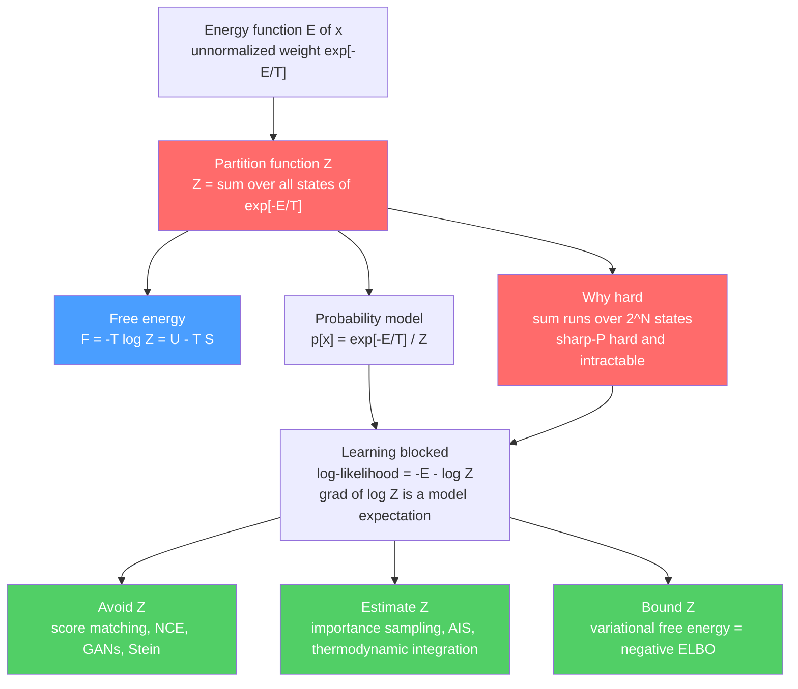

# 🧮 Partition Functions and Free Energy in ML

> [!abstract] TL;DR
> To turn an energy $E(x)$ into a probability you divide by the **partition function** $Z = \sum_x e^{-E(x)/T}$ — the sum of Boltzmann weights over *every* configuration. For $N$ binary units that is a sum over $2^N$ states, more than the atoms in the universe by $N \approx 270$, and computing it is in general **#P-hard**. Its logarithm is the **free energy** $F = -T\log Z = U - TS$, which trades low energy against high entropy; the *log-partition function* $\log Z$ is a cumulant generator whose derivatives give the mean energy and its fluctuations. This one intractable sum is the shared villain of statistical mechanics and machine learning: it normalizes every **energy-based model**, blocks maximum-likelihood training (its gradient is an expectation *under the model* that requires sampling), and reappears as the **evidence** in Bayesian inference. ML answers with a three-part toolkit — **avoid** $Z$ (score matching, noise-contrastive estimation, GANs), **estimate** $Z$ (importance sampling, annealed importance sampling, thermodynamic integration), or **bound** $Z$ (variational free energy, which is exactly the negative ELBO of VAEs).

---

## Intuition

**Analogy — the impossible headcount.** Imagine you want the probability that a stadium crowd is arranged in one *specific* pattern of standing-and-sitting fans. The chance of that pattern is its "weight" divided by the total weight of *all* possible patterns. Easy to say — but with only a few hundred seats the number of possible patterns already exceeds the number of atoms in the observable universe. You cannot enumerate them, yet without that grand total you cannot report a single honest probability. That grand total is the **partition function** $Z$, and its impossibility is the whole story.

In statistical physics $Z$ is the denominator that makes the Boltzmann distribution $p(x) = e^{-E(x)/T}/Z$ a valid probability. In machine learning the *identical object* is the normalizing constant of any **energy-based model**: you can write down an unnormalized score $e^{-E(x)}$ for every data point trivially, but you cannot say how *likely* that point is until you have divided by $Z$ — and $Z$ is a sum over the exponentially large space of everything the model could have generated. Almost every hard problem in probabilistic ML — training a Boltzmann machine, evaluating a likelihood, computing a Bayesian evidence — is secretly the same problem: compute, or cleverly dodge, this one monstrous sum.

---

## How It Works

### Core Mechanics

1. **From energy to probability.** Assign every configuration $x$ a scalar **energy** $E(x)$. Low energy = plausible, high energy = implausible. The **Boltzmann (Gibbs) distribution** at temperature $T$ (with $\beta = 1/T$) is
$$p(x) = \frac{e^{-E(x)/T}}{Z}, \qquad Z = \sum_{x} e^{-E(x)/T} \;\;\text{(or } \int e^{-E(x)/T}\,dx \text{ for continuous } x).$$
$Z$ is whatever number makes the probabilities sum to one. Nothing else in the model needs it — but *normalization* does.

2. **Why $Z$ is the wall.** The sum runs over the **entire state space**. For $N$ binary units there are $2^N$ terms; for continuous $x$ it is a high-dimensional integral with no closed form. Exact evaluation is **#P-hard** in general (counting is at least as hard as the corresponding NP decision problem). This is not a coding inconvenience — it is a complexity-theoretic wall.

3. **Free energy is $\log Z$ in disguise.** Define the **Helmholtz free energy**
$$F = -T \log Z = \underbrace{\langle E \rangle}_{U,\;\text{energy}} - \; T \underbrace{S}_{\text{entropy}}.$$
Equilibrium *minimizes* free energy: the system compromises between rolling into low-energy states (small $U$) and spreading over many states (large $S$). Minimizing $F$ **is** the physical principle of equilibrium, and it will return as an optimization objective in ML.

4. **$\log Z$ is a cumulant generating function.** Treat $\log Z$ as a function of $\beta$. Its derivatives peel off the moments of the energy:
$$\langle E \rangle = -\frac{\partial \log Z}{\partial \beta}, \qquad \operatorname{Var}(E) = \frac{\partial^2 \log Z}{\partial \beta^2} = \frac{C}{k_B\beta^2}.$$
The first derivative gives the mean energy; the second gives energy *fluctuations* (a susceptibility / heat capacity). The log-partition function encodes the whole thermodynamics.

5. **The likelihood connection — why learning stalls.** An energy-based model with parameters $\theta$ has log-likelihood
$$\log p_\theta(x) = -E_\theta(x) - \log Z(\theta).$$
You cannot even *evaluate* this without $\log Z$. Worse, its gradient splits into two "phases":
$$\nabla_\theta \log p_\theta(x) = \underbrace{-\nabla_\theta E_\theta(x)}_{\text{positive phase (data)}} \;+\; \underbrace{\mathbb{E}_{x'\sim p_\theta}\!\big[\nabla_\theta E_\theta(x')\big]}_{\text{negative phase (model)}}.$$
The **negative phase** is an expectation *under the model itself* — an average over that same intractable $2^N$ space — so every gradient step needs samples from $p_\theta$. This is the crux of EBM training and the reason **contrastive divergence** exists (see the sibling note **Contrastive_Divergence_and_EBM_Training**).

6. **The three strategies.** Because $Z$ is intractable, ML never computes it head-on in practice. It **avoids** it, **estimates** it, or **bounds** it — the toolkit detailed below.

### Strategy 1 — Avoid $Z$ entirely

If you only need the *gradient* of $\log p$ with respect to $x$, the constant $Z$ vanishes: $\nabla_x \log p(x) = -\nabla_x E(x)$, independent of $Z$. **Score matching** (Hyvärinen) learns this gradient directly and never touches $Z$. **Noise-contrastive estimation** and other **ratio methods** turn density estimation into a classification problem (real vs. noise) where only *ratios* of densities appear and $Z$ cancels. **GANs** sidestep density altogether with an implicit sampler, and **Stein methods** use $Z$-free discrepancies. See **Energy_Based_Models** for how these compose.

### Strategy 2 — Estimate $Z$

When you need an actual likelihood number (e.g. to *compare* models), estimate $Z$ statistically. Naive **Monte Carlo / importance sampling** writes $Z = Z_0\,\mathbb{E}_{q}[e^{-E(x)/T}/q(x)]$ for a tractable proposal $q$ with known $Z_0$ — but the variance explodes when $q$ is far from the target. **Annealed importance sampling (AIS, Neal 2001)** and **thermodynamic integration** fix this by walking from a tractable distribution to the target through a chain of intermediate "temperatures," accumulating importance weights (AIS) or integrating the average energy along the path (thermodynamic integration). These are the gold-standard estimators for reporting model log-likelihoods and Bayes factors — the subject of the sibling **Free_Energy_Estimation_and_Thermodynamic_Integration**.

### Strategy 3 — Bound $Z$

Introduce a tractable distribution $q(x)$ and apply Jensen's inequality:
$$\log Z \;\ge\; \mathbb{E}_q[-E(x)/T] + H[q] \;\equiv\; -F_{\text{var}}[q].$$
The right-hand side is the negative **variational free energy**. Maximizing it (over $q$) tightens a *lower bound* on $\log Z$. In inference this is exactly the **ELBO**: for a latent-variable model the evidence $p(x)$ is a partition function, and $\log p(x) \ge \text{ELBO}(q)$ with equality gap $\mathrm{KL}(q\,\|\,p(z\mid x))$. **Mean-field** and **variational inference** minimize this variational free energy — see **Free_Energy_Minimization_and_Variational_Principles** and **Variational_Inference_as_Free_Energy_Minimization**.

### Flow / Architecture



---

## Key Concepts

### Secondary Level

- **Partition function $Z$** — the total "weight" you divide by so that probabilities add up to one; a sum of $e^{-E/T}$ over all possible arrangements.
- **Energy $E(x)$** — a score where *low* means *likely*. Any pattern can be assigned one cheaply.
- **The catch** — with $N$ on/off switches there are $2^N$ arrangements, so the total is impossible to add up directly.
- **Free energy $F$** — a single number, $F=-T\log Z$, summarizing the whole system by balancing "low energy" against "many possibilities."

### Undergraduate Level

- **Boltzmann distribution** $p(x)=e^{-E(x)/T}/Z$ and the canonical ensemble (see [[Classical_Statistical_Mechanics]]).
- **$F = U - TS$** — free energy as energy minus temperature times entropy; equilibrium minimizes $F$ (see [[Thermodynamic_Potentials]]).
- **$\log Z$ as a moment generator** — $\langle E\rangle = -\partial_\beta \log Z$, $\operatorname{Var}(E)=\partial_\beta^2 \log Z$.
- **Energy-based models** — unnormalized $\tilde p(x)=e^{-E_\theta(x)}$; the likelihood needs $\log Z(\theta)$, which is why direct MLE is hard.
- **Importance sampling for $Z$** — reweighting samples from a tractable proposal; works only when proposal and target overlap.

### Graduate Level

- **#P-hardness** — exact evaluation of $Z$ for general graphical models (e.g. the Ising partition function on non-planar graphs) is #P-complete; hence the reliance on approximation.
- **Positive and negative phases** — the log-likelihood gradient $-\nabla_\theta E(x) + \mathbb{E}_{p_\theta}[\nabla_\theta E]$; the model-expectation term motivates MCMC and contrastive divergence.
- **Annealed importance sampling** — a sequence of bridging distributions $p_0 \to \cdots \to p_n$ with per-step Markov transitions; the product of intermediate weight ratios is an unbiased estimator of $Z_n/Z_0$.
- **Thermodynamic integration** — $\log\frac{Z_1}{Z_0} = -\int_0^1 \langle E\rangle_\lambda \, d\lambda$; integrate the average energy along an annealing path.
- **Variational free energy $=$ negative ELBO** — the Gibbs–Bogoliubov–Feynman bound $F \le F_{\text{var}}[q] = \langle E\rangle_q - T H[q]$ is *identical* to $-\text{ELBO}$; mean-field VI, VAEs, and the free-energy principle are one idea (see [[Variational_Inference_the_ELBO_and_VAEs]]).

---

## Python Demo

```python
# Partition function and free energy for a 1D Ising chain (energy-based model):
#   (a) EXACT thermodynamics by brute-force summation over all 2^N states
#       -> Z, free energy F = -T log Z, average energy U, entropy S vs temperature T
#   (b) INTRACTABILITY (cost ~ 2^N) and an ESTIMATOR (Annealed Importance Sampling)
#       -> estimate log Z for the SAME system and compare to the exact value
import numpy as np
import matplotlib.pyplot as plt

rng = np.random.default_rng(0)
J = 1.0                      # ferromagnetic coupling
N = 14                       # spins: 2^14 = 16384 states (still brute-forceable for a check)

# ---------- exact enumeration of all 2^N states ----------
def all_states(n):
    idx = np.arange(2 ** n)
    bits = (idx[:, None] >> np.arange(n)[None, :]) & 1
    return 1 - 2 * bits                          # map bit 0 -> +1, bit 1 -> -1

def chain_energy(states, J):
    # E(s) = -J * sum_i s_i s_{i+1}  (periodic boundary)
    return -J * np.sum(states * np.roll(states, -1, axis=1), axis=1)

states = all_states(N)
E_all  = chain_energy(states, J).astype(float)   # energy of every configuration

def exact_thermo(E_all, T):
    """Exact Z, F, U, S at temperature T via log-sum-exp (stable)."""
    a = -E_all / T
    amax = a.max()
    logZ = amax + np.log(np.sum(np.exp(a - amax)))   # log partition function
    p = np.exp(a - logZ)                             # Boltzmann probabilities
    U = np.sum(p * E_all)                            # average energy <E>
    F = -T * logZ                                    # Helmholtz free energy
    S = (U - F) / T                                  # since F = U - T*S
    return logZ, F, U, S

temps = np.linspace(0.3, 5.0, 40)
logZ_ex, F_ex, U_ex, S_ex = np.array([exact_thermo(E_all, T) for T in temps]).T

# ---------- (b) an ESTIMATOR: Annealed Importance Sampling for log Z ----------
def metropolis_sweep(state, beta_eff, J, rng):
    n = state.size
    for i in range(n):
        left, right = state[(i - 1) % n], state[(i + 1) % n]
        dE = 2.0 * J * state[i] * (left + right)     # energy change if spin i flips
        if dE <= 0 or rng.random() < np.exp(-beta_eff * dE):
            state[i] = -state[i]
    return state

def ais_logZ(T, n_runs=120, n_inter=60, n_sweeps=3):
    """Estimate log Z at temperature T. Base = uniform spins (Z0 = 2^N)."""
    betas = np.linspace(0.0, 1.0, n_inter)           # anneal 0 (uniform) -> 1 (target)
    log_w = np.zeros(n_runs)
    for r in range(n_runs):
        s = rng.choice(np.array([-1, 1]), size=N)    # sample from base (beta=0, uniform)
        for j in range(1, n_inter):
            E = chain_energy(s[None, :], J)[0]
            log_w[r] += -(betas[j] - betas[j - 1]) * E / T   # accumulate weight
            s = metropolis_sweep(s, betas[j] / T, J, rng)    # transition at new beta
    # log Z = log(Z0) + log-mean-exp(log_w),  Z0 = 2^N
    m = log_w.max()
    logZ = N * np.log(2.0) + m + np.log(np.mean(np.exp(log_w - m)))
    return logZ

T_est = temps[::5]                                   # estimate at a subset of temperatures
logZ_ais = np.array([ais_logZ(T) for T in T_est])
logZ_ref = np.array([exact_thermo(E_all, T)[0] for T in T_est])

print("System size N =", N, " -> state space 2^N =", 2 ** N)
for T, e, a in zip(T_est, logZ_ref, logZ_ais):
    print(f"T={T:4.2f}  exact log Z={e:8.3f}  AIS log Z={a:8.3f}  err={abs(e-a):.3f}")

# ---------- plots ----------
fig, ax = plt.subplots(2, 2, figsize=(12, 9))

ax[0, 0].plot(temps, F_ex, label="Free energy  F = -T log Z", lw=2)
ax[0, 0].plot(temps, U_ex, label="Average energy  U = <E>", lw=2)
ax[0, 0].plot(temps, U_ex - F_ex, "--", label="T*S = U - F", lw=2)
ax[0, 0].set(xlabel="Temperature T", ylabel="energy", title="(a) Thermodynamics from Z")
ax[0, 0].legend(); ax[0, 0].grid(alpha=0.3)

ax[0, 1].plot(temps, S_ex, color="crimson", lw=2)
ax[0, 1].axhline(N * np.log(2), ls=":", color="gray", label="max entropy = N ln 2")
ax[0, 1].set(xlabel="Temperature T", ylabel="entropy S (nats)",
             title="(a) Entropy: 0 at low T, N ln 2 at high T")
ax[0, 1].legend(); ax[0, 1].grid(alpha=0.3)

ax[1, 0].plot(temps, logZ_ex, color="k", lw=2, label="exact log Z")
ax[1, 0].scatter(T_est, logZ_ais, color="orange", zorder=5, s=55,
                 label="AIS estimate")
ax[1, 0].set(xlabel="Temperature T", ylabel="log Z",
             title="(b) Estimator vs exact: AIS sidesteps the sum")
ax[1, 0].legend(); ax[1, 0].grid(alpha=0.3)

Ns = np.arange(1, 61)
ax[1, 1].semilogy(Ns, 2.0 ** Ns, color="purple", lw=2)
ax[1, 1].axhline(1e23, ls=":", color="gray", label="~ atoms in a mole")
ax[1, 1].set(xlabel="number of binary units N", ylabel="states  2^N (log scale)",
             title="(b) Intractability: cost of exact Z explodes as 2^N")
ax[1, 1].legend(); ax[1, 1].grid(alpha=0.3, which="both")

plt.tight_layout()
plt.savefig("partition_function_free_energy.png", dpi=110)
print("saved partition_function_free_energy.png")
```

**What it shows.** Part (a) computes the *exact* partition function by brute force for a 14-spin chain and derives free energy, average energy, and entropy as functions of temperature — the entropy climbs from near zero (frozen into the ground state) to the ceiling $N\ln 2$ (all $2^N$ states equally likely), and $F = U - TS$ holds at every point. Part (b) makes the wall visible ($2^N$ blows past a mole of atoms by $N\approx 78$) and then shows **annealed importance sampling** recovering $\log Z$ to within a small error *without ever summing all states* — the exact move ML uses to evaluate models it cannot normalize.

---

## Real-World Applications

- **Training and evaluating energy-based models & Boltzmann machines.** The intractable $\log Z$ gradient (its "negative phase") is what contrastive divergence and persistent CD approximate; reported test log-likelihoods for RBMs and deep Boltzmann machines are produced by AIS estimates of $Z$.
- **Comparing deep generative models.** Log-likelihood benchmarks for VAEs, normalizing flows, and score/diffusion models rely on either exact normalizers (flows) or AIS/bridge-sampling estimates of $Z$ — see [[Diffusion_Models]] and [[Variational_Autoencoders]].
- **Bayesian model selection.** The **evidence** (marginal likelihood) $p(\mathcal{D}) = \int p(\mathcal{D}\mid\theta)p(\theta)\,d\theta$ *is* a partition function; **Bayes factors** are ratios of two such $Z$'s, estimated with thermodynamic integration or nested sampling (see [[Bayesian_Statistics]]).
- **Molecular simulation & drug binding.** **Free-energy differences** between molecular states (e.g. ligand binding affinities) are computed with *the same* thermodynamic-integration and free-energy-perturbation math ML borrowed — a direct physics ↔ ML transfer.
- **Variational inference at scale.** Every VAE training step maximizes an ELBO, i.e. minimizes a variational free energy — the intractable evidence-$Z$ is bounded rather than computed (see [[Variational_Inference_the_ELBO_and_VAEs]]).

---

## Common Pitfalls

- **Forgetting $Z$ depends on the parameters.** In an EBM, $Z(\theta)$ shifts as you change $\theta$, so its gradient (the negative phase) is *not* zero. Dropping it — training on $-E_\theta(x)$ alone — collapses the model (it just drives all energies to $-\infty$).
- **Trusting naive importance sampling at low temperature.** When the proposal barely overlaps the target, a *single* sample dominates the weights; the estimate looks stable but is catastrophically biased. Use annealing (AIS) and inspect the effective sample size.
- **Confusing "unnormalized density" with "probability."** $e^{-E(x)}$ ranks configurations but says nothing about absolute likelihood until divided by $Z$; you cannot compare likelihoods across two models without each model's own $Z$.
- **Reporting AIS log-likelihoods without direction.** AIS gives a *stochastic lower bound* on $\log Z$ in one direction and an upper bound run in reverse; quoting only the forward estimate can flatter a model. Bracket with both directions (BDMC).
- **Assuming the ELBO gap is small.** Maximizing the ELBO raises a *lower* bound on $\log p(x)$; a loose variational family can leave a large, invisible gap $\mathrm{KL}(q\,\|\,p)$, so model comparison by ELBO alone can mislead.
- **Ignoring temperature/$\beta$ conventions.** Physics often writes $e^{-\beta E}$ with $\beta=1/(k_BT)$; ML frequently sets $T=1$ and folds it into $E$. Mixing conventions silently rescales energies and breaks the $F=U-TS$ bookkeeping.

---

## Related Concepts

- [[Classical_Statistical_Mechanics]] — the physics origin of $Z$, the canonical ensemble, and $F=-k_BT\ln Z$.
- [[Thermodynamic_Potentials]] — Helmholtz free energy $F=U-TS$ and why equilibrium minimizes it.
- [[Quantum_Statistical_Mechanics]] — the partition function generalized to quantum ensembles and density matrices.
- [[Entropy_and_Second_Law]] — the $S$ in $F=U-TS$; the entropy that free energy trades against.
- [[Phase_Transitions_and_Critical_Phenomena]] — singularities of $\log Z$ signal phase transitions, mirrored in learning dynamics.
- [[Variational_Inference_the_ELBO_and_VAEs]] — the negative ELBO *is* the variational free energy that bounds $\log Z$.
- [[Variational_Autoencoders]] — amortized variational free-energy minimization with neural networks.
- [[The_Free_Energy_Principle_and_Active_Inference]] — free-energy minimization as a theory of perception and action.
- [[Maximum_Entropy_Principle]] — the Boltzmann form $e^{-E/T}/Z$ arises as the max-entropy distribution under an energy constraint.
- [[Maximum_Likelihood_and_Information]] — why $\log Z$ blocks direct MLE of energy-based models.
- [[Relative_Entropy_and_Cross_Entropy]] — the KL divergence that measures the ELBO's gap to $\log Z$.
- [[Bayesian_Statistics]] — the evidence / marginal likelihood as a partition function; Bayes factors as $Z$ ratios.
- [[The_Metropolis_Algorithm_and_MCMC]] — the sampler that supplies the negative phase and drives AIS transitions.
- [[Monte_Carlo_Integration]] — the estimation backbone for intractable sums and integrals.
- [[The_Ising_Model_and_Statistical_Physics]] — the canonical model whose partition function powers the demo above.
- [[Probability_Theory]] — the normalization axiom that forces $Z$ to exist in the first place.

---

## Review Questions

**Secondary.** In one sentence, why can't you state the probability of a single configuration without first computing the partition function, and what makes that computation impossible to do by brute force for a few hundred binary units?

**Undergraduate.** Starting from $F=-T\log Z$, derive $\langle E\rangle = -\partial_\beta \log Z$ (with $\beta=1/T$) and explain what the *second* derivative $\partial_\beta^2 \log Z$ measures physically. Then state why the gradient of an energy-based model's log-likelihood contains a term that requires sampling from the model.

**Graduate.** You must report a test log-likelihood for a trained deep Boltzmann machine and separately choose between two Bayesian models. (a) Which strategy — avoid, estimate, or bound $Z$ — applies to each task, and why? (b) Explain how annealed importance sampling and thermodynamic integration both estimate $\log(Z_1/Z_0)$, and (c) show precisely why maximizing the ELBO is equivalent to minimizing a variational free energy that upper-bounds $-\log Z$ of the evidence, identifying the term that measures the bound's slack.

---

## Sources

- Goodfellow, I., Bengio, Y., & Courville, A. (2016). *Deep Learning*, Ch. 16 (Structured Probabilistic Models) and Ch. 18 (Confronting the Partition Function). MIT Press. [deeplearningbook.org](https://www.deeplearningbook.org/)
- Neal, R. M. (2001). "Annealed Importance Sampling." *Statistics and Computing*, 11(2), 125–139. [link.springer.com](https://link.springer.com/article/10.1023/A:1008923215028)
- Hinton, G. E. (2002). "Training Products of Experts by Minimizing Contrastive Divergence." *Neural Computation*, 14(8), 1771–1800. [direct.mit.edu](https://direct.mit.edu/neco/article/14/8/1771/6687)
- Hyvärinen, A. (2005). "Estimation of Non-Normalized Statistical Models by Score Matching." *Journal of Machine Learning Research*, 6, 695–709. [jmlr.org](https://www.jmlr.org/papers/v6/hyvarinen05a.html)
- MacKay, D. J. C. (2003). *Information Theory, Inference, and Learning Algorithms*, Ch. 29–33 (Monte Carlo methods, partition functions, and free energy). Cambridge University Press. [inference.org.uk](https://www.inference.org.uk/mackay/itila/)

---

#statistical-mechanics #machine-learning #partition-function #free-energy #intractability
