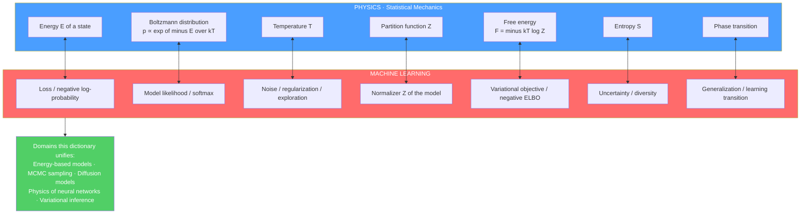

# ♻️ Statistical Mechanics of Machine Learning — Overview

> [!abstract] TL;DR
> Statistical mechanics — the physics that derives macroscopic thermodynamics (temperature, pressure, phase changes) from the microscopic randomness of $\sim 10^{23}$ jiggling particles — shares its **mathematical core** with much of probabilistic and generative machine learning. Both fields independently discovered the *same* tools: the Boltzmann distribution, free energy, the partition function, mean-field theory, Monte Carlo sampling, and phase transitions. A single dictionary translates between them — **energy $\leftrightarrow$ loss / negative-log-probability, temperature $\leftrightarrow$ noise / regularization, partition function $\leftrightarrow$ normalizer, free energy $\leftrightarrow$ variational objective (ELBO), phase transitions $\leftrightarrow$ jumps in learning and generalization**. This vault maps that two-way correspondence, from energy-based models and MCMC to diffusion models and the physics of deep networks.

---

## Intuition

**Analogy — FIRST.** Physics spent a century learning how the chaotic jiggling of $10^{23}$ atoms gives rise to orderly, predictable laws of temperature, pressure, and phase changes — the science of **statistical mechanics**. You never track any single atom; you track probabilities, and out of the churn emerge crisp macroscopic laws. Machine learning faces an uncannily similar problem: how does sensible, *generalizing* behaviour emerge from a churning sea of millions of randomly-initialised weights, nudged around by noisy gradients? Nobody designs the individual weights, yet a coherent function emerges.

It turns out these are not merely *analogous* — they are often the **same mathematics**. A neural network's loss is an **energy**. Its training is a **cooling** process (high "temperature" noise early, frozen minimum late). Its generative sampling is a **thermal fluctuation** around low-energy states. Learn one field and you hold a Rosetta Stone for the other: every hard question in probabilistic ML ("why is this normalizer intractable? why does the model suddenly start generalizing? how do I sample from this distribution?") has a century-old answer waiting in a physics textbook, and vice versa.

---

## How It Works

Both statistical mechanics and probabilistic ML are, at bottom, about **inference over high-dimensional distributions under uncertainty**. Physics writes a distribution over microstates; ML writes a distribution over data or parameters. The instant you write either one as $p(x) \propto e^{-E(x)/T}$, the *entire toolkit transfers*.

### The core object: the Boltzmann (Gibbs) distribution

In physics, a system in contact with a heat bath at temperature $T$ occupies state $x$ with probability
$$ p(x) = \frac{1}{Z}\, e^{-E(x)/k_B T}, \qquad Z = \sum_x e^{-E(x)/k_B T}. $$
Low-energy states are the most probable; raising $T$ flattens the distribution toward uniform; lowering $T \to 0$ concentrates all probability on the ground state (the global minimum). This is *exactly* a probabilistic ML model: define an **energy** $E(x)$ (a scalar "badness" of configuration $x$), and $p(x)\propto e^{-E(x)}$ is a valid model likelihood. Training that model to maximise likelihood is training it to *lower the energy of the data* and *raise the energy everywhere else*.

### The dictionary (why the fields are the same)

| Statistical Mechanics | Machine Learning | Shared role |
|---|---|---|
| Energy $E(x)$ | Loss / cost / negative-log-probability $-\log p(x)$ | Scalar "badness" of a configuration |
| Boltzmann distribution $e^{-E/kT}/Z$ | Model likelihood / Gibbs / softmax | The probability of a configuration |
| Temperature $T$ | Noise level / exploration / regularization / softmax temperature | Controls sharpness vs. diversity |
| Partition function $Z$ | Normalizing constant (the denominator) | The intractable sum over all states |
| Free energy $F=-kT\log Z$ | Negative log-likelihood / variational objective / **–ELBO** | The quantity actually minimised |
| Entropy $S$ | Uncertainty / diversity of the model | Spread of the distribution |
| Phase transition | Sharp jump in learning / generalization | Qualitative change with a control parameter |
| Ground state / minimum | Optimum / MAP / trained solution | The $T\to 0$ target |

The **why** in one sentence: both are governed by the **maximum-entropy / maximum-likelihood** principle over the same exponential-family form, both are haunted by the **same intractable sum** (the partition function $Z$), and both are rescued by the **same three approximation families** — mean-field theory, Monte Carlo sampling, and variational methods. E. T. Jaynes made this identity explicit: statistical mechanics *is* inference (MaxEnt) applied to physical systems. Once you see $Z$ as "the normalizer nobody can compute," a physicist and an ML researcher are working the same problem.

### The two directions of the bridge

This is a genuine **two-way street**:

- **Physics $\to$ ML.** Energy landscapes, phase transitions, the renormalization group, mean-field theory, and MCMC give *tools and intuitions* that explain and improve learning — e.g. why over-parameterised nets generalise, when a model suddenly "gets it," how to sample intractable posteriors.
- **ML $\to$ Physics.** Neural networks now *accelerate physics* — classifying phases of matter, learning interatomic potentials, representing quantum wavefunctions (neural quantum states), and speeding up Monte Carlo and molecular simulation.

### The correspondence, visually



---

## Key Concepts

### Secondary Level

- **Energy is just "badness."** In physics, low energy = stable, comfortable states (a ball rolls to the valley floor). In ML, low loss = a good answer. Same idea, same word.
- **Temperature controls randomness.** Hot = jittery, explores everywhere; cold = frozen, sits at the best state. In ML, "temperature" tunes how random or confident a model's choices are (e.g. the *temperature* knob on a chatbot).
- **Cooling finds the best answer.** Slowly lowering temperature — *simulated annealing* — lets a system wander over hills early and settle into the deepest valley later. That deepest valley is the trained solution.

### Undergraduate Level

- **The Boltzmann distribution $p(x)\propto e^{-E(x)/T}$** is the shared engine. Read left-to-right it's thermal physics; read $E=-\log p_{\text{model}}$ and it's a probabilistic ML model.
- **The partition function $Z=\sum_x e^{-E(x)/T}$** is the normalizer. It is a sum over *every possible configuration* — astronomically large — so computing it exactly is intractable in both fields. Almost all the difficulty in energy-based models lives here.
- **Free energy $F=-T\log Z = \langle E\rangle - T S$** trades off energy against entropy. Minimising free energy is what variational inference does: the **ELBO** is (negative) variational free energy, balancing "fit the data" (energy) against "stay uncertain/simple" (entropy).
- **Sampling via MCMC.** When you can't compute $Z$, you can still *draw samples* using Metropolis or Gibbs updates — the exact algorithms physicists built to simulate the Ising model now power Bayesian ML and energy-based generation.
- **Softmax is Boltzmann.** The softmax $p_i = e^{z_i/T}/\sum_j e^{z_j/T}$ over logits is literally a Boltzmann distribution with energies $-z_i$; the "temperature" $T$ is the same $T$.

### Graduate Level

- **Mean-field theory & the replica method.** Physicists' techniques for interacting spin systems (mean-field, cavity method, replica trick) compute the *typical* generalization error and *storage capacity* of networks — Gardner's calculation of perceptron capacity, and Amit–Gutfreund–Sompolinsky for Hopfield networks, are landmark results.
- **Spin glasses & the loss landscape.** A deep network's loss surface resembles a spin-glass energy landscape: exponentially many saddles and minima, most of comparable quality. This explains why gradient descent reliably finds *good* minima despite non-convexity.
- **Phase transitions in learning.** As a control parameter (data size, model width, noise) crosses a threshold, learning can change *qualitatively and abruptly* — perfect-recall to forgetting in associative memory, or the "grokking" and emergent-ability jumps in modern nets — the ML face of a physical phase transition and critical phenomena.
- **Non-equilibrium thermodynamics & diffusion models.** Diffusion generative models run a forward process that gradually adds noise (heating toward equilibrium) and learn to reverse it (a controlled cooling) — Sohl-Dickstein et al. derived them *explicitly* from non-equilibrium statistical mechanics.
- **Free-energy principle.** Friston's account of perception and action as variational free-energy minimisation extends the same $F=\langle E\rangle - TS$ ledger to brains and agents.

### Where each idea lives in this vault (upcoming siblings)

The correspondence is developed across companion notes: **The_Boltzmann_Distribution_in_Learning** (the shared engine), **Partition_Functions_and_Free_Energy_in_ML** (the intractable $Z$ and the free-energy objective), and **Maximum_Entropy_and_Exponential_Families** (why the exponential form is inevitable — Jaynes' inference view). The *domains* get dedicated treatments: **Energy_Based_Models** and **Boltzmann_Machines_and_RBMs** (networks that are literally spin systems), **MCMC_Sampling_in_Machine_Learning** (Metropolis / Gibbs / Langevin from simulation to inference), and **Diffusion_Models_as_Non_Equilibrium_Thermodynamics** (today's hottest example). The *physics of learning* is covered in **Phase_Transitions_in_Learning_and_Inference**, **Spin_Glasses_and_the_Energy_Landscape_of_Networks**, and **The_Replica_Method_and_Neural_Network_Capacity**, while **The_Free_Energy_Principle_and_Active_Inference** carries the idea into neuroscience and agency. The arc closes with **The_Reach_and_Future_of_Statistical_Mechanics_and_ML**.

---

## Python Demo

The demo makes the correspondence *vivid* on one small system. We build an asymmetric double-well **energy** $E(x)$, and treat it two ways at once: as a physical potential, and as $E(x)=-\log p(x)$ for a probabilistic model. Panel 1 shows the landscape. Panel 2 plots the **Boltzmann distribution** $p(x)\propto e^{-E(x)/T}$ at several temperatures — *lowering $T$ concentrates probability onto the low-energy (= low-loss = high-probability) states*, the shared core of thermal physics and probabilistic ML. Panel 3 runs **simulated annealing** (Metropolis moves under a cooling schedule): the physical act of cooling *is* the act of optimization — it locates the global minimum, i.e. the ML optimum / MLE.

```python
# Statistical mechanics <-> ML in one picture:
#   E(x) = -log p(x),  p(x) ∝ exp(-E(x)/T),  Z = normalizer,  cooling = optimization.
import numpy as np
import matplotlib.pyplot as plt

rng = np.random.default_rng(42)

# Asymmetric double well: minima near x=-1 and x=+1; the LEFT well is deeper
# => it is the global optimum / most-probable state (the ground state / MLE).
def energy(x):
    return (x**2 - 1.0)**2 + 0.35 * x

x = np.linspace(-2.0, 2.0, 1000)
dx = x[1] - x[0]
E = energy(x)

def boltzmann(E, T):
    """p(x) ∝ exp(-E/T); normalized numerically over the grid.
    The normalizer is the PARTITION FUNCTION Z (physics) = the model's
    normalizing denominator (ML) -- the same intractable sum."""
    expo = -E / T
    expo -= expo.max()          # numerical stability (shift does not change p)
    w = np.exp(expo)
    Z = np.sum(w) * dx          # the partition function / normalizer
    return w / Z

temperatures = [2.0, 0.7, 0.25, 0.08]

# (b) Simulated annealing = physical COOLING = optimization.
# Metropolis moves under a slowly lowered temperature drive the state
# toward the GLOBAL energy minimum (= the ML optimum / MLE).
n_steps = 4000
T0, T_end = 3.0, 0.02
schedule = T0 * (T_end / T0) ** (np.arange(n_steps) / (n_steps - 1))  # geometric cooling

state = 1.5                     # start stuck in the SHALLOW (wrong) basin
traj = np.empty(n_steps)
for i, T in enumerate(schedule):
    proposal = state + rng.normal(0.0, 0.3)
    dE = energy(proposal) - energy(state)
    if dE < 0 or rng.random() < np.exp(-dE / T):   # Metropolis acceptance
        state = proposal
    traj[i] = state

x_star = x[np.argmin(E)]        # true global minimum on the grid

# ---- Plot -------------------------------------------------------------
fig, ax = plt.subplots(1, 3, figsize=(15, 4.2))

ax[0].plot(x, E, 'k-', lw=2)
ax[0].axvline(x_star, color='crimson', ls='--', lw=1.2,
              label=f'global min  x≈{x_star:.2f}')
ax[0].set_title('Energy landscape   E(x) = -log p(x)')
ax[0].set_xlabel('state x'); ax[0].set_ylabel('energy E'); ax[0].legend()

for T in temperatures:
    ax[1].plot(x, boltzmann(E, T), lw=2, label=f'T = {T}')
ax[1].set_title('Boltzmann p(x) ∝ exp(-E/T): cooling concentrates probability')
ax[1].set_xlabel('state x'); ax[1].set_ylabel('probability density'); ax[1].legend()

ax[2].plot(traj, lw=0.7, color='steelblue', label='state (annealing)')
ax[2].axhline(x_star, color='crimson', ls='--', lw=1.2, label='global min')
ax[2].set_title('Simulated annealing: cooling = optimization')
ax[2].set_xlabel('iteration'); ax[2].set_ylabel('state x'); ax[2].legend()

plt.tight_layout()
plt.savefig('statmech_ml_correspondence.png', dpi=120)
plt.show()

print(f"True global minimum near x = {x_star:.3f},  E = {energy(x_star):.3f}")
print(f"Annealing final state      x = {state:.3f},  E = {energy(state):.3f}")
```

Running it: at high $T$ the Boltzmann curve is broad (high entropy, high uncertainty); at $T=0.08$ almost all probability piles onto the deeper left well — the model has become confident about the best state. The annealer, started in the *wrong* basin at $x=1.5$, hops over the barrier while hot and freezes into the global minimum near $x\approx-1$ as it cools: **cooling a physical system and optimizing a loss are one algorithm.**

---

## Real-World Applications

- **Diffusion / generative AI (Stable Diffusion, DALL·E, video and molecule generators).** The forward "add noise" and reverse "denoise" processes are non-equilibrium thermodynamics made practical; score-based sampling is Langevin dynamics. See `[[Diffusion_Models]]` and `[[Stable_Diffusion]]`.
- **Bayesian inference & probabilistic programming.** MCMC (Metropolis, Gibbs, Hamiltonian Monte Carlo) — invented for physics simulation — is the workhorse for sampling intractable posteriors in Stan, PyMC, and NumPyro.
- **Energy-based & self-supervised models.** Hopfield networks, (restricted) Boltzmann machines, and modern EBMs define a probability by an energy; contrastive learning and JEPA-style objectives inherit the energy view.
- **Simulated annealing & optimization.** Chip layout (VLSI placement), scheduling, and combinatorial optimization use the cooling schedule demonstrated above; quantum annealers (D-Wave) hardware-accelerate it.
- **ML for physics.** Neural-network interatomic potentials, phase-of-matter classifiers, neural quantum states, and normalizing-flow lattice-field-theory samplers — the reverse direction of the bridge. See `[[Machine_Learning_in_Computational_Physics]]`.

---

## Common Pitfalls

- **Thinking the analogy is only a metaphor.** It is frequently a *literal identity* — softmax is a Boltzmann distribution; the ELBO is negative variational free energy; an RBM is a spin system. Treating it as loose metaphor makes you miss transferable theorems.
- **Ignoring the partition function.** In energy-based models $Z$ is genuinely intractable; naive "just normalize it" fails. The whole difficulty (and the reason for contrastive divergence, score matching, and noise-contrastive estimation) is *avoiding* computing $Z$.
- **Confusing the two temperatures.** Physical temperature, SGD's effective noise temperature, and the softmax/sampling temperature are related but not interchangeable — always state *which* control parameter you mean.
- **Assuming equilibrium.** Training and diffusion sampling are often *non-equilibrium* processes; equilibrium (Boltzmann) intuition can mislead about transients, mixing time, and mode collapse.
- **Over-reading phase transitions.** Not every learning-curve kink is a true phase transition; genuine transitions require a sharpening non-analyticity in the thermodynamic (large-system) limit — check the scaling before invoking criticality.
- **Sign/temperature bookkeeping.** Free energy is *minimised* while log-likelihood is *maximised*; dropping a minus sign or a factor of $T$ silently inverts your objective.

---

## Related Concepts

**Physics foundations (link, don't duplicate):**
- `[[Classical_Statistical_Mechanics]]` — the canonical ensemble, $Z$, and $F=-kT\ln Z$ that this whole vault reuses.
- `[[Entropy_and_Second_Law]]` — the entropy term in free energy and the arrow that diffusion models exploit.
- `[[Thermodynamic_Potentials]]` — free energy as the quantity actually minimised, mirrored by the ELBO.
- `[[Phase_Transitions_and_Critical_Phenomena]]` — the physics face of sharp learning/generalization transitions.
- `[[Renormalization_and_RG]]` — coarse-graining ideas that illuminate depth and feature hierarchy in deep nets.

**Computational engine:**
- `[[The_Ising_Model_and_Statistical_Physics]]` — the spin system that *is* a Boltzmann machine.
- `[[The_Metropolis_Algorithm_and_MCMC]]` — the sampling algorithm shared by physics and Bayesian ML (used in the demo).
- `[[Stochastic_Differential_Equations_and_Langevin]]` — Langevin dynamics = score-based diffusion sampling.
- `[[Machine_Learning_in_Computational_Physics]]` — the ML $\to$ physics direction of the bridge.

**Information & inference:**
- `[[Maximum_Entropy_Principle]]` — Jaynes' derivation of the Boltzmann form as pure inference.
- `[[Entropy_in_Thermodynamics_and_Statistical_Mechanics]]` — the shared entropy concept across both fields.
- `[[Variational_Inference_the_ELBO_and_VAEs]]` — the ELBO as (negative) variational free energy.
- `[[The_Free_Energy_Principle_and_Active_Inference]]` — free-energy minimisation for brains and agents (existing Information-Theory note).
- `[[Maximum_Likelihood_and_Information]]` — MLE = energy minimisation at $T=1$.
- `[[Landauer_Principle_and_Thermodynamics_of_Computation]]` — the physical cost of information, tying computation to thermodynamics.

**Machine-learning side:**
- `[[Diffusion_Models]]` — generative AI as non-equilibrium thermodynamics.
- `[[Variational_Autoencoders]]` — free-energy (ELBO) objective in practice.
- `[[Loss_Functions]]` — the "energy" of a network; cross-entropy is negative log-likelihood.
- `[[Gradient_Descent]]` — the deterministic core that noise turns into a cooling dynamics.
- `[[Bayesian_Statistics]]` — posteriors as Boltzmann distributions over parameters.

**Complexity & emergence:**
- `[[Criticality_and_Phase_Transitions]]` — criticality and emergence as a systems-level lens on learning.
- `[[Dissipative_Structures_and_Nonequilibrium]]` — order emerging from non-equilibrium driving, as in training.

---

## Review Questions

### Secondary
1. In plain words, why does *lowering the temperature* make a system settle into its lowest-energy state? How is that like a machine learning model becoming "more confident"?
2. A chatbot has a "temperature" slider. Using the ideas here, what happens to its answers as you turn temperature up versus down?

### Undergraduate
3. Write the Boltzmann distribution and identify, term by term, its machine-learning counterparts (energy, temperature, partition function). Why is the partition function the hard part in both fields?
4. Show that the softmax over logits $z_i$ is a Boltzmann distribution. What plays the role of energy, and what plays the role of temperature?
5. Explain how minimising **free energy** $F=\langle E\rangle - TS$ corresponds to maximising the **ELBO** in variational inference. Which term encourages fitting the data, and which encourages uncertainty/simplicity?

### Graduate
6. Diffusion models are described as "non-equilibrium thermodynamics." Describe the forward and reverse processes in thermodynamic language and explain why the reverse process is a controlled *cooling* rather than an equilibrium sample.
7. The perceptron's storage capacity ($\alpha_c \approx 2$ patterns per weight) was computed with a physics technique. Name it, and explain conceptually why a *disordered-system* method is the right tool for the *typical* generalization error of a learning machine.
8. Give one concrete phenomenon in each direction of the bridge — a physics idea that explains something about deep learning, and an ML method that advances a physics computation — and state precisely what is transferred.

---

## Sources

- Mehta, P., Bukov, M., Wang, C.-H., Day, A. G. R., Richardson, C., Fisher, C. K., & Schwab, D. J. (2019). *A high-bias, low-variance introduction to Machine Learning for physicists.* Physics Reports, 810, 1–124.
- Bahri, Y., Kadmon, J., Pennington, J., Schoenholz, S. S., Sohl-Dickstein, J., & Ganguli, S. (2020). *Statistical Mechanics of Deep Learning.* Annual Review of Condensed Matter Physics, 11, 501–528.
- MacKay, D. J. C. (2003). *Information Theory, Inference, and Learning Algorithms.* Cambridge University Press.
- LeCun, Y., Chopra, S., Hadsell, R., Ranzato, M., & Huang, F. J. (2006). *A Tutorial on Energy-Based Learning.* In *Predicting Structured Data*, MIT Press.
- Sethna, J. P. (2021). *Statistical Mechanics: Entropy, Order Parameters, and Complexity* (2nd ed.). Oxford University Press.
- Sohl-Dickstein, J., Weiss, E. A., Maheswaranathan, N., & Ganguli, S. (2015). *Deep Unsupervised Learning using Nonequilibrium Thermodynamics.* ICML.

---

#statistical-mechanics #machine-learning #energy-based-models #free-energy #interdisciplinary
