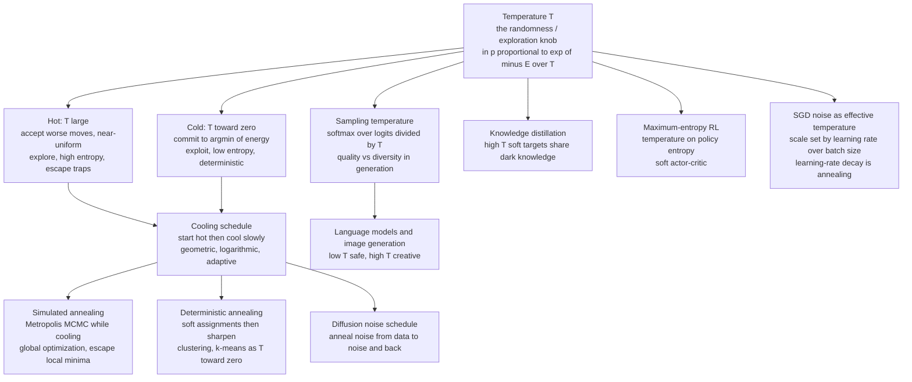

# 🔥 Temperature and Annealing in Learning

> [!abstract] TL;DR
> **Temperature** is the single knob that controls how much *randomness* a Boltzmann distribution $p \propto e^{-E/T}$ allows — hot means exploratory and near-uniform, cold means exploitative and peaked, $T\to 0$ means deterministic — and **annealing**, slowly cooling from hot to cold, is a physics recipe that pervades ML: simulated annealing escapes local minima in nonconvex optimization, sampling temperature tunes the quality–diversity trade-off in language-model and image generation, and deterministic annealing, distillation, calibration, maximum-entropy RL, $\beta$-VAE warm-up, tempering, and diffusion noise schedules all ride the same dial.

---

## Intuition

**Analogy:** A blacksmith never hammers *cold* steel into shape. They heat it until the atoms roam freely, then cool it **slowly** so the crystal settles into a strong, low-stress configuration. Cool it too fast — quench it — and you lock in brittle defects and internal stress; anneal it patiently and the metal finds a clean, low-energy structure. Optimization faces exactly the same choice. Search a rugged landscape while "hot," accepting the occasional *bad* move so you can climb out of shallow traps, then gradually "cool" so the search commits to a deep valley instead of the first ditch it fell into.

Translate "how hard the atoms jiggle" into **temperature**, and "height of the metallurgical landscape" into an **energy** you want to minimize, and the blacksmith's craft becomes an algorithm. Temperature — the amount of randomness you tolerate — turns out to be a knob that reappears everywhere in machine learning: it decides whether a solver escapes a bad optimum, how creative a language model's next token is, how confident a classifier's probabilities look, and how much a policy explores. This note is about that one dial and the discipline of turning it down slowly.

---

## How It Works

### Core Mechanics

Everything hangs off the **Boltzmann distribution** $p(x) = e^{-E(x)/T}/Z$ (developed in the sibling note [[The_Boltzmann_Distribution_in_Learning]]). Temperature $T$ sets the scale on which energy differences matter: only gaps of order $T$ change the odds appreciably.

- **Hot ($T$ large):** the exponential flattens toward uniform. Every state is roughly equally likely — high entropy, exploratory, "forgetful" of the energy. A sampler at high $T$ will happily accept a *worse* configuration, so it can climb energy barriers and leave a local minimum.
- **Cold ($T$ small):** the exponential sharpens onto the lowest-energy states — low entropy, confident, exploitative.
- **$T \to 0$:** collapse to a point mass on $\arg\min_x E(x)$. Pure greedy descent. No barrier can ever be crossed.

**Annealing** is the act of starting hot and cooling on a **schedule** $T_0 > T_1 > \cdots \to 0$. The physical intuition is that a nonconvex landscape is full of local minima that trap greedy descent; thermal fluctuations at high $T$ let the search *jump out* of shallow traps, and cooling slowly lets the system find the global basin *before* it commits.

**Simulated annealing** (Kirkpatrick, Gelatt & Vecchi, 1983) is the landmark physics-to-CS transfer that operationalizes this. Treat your objective as an energy $E$, run a **Metropolis** MCMC sampler on it, and lower $T$ as you go:

1. Propose a random move $x \to x'$.
2. Compute $\Delta E = E(x') - E(x)$.
3. Accept if $\Delta E \le 0$ (always go downhill); otherwise accept *with probability* $e^{-\Delta E / T}$ (sometimes go uphill).
4. Lower $T$ according to the schedule and repeat.

At high $T$ step 3 accepts almost any uphill move (escape); as $T\to 0$ it accepts only improvements (commit). With a slow-enough **logarithmic** schedule $T_k \ge c/\log(k+2)$ the algorithm *provably* converges to the global optimum — beautiful in theory, impractically slow in practice, which is why the real craft is the schedule. (Simulated annealing as a general-purpose global optimizer gets its own deep dive in the sibling *Simulated_Annealing_and_Global_Optimization*.)

**The cooling schedule is the crux.** Three families:

- **Geometric / exponential:** $T_{k+1} = \alpha T_k$ with $\alpha \in (0.8, 0.999)$. Cheap, ubiquitous, no guarantee — the practitioner's default.
- **Logarithmic:** $T_k \propto 1/\log k$. Guarantees the global optimum but is so slow it is almost never used verbatim.
- **Adaptive:** cool faster when the sampler is "equilibrated," slower when it is still moving; reheat if it stalls.

Too-fast cooling is **quenching** — the search freezes into whatever local minimum it happened to be near (the brittle steel). Too-slow cooling finds the right answer but wastes compute. That fast-vs-slow tension *is* the exploration-to-exploitation transition, playing out over the course of a run.

**The same knob, everywhere else in ML.** Change what "energy" means and temperature reappears:

- **Sampling temperature in generation.** For a softmax over logits $z_i$, sampling with $p_i \propto e^{z_i/T}$ is the Boltzmann distribution with $E_i = -z_i$. Low $T$ gives safe, repetitive, near-greedy output; high $T$ gives diverse, risky output. This is *the* temperature knob in language models, image generators, and any autoregressive sampler; `top-k` and nucleus (`top-p`) sampling trim the tail of the same reshaped distribution.
- **Deterministic annealing for clustering** (Rose, 1998). Instead of hard k-means assignments, use soft (softmax) responsibilities at temperature $T$ and anneal $T\to 0$; this avoids many bad local optima, and ordinary k-means is exactly the $T\to 0$ limit.
- **Knowledge distillation** (Hinton et al., 2015). Raising the softmax temperature on the teacher produces *soft targets* whose inter-class structure ("dark knowledge") transfers far more information than hard labels.
- **Temperature scaling for calibration** (Guo et al., 2017). A single learned $T$ on the logits softens an over-confident network so its stated confidence matches its accuracy.
- **Maximum-entropy RL.** A temperature multiplies a policy-entropy bonus so the agent stays exploratory; Soft Actor-Critic makes this "entropy temperature" a first-class (even auto-tuned) parameter.
- **$\beta$-annealing in VAEs.** Warming up the KL / $\beta$ term from small to full over training prevents posterior collapse — an annealing of a different Lagrange coefficient with the same hot-to-cold spirit.
- **Tempering and annealed importance sampling.** Running a *ladder* of temperatures (parallel tempering) improves MCMC mixing, and Annealed Importance Sampling interpolates through temperatures to estimate otherwise-intractable partition functions.

**Annealing in modern deep learning.** The idea is even more central than the classic algorithm suggests. **Diffusion models** run a **noise schedule** that is *literally* an annealing — data is gradually corrupted to pure noise (heating) and a network learns to reverse the schedule (cooling back to data). This is the non-equilibrium-thermodynamics view expanded in the sibling *Diffusion_Models_as_Non_Equilibrium_Thermodynamics*. And most quietly of all, the **noise in stochastic gradient descent behaves like a temperature**: its scale is roughly $\propto \eta / B$ (learning rate over batch size), so SGD approximately *samples* a Boltzmann distribution over the loss, and **learning-rate decay is a form of annealing**. This "SGD temperature" is a leading explanation for why SGD prefers flat, well-generalizing minima — the thread picked up in the siblings *The_Loss_Landscape_and_Generalization* and *MCMC_Sampling_in_Machine_Learning*.

### Flow / Architecture



---

## Key Concepts

**Secondary (intuition-level):** A blacksmith heats metal and cools it slowly to make it strong; cool too fast and it cracks. "Temperature" means how much randomness you allow while searching for a good answer — hot lets you try wild moves and escape dead ends, cold makes you settle down. Turning it down slowly is called annealing, and it helps you find the *best* valley instead of the *nearest* one. The same knob makes a chatbot's replies safe (cold) or creative (hot).

**Undergraduate (mechanics-level):** The Metropolis acceptance rule $\min(1, e^{-\Delta E/T})$; simulated annealing as Metropolis MCMC with a decreasing $T$; geometric $T_{k+1}=\alpha T_k$ vs logarithmic schedules; local vs global minima and barrier crossing driven by thermal fluctuations; the $T\to 0$ greedy limit that gets stuck; softmax-with-temperature $p_i \propto e^{z_i/T}$ and its entropy rising with $T$; quenching (too fast) vs proper annealing; k-means as the zero-temperature limit of soft clustering.

**Graduate (structure-level):** The Geman-Geman logarithmic-schedule convergence guarantee $T_k \ge c/\log k$ and why it is impractical; detailed balance and inhomogeneous Markov chains under a time-varying temperature; deterministic annealing as tracking the global free-energy minimum through a sequence of phase transitions as $T$ decreases (Rose); annealed importance sampling and parallel tempering as thermodynamic-integration and replica-exchange schemes for intractable partition functions; the stochastic-differential-equation view of SGD as Langevin dynamics with temperature $\propto \eta/B$, the resulting stationary Gibbs measure $\propto e^{-L(\theta)/T}$, and the flat-minima / generalization argument; maximum-entropy RL as probabilistic inference with reward-as-negative-energy and an entropy temperature; diffusion / score-based models as reverse-time SDEs realizing a continuous annealing between data and noise.

---

## Python Demo

```python
# Temperature and annealing, two faces:
#   (a) SIMULATED ANNEALING escapes local minima on a rugged 1D landscape, while
#       greedy descent (T=0) gets stuck; plus success-rate vs cooling rate.
#   (b) SAMPLING TEMPERATURE reshapes a softmax: hot -> diverse, cold -> sharp.
import numpy as np
import matplotlib.pyplot as plt

rng = np.random.default_rng(0)

# ---------------------------------------------------------------
# (a) A rugged 1D energy landscape: many local minima, one global min
# ---------------------------------------------------------------
def E(x):
    # parabolic bowl + ripples (local minima) + tilt (breaks the symmetry)
    return x**2 / 10.0 + np.cos(3.0 * x) + 0.1 * x

xs = np.linspace(-6.0, 6.0, 2000)
Es = E(xs)
x_global = xs[np.argmin(Es)]            # location of the GLOBAL minimum

# Metropolis sampler with a geometric hot->cold temperature schedule.
def anneal(x0, T0, T_end, n_steps, step=0.6, rng=rng):
    x, traj, temps = x0, [x0], []
    for k in range(n_steps):
        frac = k / max(n_steps - 1, 1)
        T = T0 * (T_end / T0) ** frac    # geometric interpolation, hot -> cold
        x_new = x + rng.normal(0.0, step)
        dE = E(x_new) - E(x)
        # always accept downhill; accept uphill with prob exp(-dE/T) (hot = lenient)
        if dE <= 0.0 or rng.random() < np.exp(-dE / T):
            x = x_new
        traj.append(x); temps.append(T)
    temps.append(T_end)
    return np.array(traj), np.array(temps)

# Greedy descent == the T -> 0 limit: never accept an uphill move -> gets STUCK.
def greedy(x0, n_steps, step=0.6, rng=rng):
    x, traj = x0, [x0]
    for _ in range(n_steps):
        x_new = x + rng.normal(0.0, step)
        if E(x_new) < E(x):
            x = x_new
        traj.append(x)
    return np.array(traj)

x_start, n_steps = 5.0, 4000
traj_sa, temps_sa = anneal(x_start, T0=3.0, T_end=0.01, n_steps=n_steps)
traj_gd = greedy(x_start, n_steps)

print(f"global minimum : x = {x_global:6.3f},  E = {E(x_global):6.3f}")
print(f"annealing ends : x = {traj_sa[-1]:6.3f},  E = {E(traj_sa[-1]):6.3f}")
print(f"greedy    ends : x = {traj_gd[-1]:6.3f},  E = {E(traj_gd[-1]):6.3f}   (stuck)")

# Success rate vs cooling RATE: fast cooling (few steps) quenches into a local
# minimum; slow cooling (many steps) reliably finds the global minimum.
def success_rate(sched_len, trials=80, tol=0.4):
    hits = 0
    for _ in range(trials):
        x0 = rng.uniform(-6.0, 6.0)
        traj, _ = anneal(x0, T0=3.0, T_end=0.01, n_steps=sched_len)
        hits += abs(traj[-1] - x_global) < tol
    return hits / trials

sched_lens = np.array([50, 100, 300, 1000, 3000, 8000])
cooling_rate = 1.0 / sched_lens                 # short schedule == fast cooling
rates = np.array([success_rate(n) for n in sched_lens])

# ---- plots for part (a) ----
fig, ax = plt.subplots(2, 2, figsize=(14, 10))

ax[0, 0].plot(xs, Es, color="black", lw=2)
ax[0, 0].scatter([x_start], [E(x_start)], c="dimgray", s=80, zorder=5, label="start")
ax[0, 0].scatter([x_global], [E(x_global)], marker="*", c="crimson", s=260,
                 zorder=6, label="global min")
ax[0, 0].scatter([traj_sa[-1]], [E(traj_sa[-1])], c="seagreen", s=110,
                 zorder=6, label="annealing end")
ax[0, 0].scatter([traj_gd[-1]], [E(traj_gd[-1])], c="darkorange", s=110,
                 zorder=6, label="greedy end (stuck)")
ax[0, 0].set_title("Rugged energy landscape E(x)")
ax[0, 0].set_xlabel("state x"); ax[0, 0].set_ylabel("energy"); ax[0, 0].legend()

ax[0, 1].plot(traj_sa, lw=1.0, color="seagreen", label="simulated annealing")
ax[0, 1].plot(traj_gd, lw=1.0, color="darkorange", label="greedy (T=0)")
ax[0, 1].axhline(x_global, ls="--", color="crimson", label="global min x")
ax[0, 1].set_title("Trajectories: annealing roams then commits; greedy freezes")
ax[0, 1].set_xlabel("iteration"); ax[0, 1].set_ylabel("state x"); ax[0, 1].legend()

ax[1, 0].plot(temps_sa, color="firebrick", lw=2)
ax[1, 0].set_yscale("log")
ax[1, 0].set_title("Cooling schedule: hot (explore) -> cold (commit)")
ax[1, 0].set_xlabel("iteration"); ax[1, 0].set_ylabel("temperature T (log)")

ax[1, 1].plot(cooling_rate, rates, "o-", color="navy")
ax[1, 1].set_xscale("log")
ax[1, 1].set_title("Success vs cooling rate: too fast -> stuck, slow -> global")
ax[1, 1].set_xlabel("cooling rate  (1 / schedule length)")
ax[1, 1].set_ylabel("fraction reaching global min")
plt.tight_layout()
plt.savefig("annealing_escape_local_minima.png", dpi=120)

# ---------------------------------------------------------------
# (b) SAMPLING TEMPERATURE reshapes a softmax / output distribution
# ---------------------------------------------------------------
logits = np.array([3.2, 2.1, 1.5, 0.8, 0.2, -0.5, -1.2])   # e.g. next-token scores

def softmax_T(logits, T):
    z = logits / T
    z = z - z.max()                     # log-sum-exp stability (essential at low T)
    e = np.exp(z)
    return e / e.sum()

fig2, bx = plt.subplots(figsize=(9, 5))
width, idx = 0.22, np.arange(len(logits))
for i, T in enumerate([2.0, 1.0, 0.4]):
    bx.bar(idx + (i - 1) * width, softmax_T(logits, T), width=width, label=f"T = {T}")
onehot = np.zeros_like(logits); onehot[np.argmax(logits)] = 1.0     # T -> 0 limit
bx.plot(idx, onehot, "k--o", label="T -> 0 (argmax)")
bx.set_title("Sampling temperature: high T diverse/creative, low T sharp/greedy")
bx.set_xlabel("token / class index"); bx.set_ylabel("probability"); bx.legend()
plt.tight_layout()
plt.savefig("sampling_temperature.png", dpi=120)

# entropy quantifies the quality-diversity dial:
for T in [2.0, 1.0, 0.4, 0.1]:
    p = softmax_T(logits, T)
    H = -(p * np.log(p + 1e-12)).sum()
    print(f"T={T:>4}:  entropy={H:.3f}  (higher = more diverse sampling)")
```

Part (a) shows the whole story on one landscape: greedy descent from `x = 5` tumbles into the nearest ripple and freezes far from the global minimum, while the annealer wanders across barriers at high $T$ and only settles once cooled — and the success-rate curve makes the schedule trade-off quantitative, with fast cooling (large cooling rate) quenching into local minima and slow cooling reliably finding the global one. Part (b) shows the *same* temperature knob reshaping a softmax: hot flattens it toward uniform (diverse, creative sampling, high entropy), cold sharpens it toward the argmax (safe, near-greedy generation).

---

## Real-World Applications

- **VLSI placement, TSP, scheduling.** Simulated annealing remains a workhorse for hard combinatorial layout and routing problems where the landscape is riddled with local minima — the domain the 1983 Kirkpatrick paper targeted.
- **LLM text generation.** The `temperature` API parameter *is* the $T$ in $e^{z/T}$: production systems use low $T$ for factual or code output and higher $T$ for brainstorming and creative writing, pairing it with `top-k` / nucleus sampling.
- **Image and audio generation.** Diffusion models run a **noise schedule** that anneals data to noise and back; the schedule (linear, cosine, etc.) is a first-order design choice controlling sample quality and diversity.
- **Model compression.** Knowledge distillation trains small "student" models from high-temperature soft targets of a large "teacher," transferring inter-class structure the hard labels omit.
- **Confidence calibration.** Temperature scaling fits one $T$ on validation data to make a deployed classifier's probabilities trustworthy (medical, autonomous, and risk-scoring systems).
- **Reinforcement learning at scale.** Soft Actor-Critic's automatically tuned entropy temperature keeps continuous-control agents (robotics, locomotion) exploring without hand-tuned noise.
- **Clustering and vector quantization.** Deterministic annealing yields more robust codebooks and cluster centers than plain k-means by avoiding bad local optima.
- **Training deep nets.** Learning-rate warm-up-then-decay schedules act as an effective annealing of SGD's noise temperature, and $\beta$-VAE warm-up anneals the KL term to avoid posterior collapse.

---

## Common Pitfalls

- **Quenching by cooling too fast.** The single most common failure: an aggressive geometric $\alpha$ (or too few steps) freezes the search in a poor local minimum before it has explored. If solutions are inconsistent across seeds, slow the schedule or add reheating.
- **Confusing "temperature" units across problems.** $T$ only matters relative to the *scale of energy differences*. A schedule tuned for one objective is meaningless for another whose $\Delta E$ is 100x larger; always calibrate $T_0$ so the initial acceptance rate is high (near 0.8) for *your* energy scale.
- **Numerical overflow at low $T$.** Computing $e^{z/T}$ or $e^{-\Delta E/T}$ directly overflows/underflows for small $T$. Use the log-sum-exp / max-subtraction trick, as in the demo; this is mandatory, not optional, once $T$ gets small.
- **Believing the logarithmic guarantee is usable.** The provable global-optimum schedule $T_k \propto 1/\log k$ is so slow it is effectively never run verbatim. Practical annealing uses geometric schedules and accepts *no* guarantee — treat it as a heuristic.
- **Cranking sampling temperature to "boost creativity."** Very high $T$ in generation produces incoherent, off-distribution output, not creativity; it flattens the distribution until structure is lost. Pair temperature with `top-p` / `top-k` and tune jointly.
- **Over-cooling exploration in RL.** Decaying the entropy temperature too quickly collapses the policy onto a suboptimal action before it has found the good ones — the RL mirror of quenching.
- **Ignoring SGD's implicit temperature when changing batch size.** Because the effective temperature scales as $\eta/B$, raising the batch size *without* raising the learning rate silently *cools* training and can hurt generalization — a subtle, widely-tripped-over coupling.

---

## Related Concepts

- [[The_Boltzmann_Distribution_in_Learning]] — the $p \propto e^{-E/T}$ foundation; this note is the "what does the $T$ knob *do*" companion.
- [[Classical_Statistical_Mechanics]] — the canonical ensemble and the physical meaning of temperature that annealing borrows.
- [[Entropy_and_Second_Law]] — the entropy that high temperature maximizes and that annealing trades against energy.
- [[Laws_of_Thermodynamics]] — the thermal physics of heating and slow cooling behind the metallurgical analogy.
- [[The_Metropolis_Algorithm_and_MCMC]] — the accept/reject sampler that simulated annealing runs while cooling.
- [[The_Ising_Model_and_Statistical_Physics]] — the archetypal Boltzmann system on which annealing schedules are studied.
- [[Stochastic_Differential_Equations_and_Langevin]] — Langevin dynamics, the continuous-time view linking SGD noise to an effective temperature.
- [[Root_Finding_and_Optimization]] — where simulated annealing sits among global-optimization methods.
- [[Gradient_Descent]] — the greedy ($T=0$) baseline that annealing improves on by allowing uphill moves.
- [[SGD_and_Variants]] — the stochastic-gradient noise that acts as an effective training temperature.
- [[Learning_Rate_Scheduling]] — learning-rate decay as a loose annealing of that SGD temperature.
- [[Softmax_and_Sigmoid]] — the softmax whose temperature reshapes generation and calibration.
- [[Generation_Controls]] — the practical LLM sampling knobs: temperature, top-k, nucleus.
- [[Knowledge_Distillation]] — high-temperature soft targets that transfer "dark knowledge."
- [[Calibration]] — temperature scaling to align confidence with accuracy.
- [[KMeans]] — the $T\to 0$ limit of deterministic-annealing soft clustering.
- [[Variational_Autoencoders]] — $\beta$/KL warm-up as an annealing that prevents posterior collapse.
- [[Stable_Diffusion]] — a diffusion model whose noise schedule is literally an annealing.
- [[Reinforcement_Learning]] — Boltzmann exploration and maximum-entropy (entropy-temperature) policies.

---

## Review Questions

1. **(Conceptual)** In simulated annealing the sampler *accepts worse solutions* with probability $e^{-\Delta E/T}$. Explain precisely why this apparently self-defeating rule is what lets the algorithm find *better* optima than greedy descent, and what role the cooling schedule plays in eventually stopping that behavior.
2. **(Scenario)** You are annealing a chip-placement objective and your final solutions vary wildly from run to run, several are clearly poor, and each run is fast. Diagnose the likely cause in schedule terms, name two concrete changes you would make, and explain the compute cost you are trading for reliability.
3. **(Trade-off)** SGD's effective temperature scales roughly as learning-rate over batch-size. A colleague quadruples the batch size to speed up training and generalization gets *worse*. Using the temperature-and-annealing picture, explain what happened to the implicit temperature, why it might hurt the minima found, and what you would change to compensate.

---

## Sources

- S. Kirkpatrick, C. D. Gelatt, M. P. Vecchi, "Optimization by Simulated Annealing," *Science* 220:671–680 (1983). [link](https://doi.org/10.1126/science.220.4598.671)
- S. Geman, D. Geman, "Stochastic Relaxation, Gibbs Distributions, and the Bayesian Restoration of Images," *IEEE TPAMI* 6:721–741 (1984). [link](https://doi.org/10.1109/TPAMI.1984.4767596)
- K. Rose, "Deterministic Annealing for Clustering, Compression, Classification, Regression, and Related Optimization Problems," *Proc. IEEE* 86:2210–2239 (1998). [link](https://doi.org/10.1109/5.726788)
- G. Hinton, O. Vinyals, J. Dean, "Distilling the Knowledge in a Neural Network," *NeurIPS Deep Learning Workshop* (2015). [arXiv:1503.02531](https://arxiv.org/abs/1503.02531)
- T. Haarnoja, A. Zhou, P. Abbeel, S. Levine, "Soft Actor-Critic: Off-Policy Maximum Entropy Deep Reinforcement Learning," *ICML* (2018). [arXiv:1801.01290](https://arxiv.org/abs/1801.01290)

---

#statistical-mechanics #machine-learning #simulated-annealing #temperature #optimization
