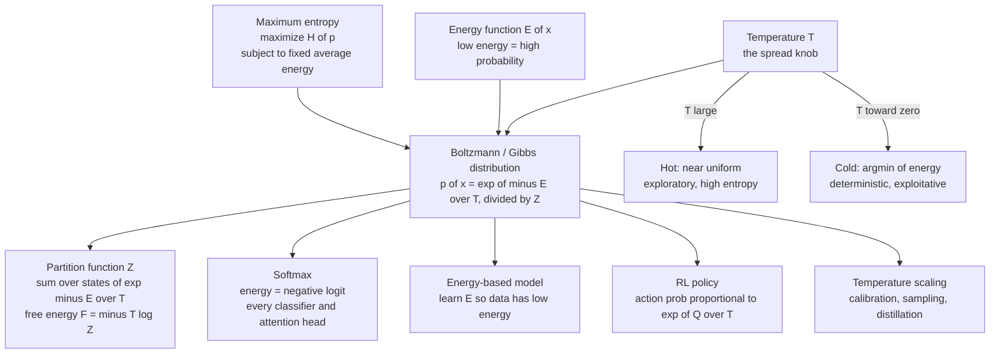

# 🔥 The Boltzmann Distribution in Learning

> [!abstract] TL;DR
> The Boltzmann (Gibbs) distribution $p(x) \propto e^{-E(x)/T}$ says low-energy states are exponentially more probable, with temperature $T$ controlling the spread — and this single formula is simultaneously the foundation of thermal physics *and* the softmax that ends every classifier, the Gibbs measure of energy-based models, the exploration policy of reinforcement learning, and the temperature knob for calibration and generation.

---

## Intuition

**Analogy:** Drop a handful of balls into a hilly landscape and shake the table. Shake it *hard* — high temperature — and the balls scatter everywhere, bouncing over hills and ignoring the valleys entirely. Shake it *gently* — low temperature — and they trickle down and settle into the deepest basins. Shake it not at all — temperature zero — and each ball freezes wherever it happened to be, eventually rolling into the single lowest point it can reach.

The Boltzmann distribution is the *exact recipe* for how often the shaken balls visit each spot: exponentially more time in low-energy valleys, and **how sharply so is dialed by the temperature**. Translate "height of the landscape" into "energy of a configuration," and "how hard you shake" into "temperature," and you have the one formula, $p(x) = e^{-E(x)/T}/Z$, that ties the physics of heat to the mathematics of learning. In machine learning the "landscape" becomes a learned energy (negative logits, a $-\log$ probability, a $Q$-value), and the "shake intensity" becomes a hyperparameter you tune to trade off sharpness against diversity.

---

## How It Works

### Core Mechanics

The **Boltzmann / Gibbs distribution** assigns to each state $x$ with energy $E(x)$ the probability

$$
p(x) = \frac{e^{-E(x)/(k_B T)}}{Z}, \qquad Z = \sum_{x} e^{-E(x)/(k_B T)} .
$$

In ML we usually fold Boltzmann's constant $k_B$ into the temperature and write $\beta = 1/T$, giving the compact form $p(x) = e^{-\beta E(x)}/Z$. Three moving parts:

1. **Energy $E(x)$.** A scalar score of how "bad" or "unlikely" a state is. Lower energy → higher probability. The *differences* in energy are all that matter; adding a constant to every energy cancels against $Z$.
2. **Temperature $T$.** The knob on the exponential. It sets the scale on which energy differences count: only gaps of order $T$ meaningfully change the odds.
3. **Partition function $Z$.** The normalizer — a sum (or integral) over *all* states — that turns the un-normalized weights $e^{-\beta E}$ into a valid probability distribution. It also secretly stores every thermodynamic quantity through the **free energy** $F = -T \log Z$.

**Why this exact form? Maximum entropy.** Boltzmann's shape is not arbitrary. Ask: of all distributions with a *fixed average energy* $\langle E \rangle$, which one is maximally uncertain (least presumptuous) about everything else? Maximize the Shannon entropy $H(p) = -\sum_x p(x)\log p(x)$ subject to $\sum_x p(x) = 1$ and $\sum_x p(x)E(x) = \langle E \rangle$. Introduce Lagrange multipliers $\alpha$ (normalization) and $\beta$ (energy), and $\partial/\partial p(x)$ gives $-\log p(x) - 1 - \alpha - \beta E(x) = 0$, i.e.

$$
p(x) \propto e^{-\beta E(x)} .
$$

The multiplier $\beta$ *is* the inverse temperature. This is Jaynes' derivation: the Boltzmann distribution is the **least-biased** distribution consistent with a mean-energy constraint, and it is exactly a member of the **exponential family** with $E(x)$ as sufficient statistic. (The maximum-entropy origin gets its own treatment in the sibling note *Maximum_Entropy_and_Exponential_Families*.)

**Temperature as the exploration–exploitation dial.**

- **High $T$** flattens the exponential toward uniform: high entropy, all states roughly equally likely — "hot," exploratory, forgetful of the energy.
- **Low $T$** sharpens onto the lowest-energy states: low entropy, confident — "cold," exploitative.
- **$T \to 0$** collapses to a point mass on $\arg\min_x E(x)$ — deterministic. Slowly lowering $T$ during search is exactly **simulated annealing**. (See the sibling *Temperature_and_Annealing_in_Learning*.)

**The ML incarnations.** Change what "energy" means and the same formula reappears across deep learning:

- **Softmax.** Set energy = negative logit, $E_i = -z_i$. Then $p_i = e^{z_i/T}/\sum_j e^{z_j/T}$ — the softmax with a temperature. Every classifier head, every attention weight, every categorical policy is a Boltzmann distribution.
- **Energy-based models (EBMs).** Define $p_\theta(x) \propto e^{-E_\theta(x)}$ directly and *learn* the energy so real data sits in low-energy valleys. This unifies Boltzmann machines, many score/diffusion models, and more. (Expanded in *Energy_Based_Models*.)
- **Reinforcement learning.** Boltzmann exploration picks actions with probability $\propto e^{Q(a)/T}$; maximum-entropy RL (soft Q-learning, SAC) builds its whole objective on this measure.
- **Temperature scaling.** A single learned $T$ on the logits recalibrates an over-confident network (Guo et al.), controls the diversity of language-model sampling, and softens targets for knowledge distillation (Hinton).

The normalizer $Z$ — trivial for a $K$-way softmax (just a sum of $K$ terms), but a sum over exponentially many states for an EBM or a physical spin system — is the **shared computational bottleneck** of both fields. (The sibling *Partition_Functions_and_Free_Energy_in_ML* is devoted to it; the whole correspondence is surveyed in *Statistical_Mechanics_of_Machine_Learning_Overview*.)

### Flow / Architecture



---

## Key Concepts

**Secondary (intuition-level):** A rougher landscape and gentler shaking make balls pile up in the deepest pits; harder shaking spreads them out. "Energy" = how bad a choice is; "temperature" = how randomly you choose. Softmax turns a list of scores into probabilities, and its temperature makes those probabilities sharp or fuzzy.

**Undergraduate (mechanics-level):** The canonical distribution $p(x) = e^{-\beta E(x)}/Z$ with $\beta = 1/(k_B T)$; the partition function $Z$ as normalizer and generating function ($\langle E \rangle = -\partial \log Z/\partial \beta$); free energy $F = -T\log Z = \langle E\rangle - T S$; softmax as the discrete Boltzmann distribution with $E_i=-z_i$; entropy of the softmax rising with $T$; the $T\to 0$ argmax and $T\to\infty$ uniform limits; Boltzmann exploration $\pi(a) \propto e^{Q(a)/T}$.

**Graduate (structure-level):** The maximum-entropy / Jaynes derivation and its identification of $\beta$ as the Lagrange multiplier dual to $\langle E\rangle$; the Boltzmann distribution as the canonical exponential family with log-partition (cumulant-generating) function $\log Z$ convex in the natural parameters; $\log Z = \operatorname{logsumexp}(-E)$ as a smooth ($T$-controlled) approximation to $-\min_x E(x)$, recovering the hard minimum as $T\to 0$; free-energy variational bounds ($F \le \langle E\rangle_q - T H(q)$ for any $q$, the ELBO in disguise); the intractability of $Z$ motivating MCMC, contrastive divergence, score matching, and variational methods; maximum-entropy RL as inference in a graphical model where reward plays the role of negative energy.

---

## Python Demo

```python
# The Boltzmann distribution and its two ML faces:
#   (a) p(x) ~ exp(-E(x)/T) over an energy landscape, swept over temperature.
#   (b) Softmax-with-temperature IS the Boltzmann distribution (E = -logits).
import numpy as np
import matplotlib.pyplot as plt

# ---------------------------------------------------------------
# (a) Boltzmann distribution over an energy landscape vs temperature
# ---------------------------------------------------------------
x = np.linspace(-3.0, 3.0, 400)
# A bumpy multi-well landscape: a deep global valley plus shallow local ones.
E = 0.5 * x**2 + 1.2 * np.sin(3.0 * x) + 0.3 * x
E = E - E.min()                       # only energy *differences* matter

def boltzmann(E, T):
    logits = -(E - E.min()) / T       # subtract min for numerical stability
    w = np.exp(logits - logits.max())
    return w / w.sum()                # normalized by the partition function Z

temps = [5.0, 1.0, 0.3, 0.1]

fig, axes = plt.subplots(1, 2, figsize=(13, 5))
axes[0].plot(x, E, color="black", lw=2)
axes[0].set_title("Energy landscape E(x)")
axes[0].set_xlabel("state x"); axes[0].set_ylabel("energy")

for T in temps:
    axes[1].plot(x, boltzmann(E, T), lw=2, label=f"T = {T}")
axes[1].set_title("Boltzmann p(x) ~ exp(-E/T):  hot -> uniform, cold -> ground state")
axes[1].set_xlabel("state x"); axes[1].set_ylabel("probability")
axes[1].legend()
plt.tight_layout()
plt.savefig("boltzmann_temperature_sweep.png", dpi=120)

# ---------------------------------------------------------------
# (b) Softmax-with-temperature == Boltzmann with energy = -logits
# ---------------------------------------------------------------
logits   = np.array([2.0, 1.0, 0.5, 0.1, -1.0])   # a classifier's raw scores
energies = -logits                                # Boltzmann energy = negative logit

def softmax_T(logits, T):
    z = logits / T
    z = z - z.max()
    e = np.exp(z)
    return e / e.sum()

# The two are provably identical:
assert np.allclose(softmax_T(logits, 1.0), boltzmann(energies, 1.0)), "softmax == Boltzmann"

fig, ax = plt.subplots(figsize=(8, 5))
width, classes = 0.22, np.arange(len(logits))
for i, T in enumerate([3.0, 1.0, 0.3]):
    ax.bar(classes + (i - 1) * width, softmax_T(logits, T), width=width, label=f"T = {T}")
onehot = np.zeros_like(logits); onehot[np.argmax(logits)] = 1.0   # T -> 0 limit
ax.plot(classes, onehot, "k--o", label="T -> 0  (argmax)")
ax.set_title("Softmax temperature: high T soft/exploratory, low T sharp/confident")
ax.set_xlabel("class index"); ax.set_ylabel("probability"); ax.legend()
plt.tight_layout()
plt.savefig("softmax_temperature.png", dpi=120)

# Entropy of the softmax vs temperature -- the exploration / calibration knob:
for T in [3.0, 1.0, 0.3, 0.05]:
    p = softmax_T(logits, T)
    H = -(p * np.log(p + 1e-12)).sum()
    print(f"T={T:>5}:  p={np.round(p, 3)}   entropy={H:.3f}")
```

Running (b) prints the softmax collapsing from near-uniform toward a one-hot argmax as $T$ shrinks — high $T$ gives a high-entropy, "under-confident" distribution (useful for exploration and for fixing over-confident calibration); low $T$ gives a low-entropy, near-deterministic one. The `assert` is the whole point: softmax *is* the Boltzmann distribution with $E_i = -z_i$.

---

## Real-World Applications

- **Every neural classifier.** The final `softmax` layer, trained with cross-entropy, is a Boltzmann distribution over classes; the logits are negative energies. Attention weights in Transformers are softmaxes over query–key scores — again Boltzmann distributions computed on the fly.
- **LLM text generation.** The `temperature` sampling parameter is *the* $T$ in $e^{z/T}$: low $T$ yields safe, repetitive, near-greedy text; high $T$ yields diverse, riskier output. `top-k` / nucleus sampling then trim the tail of that same distribution.
- **Confidence calibration.** Temperature scaling (Guo et al., 2017) fits a single $T$ on a validation set to soften a network's over-sharp softmax so that a "90% confident" prediction is right about 90% of the time.
- **Knowledge distillation.** Hinton's soft targets raise $T$ so the teacher's softmax reveals inter-class similarities ("dark knowledge") the hard labels hide.
- **Reinforcement learning.** Boltzmann/softmax action selection $\pi(a) \propto e^{Q(a)/T}$ balances exploration and exploitation; Soft Actor-Critic and soft Q-learning make this maximum-entropy measure the training objective itself.
- **Energy-based & diffusion models.** Boltzmann machines, and modern EBMs and score-based diffusion models, define $p(x) \propto e^{-E(x)}$ and shape $E$ so data has low energy; sampling uses MCMC / Langevin dynamics targeting exactly this measure.
- **Optimization by simulated annealing.** Combinatorial problems (VLSI placement, TSP, scheduling) are solved by sampling $e^{-E/T}$ while cooling $T\to 0$ toward the minimum-energy configuration.

---

## Common Pitfalls

- **Forgetting temperature rescales *differences*, not absolute scores.** Adding a constant to every logit changes nothing (it cancels in $Z$); only gaps of order $T$ matter. People "tune temperature" while their real problem is logit *scale* drift during training.
- **Numerical overflow in the exponential.** Computing $e^{z/T}$ directly overflows for large $z$ or small $T$. Always subtract the max (log-sum-exp trick) as in the demo. This is not optional at low temperature.
- **Confusing "confidence" with "correctness."** A low-$T$, high-confidence softmax is not better calibrated — it is often *worse*. Sharpness and accuracy are different axes; that gap is exactly what temperature scaling fixes.
- **Assuming $Z$ is cheap.** For a $K$-way classifier $Z$ is a trivial $K$-term sum, so beginners forget it exists. For an EBM or a spin system $Z$ sums over exponentially many states and is the central obstacle — do not port classifier intuitions to those models.
- **$T \to 0$ ties and gradients.** The zero-temperature argmax is non-differentiable and ill-defined under ties; when you need a differentiable "hard" choice, use a small but positive $T$ or the Gumbel-softmax rather than literally $T=0$.
- **Over-cooling in annealing/RL.** Dropping $T$ too fast freezes the search in a poor local minimum before it has explored — the classic annealing-schedule failure, mirrored by RL policies that collapse to a suboptimal action prematurely.

---

## Related Concepts

- [[Classical_Statistical_Mechanics]] — the canonical ensemble where the Boltzmann distribution and partition function originate.
- [[Entropy_and_Second_Law]] — the entropy that maximum-entropy maximizes and that temperature trades against energy.
- [[Thermodynamic_Potentials]] — free energy $F = -T\log Z$, the physical reading of the ML log-partition function.
- [[Maximum_Entropy_Principle]] — Jaynes' argument that the Boltzmann form is the least-biased distribution under a mean-energy constraint.
- [[Entropy_and_Information_Content]] — Shannon entropy, the objective in the max-entropy derivation.
- [[Entropy_in_Thermodynamics_and_Statistical_Mechanics]] — the physics/information bridge that this note extends into ML.
- [[Activation_Functions]] — where softmax lives in the deep-learning stack; the ML face of the Boltzmann distribution.
- [[Loss_Functions]] — cross-entropy paired with softmax is the negative log-likelihood of a Boltzmann model.
- [[Attention_Mechanism]] — attention weights are softmaxes, i.e. Boltzmann distributions over keys.
- [[Reinforcement_Learning]] — Boltzmann/softmax exploration and maximum-entropy RL policies.
- [[Calibration]] — temperature scaling of the softmax to align confidence with accuracy.
- [[Diffusion_Models]] — generative models whose sampling targets an energy/score-defined Gibbs measure.
- [[The_Ising_Model_and_Statistical_Physics]] — the canonical Boltzmann-distributed system and the archetype of an intractable $Z$.
- [[The_Metropolis_Algorithm_and_MCMC]] — how to sample $e^{-E/T}$ when the partition function is out of reach.
- [[Exponential_and_Logarithmic_Functions]] — the exponential and log-sum-exp underlying every formula here.

---

## Review Questions

1. **(Conceptual)** Starting from "maximize entropy subject to a fixed average energy," derive the Boltzmann form $p(x) \propto e^{-\beta E(x)}$ and explain what the multiplier $\beta$ physically represents. Why does this make the Boltzmann distribution the "least-biased" choice?
2. **(Scenario)** Your image classifier is 99% confident yet only 92% accurate, and its LLM captioning head produces bland, repetitive text. Which single knob addresses both symptoms, in which direction do you move it for each, and why does the same parameter fix a calibration problem *and* a diversity problem?
3. **(Trade-off)** For a $K$-way softmax the partition function $Z$ is a trivial $K$-term sum, yet for an energy-based model over binary vectors of length $n$ it is a sum over $2^n$ states. Explain why this asymmetry exists, what it costs, and name two strategies that let you train or sample from the Boltzmann distribution without ever computing $Z$ exactly.

---

## Sources

- E. T. Jaynes, "Information Theory and Statistical Mechanics," *Physical Review* 106:620 (1957). [link](https://doi.org/10.1103/PhysRev.106.620)
- C. Guo, G. Pleiss, Y. Sun, K. Q. Weinberger, "On Calibration of Modern Neural Networks," *ICML* 2017. [arXiv:1706.04599](https://arxiv.org/abs/1706.04599)
- G. Hinton, O. Vinyals, J. Dean, "Distilling the Knowledge in a Neural Network," *NeurIPS Deep Learning Workshop* 2015. [arXiv:1503.02531](https://arxiv.org/abs/1503.02531)
- T. Haarnoja, A. Zhou, P. Abbeel, S. Levine, "Soft Actor-Critic: Off-Policy Maximum Entropy Deep Reinforcement Learning," *ICML* 2018. [arXiv:1801.01290](https://arxiv.org/abs/1801.01290)
- Y. LeCun, S. Chopra, R. Hadsell, M. Ranzato, F. Huang, "A Tutorial on Energy-Based Learning," in *Predicting Structured Data*, MIT Press (2006). [link](http://yann.lecun.com/exdb/publis/pdf/lecun-06.pdf)

---

#statistical-mechanics #machine-learning #boltzmann-distribution #softmax #temperature
