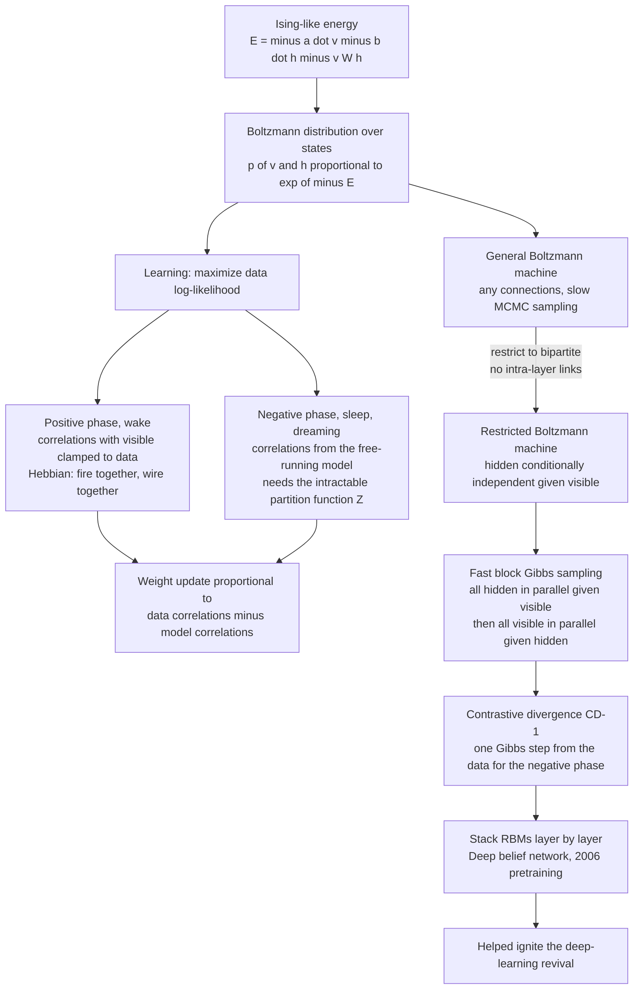

# 🧲 Boltzmann Machines and RBMs

> [!abstract] TL;DR
> A **Boltzmann machine** is a network of stochastic binary units — visible *and* hidden — with an Ising-like energy whose configurations follow the Boltzmann distribution $p(v,h)\propto e^{-E(v,h)}$; it learns a data distribution by matching correlations measured with the data clamped ("positive/wake" phase) against correlations from the free-running model ("negative/sleep/dreaming" phase). The **restricted** Boltzmann machine drops all intra-layer connections, making hidden units conditionally independent so **block Gibbs sampling** and **contrastive divergence** training become fast — and stacking RBMs into **deep belief networks** (Hinton, 2006) helped ignite the deep-learning revolution.

---

## Intuition

**Analogy:** Take a Hopfield network — a rigid, deterministic associative memory that rolls downhill into the nearest stored pattern and freezes there — and *warm it up*. Now each neuron no longer settles once and for all; it flickers on and off probabilistically, like a spin in a magnet at finite temperature. At high heat the network wanders freely over configurations; as it cools it lingers in low-energy states. Then add a second layer of neurons that nobody labeled — **hidden** units free to invent whatever abstract features best explain what the visible units are doing.

You have just built a Boltzmann machine. Unlike the Hopfield network, which only *stores* a handful of patterns, this warmed-up, latent-variable network *learns the probability distribution behind your data* and can then **dream** — run its own stochastic dynamics to hallucinate brand-new samples that look like the training set. It was one of the first genuinely generative neural models, born directly out of statistical physics, and its streamlined cousin, the **restricted** Boltzmann machine, became the workhorse that helped kick off modern deep learning.

---

## How It Works

### Core Mechanics

**1. Stochastic binary units and an Ising energy.** A Boltzmann machine (Hinton & Sejnowski, 1985) is a set of binary units $s_i \in \{0,1\}$ with symmetric weights $w_{ij}=w_{ji}$ (no self-connections) and biases $a_i$. Some units are **visible** (they carry data $v$), the rest are **hidden** (latent features $h$). Every joint configuration has an energy that is exactly an **Ising Hamiltonian**:

$$
E(v,h) = -\sum_i a_i v_i - \sum_j b_j h_j - \sum_{i,j} v_i\, w_{ij}\, h_j - \tfrac12\!\!\sum_{i\neq i'}\! v_i L_{ii'} v_{i'} - \tfrac12\!\!\sum_{j\neq j'}\! h_j J_{jj'} h_{j'} .
$$

The states are Boltzmann-distributed, $p(v,h) = e^{-E(v,h)}/Z$ with partition function $Z=\sum_{v,h} e^{-E(v,h)}$ — the same normalizer, and the same intractability, discussed in *[[The_Boltzmann_Distribution_in_Learning]]* and the sibling *Energy_Based_Models*.

**2. The sigmoid IS the Boltzmann conditional.** Flip one unit and ask how its energy changes. Because the energy is linear in each $s_i$, the probability that unit $i$ turns on given all the others is

$$
p(s_i = 1 \mid s_{-i}) = \sigma\!\Big(\text{net input}_i\Big) = \frac{1}{1+e^{-(\,a_i + \sum_j w_{ij}s_j\,)/T}} .
$$

That logistic (sigmoid) function is not a modeling convenience — it is the **exact Boltzmann conditional at temperature $T$** (the Glauber / Gibbs update). Repeatedly picking a unit and resampling it from this rule is a Markov chain whose stationary distribution is the Boltzmann distribution: the network *samples itself*. (The conditional-update machinery gets its own treatment in the sibling *Gibbs_Sampling_and_Conditional_Updates*.)

**3. Hidden units = a latent-variable generative model.** Marginalizing out the hidden units gives a flexible distribution over the visible data, $p(v)=\sum_h e^{-E(v,h)}/Z$. The hidden units let the model capture **high-order correlations** among visible pixels that no pairwise visible-only model could represent. This makes the Boltzmann machine a full **unsupervised, generative** model: learn $p(v)$, then generate new $v$ by sampling.

**4. Learning: the positive and negative phases.** Maximizing the log-likelihood of the data yields a strikingly simple gradient — the difference of two correlations:

$$
\frac{\partial \log p(v)}{\partial w_{ij}} \;=\; \underbrace{\langle v_i h_j \rangle_{\text{data}}}_{\text{positive / wake phase}} \;-\; \underbrace{\langle v_i h_j \rangle_{\text{model}}}_{\text{negative / sleep / dreaming phase}} .
$$

- The **positive phase** clamps the visible units to real data and measures how often unit pairs fire together — a *Hebbian* term ("fire together, wire together").
- The **negative phase** lets the network run free — dreaming — and measures the same correlations under the model's own distribution; it is *anti-Hebbian* and it requires **sampling from the model** (hence the intractable $Z$ returns). This is the "wake–sleep" picture: learn from experience while awake, un-learn your own fantasies while asleep.

Learning stops exactly when the model's dreams have the same statistics as the data. For a *general* Boltzmann machine the negative phase needs long MCMC runs to equilibrium for every gradient step — beautiful, but painfully slow.

**5. The restriction that makes it practical — the RBM.** Smolensky's *Harmonium* and Hinton's **restricted Boltzmann machine** delete all intra-layer weights ($L=0$, $J=0$), leaving only a **bipartite** visible-to-hidden graph. The payoff is conditional independence:

$$
p(h\mid v)=\prod_j p(h_j\mid v),\qquad p(v\mid h)=\prod_i p(v_i\mid h) .
$$

Now you can sample **all hidden units in parallel** given the visible layer, then **all visible units in parallel** given the hidden layer — **block Gibbs sampling**. Sampling that was serial and slow becomes two fast matrix-multiply-and-sigmoid steps.

**6. Contrastive divergence.** Even with block Gibbs, running to equilibrium for the negative phase is expensive. Hinton's **contrastive divergence (CD-$k$)** replaces it with a shortcut: start the negative-phase chain *at the data* and run just $k$ Gibbs steps — usually **CD-1**, a single step. The resulting gradient is *biased* (it does not follow the true likelihood gradient) but works remarkably well in practice, and it is what made RBM training feasible. (Expanded in the sibling *Contrastive_Divergence_and_EBM_Training*.)

**7. Stacking → deep belief networks.** Train one RBM on the data; treat its hidden activations as the "data" for a second RBM; repeat. This **greedy layer-wise unsupervised pretraining** (Hinton, Osindero & Teh, 2006) builds a **deep belief network** and was the result that convinced the field deep nets *could* be trained — sparking the modern deep-learning revival, before better initialization, ReLUs, and optimizers made unsupervised pretraining unnecessary for most tasks.

### Flow / Architecture



---

## Key Concepts

**Secondary (intuition-level):** A Hopfield memory that freezes into stored patterns, warmed up so its neurons flicker randomly and can *wander*. Add unlabeled "hidden" neurons and the network learns the *statistics* of your data instead of memorizing a few examples — then it can dream up new examples. The "restricted" version just forbids connections *within* a layer, which makes it fast to run. Training nudges weights so the network's dreams look like the real data.

**Undergraduate (mechanics-level):** Binary units with energy $E=-a\cdot v-b\cdot h-v^\top W h$; joint law $p(v,h)=e^{-E}/Z$; per-unit conditional $p(s_i{=}1\mid \cdot)=\sigma(\text{net input})$, the sigmoid as the Boltzmann conditional. RBM bipartite structure $\Rightarrow$ factorized conditionals $p(h\mid v)=\prod_j\sigma(b_j+v^\top W_{:j})$ and $p(v\mid h)=\prod_i\sigma(a_i+W_{i:}h)$. Log-likelihood gradient $=\langle v_i h_j\rangle_{\text{data}}-\langle v_i h_j\rangle_{\text{model}}$; block Gibbs sampling; contrastive divergence CD-1 as a one-step negative phase; reconstruction error as a training proxy.

**Graduate (structure-level):** The intractable $Z$ and its gradient $\partial\log Z/\partial\theta=\mathbb{E}_{\text{model}}[\cdot]$; free energy $F(v)=-\log\sum_h e^{-E(v,h)}$ giving $p(v)=e^{-F(v)}/Z$; CD as a biased estimator that approximately follows $-\nabla\big(\mathrm{KL}(p_0\|p_\infty)-\mathrm{KL}(p_1\|p_\infty)\big)$, plus **persistent CD** (keep a running Markov chain across updates) to reduce bias; deep belief networks as a *hybrid* directed-sigmoid-belief-net with an undirected top RBM, and the variational bound justifying greedy layer-wise stacking (each added layer improves a lower bound on $\log p(v)$); deep Boltzmann machines (fully undirected, multi-layer, trained with a mean-field variational positive phase — see the sibling *Mean_Field_Theory_of_Neural_Networks*); Gaussian–Bernoulli RBMs for real-valued inputs; the exponential-family / product-of-experts view of the RBM likelihood.

---

## Python Demo

```python
# Train a Restricted Boltzmann Machine with Contrastive Divergence (CD-1)
# on the "bars and stripes" dataset, then show it has learned the
# distribution: reconstruct corrupted inputs, dream new samples via block
# Gibbs sampling, and visualize the learned weight "filters".
import numpy as np
import matplotlib.pyplot as plt

rng = np.random.default_rng(0)

# ------------------------------------------------------------------
# Dataset: bars-and-stripes on a D x D grid. Each image is EITHER
# random horizontal stripes OR random vertical bars -- the two "modes"
# of the distribution the RBM must capture (16 visible pixels).
# ------------------------------------------------------------------
D, N_VIS = 4, 16

def sample_bas(n):
    imgs = np.zeros((n, D, D))
    for k in range(n):
        bits = rng.integers(0, 2, size=D).astype(float)
        if rng.random() < 0.5:
            imgs[k] = bits[:, None] * np.ones((1, D))   # horizontal stripes
        else:
            imgs[k] = np.ones((D, 1)) * bits[None, :]   # vertical bars
    return imgs.reshape(n, N_VIS)

def sigmoid(x):
    return 1.0 / (1.0 + np.exp(-np.clip(x, -30, 30)))

def bernoulli(p):
    return (rng.random(p.shape) < p).astype(float)

# ------------------------------------------------------------------
# RBM parameters:  E(v,h) = -a.v - b.h - v.W.h
# ------------------------------------------------------------------
N_HID = 9
W = 0.01 * rng.standard_normal((N_VIS, N_HID))
a = np.zeros(N_VIS)   # visible bias
b = np.zeros(N_HID)   # hidden bias

# ------------------------------------------------------------------
# Contrastive Divergence (CD-1) training loop
# ------------------------------------------------------------------
lr, epochs, batch = 0.1, 4000, 64
recon_hist = []
for ep in range(epochs):
    v0 = sample_bas(batch)
    # POSITIVE phase: hidden probabilities & samples given the DATA
    ph0 = sigmoid(b + v0 @ W)
    h0  = bernoulli(ph0)
    # NEGATIVE phase: ONE step of block Gibbs (v|h then h|v) = "dreaming"
    pv1 = sigmoid(a + h0 @ W.T)
    v1  = bernoulli(pv1)
    ph1 = sigmoid(b + v1 @ W)
    # Gradient = data correlations minus one-step model correlations
    W += lr * (v0.T @ ph0 - v1.T @ ph1) / batch
    a += lr * (v0 - v1).mean(axis=0)
    b += lr * (ph0 - ph1).mean(axis=0)
    recon_hist.append(np.mean((v0 - pv1) ** 2))

# ------------------------------------------------------------------
# GENERATE: run block Gibbs from noise to dream brand-new samples
# ------------------------------------------------------------------
def gibbs_dream(n, steps=300):
    v = bernoulli(0.5 * np.ones((n, N_VIS)))
    for _ in range(steps):
        v = bernoulli(sigmoid(a + bernoulli(sigmoid(b + v @ W)) @ W.T))
    return v
dreams = gibbs_dream(8)

# ------------------------------------------------------------------
# RECONSTRUCT: denoise corrupted inputs with one visible->hidden->visible pass
# ------------------------------------------------------------------
clean   = sample_bas(4)
corrupt = clean.copy()
flip    = rng.random(corrupt.shape) < 0.25
corrupt[flip] = 1 - corrupt[flip]                 # flip 25% of pixels
recon   = sigmoid(a + sigmoid(b + corrupt @ W) @ W.T)

# ------------------------------------------------------------------
# Plots: training curve, learned filters, dreams, reconstructions
# ------------------------------------------------------------------
fig = plt.figure(figsize=(12, 8))

ax = fig.add_subplot(2, 2, 1)
smooth = np.convolve(recon_hist, np.ones(50) / 50, mode="valid")
ax.plot(smooth); ax.set_title("CD-1 reconstruction error (smoothed)")
ax.set_xlabel("epoch"); ax.set_ylabel("MSE")

ax = fig.add_subplot(2, 2, 2)
grid = np.zeros((D * 3, D * 3))
for j in range(N_HID):
    r, c = divmod(j, 3)
    grid[r*D:(r+1)*D, c*D:(c+1)*D] = W[:, j].reshape(D, D)
ax.imshow(grid, cmap="RdBu_r"); ax.axis("off")
ax.set_title("learned weight filters (hidden units)")

ax = fig.add_subplot(2, 2, 3)
ax.imshow(np.hstack([dreams[k].reshape(D, D) for k in range(8)]), cmap="gray_r")
ax.axis("off"); ax.set_title("generated samples (Gibbs dreaming)")

ax = fig.add_subplot(2, 2, 4)
top = np.hstack([corrupt[k].reshape(D, D) for k in range(4)])
bot = np.hstack([recon[k].reshape(D, D)   for k in range(4)])
ax.imshow(np.vstack([top, bot]), cmap="gray_r")
ax.axis("off"); ax.set_title("corrupted (top) -> reconstructed (bottom)")

plt.tight_layout()
plt.savefig("rbm_bars_and_stripes.png", dpi=120)
print("final smoothed reconstruction MSE:", round(float(smooth[-1]), 4))
```

The reconstruction-error curve falls steadily as CD-1 pushes the model's one-step dreams toward the data statistics. The learned filters converge into pure horizontal- and vertical-bar detectors — the RBM has discovered the two generative modes of bars-and-stripes with *no labels*. The dreamed samples are clean bars or stripes (the model generates from $p(v)$), and corrupted inputs are cleaned up by a single visible→hidden→visible pass, demonstrating that the hidden layer has captured the underlying distribution rather than memorized examples.

---

## Real-World Applications

- **Collaborative filtering / the Netflix Prize.** Salakhutdinov, Mnih & Hinton (2007) applied RBMs to the Netflix ratings matrix; RBM-based models were part of the winning blend, one of the highest-profile production uses of Boltzmann machines.
- **Unsupervised feature learning and pretraining.** Stacked RBMs / deep belief networks provided the *greedy layer-wise pretraining* that let deep nets be trained in the mid-2000s, and RBM-learned features were used to warm-start supervised classifiers before purely supervised training caught up.
- **Dimensionality reduction.** Hinton & Salakhutdinov (2006) pretrained a deep autoencoder with a stack of RBMs, compressing images and documents into low-dimensional codes that beat PCA — a bridge to modern representation learning.
- **Neural-network quantum states.** Carleo & Troyer (2017) used an RBM as a variational *wavefunction* ansatz $\psi(s)$ for quantum many-body systems, sampled with Monte Carlo — Boltzmann machines re-entering physics as a computational tool. (See *[[Machine_Learning_in_Computational_Physics]]*.)
- **Topic modeling and document representation.** Replicated-softmax RBMs modeled word-count vectors, learning distributed topic-like features for retrieval.

---

## Common Pitfalls

- **Confusing reconstruction error with likelihood.** CD-1 minimizes a *proxy*, not the true log-likelihood. Reconstruction error can keep dropping while the model gets *worse* at generating — always sanity-check by sampling, not just by the training curve.
- **CD-1 bias and the "negative phase mirage."** Starting the negative chain at the data and taking one step badly under-explores the model distribution; low-probability spurious modes never get pushed down. Use **persistent contrastive divergence** (a running chain across updates) or more Gibbs steps when you need faithful samples.
- **Sampling probabilities vs binary states in the wrong places.** Standard practice: use *binary* samples for the hidden units that drive the negative phase (they act as a regularizing bottleneck), but you may use *probabilities* for the final visible reconstruction to reduce noise. Mixing these up degrades learning.
- **Ignoring the intractable partition function.** $Z$ (and thus exact $\log p(v)$) is uncomputable for any non-trivial RBM; you *cannot* directly compare models by likelihood without estimators like **annealed importance sampling**. Beginners who assume they can read off $p(v)$ get burned.
- **Learning-rate / weight-decay instability.** RBM training diverges easily; weights blow up and units saturate. Use small learning rates, momentum, weight decay, and mini-batches, and monitor the histogram of activations.
- **Expecting RBMs to scale like modern generative models.** They mix slowly, are hard to tune, and rarely beat VAEs, GANs, autoregressive, or diffusion models on real generation tasks. Reach for an RBM to *understand* energy-based learning, not to build a state-of-the-art generator.

---

## Related Concepts

- [[The_Boltzmann_Distribution_in_Learning]] — the $p\propto e^{-E/T}$ law and intractable $Z$ that a Boltzmann machine samples and learns.
- [[Statistical_Mechanics_of_Machine_Learning_Overview]] — the map of the physics-ML correspondence this note sits inside.
- [[The_Ising_Model_and_Statistical_Physics]] — the spin-system Hamiltonian the Boltzmann-machine energy is copied from.
- [[The_Metropolis_Algorithm_and_MCMC]] — the MCMC family that block Gibbs sampling and the negative phase belong to.
- [[Markov_Chains]] — Gibbs sampling is a Markov chain whose stationary law is the Boltzmann distribution.
- [[Classical_Statistical_Mechanics]] — the canonical ensemble and free energy underlying the whole construction.
- [[Phase_Transitions_and_Critical_Phenomena]] — Ising physics and the slow-mixing / critical-slowing-down that plagues sampling.
- [[Neural_Network_Basics]] — the feed-forward nets that RBM pretraining was originally designed to initialize.
- [[Activation_Functions]] — the sigmoid, which here *is* the Boltzmann conditional, not a design choice.
- [[Backpropagation]] — the gradient method that ultimately displaced RBM pretraining for supervised deep nets.
- [[Autoencoders]] — the model RBM stacks were used to pretrain; a closely related unsupervised feature learner.
- [[VAE]] — a modern latent-variable generative model that largely superseded Boltzmann machines.
- [[GAN]] — another generative successor that avoids the partition function entirely.
- [[Diffusion_Models]] — score/energy-based generative models that are the intellectual heirs of the EBM idea.
- [[PCA]] — the linear dimensionality reduction that deep-belief-net autoencoders were shown to beat.
- [[Recommendation_System]] — collaborative filtering, where RBMs had their Netflix-Prize moment.
- [[Probability_and_Statistics]] — the maximum-likelihood, latent-variable, and MCMC machinery used throughout.
- [[Machine_Learning_in_Computational_Physics]] — neural-network quantum states use an RBM as a wavefunction ansatz.

---

## Review Questions

1. **(Conceptual)** Explain why the per-unit update rule of a Boltzmann machine is a *sigmoid*. Starting from the linear-in-$s_i$ energy, show that $p(s_i{=}1\mid s_{-i})=\sigma(\text{net input}_i/T)$ and interpret what temperature $T$ does to the unit's stochasticity.
2. **(Scenario)** You must model a distribution over binary images and be able to (a) sample new images and (b) do it quickly on a GPU. Contrast a *general* Boltzmann machine with a *restricted* one: which structural change makes sampling parallelizable, why does it make the conditionals factorize, and what capability do you give up by imposing it?
3. **(Trade-off)** The likelihood gradient is $\langle v_i h_j\rangle_{\text{data}}-\langle v_i h_j\rangle_{\text{model}}$, and the second term requires sampling from the model. Explain why this term is intractable, how contrastive divergence (CD-1) sidesteps it, and what bias CD-1 introduces — then name one remedy (e.g. persistent CD) and the cost it carries.

---

## Sources

- D. H. Ackley, G. E. Hinton, T. J. Sejnowski, "A Learning Algorithm for Boltzmann Machines," *Cognitive Science* 9(1):147–169 (1985). [link](https://doi.org/10.1207/s15516709cog0901_7)
- G. E. Hinton, "Training Products of Experts by Minimizing Contrastive Divergence," *Neural Computation* 14(8):1771–1800 (2002). [link](https://doi.org/10.1162/089976602760128018)
- G. E. Hinton, S. Osindero, Y.-W. Teh, "A Fast Learning Algorithm for Deep Belief Nets," *Neural Computation* 18(7):1527–1554 (2006). [link](https://doi.org/10.1162/neco.2006.18.7.1527)
- R. Salakhutdinov, A. Mnih, G. Hinton, "Restricted Boltzmann Machines for Collaborative Filtering," *ICML* 2007. [link](https://doi.org/10.1145/1273496.1273596)
- G. Carleo, M. Troyer, "Solving the Quantum Many-Body Problem with Artificial Neural Networks," *Science* 355:602–606 (2017). [arXiv:1606.02318](https://arxiv.org/abs/1606.02318)

---

#statistical-mechanics #machine-learning #boltzmann-machines #restricted-boltzmann-machine #deep-learning
