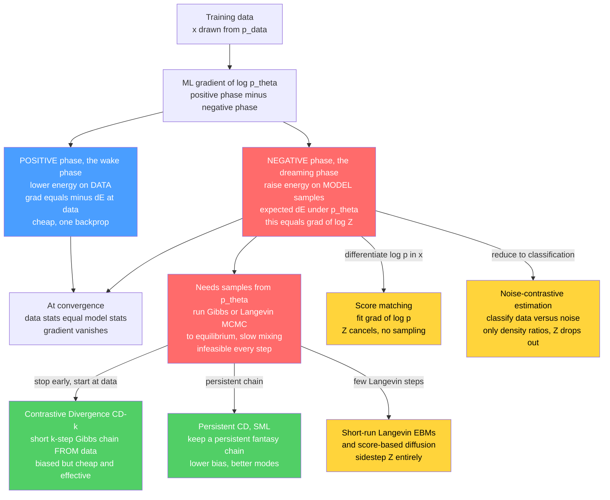

# ⚖️ Contrastive Divergence and EBM Training

> [!abstract] TL;DR
> An energy-based model writes $p_\theta(x) = e^{-E_\theta(x)}/Z(\theta)$, and training it by maximum likelihood produces a gradient with two forces: a **positive phase** that lowers energy on the *observed data* (easy) and a **negative phase** that raises energy on *samples drawn from the model itself* (hard). That negative phase is literally the gradient of the intractable $\log Z$ — an expectation under $p_\theta$ that in principle demands running **MCMC to equilibrium at every gradient step**. **Contrastive divergence** (Hinton, 2002) is the pivotal shortcut: instead of running the chain to equilibrium, run just $k$ Gibbs steps (usually $k=1$) *starting from the data*. The resulting CD-$k$ gradient is **biased** — it does not exactly follow the likelihood — yet it works well enough to make Boltzmann-machine and RBM training feasible and helped launch deep learning. **Persistent CD** (Tieleman, 2008) improves it with a running "fantasy" chain; **score matching**, **noise-contrastive estimation**, and **score-based/diffusion models** eventually supersede it by sidestepping $Z$ entirely. The whole history of EBM training is the history of dodging the partition function.

---

## Intuition

**Analogy — the tug-of-war against a dreaming machine.** Training an energy-based model is a two-handed tug-of-war on an energy landscape. One hand pulls the energy **down** on the real data: "yes, *this* is plausible — remember it." The other hand must push the energy **up** on everything the model *currently* believes is plausible but isn't: "no — stop dreaming *that*." The catch is that finding out what the model currently dreams is not free. To push down its fantasies you first have to *see* them, and seeing them means sampling from the model — running a slow Monte Carlo simulation all the way to equilibrium, over and over, once for every single training step. That is the wall.

**Contrastive divergence is the shortcut.** Instead of running the simulation to the bitter end, Hinton's trick is: start the simulation *at a real data point*, take one or two steps away from it, and look at where the model tried to drift. That short excursion already reveals the *local* direction the model wants to pull the data — enough to know which way to push back. It is technically the "wrong" gradient (it is not exact maximum likelihood, and it is provably biased), but it is fast, and it works. That one pragmatic compromise turned Boltzmann machines from a beautiful-but-untrainable idea into a workhorse of early deep learning.

---

## How It Works

### Core Mechanics

An energy-based model (EBM) assigns every configuration $x$ a scalar energy $E_\theta(x)$ and normalizes into a Boltzmann distribution — the same $p(x)=e^{-E/T}/Z$ form covered in [[The_Boltzmann_Distribution_in_Learning]], here with $T=1$:

$$p_\theta(x) = \frac{e^{-E_\theta(x)}}{Z(\theta)}, \qquad Z(\theta)=\sum_x e^{-E_\theta(x)}.$$

1. **The likelihood gradient splits into two phases.** Take the log and differentiate:
$$\log p_\theta(x) = -E_\theta(x) - \log Z(\theta),$$
$$\nabla_\theta \log p_\theta(x) \;=\; \underbrace{-\,\nabla_\theta E_\theta(x)}_{\textbf{positive phase (data)}} \;+\; \underbrace{\mathbb{E}_{x'\sim p_\theta}\!\big[\nabla_\theta E_\theta(x')\big]}_{\textbf{negative phase (model)}}.$$
The key identity is that $\nabla_\theta \log Z(\theta) = -\,\mathbb{E}_{x'\sim p_\theta}[\nabla_\theta E_\theta(x')]$. **The negative phase is nothing but the gradient of the intractable log-partition function** — the villain of the sibling note **Partition_Functions_and_Free_Energy_in_ML** wearing a training-loop disguise.

2. **Positive phase = lower energy on data (the "wake" phase).** The first term drives $E_\theta$ *down* on observed data, making real examples more probable. It uses only the data and the current parameters — cheap, one backprop pass. In a Boltzmann machine this is a **Hebbian** update: correlate co-active units on the data.

3. **Negative phase = raise energy on the model's fantasies (the "sleep"/"dreaming" phase).** The second term drives $E_\theta$ *up* on configurations the model *itself* considers likely. It is an **anti-Hebbian** update. But it is an expectation *under $p_\theta$*, so it requires **samples from the model** — and that is the whole problem.

4. **At convergence the two phases cancel.** Setting the gradient to zero gives $\mathbb{E}_{p_{\text{data}}}[\nabla_\theta E_\theta] = \mathbb{E}_{p_\theta}[\nabla_\theta E_\theta]$: **data statistics equal model statistics** (moment matching, the exponential-family view of [[Maximum_Entropy_and_Exponential_Families]]). For an RBM this reads $\langle v_i h_j\rangle_{\text{data}} = \langle v_i h_j\rangle_{\text{model}}$. The tug-of-war ends in a draw.

5. **Why the negative phase is genuinely hard.** Getting model samples means running a Markov chain — **Gibbs sampling** (see the sibling **Gibbs_Sampling_and_Conditional_Updates**) or **Langevin dynamics** — until it reaches equilibrium. Mixing can take enormously long, especially near phase transitions or with well-separated modes, and you would need this *for every gradient step*. That is infeasible. This is the partition-function intractability, back to bite you during optimization.

6. **Contrastive divergence (CD-$k$): don't reach equilibrium — take $k$ steps from the data.** Hinton's 2002 move: initialize the Gibbs chain *at a training example* $x_0=x$, run only $k$ steps to get $x_k$, and use $x_k$ in place of a true model sample:
$$\nabla_\theta^{\text{CD}} \;=\; -\nabla_\theta E_\theta(x_0) \;+\; \nabla_\theta E_\theta(x_k).$$
Usually $k=1$. This is **not** the maximum-likelihood gradient. What CD-$k$ actually minimizes is a *contrastive divergence*, a difference of KL divergences (see [[Relative_Entropy_and_Cross_Entropy]]):
$$\text{CD}_k = \mathrm{KL}(p_0 \,\|\, p_\infty) - \mathrm{KL}(p_k \,\|\, p_\infty),$$
where $p_0$ is the data distribution, $p_k$ is the distribution after $k$ chain steps, and $p_\infty=p_\theta$ is equilibrium. Starting at the data and stepping a little reveals the *local* direction the model wants to move mass; that is enough for a useful signal.

7. **Why CD is biased (and when it fails).** Because the chain never reaches equilibrium, the missing term $\nabla_\theta \mathrm{KL}(p_k\|p_\infty)$ is silently dropped — CD is a **biased** estimator of the likelihood gradient (Carreira-Perpiñán & Hinton, 2005). The bias is usually tolerable, but it grows when the chain mixes poorly: CD can **miss modes** the data-initialized chain never visits and can assign spurious low energy to regions far from the data.

8. **Persistent CD (PCD / Stochastic Maximum Likelihood).** Tieleman's 2008 refinement: **do not restart the chain from the data each step.** Keep a small set of persistent "fantasy particles" and continue them across parameter updates. Because $\theta$ changes slowly (small learning rate), the persistent chain stays near the *current* equilibrium, giving lower-bias gradients and much better mode coverage. PCD is the default for careful EBM training.

9. **Modern alternatives that dodge sampling.** **Score matching** (Hyvärinen) fits the *score* $\nabla_x \log p_\theta(x) = -\nabla_x E_\theta(x)$, in which $Z$ and its gradient **cancel entirely** — no sampling needed (sibling **Score_Matching_and_Score_Based_Models**). **Denoising score matching** foreshadows diffusion. **Noise-contrastive estimation** (Gutmann & Hyvärinen) turns density estimation into *classifying data vs. noise*, so only density ratios appear and $Z$ drops out. **Short-run / non-convergent Langevin EBMs** (Nijkamp, Du) train deep EBMs with a handful of Langevin steps (sibling **Langevin_Dynamics_and_SGLD**). The modern winners — **score-based and diffusion models** — succeed largely by sidestepping $Z$ and MCMC-in-the-loop altogether.

### Flow / Architecture



---

## Key Concepts

### Secondary Level

- **Energy = implausibility.** Low energy means "the model finds this likely"; high energy means "unlikely." Training reshapes the energy landscape.
- **Two forces.** Pull energy *down* on real data; push it *up* on the model's own guesses. When they balance, learning stops.
- **The hard part.** To push its guesses down, you must first *see* the model's guesses — which means a slow simulation.
- **The shortcut.** Contrastive divergence peeks only a step or two away from the data instead of running the simulation to the end. Faster, slightly wrong, good enough.

### Undergraduate Level

- **EBM likelihood gradient** $\nabla_\theta \log p_\theta(x) = -\nabla_\theta E_\theta(x) + \mathbb{E}_{p_\theta}[\nabla_\theta E_\theta]$; the second term is $-\nabla_\theta \log Z$.
- **Positive vs. negative phase** as Hebbian ($\langle\cdot\rangle_{\text{data}}$) minus anti-Hebbian ($\langle\cdot\rangle_{\text{model}}$) statistics; convergence is moment matching.
- **RBM Gibbs sampling** alternates $h_j\sim\sigma(b_j+\sum_i v_iW_{ij})$ and $v_i\sim\sigma(a_i+\sum_j W_{ij}h_j)$ — block Gibbs (see [[The_Metropolis_Algorithm_and_MCMC]]).
- **CD-$k$** replaces the model expectation with a $k$-step chain started at the data; **CD-1** is standard and made RBMs trainable.
- **Reconstruction error** as a cheap (imperfect) training monitor for CD.

### Graduate Level

- **CD is not a gradient of any fixed objective** in general; it minimizes $\mathrm{KL}(p_0\|p_\infty)-\mathrm{KL}(p_k\|p_\infty)$ but the update is not the exact gradient of even that (Sutskever & Tieleman, 2010). Its **bias** vanishes as $k\to\infty$ and near the data manifold.
- **Persistent CD / SML** is Robbins–Monro stochastic approximation: the persistent chain tracks $p_\theta$ as $\theta$ drifts, giving asymptotically unbiased gradients under decreasing step sizes and sufficient mixing.
- **Score matching** minimizes the Fisher divergence $\tfrac12\mathbb{E}_{p_{\text{data}}}\|\nabla_x\log p_\theta - \nabla_x\log p_{\text{data}}\|^2$, integrable by parts into a $Z$-free objective; **denoising SM** connects to Tweedie's formula and diffusion.
- **NCE** as logistic regression between data and a known noise distribution, with $\log Z$ absorbed as a *learnable constant* — consistent under mild conditions.
- **Short-run non-convergent MCMC** (Nijkamp et al.) defines an implicit generator via a fixed-length Langevin flow; the learned model is best understood as a *sampler*, not a calibrated density — a modern re-framing of CD's original compromise.

---

## Python Demo

```python
# Contrastive Divergence on a small Restricted Boltzmann Machine (RBM).
#   (a) Compare the CD-k gradient to the EXACT maximum-likelihood gradient.
#       The exact NEGATIVE phase is a brute-force sum over all 2^nv visible
#       states (feasible only because the model is tiny). CD-k replaces that
#       sum with a k-step Gibbs chain started AT the data -> biased but usable,
#       and the bias shrinks as k grows.
#   (b) Train an RBM with CD-1 and watch the two forces: the POSITIVE phase
#       pulls the free energy of DATA down, the NEGATIVE phase pushes the free
#       energy of MODEL fantasies up, until they meet (gradient ~ 0).
import numpy as np
import matplotlib.pyplot as plt

rng = np.random.default_rng(0)
def sigmoid(x): return 1.0 / (1.0 + np.exp(-x))

# ---- a tiny binary dataset with clear structure (two prototype patterns) ----
nv, nh = 6, 3
protos = np.array([[1, 1, 1, 0, 0, 0],
                   [0, 0, 0, 1, 1, 1]], dtype=float)
def make_data(n):
    base = protos[rng.integers(0, 2, size=n)]
    flip = (rng.random((n, nv)) < 0.10).astype(float)   # 10% bit-flip noise
    return np.abs(base - flip)
data = make_data(400)

# enumerate all 2^nv visible states ONCE (for the exact model expectation)
all_v = ((np.arange(2 ** nv)[:, None] >> np.arange(nv)[None, :]) & 1).astype(float)

def free_energy(V, a, b, W):
    # F(v) = -a.v - sum_j softplus(b_j + (vW)_j);  p(v) ~ exp(-F(v))
    return -V @ a - np.sum(np.logaddexp(0.0, b + V @ W), axis=1)

def exact_stats(a, b, W):
    """EXACT model statistics by brute force over all 2^nv states."""
    logp = -free_energy(all_v, a, b, W)
    logp -= logp.max()
    p = np.exp(logp); p /= p.sum()                 # exact p(v)
    ph = sigmoid(b + all_v @ W)                    # E[h|v]
    return all_v.T @ p, ph.T @ p, (all_v * p[:, None]).T @ ph  # <v>,<h>,<v h>

def data_stats(V, a, b, W):
    ph = sigmoid(b + V @ W)
    return V.mean(0), ph.mean(0), (V.T @ ph) / V.shape[0]

def exact_grad(V, a, b, W):
    vd, hd, vhd = data_stats(V, a, b, W)
    vm, hm, vhm = exact_stats(a, b, W)
    return vd - vm, hd - hm, vhd - vhm             # grads for a, b, W

def gibbs_k(V0, a, b, W, k):
    V = V0.copy()
    for _ in range(k):
        H = (rng.random((V.shape[0], nh)) < sigmoid(b + V @ W)).astype(float)
        V = (rng.random(V.shape) < sigmoid(a + H @ W.T)).astype(float)
    return V

def cd_grad(V, a, b, W, k, reps=40):
    """CD-k gradient: model term from a k-step Gibbs chain started at the data."""
    vd, hd, vhd = data_stats(V, a, b, W)
    gW = np.zeros_like(W)
    for _ in range(reps):                          # average chains -> lower variance
        vm, hm, vhm = data_stats(gibbs_k(V, a, b, W, k), a, b, W)
        gW += vhd - vhm
    return gW / reps

# ===== (a) CD-vs-exact gradient at a FIXED, non-converged parameter point =====
a0 = rng.normal(0, 0.2, nv)
b0 = rng.normal(0, 0.2, nh)
W0 = rng.normal(0, 0.5, (nv, nh))
_, _, gW_exact = exact_grad(data, a0, b0, W0)

ks = [1, 2, 5, 10, 20, 50]
errs, cd_store = [], {}
for k in ks:
    gW_cd = cd_grad(data, a0, b0, W0, k)
    cd_store[k] = gW_cd
    errs.append(np.linalg.norm(gW_cd - gW_exact) / np.linalg.norm(gW_exact))
print("relative gradient error vs k:",
      {k: round(e, 3) for k, e in zip(ks, errs)})

# ===== (b) train an RBM with CD-1 and track the two phases =====
a = np.zeros(nv); b = np.zeros(nh); W = rng.normal(0, 0.01, (nv, nh))
lr, epochs, bs = 0.1, 300, 50
recon_err, F_data, F_fant, F_rand = [], [], [], []
fant = data[rng.integers(0, data.shape[0], bs)].copy()  # persistent fantasy set
rand = rng.integers(0, 2, (300, nv)).astype(float)      # reference: random configs
for ep in range(epochs):
    idx = rng.permutation(data.shape[0])
    for s in range(0, data.shape[0], bs):
        V = data[idx[s:s + bs]]
        ph_d = sigmoid(b + V @ W)                       # POSITIVE phase (data)
        H = (rng.random(ph_d.shape) < ph_d).astype(float)
        Vk = (rng.random(V.shape) < sigmoid(a + H @ W.T)).astype(float)  # CD-1
        ph_m = sigmoid(b + Vk @ W)                      # NEGATIVE phase (model)
        W += lr * ((V.T @ ph_d) - (Vk.T @ ph_m)) / V.shape[0]
        a += lr * (V.mean(0) - Vk.mean(0))
        b += lr * (ph_d.mean(0) - ph_m.mean(0))
    recon = sigmoid(a + sigmoid(b + data @ W) @ W.T)
    recon_err.append(np.mean((data - recon) ** 2))
    fant = gibbs_k(fant, a, b, W, 5)                     # evolve fantasy particles
    F_data.append(free_energy(data, a, b, W).mean())
    F_fant.append(free_energy(fant, a, b, W).mean())
    F_rand.append(free_energy(rand, a, b, W).mean())

# ---------------------------- plots ----------------------------
fig, ax = plt.subplots(2, 2, figsize=(12, 9))

ax[0, 0].semilogy(ks, errs, "o-", lw=2, color="crimson")
ax[0, 0].set(xlabel="Gibbs steps k in CD-k", ylabel="relative error to exact grad",
             title="(a) CD-k gradient -> exact ML gradient as k grows")
ax[0, 0].grid(alpha=0.3, which="both")

g_ex = gW_exact.ravel()
ax[0, 1].axline((0, 0), slope=1, ls=":", color="gray", label="y = x (exact)")
ax[0, 1].scatter(g_ex, cd_store[1].ravel(),  s=45, color="orange", label="CD-1 (biased)")
ax[0, 1].scatter(g_ex, cd_store[20].ravel(), s=45, color="green",  label="CD-20 (closer)")
ax[0, 1].set(xlabel="exact gradient component", ylabel="CD gradient component",
             title="(a) CD-1 is biased; larger k tracks the exact gradient")
ax[0, 1].legend(); ax[0, 1].grid(alpha=0.3)

ax[1, 0].plot(recon_err, lw=2, color="navy")
ax[1, 0].set(xlabel="epoch", ylabel="reconstruction MSE",
             title="(b) Training with CD-1: reconstruction error drops")
ax[1, 0].grid(alpha=0.3)

ax[1, 1].plot(F_data, lw=2, label="F(data)  <- positive phase pulls DOWN")
ax[1, 1].plot(F_fant, lw=2, label="F(model fantasies)  <- negative phase pushes UP")
ax[1, 1].plot(F_rand, lw=2, ls="--", color="gray", label="F(random configs)")
ax[1, 1].set(xlabel="epoch", ylabel="mean free energy",
             title="(b) Two phases: data driven low, fantasies meet it")
ax[1, 1].legend(); ax[1, 1].grid(alpha=0.3)

plt.tight_layout()
plt.savefig("contrastive_divergence_ebm.png", dpi=110)
print("saved contrastive_divergence_ebm.png")
```

**What it shows.** Part (a) fixes a small RBM and computes the *exact* maximum-likelihood gradient by brute-forcing the negative-phase expectation over all $2^6$ visible states — then compares it to CD-$k$ for growing $k$. CD-1 is visibly **biased** (its gradient components scatter off the diagonal), but the relative error falls monotonically as $k$ increases, confirming CD is a biased-but-usable approximation that converges toward exact ML as the chain lengthens. Part (b) trains the RBM with CD-1 and makes the tug-of-war literal: the mean **free energy of the data** is driven *down* (positive phase), the free energy of the **model's fantasy particles** is pushed *up* and then meets the data curve (negative phase), while random configurations stay high — and reconstruction error drops throughout. The gradient vanishes exactly when the two free-energy curves meet: data statistics equal model statistics.

---

## Real-World Applications

- **Restricted Boltzmann machines and deep belief networks.** CD-1 is *the* algorithm that made RBMs trainable; stacking CD-trained RBMs into deep belief networks (Hinton, Osindero & Teh, 2006) provided the greedy layer-wise pretraining that reignited deep learning around 2006–2012.
- **Collaborative filtering (the Netflix Prize).** Salakhutdinov, Mnih & Hinton (2007) trained RBMs with CD for the Netflix recommender; RBM ensembles were part of the winning blend — a large-scale, commercial payoff of solving the negative-phase problem.
- **Unsupervised feature learning.** CD/PCD-trained RBMs and deep Boltzmann machines learn distributed feature representations for images, text, and speech, used as initializers or as generative building blocks.
- **Modern deep energy-based models.** Short-run Langevin and PCD-style training power deep EBMs for image generation, out-of-distribution detection, and **anomaly detection** — an EBM naturally scores "how surprising is this input" via its energy.
- **Neural-network quantum states in physics.** RBM wavefunctions (Carleo & Troyer, 2017) are optimized with sampling-based gradients closely related to the negative phase, solving quantum many-body ground states — the same physics-ML bridge running in reverse.

---

## Common Pitfalls

- **Dropping the negative phase.** Training on $-\nabla_\theta E_\theta(x)$ alone (no fantasies) has no counter-force: energies collapse toward $-\infty$ everywhere and the model degenerates. The negative phase is *not* optional — it *is* the gradient of $\log Z$ (see [[Partition_Functions_and_Free_Energy_in_ML]]).
- **Trusting reconstruction error as a likelihood proxy.** CD makes reconstruction error fall, but low reconstruction does not imply a good density model; report proper likelihoods via annealed importance sampling instead.
- **CD-1 with poor mixing misses modes.** Because the chain starts at the data and steps only once, regions the data-initialized chain never reaches keep spurious low energy. Symptoms: unrealistic samples, over-confident out-of-distribution scores. Increase $k$ or switch to **persistent CD**.
- **Restarting the persistent chain by accident.** PCD's whole benefit is chain *persistence*; re-seeding the fantasy particles from the data each step silently turns PCD back into CD and throws away its mode coverage.
- **Learning rate too high for PCD.** SML assumes $\theta$ drifts slowly so the persistent chain stays near equilibrium. A large step size lets the model outrun its own samples, and gradients degrade.
- **Sampling hidden states when you should use probabilities.** In the RBM negative phase, using $\mathbb{E}[h\mid v]=\sigma(\cdot)$ for the *final* statistic (rather than a hard Bernoulli sample) cuts variance substantially — a standard practical detail that is easy to get wrong.
- **Assuming CD equals maximum likelihood.** It does not. CD optimizes a difference of KL divergences and is biased; when you need calibrated likelihoods, prefer score matching, NCE, or a properly estimated $Z$.

---

## Related Concepts

- [[Partition_Functions_and_Free_Energy_in_ML]] — the intractable $\log Z$ whose gradient *is* the negative phase; CD is one of its three dodges.
- [[The_Boltzmann_Distribution_in_Learning]] — the $p(x)=e^{-E}/Z$ form that every EBM and Boltzmann machine instantiates.
- [[Maximum_Entropy_and_Exponential_Families]] — the moment-matching view: convergence means data statistics equal model statistics.
- [[Statistical_Mechanics_of_Machine_Learning_Overview]] — the map of the whole physics-ML correspondence this note sits inside.
- [[The_Metropolis_Algorithm_and_MCMC]] — the sampler family (Gibbs, Metropolis) the negative phase depends on.
- [[Stochastic_Differential_Equations_and_Langevin]] — Langevin dynamics behind SGLD and short-run deep EBMs.
- [[The_Ising_Model_and_Statistical_Physics]] — the physical cousin of a Boltzmann machine; same energy, same sampling problem.
- [[Classical_Statistical_Mechanics]] — origin of the Boltzmann distribution and equilibrium sampling.
- [[Relative_Entropy_and_Cross_Entropy]] — the KL divergences whose difference defines the contrastive-divergence objective.
- [[Maximum_Likelihood_and_Information]] — the exact objective CD approximates.
- [[Monte_Carlo_Integration]] — the estimation backbone for the negative-phase expectation.
- [[Diffusion_Models]] — the modern score-based successor that sidesteps $Z$ and MCMC-in-the-loop entirely.
- [[Variational_Inference_the_ELBO_and_VAEs]] — the *bound-$Z$* alternative to CD's *sample-$Z$* strategy.
- [[Variational_Autoencoders]] — amortized variational training, the other main route past the partition function.
- [[Optimization_Theory]] — the SGD framework these biased/stochastic gradients plug into.

---

## Review Questions

**Secondary.** In the tug-of-war picture, what does the "positive" hand do, what does the "negative" hand do, and why is the negative hand the hard one? Explain in one or two sentences why contrastive divergence is faster than doing the job "properly."

**Undergraduate.** Write the maximum-likelihood gradient of an EBM as a positive phase minus a negative phase, and show that the negative phase equals $-\nabla_\theta\log Z(\theta)$. For a restricted Boltzmann machine, state the CD-1 update for the weights $W_{ij}$ in terms of $\langle v_i h_j\rangle$ statistics, and explain precisely which expectation CD-1 approximates and how.

**Graduate.** (a) Explain why contrastive divergence is a *biased* estimator of the likelihood gradient, naming the term that is dropped when the Gibbs chain is truncated at $k$ steps. (b) Describe how persistent CD reduces this bias and under what conditions (learning rate, mixing) it behaves like true stochastic maximum likelihood. (c) Contrast the *strategies* of CD, score matching, and noise-contrastive estimation with respect to the partition function: which sample, which cancel $Z$ analytically, and which reduce estimation to classification — and argue why score-based/diffusion models ultimately "won" by sidestepping the negative phase.

---

## Sources

- Hinton, G. E. (2002). "Training Products of Experts by Minimizing Contrastive Divergence." *Neural Computation*, 14(8), 1771–1800. [direct.mit.edu](https://direct.mit.edu/neco/article/14/8/1771/6687)
- Tieleman, T. (2008). "Training Restricted Boltzmann Machines using Approximations to the Likelihood Gradient." *ICML*. [icml.cc / dl.acm.org](https://dl.acm.org/doi/10.1145/1390156.1390290)
- Carreira-Perpiñán, M. Á., & Hinton, G. E. (2005). "On Contrastive Divergence Learning." *AISTATS*. [proceedings.mlr.press](https://proceedings.mlr.press/r5/carreira-perpinan05a.html)
- Hyvärinen, A. (2005). "Estimation of Non-Normalized Statistical Models by Score Matching." *JMLR*, 6, 695–709. [jmlr.org](https://www.jmlr.org/papers/v6/hyvarinen05a.html)
- Gutmann, M., & Hyvärinen, A. (2010). "Noise-contrastive estimation." *AISTATS*. [proceedings.mlr.press](https://proceedings.mlr.press/v9/gutmann10a.html)
- Nijkamp, E., Hill, M., Han, T., Zhu, S.-C., & Wu, Y. N. (2019). "On the Anatomy of MCMC-Based Maximum Likelihood Learning of Energy-Based Models." *AAAI / arXiv:1903.12370*. [arxiv.org](https://arxiv.org/abs/1903.12370)

---

#statistical-mechanics #machine-learning #contrastive-divergence #energy-based-models #maximum-likelihood
