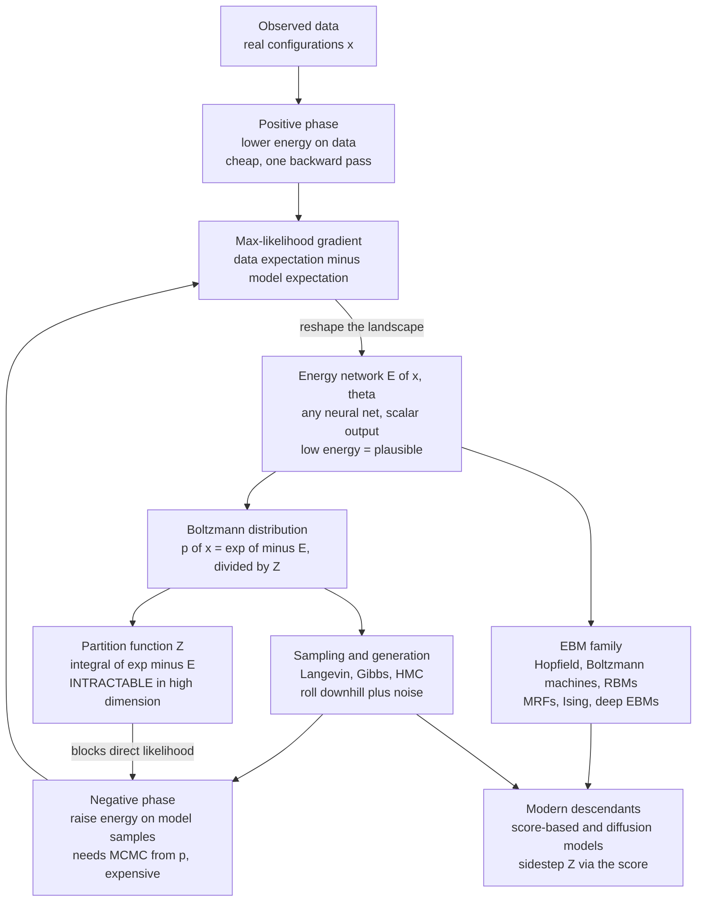

# 🏔️ Energy-Based Models

> [!abstract] TL;DR
> An **energy-based model (EBM)** parameterizes a scalar **energy** $E_\theta(x)$ over configurations and turns it into probability through the Boltzmann distribution $p_\theta(x) = e^{-E_\theta(x)}/Z$ — the most physics-native machine-learning framework. Learning means *carving low-energy valleys where the data lives and raising energy everywhere else*; its central obstacle is the intractable **partition function** $Z$, whose maximum-likelihood gradient needs a "negative phase" of MCMC sampling from the model — the difficulty that spawned contrastive divergence, score matching, and noise-contrastive estimation, and whose modern descendants (score-based and **diffusion** models) power state-of-the-art generative AI.

---

## Intuition

**Analogy:** Imagine sculpting an invisible landscape stretched over the space of *all possible images*. Wherever a real photograph sits, you dig a deep valley; over the nonsense in between — static, half-melted faces, impossible geometry — you raise hills. Now the landscape encodes everything you know about "real." To *recognize* an image, you just check its altitude: low ground means plausible, high ground means fake. To *generate* a new image, you drop a ball somewhere random and let it roll downhill, jostled by a little thermal shaking, until it settles into one of the valleys — and wherever it lands is a brand-new plausible image.

That landscape *is* an energy function, and this is exactly what an energy-based model does. Instead of directly outputting a normalized probability, it learns an **energy** $E_\theta(x)$ that scores how "good" any configuration is, then lets the **Boltzmann distribution** $p(x)\propto e^{-E(x)}$ translate *low energy into high probability*. Training reshapes the terrain — deepening data valleys, lifting the hills between them; generation is a downhill walk. Because the energy can be *any* neural network with a single scalar output, the model is free to sculpt an arbitrarily complicated landscape — the price of that freedom is that measuring the *total volume* under it (the normalizer $Z$) becomes the hardest part of the whole enterprise.

---

## How It Works

### Core Mechanics

An EBM defines a distribution over configurations $x$ (an image, a spin lattice, a sentence, a label-structure) through a learned scalar **energy** $E_\theta(x)$:

$$
p_\theta(x) = \frac{e^{-E_\theta(x)}}{Z_\theta}, \qquad Z_\theta = \int e^{-E_\theta(x)}\,dx .
$$

This is the Boltzmann/Gibbs measure with temperature folded into $E$ (see the sibling *The_Boltzmann_Distribution_in_Learning*). The design choices and consequences:

1. **Parameterize the *unnormalized* energy, not a normalized probability.** A normalizing-flow or autoregressive model must output numbers that already sum to one — a hard architectural constraint. An EBM only has to output *one scalar* per configuration, so $E_\theta$ can be **any** neural network: a CNN, a transformer, whatever. Low $E$ = high $p$ = "plausible." This is the source of the EBM's enormous flexibility.

2. **Learning = shaping the energy landscape.** Maximum-likelihood training maximizes $\log p_\theta(x)$ on data. Because $\log p_\theta(x) = -E_\theta(x) - \log Z_\theta$, the gradient splits into two opposing forces:

   $$
   \nabla_\theta \big(-\log p_\theta(x)\big) = \underbrace{\nabla_\theta E_\theta(x_{\text{data}})}_{\text{positive phase: push energy DOWN on data}} - \underbrace{\mathbb{E}_{x\sim p_\theta}\!\big[\nabla_\theta E_\theta(x)\big]}_{\text{negative phase: push energy UP on model samples}} .
   $$

   The **positive phase** lowers energy at observed data (cheap — one backward pass). The **negative phase** raises energy at configurations the *model itself* currently thinks are likely — a "carving valleys where data lives, filling in where the model hallucinates" contrastive picture. At the optimum the two phases balance: model samples look like data, and the landscape stops changing.

3. **The partition-function problem — the central difficulty.** The normalizer $Z_\theta = \int e^{-E_\theta(x)}\,dx$ is a high-dimensional integral over *every possible configuration*. It is **intractable**: you cannot evaluate $p_\theta(x)$ exactly, cannot compute the likelihood directly, and — worst of all — the negative-phase expectation $\mathbb{E}_{x\sim p_\theta}[\cdot]$ requires **drawing samples from $p_\theta$**, which itself needs MCMC. (The normalizer and its thermodynamic reading, the free energy $F=-\log Z$, get their own treatment in the sibling *Partition_Functions_and_Free_Energy_in_ML*.) This single obstacle is why EBM training is hard and why an entire toolkit exists to route around it.

4. **Sampling / generation.** Producing a sample means finding low-energy states stochastically. **Langevin dynamics** — gradient descent on the energy plus injected Gaussian noise, $x_{t+1} = x_t - \tfrac{\eta}{2}\nabla_x E_\theta(x_t) + \sqrt{\eta}\,\varepsilon_t$ — is the workhorse: "roll downhill with thermal kicks." **Gibbs sampling** suits discrete/structured EBMs; **Hamiltonian Monte Carlo** mixes faster in continuous ones. Sampling is simultaneously the *generative process* and the engine of the *negative phase during training*, which is why slow-mixing chains hurt twice.

5. **The EBM family — a unifying lens.** Fix the form of $E_\theta$ and you recover familiar models: **Hopfield networks** (associative memory as energy minima), **Boltzmann machines** and **RBMs** (stochastic EBMs with hidden units), **Markov random fields** / undirected graphical models (energy = sum of clique potentials), and the **Ising model** (the prototype EBM, energy $-\sum J_{ij}s_is_j$). Even a softmax classifier, a GAN, or a diffusion model can be *read* as an EBM — Grathwohl et al.'s "your classifier is secretly an energy-based model" (JEM) reinterprets the logits of an ordinary classifier as $-E_\theta(x)$. EBMs are less a single model than a *view* of probabilistic modeling.

### Flow / Architecture



**Training without $Z$ — the toolkit.** Because the negative phase is the bottleneck, EBM training is really a catalogue of ways to approximate or eliminate it:

- **Contrastive Divergence (CD, Hinton).** Approximate the negative phase with only a *few* MCMC steps started *from the data* rather than running the chain to equilibrium. Cheap, biased, and the reason RBMs became trainable. (See the sibling *Contrastive_Divergence_and_EBM_Training*.)
- **Persistent CD / Stochastic Maximum Likelihood.** Keep a persistent set of Markov chains that carry over between updates, so the negative samples track the slowly-changing model.
- **Score Matching (Hyvärinen).** Instead of matching probabilities, match the **score** $\nabla_x \log p_\theta(x) = -\nabla_x E_\theta(x)$ — and because the score is a *gradient of a log*, the intractable $\log Z$ (a constant in $x$) **differentiates away entirely**. No $Z$, no MCMC in the objective. (See *Score_Matching_and_Score_Based_Models*.)
- **Noise-Contrastive Estimation (NCE).** Turn density estimation into a *classification* problem: train the model to distinguish real data from samples of a known noise distribution; $Z$ becomes just another learnable parameter.
- **Denoising Score Matching.** Match the score of data corrupted by noise — the practical, stable variant that underlies modern **diffusion** models.

**Sampling in practice.** Generation reduces to running Langevin dynamics on $\nabla_x E_\theta$ (SGLD when the gradient is stochastic — see *Langevin_Dynamics_and_SGLD*), Gibbs sweeps for discrete lattices, or HMC for smooth continuous energies. The recurring headache is **slow mixing**: chains get stuck in one valley and never see the others, so samples lose diversity and the negative phase becomes biased. Score-based and diffusion models sidestep this by learning the score across a *ladder of noise levels* and denoising from pure noise, which mixes reliably — the descendants that finally made energy-based generation competitive at scale (foreshadowed in *Diffusion_Models_as_Non_Equilibrium_Thermodynamics*).

---

## Key Concepts

**Secondary (intuition-level):** An EBM scores every possible thing with an "energy" — low energy for realistic things, high energy for garbage. Turning energy into probability just means "low energy is more likely." Training digs the ground down under real examples and pushes it up under fakes; generating a new example means rolling a ball downhill into a valley. The one catch: to be a proper probability, everything must add up to 100%, and computing that total is nearly impossible, so most of the cleverness is about avoiding it.

**Undergraduate (mechanics-level):** $p_\theta(x)=e^{-E_\theta(x)}/Z_\theta$ with intractable $Z_\theta=\int e^{-E_\theta}$. The maximum-likelihood gradient $\nabla_\theta E_\theta(x_{\text{data}}) - \mathbb{E}_{x\sim p_\theta}[\nabla_\theta E_\theta(x)]$ and its positive/negative phases; why the negative phase needs samples from the model; contrastive divergence (short MCMC from data) as the practical fix; Langevin dynamics $x\leftarrow x-\tfrac{\eta}{2}\nabla_x E + \sqrt{\eta}\,\varepsilon$ for sampling; RBMs, Hopfield nets, MRFs and the Ising model as special cases; energy $=$ negative log-probability up to a constant.

**Graduate (structure-level):** The EBM as the maximal-flexibility member of the exponential family with $\log Z_\theta$ as the (convex in natural parameters) log-partition function; the equivalence of maximum-likelihood to matching sufficient-statistic expectations (data vs model); the **score** $\nabla_x\log p_\theta=-\nabla_x E_\theta$ as the $Z$-free object underlying score matching (Fisher-divergence objective, integration-by-parts identity), denoising score matching, and its equivalence to the diffusion/annealed-Langevin sampler of Song–Ermon; NCE as a self-normalizing MLE estimator; the bias of CD-$k$ and the equilibrium correctness of persistent-chain SML; the "EBM view" unifying classifiers (JEM), GANs (discriminator as energy), and diffusion (score of noised marginals); slow mixing and metastability as the statistical-mechanics obstruction that annealing / noise-tempering resolves.

---

## Python Demo

```python
# Energy-based models, end to end, in numpy + matplotlib:
#   (a) define an ENERGY over 2D (a ring), form p(x) ~ exp(-E(x)), and
#       visualize the energy landscape and the induced probability density;
#   (b) GENERATE samples via Langevin dynamics (roll downhill in E + noise)
#       and show they populate the low-energy ring;
#   (c) illustrate TRAINING via the contrastive gradient in 1D: push energy
#       DOWN on data points and UP on the model's own samples until the
#       learned density matches a bimodal target.
import numpy as np
import matplotlib.pyplot as plt
rng = np.random.default_rng(0)

# ---------------------------------------------------------------
# (a) A 2D energy landscape: a ring of radius r0. Low energy on the ring.
# ---------------------------------------------------------------
r0, width = 2.0, 0.12
def E_ring(x, y):
    r = np.sqrt(x**2 + y**2)
    return (r - r0)**2 / (2 * width)

g = np.linspace(-3.5, 3.5, 250)
X, Y = np.meshgrid(g, g)
E = E_ring(X, Y)
dens = np.exp(-(E - E.min()))          # unnormalized p(x) ~ exp(-E), for display

# ---------------------------------------------------------------
# (b) Langevin sampling from p(x) ~ exp(-E):  x <- x - eta*grad E + sqrt(2 eta)*noise
# ---------------------------------------------------------------
def gradE_ring(pts):                    # gradient of the ring energy
    x, y = pts[:, 0], pts[:, 1]
    r = np.sqrt(x**2 + y**2) + 1e-9
    coeff = (r - r0) / width
    return np.stack([coeff * x / r, coeff * y / r], axis=1)

eta, steps, n = 4e-3, 1200, 3000
pts = rng.normal(0, 0.4, size=(n, 2))   # start as a blob at the origin
for _ in range(steps):
    pts = pts - eta * gradE_ring(pts) + np.sqrt(2 * eta) * rng.normal(size=(n, 2))

# ---------------------------------------------------------------
# (c) Train a 1D EBM by the CONTRASTIVE gradient (down on data, up on samples)
#     E_w(x) = w . phi(x) with fixed RBF features -> gradient is E_data[phi] - E_model[phi]
# ---------------------------------------------------------------
data = np.concatenate([rng.normal(-2.0, 0.5, 400), rng.normal(2.0, 0.6, 400)])
grid = np.linspace(-6, 6, 600)
centers = np.linspace(-5, 5, 14)
h = 0.8
def phi(x):                             # (len(x), K) RBF features
    return np.exp(-0.5 * ((x[:, None] - centers[None, :]) / h) ** 2)

w = np.zeros(len(centers))
lr, reg = 0.5, 1e-3
phi_data = phi(data).mean(0)            # positive-phase statistic (fixed)
for it in range(400):
    Egrid = phi(grid) @ w               # current energy on the grid
    p = np.exp(-(Egrid - Egrid.min())); p /= p.sum()   # model density (1D -> grid is affordable)
    neg = rng.choice(grid, size=len(data), p=p)        # NEGATIVE-phase samples from the model
    grad = phi_data - phi(neg).mean(0)  # E_data[phi] - E_model[phi]
    w -= lr * grad + reg * w            # gradient descent: lowers E at data, raises E at model samples

E_learned = phi(grid) @ w
p_learned = np.exp(-(E_learned - E_learned.min())); p_learned /= np.trapz(p_learned, grid)

# ---------------------------------------------------------------
# Plots
# ---------------------------------------------------------------
fig, ax = plt.subplots(2, 2, figsize=(13, 11))

c0 = ax[0, 0].contourf(X, Y, E, 40, cmap="viridis")
ax[0, 0].set_title("(a) Energy landscape E(x)  -  deep ring-shaped valley")
fig.colorbar(c0, ax=ax[0, 0], label="energy")

c1 = ax[0, 1].contourf(X, Y, dens, 40, cmap="magma")
ax[0, 1].set_title("(a) Induced density  p(x) ~ exp(-E(x))")
fig.colorbar(c1, ax=ax[0, 1], label="unnormalized p")

ax[1, 0].contourf(X, Y, dens, 40, cmap="magma", alpha=0.6)
ax[1, 0].scatter(pts[:, 0], pts[:, 1], s=3, c="cyan", alpha=0.35)
ax[1, 0].set_title("(b) Langevin samples land in the low-energy ring")
ax[1, 0].set_xlim(-3.5, 3.5); ax[1, 0].set_ylim(-3.5, 3.5)

ax[1, 1].hist(data, bins=60, density=True, alpha=0.4, color="gray", label="target data")
ax[1, 1].plot(grid, p_learned, "r", lw=2, label="learned EBM density")
ax[1, 1].plot(grid, (E_learned - E_learned.min()) / 12, "b--", lw=1.5, label="learned energy (scaled)")
ax[1, 1].set_title("(c) Contrastive training: energy dug down where data lives")
ax[1, 1].legend()

plt.tight_layout()
plt.savefig("energy_based_models.png", dpi=120)
print("ring samples radius mean:", np.sqrt((pts**2).sum(1)).mean(), " (target r0 =", r0, ")")
```

Panel (a) shows the sculpted terrain — a circular trench of low energy — and the probability it induces (bright ring). Panel (b) confirms that Langevin dynamics, started as a blob at the origin, flows downhill-plus-noise until the chains coat exactly that ring (the printed mean radius lands near `r0`). Panel (c) is the training idea in miniature: at each step we contrast the fixed **positive-phase** statistic (features averaged over data) against the **negative-phase** statistic (features averaged over samples drawn from the *current* model), and the update carves energy down wherever data sits and lifts it wherever the model over-produces — until the learned bimodal density matches the target. In 1D we can afford to read the model density off a grid; in high dimensions that grid is the intractable $Z$, and the very same negative-phase samples must instead come from MCMC — the whole difficulty of real EBM training.

---

## Real-World Applications

- **Generative modeling of images.** Deep EBMs trained with Langevin-based sampling (Du & Mordatch) and, far more successfully, their **score-based / diffusion** descendants (Song & Ermon; Ho et al.'s DDPM) generate photorealistic images by learning the score $-\nabla_x E$ across noise levels — the engine inside Stable Diffusion and its kin.
- **Out-of-distribution / anomaly detection.** Because $E_\theta(x)$ is literally an "implausibility score," a high energy flags outliers. Energy scores derived from ordinary classifiers (Liu et al., "Energy-based OOD detection") outperform softmax confidence for detecting inputs the model has never seen.
- **Structured prediction and constraint satisfaction.** LeCun's energy-based *learning* frames tasks like sequence labeling, segmentation, and parsing as minimizing an energy over structured outputs; conditional EBMs and CRFs (a special case) enforce global consistency that per-token softmaxes cannot.
- **Associative memory.** Hopfield networks store patterns as energy minima and recall them by descending the landscape from a noisy cue; **modern Hopfield networks** with exponential capacity turn out to be equivalent to the attention mechanism inside transformers (Ramsauer et al.).
- **Denoising and restoration.** Denoising score matching learns the gradient field that points corrupted data back toward the clean manifold — the basis of learned image denoisers and inverse-problem solvers.
- **Physics-inspired modeling.** The Ising model, spin glasses, and protein-folding energy functions are literal EBMs; the same machinery trains models of molecular configurations and materials.

---

## Common Pitfalls

- **Forgetting that $Z$ hides the whole difficulty.** Beginners port intuition from a $K$-way softmax (trivial normalizer) to a deep EBM (a sum over exponentially many states) and assume the likelihood is available. It is not — you can compare $E(x_1)$ vs $E(x_2)$, but you cannot read off $p(x)$ without $Z$.
- **Treating contrastive divergence as exact.** CD-$k$ runs only a few MCMC steps from data, so its negative samples are *not* equilibrium samples; the gradient is biased and can drive the energy to spurious minima. Persistent chains or more steps mitigate this, but the bias is real.
- **Ignoring MCMC mixing.** Langevin/Gibbs chains get trapped in one mode and never visit the others, so both your samples and your negative phase silently lose modes ("mode collapse" by starvation). Diagnose mixing; use tempering, replica exchange, or noise-annealed (diffusion-style) sampling.
- **Unbounded / exploding energies.** With an unconstrained neural energy, training can push data energy to $-\infty$ and sample energy to $+\infty$ without ever equilibrating — the landscape becomes a cliff. Spectral normalization, gradient penalties, and L2 regularization on the energy keep it well-behaved.
- **Confusing low energy with high likelihood in high dimensions.** The *mode* (lowest energy point) is often *not* a typical sample — in high dimensions probability mass lives in a thin shell away from the mode (the "typical set"). Optimizing energy to generate can yield adversarial-looking artifacts; you must *sample*, not minimize.
- **Comparing energies across different trainings.** $E_\theta$ is defined only up to an additive constant (absorbed by $Z$); absolute energy values are meaningless across models or checkpoints. Only differences within a single model matter.

---

## Related Concepts

- [[The_Boltzmann_Distribution_in_Learning]] — the $p\propto e^{-E}$ measure that *defines* an EBM; this note is its direct sequel.
- [[Statistical_Mechanics_of_Machine_Learning_Overview]] — the parent survey placing EBMs inside the statistical-mechanics/ML correspondence.
- [[Classical_Statistical_Mechanics]] — the canonical ensemble and Gibbs measure that EBMs import wholesale from physics.
- [[The_Ising_Model_and_Statistical_Physics]] — the prototype EBM: energy $-\sum J_{ij}s_is_j$ with an intractable partition function.
- [[The_Metropolis_Algorithm_and_MCMC]] — how to draw the negative-phase / generative samples when $Z$ is out of reach.
- [[Stochastic_Differential_Equations_and_Langevin]] — the Langevin dynamics used to sample $e^{-E}$ and to run the negative phase.
- [[Monte_Carlo_Integration]] — the estimator behind approximating the intractable model expectation.
- [[Maximum_Entropy_Principle]] — why the Boltzmann/exponential form is the least-biased distribution given constraints, grounding the EBM parameterization.
- [[Diffusion_Models]] — the score-based descendant that sidesteps $Z$ and MCMC mixing and now dominates generative modeling.
- [[GAN]] — an implicit generative model whose discriminator can be read as an energy; a key EBM contrast point.
- [[VAE]] — a normalized latent-variable alternative to the unnormalized EBM, trading flexibility for a tractable bound.
- [[Neural_Network_Basics]] — the arbitrary net that serves as the energy function $E_\theta$.
- [[Backpropagation]] — computes both $\nabla_\theta E$ (positive phase) and $\nabla_x E$ (for Langevin sampling).
- [[Gradient_Descent_Variants]] — the optimizer that reshapes the energy landscape during training.
- [[Loss_Functions]] — negative log-likelihood of a Boltzmann model is the EBM training loss.
- [[Optimization_Theory]] — energy minimization and the convex log-partition structure underlying learning.
- [[Probability_and_Statistics]] — the exponential-family and expectation-matching machinery EBMs rely on.
- [[Information_Theory]] — entropy, KL, and the Fisher divergence that score matching minimizes.

---

## Review Questions

1. **(Conceptual)** Write the maximum-likelihood gradient of an EBM and identify its positive and negative phases. Explain precisely *why* the negative phase is expensive while the positive phase is cheap, and what the two phases are doing to the energy landscape at convergence.
2. **(Scenario)** You want to train a deep EBM on 64×64 images but running MCMC to equilibrium for the negative phase is hopeless. Name three concrete strategies that let you train *without* ever computing $Z$, state what each one approximates or eliminates, and say which one you would reach for if you also needed high-quality *samples* at the end.
3. **(Trade-off)** An EBM lets $E_\theta$ be any neural network, whereas a normalizing flow forces an architecture whose Jacobian and normalizer are tractable. Discuss the trade-off in flexibility, likelihood evaluation, and sampling between these two, and explain why score-based/diffusion models are often described as "the EBMs that finally worked at scale."

---

## Sources

- Y. LeCun, S. Chopra, R. Hadsell, M. Ranzato, F. Huang, "A Tutorial on Energy-Based Learning," in *Predicting Structured Data*, MIT Press (2006). [link](http://yann.lecun.com/exdb/publis/pdf/lecun-06.pdf)
- A. Hyvärinen, "Estimation of Non-Normalized Statistical Models by Score Matching," *JMLR* 6:695–709 (2005). [link](https://jmlr.org/papers/v6/hyvarinen05a.html)
- Y. Du, I. Mordatch, "Implicit Generation and Modeling with Energy-Based Models," *NeurIPS* 2019. [arXiv:1903.08689](https://arxiv.org/abs/1903.08689)
- Y. Song, S. Ermon, "Generative Modeling by Estimating Gradients of the Data Distribution," *NeurIPS* 2019. [arXiv:1907.05600](https://arxiv.org/abs/1907.05600)
- W. Grathwohl, K.-C. Wang, J.-H. Jacobsen, D. Duvenaud, M. Norouzi, K. Swersky, "Your Classifier is Secretly an Energy Based Model and You Should Treat it Like One," *ICLR* 2020. [arXiv:1912.03263](https://arxiv.org/abs/1912.03263)

---

#statistical-mechanics #machine-learning #energy-based-models #boltzmann #generative-models
