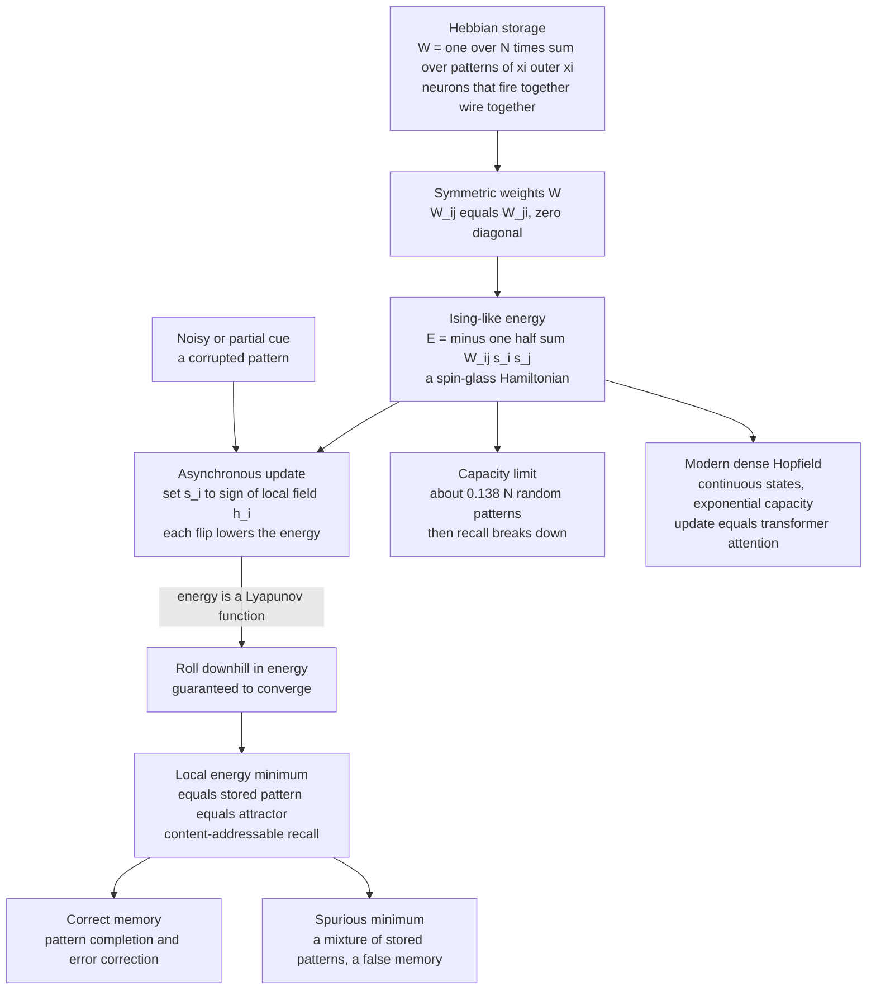

# 🧲 Hopfield Networks and Associative Memory

> [!abstract] TL;DR
> A **Hopfield network** stores patterns as the low-energy valleys (**attractors**) of an Ising-like energy function; show it a corrupted or partial cue and its **asynchronous update dynamics** simply roll downhill in energy — a provably convergent process — until the state settles into the nearest stored memory. This is **associative (content-addressable) memory**: retrieve the whole from a fragment. John Hopfield's 1982 model imported **spin-glass physics** into neural networks (its famous $\approx 0.138N$ capacity was later computed with the replica method), founded the energy-based view of learning, and — through **modern dense Hopfield networks whose update equals transformer attention** — has staged a dramatic comeback at the center of deep learning.

---

## Intuition

**Analogy — FIRST.** You catch a whiff of a scent and an entire childhood memory floods back — complete, vivid, reconstructed from a tiny fragment. You didn't look it up by an address; the *content* of the cue pulled the whole memory out of storage. That is **associative memory**: retrieving a complete pattern from a partial or noisy fragment.

A Hopfield network does exactly this with physics. It carves each memory as a **valley in an energy landscape**. Present a corrupted version of a stored pattern — a face with half the pixels scrambled, a word with letters missing — and the network doesn't "search." It simply **rolls downhill** in energy, flipping neurons one at a time, each flip lowering the energy, until it settles into the bottom of the nearest valley: the clean, complete stored memory. Built by a physicist from the mathematics of magnets — **spin glasses** — the model was the spark that reconnected neuroscience, statistical physics, and AI. And its central equation is alive today inside the attention layers of modern transformers.

---

## How It Works

### Core Mechanics

A Hopfield network is a fully recurrent network of $N$ neurons, each a **binary "spin"** $s_i \in \{-1, +1\}$, with **symmetric** connection weights $W_{ij} = W_{ji}$ and no self-connections ($W_{ii} = 0$). Four ideas do all the work:

1. **Hebbian storage (writing memories).** To store a set of target patterns $\{\boldsymbol{\xi}^{\mu}\}_{\mu=1}^{P}$, set the weights by the **outer-product (Hebbian) rule**
$$ W_{ij} = \frac{1}{N}\sum_{\mu=1}^{P} \xi_i^{\mu}\,\xi_j^{\mu}, \qquad W_{ii}=0. $$
Two neurons that are *the same sign* across many stored patterns get a strong positive coupling; two that usually *disagree* get a negative one — literally "neurons that fire together wire together." Each pattern is written into the weights in **one shot**, no iterative training. The connection matrix *is* the memory.

2. **An Ising-like energy (the physics core).** Define the scalar
$$ E(\mathbf{s}) = -\tfrac{1}{2}\sum_{i,j} W_{ij}\,s_i s_j. $$
This is *identical in form* to the Hamiltonian of a **spin glass** — a magnet with disordered, competing couplings (see `[[The_Ising_Model_and_Statistical_Physics]]`). Hebbian storage is precisely the choice of couplings that carves a valley at each stored pattern: every $\boldsymbol{\xi}^{\mu}$ is a **local energy minimum**.

3. **Asynchronous update (recall = rolling downhill).** Recall works by repeatedly picking one neuron $i$ and aligning it with its **local field** $h_i = \sum_j W_{ij} s_j$:
$$ s_i \leftarrow \operatorname{sign}(h_i). $$
The key theorem: with **symmetric weights**, each such single-neuron update can only *decrease or hold* the energy — it never increases it. Flipping $s_i$ changes the energy by $\Delta E = -\Delta s_i\, h_i \le 0$ by construction. So $E(\mathbf{s})$ is a **Lyapunov function** for the dynamics: the state descends the landscape monotonically and, since energy is bounded below and states are discrete, it **provably converges** to a fixed point — a local minimum, i.e. a stored pattern (an **attractor**). Memory retrieval *is* energy minimization.

4. **Content-addressability.** Unlike a computer's RAM, where you must know an *address* to fetch a byte, a Hopfield net is addressed **by content**: any cue inside a memory's basin of attraction flows to that memory. A fragment recalls the whole; noise is corrected as the state slides to the valley floor. This is **pattern completion** and **error correction** as a single physical process.

**Statistical mechanics of the model.** Because the energy is a spin-glass Hamiltonian, physicists could analyze the network with statistical mechanics. **Amit, Gutfreund, and Sompolinsky (1985)** used the **replica method** and mean-field theory to solve the Hopfield model, computing its phase diagram — a *retrieval* phase (memories are stable), a *spin-glass* phase (only spurious jumbles survive), and a *paramagnetic* phase (nothing is stored) — and the exact **storage capacity**. This launched the **statistical mechanics of neural networks** (developed further in the sibling notes *Spin_Glasses_and_the_Energy_Landscape_of_Networks* and *The_Replica_Method_and_Neural_Network_Capacity*).

**Capacity — the famous 0.138N limit.** A network of $N$ neurons can reliably store only about
$$ P_{\max} \approx 0.138\,N $$
random patterns. Push past that load $\alpha = P/N \approx 0.138$ and the stored memories start **interfering** — the crosstalk term in each neuron's field overwhelms the signal — and recall collapses catastrophically. This is a fundamental **capacity-versus-reliability** trade-off, and one of the cleanest examples of a **phase transition in learning** (see `[[Phase_Transitions_and_Critical_Phenomena]]`).

**Spurious states and the honest limitations.** The classic model has real flaws. Besides the stored patterns, the dynamics also creates **spurious minima** — stable mixtures (e.g. sign combinations of three stored patterns) that are attractors but correspond to no real memory: *false memories*. The network can also get **stuck in a shallow local minimum** rather than the intended one. Adding **temperature / noise** fixes much of this: the state can then thermally hop *out* of shallow spurious wells. This stochastic Hopfield net — updates governed by the Boltzmann distribution rather than a hard sign — is exactly a **Boltzmann machine** (the sibling *Boltzmann_Machines_and_RBMs*), and lowering the temperature during recall is simulated annealing. The Boltzmann distribution that governs those noisy updates is developed in `[[The_Boltzmann_Distribution_in_Learning]]`.

**Continuous and optimization extensions.** Hopfield (1984) introduced **continuous-valued** neurons (graded, sigmoidal), preserving the energy-descent guarantee, and mapped combinatorial problems (famously the Traveling Salesman Problem) onto energy minima — using the landscape itself as an **optimizer**. The broader "define a probability by an energy" idea is the subject of the sibling *Energy_Based_Models*.

**The modern comeback — Hopfield = attention.** **Dense / modern Hopfield networks** (Krotov–Hopfield 2016; Ramsauer et al. 2020) replace the quadratic energy with a sharper interaction (exponential / softmax), giving **exponential storage capacity** and **continuous states**. The striking punchline of "Hopfield Networks is All You Need": the modern Hopfield **retrieval update is essentially the attention mechanism of transformers** — a softmax over stored patterns weighted by similarity to the query. Associative memory reinterpreted as attention/retrieval. The physics of memory is alive inside every large language model (see `[[Attention_Mechanism]]`, `[[Transformer_Architecture]]`).

### Flow / Architecture



---

## Key Concepts

**Secondary (intuition-level).** A Hopfield network is a memory that works by *smell, not by address* — you give it a piece and it hands back the whole. Each memory is a valley; a noisy cue is a ball dropped on a hillside that rolls to the bottom of the nearest valley, arriving as the clean memory. It can only hold so many memories before they blur into each other, and it sometimes invents a "false memory" (a jumble that is also a valley).

**Undergraduate (mechanics-level).** Binary spins $s_i = \pm 1$; symmetric zero-diagonal weights; Hebbian storage $W_{ij} = \frac{1}{N}\sum_\mu \xi_i^\mu \xi_j^\mu$; the energy $E = -\frac{1}{2}\sum_{ij} W_{ij} s_i s_j$; the asynchronous rule $s_i \leftarrow \operatorname{sign}(\sum_j W_{ij} s_j)$; the single-flip energy change $\Delta E = -\Delta s_i\, h_i \le 0$ giving a **Lyapunov / energy** function and guaranteed convergence to a fixed point; stored patterns as attractors; basins of attraction; the crosstalk (interference) term that limits capacity to $\approx 0.138N$; spurious mixture states.

**Graduate (structure-level).** The energy is a spin-glass Hamiltonian with structured (Hebbian) couplings; the **Amit–Gutfreund–Sompolinsky** replica/mean-field solution yielding the retrieval / spin-glass / paramagnetic phase diagram and the exact capacity $\alpha_c \approx 0.138$; the retrieval overlap order parameter $m^\mu = \frac{1}{N}\sum_i \xi_i^\mu s_i$; symmetric weights guaranteeing a Lyapunov function (asymmetric weights break it, giving limit cycles or chaos — the price of biological realism); stochastic dynamics as **Glauber updates** under the Boltzmann distribution, connecting the $T>0$ Hopfield net to the Boltzmann machine and to simulated annealing; **modern dense Hopfield** energy $E = -\operatorname{lse}(\beta, X^T \boldsymbol{\xi}) + \tfrac12 \boldsymbol{\xi}^T\boldsymbol{\xi}$ whose one-step update is the transformer **softmax attention**, with exponential capacity and one-step convergence.

---

## Python Demo

```python
# Hopfield associative memory, three experiments in one script (numpy + matplotlib):
#   (a) STORE  : write binary patterns into weights via the HEBBIAN outer-product rule.
#   (b) RECALL : corrupt a stored pattern, run ASYNCHRONOUS dynamics, and watch the
#                state get cleaned up while the ENERGY decreases MONOTONICALLY.
#   (c) CAPACITY: as more random patterns are stored, recall collapses near alpha ~ 0.138.
import numpy as np
import matplotlib.pyplot as plt

rng = np.random.default_rng(0)

# ------------------------------------------------------------------
# 0) Three visually-distinct 7x7 patterns as +/-1 "spin" vectors.
# ------------------------------------------------------------------
GRID = 7
patterns_txt = {
    "cross": ["...X...", "...X...", "...X...", "XXXXXXX", "...X...", "...X...", "...X..."],
    "box":   ["XXXXXXX", "X.....X", "X.....X", "X.....X", "X.....X", "X.....X", "XXXXXXX"],
    "exes":  ["X.....X", ".X...X.", "..X.X..", "...X...", "..X.X..", ".X...X.", "X.....X"],
}
def to_vec(rows):
    return np.array([1.0 if c == "X" else -1.0 for r in rows for c in r])

names = list(patterns_txt)
P = np.stack([to_vec(patterns_txt[n]) for n in names])     # shape (3, 49)
N = P.shape[1]

# ------------------------------------------------------------------
# (a) STORE: Hebbian rule  W = (1/N) * sum_mu  xi xi^T ,  zero self-coupling.
# ------------------------------------------------------------------
def hebbian_weights(patterns):
    n = patterns.shape[1]
    W = (patterns.T @ patterns) / n                        # sum of outer products
    np.fill_diagonal(W, 0.0)                                # no neuron feeds itself
    return W

W = hebbian_weights(P)

def energy(s, W):
    return -0.5 * s @ W @ s                                 # Ising / spin-glass Hamiltonian

# ------------------------------------------------------------------
# (b) RECALL: corrupt a stored pattern, then ASYNCHRONOUS updates.
#     Each neuron aligns with its local field h_i = sum_j W_ij s_j; every flip
#     can only DECREASE the energy -> guaranteed descent to an attractor.
# ------------------------------------------------------------------
target = P[0].copy()                                        # the "cross"
s = target.copy()
corrupt = rng.choice(N, size=N // 4, replace=False)         # scramble ~25% of pixels
s[corrupt] *= -1.0
start = s.copy()

energies = [energy(s, W)]
snapshots = [start.copy()]                                  # snapshot per full sweep
for _ in range(6):
    for i in rng.permutation(N):                            # asynchronous: one at a time
        s[i] = 1.0 if W[i] @ s >= 0 else -1.0
        energies.append(energy(s, W))
    snapshots.append(s.copy())
recovered = s
print(f"(b) recall overlap with target = {(recovered @ target) / N:.3f}   (1.0 = perfect)")

# ------------------------------------------------------------------
# (c) CAPACITY: store P random patterns; measure mean recall overlap vs load alpha=P/N.
# ------------------------------------------------------------------
def recall_quality(Nn=100, alpha=0.1, noise=0.05, trials=20, sweeps=5):
    Pn = max(1, int(round(alpha * Nn)))
    overlaps = []
    for _ in range(trials):
        pats = rng.choice([-1.0, 1.0], size=(Pn, Nn))
        Wc = (pats.T @ pats) / Nn
        np.fill_diagonal(Wc, 0.0)
        mu = int(rng.integers(Pn))
        st = pats[mu].copy()
        st[rng.choice(Nn, size=int(noise * Nn), replace=False)] *= -1.0   # small corruption
        for _ in range(sweeps):
            for i in rng.permutation(Nn):
                st[i] = 1.0 if Wc[i] @ st >= 0 else -1.0
        overlaps.append((st @ pats[mu]) / Nn)               # 1.0 = recovered exactly
    return float(np.mean(overlaps))

alphas = np.linspace(0.02, 0.30, 15)
overlaps = [recall_quality(alpha=a) for a in alphas]

# ------------------------------------------------------------------
# Plots
# ------------------------------------------------------------------
def show(ax, vec, title):
    ax.imshow(vec.reshape(GRID, GRID), cmap="binary", vmin=-1, vmax=1)
    ax.set_title(title, fontsize=9); ax.set_xticks([]); ax.set_yticks([])

fig, axes = plt.subplots(1, len(snapshots) + 1, figsize=(2.0 * (len(snapshots) + 1), 2.3))
show(axes[0], target, "stored\n(target)")
show(axes[1], snapshots[0], "corrupted\ncue")
for k, snap in enumerate(snapshots[1:], start=1):
    show(axes[k + 1], snap, f"sweep {k}")
plt.suptitle("(b) Recall: a noisy cue is cleaned up by energy descent", y=1.04)
plt.tight_layout(); plt.savefig("hopfield_recall.png", dpi=120, bbox_inches="tight")

fig, ax = plt.subplots(figsize=(7, 4))
ax.plot(energies, color="crimson", lw=1.5)
ax.set_xlabel("asynchronous update step"); ax.set_ylabel("energy  E = -1/2 sT W s")
ax.set_title("Energy decreases MONOTONICALLY -> convergence to an attractor")
plt.tight_layout(); plt.savefig("hopfield_energy.png", dpi=120)

fig, ax = plt.subplots(figsize=(7, 4))
ax.plot(alphas, overlaps, "o-", color="steelblue")
ax.axvline(0.138, color="crimson", ls="--", label="alpha_c = 0.138  (AGS limit)")
ax.set_xlabel("load  alpha = P / N"); ax.set_ylabel("mean recall overlap")
ax.set_title("(c) Capacity: recall collapses past alpha ~ 0.138")
ax.legend(); plt.tight_layout(); plt.savefig("hopfield_capacity.png", dpi=120)
```

Running it: **(b)** the corrupted "cross" is progressively cleaned up over a few sweeps and the printed overlap reaches $1.0$ — while the energy curve falls monotonically and then flattens, the visual signature of settling into an attractor. **(c)** the mean recall overlap sits near $1.0$ (perfect) for small loads, then plunges as $\alpha = P/N$ crosses the crimson line at $0.138$ — the storage capacity made visible as memories begin to interfere and dissolve into spurious states.

---

## Real-World Applications

- **Content-addressable memory and pattern completion.** The prototype of retrieve-by-content storage: databases, caches, and de-noising systems where a partial/corrupted key must recover a full record. Reconstructing an occluded image or completing a fragment is recall from a basin of attraction.
- **Error correction and denoising.** The energy-descent dynamics correct bit-flip noise by flowing to the nearest clean pattern — the same idea behind associative de-noisers and, conceptually, some error-correcting decoders.
- **Combinatorial optimization.** Continuous Hopfield networks map problems (TSP, graph coloring, scheduling) onto an energy whose minima are good solutions; the network anneals toward them. Modern spin-based optimizers and quantum/coherent Ising machines (and D-Wave-style annealers) are direct descendants.
- **Models of biological memory.** Attractor dynamics are a leading theory of how the brain stores and completes memories — hippocampal pattern completion, persistent "bump" attractors in head-direction and grid/place-cell systems, and memory consolidation. Hebbian storage mirrors long-term potentiation (see `[[Synaptic_Plasticity_and_LTP]]`, `[[Learning_and_Memory_Systems]]`).
- **Modern attention and memory-augmented networks.** Dense Hopfield layers are used as differentiable associative-memory modules; the equivalence to attention means every transformer is, in part, running Hopfield retrieval. Retrieval-augmented and memory-augmented architectures inherit the same associative-recall core — a straight line from 1982 to today's LLMs.

---

## Common Pitfalls

- **Forgetting to zero the diagonal.** Leaving $W_{ii} \neq 0$ adds a self-reinforcement term that manufactures spurious stable states and can freeze neurons regardless of context. Always set $W_{ii}=0$.
- **Using synchronous updates and expecting convergence.** The Lyapunov guarantee holds for **asynchronous** (one-neuron-at-a-time) updates. Update every neuron *simultaneously* and the network can fall into a period-2 oscillation between two states — energy no longer decreases monotonically.
- **Breaking weight symmetry.** The convergence proof relies on $W_{ij}=W_{ji}$. Asymmetric couplings (more biologically realistic) can produce limit cycles or chaos instead of clean fixed-point recall; that is a feature for sequence generation but a bug for static memory.
- **Overloading past capacity.** Cramming in more than $\approx 0.138N$ random patterns doesn't degrade gracefully — recall collapses abruptly and *all* memories can be lost to a spin-glass jumble. Respect the load, or switch to modern dense Hopfield / Boltzmann machines.
- **Mistaking a spurious minimum for the answer.** The network happily converges to a stable *mixture* of stored patterns. A converged, low-energy state is not a guarantee of a *correct* memory — check the overlap with intended patterns, and use temperature/annealing to escape shallow spurious wells.
- **Storing correlated patterns with the naive Hebb rule.** The $\approx 0.138N$ figure assumes *random, uncorrelated* patterns. Highly correlated patterns (e.g. natural images) interfere far sooner; use pseudo-inverse / storkey learning or the modern dense energy instead.

---

## Related Concepts

- [[The_Ising_Model_and_Statistical_Physics]] — the spin system whose Hamiltonian the Hopfield energy copies; the physics the model imports.
- [[The_Boltzmann_Distribution_in_Learning]] — the $T>0$ stochastic update rule and the softmax at the heart of modern (dense) Hopfield energy.
- [[Attention_Mechanism]] — the transformer operation that the modern Hopfield retrieval update is provably equivalent to.
- [[Transformer_Architecture]] — where that attention-as-associative-memory lives inside today's large models.
- [[Dynamical_Systems_and_Attractors]] — the general theory of fixed-point attractors and basins that recall exploits.
- [[Phase_Transitions_and_Critical_Phenomena]] — the retrieval / spin-glass / paramagnetic transition and the sharp $\alpha_c$ capacity threshold.
- [[The_Metropolis_Algorithm_and_MCMC]] — the sampling/annealing machinery behind the stochastic Hopfield net and Boltzmann machine.
- [[Synaptic_Plasticity_and_LTP]] — the biological Hebbian learning ("fire together, wire together") that the storage rule formalizes.
- [[Learning_and_Memory_Systems]] — attractor dynamics and pattern completion as a model of brain memory.
- [[Connectionism_and_Neural_Networks]] — the distributed-representation tradition the Hopfield net helped reignite.
- [[Classical_Statistical_Mechanics]] — the canonical-ensemble toolkit used to solve the model's phase diagram.
- [[Eigenvalues_and_Eigenvectors]] — the linear-algebra lens on the Hebbian weight matrix, its stored patterns, and stability.
- [[Neural_Network_Basics]] — the feedforward networks this recurrent, energy-based model contrasts with.
- [[Hodgkin_Huxley_Model_and_Computational_Neurons]] — biophysically detailed neurons, versus the Hopfield binary-spin abstraction.

---

## Review Questions

1. **(Conceptual)** Explain why the Hopfield energy $E = -\tfrac12\sum_{ij} W_{ij}s_i s_j$ is a *Lyapunov function* for asynchronous dynamics, and why this — together with symmetric weights — guarantees the network converges rather than oscillating forever. What breaks if the updates are synchronous or the weights asymmetric?
2. **(Scenario)** You have $N = 500$ neurons and need to reliably store and recall 80 random binary patterns. Will the classic Hebbian Hopfield network do it? Compute the relevant load, state what will happen, and name two concrete modifications that would let you store far more.
3. **(Trade-off / connection)** The "Hopfield Networks is All You Need" result identifies the modern Hopfield update with transformer attention. Describe precisely what the query, keys, values, and softmax correspond to in associative-memory terms, and explain what the modern (dense) energy buys you over the classic quadratic one in both capacity and convergence.

---

## Sources

- Hopfield, J. J. (1982). "Neural networks and physical systems with emergent collective computational abilities." *PNAS*, 79(8), 2554–2558. [link](https://doi.org/10.1073/pnas.79.8.2554)
- Amit, D. J., Gutfreund, H., & Sompolinsky, H. (1985). "Storing infinite numbers of patterns in a spin-glass model of neural networks." *Physical Review Letters*, 55(14), 1530–1533. [link](https://doi.org/10.1103/PhysRevLett.55.1530)
- Ramsauer, H., et al. (2020). "Hopfield Networks is All You Need." *ICLR 2021*. [arXiv:2008.02217](https://arxiv.org/abs/2008.02217)
- Krotov, D., & Hopfield, J. J. (2016). "Dense Associative Memory for Pattern Recognition." *NeurIPS*. [arXiv:1606.01164](https://arxiv.org/abs/1606.01164)
- Amit, D. J. (1989). *Modeling Brain Function: The World of Attractor Neural Networks.* Cambridge University Press.

---

#statistical-mechanics #machine-learning #hopfield-networks #associative-memory #attractor-dynamics
