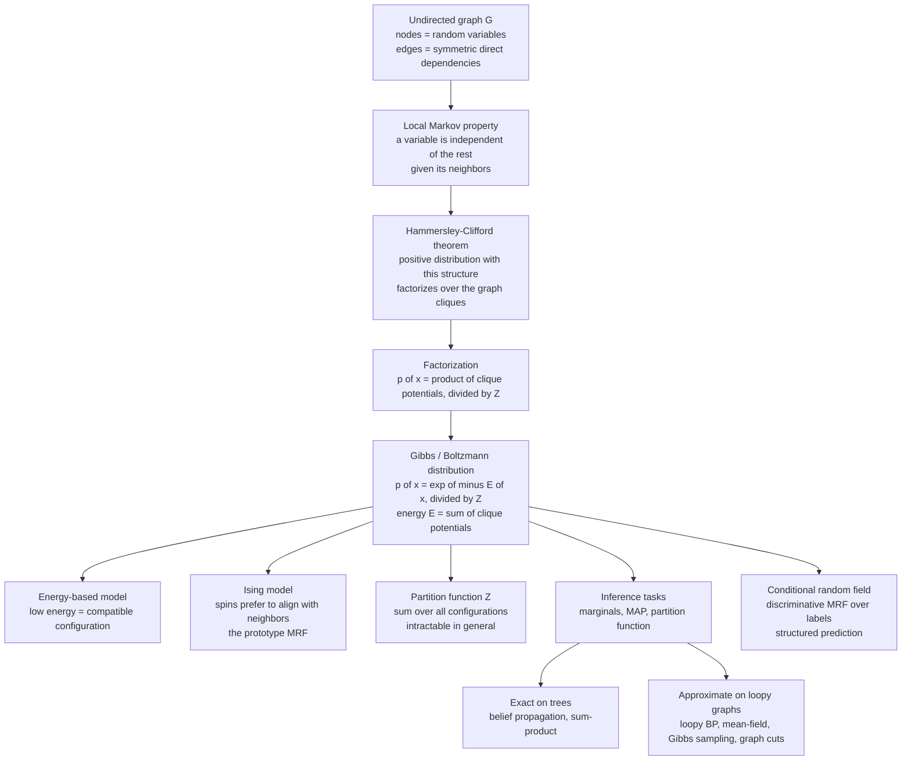

# 🕸️ Markov Random Fields and Undirected Graphical Models

> [!abstract] TL;DR
> A **Markov random field** is an undirected graph whose nodes are random variables and whose edges encode *symmetric, local* dependencies — each variable is conditionally independent of everything else given its neighbors. By the **Hammersley–Clifford theorem**, any positive distribution with this structure factorizes into a product of **clique potentials**, which is *exactly* a Gibbs/Boltzmann distribution $p(x)=e^{-E(x)}/Z$ with energy summed over cliques. That single equivalence makes probabilistic graphical models, energy-based models, and statistical mechanics *the same object* — with the **Ising model** as the prototype, image denoising and segmentation and sequence labeling (via **CRFs**) as the applications, and the intractable partition function $Z$ as the shared obstacle.

---

## Intuition

**Analogy:** Look closely at a photograph. Neighboring pixels almost always *agree* — grass stays green across a patch, sky stays blue, a face is a smooth field of skin tone. Edges, where neighbors disagree, are rare. So if someone hands you a *corrupted* photo — speckled with noise, or with holes punched in it — your instinct for repair is simple: **reward configurations where nearby pixels are consistent, unless the data strongly says otherwise.** You are not reasoning about *causes* ("this pixel caused that pixel"); you are reasoning about *mutual compatibility* — a web of local "get-along" preferences with no arrows and no direction.

A Markov random field encodes exactly this. It is, quite literally, the **Ising model of magnetism** — spins on a lattice that each want to align with their immediate neighbors — repurposed to model images, text, and any system where local structure ripples outward into global pattern. Turn "pixels prefer to match" into "spins prefer to align," turn "how strongly they prefer it" into a coupling constant, and the physics of a magnet and the mathematics of image restoration become the same equation.

---

## How It Works

### Core Mechanics

**1. The graph and the Markov property.** An MRF is an undirected graph $G=(V,E)$: nodes $V$ are random variables $x_1,\dots,x_n$, and an edge means the two variables *interact directly*. The structure's meaning is a set of conditional independencies. The **local Markov property** states that a variable is independent of all others once you know its neighbors:

$$
p(x_i \mid x_{V \setminus i}) = p(x_i \mid x_{\mathcal{N}(i)}),
$$

where $\mathcal{N}(i)$ is $i$'s neighbor set (its *Markov blanket*). This is "the future depends on the present, not the past" — the defining property of a [[Markov_Chains|Markov chain]] — generalized from a timeline to an arbitrary spatial graph. Knowing a pixel's four lattice neighbors screens off the entire rest of the image. Global structure emerges purely from these local statements.

Crucially, edges are **undirected**: the dependency is symmetric, with no cause and no direction. This is what distinguishes MRFs from *directed* [[Naive_Bayes|Bayesian networks]], where arrows encode a causal/generative ordering. MRFs are the natural language for systems of *mutual* interaction — magnets, image lattices, social ties — where "who causes whom" is meaningless.

**2. Hammersley–Clifford: the bridge to physics.** How does a *joint* distribution over all $n$ variables relate to these *local* independence statements? The **Hammersley–Clifford theorem** answers it and is the deepest result in the subject: *a strictly positive distribution satisfies the Markov property on $G$ if and only if it factorizes as a product of non-negative potential functions over the cliques of $G$.* A **clique** is a fully connected subset of nodes (a single node, an edge, a triangle, ...). Writing each potential as $\psi_C(x_C) = e^{-E_C(x_C)}$,

$$
p(x) = \frac{1}{Z}\prod_{C \in \text{cliques}} \psi_C(x_C)
     = \frac{1}{Z}\exp\!\Big(-\sum_{C} E_C(x_C)\Big)
     = \frac{e^{-E(x)}}{Z}.
$$

That right-hand side is a **Gibbs / Boltzmann distribution** with total energy $E(x)=\sum_C E_C(x_C)$. Read it slowly: *a graphical model defined by local independence is identical to an energy-based model, which is identical to a statistical-mechanical Gibbs ensemble.* Markov random fields **are** energy-based models **are** Gibbs distributions. This is the exact point where three fields fuse — the equivalence at the heart of the physics–ML correspondence surveyed in [[Statistical_Mechanics_of_Machine_Learning_Overview]] and detailed for the exponential form in [[The_Boltzmann_Distribution_in_Learning]] and its sibling *The_Boltzmann_Distribution_in_Learning*.

**3. Clique potentials, energy, and the partition function.** The parameterization lives in the energy terms. Most models use only unary and pairwise cliques:

$$
E(x) = \underbrace{\sum_{i} \phi_i(x_i)}_{\text{unary (node) terms}} \;+\; \underbrace{\sum_{(i,j)\in E} \phi_{ij}(x_i,x_j)}_{\text{pairwise (edge) terms}} .
$$

Unary terms encode a prior or a data-fit for each variable alone; pairwise terms encode *preferences between neighbors* ("these two should agree"). Low energy = compatible, probable configuration. The **partition function** $Z = \sum_x e^{-E(x)}$ normalizes — and it sums over *exponentially many* configurations ($2^n$ for binary variables), making it **intractable in general**. This recurring wall — the same $Z$ that blocks [[Partition_Functions_and_Free_Energy_in_ML|free-energy computation]] and *Energy_Based_Models* — is the central computational fact of the whole framework.

**4. The Ising model as the canonical MRF.** The simplest nontrivial MRF is the [[The_Ising_Model_and_Statistical_Physics|Ising model]]: binary spins $x_i \in \{-1,+1\}$ on a lattice with energy $E(x) = -J\sum_{(i,j)} x_i x_j - h\sum_i x_i$. The pairwise term rewards aligned neighbors (coupling $J$); the unary term is an external field $h$. Every richer model is a descendant: the **Potts model** generalizes spins to $q$ states (multi-class labeling); the **Boltzmann machine** (see *Boltzmann_Machines_and_RBMs*) is an Ising model with *learned* couplings and hidden units; image priors and CRFs are Ising/Potts models on pixel or token grids. Physics's most-studied model is machine learning's foundational graphical model.

**5. Inference: the central challenge.** Three questions dominate: compute **marginals** $p(x_i)$, compute the **partition function** $Z$, or find the **most-probable (MAP)** configuration $\arg\max_x p(x)$. Their difficulty depends on graph structure:

- **Exact on trees.** On a tree (no loops), **belief propagation** — the sum-product algorithm — passes messages along edges and returns exact marginals in linear time; its max-product variant returns the MAP. (Deepened in *Belief_Propagation_and_the_Cavity_Method*.)
- **NP-hard on loopy graphs.** With cycles (a pixel grid has millions), exact inference is intractable, so we approximate: **loopy belief propagation** (run the tree algorithm anyway), **mean-field / variational** methods (imported straight from physics — see *Mean_Field_Theory_of_Neural_Networks* and [[Free_Energy_Minimization_and_Variational_Principles]]), **MCMC** (Gibbs sampling, treated in *Gibbs_Sampling_and_Conditional_Updates* and [[The_Metropolis_Algorithm_and_MCMC]]), and **graph cuts** (exact MAP for certain submodular energies).

**6. Conditional Random Fields: the discriminative cousin.** A **CRF** (Lafferty, McCallum & Pereira, 2001) models a *conditional* distribution $p(\text{labels}\mid\text{observations})$ as an MRF over the labels, with potentials that depend arbitrarily on the observations. Because it never models $p(\text{observations})$, it can use rich, overlapping features and is the workhorse of **structured prediction**: [[Sequence_Labeling|sequence labeling]] (POS tagging, named-entity recognition), image [[Semantic_Segmentation|segmentation]] (pixel labeling with a smoothness prior), and more. Linear-chain CRFs are trees (exact inference); grid CRFs are loopy (approximate).

**7. Learning: blocked by $Z$ again.** Fitting the potentials by **maximum likelihood** requires the gradient $\nabla_\theta \log p = \mathbb{E}_{\text{data}}[\text{features}] - \mathbb{E}_{\text{model}}[\text{features}]$; the second (model) expectation needs inference/sampling and inherits $Z$'s intractability. Practical escapes — **pseudo-likelihood** (Besag: replace the joint with a product of $p(x_i\mid x_{\mathcal N(i)})$, sidestepping $Z$), **contrastive divergence**, and **structured max-margin** (structured SVM) — are exactly the toolkit shared with energy-based models.

### Flow / Architecture



---

## Key Concepts

**Secondary (intuition-level):** Neighboring pixels in a photo usually match, so to clean a noisy image you reward configurations where nearby pixels agree while staying close to what you observed. An MRF is a web of these local "get-along" preferences with no arrows — mutual compatibility, not cause and effect. It is the magnet model (spins wanting to align) applied to pictures.

**Undergraduate (mechanics-level):** An undirected graph where each node is a variable and each variable is conditionally independent of the rest given its neighbors (local Markov property). The joint factorizes as $p(x)=\tfrac1Z\prod_C \psi_C(x_C)$ over cliques, equal to $e^{-E(x)}/Z$ with $E=\sum_C E_C$ — a Gibbs distribution. Unary potentials on nodes plus pairwise potentials on edges; the Ising/Potts model as the concrete instance; $Z$ as the intractable normalizer; belief propagation exact on trees; CRFs as the conditional version for labeling tasks.

**Graduate (structure-level):** Hammersley–Clifford as an iff between the local/global/pairwise Markov properties (for positive distributions) and Gibbs factorization over maximal cliques; the MRF as a curved exponential family with clique-indicator sufficient statistics and log-partition $\log Z$ convex in the natural parameters; MAP inference as an integer program, tractable via graph cuts for submodular (regular) pairwise energies and via LP relaxations otherwise; mean-field and Bethe/Kikuchi free energies as variational approximations to $\log Z$ (loopy BP $=$ stationary points of the Bethe free energy); maximum-likelihood gradient as a difference of data and model expectations, with pseudo-likelihood a consistent, $Z$-free surrogate and contrastive divergence a truncated-MCMC estimator; the equivalence MRF $=$ EBM $=$ Gibbs measure as the formal backbone of the statistical-mechanics-of-learning correspondence.

---

## Python Demo

```python
# MRF image denoising = the Ising model applied to a picture.
#   Energy  E(x) = -beta * sum_<ij> x_i x_j   -   eta * sum_i x_i y_i
#     pairwise "neighbors should agree"  (the Ising coupling / smoothness prior)
#   + unary  "stay close to the observed noisy pixel"  (the data / fidelity term)
# We corrupt a clean binary image, then find a low-energy (clean) configuration
# with Iterated Conditional Modes (ICM): each spin flips to the sign that
# minimizes its LOCAL energy given fixed neighbors + observation.
import numpy as np
import matplotlib.pyplot as plt

rng = np.random.default_rng(0)

# ---------------------------------------------------------------
# 1. A clean binary image with values in {-1, +1} -- literally Ising spins
# ---------------------------------------------------------------
N = 100
yy, xx = np.mgrid[0:N, 0:N]
clean = -np.ones((N, N))
clean[(xx - 32)**2 + (yy - 34)**2 < 18**2] = 1.0   # a filled disk
clean[58:84, 54:88] = 1.0                          # a filled square
clean[14:23, 52:90] = 1.0                          # a thin bar

# ---------------------------------------------------------------
# 2. Corrupt it: flip each pixel independently with probability p
# ---------------------------------------------------------------
p = 0.15
noisy = clean.copy()
noisy[rng.random((N, N)) < p] *= -1

# ---------------------------------------------------------------
# 3. Ising-MRF energy and the neighbor sum (4-connected lattice)
# ---------------------------------------------------------------
def neighbor_sum(x):
    s = np.zeros_like(x)
    s[1:, :]  += x[:-1, :]   # from above
    s[:-1, :] += x[1:, :]    # from below
    s[:, 1:]  += x[:, :-1]   # from left
    s[:, :-1] += x[:, 1:]    # from right
    return s

def total_energy(x, y, beta, eta):
    pair = np.sum(x * neighbor_sum(x)) / 2.0   # each edge counted once
    data = np.sum(x * y)
    return -beta * pair - eta * data

# ---------------------------------------------------------------
# 4. ICM with checkerboard sweeps. On a 4-neighbor lattice the two
#    colors never touch, so all same-color pixels update in parallel:
#    x_i <- sign(beta * neighbor_sum + eta * y_i).
# ---------------------------------------------------------------
def denoise_icm(y, beta, eta=1.0, sweeps=12):
    x = y.copy()
    color = (xx + yy) % 2
    energies = [total_energy(x, y, beta, eta)]
    for _ in range(sweeps):
        for c in (0, 1):
            field = beta * neighbor_sum(x) + eta * y
            proposal = np.where(field >= 0, 1.0, -1.0)
            mask = (color == c)
            x[mask] = proposal[mask]
        energies.append(total_energy(x, y, beta, eta))
    return x, energies

beta = 1.0
denoised, energies = denoise_icm(noisy, beta=beta, eta=1.0, sweeps=12)
print(f"pixel error   noisy: {np.mean(noisy != clean):.3f}   "
      f"denoised (beta={beta}): {np.mean(denoised != clean):.3f}")

# ---------------------------------------------------------------
# 5. Plot clean / noisy / denoised + the energy going strictly downhill
# ---------------------------------------------------------------
fig, ax = plt.subplots(1, 4, figsize=(16, 4))
ax[0].imshow(clean, cmap="gray");    ax[0].set_title("clean")
ax[1].imshow(noisy, cmap="gray");    ax[1].set_title(f"noisy (p={p})")
ax[2].imshow(denoised, cmap="gray"); ax[2].set_title(f"ICM denoised (beta={beta})")
for a in ax[:3]:
    a.axis("off")
ax[3].plot(energies, "o-"); ax[3].set_title("total energy per sweep (decreasing)")
ax[3].set_xlabel("sweep"); ax[3].set_ylabel("E(x)")
plt.tight_layout(); plt.savefig("mrf_denoise.png", dpi=120)

# ---------------------------------------------------------------
# 6. Coupling-strength sweep: the smoothness-vs-fidelity trade-off.
#    beta = 0  -> pure data term, noise survives (over-fit to observation).
#    beta small-> most noise removed, fine structure preserved.
#    beta huge -> over-smoothing: corners rounded, thin bar eaten away.
# ---------------------------------------------------------------
betas = [0.0, 0.35, 1.0, 4.0]
fig, ax = plt.subplots(1, len(betas), figsize=(16, 4))
for a, b in zip(ax, betas):
    out, _ = denoise_icm(noisy, beta=b, eta=1.0, sweeps=12)
    a.imshow(out, cmap="gray"); a.axis("off")
    a.set_title(f"beta={b}\npixel error={np.mean(out != clean):.3f}")
plt.suptitle("Ising coupling strength: too weak leaves noise, too strong over-smooths")
plt.tight_layout(); plt.savefig("mrf_coupling_sweep.png", dpi=120)
```

**What you see.** The energy decreases monotonically each sweep as ICM descends toward a compatible configuration; the denoised image is visibly cleaner while the disk, square, and bar survive. The coupling sweep is the whole lesson in one row: at $\beta=0$ the model is the raw noisy image (no smoothing prior); at moderate $\beta$ the noise vanishes with structure intact; at large $\beta$ the Ising prior overpowers the data and *over-smooths* — corners round off and the thin bar dissolves. This is exactly the classic **smoothness-versus-fidelity trade-off**, and it is *identical* to the Ising model's competition between the coupling $J$ (order) and the field $h$ (data) — the same physics, run as image processing.

---

## Real-World Applications

- **Computer vision.** The Ising/Potts image prior powers **denoising**, **semantic segmentation** (pixel labeling with a "neighbors share a label" smoothness term), **stereo depth**, **super-resolution**, and **texture synthesis**. Geman & Geman's 1984 Gibbs-sampler restoration and later graph-cut MAP inference made MRFs the pre-deep-learning backbone of low-level vision, and CRF layers still refine the boundaries of modern segmentation networks.
- **Natural language.** **Linear-chain CRFs** were the state of the art for [[Sequence_Labeling|sequence labeling]] — part-of-speech tagging, named-entity recognition, shallow parsing — and remain the standard output layer on top of neural encoders (BiLSTM-CRF, BERT-CRF) to enforce valid label transitions.
- **Statistical physics.** MRFs *are* spin systems: the [[The_Ising_Model_and_Statistical_Physics|Ising]] and Potts models, lattice gases, and spin glasses are Markov random fields, and their [[Phase_Transitions_and_Critical_Phenomena|phase transitions]] are the physics side of the same mathematics.
- **Spatial statistics and epidemiology.** Gaussian and conditional-autoregressive (CAR/Besag) MRFs model spatially correlated data for **disease mapping**, geostatistics, and remote sensing — "nearby regions have similar rates" is a pairwise potential.
- **Error-correcting codes.** **LDPC codes** are Markov random fields on a bipartite (Tanner) graph, and belief propagation is their decoder — the direct link to [[Modern_Codes_LDPC_and_Turbo|modern coding theory]] and the [[The_Metropolis_Algorithm_and_MCMC|sampling]]/inference toolkit.
- **Social and biological networks.** Exponential random graph models (ERGMs) and Markov networks model dependency structure in social ties, gene-interaction networks, and protein contacts.

---

## Common Pitfalls

- **Confusing undirected with directed models.** MRFs encode *symmetric* compatibility, not causal generation; do not read an edge as "A causes B." Some independencies expressible in a Bayesian network (explaining-away / v-structures) have *no* MRF equivalent, and vice versa. Choose the family that matches your independence structure, not habit.
- **Forgetting the positivity condition of Hammersley–Clifford.** The factorization theorem requires a *strictly positive* distribution ($p(x)>0$ everywhere). With hard zeros (forbidden configurations), the clique factorization can fail, and the local and global Markov properties may diverge.
- **Treating $Z$ as if it were a softmax normalizer.** For a $K$-way classifier $Z$ is a trivial sum, so beginners assume MRF likelihoods are cheap. For a grid MRF, $Z$ sums over $2^n$ states and is intractable — this is why *learning* needs pseudo-likelihood or contrastive divergence and *inference* needs approximation. Never port classifier intuitions here.
- **Assuming loopy belief propagation is exact or even convergent.** BP is exact only on trees. On loopy graphs it often works well but can oscillate, converge to the wrong marginals, or fail to converge; validate it, damp the messages, or use a convergent variational bound.
- **Over-strong smoothness (the demo's large-$\beta$ failure).** Cranking the pairwise coupling to kill all noise erases genuine fine structure — thin lines, corners, small objects. Balance the prior against the data term; tune it, do not max it.
- **Mislabeling a discriminative model as generative.** A CRF models $p(y\mid x)$, not $p(x,y)$; it cannot generate or score inputs $x$. Using it where you actually need a joint/generative model (e.g. to detect out-of-distribution inputs) is a category error.

---

## Related Concepts

- [[The_Boltzmann_Distribution_in_Learning]] — the exponential $p(x)=e^{-E(x)}/Z$ that Hammersley–Clifford shows every MRF to be an instance of.
- [[Statistical_Mechanics_of_Machine_Learning_Overview]] — the map of the physics-ML correspondence that this note is a load-bearing pillar of.
- [[Partition_Functions_and_Free_Energy_in_ML]] — the intractable $Z$ that blocks MRF learning and inference alike.
- [[Free_Energy_Minimization_and_Variational_Principles]] — mean-field and Bethe free energies as the variational route to approximate MRF inference.
- [[Maximum_Entropy_and_Exponential_Families]] — MRFs as exponential families with clique-indicator sufficient statistics.
- [[The_Ising_Model_and_Statistical_Physics]] — the prototype MRF; spins aligning with neighbors is the pairwise potential in the demo.
- [[The_Metropolis_Algorithm_and_MCMC]] — Gibbs/Metropolis sampling, the general-purpose MRF inference engine.
- [[Classical_Statistical_Mechanics]] — the canonical ensemble and Gibbs measure that the MRF factorization reproduces.
- [[Phase_Transitions_and_Critical_Phenomena]] — the collective ordering of coupled spins, i.e. an MRF undergoing a phase transition.
- [[Markov_Chains]] — the temporal Markov property that MRFs generalize from a line to an arbitrary graph.
- [[Sequence_Labeling]] — the flagship CRF application (POS tagging, NER), a linear-chain MRF over labels.
- [[Semantic_Segmentation]] — pixel labeling with an MRF/CRF smoothness prior, the vision analogue of sequence labeling.
- [[Naive_Bayes]] — a *directed* generative model, the pointed contrast to undirected MRFs.
- [[Modern_Codes_LDPC_and_Turbo]] — LDPC codes as MRFs on a Tanner graph decoded by belief propagation.

---

## Review Questions

1. **(Conceptual)** State the local Markov property and explain, in your own words, how the Hammersley–Clifford theorem turns a set of *local* independence statements into a *global* factorized distribution. Why does this factorization make an MRF literally the same object as a Gibbs/Boltzmann distribution, and what role do cliques play?
2. **(Scenario)** You are denoising a binary scan with an Ising-style MRF: energy $E=-\beta\sum_{(i,j)}x_ix_j-\eta\sum_i x_i y_i$. Fine text is being erased, but flat regions still show speckle. Which parameter controls the smoothness-vs-fidelity trade-off, in which direction is it currently set wrong for each symptom, and why can no *single* global $\beta$ perfectly fix both a flat region and a fine-text region at once?
3. **(Trade-off)** Exact inference (marginals, MAP, $Z$) is linear-time on a tree but NP-hard on a loopy pixel grid. Explain precisely where the tree algorithm (belief propagation) breaks down when cycles are present, and compare two remedies — loopy BP versus mean-field variational inference — in terms of what each approximates, when each is trustworthy, and how each relates to a physical free energy.

---

## Sources

- J. Besag, "Spatial Interaction and the Statistical Analysis of Lattice Systems," *Journal of the Royal Statistical Society B* 36(2):192–236 (1974). [link](https://doi.org/10.1111/j.2517-6161.1974.tb00999.x) — Hammersley–Clifford and pseudo-likelihood.
- S. Geman & D. Geman, "Stochastic Relaxation, Gibbs Distributions, and the Bayesian Restoration of Images," *IEEE Transactions on Pattern Analysis and Machine Intelligence* 6(6):721–741 (1984). [link](https://doi.org/10.1109/TPAMI.1984.4767596) — the MRF/Gibbs image-restoration classic.
- J. Lafferty, A. McCallum, F. Pereira, "Conditional Random Fields: Probabilistic Models for Segmenting and Labeling Sequence Data," *ICML* 2001. [link](https://repository.upenn.edu/cis_papers/159/) — the CRF paper.
- D. Koller & N. Friedman, *Probabilistic Graphical Models: Principles and Techniques*, MIT Press (2009), chs. 4, 8, 20 — the definitive MRF/CRF reference.
- C. M. Bishop, *Pattern Recognition and Machine Learning*, Springer (2006), ch. 8 "Graphical Models." [link](https://www.microsoft.com/en-us/research/publication/pattern-recognition-machine-learning/)

---

#statistical-mechanics #machine-learning #markov-random-fields #graphical-models #ising-model
