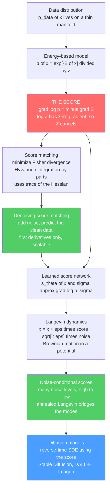

# 🎯 Score Matching and Score-Based Models

> [!abstract] TL;DR
> Energy-based models are painful to train because of one impossible number: the **partition function** $Z$, the total weight of every configuration. The escape is to stop asking "how probable is $x$?" and instead ask "**which way is more probable?**" — the **score** $\nabla_x \log p(x)$, a *vector field* pointing uphill toward denser data. For an EBM $p(x)=e^{-E(x)}/Z$ the score is $\nabla_x\log p(x) = -\nabla_x E(x)$, **completely independent of $Z$** because the constant $\log Z$ has zero gradient — the slope of a hill does not depend on its overall height. **Score matching** (Hyvärinen 2005) fits the score directly by minimizing the *Fisher divergence*, dodging both $Z$ and model sampling; **denoising score matching** (Vincent 2011) makes it scalable by turning it into "add noise, then predict the clean data." You then *generate* by **Langevin dynamics** — literally the physics of a Brownian particle rolling down a potential with thermal noise — and estimating the score at **many annealed noise levels** (Song & Ermon 2019) makes it work in high dimensions. That framework *is* the modern **diffusion model** powering Stable Diffusion, DALL·E, and Imagen: score matching is the physics-derived engine behind today's most powerful generative AI.

---

## Intuition

**Analogy — you never need the mountain's height, only its slope.** Suppose you are dropped somewhere in a foggy landscape and told to walk toward the valley where all the interesting things live. You cannot see the whole terrain, and nobody can tell you the *absolute altitude* of any point — that would require surveying the entire continent (an impossible census). But you *can* feel, right under your feet, **which way is downhill**. Follow that local slope, add a few random stumbles so you do not get trapped on a ledge, and you will drift into the valleys. Crucially, the direction of the slope is **unchanged** if someone raises or lowers the entire landscape by a fixed amount — the overall height is irrelevant to which way is down.

In generative modeling the "landscape" is the log-probability of data, and its impossible absolute height is the **partition function** $Z$ (the grand total that normalizes every energy-based model — see [[Partition_Functions_and_Free_Energy_in_ML]]). The **score** is the local slope: $\nabla_x \log p(x)$, a set of arrows across data-space each pointing toward *more-probable* configurations. Because adding the constant $\log Z$ shifts the whole landscape up or down without tilting it, **the score does not depend on $Z$ at all**. Learn just these arrows and you have sidestepped the one number that makes energy-based models intractable — and you can generate new data simply by following the arrows, jostled by noise, out of the fog and into the valleys where real data lives.

---

## How It Works

### Core Mechanics

**1. The score is the key object — and it kills $Z$.**
For any energy-based model (see the sibling *Energy_Based_Models*)

$$p(x) = \frac{e^{-E(x)}}{Z}, \qquad Z = \int e^{-E(x)}\,dx,$$

take the gradient of the log-density with respect to $x$:

$$\underbrace{s(x)}_{\text{score}} \;\equiv\; \nabla_x \log p(x) \;=\; \nabla_x\big(-E(x) - \log Z\big) \;=\; -\nabla_x E(x).$$

The term $\log Z$ is a **constant in $x$**, so its gradient is exactly zero. The score is just the negative gradient of the energy — the **force** in physics language — and it is **completely independent of the intractable partition function**. This single fact is the entire reason score-based methods exist: they work in the one representation where $Z$ has already cancelled.

**2. The problem this solves.** Maximum-likelihood training of an EBM needs $\log p_\theta(x) = -E_\theta(x) - \log Z_\theta$, whose gradient contains a "negative phase" $\mathbb{E}_{x\sim p_\theta}[\nabla_\theta E_\theta]$ — an expectation *under the model itself* that requires MCMC sampling every step (the difficulty that spawned contrastive divergence; see the sibling *Contrastive_Divergence_and_EBM_Training*). Score matching **avoids both** $Z$ and model sampling by fitting the score directly. It is a fundamentally different, $Z$-free route to density estimation.

**3. Score matching (Hyvärinen 2005) — the Fisher divergence.**
We want the model's score $s_\theta(x)$ to match the data's score. Measure the mismatch with the **Fisher divergence** (expected squared difference of scores):

$$J_{\text{ESM}}(\theta) = \tfrac{1}{2}\,\mathbb{E}_{p_{\text{data}}}\Big[\big\|\, s_\theta(x) - \nabla_x \log p_{\text{data}}(x)\,\big\|^2\Big].$$

This looks useless — we do not know $\nabla_x\log p_{\text{data}}$. Hyvärinen's trick is **integration by parts**: under mild boundary conditions the unknown data-score term integrates away, leaving an objective that depends **only on the model**:

$$J(\theta) = \mathbb{E}_{p_{\text{data}}}\Big[\; \tfrac{1}{2}\,\|s_\theta(x)\|^2 \;+\; \operatorname{tr}\!\big(\nabla_x s_\theta(x)\big)\;\Big] + \text{const}.$$

The trace of the score's Jacobian is $\sum_i \partial^2/\partial x_i^2 \log p_\theta = -\nabla_x^2 E_\theta$, i.e. the **Laplacian / trace of the Hessian**. No partition function, no sampling from the model, no data-score — just the model's own score and its derivatives, averaged over data. The catch: that trace of the Hessian costs a second derivative per dimension, which is expensive in high dimensions.

**4. Denoising score matching (Vincent 2011) — the practical breakthrough.**
Instead of Hyvärinen's costly Hessian, **perturb the data with noise** and learn the score of the *noisy* distribution. Corrupt $x$ to $\tilde{x} = x + \sigma\varepsilon$ with $\varepsilon\sim\mathcal N(0,I)$; the conditional is Gaussian, so its score is known in closed form:

$$\nabla_{\tilde x}\log q_\sigma(\tilde x\mid x) = \frac{x - \tilde x}{\sigma^2} = -\frac{\varepsilon}{\sigma}.$$

Vincent showed that matching $s_\theta(\tilde x)$ to this target is *equivalent* (in expectation) to matching the score of the perturbed marginal $q_\sigma$:

$$J_{\text{DSM}}(\theta) = \mathbb{E}_{x,\,\tilde x}\Big[\big\| s_\theta(\tilde x) - \tfrac{x-\tilde x}{\sigma^2}\big\|^2\Big].$$

The network simply learns to **point back toward the clean data** — equivalently, to **predict the noise** that was added. This is exactly a **denoising autoencoder** objective, needs only first derivatives, and scales to deep networks and megapixel images. It is the loss that made score-based deep models practical.

**5. Sampling with the score — Langevin dynamics.**
Once you have the score you can generate *without ever touching $Z$*. Iterate the **Langevin** update

$$x_{t+1} \;=\; x_t \;+\; \epsilon\,\nabla_x\log p(x_t) \;+\; \sqrt{2\epsilon}\,\eta_t, \qquad \eta_t\sim\mathcal N(0,I),$$

i.e. take a small step *up the log-density* (gradient ascent on log-probability) plus a calibrated thermal kick. This is the discretization of the overdamped **Langevin SDE** $dx = \nabla_x\log p(x)\,dt + \sqrt2\,dW$, whose stationary distribution is exactly $p$. Physically it is a Brownian particle in the potential $U(x) = -\log p(x)$ feeling force $-\nabla U = \nabla\log p$ — "roll toward high-probability regions with noise." The score field **is all you need to sample** (see [[Stochastic_Differential_Equations_and_Langevin]]).

**6. Noise-conditional score networks and annealing (Song & Ermon 2019).**
Plain Langevin fails in high dimensions: real data lies on a thin manifold, so the score is undefined off it and ill-estimated in the vast **low-density regions** between modes, and chains **mix between modes agonizingly slowly** across near-zero-density gaps. The fix is to estimate the score at **many noise levels** $\sigma_1 > \sigma_2 > \dots > \sigma_L$ with one network $s_\theta(x,\sigma)$. Large $\sigma$ **smooths** the distribution, fattens its support, and bridges the modes; small $\sigma$ **sharpens** back to the data. **Annealed Langevin sampling** runs a few Langevin steps at the largest noise, then steps down the noise ladder to the smallest — first exploring globally, then refining locally. This solves the low-density and mode-mixing problems simultaneously.

**7. The punchline — score-based models *are* diffusion models.**
Song et al. (2021) unified everything: a forward process that gradually adds noise is a stochastic differential equation, and its **reverse-time SDE** requires exactly $\nabla_x\log p_t(x)$ — the score at each noise level — which denoising score matching learns. **DDPM's noise-prediction loss is denoising score matching** (up to weighting), and diffusion sampling **is annealed Langevin / the reverse SDE** using the learned score (see [[Diffusion_Models]] and the sibling *Diffusion_Models_as_Non_Equilibrium_Thermodynamics*). A deterministic **probability-flow ODE** shares the same score and yields exact likelihoods and fast samplers (the sibling *Score_SDEs_and_Probability_Flow*). The physics-derived idea — scores, Langevin, noise annealing — is the mathematical engine of modern generative AI.

**The statistical-mechanics reading.** Every piece maps to physics: the score is the **force** $-\nabla E$; Langevin dynamics is literally **Brownian motion in a force field**; the noise schedule is a **temperature / annealing schedule**; and score-based generation is *simulating a physical stochastic process* that carries noise into structured samples. This is a crowning example of the statistical-mechanics ↔ ML correspondence.

### Flow / Architecture



---

## Key Concepts

### Secondary Level

- **The score = arrows toward more data.** At every point in space, draw an arrow pointing the way probability *increases*. That field of arrows is the score.
- **The slope ignores the overall height.** Raising or lowering the whole landscape does not change which way is downhill — so the score does not need the impossible grand total $Z$.
- **Generate by following the arrows.** Start from random noise and repeatedly step along the arrows with a little random jiggle; you flow into the regions where real data lives.
- **Learn by "corrupt then fix."** Add noise to real data and train the model to undo it (predict the clean data). Doing that *is* learning the arrows.

### Undergraduate Level

- **Score identity:** $\nabla_x\log p(x) = -\nabla_x E(x)$ for $p=e^{-E}/Z$; the $\log Z$ term drops out because it is constant in $x$.
- **Fisher divergence:** the objective $\tfrac12\mathbb{E}[\|s_\theta(x)-\nabla\log p_{\text{data}}(x)\|^2]$ that score matching minimizes — squared distance between model and data scores.
- **Denoising target:** for Gaussian noise $\tilde x = x+\sigma\varepsilon$, the ideal score is $(x-\tilde x)/\sigma^2 = -\varepsilon/\sigma$; the model predicts the noise.
- **Langevin update:** $x\leftarrow x + \epsilon\,s_\theta(x) + \sqrt{2\epsilon}\,\eta$ — gradient ascent on log-density plus thermal noise; converges to samples from $p$ using only the score.
- **Annealing:** estimate the score at several noise levels and sample from high noise (smooth, connected) down to low noise (sharp) to fix mode-mixing and low-density regions.

### Graduate Level

- **Hyvärinen's explicit objective:** $J(\theta)=\mathbb{E}_{p_{\text{data}}}[\tfrac12\|s_\theta\|^2 + \operatorname{tr}(\nabla_x s_\theta)]+\text{const}$, obtained by integration by parts assuming $p_{\text{data}}(x)s_\theta(x)\to 0$ at infinity; the trace term is the Laplacian of $\log p_\theta$.
- **DSM equivalence & Tweedie's formula:** denoising score matching minimizes the same objective as explicit score matching on the perturbed marginal; the optimal denoiser satisfies $\mathbb{E}[x_0\mid \tilde x] = \tilde x + \sigma^2\nabla\log p_\sigma(\tilde x)$, so *the best denoiser reveals the score*.
- **Reverse-time SDE (Anderson 1982):** a forward SDE $dx=f\,dt+g\,dW$ has reverse dynamics $dx=[f-g^2\nabla_x\log p_t(x)]\,dt + g\,d\bar W$; simulating it backward with the learned score generates data. VE and VP SDEs recover NCSN and DDPM respectively.
- **Probability-flow ODE:** the deterministic $\dot x = f - \tfrac12 g^2\nabla_x\log p_t(x)$ shares all marginals with the SDE, giving invertible flows, exact log-likelihoods, and fast deterministic sampling.
- **Why noise helps (manifold hypothesis):** on a low-dimensional data manifold the density (and hence score) is ill-defined off-manifold; Gaussian perturbation fattens support so the score is defined and estimable everywhere, and the noise schedule is a continuous bridge from a tractable prior to the data.
- **Weighting:** the multi-scale DSM loss $\sum_i \lambda(\sigma_i)\,\mathbb{E}\|\sigma_i s_\theta(\tilde x,\sigma_i)+\varepsilon\|^2$ with $\lambda(\sigma)=\sigma^2$ balances scales; the same weighting connects to the ELBO of the diffusion generative model.

---

## Python Demo

```python
# Score-based modeling on a 2D mixture of Gaussians:
#   (a) compute/plot the SCORE FIELD grad log p(x) and show it is INDEPENDENT of Z
#   (b) LANGEVIN SAMPLING: follow the score with noise; samples flow into the modes
#   (c) ANNEALED (multi-noise) Langevin fixes mode-mixing that plain Langevin misses
import numpy as np
import matplotlib.pyplot as plt

rng = np.random.default_rng(0)

# ---------- target: a 3-component Gaussian mixture (well-separated modes) ----------
means   = np.array([[-2.5,  2.5],
                    [ 2.5,  2.5],
                    [ 0.0, -2.5]])
weights = np.array([0.40, 0.35, 0.25])
var0    = 0.30                                   # base component variance sigma0^2

def gmm_unnorm(x, w, var):
    # UNNORMALIZED component weights: we deliberately DROP the 1/(2*pi*var) factor.
    d2 = ((x[:, None, :] - means[None, :, :]) ** 2).sum(-1)      # (N, K) squared dists
    return w[None, :] * np.exp(-0.5 * d2 / var)                  # (N, K), unnormalized

def gmm_score(x, w, var):
    # score = grad_x log p(x) for an isotropic GMM with common variance `var`:
    #   = sum_k r_k(x) * ( -(x - mu_k)/var ),  r_k = softmax responsibilities.
    # The responsibilities r_k = unnorm_k / sum_j unnorm_j -> every normalizer CANCELS.
    u = gmm_unnorm(x, w, var)                                    # (N, K)
    r = u / u.sum(1, keepdims=True)                              # (N, K), Z cancels here
    grad_k = -(x[:, None, :] - means[None, :, :]) / var          # (N, K, 2)
    return (r[:, :, None] * grad_k).sum(1)                       # (N, 2)

# ---------- (a) demonstrate Z-INDEPENDENCE of the score ----------
Xtest = rng.normal(size=(6, 2)) * 2.0
s_norm   = gmm_score(Xtest, weights,            var0)            # "properly weighted"
s_rescale = gmm_score(Xtest, weights * 1.0e6,   var0)           # weights x 1e6 (arbitrary Z)
print("max |score difference| after rescaling the normalizer by 1e6: "
      f"{np.abs(s_norm - s_rescale).max():.2e}  (should be ~0)")

# ---------- Langevin samplers ----------
def langevin(x, w, var, eps, n_steps):
    for _ in range(n_steps):
        x = x + eps * gmm_score(x, w, var) + np.sqrt(2 * eps) * rng.normal(size=x.shape)
    return x

sigmas = np.array([2.5, 1.5, 0.9, 0.5, 0.25, 0.0])              # anneal high -> low noise
def annealed_langevin(x, w, eps, n_per_level):
    for sig in sigmas:
        var_eff = var0 + sig ** 2                                # noise-perturbed variance
        for _ in range(n_per_level):
            x = x + eps * gmm_score(x, w, var_eff) + np.sqrt(2 * eps) * rng.normal(size=x.shape)
    return x

# Both start from a TIGHT cluster inside ONE mode's basin (top-left):
N = 1200
x0 = means[0] + 0.30 * rng.normal(size=(N, 2))

x_plain    = langevin(x0.copy(), weights, var0, eps=0.010, n_steps=1500)
x_annealed = annealed_langevin(x0.copy(), weights, eps=0.010, n_per_level=250)

def mode_counts(pts):
    d = ((pts[:, None, :] - means[None, :, :]) ** 2).sum(-1)     # nearest-mode assignment
    lab = d.argmin(1)
    return [int((lab == k).sum()) for k in range(len(means))]

print("target mixing proportions      :", (weights * N).round().astype(int).tolist())
print("plain Langevin  -> mode counts :", mode_counts(x_plain),   "(stuck near start mode)")
print("annealed Langevin -> mode counts:", mode_counts(x_annealed), "(covers all modes)")

# ---------- density + score field on a grid (for plotting) ----------
gx = np.linspace(-5, 5, 240)
G1, G2 = np.meshgrid(gx, gx)
grid = np.stack([G1.ravel(), G2.ravel()], 1)
dens = gmm_unnorm(grid, weights, var0).sum(1).reshape(G1.shape)  # unnormalized is fine here

qx = np.linspace(-5, 5, 21)
Q1, Q2 = np.meshgrid(qx, qx)
qgrid = np.stack([Q1.ravel(), Q2.ravel()], 1)
S = gmm_score(qgrid, weights, var0)
Sn = S / (np.linalg.norm(S, axis=1, keepdims=True) + 1e-8)       # unit arrows for display

# ---------- plots ----------
fig, ax = plt.subplots(1, 3, figsize=(16, 5.2))

ax[0].contourf(G1, G2, dens, levels=25, cmap="Blues")
ax[0].quiver(Q1, Q2, Sn[:, 0].reshape(Q1.shape), Sn[:, 1].reshape(Q1.shape),
             color="crimson", pivot="mid", scale=32, width=0.004)
ax[0].set_title("(a) Score field grad log p(x)\narrows point uphill; independent of Z")

ax[1].contourf(G1, G2, dens, levels=25, cmap="Blues")
ax[1].scatter(x_plain[:, 0], x_plain[:, 1], s=6, c="darkorange", alpha=0.5)
ax[1].set_title("(b) Plain Langevin from one mode\nstuck: cannot cross low-density gaps")

ax[2].contourf(G1, G2, dens, levels=25, cmap="Blues")
ax[2].scatter(x_annealed[:, 0], x_annealed[:, 1], s=6, c="green", alpha=0.5)
ax[2].set_title("(c) Annealed Langevin (multi-noise)\nbridges modes -> recovers target")

for a in ax:
    a.set_xlim(-5, 5); a.set_ylim(-5, 5); a.set_aspect("equal")
    a.scatter(means[:, 0], means[:, 1], marker="x", c="k", s=80, zorder=5)

plt.tight_layout()
plt.savefig("score_based_models.png", dpi=110)
print("saved score_based_models.png")
```

**What it shows.** Part (a) computes the score of a Gaussian mixture analytically and plots it as a red vector field over the density — every arrow points toward a mode. The printed check confirms the score is **byte-for-byte unchanged when the normalizer is rescaled by a million**: the responsibilities are a ratio in which any constant $Z$ cancels, exactly the $Z$-independence that makes the whole method possible. Part (b) runs **plain Langevin** starting inside one mode; because the three modes are separated by near-zero-density gaps, the chain cannot cross them and the samples stay stuck — the mode-mixing failure. Part (c) runs **annealed Langevin**: at high noise the modes merge into one broad blob so points redistribute globally, and as the noise anneals down they sharpen into all three modes, recovering the target's $40/35/25$ proportions — the innovation that made score-based models work in high dimensions, and precisely the mechanism inside diffusion sampling.

---

## Real-World Applications

- **Image generation — the dominant paradigm.** **Stable Diffusion**, **DALL·E 2**, and **Imagen** are score-based/diffusion models: a U-Net learns the noise-conditional score via denoising score matching, and sampling is annealed Langevin / a reverse SDE (see [[Stable_Diffusion]] and [[Diffusion_Models]]).
- **Audio and video.** WaveGrad and DiffWave synthesize speech and audio by learning scores of waveforms/spectrograms; modern video generators extend the same score-SDE framework to spatiotemporal data.
- **Molecular and protein design.** Diffusion/score models generate 3D molecular conformations and protein backbones (e.g. RFdiffusion), sampling from a learned score over structure space.
- **Inverse problems.** A learned score is a powerful prior for **super-resolution, inpainting, deblurring, and medical-imaging reconstruction** (MRI/CT): condition the reverse process on measurements to sample plausible reconstructions — no retraining per task.
- **Likelihood evaluation & density estimation.** The probability-flow ODE turns a score model into a continuous normalizing flow with exact likelihoods, useful for anomaly detection and model comparison — where the intractable $Z$ once blocked EBMs (see [[Partition_Functions_and_Free_Energy_in_ML]]).

---

## Common Pitfalls

- **Forgetting that Langevin needs a *good* score everywhere it walks.** The chain traverses low-density regions between modes, but that is exactly where a single-noise score is worst estimated. Symptom: samples collapse to one mode or wander into garbage. Fix: **multiple noise levels** (NCSN) so the score is defined and accurate off the data manifold.
- **Confusing "the loss avoids $Z$" with "sampling avoids compute."** Score matching removes $Z$ from *training*, but generation still needs many Langevin/reverse-SDE steps. Under-stepping the anneal (too few steps per noise level, too coarse a ladder) gives blurry or biased samples.
- **Mis-scaling the Langevin step vs. the noise level.** The thermal term must be $\sqrt{2\epsilon}$ (or $\sqrt{\epsilon}$ under the half-step convention) matched to the score step $\epsilon$; a mismatch changes the stationary distribution. At each noise level the step should scale with $\sigma^2$ or the chain either freezes or explodes.
- **Boundary conditions in Hyvärinen's derivation.** The integration-by-parts identity assumes $p_{\text{data}}(x)s_\theta(x)\to 0$ at infinity and a differentiable density; heavy tails or bounded supports (e.g. pixels in $[0,1]$) violate it — dequantize or work in a transformed space.
- **Wrong loss weighting across scales.** Naively averaging DSM losses lets small-noise levels (huge target magnitude $1/\sigma^2$) dominate. Use the $\lambda(\sigma)=\sigma^2$ weighting so every scale contributes comparably.
- **Treating the score as the density.** $\nabla\log p$ determines $p$ only up to the normalizer; you cannot read off a probability value from the score alone. For likelihoods you must integrate (probability-flow ODE), not just evaluate the score.

---

## Related Concepts

- [[Energy_Based_Models]] — the $p=e^{-E}/Z$ framework whose score $-\nabla E$ is what these methods learn; score matching is one of its core training routes.
- [[Partition_Functions_and_Free_Energy_in_ML]] — the intractable $Z$ that the score sidesteps; explains *why* avoiding it matters.
- [[Diffusion_Models]] — score-based models and diffusion models are the same thing; DSM is the diffusion training loss and annealed Langevin is diffusion sampling.
- [[Stable_Diffusion]] — a production score-based/diffusion system for text-to-image generation.
- [[DDPM_Paper]] — the denoising-diffusion paper whose noise-prediction objective *is* denoising score matching.
- [[Stochastic_Differential_Equations_and_Langevin]] — the Langevin SDE and its discretization that turn a score into a sampler.
- [[Fisher_Information_and_the_Cramer_Rao_Bound]] — the Fisher information / Fisher divergence that score matching minimizes.
- [[Variational_Autoencoders]] — an alternative likelihood-based generative model; contrast the ELBO route with the score route.
- [[GAN]] — the adversarial generative approach score-based models largely displaced (no adversarial training, better mode coverage).
- [[Autoencoders]] — denoising score matching is literally a denoising-autoencoder objective in disguise.
- [[Contrastive_Learning]] — a related $Z$-free strategy (noise-contrastive / ratio estimation) for learning from unnormalized models.
- [[Stochastic_Calculus]] — the Itô/reverse-time SDE machinery underlying the score-SDE framework.
- [[Thermodynamic_Potentials]] — the physics of $U=-\log p$ as a potential and the force $-\nabla U$ that the score represents.
- [[Machine_Learning_in_Computational_Physics]] — score/Langevin methods as simulated physical stochastic processes.

---

## Review Questions

**Secondary.** Explain, using the "hill and its slope" picture, why you do *not* need to know the total height of the probability landscape (the partition function $Z$) in order to know which direction points toward more-probable data. How would you use those slope-arrows to create a brand-new data sample?

**Undergraduate.** (a) Starting from $p(x)=e^{-E(x)}/Z$, show that $\nabla_x\log p(x) = -\nabla_x E(x)$ and state precisely why $Z$ disappears. (b) Write the Langevin update that generates samples from the score, identify the "gradient ascent" term and the "thermal noise" term, and explain what would go wrong if you dropped the noise entirely. (c) In denoising score matching, what target does the network learn to predict for a Gaussian perturbation $\tilde x = x+\sigma\varepsilon$, and why is that equivalent to denoising?

**Graduate.** (a) Derive Hyvärinen's tractable objective $\mathbb{E}[\tfrac12\|s_\theta\|^2 + \operatorname{tr}(\nabla_x s_\theta)]$ from the Fisher divergence via integration by parts, and state the boundary condition it requires. (b) Explain the two distinct problems that noise-conditional score networks solve (the manifold/low-density issue and the mode-mixing issue) and how the annealing schedule addresses each. (c) Given a forward SDE $dx=f\,dt+g\,dW$, write the reverse-time SDE and the probability-flow ODE, and explain why both need only the score $\nabla_x\log p_t(x)$ — and therefore why "score-based" and "diffusion" are two names for one framework.

---

## Sources

- Hyvärinen, A. (2005). "Estimation of Non-Normalized Statistical Models by Score Matching." *Journal of Machine Learning Research*, 6, 695–709. [jmlr.org](https://www.jmlr.org/papers/v6/hyvarinen05a.html)
- Vincent, P. (2011). "A Connection Between Score Matching and Denoising Autoencoders." *Neural Computation*, 23(7), 1661–1674. [direct.mit.edu](https://direct.mit.edu/neco/article/23/7/1661/7677)
- Song, Y., & Ermon, S. (2019). "Generative Modeling by Estimating Gradients of the Data Distribution." *NeurIPS 2019*. [arxiv.org/abs/1907.05600](https://arxiv.org/abs/1907.05600)
- Song, Y., Sohl-Dickstein, J., Kingma, D. P., Kumar, A., Ermon, S., & Poole, B. (2021). "Score-Based Generative Modeling through Stochastic Differential Equations." *ICLR 2021*. [arxiv.org/abs/2011.13456](https://arxiv.org/abs/2011.13456)
- Ho, J., Jain, A., & Abbeel, P. (2020). "Denoising Diffusion Probabilistic Models." *NeurIPS 2020*. [arxiv.org/abs/2006.11239](https://arxiv.org/abs/2006.11239)

---

#statistical-mechanics #machine-learning #score-matching #score-based-models #diffusion
