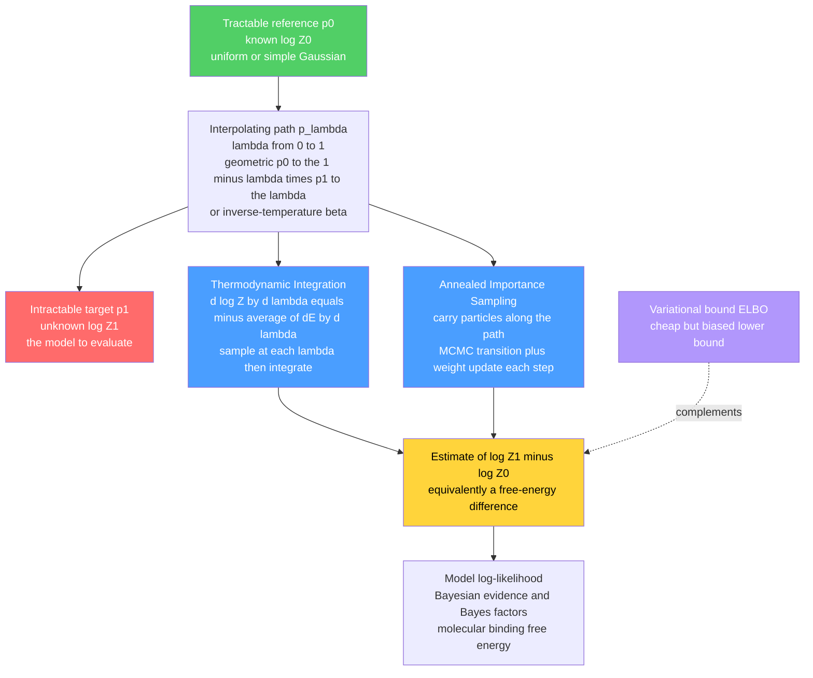

# 🏔️ Free Energy Estimation and Thermodynamic Integration

> [!abstract] TL;DR
> The **partition function** $Z$ — the total Boltzmann weight of a whole probability distribution, and equivalently the **free energy** $F = -T\log Z$ — is the number you need to *evaluate* a probabilistic model: the test log-likelihood of an energy-based model, VAE, or normalizing flow; the **evidence** in Bayesian model selection; the **Bayes factor** between two models; the binding free energy of a drug. But $Z$ is a sum over exponentially many states, and the naive fix — **importance sampling** from a tractable reference — has *astronomical variance* when reference and target barely overlap. The physics-derived cure is to never jump the gap: build a **path** of intermediate distributions from a tractable reference ($\lambda=0$, known $Z_0$) to the target ($\lambda=1$), and cross it in tiny steps. **Thermodynamic integration** integrates the average energy $\langle \partial E/\partial\lambda\rangle_\lambda$ along the path; **annealed importance sampling (AIS, Neal 2001)** carries particles across it, accumulating importance weights whose mean is an *unbiased* estimate of $Z_1/Z_0$. Both turn one impossible sum into many tractable steps, giving asymptotically **unbiased** $\log Z$ estimates that complement the cheap-but-biased **variational (ELBO) bound**.

---

## Intuition

**Analogy — weighing a mountain by measuring its slopes.** You cannot put a mountain on a scale to find its height. But you *can* walk a trail from sea level to the summit, and at every point measure how steep the ground is under your feet. Add up all those little rises — slope times step, step after step — and you have climbed the exact height of the peak without ever weighing it. The trick is that a *global* quantity you cannot measure directly (total height) becomes a *sum of local* quantities you can (slopes along a path).

The **partition function** $Z$ — the "total weight" of an entire probability distribution — is exactly such a mountain: no one can weigh it directly, because that would mean adding up $e^{-E(x)}$ over more configurations than there are atoms in the universe. Physicists learned to estimate it anyway by slowly **morphing** an easy, fully-known distribution into the hard target distribution one tiny step at a time, measuring the "work" done at each step and summing it up. These two tricks — **thermodynamic integration** (integrate the slopes) and **annealed importance sampling** (carry weighted walkers along the trail) — are what finally let machine learners put an honest *number* on the likelihood of models that were supposed to be impossible to evaluate. The companion note [[Partition_Functions_and_Free_Energy_in_ML]] explains *why* $Z$ is the shared villain of physics and ML; this note is about how to *estimate* it.

---

## How It Works

### Core Mechanics

**The problem.** For an energy-based model $p_1(x) = e^{-E_1(x)}/Z_1$ you can compute the unnormalized weight $e^{-E_1(x)}$ trivially, but the *normalizer*

$$Z_1 = \sum_x e^{-E_1(x)} \quad\text{(or}\ \int e^{-E_1(x)}\,dx\text{)}$$

is a sum over the whole state space. Without it you cannot report a log-likelihood ($\log p_1(x) = -E_1(x) - \log Z_1$), cannot compute a Bayesian **evidence** (the marginal likelihood *is* a partition function), and cannot form a **Bayes factor** (a ratio of two $Z$'s, i.e. a free-energy difference). Estimating $\log Z$ is a central computational task where physics methods serve ML.

**Why the naive estimate fails.** Write $Z_1 = Z_0\,\mathbb{E}_{x\sim p_0}\!\big[e^{-E_1(x)}/e^{-E_0(x)}\big]$ for a tractable reference $p_0$ with known $Z_0$. This is exact, but the importance weights $w = e^{-(E_1-E_0)}$ are dominated by a handful of *rare* samples whenever $p_0$ and $p_1$ are far apart. In high dimensions the ratio of the two normalizers can differ by $e^{\text{thousands}}$, so a single lucky sample carries essentially all the weight, the **effective sample size** collapses to $\approx 1$, and the estimate is worthless — you cannot just Monte-Carlo the sum. You need a smarter, incremental approach.

**The shared idea — a path.** Instead of jumping from $p_0$ to $p_1$ in one hop, construct a **sequence of intermediate distributions** $p_\lambda$ that interpolate smoothly from the tractable reference ($\lambda=0$) to the target ($\lambda=1$). The workhorse is the **geometric** (tempered) path

$$p_\lambda(x) \;\propto\; p_0(x)^{1-\lambda}\,p_1(x)^{\lambda} \;=\; e^{-\left[(1-\lambda)E_0(x) + \lambda E_1(x)\right]},\qquad \lambda: 0 \to 1,$$

equivalently an inverse-temperature $\beta$ swept from $0$ (flat/reference) to $1$ (target). Adjacent distributions $p_{\lambda}$ and $p_{\lambda + d\lambda}$ **overlap well**, so each small step is an easy problem. Break the hard problem into many easy steps between nearby distributions — that is the core strategy behind every estimator below.

**Thermodynamic integration (TI) — integrate the slopes.** Differentiate $\log Z_\lambda$ along the path. The derivative is an *expectation* under $p_\lambda$:

$$\frac{d \log Z_\lambda}{d\lambda} \;=\; -\Big\langle \frac{\partial E_\lambda}{\partial\lambda}\Big\rangle_{p_\lambda} \;=\; -\big\langle E_1(x)-E_0(x)\big\rangle_{p_\lambda}\quad\text{(geometric path).}$$

So the total change in log-partition-function is the integral of an average energy along the path:

$$\log\frac{Z_1}{Z_0} \;=\; -\int_0^1 \Big\langle \frac{\partial E_\lambda}{\partial\lambda}\Big\rangle_{p_\lambda}\, d\lambda.$$

Estimate the expectation at each $\lambda$ by **MCMC sampling** from $p_\lambda$, then **integrate** the resulting curve over $\lambda$ from 0 to 1 (trapezoid / quadrature). This is precisely "integrating the average energy along the path" — the same math statistical physics uses for free-energy *differences*, redeployed for ML model evaluation.

**Annealed importance sampling (AIS) — carry weighted walkers.** Neal's 2001 method runs many independent particles from the reference through the intermediate distributions. For each particle, alternate two operations at every step $j=1,\dots,K$:

1. **Weight update:** multiply the importance weight by the ratio of adjacent unnormalized densities at the current state, $w \mathrel{*}= f_j(x)/f_{j-1}(x)$; in log space $\log w \mathrel{+}= -(\lambda_j-\lambda_{j-1})\,(E_1(x)-E_0(x))$.
2. **MCMC transition:** move $x$ with a Markov kernel $T_j$ that leaves $p_{\lambda_j}$ invariant (a few Metropolis or Gibbs steps).

The average final weight is an **unbiased** estimator of the ratio of normalizers:

$$\mathbb{E}[w] = \frac{Z_1}{Z_0} \quad\Longrightarrow\quad \log\frac{Z_1}{Z_0} \approx \operatorname{logmeanexp}(\log w^{(1)},\dots,\log w^{(M)}).$$

AIS **combines annealing** (bridging the gap through a chain of temperatures) with **importance sampling** (correcting for the mismatch), and is the standard method for estimating deep-generative-model log-likelihoods. General MCMC transition design is covered in [[The_Metropolis_Algorithm_and_MCMC]]; annealing schedules in learning are discussed in [[Temperature_and_Annealing_in_Learning]] and the sibling *Simulated_Annealing_and_Global_Optimization*.

**Bridge and path sampling — the estimator family.** **Bridge sampling** inserts a single well-chosen "bridge" distribution between two targets and uses samples from *both*, achieving lower variance than one-sided importance sampling when overlap is moderate. **Path sampling** (Gelman & Meng, 1998) is the continuous generalization of TI: the identity $\log(Z_1/Z_0)=\int \langle \partial_\lambda \log f_\lambda\rangle_\lambda\,d\lambda$ *is* path sampling, unifying TI, bridge, and importance sampling. Non-equilibrium **Jarzynski** work relations ($e^{-\Delta F} = \langle e^{-W}\rangle$) connect free-energy differences to the distribution of *work* done in a finite-time morph — AIS is exactly a discretized Jarzynski process, tying the whole family to **fluctuation theorems** (see the sibling *Fluctuation_Theorems_and_the_Jarzynski_Equality*).

**The variance / accuracy trade-off — the practical crux.** Accuracy depends on (i) using **enough intermediate distributions** (fine $\lambda$ spacing so adjacent overlap is high) and (ii) **good MCMC mixing** at each step. Too few steps or poor mixing gives high variance and bias; more steps cost more compute. Overlap between adjacent distributions is the currency, and diagnosing it (effective sample size, forward-vs-reverse gap) is central in high dimensions.

**The variational alternative and complement.** **Variational** methods (mean-field, the ELBO) give a **bound** on $\log Z$ — the ELBO *lower-bounds* the log-likelihood — cheaply, but with an unknown bias equal to a KL gap (see [[Free_Energy_Minimization_and_Variational_Principles]] and the sibling *Variational_Inference_as_Free_Energy_Minimization*). AIS/TI give **asymptotically unbiased estimates** — expensive but accurate. In practice they are used **together**: AIS evaluates trained VAEs, and a variational posterior is often the ideal AIS proposal or reference.

### Flow / Architecture



---

## Key Concepts

### Secondary Level

- **Partition function $Z$** — the grand total "weight" of an entire distribution; you cannot add it up directly because there are too many configurations.
- **Free energy $F = -T\log Z$** — one number summarizing the whole system; a *difference* in free energy is what most estimators actually compute.
- **The mountain trick** — instead of weighing the whole thing at once, walk a path from an easy known distribution to the hard one and add up the small steps.
- **Why the obvious way fails** — sampling the easy distribution and reweighting toward the hard one is ruined by a few freak samples that dominate everything.

### Undergraduate Level

- **Importance sampling for $Z$** — $Z_1 = Z_0\,\mathbb{E}_{p_0}[e^{-(E_1-E_0)}]$; unbiased but with variance that explodes as overlap between $p_0$ and $p_1$ shrinks.
- **Geometric / tempered path** — $p_\lambda \propto p_0^{1-\lambda}p_1^{\lambda}$, or equivalently a temperature swept from hot (flat) to cold (target).
- **Thermodynamic integration** — $\log(Z_1/Z_0) = -\int_0^1 \langle E_1-E_0\rangle_{p_\lambda}\,d\lambda$; sample the average energy at each $\lambda$, then integrate.
- **Annealed importance sampling** — run particles through the path, alternating an MCMC transition and a log-weight increment; $\operatorname{logmeanexp}$ of the final weights estimates $\log(Z_1/Z_0)$.
- **Effective sample size** — a diagnostic; when a single weight dominates, ESS $\approx 1$ and the estimate is unreliable.

### Graduate Level

- **Path sampling identity** (Gelman & Meng) — $\log(Z_1/Z_0)=\int_0^1 \mathbb{E}_{p_\lambda}[\partial_\lambda \log f_\lambda]\,d\lambda$, the continuous parent of TI, bridge, and importance sampling.
- **AIS unbiasedness** — with any $p_\lambda$-invariant kernels $T_j$, the extended-space importance weight satisfies $\mathbb{E}[w]=Z_1/Z_0$ *exactly*; but $\mathbb{E}[\log w]\le \log(Z_1/Z_0)$ by Jensen, so the *log* estimate is a stochastic **lower bound** (run in reverse it upper-bounds — **BDMC** brackets the truth).
- **Jarzynski equality** — $e^{-\Delta F}=\langle e^{-W}\rangle$ over non-equilibrium work $W$; AIS is a discretized Jarzynski protocol, linking free-energy estimation to fluctuation theorems.
- **Variance and schedule** — for a path of $K$ steps the log-weight variance scales like $\sum_j \mathrm{KL}(p_{\lambda_{j-1}}\Vert p_{\lambda_j})$; optimal schedules space $\lambda$ to equalize adjacent KL (symmetrized-divergence / thermodynamic-length geodesics).
- **RAISE and reverse AIS** — reverse chains give upper bounds on $\log Z$; combined with forward AIS they sandwich the true log-likelihood for rigorous VAE/EBM evaluation (Wu et al., 2017).
- **Nested sampling** — an alternative evidence estimator that integrates over the *prior mass* enclosed by likelihood contours rather than a temperature path (Skilling, 2006).

---

## Python Demo

```python
# Estimating a partition function / free-energy difference two ways, for a system
# whose log Z is known EXACTLY (reference N(0, I)  ->  target N(mu, diag(sigma^2))).
#
#   (a) THERMODYNAMIC INTEGRATION: sweep lambda 0 -> 1 along the geometric path,
#       estimate <dE/dlambda> = <E1 - E0> by SAMPLING p_lambda at each lambda,
#       then INTEGRATE  d logZ/dlambda = -<E1 - E0>  to recover  log Z1 - log Z0.
#   (b) ANNEALED IMPORTANCE SAMPLING: run particles through the SAME path,
#       accumulate log importance weights, take logmeanexp -> log(Z1/Z0);
#       show the error SHRINKS as the number of intermediate distributions grows.
import numpy as np
import matplotlib.pyplot as plt

rng = np.random.default_rng(0)

# ---- problem definition: reference N(0, I)  ->  target N(mu, diag(sigma^2)) ----
d     = 5
mu    = np.array([1.0, -1.0, 0.5, 2.0, -0.5])
sigma = np.array([1.5,  0.5, 2.0, 0.8,  1.2])
Lam   = 1.0 / sigma**2                        # target precision (diagonal)

# exact normalizers (both Gaussian, so closed form is available for validation):
logZ0 = 0.5 * d * np.log(2 * np.pi)                          # reference N(0, I)
logZ1 = 0.5 * d * np.log(2 * np.pi) + np.sum(np.log(sigma))  # target
dlogZ_exact = logZ1 - logZ0                                  # == sum(log sigma)

def E0(x):  return 0.5 * np.sum(x**2, axis=-1)               # reference energy
def E1(x):  return 0.5 * np.sum(Lam * (x - mu)**2, axis=-1)  # target energy
def E_lam(x, lam):  return (1 - lam) * E0(x) + lam * E1(x)   # geometric-path energy

def path_gaussian(lam):
    """p_lambda is Gaussian per dimension: return (mean, variance) arrays."""
    a = (1 - lam) + lam * Lam            # precision per dimension
    m = (lam * Lam * mu) / a             # mean per dimension
    return m, 1.0 / a

# ============================ (a) THERMODYNAMIC INTEGRATION =====================
lam_grid  = np.linspace(0.0, 1.0, 41)
n_ti      = 4000
integrand = np.zeros_like(lam_grid)      # sampled <E1 - E0> under p_lambda
for k, lam in enumerate(lam_grid):
    m, var = path_gaussian(lam)
    x = m + np.sqrt(var) * rng.standard_normal((n_ti, d))    # exact draw from p_lambda
    integrand[k] = np.mean(E1(x) - E0(x))
dlogZ_ti = -np.trapz(integrand, lam_grid)                    # integrate the slopes

# analytic integrand overlay: <E1 - E0> under the Gaussian p_lambda
a_g   = (1 - lam_grid)[:, None] + lam_grid[:, None] * Lam[None, :]
m_g   = (lam_grid[:, None] * Lam[None, :] * mu[None, :]) / a_g
E0_an = 0.5 * np.sum(1.0 / a_g + m_g**2, axis=1)
E1_an = 0.5 * np.sum(Lam[None, :] * (1.0 / a_g + (m_g - mu[None, :])**2), axis=1)
integrand_exact = E1_an - E0_an

# running TI estimate: cumulative trapezoid of -(integrand)
seg = 0.5 * (integrand[1:] + integrand[:-1]) * np.diff(lam_grid)
running_dlogZ = -np.concatenate([[0.0], np.cumsum(seg)])

# =========================== (b) ANNEALED IMPORTANCE SAMPLING ===================
def ais_dlogZ(K, n_particles=200, n_mcmc=5, step=0.6):
    """Estimate log(Z1/Z0) with K intermediate distributions via AIS."""
    lams = np.linspace(0.0, 1.0, K)
    x    = rng.standard_normal((n_particles, d))   # exact draw from reference p_0
    logw = np.zeros(n_particles)
    for j in range(1, K):
        # weight update at the CURRENT state (distributed ~ p_{lams[j-1]})
        logw += -(lams[j] - lams[j - 1]) * (E1(x) - E0(x))
        # MCMC transition leaving p_{lams[j]} invariant: random-walk Metropolis
        for _ in range(n_mcmc):
            xp  = x + step * rng.standard_normal((n_particles, d))
            dE  = E_lam(xp, lams[j]) - E_lam(x, lams[j])
            acc = np.log(rng.random(n_particles)) < -dE    # overflow-safe accept
            x[acc] = xp[acc]
    m = logw.max()
    return m + np.log(np.mean(np.exp(logw - m)))            # logmeanexp -> log(Z1/Z0)

Ks       = np.array([2, 4, 8, 16, 32, 64, 128, 256])
reps     = 8
ais_mean = np.array([[ais_dlogZ(K) for _ in range(reps)] for K in Ks])
ais_avg  = ais_mean.mean(axis=1)
ais_err  = np.mean(np.abs(ais_mean - dlogZ_exact), axis=1)

print(f"exact  d logZ = {dlogZ_exact:.4f}")
print(f"TI     d logZ = {dlogZ_ti:.4f}   (abs err {abs(dlogZ_ti - dlogZ_exact):.4f})")
print(f"AIS    d logZ = {ais_avg[-1]:.4f}  at K={Ks[-1]} (abs err {ais_err[-1]:.4f})")

# ================================== plots ======================================
fig, ax = plt.subplots(2, 2, figsize=(12, 9))

ax[0, 0].plot(lam_grid, integrand_exact, "k-", lw=2, label="exact analytic")
ax[0, 0].plot(lam_grid, integrand, "o", ms=4, color="orange", label="sampled")
ax[0, 0].set(xlabel="path parameter lambda", ylabel="<E1 - E0> under p_lambda",
             title="(a) TI integrand along the path")
ax[0, 0].legend(); ax[0, 0].grid(alpha=0.3)

ax[0, 1].plot(lam_grid, running_dlogZ, color="teal", lw=2, label="running TI estimate")
ax[0, 1].axhline(dlogZ_exact, ls="--", color="k", label="exact log(Z1/Z0)")
ax[0, 1].set(xlabel="path parameter lambda", ylabel="accumulated log(Z_lambda / Z_0)",
             title="(a) TI integrates the slopes to log Z")
ax[0, 1].legend(); ax[0, 1].grid(alpha=0.3)

ax[1, 0].axhline(dlogZ_exact, ls="--", color="k", label="exact log(Z1/Z0)")
ax[1, 0].scatter(np.repeat(Ks, reps), ais_mean.ravel(), s=18, alpha=0.35,
                 color="crimson", label="AIS runs")
ax[1, 0].plot(Ks, ais_avg, "-o", color="crimson", lw=2, label="AIS mean")
ax[1, 0].set_xscale("log", base=2)
ax[1, 0].set(xlabel="number of intermediate distributions K",
             ylabel="estimated log(Z1/Z0)",
             title="(b) AIS converges to the exact value")
ax[1, 0].legend(); ax[1, 0].grid(alpha=0.3, which="both")

ax[1, 1].loglog(Ks, ais_err, "-o", color="purple", lw=2, label="AIS mean abs error")
ax[1, 1].loglog(Ks, ais_err[0] * Ks[0] / Ks, ":", color="gray", label="1/K reference")
ax[1, 1].set(xlabel="number of intermediate distributions K",
             ylabel="mean |estimate - exact|",
             title="(b) error shrinks with more intermediate steps")
ax[1, 1].legend(); ax[1, 1].grid(alpha=0.3, which="both")

plt.tight_layout()
plt.savefig("free_energy_estimation.png", dpi=110)
print("saved free_energy_estimation.png")
```

**What it shows.** The target is a 5-dimensional Gaussian whose $\log Z$ is known in closed form, so every estimate can be checked. Panel (a, left) plots the **thermodynamic-integration integrand** $\langle E_1-E_0\rangle_{p_\lambda}$ against $\lambda$: the sampled points sit right on the exact analytic curve. Panel (a, right) shows that **integrating** that curve accumulates exactly to $\log(Z_1/Z_0)$ — the mountain's height recovered from its slopes. Panel (b, left) shows **AIS** estimates scattering around and converging to the same exact value as the number of intermediate distributions $K$ grows, and panel (b, right) shows the **error decaying** roughly like $1/K$ — the concrete cost-versus-accuracy trade-off: more temperatures buy more overlap and less variance, at more compute. Both methods estimate the *same* intractable normalizer without ever summing over the state space.

---

## Real-World Applications

- **Evaluating and comparing deep generative models.** Reported test **log-likelihoods** for RBMs, deep Boltzmann machines, VAEs, and (unnormalized) energy-based models are produced by AIS estimates of $\log Z$; Wu et al. (2017) use forward *and* reverse AIS to *sandwich* the true log-likelihood of decoder-based models, exposing how loose ELBO numbers can be. See [[Variational_Autoencoders]], [[Diffusion_Models]], [[Energy_Based_Models]], and [[Boltzmann_Machines_and_RBMs]].
- **Bayesian model selection and evidence estimation.** The **marginal likelihood** $p(\mathcal{D}) = \int p(\mathcal{D}\mid\theta)p(\theta)\,d\theta$ *is* a partition function; **Bayes factors** are free-energy differences. TI (via a "power-posterior" path $p(\mathcal D\mid\theta)^\lambda$), AIS, and **nested sampling** are the standard evidence estimators — see [[Bayesian_Statistics]] and [[Minimum_Description_Length_and_Model_Selection]].
- **Molecular free-energy calculations.** Drug-binding **affinities** and **solvation free energies** are computed with *the same* TI and free-energy-perturbation math — the huge computational-chemistry application that ML borrowed from (see [[Molecular_Dynamics_Simulation]]).
- **Validating EBM / Boltzmann-machine training.** Because the training gradient's "negative phase" hides an intractable $Z(\theta)$, AIS provides the independent yardstick that tells you whether contrastive-divergence training actually raised the data likelihood — see [[Contrastive_Divergence_and_EBM_Training]].
- **Statistical physics and phase transitions.** Free-energy differences between phases (integrated across a temperature or coupling path) locate transitions in Ising-type systems — see [[The_Ising_Model_and_Statistical_Physics]] and [[Classical_Statistical_Mechanics]].

---

## Common Pitfalls

- **Trusting one-shot importance sampling.** With reference and target far apart, one weight dominates, the effective sample size collapses to $\approx 1$, and the estimate looks stable but is catastrophically biased. Anneal (AIS/TI) and always report ESS.
- **Too few intermediate distributions.** Coarse $\lambda$ spacing means poor overlap between adjacent $p_\lambda$, inflating variance and biasing the log estimate downward. The demo's $1/K$ error curve is the symptom; add temperatures until it plateaus.
- **Under-mixed MCMC at each step.** AIS/TI assume the chain is (near-)equilibrated at each $\lambda$; a kernel that fails to mix leaves the sampler lagging the distribution, silently biasing both the TI expectation and the AIS weights. Diagnose mixing per temperature, not just at the end.
- **Quoting only forward AIS.** $\mathbb{E}[\log w]\le \log Z$: a *single* forward run gives a stochastic **lower** bound and can flatter a model. Bracket with reverse AIS (BDMC) so you know the gap, not just one side of it.
- **Confusing the ELBO with the true log-likelihood.** The variational bound is cheap but biased by an unknown KL gap; reporting an ELBO as if it were the log-likelihood makes a model look worse (or, across models, mis-ranks them). Use AIS when the *number* must be trustworthy.
- **Bad annealing schedules.** Linear-in-$\lambda$ spacing is rarely optimal; variance is governed by adjacent KL divergences, so schedules should be denser where the distribution changes fast (near phase-transition-like regions of $\lambda$). Equalize adjacent divergences.
- **Ignoring temperature / $\beta$ conventions.** Mixing the physics $e^{-\beta E}$ (with $\beta=1/T$) and the ML $T=1$ conventions silently rescales energies and corrupts the $F=U-TS$ bookkeeping and the path definition.

---

## Related Concepts

- [[Partition_Functions_and_Free_Energy_in_ML]] — defines the intractable $Z$ and $F=-T\log Z$ this note *estimates*; the "estimate $Z$" strategy points straight here.
- [[Free_Energy_Minimization_and_Variational_Principles]] — the cheap-but-biased **bound** alternative that AIS/TI complement with unbiased estimates.
- [[Variational_Inference_the_ELBO_and_VAEs]] — the ELBO lower-bounds $\log Z$; AIS is the gold standard that measures how loose that bound is.
- [[The_Metropolis_Algorithm_and_MCMC]] — supplies the per-temperature transition kernels that drive both TI sampling and AIS.
- [[Temperature_and_Annealing_in_Learning]] — the annealing schedule (hot to cold) that defines the interpolation path.
- [[Monte_Carlo_Integration]] — the estimation backbone; AIS/TI are its variance-reduced descendants for intractable normalizers.
- [[The_Ising_Model_and_Statistical_Physics]] — the canonical system on which free-energy differences and phase transitions are computed.
- [[Molecular_Dynamics_Simulation]] — where TI and free-energy perturbation compute binding and solvation free energies.
- [[Energy_Based_Models]] — the model class whose likelihoods can only be reported via $\log Z$ estimates.
- [[Boltzmann_Machines_and_RBMs]] — the classic EBMs whose test likelihoods are quoted from AIS.
- [[Contrastive_Divergence_and_EBM_Training]] — training that dodges $Z$; AIS is the independent check on what it learned.
- [[Bayesian_Statistics]] — evidence and Bayes factors are partition functions and free-energy differences.
- [[Minimum_Description_Length_and_Model_Selection]] — the model-comparison framing that evidence estimation serves.
- [[Diffusion_Models]] — likelihood evaluation for these and other deep generative models leans on AIS-style estimators.
- [[Classical_Statistical_Mechanics]] — the physics home of the free energy and the canonical ensemble.
- [[Thermodynamic_Potentials]] — Helmholtz free energy $F=U-TS$, whose *differences* the estimators target.

*Not-yet-written siblings this note anticipates:* **MCMC_Sampling_in_Machine_Learning** (the samplers underlying every step), **Simulated_Annealing_and_Global_Optimization** (the same temperature ladder used for optimization), **Fluctuation_Theorems_and_the_Jarzynski_Equality** (the non-equilibrium work identity behind AIS), and **Variational_Inference_as_Free_Energy_Minimization** (the bounding companion to these estimators).

---

## Review Questions

**Secondary.** Using the mountain analogy, explain why you can find the height of a peak by measuring slopes along a trail but never by "weighing" it directly — and what the peak, the trail, and the slopes correspond to when estimating a partition function.

**Undergraduate.** Naive importance sampling writes $Z_1 = Z_0\,\mathbb{E}_{p_0}[e^{-(E_1-E_0)}]$, which is *exact*. Explain precisely why it still fails in high dimensions, and show how introducing the geometric path $p_\lambda \propto p_0^{1-\lambda}p_1^{\lambda}$ fixes it for (a) thermodynamic integration and (b) annealed importance sampling. Write down the estimator each method uses for $\log(Z_1/Z_0)$.

**Graduate.** You must report a trustworthy test log-likelihood for a trained VAE and separately choose between two Bayesian models. (a) Why is a single forward-AIS run only a stochastic *lower* bound on $\log Z$, and how does bidirectional Monte Carlo (forward + reverse) fix this? (b) The log-weight variance of AIS scales roughly like $\sum_j \mathrm{KL}(p_{\lambda_{j-1}}\Vert p_{\lambda_j})$ — what does this imply for the optimal spacing of the $\lambda$ schedule, and how does it connect to "thermodynamic length"? (c) State the Jarzynski equality and explain in what sense AIS is a discretized realization of it.

---

## Sources

- Neal, R. M. (2001). "Annealed Importance Sampling." *Statistics and Computing*, 11(2), 125–139. [link.springer.com](https://link.springer.com/article/10.1023/A:1008923215028)
- Gelman, A., & Meng, X.-L. (1998). "Simulating Normalizing Constants: From Importance Sampling to Bridge Sampling to Path Sampling." *Statistical Science*, 13(2), 163–185. [projecteuclid.org](https://projecteuclid.org/journals/statistical-science/volume-13/issue-2/Simulating-normalizing-constants--from-importance-sampling-to-bridge-sampling/10.1214/ss/1028905934.full)
- Wu, Y., Burda, Y., Salakhutdinov, R., & Grosse, R. (2017). "On the Quantitative Analysis of Decoder-Based Generative Models." *ICLR*. [arxiv.org/abs/1611.04273](https://arxiv.org/abs/1611.04273)
- Jarzynski, C. (1997). "Nonequilibrium Equality for Free Energy Differences." *Physical Review Letters*, 78(14), 2690–2693. [journals.aps.org](https://journals.aps.org/prl/abstract/10.1103/PhysRevLett.78.2690)
- Grosse, R. B., Maddison, C. J., & Salakhutdinov, R. (2013). "Annealing Between Distributions by Averaging Moments." *NeurIPS*. [papers.nips.cc](https://papers.nips.cc/paper/2013/hash/dbe272bab69f8e13f14b405e038deb64-Abstract.html)
- Goodfellow, I., Bengio, Y., & Courville, A. (2016). *Deep Learning*, Ch. 18 (Confronting the Partition Function). MIT Press. [deeplearningbook.org](https://www.deeplearningbook.org/)

---

#statistical-mechanics #machine-learning #free-energy-estimation #thermodynamic-integration #annealed-importance-sampling
