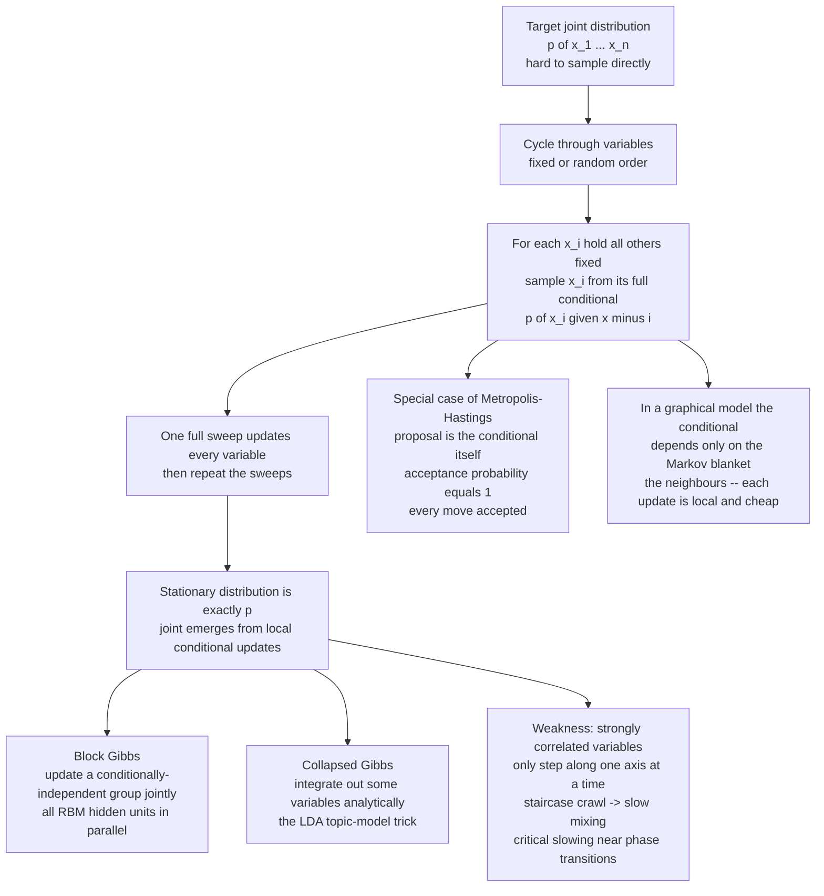

# 🎯 Gibbs Sampling and Conditional Updates

> [!abstract] TL;DR
> **Gibbs sampling** draws from a complex joint distribution $p(x_1,\dots,x_n)$ by repeatedly updating **one variable (or block) at a time**, each time sampling it fresh from its **full conditional** $p(x_i \mid x_{-i})$ given all the others. It is a special case of **Metropolis–Hastings** in which the proposal *is* the conditional, so the acceptance probability is exactly **1** — every move is accepted. It is the natural sampler wherever conditionals are tractable: conjugate Bayesian models, exponential-family **graphical models** and **Markov random fields** (where each conditional depends only on a variable's neighbours), and spin systems (an Ising spin's conditional is a sigmoid of its local field). **Block Gibbs** (updating conditionally-independent groups in parallel) is the engine behind **RBM** training and contrastive divergence; **collapsed Gibbs** (integrating some variables out analytically) powers topic models like **LDA**. Its Achilles' heel is slow, **staircase-like mixing for strongly correlated variables** — and *critical slowing down* near phase transitions.

---

## Intuition

**Analogy.** Picture a committee trying to reach a joint decision that is far too tangled to settle all at once — budget, hiring, strategy, and schedule all interlock. So instead of solving everything simultaneously, they go **around the table**. Each member, in turn, states their single best position *given everyone else's current stance*: the CFO picks the budget that fits the current plan, then the strategist re-picks the plan that fits that budget, then the recruiter re-picks hiring for that plan, and so on. Nobody ever solves the whole problem; each person only responds **optimally to the current context** and passes the baton. Round after round, the committee drifts — not toward a single frozen answer, but into a **consistent joint configuration** that keeps circulating around the sensible options.

Gibbs sampling does exactly this with **random variables**. Rather than sampling the intimidating joint distribution in one shot, it walks around the "table" of variables and updates each one from its **conditional distribution given all the others**. Each update is easy because it only has to reason about *one* variable at a time. Repeat the sweeps and the chain settles into drawing samples from the full joint — which is precisely why Gibbs sampling is the natural way to sample the interacting-spin systems of physics and the graphical models of machine learning, where "given all the others" collapses to "given my immediate neighbours."

---

## How It Works

### Core Mechanics

**1. The problem and the trick.** You have a joint distribution $p(x_1,\dots,x_n)$ you can *evaluate up to a constant* (an energy, a posterior) but cannot sample directly, because the normalizer / partition function is intractable. Gibbs sampling's insight: even when the **joint** is hopeless, each **one-dimensional full conditional** $p(x_i \mid x_{-i})$ — where $x_{-i}$ denotes "all variables except $x_i$" — is often a simple, closed-form distribution you *can* sample. Reduce the hard $n$-dimensional problem to a sequence of easy 1-D draws.

**2. The core loop.** Initialize $x^{(0)}=(x_1^{(0)},\dots,x_n^{(0)})$ arbitrarily. Then **cycle through the variables** (in a fixed or randomly permuted order); for each $i$, hold all others at their current values and replace $x_i$ by a fresh draw:

$$
x_i^{(t+1)} \sim p\big(x_i \,\big|\, x_1^{(t+1)},\dots,x_{i-1}^{(t+1)},\, x_{i+1}^{(t)},\dots,x_n^{(t)}\big).
$$

One pass over all $n$ variables is a **sweep**; repeat sweeps. (This "systematic scan" uses the just-updated coordinates immediately; a "random scan" picks a coordinate at random each step. Both leave $p$ invariant.) Crucially, the **joint distribution emerges from repeated local conditional updates** — it is never written down or sampled as a whole. This is *coordinate-wise* sampling.

**3. Why it works — Gibbs as a special case of Metropolis–Hastings.** Gibbs sampling is exactly Metropolis–Hastings (see the sibling *Metropolis_Hastings_and_Detailed_Balance*) with a very special proposal: propose the new $x_i$ *from the conditional itself*, $q(x_i' \mid x) = p(x_i' \mid x_{-i})$. Plug this into the MH acceptance ratio and it **collapses to 1**:

$$
\alpha = \min\!\left(1,\; \frac{p(x')\,q(x\mid x')}{p(x)\,q(x'\mid x)}\right)
= \min\!\left(1,\; \frac{p(x_i'\mid x_{-i})\,p(x_{-i})\; p(x_i\mid x_{-i})}{p(x_i\mid x_{-i})\,p(x_{-i})\; p(x_i'\mid x_{-i})}\right) = 1.
$$

Because $x_{-i}$ is unchanged, everything cancels: **every proposed move is accepted**. Each update satisfies detailed balance with respect to $p$, so $p$ is the **stationary distribution** of the chain, and (under mild irreducibility/aperiodicity conditions) the chain converges to $p$. This is the elegance of Gibbs — *always accept*, no wasted proposals, no step-size to tune.

**4. The enabling requirement — tractable full conditionals.** Gibbs is only usable when the $p(x_i \mid x_{-i})$ are **easy to sample**. This is exactly the situation in three big families:

- **Conjugate Bayesian models.** Choosing conjugate priors makes each conditional posterior a standard distribution (a Normal, Gamma, Dirichlet, …). Hierarchical models factor into a chain of such draws — the reason the original **BUGS** and **JAGS** probabilistic-programming engines were built on Gibbs.
- **Exponential-family / graphical models.** For a **Markov random field**, the joint is a product of clique potentials, so a variable's conditional depends only on the cliques it belongs to — see [[Markov_Random_Fields_and_Undirected_Graphical_Models]] and the general exponential-family view in [[Maximum_Entropy_Principle]].
- **Spin systems.** For an Ising/Potts spin, the conditional is a simple **sigmoid (or softmax) of its local field** — this is the Glauber/heat-bath update, and it is literally the RBM's neuron rule (the sigmoid *is* the Boltzmann conditional, as derived in [[Boltzmann_Machines_and_RBMs]]).

**5. Markov-blanket locality.** In a graphical model the full conditional depends only on a variable's **Markov blanket** — its immediate neighbours (for an MRF, the adjacent nodes) — **not the whole system**:

$$
p(x_i \mid x_{-i}) = p\big(x_i \mid x_{\mathrm{neighbours}(i)}\big).
$$

So each Gibbs update is **local and cheap**: for a 2-D Ising spin you only read four neighbours; for an RBM hidden unit you only read the visible layer. The graph's sparsity is what makes Gibbs **natural and scalable** on lattices, images, and large hierarchical models. Nothing global has to be recomputed per update.

**6. Block and collapsed Gibbs — the two great accelerators.**
- **Block Gibbs** updates a *group* of variables **jointly** from their joint conditional. When a set of variables is **conditionally independent** given the rest, the block draw factorizes and can be done **in parallel**. The canonical case: an **RBM** is bipartite, so all hidden units are conditionally independent given the visible layer (and vice-versa). You sample the *entire* hidden layer in one vectorized sigmoid-and-Bernoulli step, then the entire visible layer — this is the block Gibbs at the heart of **contrastive divergence** (see the sibling *Contrastive_Divergence_and_EBM_Training*). The same idea appears on a lattice as **checkerboard (red–black) updating**: the two colour classes of a 2-D grid are conditionally independent, so each half-lattice updates at once.
- **Collapsed Gibbs** *analytically integrates out* some variables and samples only the rest, reducing variance and often improving mixing. The landmark example is **collapsed Gibbs for Latent Dirichlet Allocation**: integrate out the per-document topic mixtures and per-topic word distributions (using Dirichlet–multinomial conjugacy), leaving a sampler over just the discrete topic assignments — the standard way LDA is trained.

**7. The main weakness — slow mixing for correlated variables.** Because Gibbs moves **one axis at a time**, when variables are **strongly correlated** the chain can only take tiny steps: to travel along a diagonal correlation ridge it must zig-zag in a **"staircase"**, changing one coordinate a little, then the other a little. The result is **high autocorrelation** and slow mixing — you need many sweeps per effectively-independent sample. Near a **phase transition** this becomes **critical slowing down**: correlation lengths diverge and single-site Gibbs grinds to a halt (the physics motivation for cluster algorithms like Swendsen–Wang). The fixes are exactly the accelerators above — **block** or **collapsed** Gibbs, **reparameterization** to decorrelate the variables, or switching to gradient-informed samplers (Langevin/Hamiltonian Monte Carlo — see the siblings *Langevin_Dynamics_and_SGLD* and the broader *MCMC_Sampling_in_Machine_Learning*).

### Flow / Architecture



---

## Key Concepts

### Secondary (intuitive)
- **Go around the table.** Update one variable at a time by asking "what should you be, given everyone else's current value?" Repeat forever and the whole configuration settles into the right joint pattern.
- **Always accept.** Unlike plain Metropolis, Gibbs never rejects a move — it proposes from the exact conditional, so there is no wasted step and no step-size knob.
- **Only look at your neighbours.** In a lattice or network, each update only needs the values right next to it, which is why Gibbs is cheap and scales.
- **Correlation is the enemy.** If two variables move together, one-at-a-time updates crawl in little staircase steps and the sampler takes forever to explore.

### Undergraduate (mechanics)
- **Full conditional:** $p(x_i \mid x_{-i}) = p(x)/p(x_{-i}) \propto p(x)$ as a function of $x_i$ alone — drop every factor not containing $x_i$.
- **The sweep:** systematic-scan Gibbs updates $x_1,\dots,x_n$ in order, each conditioned on the latest values; random-scan picks a coordinate uniformly. Both leave $p$ invariant.
- **Gibbs = MH with $\alpha=1$:** derive the cancellation of the Metropolis–Hastings ratio when $q(x_i'\mid x)=p(x_i'\mid x_{-i})$.
- **Gaussian conditionals:** for a multivariate normal, every conditional is again normal with mean and variance from the precision matrix — the closed forms that make Gaussian Gibbs trivial.
- **Ising conditional:** $p(s_i=+1\mid \text{neighbours}) = \sigma(2\beta J \sum_{j\in N(i)} s_j)$ — a sigmoid of the local field (heat-bath / Glauber dynamics).
- **Burn-in and thinning:** discard early samples before the chain reaches stationarity; optionally keep every $k$-th sample to reduce autocorrelation.

### Graduate (structure)
- **Invariance & convergence:** each coordinate kernel $K_i$ satisfies detailed balance for $p$; the sweep kernel $K = K_n\cdots K_1$ has $p$ as a stationary (not necessarily reversible) distribution. Irreducibility + aperiodicity (Harris recurrence) give geometric ergodicity under conditions on $p$.
- **Data-augmentation / auxiliary variables:** Gibbs powers latent-variable augmentation (e.g. Albert–Chib probit, Pólya–Gamma logistic, the EM-Gibbs correspondence), turning intractable posteriors into conjugate conditional chains.
- **Collapsed vs blocked vs plain — the Rao–Blackwell picture:** collapsing reduces estimator variance (Rao–Blackwellization) and typically improves mixing; blocking reduces autocorrelation by moving correlated coordinates jointly. Liu, Wong & Kong (1994) formalized the ordering.
- **Spectral gap and mixing time:** the relaxation time is set by the second-largest eigenvalue of the transition operator; strong variable correlation shrinks the spectral gap, and near criticality the dynamic exponent $z\approx 2$ gives $\tau \sim L^{z}$ **critical slowing down** for single-site (local) Gibbs — motivating cluster and worm algorithms.
- **Relation to Langevin/HMC:** Gibbs is gradient-free and coordinate-aligned; Langevin and Hamiltonian Monte Carlo use $\nabla \log p$ to make correlated, whole-vector moves that mix far better on smooth continuous targets (see *Langevin_Dynamics_and_SGLD*).
- **Non-conjugate conditionals:** when a conditional has no closed form, use a Metropolis step *within* Gibbs ("Metropolis-within-Gibbs"), slice sampling, or adaptive rejection sampling for that coordinate.

---

## Python Demo

```python
# Gibbs sampling, two faces:
#   (a) CONTINUOUS: sample a 2D CORRELATED GAUSSIAN by alternately drawing
#       x|y and y|x from the (Gaussian) full conditionals. Strong correlation
#       -> coordinate-wise "staircase" moves -> SLOW mixing (crawls along the
#       correlation ridge, high autocorrelation).
#   (b) DISCRETE graphical model: BLOCK (checkerboard) Gibbs for a 2D ISING
#       model. Each spin's conditional is the sigmoid of its local field
#       (Markov blanket = 4 neighbours). The two checkerboard colour classes
#       are conditionally independent, so a whole sublattice updates IN
#       PARALLEL -- exactly the RBM visible<->hidden "block Gibbs" trick.
import numpy as np
import matplotlib.pyplot as plt

rng = np.random.default_rng(0)

# =====================================================================
# (a) GIBBS SAMPLING A 2D CORRELATED GAUSSIAN
#     Zero-mean, unit variances, correlation rho:
#         x | y ~ Normal(rho * y, 1 - rho^2)
#         y | x ~ Normal(rho * x, 1 - rho^2)
# =====================================================================
def gibbs_gaussian(rho, n_steps, seed=0):
    r = np.random.default_rng(seed)
    cond_sd = np.sqrt(1.0 - rho ** 2)
    xs = np.zeros(n_steps + 1)
    ys = np.zeros(n_steps + 1)
    x, y = -3.0, 3.0                      # start far out in the corner
    xs[0], ys[0] = x, y
    for t in range(1, n_steps + 1):
        x = rho * y + cond_sd * r.standard_normal()   # sample x | y
        y = rho * x + cond_sd * r.standard_normal()   # sample y | x
        xs[t], ys[t] = x, y
    return xs, ys

xs_hi, ys_hi = gibbs_gaussian(rho=0.99, n_steps=4000)   # strongly correlated
xs_lo, ys_lo = gibbs_gaussian(rho=0.50, n_steps=4000)   # mildly correlated

def autocorr(v, maxlag=60):              # mixing diagnostic on the x-coordinate
    v = v - v.mean()
    full = np.correlate(v, v, mode="full")
    mid = len(v) - 1
    return full[mid:mid + maxlag] / full[mid]

ac_hi, ac_lo = autocorr(xs_hi), autocorr(xs_lo)

# =====================================================================
# (b) BLOCK (CHECKERBOARD) GIBBS FOR A 2D ISING MODEL
#     P(spin = +1 | neighbours) = sigmoid(2 * beta * J * neighbour_sum).
#     The (i+j) even / odd colour classes are conditionally independent,
#     so each sublattice is resampled all at once -- block Gibbs.
# =====================================================================
L, beta, J = 64, 0.44, 1.0               # beta ~ 2D Ising critical point 0.4407
ii, jj = np.indices((L, L))
even = (ii + jj) % 2 == 0
odd = ~even

def sigmoid(z):
    return 1.0 / (1.0 + np.exp(-np.clip(z, -30, 30)))

def neighbour_sum(s):                    # periodic boundaries via np.roll
    return (np.roll(s, 1, 0) + np.roll(s, -1, 0) +
            np.roll(s, 1, 1) + np.roll(s, -1, 1))

def block_update(s, mask, r):
    p_up = sigmoid(2.0 * beta * J * neighbour_sum(s))   # conditional per site
    new = np.where(r.random((L, L)) < p_up, 1.0, -1.0)
    return np.where(mask, new, s)        # only overwrite this colour class

s = rng.choice([-1.0, 1.0], size=(L, L))     # hot (random) start
config_initial = s.copy()
mag_hist, n_sweeps = [], 200
for _ in range(n_sweeps):
    s = block_update(s, even, rng)       # all EVEN sites in parallel
    s = block_update(s, odd, rng)        # then all ODD sites in parallel
    mag_hist.append(abs(s.mean()))
config_final = s.copy()

# =====================================================================
# PLOTS
# =====================================================================
fig = plt.figure(figsize=(15, 9))

ax = fig.add_subplot(2, 3, 1)            # (a1) staircase over the ridge
ax.scatter(xs_hi, ys_hi, s=3, alpha=0.12, color="#2980b9")
ax.plot(xs_hi[:40], ys_hi[:40], "-o", color="#c0392b", ms=3, lw=1,
        label="first 40 moves")
ax.set_title("(a) Gibbs on correlated Gaussian rho=0.99\ncoordinate-wise staircase moves")
ax.set_xlabel("x"); ax.set_ylabel("y"); ax.legend(loc="upper left")

ax = fig.add_subplot(2, 3, 2)            # (a2) trace: slow vs fast mixing
ax.plot(xs_hi[:600], color="#c0392b", lw=0.8, label="rho=0.99 (slow)")
ax.plot(xs_lo[:600], color="#27ae60", lw=0.8, label="rho=0.50 (fast)")
ax.set_title("(a) x-trace: strong correlation -> slow mixing")
ax.set_xlabel("Gibbs step"); ax.set_ylabel("x"); ax.legend()

ax = fig.add_subplot(2, 3, 3)            # (a3) autocorrelation
ax.plot(ac_hi, color="#c0392b", lw=2, label="rho=0.99")
ax.plot(ac_lo, color="#27ae60", lw=2, label="rho=0.50")
ax.axhline(0, color="k", lw=0.6)
ax.set_title("(a) autocorrelation of x\nhigh correlation -> high autocorrelation")
ax.set_xlabel("lag"); ax.set_ylabel("autocorr"); ax.legend()

ax = fig.add_subplot(2, 3, 4)            # (b1) hot start
ax.imshow(config_initial, cmap="gray", interpolation="nearest")
ax.set_title("(b) Ising start: random (hot)"); ax.axis("off")

ax = fig.add_subplot(2, 3, 5)            # (b2) equilibrated
ax.imshow(config_final, cmap="gray", interpolation="nearest")
ax.set_title("(b) after 200 block-Gibbs sweeps\ndomains form near T_c"); ax.axis("off")

ax = fig.add_subplot(2, 3, 6)            # (b3) magnetization convergence
ax.plot(mag_hist, color="#8e44ad", lw=1.5)
ax.set_title("(b) |magnetization| vs sweep\nblock Gibbs equilibrating")
ax.set_xlabel("sweep"); ax.set_ylabel("|m|")

plt.tight_layout(); plt.show()

print("Gaussian Gibbs (rho=0.99), post burn-in:")
print("  sample mean:", np.round([xs_hi[500:].mean(), ys_hi[500:].mean()], 3))
print("  sample corr:", round(float(np.corrcoef(xs_hi[500:], ys_hi[500:])[0, 1]), 3))
print("Ising final |m| (block Gibbs):", round(mag_hist[-1], 3))
```

**What you should see.** In **(a)** the Gibbs chain fills in the elongated correlated Gaussian, but the first-40-moves overlay is a clear right-angle **staircase**: each step changes only $x$ or only $y$, so the chain can only crawl along the correlation ridge. The $x$-trace for $\rho=0.99$ wanders slowly with long excursions (high autocorrelation, slow mixing) while the $\rho=0.5$ trace decorrelates in a few steps — the autocorrelation panel makes this quantitative. In **(b)** the Ising lattice starts as salt-and-pepper noise; **block (checkerboard) Gibbs** — resampling each conditionally-independent colour class in parallel using the local-field sigmoid — drives it toward equilibrium, and near the critical temperature large aligned **domains** emerge while $|m|$ climbs and levels off. The same two-block, sigmoid-conditional pattern is exactly the visible↔hidden alternation used to sample an RBM.

---

## Real-World Applications

> **Example (topic models — collapsed Gibbs for LDA):** The dominant training method for **Latent Dirichlet Allocation** is a **collapsed Gibbs sampler** (Griffiths & Steyvers, 2004): the per-document topic proportions and per-topic word distributions are integrated out analytically via Dirichlet–multinomial conjugacy, leaving a sampler that reassigns each word's discrete topic label from a simple closed-form conditional depending only on the current topic counts. It scales to millions of documents and made LDA a workhorse of NLP and digital-humanities text mining.

- **Bayesian inference / probabilistic programming.** Gibbs sampling was the original engine of **BUGS**, **WinBUGS**, and **JAGS**. Conjugate hierarchical models (random effects, mixture models, hierarchical regression) decompose into chains of standard conditional draws — for decades the default way applied statisticians fit complex posteriors. Connects to [[Bayesian_Statistics]].
- **Training and sampling Boltzmann machines / RBMs.** **Block Gibbs** (all hidden units given visible, then all visible given hidden) is the sampler inside **contrastive divergence**, the algorithm that made RBM and deep-belief-net training feasible — see [[Boltzmann_Machines_and_RBMs]].
- **Image models and MRFs — the founding application.** Geman & Geman (1984) *introduced* Gibbs sampling (and coined the name, after the Gibbs distribution) for **Bayesian image restoration** with Markov-random-field priors; it remains a staple for image **segmentation, denoising, and stereo** — see [[Markov_Random_Fields_and_Undirected_Graphical_Models]].
- **Statistical physics.** Single-site and checkerboard Gibbs (heat-bath / Glauber dynamics) simulate **Ising, Potts, and lattice** spin systems to estimate magnetization, energy, and critical exponents — see [[The_Ising_Model_and_Statistical_Physics]] and the broader [[The_Metropolis_Algorithm_and_MCMC]].
- **Spatial statistics and genetics.** Gibbs samplers fit conditional-autoregressive (CAR) disease-mapping models, geostatistical fields, and population-genetics admixture models (e.g. STRUCTURE), where latent group assignments have clean conditionals.

---

## Common Pitfalls

- **Building the wrong conditional.** The full conditional is $p(x_i\mid x_{-i}) \propto p(x)$ with everything not depending on $x_i$ dropped — but forgetting a coupling term (e.g. a shared hyperparameter or an off-diagonal precision entry) silently samples the *wrong* target. Re-derive by isolating all factors that contain $x_i$.
- **Assuming convergence without checking.** Gibbs samples are correlated and the chain needs **burn-in**; reading off statistics from early samples, or from a single chain that never left its starting basin, gives biased answers. Run multiple chains, monitor trace plots and $\hat R$, and discard burn-in.
- **Mistaking slow mixing for convergence.** With strongly correlated variables the chain moves in tiny staircase steps and *looks* stable while actually exploring almost nothing. High autocorrelation means a small **effective sample size** — thousands of sweeps may be worth only a handful of independent draws. Reparameterize, block, or switch to HMC.
- **Reducibility traps.** In models with hard constraints or well-separated modes (e.g. label-switching in mixtures, or Ising below $T_c$ where the two magnetized states are separated by a huge barrier), single-site Gibbs can get **stuck in one mode** and never visit the others. Use blocking, tempering, or cluster moves.
- **Serializing what should be blocked.** Updating conditionally-independent variables one-by-one throws away the biggest speedup Gibbs offers. If a group is conditionally independent (RBM layer, checkerboard sublattice), **update it as a vectorized block in parallel** — this is often a 10–100x win.
- **Improper posteriors.** A Gibbs sampler can appear to run happily even when the target posterior is *improper* (non-integrable), producing meaningless output. Verify the joint is a proper distribution before trusting any samples.

---

## Related Concepts

- [[The_Metropolis_Algorithm_and_MCMC]] — the parent MCMC family; Gibbs is the special case whose conditional-proposal gives acceptance probability exactly 1.
- [[Markov_Chains]] — Gibbs sampling is a Markov chain engineered to have the target $p$ as its stationary distribution.
- [[Markov_Random_Fields_and_Undirected_Graphical_Models]] — supplies the Markov-blanket locality that makes each Gibbs conditional depend only on a variable's neighbours.
- [[Boltzmann_Machines_and_RBMs]] — block Gibbs (visible↔hidden) is the sampler behind RBM training and contrastive divergence; the sigmoid is the Boltzmann conditional.
- [[The_Ising_Model_and_Statistical_Physics]] — the spin system whose heat-bath / Glauber conditional (a sigmoid of the local field) is exactly a Gibbs update.
- [[The_Boltzmann_Distribution_in_Learning]] — the $p\propto e^{-E/T}$ target and intractable $Z$ that Gibbs sampling draws from without computing the normalizer.
- [[Maximum_Entropy_and_Exponential_Families]] — exponential-family / graphical models are precisely where the full conditionals are tractable and Gibbs shines.
- [[Maximum_Entropy_Principle]] — the information-theory root of the exponential-family conditionals Gibbs exploits.
- [[Bayesian_Statistics]] — conjugate hierarchical models decompose into the standard conditional draws that made Gibbs the default posterior sampler.
- [[Stochastic_Differential_Equations_and_Langevin]] — gradient-based continuous alternative that mixes better than coordinate-wise Gibbs on strongly correlated smooth targets.
- [[Common_Probability_Distributions]] — the Normal, Gamma, Dirichlet, and Bernoulli conditionals that appear as the individual Gibbs draws.
- [[Machine_Learning_in_Computational_Physics]] — where spin-system Gibbs/heat-bath sampling meets neural-network energy models.
- [[Variational_Inference_the_ELBO_and_VAEs]] — the deterministic alternative to MCMC for the same intractable posteriors, trading unbiasedness for speed.

---

## Review Questions

1. **(Secondary)** Explain, using the committee-around-the-table analogy, what a single Gibbs update does and why repeating the sweeps eventually produces samples from the full joint distribution. Why does Gibbs never need to "reject" a proposed move?
2. **(Undergraduate)** For a zero-mean bivariate Gaussian with unit variances and correlation $\rho$, the conditionals are $x\mid y \sim \mathcal N(\rho y,\,1-\rho^2)$ and $y\mid x \sim \mathcal N(\rho x,\,1-\rho^2)$. Describe the geometric shape of the chain's path when $\rho$ is close to 1, and explain *mechanically* why this leads to slow mixing and high autocorrelation. Name one modification that would fix it.
3. **(Graduate)** (a) Starting from the Metropolis–Hastings acceptance ratio, show that proposing $x_i'$ from its full conditional yields acceptance probability 1. (b) Explain why an RBM admits **block Gibbs** while a general (unrestricted) Boltzmann machine does not, and what conditional-independence property makes the block draw parallelizable. (c) Contrast **collapsed** Gibbs with **blocked** Gibbs in terms of variance and mixing, and state which one is standard for LDA and why.

---

## Sources

- Geman, S., & Geman, D. (1984). "Stochastic Relaxation, Gibbs Distributions, and the Bayesian Restoration of Images." *IEEE Transactions on Pattern Analysis and Machine Intelligence* 6(6), 721–741. (Introduces Gibbs sampling and the name.)
- Gelfand, A. E., & Smith, A. F. M. (1990). "Sampling-Based Approaches to Calculating Marginal Densities." *Journal of the American Statistical Association* 85(410), 398–409. (Brought Gibbs into mainstream Bayesian statistics.)
- Casella, G., & George, E. I. (1992). "Explaining the Gibbs Sampler." *The American Statistician* 46(3), 167–174. (The classic tutorial.)
- Griffiths, T. L., & Steyvers, M. (2004). "Finding Scientific Topics." *PNAS* 101(suppl. 1), 5228–5235. (Collapsed Gibbs sampling for LDA.)
- Bishop, C. M. (2006). *Pattern Recognition and Machine Learning*, Ch. 11 ("Sampling Methods"). Springer.

---

#statistical-mechanics #machine-learning #gibbs-sampling #conditional-distributions #mcmc
