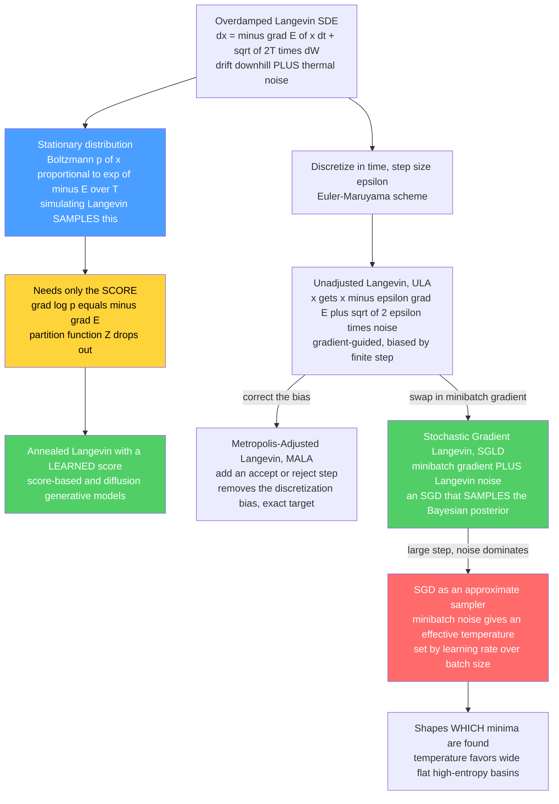

# 🎲 Langevin Dynamics and SGLD

> [!abstract] TL;DR
> **Langevin dynamics** is physics' equation of motion for a particle drifting *down* an energy gradient while being kicked around by random *thermal noise*: the overdamped SDE $dx = -\nabla E(x)\,dt + \sqrt{2T}\,dW$. Its one remarkable property is that its **stationary distribution is exactly the Boltzmann distribution** $p(x)\propto e^{-E(x)/T}$ — so *simulating physics samples the distribution*. Discretize it and you get a **gradient-guided MCMC sampler** (ULA / MALA) that scales to high dimensions far better than blind random-walk Metropolis, needing only the **score** $\nabla\log p$ (which is independent of the intractable partition function $Z$) — precisely why **annealed Langevin sampling is the engine of score-based and diffusion generative models**. Fuse it with minibatch SGD and you get **Stochastic Gradient Langevin Dynamics (SGLD)** — scalable Bayesian posterior sampling by *just adding noise to SGD* — and the same lens reveals that ordinary **SGD is itself an approximate sampler** whose *effective temperature* (set by learning-rate / batch-size) decides which minima it finds. One equation ties together physics, sampling, generation, optimization, and generalization.

---

## Intuition

**Analogy — the speck of pollen that never settles.** Watch a speck of pollen in a drop of water under a microscope and it *jitters endlessly*, kicked in random directions by unseen water molecules (this is Brownian motion — random **noise**). Now tilt the drop, or add a current, and the speck also **drifts** the way the water flows (a **force**). Langevin dynamics is just these two ingredients written as one equation of motion: *drift* plus *noise*.

Here is the twist that makes it a learning algorithm. Let the "force" be **gravity pulling toward the low points of a probability landscape** — the speck drifts *downhill* toward the likely, high-probability regions. But the thermal jitter never lets it fully settle at the bottom; it keeps getting nudged back up and around. Let it wander long enough and something magical happens: **the speck visits every region exactly as often as the probability says it should.** The fraction of time spent in each valley equals that valley's probability. So a physical process that *drifts down a gradient while shaking* becomes a machine for **drawing samples** from any distribution you can write as a landscape — and, with one small change, a machine for **training** too. That is Langevin dynamics: physics' equation for a particle in a force field with noise, which turns out to be one of the smartest ways to both **sample** and **learn** in machine learning.

---

## How It Works

### Core Mechanics

**1. The overdamped Langevin equation.** In the high-friction (overdamped / Brownian) limit, a particle in a potential $E(x)$ at temperature $T$ obeys the stochastic differential equation

$$
dx = -\nabla E(x)\,dt + \sqrt{2T}\,dW,
$$

where $dW$ is a Wiener increment (Gaussian white noise; see [[Brownian_Motion]] and the physics-framed companion [[Stochastic_Differential_Equations_and_Langevin]]). Two terms, exactly matching the analogy: the **drift** $-\nabla E(x)$ pulls the particle *down the energy gradient*, and the **diffusion** $\sqrt{2T}\,dW$ injects random thermal kicks whose strength grows with temperature.

**2. The remarkable property: it equilibrates to Boltzmann.** The probability density of this process evolves by the Fokker–Planck equation, and its unique stationary solution is

$$
p(x) \;\propto\; e^{-E(x)/T} .
$$

This is the **Boltzmann distribution** (the coefficient $\sqrt{2T}$ is chosen precisely so that drift and diffusion balance to give this stationary law — a fluctuation–dissipation relation). See [[The_Boltzmann_Distribution_in_Learning]]. The consequence is profound: **to sample $p(x)\propto e^{-E(x)/T}$, just simulate Langevin dynamics and wait.** Physics *is* the sampling algorithm.

**3. From physics to an MCMC sampler.** Discretize the SDE in time with the Euler–Maruyama scheme and step size $\varepsilon$ (set $T=1$ so $E=-\log p$):

$$
x_{t+1} \;=\; x_t \;-\; \varepsilon\,\nabla E(x_t) \;+\; \sqrt{2\varepsilon}\;\xi_t,\qquad \xi_t\sim\mathcal N(0,I).
$$

This is the **Unadjusted Langevin Algorithm (ULA)**. Because $\nabla E = -\nabla\log p$, each step *moves toward higher-probability regions* while adding noise — an **informed** proposal, unlike random-walk Metropolis which proposes blindly (see [[Metropolis_Hastings_and_Detailed_Balance]] for the blind version; [[MCMC_Sampling_in_Machine_Learning]] surveys the family).

**4. Fixing the discretization bias — MALA.** Finite $\varepsilon$ makes ULA sample a slightly *wrong* distribution (the bias is $O(\varepsilon)$). Wrap the ULA proposal in a **Metropolis accept/reject step** and the bias vanishes: this is the **Metropolis-Adjusted Langevin Algorithm (MALA)**, which samples the *exact* target for any $\varepsilon$. The proposal is asymmetric (it has drift), so the acceptance ratio uses the full Metropolis–Hastings correction. Trade-off: smaller $\varepsilon$ raises acceptance but slows movement; larger $\varepsilon$ moves fast but is rejected often.

**5. Why the gradient wins in high dimensions.** Random-walk Metropolis must keep steps small enough that a *blind* jump lands somewhere plausible; its step size shrinks as dimension grows, so it *diffuses* slowly across the distribution. Langevin instead **uses $\nabla\log p$ to head straight toward probability mass**, giving dramatically better *mixing* on smooth, high-dimensional, or correlated targets. MALA's step size scales like $d^{-1/3}$ versus random walk's $d^{-1}$ — a large asymptotic win. This is the very same reason **Hamiltonian Monte Carlo** (which augments the state with momentum to take long, near-ballistic gradient-guided jumps) is the state of the art in probabilistic programming: *gradient information transforms sampling*.

**6. The score connection — Langevin only needs $\nabla\log p$.** The update depends on $E$ only through $\nabla E = -\nabla\log p(x)$, the **score**. Crucially, $\nabla_x\log p = \nabla_x\log\tfrac{e^{-E}}{Z} = -\nabla_x E$ — the intractable partition function $Z$ **drops out entirely** (it does not depend on $x$). So Langevin can sample any distribution for which you can estimate the score, *without ever computing the normalizer*. This is exactly what **score-based models learn**: run **annealed Langevin dynamics** using a *learned* score $s_\theta(x)\approx\nabla\log p(x)$ and you generate samples — the mechanism at the heart of score-based and diffusion generative models (see [[Score_Matching_and_Score_Based_Models]] and the sibling *Diffusion_Models_as_Non_Equilibrium_Thermodynamics*; also [[Diffusion_Models]]).

**7. Stochastic Gradient Langevin Dynamics (SGLD).** Welling & Teh (2011) fused sampling with optimization. For a Bayesian posterior over $N$ data points, the full gradient $\nabla\log p(\theta\mid \text{data})$ is expensive. **Replace it with a noisy minibatch gradient** (as in SGD) and add the Langevin noise:

$$
\theta_{t+1} = \theta_t + \tfrac{\varepsilon_t}{2}\Big(\nabla\log p(\theta_t) + \tfrac{N}{n}\!\!\sum_{i\in \text{batch}}\!\!\nabla\log p(x_i\mid\theta_t)\Big) + \sqrt{\varepsilon_t}\,\xi_t .
$$

With a decreasing step size $\varepsilon_t\to 0$, the injected noise eventually dominates the minibatch-gradient noise and SGLD transitions from **SGD-like optimization** (early, large steps) to **exact Langevin sampling of the Bayesian posterior** (late, small steps) — scalable Bayesian inference for big data and deep nets *by literally adding noise to SGD*. This is the family of **stochastic-gradient MCMC** methods.

**8. SGD as approximate sampling.** The deepest consequence runs the other way. The **noise inherent in ordinary SGD** — from subsampling minibatches — makes plain SGD behave like a Langevin sampler with an **effective temperature** $T_{\text{eff}} \propto \dfrac{\text{learning rate}}{\text{batch size}}$. So SGD does not merely *find a point*; it approximately **samples a distribution concentrated on low-loss regions**, at a temperature you set with two knobs. This "SGD as a thermal system / approximate Bayesian sampler" view illuminates **generalization**: the temperature favors *wide, flat, high-entropy basins* over sharp ones, which is why SGD tends to find flat minima that generalize (foreshadowing the sibling *The_Loss_Landscape_and_Generalization*). Training becomes statistical mechanics: the thermodynamics of deep learning.

### Flow / Architecture



---

## Key Concepts

### Secondary Level

- **Drift + noise.** A particle rolls *downhill* on an energy landscape (drift) while being *randomly shaken* (noise). Together they never let it fully settle.
- **Shaking reveals the whole distribution.** Because it keeps wandering, the particle spends time in each valley in proportion to that valley's probability — so watching it *is* sampling.
- **Gradients are a shortcut.** Instead of guessing where to go next (random-walk Metropolis), Langevin *reads the slope* and heads toward likely regions — much faster in high dimensions.
- **Add noise to training, get sampling.** Ordinary training (gradient descent) tries to reach the single lowest point. Add the right amount of noise and it instead *samples* the low regions; turn the noise down and it *anneals* back to the minimum.

### Undergraduate Level

- **Overdamped Langevin SDE** $dx=-\nabla E(x)\,dt+\sqrt{2T}\,dW$; **stationary distribution** $p\propto e^{-E/T}$ via Fokker–Planck.
- **ULA update** $x\leftarrow x-\varepsilon\nabla E(x)+\sqrt{2\varepsilon}\,\xi$; $\nabla E=-\nabla\log p$, so it climbs the log-density plus noise.
- **MALA** = ULA proposal + Metropolis–Hastings accept/reject; removes the $O(\varepsilon)$ discretization bias, exact for any step size.
- **Score $=\nabla\log p=-\nabla E$**, independent of $Z$; this is why Langevin needs no normalizer.
- **SGLD** = SGD's minibatch gradient + Langevin noise + decaying step size; optimization early, posterior sampling late.
- **Effective temperature** of SGD $\sim$ learning-rate / batch-size; the "temperature knobs" of training.

### Graduate Level

- **Fluctuation–dissipation / detailed balance.** The $\sqrt{2T}$ coefficient is fixed by requiring $e^{-E/T}$ be stationary; the Langevin diffusion satisfies detailed balance with respect to the Boltzmann measure, and its generator is the reversible operator whose invariant law is Gibbs.
- **Bias and convergence.** ULA has an $O(\varepsilon)$ asymptotic bias; non-asymptotic bounds (e.g. Durmus & Moulines; Dalalyan) give $W_2$ / TV mixing rates under log-concavity and smoothness ($L$-smooth, $m$-strongly-log-concave). MALA restores exactness and improves the dimension scaling of the optimal step to $d^{-1/3}$ vs. random-walk Metropolis's $d^{-1}$.
- **Underdamped / Hamiltonian variants.** Adding a momentum variable gives underdamped Langevin and, in the deterministic-flow limit with periodic momentum refresh, **Hamiltonian Monte Carlo** — ballistic, low-autocorrelation exploration; the state of the art behind NUTS in probabilistic programming.
- **Annealed Langevin & diffusion.** Sampling a sequence of noise-perturbed densities $p_{\sigma_1}\!\to\!\cdots\!\to\!p_{\sigma_L}$ with a learned score (Song & Ermon) is Langevin over a temperature ladder; the continuous-time reverse-SDE view (Song et al.) unifies score-based and diffusion models — Langevin is their sampler.
- **SGLD as stochastic approximation.** SGLD is a Robbins–Monro scheme whose noise budget interpolates SGD and Langevin; the minibatch-gradient covariance adds an *extra*, anisotropic noise term, motivating preconditioned (pSGLD), SGHMC, and SG-MCMC corrections. The stationary analysis of constant-step SGD (Mandt, Hoffman & Blei) formalizes SGD as approximate Bayesian inference / Ornstein–Uhlenbeck sampling near a minimum.

---

## Python Demo

```python
# Langevin sampling and the gradient advantage.
#   (a) LANGEVIN MCMC vs RANDOM-WALK METROPOLIS on a correlated (ill-conditioned)
#       2D Gaussian target p(x) ~ exp(-E(x)). Langevin uses the GRADIENT of the
#       log-density to move into high-probability regions -> much faster MIXING.
#   (b) SGLD / SGD-AS-SAMPLING on a tilted double-well loss. Adding the right
#       noise to gradient descent turns OPTIMIZATION into SAMPLING: the stationary
#       distribution is exp(-L/T), controlled by an effective temperature. Cooling
#       T -> 0 ANNEALS the sampler back into the global minimum (optimization).
import numpy as np
import matplotlib.pyplot as plt

rng = np.random.default_rng(0)

# ============================================================
# (a) A thin, tilted "ridge" Gaussian: E(x) = 0.5 * x^T A x, A = Sigma^{-1}.
#     Strong correlation => random-walk Metropolis must take tiny steps and
#     crawls along the long axis, while Langevin follows the gradient.
# ============================================================
theta = np.pi / 4.0
R = np.array([[np.cos(theta), -np.sin(theta)],
              [np.sin(theta),  np.cos(theta)]])
Sigma = R @ np.diag([1.0, 0.03]) @ R.T      # long axis var 1.0, short axis 0.03
A = np.linalg.inv(Sigma)                    # precision matrix
long_axis = R[:, 0]                         # the hard-to-explore direction

def E(x):      return 0.5 * np.einsum('...i,ij,...j->...', x, A, x)
def gradE(x):  return x @ A.T               # grad of 0.5 x^T A x = A x

N = 6000
start = np.array([2.5, -2.5])               # deliberately off in the tails

# --- Unadjusted Langevin Algorithm (ULA): x <- x - eps*gradE + sqrt(2 eps)*noise
eps = 0.02
xl = np.empty((N, 2)); x = start.copy()
for t in range(N):
    x = x - eps * gradE(x) + np.sqrt(2 * eps) * rng.standard_normal(2)
    xl[t] = x

# --- Random-walk Metropolis: symmetric Gaussian proposal, tuned isotropic step
step = 0.20
xm = np.empty((N, 2)); x = start.copy(); Ex = E(x); acc = 0
for t in range(N):
    xp = x + step * rng.standard_normal(2); Ep = E(xp)
    if np.log(rng.random()) < (Ex - Ep):    # accept prob = min(1, e^{Ex-Ep})
        x, Ex = xp, Ep; acc += 1
    xm[t] = x

# --- Mixing along the long axis: autocorrelation + effective sample size
def autocorr(series, maxlag=250):
    s = series - series.mean(); v = np.dot(s, s)
    return np.array([np.dot(s[:len(s) - k], s[k:]) / v for k in range(maxlag)])
ac_l = autocorr(xl @ long_axis)
ac_m = autocorr(xm @ long_axis)
def ess(ac):                                # crude ESS via integrated autocorr time
    tau = 1 + 2 * np.sum(ac[1:][ac[1:] > 0])
    return N / tau
print(f"(a) Metropolis acceptance: {acc / N:.2f}")
print(f"(a) ESS (long axis)  Langevin={ess(ac_l):8.0f}   RW-Metropolis={ess(ac_m):8.0f}")

# ============================================================
# (b) SGLD on a TILTED double-well loss L(x) = (x^2 - 1)^2 + 0.3 x
#     Wells near x=+/-1; the +0.3x tilt makes the LEFT well (x~-1) the GLOBAL min.
#     Update: x <- x - eps*gradL(x) + sqrt(2 eps T) * noise  =>  samples exp(-L/T).
# ============================================================
def L(x):      return (x**2 - 1.0)**2 + 0.3 * x
def gradL(x):  return 4.0 * x * (x**2 - 1.0) + 0.3

def sgld(T, eps=0.002, steps=200_000, x0=1.0):
    x = x0; xs = np.empty(steps)
    for t in range(steps):
        x = x - eps * gradL(x) + np.sqrt(2 * eps * T) * rng.standard_normal()
        xs[t] = x
    return xs

xs_hot = sgld(T=0.20)     # high temperature: SAMPLES, exploring BOTH wells
grid = np.linspace(-1.9, 1.9, 400)
w = np.exp(-(L(grid) - L(grid).min()) / 0.20)
boltz = w / (w.sum() * (grid[1] - grid[0]))    # analytic exp(-L/T), normalized

# --- Annealing: cool T over time -> collapse onto the GLOBAL minimum
steps = 80_000; x = 1.0; traj = np.empty(steps); Tsched = np.empty(steps)
for t in range(steps):
    T = 0.30 * (1.0 - t / steps) + 1e-4        # linear cooling schedule
    x = x - 0.002 * gradL(x) + np.sqrt(2 * 0.002 * T) * rng.standard_normal()
    traj[t] = x; Tsched[t] = T
xstar = grid[np.argmin(L(grid))]
print(f"(b) global min at x={xstar:+.3f}; annealed endpoint x={traj[-1]:+.3f}")

# ------------------------------- plots -------------------------------
fig, ax = plt.subplots(2, 2, figsize=(13, 10))

# (a) samples over the target contours
gx, gy = np.meshgrid(np.linspace(-3, 3, 200), np.linspace(-3, 3, 200))
pts = np.stack([gx, gy], axis=-1)
ax[0, 0].contour(gx, gy, np.exp(-E(pts)), levels=8, cmap="Greys")
ax[0, 0].plot(xl[:800, 0], xl[:800, 1], '.', ms=2, color="crimson", alpha=0.5,
              label="Langevin (ULA)")
ax[0, 0].plot(xl[:60, 0], xl[:60, 1], '-', color="crimson", lw=1)   # early path
ax[0, 0].plot(*start, 'k*', ms=13, label="start (tail)")
ax[0, 0].set(title="(a) Langevin samples flow down the gradient into the ridge",
             xlabel="x1", ylabel="x2"); ax[0, 0].legend(loc="upper left")

# (a) mixing: autocorrelation along the long (hard) axis
ax[0, 1].plot(ac_l, lw=2, color="crimson", label="Langevin (uses gradient)")
ax[0, 1].plot(ac_m, lw=2, color="steelblue", label="Random-walk Metropolis")
ax[0, 1].axhline(0, color="gray", lw=0.8)
ax[0, 1].set(title="(a) Autocorrelation along the hard axis: Langevin mixes faster",
             xlabel="lag", ylabel="autocorrelation"); ax[0, 1].legend()

# (b) SGLD SAMPLES exp(-L/T): histogram vs analytic Boltzmann
ax[1, 0].hist(xs_hot, bins=120, density=True, color="mediumseagreen",
              alpha=0.6, label="SGLD samples, T=0.20")
ax[1, 0].plot(grid, boltz, 'k-', lw=2, label="analytic  p(x) ~ exp(-L/T)")
ax[1, 0].plot(grid, L(grid) / L(grid).max() * boltz.max() * 0.9, ':',
              color="darkorange", lw=2, label="loss L(x) (scaled)")
ax[1, 0].set(title="(b) Add noise to gradient descent -> it SAMPLES both wells",
             xlabel="x", ylabel="density"); ax[1, 0].legend()

# (b) annealing: cooling T drives the sampler to the GLOBAL minimum
ax2 = ax[1, 1]
ax2.plot(traj, color="purple", lw=0.6, alpha=0.8)
ax2.axhline(xstar, color="green", ls="--", lw=2, label=f"global min x={xstar:.2f}")
ax2.set(title="(b) Cooling T: SAMPLING anneals into OPTIMIZATION (global min)",
        xlabel="iteration", ylabel="x")
axT = ax2.twinx(); axT.plot(Tsched, color="orangered", lw=1.5)
axT.set_ylabel("temperature T", color="orangered")
ax2.legend(loc="upper right")

plt.tight_layout()
plt.savefig("langevin_dynamics_sgld.png", dpi=110)
print("saved langevin_dynamics_sgld.png")
```

**What it shows.** Part (a) targets a deliberately *ill-conditioned* correlated Gaussian — a thin, tilted ridge. **Langevin (ULA)** reads the gradient and immediately streams down from the tail into the ridge, then explores *along* it; **random-walk Metropolis**, forced to take small isotropic steps by the narrow direction, crawls. The autocorrelation along the hard (long) axis decays far faster for Langevin, and its effective sample size is much larger — the concrete payoff of *gradient-guided* proposals in high/correlated dimensions. Part (b) makes the SGD-as-sampling story literal: adding calibrated noise to gradient descent on a tilted double-well loss turns it into a **sampler of $p(x)\propto e^{-L(x)/T}$** — the histogram of visited states matches the analytic Boltzmann curve and *visits both wells*, spending more time in the deeper (global) one. Finally, **cooling $T\to 0$** removes the exploration and **anneals** the same dynamics back into ordinary optimization, collapsing onto the global minimum: one algorithm, sampling at high temperature and optimizing at low temperature.

---

## Real-World Applications

- **Score-based and diffusion generative models (the biggest modern use).** Song & Ermon's noise-conditional score networks and DDPM-style diffusion models generate images, audio, video, and molecules by running **annealed Langevin dynamics** with a *learned score* $\nabla\log p$. Langevin is literally the sampler at the heart of Stable Diffusion, DALL·E-class systems, and structure-generation models. See [[Score_Matching_and_Score_Based_Models]] and [[Diffusion_Models]].
- **Scalable Bayesian deep learning.** **SGLD** and the broader **stochastic-gradient MCMC** family (SGHMC, pSGLD, SG-NHT) give posterior samples over neural-network weights on datasets far too large for classical MCMC — used for uncertainty quantification, calibration, and out-of-distribution detection.
- **Training deep energy-based models.** The *negative phase* of EBM maximum-likelihood needs samples from the model; **short-run Langevin dynamics** provides them cheaply (Nijkamp, Du & Mordatch). See [[Energy_Based_Models]] and [[Contrastive_Divergence_and_EBM_Training]].
- **Molecular dynamics and physics simulation (the physical origin).** Langevin thermostats sample the Boltzmann ensemble of molecular configurations at fixed temperature — the same equation, used for its literal physical meaning. See [[Molecular_Dynamics_Simulation]] and the physics framing in [[Stochastic_Differential_Equations_and_Langevin]].
- **Global optimization and Bayesian model averaging.** Langevin/SGLD with a cooling schedule is a gradient-powered cousin of **simulated annealing** for non-convex landscapes (see [[Simulated_Annealing_and_Global_Optimization]]); the "SGD as sampling" view also explains why large-learning-rate / small-batch training generalizes by preferring flat minima.

---

## Common Pitfalls

- **Skipping the Metropolis correction and ignoring the bias.** Plain **ULA** is *biased* by $O(\varepsilon)$ — its samples are systematically off, worst at large step sizes. If you need the exact target, use **MALA**; if you use ULA, keep $\varepsilon$ small and remember the density is approximate.
- **Step size too large — the sampler explodes.** Because the drift $-\varepsilon\nabla E$ is an explicit Euler step, a large $\varepsilon$ overshoots steep regions and diverges (especially on stiff/ill-conditioned targets). Symptoms: NaNs, or MALA acceptance collapsing to near zero. Shrink $\varepsilon$ or precondition with a metric/mass matrix.
- **Forgetting the $\sqrt{2\varepsilon}$ (or $\sqrt{2\varepsilon T}$) noise scale.** Get the noise coefficient wrong and you sample the *wrong temperature* — too little noise and it behaves like optimization (collapses to a mode); too much and it ignores the landscape. The coefficient is fixed by the fluctuation–dissipation relation, not free.
- **Poor mixing between well-separated modes.** Langevin follows *local* gradients, so it can get *stuck* in one basin of a multimodal target (a valley wall it cannot climb at the given temperature). Use **annealing / tempering**, parallel chains, or replica exchange; a single low-temperature chain will *not* find distant modes.
- **Treating SGD's noise as exactly Langevin.** The "SGD as sampling" picture is an *approximation*: minibatch-gradient noise is **anisotropic and state-dependent**, unlike the isotropic Langevin noise, so the effective temperature is only a heuristic and the stationary distribution is not exactly $e^{-L/T}$. Useful intuition, not an identity.
- **Not decaying the SGLD step size.** SGLD only *becomes* a correct posterior sampler as $\varepsilon_t\to 0$; run it at a large constant step and you get an inflated, over-dispersed posterior (or, conversely, mode-seeking). Match the schedule to whether you want optimization or sampling.

---

## Related Concepts

- [[Stochastic_Differential_Equations_and_Langevin]] — the *physics-framed* companion (Brownian motion, SDEs, Langevin thermostats); this note is the *ML-sampling* framing of the same equation.
- [[The_Boltzmann_Distribution_in_Learning]] — the stationary law $p\propto e^{-E/T}$ that Langevin dynamics samples; the target that makes the whole method work.
- [[Metropolis_Hastings_and_Detailed_Balance]] — the accept/reject rule and reversibility condition that turn ULA into exact MALA; the blind random-walk baseline Langevin beats.
- [[The_Metropolis_Algorithm_and_MCMC]] — the physics-side treatment of the same Metropolis machinery.
- [[MCMC_Sampling_in_Machine_Learning]] — the broader sampler family Langevin/SGLD belong to.
- [[Gibbs_Sampling_and_Conditional_Updates]] — the coordinate-wise MCMC alternative used in Boltzmann-machine training.
- [[Score_Matching_and_Score_Based_Models]] — learns the score $\nabla\log p$ that annealed Langevin then samples with.
- [[Diffusion_Models]] — generative models whose sampler is annealed Langevin dynamics using a learned score.
- [[Energy_Based_Models]] — models $p_\theta\propto e^{-E_\theta}$ whose sampling *is* Langevin dynamics on a learned energy.
- [[Contrastive_Divergence_and_EBM_Training]] — short-run Langevin supplies the negative-phase samples for training EBMs.
- [[Simulated_Annealing_and_Global_Optimization]] — the cooling-schedule cousin; Langevin/SGLD is its gradient-powered version.
- [[Brownian_Motion]] — the Wiener process $dW$ that supplies Langevin's thermal noise.
- [[SGD_and_Variants]] — the optimizer SGLD extends by adding noise; the algorithm the "SGD as sampling" lens reinterprets.
- [[Gradient_Descent]] — the noiseless drift-only limit ($T\to 0$) of Langevin dynamics.
- [[Gradient_Descent_Variants]] — where SGLD sits among stochastic optimizers in the deep-learning stack.
- [[Molecular_Dynamics_Simulation]] — Langevin thermostats sampling the Boltzmann ensemble; the physical origin of the method.
- [[Partition_Functions_and_Free_Energy_in_ML]] — the intractable $Z$ that the *score* $\nabla\log p$ sidesteps, which is why Langevin scales.
- [[Statistical_Mechanics_of_Machine_Learning_Overview]] — the map of the physics-ML correspondence this note lives inside.

---

## Review Questions

**Secondary.** Using the pollen-in-water picture, explain the two forces acting on the particle in Langevin dynamics and what each one does. Why does letting the particle wander for a long time amount to *drawing samples* from a probability distribution? What single change turns this sampler into an ordinary optimizer that just seeks the lowest point?

**Undergraduate.** Write the discretized Langevin (ULA) update for a target $p(x)\propto e^{-E(x)}$ and identify the drift and noise terms. (a) Show that the update depends on $E$ only through $\nabla\log p$, and explain why the partition function $Z$ never appears. (b) State what MALA adds to ULA and what problem it fixes. (c) Explain in one or two sentences why Langevin mixes faster than random-walk Metropolis on a high-dimensional correlated Gaussian.

**Graduate.** (a) Starting from the overdamped SDE $dx=-\nabla E\,dt+\sqrt{2T}\,dW$, argue via the Fokker–Planck equation that its stationary distribution is $p\propto e^{-E/T}$, and explain the role of the $\sqrt{2T}$ coefficient (fluctuation–dissipation). (b) Describe how SGLD interpolates between SGD and Langevin sampling as the step size decays, and why a *decreasing* step size is required for it to sample the correct posterior. (c) In the "SGD as approximate sampling" view, derive the qualitative dependence of the effective temperature on learning rate and batch size, state one way minibatch-gradient noise *differs* from ideal Langevin noise, and explain how the temperature shapes which minima (flat vs. sharp) SGD selects — connecting to generalization.

---

## Sources

- Welling, M., & Teh, Y. W. (2011). "Bayesian Learning via Stochastic Gradient Langevin Dynamics." *ICML*. [dl.acm.org](https://dl.acm.org/doi/10.5555/3104482.3104568)
- Roberts, G. O., & Tweedie, R. L. (1996). "Exponential Convergence of Langevin Distributions and Their Discrete Approximations." *Bernoulli*, 2(4), 341–363. [projecteuclid.org](https://projecteuclid.org/euclid.bj/1178291835)
- Song, Y., & Ermon, S. (2019). "Generative Modeling by Estimating Gradients of the Data Distribution." *NeurIPS*. [arXiv:1907.05600](https://arxiv.org/abs/1907.05600)
- Mandt, S., Hoffman, M. D., & Blei, D. M. (2017). "Stochastic Gradient Descent as Approximate Bayesian Inference." *JMLR*, 18. [arXiv:1704.04289](https://arxiv.org/abs/1704.04289)
- Dalalyan, A. S. (2017). "Theoretical Guarantees for Approximate Sampling from Smooth and Log-Concave Densities." *JRSS-B*, 79(3). [arXiv:1412.7392](https://arxiv.org/abs/1412.7392)
- Neal, R. M. (2011). "MCMC using Hamiltonian Dynamics." *Handbook of Markov Chain Monte Carlo*. [arXiv:1206.1901](https://arxiv.org/abs/1206.1901)

---

#statistical-mechanics #machine-learning #langevin-dynamics #SGLD #gradient-sampling
