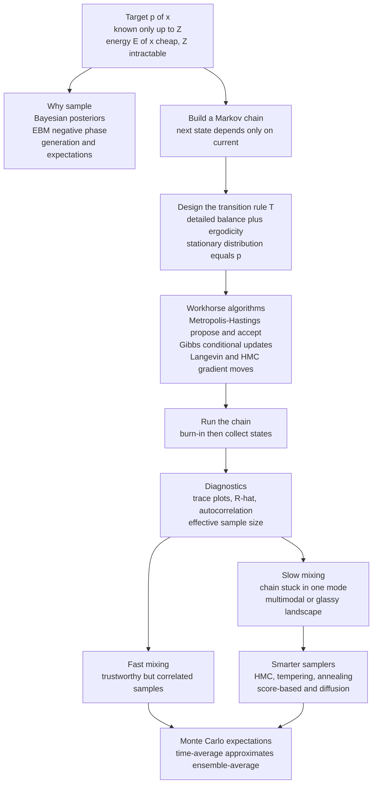

# 🎲 MCMC Sampling in Machine Learning

> [!abstract] TL;DR
> **Markov Chain Monte Carlo (MCMC)** is a family of algorithms for drawing samples from a complex, high-dimensional distribution $p(x)$ that you can evaluate *only up to its intractable normalizing constant* — you know the **energy** $E(x)$ but not the **partition function** $Z$. The trick: build a **Markov chain** — a guided random walk where each state depends only on the last — whose long-run **stationary distribution** is *exactly* $p(x)$, guaranteed by **detailed balance** and **ergodicity**; run it, discard the "burn-in," and collect the visited states as (correlated) samples. It is the shared engine of statistical-physics simulation and probabilistic machine learning — powering Bayesian posterior inference, the training of energy-based models, generative sampling, and the estimation of intractable expectations — and its central pain point is **slow mixing**: chains that get stuck in one mode of a multimodal or glassy landscape, the very same critical-slowing-down physicists face near a phase transition.

---

## Intuition

**Analogy — FIRST.** You want to know the *average depth* of a vast, dark lake — but you cannot drain it, and you cannot map it. All you can do is row around and drop a weighted line here and there. If you row aimlessly, you will oversample the shallows near the shore (there is more shoreline than deep centre) and get a badly biased answer. The trick is to let *where you are* influence *where you go next*: keep proposing small moves, and accept a move into deeper water more readily than a move into shallower water — in exact proportion to the depths. Do this long enough and the fraction of time you spend hovering over each spot reproduces the true depth profile of the lake. Now a simple time-average of your soundings gives the right mean depth.

That guided, self-correcting random walk **is a Markov chain**, and its long-run visiting frequency **is the very distribution you could not write down**. This is precisely how physicists simulate a magnet or a fluid they cannot solve on paper, and how machine learning draws samples from the impossibly complicated probability landscapes of Bayesian posteriors and energy-based models. You never need the total "volume" of the lake (the intractable normalizer $Z$) — the walk normalizes itself.

---

## How It Works

### The setup: sampling when you only know the energy

Across probabilistic ML and statistical physics the recurring object is a distribution written in **Boltzmann form**,
$$
p(x) = \frac{e^{-E(x)}}{Z}, \qquad Z = \int e^{-E(x)}\,dx ,
$$
where the **energy** $E(x) = -\log p(x) + \text{const}$ is cheap to evaluate but the **partition function** $Z$ — a sum or integral over *every possible configuration* — is hopelessly intractable in high dimension. You can compare $p(x_1)$ against $p(x_2)$ through the *ratio* $e^{-[E(x_1)-E(x_2)]}$ (the $Z$'s cancel), but you cannot evaluate $p(x)$ itself, and you certainly cannot invert its CDF to sample directly. MCMC is the answer to "how do I sample when I can only compute the unnormalized density?"

**Why sampling is the central problem in ML.** Sampling is not a side quest — an enormous amount of machine learning *is* a sampling problem in disguise:

1. **Bayesian inference.** The posterior $p(\theta \mid \text{data}) \propto p(\text{data}\mid\theta)\,p(\theta)$ is known only up to its evidence $Z = p(\text{data})$. Drawing samples $\theta^{(1)},\dots,\theta^{(N)}$ from it gives you predictive distributions, credible intervals, uncertainty, and model averaging — everything a point estimate throws away.
2. **Training energy-based models.** The maximum-likelihood gradient of an EBM contains a "negative phase," an expectation $\mathbb{E}_{x\sim p_\theta}[\nabla_\theta E_\theta(x)]$ over samples *from the model itself* — which requires MCMC (this is exactly what contrastive divergence approximates; see [[Energy_Based_Models]]).
3. **Generation.** Producing a new image, molecule, or spin configuration means drawing $x \sim p(x)$ from a learned distribution.
4. **Intractable expectations and integrals.** Any $\mathbb{E}_{p}[f(x)] = \int f(x)\,p(x)\,dx$ that has no closed form becomes a **Monte Carlo** average $\frac1N\sum_i f(x^{(i)})$ once you can sample — the estimator studied in [[Monte_Carlo_Integration]].

### The Markov-chain mechanism

A **Markov chain** is a sequence of states $x_0 \to x_1 \to x_2 \to \cdots$ where each state depends *only on the previous one* through a **transition rule** $T(x \to x')$ (the Markov, or "memoryless," property; the mathematics is developed in [[Markov_Chains]]). The single beautiful idea of MCMC is: **design the transition rule so that the chain's stationary distribution is the target $p$**. Then, after an initial **burn-in** phase in which the chain forgets its arbitrary starting point, every state it visits is a sample from $p$, and — by the **ergodic theorem** — *time-averages along one long chain converge to expectations under $p$*:
$$
\frac{1}{N}\sum_{t=1}^{N} f(x_t) \;\xrightarrow[N\to\infty]{}\; \mathbb{E}_{p}[f(x)] .
$$
The walk is guided (it prefers high-probability regions) and self-correcting (from anywhere, it relaxes back toward $p$).

### Detailed balance and stationarity — why it works

Two conditions make the magic rigorous.

- **Detailed balance (reversibility).** A *sufficient* condition for $p$ to be stationary is
  $$
  p(x)\,T(x \to x') = p(x')\,T(x' \to x) \qquad \text{for all } x, x'.
  $$
  In words: at equilibrium, the probability flux from $x$ to $x'$ exactly cancels the reverse flux. Summing over $x$ shows $p$ is left unchanged by $T$ — it is a fixed point. Crucially, this condition only involves *ratios* $p(x')/p(x)$, so the intractable $Z$ cancels. Enforcing detailed balance through a *propose-then-accept/reject* step is the design principle behind **Metropolis-Hastings** (the general recipe, developed in the sibling *Metropolis_Hastings_and_Detailed_Balance*).
- **Ergodicity (irreducibility + aperiodicity).** The chain must be able to reach every region of the space (irreducible) and not get trapped in deterministic cycles (aperiodic). Ergodicity guarantees the chain **converges to $p$ regardless of where it starts** and that a *unique* stationary distribution exists.

Together, detailed balance ("$p$ is a fixed point") plus ergodicity ("we actually get there, from anywhere") guarantee that a long enough run produces samples from $p$.

### The workhorse algorithms — a map of this section

MCMC is a *toolkit*, and this section builds it up algorithm by algorithm:

- **Metropolis-Hastings** — propose a candidate $x'$ from a proposal $q(x'\mid x)$, then accept it with probability $\min\!\big(1,\ \tfrac{p(x')\,q(x\mid x')}{p(x)\,q(x'\mid x)}\big)$. The accept/reject step is exactly what enforces detailed balance. The general recipe from which everything else specializes (see *Metropolis_Hastings_and_Detailed_Balance*).
- **Gibbs sampling** — update one variable at a time by resampling it from its *conditional* $p(x_i \mid x_{-i})$. No rejections, no tuning; ideal for graphical models and latent-variable structure where the conditionals are simple (see *Gibbs_Sampling_and_Conditional_Updates*).
- **Langevin dynamics and Hamiltonian Monte Carlo (HMC)** — use the **gradient** $\nabla_x \log p(x) = -\nabla_x E(x)$ to propose *smart, directed* moves that follow the probability landscape uphill instead of blundering randomly. Far more efficient in high dimensions; the basis of SGLD and of modern score-based generation (see *Langevin_Dynamics_and_SGLD* and [[Stochastic_Differential_Equations_and_Langevin]]).
- **Simulated annealing and tempering** — introduce a **temperature** $T$ via $p_T(x) \propto e^{-E(x)/T}$; run hot to flatten barriers and explore, then cool to concentrate on the modes. A trick for both global optimization and for *rescuing mixing* on rugged landscapes (see *Simulated_Annealing_and_Global_Optimization*).

### Convergence and mixing — the practical crux

Whether you can *trust* your samples comes down to a handful of diagnostics:

- **Burn-in.** Discard the initial states while the chain is still relaxing from its arbitrary start; only after it has "forgotten" the start does it sample from $p$.
- **Mixing time.** How fast the chain explores the whole distribution. *Fast mixing* = nearly independent samples, low bias; *slow mixing* = the chain crawls, and finite runs are biased because they have not seen the whole space.
- **Autocorrelation and effective sample size (ESS).** Consecutive MCMC states are **correlated** — each is a small step from the last — so $N$ MCMC draws are worth *fewer* than $N$ independent draws. The **effective sample size** $\text{ESS} = N / (1 + 2\sum_k \rho_k)$ discounts by the integrated autocorrelation; it is the number your error bars should actually use.
- **Diagnostics.** *Trace plots* (does the chain wander freely or stick?), the **Gelman-Rubin $\hat R$** statistic (do multiple chains from different starts agree?), and ESS estimates tell you when to trust the run.

### The mixing challenge — the fundamental difficulty

The bane of MCMC is a **multimodal** target: probability mass split into well-separated modes with high-energy barriers between them. A local random-walk chain drops into one mode and **gets stuck** — it may take astronomically long to cross a barrier, so a finite run silently misses entire modes, biasing every estimate. High dimensions and strong correlations make it worse. This is *identical* to the physics of **critical slowing down** near a **phase transition** and to relaxation in **glassy** energy landscapes: as barriers grow, the mixing time explodes. The whole progression of smarter samplers — gradient-informed HMC, replica-exchange **tempering**, and ultimately the **score-based / diffusion** methods that denoise from pure noise across a ladder of temperatures (see *Diffusion_Models_as_Non_Equilibrium_Thermodynamics*) — exists precisely to defeat slow mixing.

### MCMC in the space of sampling methods

MCMC is not the only way to sample, and knowing where it fits matters:

- **Direct / rejection / importance sampling** give *independent* samples but scale terribly in high dimensions or need a good proposal — limited, but unbiased when they apply.
- **Variational inference (VI)** *fits* a tractable distribution $q$ to $p$ by optimizing the ELBO — fast and scalable, but **biased** (it approximates $p$ rather than sampling it exactly). This is the classic **MCMC-vs-VI trade-off**: asymptotically-exact-but-slow versus fast-but-biased (see [[Variational_Inference_the_ELBO_and_VAEs]]).
- **Amortized / neural samplers and diffusion models** *learn* to sample, trading a large up-front training cost for fast draws afterward.

### Flow / Architecture



---

## Key Concepts

### Secondary Level

- **A random walk that visits good places more often.** MCMC wanders through the space of possibilities, preferring to spend time where the answer is "more likely." Count how often it visits each spot and you have rebuilt the whole probability picture — without ever computing the impossible grand total.
- **You only need ratios.** To decide whether to step somewhere new, you only compare "how likely is here versus there," never the absolute probability. That is why MCMC works even when the full probability is uncomputable.
- **Burn-in and getting stuck.** The walk needs a warm-up before its footprints are trustworthy (burn-in). Its worst failure is *getting stuck* in one region and never crossing over to another — like a hiker trapped in one valley who never discovers the deeper valley next door.

### Undergraduate Level

- **Boltzmann target and the partition function.** $p(x)=e^{-E(x)}/Z$; you can evaluate $E$ but not $Z=\int e^{-E}$. MCMC needs only ratios $p(x')/p(x)=e^{-[E(x')-E(x)]}$, so $Z$ never appears.
- **Stationarity via detailed balance.** $p(x)T(x\to x')=p(x')T(x'\to x)$ is a *sufficient* condition making $p$ the stationary distribution; combined with **ergodicity** (irreducible + aperiodic) the chain converges to $p$ from any start.
- **The ergodic theorem.** Time-averages along one chain converge to expectations under $p$: $\frac1N\sum_t f(x_t)\to\mathbb{E}_p[f]$ — this is what makes MCMC a *Monte Carlo* integrator.
- **The algorithm zoo.** Metropolis-Hastings (propose + accept/reject), Gibbs (resample each coordinate from its conditional), Langevin/HMC (gradient-guided proposals), simulated annealing/tempering (temperature to cross barriers).
- **Correlated samples and ESS.** Consecutive states are autocorrelated; effective sample size $\text{ESS}=N/(1+2\sum_k\rho_k)$ is the count of "equivalent independent draws." Report Monte Carlo error using ESS, not $N$.

### Graduate Level

- **General state-space Markov chains and geometric ergodicity.** Convergence rate is governed by the second eigenvalue of the transition operator (the spectral gap); the mixing time scales as $\sim 1/\text{gap}$. Metastable multimodal targets have exponentially small gaps — Kramers-escape-rate slow mixing, the exact analogue of critical slowing down at a continuous phase transition and of activated relaxation in spin glasses (see [[Classical_Statistical_Mechanics]]).
- **Detailed balance is sufficient, not necessary.** Only *global* balance (invariance of $p$) is required; **non-reversible** and lifted chains can beat the diffusive $\sqrt{\text{time}}$ scaling. HMC augments the state with momentum and follows Hamiltonian trajectories, suppressing random-walk behaviour so cost scales far better with dimension.
- **Bias-variance of estimators.** CD-$k$ (a few MCMC steps from data) is biased but low-variance; persistent chains / stochastic maximum likelihood trade bias for variance; annealed importance sampling and thermodynamic integration estimate $\log Z$ / free energy itself (see the sibling *Free_Energy_Estimation_and_Thermodynamic_Integration*).
- **MCMC vs variational inference.** MCMC is asymptotically exact but its cost is controlled by an often-uncontrollable mixing time; VI is a biased optimization with a controllable cost — the two sit at opposite ends of the accuracy/speed frontier, and hybrids (e.g. normalizing-flow-augmented MCMC, MCMC-refined VI) interpolate between them.
- **The physics-ML unification.** The negative phase of EBM training, the reverse process of a diffusion model, replica-exchange sampling, and lattice-QCD configuration generation are *the same computation* — sampling a Gibbs measure whose $Z$ is intractable. Slow mixing is the universal obstruction; annealing, tempering, and score-based denoising are the universal cures.

---

## Python Demo

```python
# MCMC sampling a hard distribution with plain Metropolis, end to end:
#   (a) sample a curved 2D "banana" density you cannot sample directly, and
#       overlay the walk's samples on the TRUE density contours;
#   (b) CONVERGENCE diagnostics -- burn-in (the chain forgetting a far-off
#       start), a running estimate converging to the truth, and the
#       AUTOCORRELATION / effective sample size that quantify why consecutive
#       samples are correlated;
#   (c) a POORLY-MIXING multimodal target where the chain gets stuck in one
#       mode -- motivating tempering / HMC / diffusion.
import numpy as np
import matplotlib.pyplot as plt

rng = np.random.default_rng(0)

# ---------------------------------------------------------------------------
# Generic random-walk Metropolis sampler (works with an UNNORMALIZED log-density)
# ---------------------------------------------------------------------------
def metropolis(log_p, x0, n_steps, step, rng):
    dim = np.size(x0)
    chain = np.empty((n_steps, dim))
    x = np.array(x0, dtype=float)
    lp = log_p(x)
    n_accept = 0
    for t in range(n_steps):
        prop = x + step * rng.standard_normal(dim)       # symmetric proposal
        lp_prop = log_p(prop)
        # accept with prob min(1, p(prop)/p(x)) -> Z cancels, only the RATIO matters
        if np.log(rng.random()) < lp_prop - lp:
            x, lp = prop, lp_prop
            n_accept += 1
        chain[t] = x
    return chain, n_accept / n_steps

# ---------------------------------------------------------------------------
# (a) Target 1: a "banana" (twisted Gaussian) -- easy to evaluate, awkward to sample
# ---------------------------------------------------------------------------
S1, B = 10.0, 0.05
def log_p_banana(x):
    x1, x2 = x[0], x[1]
    u2 = x2 + B * (x1**2 - S1**2)                        # the twist that bends the Gaussian
    return -(x1**2) / (2 * S1**2) - 0.5 * u2**2          # unnormalized log-density

chain, acc = metropolis(log_p_banana, x0=[25.0, 0.0],   # start far out in the tail
                        n_steps=30000, step=2.5, rng=rng)
burn = 3000
samples = chain[burn:]

# true (unnormalized) density on a grid, for contour overlay
gx = np.linspace(-30, 30, 300)
gy = np.linspace(-20, 12, 300)
GX, GY = np.meshgrid(gx, gy)
logD = -(GX**2) / (2 * S1**2) - 0.5 * (GY + B * (GX**2 - S1**2))**2
D = np.exp(logD - logD.max())

# ---------------------------------------------------------------------------
# (b) Convergence diagnostics on the x1 coordinate (truth: E[x1] = 0)
# ---------------------------------------------------------------------------
x1 = chain[:, 0]
running_mean = np.cumsum(x1) / np.arange(1, len(x1) + 1)

def autocorr(v, maxlag):
    v = v - v.mean()
    var = np.dot(v, v) / len(v)
    return np.array([np.dot(v[:len(v) - k], v[k:]) / (len(v) - k) / var
                     for k in range(maxlag)])

ac = autocorr(x1[burn:], maxlag=400)
cross = np.argmax(ac < 0.05) or len(ac)                  # first near-zero lag
tau = 1 + 2 * ac[1:cross].sum()                          # integrated autocorr time
ess = len(x1[burn:]) / tau                               # effective sample size

# ---------------------------------------------------------------------------
# (c) Target 2: a well-separated bimodal density -> POOR mixing with small steps
# ---------------------------------------------------------------------------
D_SEP, SIG = 5.0, 0.7
def log_p_bimodal(x):
    x1, x2 = x[0], x[1]
    left  = -0.5 * ((x1 + D_SEP)**2 + x2**2) / SIG**2
    right = -0.5 * ((x1 - D_SEP)**2 + x2**2) / SIG**2
    return np.logaddexp(left, right)                     # equal-weight mixture

stuck, acc2 = metropolis(log_p_bimodal, x0=[-D_SEP, 0.0],
                        n_steps=20000, step=0.5, rng=rng)  # small step -> cannot cross

# ---------------------------------------------------------------------------
# Plots
# ---------------------------------------------------------------------------
fig, ax = plt.subplots(2, 3, figsize=(16, 9))

ax[0, 0].contour(GX, GY, D, levels=8, cmap="viridis")
ax[0, 0].scatter(samples[:, 0], samples[:, 1], s=2, c="crimson", alpha=0.15)
ax[0, 0].set_title(f"(a) Metropolis samples on true banana density\nacceptance = {acc:.2f}")
ax[0, 0].set_xlabel("x1"); ax[0, 0].set_ylabel("x2")

ax[0, 1].plot(x1, lw=0.5, color="steelblue")
ax[0, 1].axvline(burn, color="k", ls="--", lw=1)
ax[0, 1].axhline(0.0, color="crimson", ls=":", lw=1)
ax[0, 1].set_title("(b) Trace of x1: burn-in forgets the far-off start (x1 = 25)")
ax[0, 1].set_xlabel("iteration"); ax[0, 1].set_ylabel("x1")

ax[0, 2].plot(running_mean, color="darkgreen")
ax[0, 2].axhline(0.0, color="crimson", ls=":", lw=1, label="truth  E[x1] = 0")
ax[0, 2].set_title("(b) Running estimate of E[x1] converges to the truth")
ax[0, 2].set_xlabel("iteration"); ax[0, 2].set_ylabel("running mean"); ax[0, 2].legend()

ax[1, 0].plot(ac, color="purple")
ax[1, 0].axhline(0.0, color="k", lw=0.8)
ax[1, 0].set_title(f"(b) Autocorrelation of x1\nintegrated time tau = {tau:.1f}, "
                   f"ESS = {ess:.0f} of {len(x1[burn:])}")
ax[1, 0].set_xlabel("lag k"); ax[1, 0].set_ylabel("rho_k")

ax[1, 1].plot(stuck[:, 0], lw=0.5, color="darkorange")
ax[1, 1].axhline(+D_SEP, color="gray", ls="--", lw=1)
ax[1, 1].axhline(-D_SEP, color="gray", ls="--", lw=1)
ax[1, 1].set_title("(c) Multimodal target: chain STUCK in the left mode")
ax[1, 1].set_xlabel("iteration"); ax[1, 1].set_ylabel("x1")

ax[1, 2].hist(stuck[:, 0], bins=60, density=True, color="darkorange", alpha=0.7)
ax[1, 2].axvline(-D_SEP, color="k", ls="--", lw=1, label="mode -5 (visited)")
ax[1, 2].axvline(+D_SEP, color="red", ls="--", lw=1, label="mode +5 (MISSED)")
ax[1, 2].set_title("(c) Sampled x1: entire right mode is missed -> biased")
ax[1, 2].set_xlabel("x1"); ax[1, 2].set_ylabel("density"); ax[1, 2].legend()

plt.tight_layout()
plt.savefig("mcmc_sampling.png", dpi=120)
print(f"banana acceptance = {acc:.3f}, bimodal acceptance = {acc2:.3f}")
print(f"banana E[x1] estimate = {samples[:,0].mean():.3f} (truth 0.0)")
print(f"integrated autocorr time tau = {tau:.1f}, ESS = {ess:.0f} out of {len(x1[burn:])} draws")
```

**What the panels show.** Panel (a): random-walk Metropolis, using only the *ratio* $e^{-[E(x')-E(x)]}$, coats the curved banana ridge even though we never computed its normalizer — direct sampling of this twisted density has no closed form. Panel (b, top-middle): the trace starts at $x_1=25$ (far in the tail) and *relaxes* toward fluctuating around $0$ — that transient is **burn-in**, discarded before we trust anything. Panel (b, top-right): the running estimate of $\mathbb{E}[x_1]$ crawls toward the true value $0$, the ergodic theorem in action. Panel (b, bottom-left): the **autocorrelation** decays slowly, so the printed **effective sample size** is a *small fraction* of the raw draw count — consecutive samples are highly correlated, which is why mixing matters. Panels (c): on a well-separated **bimodal** target, a small-step chain started in the left mode **never crosses the barrier** — the whole right mode is missed and every estimate is silently biased. That failure is exactly what tempering, HMC, and diffusion-style annealed sampling are built to fix.

---

## Real-World Applications

- **Bayesian statistics and probabilistic programming.** **Stan**, **PyMC**, **NumPyro**, and **TensorFlow Probability** are built on MCMC — Metropolis, Gibbs, and especially **HMC / NUTS** (the No-U-Turn Sampler) — to draw from posteriors in hierarchical models, epidemiology, econometrics, and A/B testing where uncertainty quantification is the whole point.
- **Training energy-based and Boltzmann machines.** The negative phase of maximum-likelihood learning is an MCMC expectation; contrastive divergence, persistent contrastive divergence, and Langevin-based samplers make [[Energy_Based_Models]] and [[Boltzmann_Machines_and_RBMs]] trainable.
- **Statistical physics simulation — the origin.** The **Metropolis algorithm** (1953) was invented to simulate the [[The_Ising_Model_and_Statistical_Physics]] and liquids; **lattice QCD**, molecular systems, and spin glasses are still sampled this way. This is the historical root shared with ML (see [[The_Metropolis_Algorithm_and_MCMC]]).
- **Computational biology and phylogenetics.** MrBayes and BEAST use MCMC to sample evolutionary-tree posteriors; MCMC underlies population-genetics inference and protein-structure sampling.
- **Generative modeling.** Langevin / annealed sampling draws from learned distributions; **diffusion models** are the modern, well-mixing descendant that denoises from pure noise across a temperature ladder (see [[Diffusion_Models]]).
- **Any intractable-posterior inference.** From topic models (LDA via collapsed Gibbs) to Bayesian neural networks (SGLD), MCMC is the default when the posterior has no closed form.

---

## Common Pitfalls

- **Trusting a chain that has not converged.** Reporting results from a single short run with no burn-in and no diagnostics is the cardinal sin. Always check trace plots, run **multiple chains** from dispersed starts, and demand $\hat R \approx 1$ (Gelman-Rubin) before believing anything.
- **Counting correlated samples as independent.** $N$ MCMC draws are worth $\text{ESS} = N/(1+2\sum_k\rho_k)$ independent ones — often orders of magnitude fewer. Computing error bars with $N$ instead of ESS *drastically* understates uncertainty.
- **Silent multimodal mode-dropping.** A chain trapped in one mode looks perfectly healthy — its trace is stationary and its within-mode statistics converge — yet it is catastrophically biased because it never saw the other modes. Multiple dispersed starts and tempering are the defence; a single chain cannot detect the modes it never visited.
- **Mis-tuned proposal / step size.** Too-large steps are almost always rejected (the chain freezes); too-small steps are always accepted but crawl (high autocorrelation). Aim for a target acceptance rate near ~0.234 for high-dimensional random-walk Metropolis, or ~0.65 for HMC, and tune during warm-up.
- **Confusing "reached stationarity" with "explored the space."** Detailed balance guarantees $p$ is *stationary*, but ergodicity (actually mixing across the whole support in finite time) is the hard part. A chain can be at stationarity locally yet need exponential time to cross a barrier.
- **Forgetting $Z$ is gone, not solved.** MCMC samples $p$ without ever computing $Z$ — which means it does *not* give you $Z$ (the evidence / free energy). Estimating $\log Z$ needs separate machinery: annealed importance sampling or thermodynamic integration (see *Free_Energy_Estimation_and_Thermodynamic_Integration*).

---

## Related Concepts

- [[Statistical_Mechanics_of_Machine_Learning_Overview]] — the parent survey; MCMC is the shared computational engine of the whole physics-ML correspondence.
- [[The_Metropolis_Algorithm_and_MCMC]] — the physics-simulation framing of the same algorithm (Ising, liquids); this note is the ML/inference counterpart.
- [[Monte_Carlo_Integration]] — the estimator that MCMC feeds: turning intractable integrals into sample averages.
- [[Markov_Chains]] — the underlying theory of transition operators, stationary distributions, and convergence.
- [[Energy_Based_Models]] — MCMC supplies the "negative phase" samples that make EBM maximum-likelihood training possible.
- [[Boltzmann_Machines_and_RBMs]] — stochastic EBMs trained with Gibbs sampling and contrastive divergence, both MCMC.
- [[The_Ising_Model_and_Statistical_Physics]] — the prototype target and the birthplace of the Metropolis algorithm.
- [[Stochastic_Differential_Equations_and_Langevin]] — Langevin dynamics as gradient-guided MCMC and the bridge to diffusion sampling.
- [[The_Boltzmann_Distribution_in_Learning]] — the $p\propto e^{-E}$ target that MCMC samples.
- [[Partition_Functions_and_Free_Energy_in_ML]] — the intractable $Z$ that MCMC sidesteps by using only density ratios.
- [[Maximum_Entropy_and_Exponential_Families]] — why the Boltzmann/exponential form MCMC targets is the canonical one.
- [[Temperature_and_Annealing_in_Learning]] — the temperature knob behind simulated annealing and tempering to fix mixing.
- [[Free_Energy_Minimization_and_Variational_Principles]] — the variational-inference alternative in the MCMC-vs-VI trade-off.
- [[Variational_Inference_the_ELBO_and_VAEs]] — the fast, biased optimization-based counterpart to exact-but-slow MCMC.
- [[Diffusion_Models]] — the well-mixing, score-based descendant that defeats the multimodal-mixing problem.
- [[Classical_Statistical_Mechanics]] — the canonical ensemble and Gibbs measure MCMC samples; the source of the critical-slowing-down analogy.
- [[Maximum_Entropy_Principle]] — Jaynes' inference view grounding the target distribution.
- [[Bayesian_Statistics]] — the posteriors MCMC is most famously used to sample.
- [[Random_Variables]] — the probability foundations underlying sampling and expectation.
- [[Variational_Autoencoders]] — an amortized alternative that learns to sample rather than running a chain.

---

## Review Questions

### Secondary
1. In the lake analogy, why does letting "where you are" influence "where you go next" give a *less* biased estimate of the average depth than rowing around randomly?
2. What does it mean for an MCMC chain to be "stuck," and why is that the most dangerous failure — the one that can look perfectly healthy?

### Undergraduate
3. Write the Metropolis acceptance ratio and show explicitly why the intractable normalizer $Z$ cancels. What property of the target must you be able to compute, and what must you *not* need?
4. State the detailed-balance condition and explain, in one or two sentences, why it makes $p$ the stationary distribution of the chain. Why is ergodicity a *separate* requirement?
5. You run a chain for $100{,}000$ steps but its integrated autocorrelation time is $500$. Roughly how many *effective* independent samples do you have, and what does this imply for the error bars you report?

### Graduate
6. Slow mixing on a multimodal target is described as the same phenomenon as "critical slowing down" near a phase transition. Explain the connection in terms of the spectral gap of the transition operator and energy barriers, and name two strategies (from physics or ML) that attack it.
7. Compare MCMC and variational inference on the axes of bias, computational cost, and controllability. Give a concrete scenario where you would nonetheless prefer VI despite its bias, and one where only MCMC will do.
8. HMC augments the state with a momentum variable and follows Hamiltonian trajectories. Explain why this suppresses random-walk behaviour and improves the scaling of mixing time with dimension compared to random-walk Metropolis — and what price you pay to get it.

---

## Sources

- Metropolis, N., Rosenbluth, A. W., Rosenbluth, M. N., Teller, A. H., & Teller, E. (1953). *Equation of State Calculations by Fast Computing Machines.* Journal of Chemical Physics, 21(6), 1087–1092.
- Hastings, W. K. (1970). *Monte Carlo Sampling Methods Using Markov Chains and Their Applications.* Biometrika, 57(1), 97–109.
- Neal, R. M. (2011). *MCMC using Hamiltonian Dynamics.* In *Handbook of Markov Chain Monte Carlo* (Brooks, Gelman, Jones, Meng, eds.), Chapman & Hall/CRC.
- MacKay, D. J. C. (2003). *Information Theory, Inference, and Learning Algorithms*, Chapters 29–30. Cambridge University Press.
- Gelman, A., Carlin, J. B., Stern, H. S., Dunson, D. B., Vehtari, A., & Rubin, D. B. (2013). *Bayesian Data Analysis* (3rd ed.), Part III. Chapman & Hall/CRC.

---

#statistical-mechanics #machine-learning #mcmc #markov-chain #sampling
