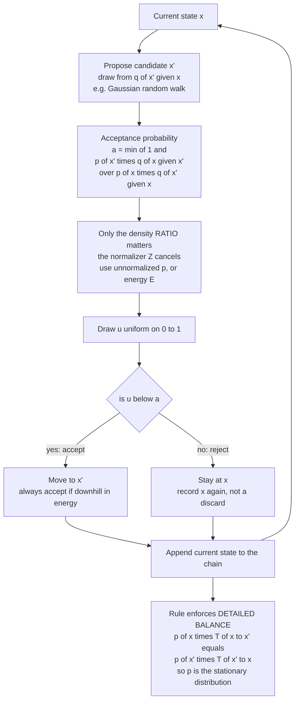

# 🎲 Metropolis-Hastings and Detailed Balance

> [!abstract] TL;DR
> **Metropolis-Hastings** samples *any* distribution $p(x)$ you can only evaluate up to its intractable normalizer $Z$: from the current state it **proposes** a candidate $x'$, then **accepts** the move with probability $\min\!\big[1,\, \tfrac{p(x')\,q(x\mid x')}{p(x)\,q(x'\mid x)}\big]$ — a ratio in which $Z$ *cancels*, so you always accept a downhill (lower-energy) step and only sometimes accept an uphill one. That acceptance rule is engineered to satisfy **detailed balance**, which forces the Markov chain's stationary distribution to be exactly $p$ — the theoretical bedrock of MCMC. Born in 1953 to simulate the Ising model, the same algorithm now drives Bayesian posterior sampling, probabilistic programming, and energy-based-model training, while its slow random-walk mixing in high dimensions is precisely what motivates the gradient-based (Langevin, Hamiltonian) and tempered methods that follow.

---

## Intuition

**Analogy:** Imagine wandering a vast mountain range at night, wanting to spend time at each spot in proportion to how *low* (comfortable) it is. You can't see the whole map — you only ever feel the ground right under you. From where you stand, you pick a random nearby spot and consider moving there. If it's **lower**, you always go. If it's **higher**, you don't refuse outright — you roll dice, going there *sometimes*, with odds that shrink the higher the spot is. This one simple accept-sometimes rule, run forever, magically makes you linger in the valleys exactly as often as the Boltzmann distribution says you should — no matter that you never knew the overall map, and never once measured its total size.

That night-walk *is* Metropolis-Hastings. "How low the ground is" is the **energy** $E(x)$; "how often you should linger there" is the target $p(x) \propto e^{-E(x)}$; "pick a random nearby spot" is the **proposal** $q(x'\mid x)$; and "roll dice, with odds that shrink the higher it is" is the **acceptance probability** $\min[1, e^{-(E(x')-E(x))}]$. The deep trick is that you never needed the total volume under the whole range (the partition function $Z$) — because you only ever compare the height *here* to the height *there*, and in a ratio the total size cancels out. Comparing is easy even when summing is impossible.

---

## How It Works

### Core mechanics

The goal: draw samples from a target $p(x) = \tilde p(x)/Z$ where you can evaluate the **unnormalized** density $\tilde p(x) = e^{-E(x)}$ cheaply, but the **normalizer** $Z = \int e^{-E(x)}\,dx$ is a hopeless high-dimensional integral. Metropolis-Hastings builds a Markov chain whose long-run visiting frequency *is* $p$, using only $\tilde p$.

One step of the chain, given current state $x$:

1. **Propose.** Draw a candidate $x' \sim q(x'\mid x)$ from a **proposal distribution** of your choosing — most commonly a Gaussian centred on the current point, $x' = x + \sigma\,\varepsilon$ (a *random-walk* proposal).
2. **Score the move.** Compute the **acceptance probability**
   $$
   A(x, x') = \min\!\left[\,1,\; \frac{p(x')\,q(x\mid x')}{p(x)\,q(x'\mid x)}\,\right]
            = \min\!\left[\,1,\; \frac{\tilde p(x')\,q(x\mid x')}{\tilde p(x)\,q(x'\mid x)}\,\right].
   $$
3. **Accept or reject.** Draw $u \sim \text{Uniform}(0,1)$. If $u < A(x,x')$, **move** to $x'$; otherwise **stay** at $x$ (and record $x$ *again* — rejections are not discards, they are repeated samples).
4. **Repeat**, appending the current state to the chain each step. After a **burn-in** the recorded states are (correlated) samples from $p$.

**Why $Z$ cancels — the whole point.** The target appears only through the *ratio* $p(x')/p(x) = \tilde p(x')/\tilde p(x)$, and $Z$ divides out identically in numerator and denominator. You never compute, estimate, or even mention $Z$. For a Boltzmann target $\tilde p = e^{-E/T}$ with a **symmetric** proposal the ratio becomes the clean thermal factor
$$
A(x,x') = \min\!\Big[\,1,\; e^{-\big(E(x')-E(x)\big)/T}\,\Big],
$$
i.e. **always accept downhill** ($\Delta E \le 0$), and accept uphill ($\Delta E > 0$) with probability $e^{-\Delta E/T}$ that shrinks as the climb steepens or the temperature cools. This *is* the physics of thermal transitions, and it is exactly how the 1953 Metropolis paper sampled the canonical ensemble.

**Detailed balance — why it provably works.** Write the transition kernel for $x' \ne x$ as $T(x\to x') = q(x'\mid x)\,A(x,x')$. The acceptance rule is *constructed* so that the chain is **reversible** with respect to $p$:
$$
p(x)\,T(x\to x') = p(x')\,T(x'\to x) \qquad\text{(detailed balance).}
$$
To see it, suppose the ratio $r = \tfrac{p(x')q(x\mid x')}{p(x)q(x'\mid x)} \le 1$, so $A(x,x') = r$ and $A(x',x) = 1$. Then the left side is $p(x)\,q(x'\mid x)\,r = p(x')\,q(x\mid x')$, and the right side is $p(x')\,q(x\mid x')\cdot 1$ — equal. (The $r>1$ case is symmetric.) Detailed balance *implies stationarity*: summing (integrating) both sides over $x$ gives $\sum_x p(x)T(x\to x') = p(x')\sum_x T(x'\to x) = p(x')$, so **flow into each state balances flow out** and $p$ is a fixed point of the chain. Add **ergodicity** (irreducibility + aperiodicity — reachable everywhere, no cycles), and the ergodic theorem guarantees the chain converges to $p$ from *any* starting point, with time-averages converging to expectations under $p$. Detailed balance is the engineered guarantee; ergodicity is the reachability condition; together they are why MCMC is correct.

**Metropolis vs Hastings.** The original **Metropolis (1953)** rule assumes a *symmetric* proposal, $q(x'\mid x) = q(x\mid x')$ (true for a Gaussian random walk), so the proposal factors cancel and acceptance is just $\min[1, p(x')/p(x)]$. **Hastings (1970)** generalized this to *asymmetric* proposals by re-introducing the correction factor $q(x\mid x')/q(x'\mid x)$ — the term that keeps detailed balance intact when the proposal is biased (as in independence samplers or gradient-informed proposals). This generalization is what made MCMC a universal tool, and the algorithm was later named one of the top ten of the 20th century.

**The proposal $q$ sets efficiency, not correctness.** *Any* valid $q$ (that can reach the whole support) yields the *same* correct stationary distribution $p$ — the choice of $q$ affects only how *fast* the chain mixes. **Random-walk Metropolis** (Gaussian around the current state) is the simple default; **independence samplers** draw $x'$ from a fixed distribution ignoring $x$; **gradient-informed proposals** (MALA/Langevin, Hamiltonian Monte Carlo) push $x'$ toward higher-probability regions using $\nabla \log p$, dramatically improving mixing in high dimensions. Designing $q$ is the art; detailed balance guarantees the science.

### Flow / Architecture



---

## Key Concepts

**Secondary (intuition-level):** You want to spend time in each place in proportion to how good it is, but you can only compare two places at a time — never the whole map. So you wander: pick a nearby spot, go there for sure if it's better, and only *sometimes* if it's worse. Do this forever and you end up lingering in the good spots exactly the right amount, without ever needing to know the total size of the world. Bigger random steps let you roam faster but get rejected more; tiny steps almost always succeed but crawl.

**Undergraduate (mechanics-level):** The Metropolis-Hastings kernel $T(x\to x') = q(x'\mid x)\min[1, \tfrac{p(x')q(x\mid x')}{p(x)q(x'\mid x)}]$; the normalizer cancels because only $p(x')/p(x)$ enters; symmetric-proposal Metropolis gives $\min[1, e^{-\Delta E/T}]$; detailed balance $p(x)T(x\to x') = p(x')T(x'\to x)$ implies stationarity $\sum_x p(x)T(x\to x') = p(x')$; ergodicity (irreducible + aperiodic) gives convergence and the ergodic theorem for expectations; burn-in, autocorrelation, and effective sample size as the practical diagnostics; step-size tuning between the "too small, high acceptance, slow diffusion" and "too large, low acceptance, stuck" regimes.

**Graduate (structure-level):** Detailed balance (reversibility) as a *sufficient* — not necessary — condition for $p$-invariance, and the reversible kernel's self-adjointness in $L^2(p)$ making its spectrum real, with the second-largest eigenvalue (spectral gap) controlling the relaxation/mixing time; Peskun ordering (less rejection ⇒ smaller asymptotic variance) motivating non-reversible and lifted samplers that *break* detailed balance while preserving stationarity; the Roberts-Gelman-Gilks diffusion limit giving the optimal acceptance rate $\approx 0.234$ for high-dimensional random-walk Metropolis (and $\approx 0.574$ for MALA), with optimal step size scaling as $\sigma \propto d^{-1/2}$ (RWM) vs $d^{-1/3}$ (MALA) — the concrete curse of dimensionality that gradient-informed proposals (Langevin/HMC) and tempering (parallel tempering, simulated tempering) are designed to defeat; adaptive MCMC (Haario, Andrieu-Thoms) that tunes $q$ on the fly while preserving ergodicity via diminishing adaptation.

---

## Python Demo

```python
# Metropolis-Hastings FROM SCRATCH -- numpy + matplotlib.
#   (a) Sample a 1D BIMODAL target known only up to a constant. The energy
#       ratio drives acceptance; the normalizer Z NEVER appears. Compare the
#       sampled histogram against the true (normalized) density.
#   (b) PROPOSAL TUNING in d dimensions: sweep the random-walk step size and
#       watch acceptance rate vs mixing efficiency -- too small (crawls),
#       too large (stuck), well tuned (optimal acceptance near ~0.234).
#   (c) VERIFY detailed balance and stationarity numerically on a small
#       discrete target by building the exact MH transition matrix.
import numpy as np
import matplotlib.pyplot as plt
rng = np.random.default_rng(0)

# =====================================================================
# (a) MH on a 1D bimodal target p(x) ~ exp(-E(x)),  Z never computed.
# =====================================================================
def energy(x):
    # two wells at x = -2 and x = +2  ->  p ∝ exp(-E) is bimodal
    return -np.log(np.exp(-0.5 * (x + 2.0) ** 2) + np.exp(-0.5 * (x - 2.0) ** 2))

def mh_1d(energy, n, step, x0=0.0):
    x, Ex = x0, energy(x0)
    xs = np.empty(n)
    n_acc = 0
    for i in range(n):
        xp = x + step * rng.normal()                 # symmetric Gaussian random walk
        Exp = energy(xp)
        # symmetric proposal q cancels -> accept w.p. min(1, exp(-(E'-E)));  Z is absent
        if np.log(rng.random()) < (Ex - Exp):
            x, Ex, n_acc = xp, Exp, n_acc + 1
        xs[i] = x
    return xs, n_acc / n

samples, acc_a = mh_1d(energy, 40000, step=2.5)
grid = np.linspace(-6, 6, 400)
true = np.exp(-energy(grid))
true /= np.trapz(true, grid)                          # normalized ONLY for the plot
print(f"(a) acceptance rate = {acc_a:.3f}   sample mean = {samples.mean():+.3f} (target 0)")

# =====================================================================
# (b) Proposal tuning: target = standard Gaussian N(0, I_d), E = 0.5||x||^2.
# =====================================================================
d = 10
def mh_nd(step, n=8000, d=10):
    x = rng.normal(size=d)
    Ex = 0.5 * x @ x
    chain = np.empty((n, d))
    n_acc = 0
    for i in range(n):
        xp = x + step * rng.normal(size=d)
        Exp = 0.5 * xp @ xp
        if np.log(rng.random()) < (Ex - Exp):
            x, Ex, n_acc = xp, Exp, n_acc + 1
        chain[i] = x
    return chain, n_acc / n

def autocorr_time(z, maxlag=400):
    z = z - z.mean()
    var = z.var()
    if var == 0:
        return np.inf
    tau = 1.0
    for k in range(1, maxlag):
        ck = np.mean(z[:-k] * z[k:]) / var
        if ck < 0.05:
            break
        tau += 2.0 * ck                                # integrated autocorrelation time
    return tau

steps = np.logspace(-1.3, 1.0, 18)                     # ~0.05 up to ~10
accs, effs = [], []
for s in steps:
    ch, a = mh_nd(s)
    tau = autocorr_time(ch[2000:, 0])                  # one coordinate, after burn-in
    accs.append(a)
    effs.append(1.0 / tau)                             # effective samples per step (higher = better)
accs, effs = np.array(accs), np.array(effs)
best = int(np.argmax(effs))
print(f"(b) best step = {steps[best]:.3f}  ->  acceptance = {accs[best]:.3f}  (theory ~0.234)")

# three regimes for the trace panel
tr_small, _ = mh_nd(0.1)     # too small: nearly always accepted, crawls
tr_tuned, at = mh_nd(steps[best])
tr_large, _ = mh_nd(8.0)     # too large: nearly always rejected, gets stuck

# =====================================================================
# (c) Numeric detailed-balance & stationarity check on a discrete target.
# =====================================================================
Etilde = np.array([0.0, 1.0, 0.3, 2.0, 0.7])           # unnormalized energies
p = np.exp(-Etilde); p /= p.sum()                      # target (normalized only to test)
S = len(p)
Q = np.full((S, S), 1.0 / (S - 1)); np.fill_diagonal(Q, 0.0)   # symmetric uniform proposal
T = np.zeros((S, S))
for i in range(S):
    for j in range(S):
        if i != j:
            a_ij = min(1.0, np.exp(-(Etilde[j] - Etilde[i])))  # Q symmetric -> energy ratio only
            T[i, j] = Q[i, j] * a_ij
    T[i, i] = 1.0 - T[i].sum()                          # reject-probability self-loop
flux = p[:, None] * T
db_residual = np.max(np.abs(flux - flux.T))            # detailed balance: p_i T_ij == p_j T_ji
stat_residual = np.max(np.abs(p @ T - p))             # stationarity: p T == p
print(f"(c) detailed-balance residual = {db_residual:.2e}   stationarity residual = {stat_residual:.2e}")

# =====================================================================
# Plots
# =====================================================================
fig, ax = plt.subplots(2, 2, figsize=(13, 10))

ax[0, 0].hist(samples, bins=80, density=True, alpha=0.45, color="steelblue", label="MH samples")
ax[0, 0].plot(grid, true, "r", lw=2, label="true p(x), Z-free sampling")
ax[0, 0].set_title(f"(a) MH on a bimodal target  (accept {acc_a:.2f}, Z never used)")
ax[0, 0].set_xlabel("x"); ax[0, 0].set_ylabel("density"); ax[0, 0].legend()

ax[0, 1].semilogx(steps, accs, "o-", color="darkorange", label="acceptance rate")
ax[0, 1].axhline(0.234, ls="--", color="gray", label="0.234 rule of thumb")
ax[0, 1].axvline(steps[best], ls=":", color="green", label="most efficient step")
ax[0, 1].set_title("(b) Acceptance rate vs step size")
ax[0, 1].set_xlabel("proposal step size"); ax[0, 1].set_ylabel("acceptance rate"); ax[0, 1].legend()

ax[1, 0].plot(accs, effs, "o-", color="purple")
ax[1, 0].axvline(0.234, ls="--", color="gray", label="0.234")
ax[1, 0].set_title("(b) Mixing efficiency peaks at intermediate acceptance")
ax[1, 0].set_xlabel("acceptance rate"); ax[1, 0].set_ylabel("effective samples / step"); ax[1, 0].legend()

ax[1, 1].plot(tr_small[:600, 0], color="crimson", alpha=0.8, label="too small (crawls)")
ax[1, 1].plot(tr_tuned[:600, 0], color="green", alpha=0.8, label=f"tuned (accept {at:.2f})")
ax[1, 1].plot(tr_large[:600, 0], color="navy", alpha=0.8, label="too large (stuck)")
ax[1, 1].set_title("(b) Trace of coordinate 0: mixing quality")
ax[1, 1].set_xlabel("MCMC step"); ax[1, 1].set_ylabel("x[0]"); ax[1, 1].legend()

plt.tight_layout()
plt.savefig("metropolis_hastings.png", dpi=120)
```

Panel (a) shows the sampler reproducing a two-well target while touching only the *ratio* $e^{-(E'-E)}$ — the partition function is nowhere in the code, yet the histogram matches the true density. Panel (b, top-right) traces the fundamental trade-off: tiny steps are almost always accepted (near 100%) but the chain barely moves, huge steps are almost always rejected (near 0%), and the acceptance rate slides monotonically between them; the *most efficient* step (green line) lands near the classic $\approx 0.234$ acceptance rate for high-dimensional random-walk Metropolis. Panel (b, bottom-left) makes the efficiency-vs-acceptance curve explicit — a hump that peaks at intermediate acceptance, not at the extremes. Panel (b, bottom-right) is the same story visually: the crimson "too small" trace crawls (high autocorrelation), the navy "too large" trace freezes on long flat plateaus of rejection, and the green tuned trace explores freely. Part (c) prints detailed-balance and stationarity residuals at machine-epsilon — a direct numerical confirmation that the engineered acceptance rule makes $p$ the exact stationary distribution of the chain.

---

## Real-World Applications

- **Statistical-physics simulation.** The algorithm's birthplace: sampling the canonical ensemble of the **Ising model**, spin glasses, lattice gases, and molecular Monte Carlo, where $Z$ is a sum over exponentially many configurations and only energy *differences* are ever needed. Metropolis Monte Carlo remains a workhorse of condensed-matter and materials simulation.
- **Bayesian inference and probabilistic programming.** MH samples posteriors $p(\theta\mid \text{data}) \propto p(\text{data}\mid\theta)\,p(\theta)$ whose evidence (normalizer) is intractable — the foundational building block behind **Stan**, **PyMC**, and **emcee**, even though gradient-based **HMC/NUTS** are now preferred for smooth continuous models.
- **Training energy-based models.** The "negative phase" of maximum-likelihood EBM training needs samples from the model's own Boltzmann distribution $p_\theta(x)\propto e^{-E_\theta(x)}$; MH (and its Langevin/Gibbs relatives) supply them without ever forming $Z$.
- **Computational chemistry and structural biology.** Monte Carlo conformational sampling of molecules and proteins, docking, and free-energy calculations lean on Metropolis acceptance to explore rugged energy landscapes.
- **Combinatorial optimization via annealing.** Coupling MH to a cooling temperature schedule gives **simulated annealing** for VLSI placement, the travelling-salesman problem, and scheduling — sampling $e^{-E/T}$ while $T\to 0$ concentrates mass on the global minimum.
- **Phylogenetics, astronomy, and epidemiology.** MrBayes samples evolutionary trees, cosmological parameter estimation samples the CMB likelihood, and disease-model posteriors are all explored with Metropolis-Hastings variants.

---

## Common Pitfalls

- **Confusing acceptance rate with correctness.** A 95% acceptance rate feels "healthy" but usually signals steps so tiny the chain barely moves — high autocorrelation, tiny effective sample size. Correctness is guaranteed for *any* valid proposal; *efficiency* is what you are tuning. Aim for intermediate acceptance ($\approx 0.234$ high-dim RWM, $\approx 0.44$ in 1D, $\approx 0.574$ MALA).
- **Treating rejections as discards.** On rejection you must **record the current state again**. Dropping rejected steps biases the sample away from the sharp, high-probability regions that reject most incoming proposals — silently corrupting the stationary distribution.
- **Too little burn-in / no convergence check.** The chain samples $p$ only *after* it forgets its start. Reporting early samples, or a single short chain, hides non-convergence. Run multiple chains from dispersed starts and check the Gelman-Rubin $\hat R$ and effective sample size; never trust a lone trace.
- **Slow mixing in high dimensions and across modes.** Random-walk MH scales badly (optimal step $\propto d^{-1/2}$) and gets *trapped in one mode* of a multimodal target, never crossing the low-probability barrier between modes — so it silently reports a unimodal posterior. Use gradient-informed proposals (Langevin/HMC), tempering / parallel tempering, or mode-jumping proposals.
- **Forgetting the Hastings correction with asymmetric proposals.** If $q(x'\mid x)\ne q(x\mid x')$ (independence samplers, drift/gradient proposals) you *must* include the factor $q(x\mid x')/q(x'\mid x)$. Dropping it breaks detailed balance and the chain converges to the *wrong* distribution — a subtle, silent bug.
- **Working in probability instead of log-space.** Forming $\tilde p(x')/\tilde p(x)$ directly overflows or underflows; compute the log-ratio $\log\tilde p(x') - \log\tilde p(x) = -(E(x')-E(x))$ and compare against $\log u$, as in the demo.
- **Naive adaptation that breaks ergodicity.** Continuously tuning the proposal using the whole history can destroy the stationary distribution; valid adaptive MCMC requires *diminishing* adaptation (Andrieu-Thoms) so the kernel eventually stops changing.

---

## Related Concepts

- [[The_Metropolis_Algorithm_and_MCMC]] — the physics-framed companion: the same algorithm applied to the canonical ensemble and Monte Carlo simulation; this note is the general algorithm plus the detailed-balance theory.
- [[The_Boltzmann_Distribution_in_Learning]] — the $p\propto e^{-E/T}$ target MH is built to sample; supplies the energy-ratio acceptance factor.
- [[Statistical_Mechanics_of_Machine_Learning_Overview]] — the parent survey placing MCMC inside the statistical-mechanics/ML correspondence.
- [[Energy_Based_Models]] — MH (and Langevin/Gibbs) supply the "negative phase" samples that make EBM training possible.
- [[Boltzmann_Machines_and_RBMs]] — stochastic EBMs whose training and inference lean on MCMC sampling of a Boltzmann target.
- [[Markov_Chains]] — the stationary-distribution, irreducibility, and ergodicity theory that guarantees MH converges.
- [[Bayesian_Statistics]] — the posteriors with intractable evidence that MH was adopted to sample.
- [[Classical_Statistical_Mechanics]] — the canonical ensemble and Gibbs measure MH imports wholesale from physics.
- [[The_Ising_Model_and_Statistical_Physics]] — the prototype target: MH was invented in 1953 to simulate exactly this model.
- [[Monte_Carlo_Integration]] — MH turns intractable expectations under $p$ into sample averages along the chain.
- [[Stochastic_Differential_Equations_and_Langevin]] — the gradient-informed (Langevin/MALA) proposals that fix random-walk MH's high-dimensional slowness.
- [[Maximum_Entropy_Principle]] — why the Boltzmann/exponential target has the form MH samples.
- [[Probability_and_Statistics]] — the transition kernels, expectations, and convergence notions underlying the method.

Foreshadowing the not-yet-written siblings in this section: *MCMC_Sampling_in_Machine_Learning* frames the broader family; *Gibbs_Sampling_and_Conditional_Updates* is the coordinate-wise special case with acceptance always one; *Langevin_Dynamics_and_SGLD* and Hamiltonian Monte Carlo are the gradient-informed successors that defeat random-walk mixing; *Simulated_Annealing_and_Global_Optimization* couples MH acceptance to a cooling schedule for optimization.

---

## Review Questions

1. **(Conceptual)** Starting from the requirement that $p$ be the chain's stationary distribution, show that the Metropolis-Hastings acceptance probability $\min[1, \tfrac{p(x')q(x\mid x')}{p(x)q(x'\mid x)}]$ satisfies detailed balance, and explain why detailed balance *implies* stationarity. Why does the intractable normalizer $Z$ never enter this argument?
2. **(Scenario)** You run random-walk Metropolis on a 50-dimensional posterior and observe a 92% acceptance rate, yet your effective sample size is tiny and two independent chains disagree. Diagnose what is happening, state which direction you would move the step size and why, and name two *structurally different* algorithms you would switch to if the target were (a) high-dimensional but smooth, or (b) strongly multimodal.
3. **(Trade-off)** Metropolis-Hastings is "general, simple, and provably correct" yet is often abandoned for HMC/NUTS in practice. Explain the specific weakness (with the $d^{-1/2}$ step-size scaling and $\approx 0.234$ acceptance result) that makes random-walk MH inefficient in high dimensions, how gradient-informed proposals overcome it, and what price they pay in return.

---

## Sources

- N. Metropolis, A. W. Rosenbluth, M. N. Rosenbluth, A. H. Teller, E. Teller, "Equation of State Calculations by Fast Computing Machines," *Journal of Chemical Physics* 21(6):1087–1092 (1953). [link](https://doi.org/10.1063/1.1699114)
- W. K. Hastings, "Monte Carlo Sampling Methods Using Markov Chains and Their Applications," *Biometrika* 57(1):97–109 (1970). [link](https://doi.org/10.1093/biomet/57.1.97)
- G. O. Roberts, A. Gelman, W. R. Gilks, "Weak Convergence and Optimal Scaling of Random Walk Metropolis Algorithms," *Annals of Applied Probability* 7(1):110–120 (1997). [link](https://doi.org/10.1214/aoap/1034625254)
- C. P. Robert, G. Casella, *Monte Carlo Statistical Methods*, 2nd ed., Springer (2004). [link](https://doi.org/10.1007/978-1-4757-4145-2)
- S. Brooks, A. Gelman, G. Jones, X.-L. Meng (eds.), *Handbook of Markov Chain Monte Carlo*, Chapman & Hall/CRC (2011). [link](https://www.mcmchandbook.net/)

---

#statistical-mechanics #machine-learning #metropolis-hastings #detailed-balance #mcmc
